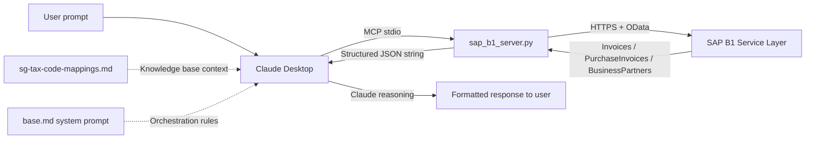

# AgentAssist — Technical State and Methodology Documentation

---

## Document purpose and scope

This document is a technical audit of the AgentAssist repository, produced on 2026-05-26 by
inspection of every source file, configuration file, experimental log, and test artefact in
the repository at that date. It is intended to serve as a self-contained reference for internal
decision-making and as grounding material for subsequent strategy conversations. It does not
presuppose familiarity with any prior conversation about the project.

The audit covers: repository structure and completeness, MCP tool implementation, knowledge base
content and accuracy, system prompt design, experimental methodology and evidence quality,
production readiness gaps, and security and data handling. It surfaces findings honestly,
including inconsistencies and gaps, regardless of how they reflect on the current state of the
work.

The repository is at `C:\Users\terry\Desktop\AgentAssist\sap-b1-ai-agent`. T1.1–T1.6 are on
`master`. T2.7 (Reg 26/27 reasoning pass) and T2.8 (source-document cross-reference) are on
`master` (merged 2026-06-09 from branches `t2.7-reasoning-reg2627` and
`t2.8-document-ingestion` respectively).

---

## Executive summary

**What has been built**

A functional three-layer AI compliance assistant for Singapore GST F5 preparation and
transaction review. The system consists of: (1) a custom Python MCP server providing 14 tools
for SAP B1 Service Layer access, including three purpose-built GST accounting tools; (2) a
curated knowledge base documenting Singapore VatGroup-to-F5-box routing rules with IRAS
citations; and (3) a system prompt enforcing procedural constraints, output format, and
environment awareness. The system runs locally via Claude Desktop on the developer's Windows
machine connected to a cloud-hosted SAP B1 SBODEMOSG demo database.

Two infrastructure layers have since been added. T1.3 (2026-05-31, `master`) delivered a
per-client YAML config system (`config/loader.py`, `config/clients/`) with credential
resolution, GST-rate sanity checking, VatGroup-collision detection, and an SAP connectivity
probe. T1.6 (2026-06-01, branch `t1.6-orchestration-chain`) replaced Claude's conversational
tool selection with a deterministic six-step orchestration chain (`orchestrator/`) gated by
five pure-Python reconciliation checks; the chain runs as
`python run_agent.py --client sbodemosg --period 2024-07-01 2024-09-30` and writes structured
JSON output to `exploration-notes/t1.6-tool-outputs/`.

**What has been validated**

A four-version controlled experiment was run against Q3 2024 data from SBODEMOSG. Two of the
three defined tests have been completed for all four versions. Test 1 (F5 calculation) and
Test 2 (tax code classification) both achieve 10/10 at v3, demonstrating zero arithmetic error
and perfect VatGroup recall. The v0 baseline comparison is well-documented: plain Claude
produced an SGD 3,480 overpayment figure for Box 8 and invented a "critical" compliance
finding (the 7%/9% rate gap) that would have caused material harm if acted upon. Both failures
are traceable to specific architectural gaps that the system prompt and custom tools subsequently
closed.

Test 3 has now been completed for all four versions (V0, V1, V2, V3).
V3 achieves 10/10. The full V0 → V3 trajectory across all three tests
is 12/30 → 13/30 → 25/30 → 30/30. The V1 → V2 Test 3 delta (+6) is the
most informative single result in the experiment: it isolates the
incremental contribution of the system prompt, including elimination
of the V1 F7 filing fabrication and a structural shift from narrative
spot-check methodology to population-level analysis. See
exploration-notes/baseline-test-results.md for full per-test scoring
and the V1/V2 Test 3 Reclassification Note documenting a methodological
contamination discovery.

Two post-experiment implementation tasks have since been completed. T1.2
(2026-05-27) resolved the NR VatGroup inconsistency: NR is now excluded from
Box 5 per IRAS para 5.11(o) across tool code, reference script, and system
prompt, with a known E2 fixture (DocNum 611) seeded for validation. T1.1
(2026-05-28) added credit note support: all three custom tools now fetch
CreditNotes and PurchaseCreditNotes and subtract their line amounts from the
relevant F5 boxes, with two seed credit notes validating the implementation.

**What is genuinely production-ready versus prototype**

Production-ready: the VatGroup → F5 box mapping logic, the FX exclusion and E1 detection
logic, the pagination handling, and the system prompt's orchestration rules. These are
implemented cleanly, tested against reference figures, and produce correct output.

Prototype only: the overall delivery mechanism (Claude Desktop + stdio). Per-client
configuration is resolved (T1.3). The deterministic orchestration chain (T1.6) replaces
Claude's conversational tool selection and produces structured JSON. Report generation is
resolved (T1.4, 2026-06-01): the `report/` package consumes `CompileOutput` and renders a
signed PDF deliverable; `python run_agent.py --client <id> --period <start> <end>` triggers
it end-to-end (no `--report` flag; the PDF is always generated as part of the always-seal
behaviour introduced in T1.5). Audit trail is resolved (T1.5, 2026-06-02): every successful
run produces a sealed, tamper-evident bundle under `audit/<client_id>/`.

Test 3 capability is now validated at 10/10 on SBODEMOSG Q3 2024. T2.7 (on master) added the Reg 26/27 reasoning pass — built and flag-gated, unvalidated pending T2.11. T2.8 (on master) added the source-document cross-reference pre-pass — built and flag-gated, B1 attachment byte-download unverified (upload path working), unvalidated pending T2.11. T2.9 (on master, 2026-06-09) added declared-vs-computed F5 checks (`orchestrator/check_declared_f5.py`): Check A (declared internal consistency) + Check B (declared-vs-computed per independent box, `--declared-f5` flag, off by default); $1.00 per-box tolerance is a **materiality floor** grounded in IRAS ASK Annual Review Guide s10.1(d)(iii) fn33 — NOT a confirmed IRAS F5 filing rounding convention (the convention could not be verified against IRAS source); findings not gates; does not affect F5 boxes. T2.9-V (on master, 2026-06-10) validated the declared-vs-computed mechanism end-to-end on SBODEMOSG Q3 2024: three isolated fixtures (Check A isolation, Check B isolation, control), 22 assertions, box-isolation held, report section renders (Check A/B findings in PDF/text when `--declared-f5` supplied with divergences; Section 6 "Not Examined" retains the placeholder when absent — correct behaviour). **$1.00 tolerance remains a materiality floor, NOT a confirmed IRAS F5 rounding convention — rounding-convention confirmation is a pending cousin task; a surfaced divergence is a candidate, not a confirmed discrepancy.** T2.13 (on master, 2026-06-09) built and blank-labelled the Reg 26/27 validation dataset (`reg2627-representative-v1.json` + `reg2627-adversarial-v1.json`); `expected_candidate` fields are present but empty awaiting independent specialist review; `validation_status` stays `"unvalidated"`; T2.11 remains the binding constraint; `show_ai_candidates` stays `False`. T2.10-V (on master, 2026-06-10) validated the listing-checks detection path end-to-end via crafted-input full-chain: SEQ_GAP (DocNum 8002 truly-absent FLAGGED; 8003 within-range-but-present-company-wide NOT flagged — the period-boundary discriminating case; 8001/8004 not gaps), DUP_CLAIM (dup pair 7001/7002 flagged; near-miss 7003 different NumAtCard not flagged), both Not-Examined lines suppressed independently when findings present, box-isolation held. Live read-only FP check on SBODEMOSG Q3 2024 (1005 sales / 624 purchase headers company-wide): zero SEQ_GAP, zero DUP_CLAIM. **SBODEMOSG is a demo/synthetic DB — NOT real-client validation.** `validation_status` and `show_ai_candidates` unchanged. CI/test-infra self-provisioning (commit 40112ca, 2026-06-10): session-scoped autouse conftest fixture auto-generates gitignored PDF fixtures via `generate_invoices.py` (loaded by file path); `pdfplumber` added to `requirements.txt`; suite verified green on clean checkouts (no API key needed); diagnosis archived at `exploration-notes/infra/ci-fixture-diagnosis-20260610.md`. Report section header renamed to "Invoice Listing Completeness Checks" (commit 958ed3d — internal task ID removed from client-facing PDF; no functional change). Synthetic demo scenario committed at `exploration-notes/demo-scenario/` (commit 8b60d87): crafted SEQ_GAP/DUP_CLAIM/declared-F5 injections over a live SBODEMOSG Q3 2024 run, 10 self-verification assertions, disclosure README. **SYNTHETIC showcase — NOT real-client validation.** Check A float-robustness (commit 40c9024): declared-F5 internal-consistency comparisons (Box 4 == Box 1+Box 2+Box 3; Box 8 == Box 6−Box 7) now use cent-quantized `Decimal` comparison (`ROUND_HALF_UP`) instead of exact float equality — eliminates IEEE-754 sub-cent false positives; off-by-one-cent still flags; Check B and its $1.00 tolerance unchanged; 5 new `[A-FP]` tests. Report styling normalized (commit ae76578, merged via PR #4 as `d9c670c`): shared style palette in `report/render.py` — redundant `_META` removed, AI heading rhythm normalized, duplicated AI `TableStyle` blocks replaced by `_ai_table_style()` helper; content invariant (byte-identical text extraction); client-visible change: minor spacing only. 
T2.19 (**merged to master** via PR #8, merge `5d91fdc`, feat commit `3cc379c`; originally on branch `t2.2-vat-discovery`) added a tax code normalization layer: `normalize_vat_group()` in `sap_b1_server.py` translates source-system tax codes (e.g. Xero `OUTPUT`/`INPUT`) to canonical AgentAssist VatGroup codes (`SO`/`SI`) before F5-box routing or E1–E4 detection; `tax_code_mappings`/`source_system` added to `ClientConfig` (validated at load time) and to the audit-bundle allow-list. 28 new synthetic-fixture tests, zero network calls. SAP B1 clients unaffected — `sbodemosg.yaml` carries no mappings, so `normalize_vat_group()` is a no-op passthrough and all baseline figures are unchanged; the layer runs in the chain but is passthrough for SBODEMOSG, so the T2.12a replay oracle (captured with the layer present-but-passthrough) is unaffected. **Validated on synthetic fixtures only (`tests/test_tax_code_normalization.py`, `tests/fixtures/chain-run-normalization-sample.json`); not yet tested against a real non-SAP-B1 client.** The same pair of commits also fixed a PDF test-fixture infrastructure gap: a fresh-checkout pytest run found 209 pre-existing `FileNotFoundError` failures because the 8 generated fixture PDFs (`tests/fixtures/documents/INV-3001.pdf`…`INV-3008.pdf`) were excluded by a blanket `*.pdf` rule in `.gitignore` — this appears to contradict the "verified green on clean checkouts" claim above for commit 40112ca. Fixed by adding a `!tests/fixtures/documents/*.pdf` negation to `.gitignore` and committing the 8 PDFs, plus a new `.gitattributes` (`*.pdf binary`) to prevent Git CRLF corruption of the binary fixtures under `core.autocrlf=true`. Current test state: **1184 passed, 0 failed, 1 skipped**.
T2.16 (on master, 2026-06-11) added the annual analytical review TP/TS ratio pass (`orchestrator/check_analytical_review.py`): FY TP/TS ratio (Box 5 ÷ Box 4 > 1.2), opt-in `--analytical-review` flag, Annual Analytical Review report section; demo-validated on SBODEMOSG (live FY ratio, box-isolation, >1.2 flag-fire via crafted input); RC/OVR approximation caveat (Boxes 14–16 not computed); NOT real-client validated; findings not gates. T2.17 (on master, 2026-06-11) added period-over-period fluctuation detection (`orchestrator/check_period_fluctuation.py`): QoQ movements in Boxes 1/2/3/5, ±50% non-regulatory surfacing threshold; wired into the Annual Analytical Review section (T2.17b, PR #7); demo-validated on SBODEMOSG (live FY render, Q4 all-zero excluded, box-isolation); surfaces candidates, never asserts; NOT real-client validated. Test state after T2.16+T2.17: **1211 passed, 1 skipped**.
T5.2a (on master, 2026-06-12, PR #12) built the action-tier enforcement core (`agent/` package): Tier enum + ToolSpec/CheckSpec/LedgerEntry/ProposalArtifact/RunBudget schemas; tool registry (8 tools: 4 Tier-0 read-only, 4 Tier-1 staging, zero Tier-2-executing); justification gate (heuristic backstop + ledger write BEFORE allow); append-only hash-chained justification ledger (reuses `canonical.py` primitives); Tier-2 proposal artifact + StagingStore (CLI-first approval mechanism); deterministic executor framework (`test_noop` hermetic handler + documented NotImplemented stubs for `seal`/`emit`, deferred T5.3); RunBudget with BudgetExceededSignal routing to invariant-7 non-blocking path. CheckSpec schema is v0/PROVISIONAL — 14 entries spanning E1/E2/E3/E4/NO_GST_REG/COMPLETENESS/SEQ_GAP/DUP_CLAIM/declared_A/declared_B/gst_amount_mismatch/correct_period/total_inconsistency/reg11_supplier_gst_absent; NOT wired to any consumer; Collin ratifies schema after T2.18 lands. Zero `anthropic` import in `agent/`; stdlib only. 89 new tests (T-1 through T-10). Test state after T5.2a: **1328 passed, 1 skipped**.
T5.2b (on master, 2026-06-12, PR #13) added the SDK integration surface: `agent/hooks.py` (`make_hooks(ledger)` → PreToolUse/PostToolUse callbacks; Tier-3 → deny tool-not-found; Tier-1 → justification gate with ledger write BEFORE allow; Tier-0 → always allow + ledger entry; PostToolUse → audit_log separate from sealed chain, whether execution outcomes enter the sealed ledger deferred to T5.3); `agent/harness.py` (`build_options(ledger, budget)` → ClaudeAgentOptions with Tier-0/1 tools + hooks wired; SDK import deferred); `agent/approve_cli.py` (list/show/approve/reject library + argparse CLI over StagingStore + Executor); `agent/ledger.py` extended with `Ledger.from_entries(list[dict])` for sealed-JSON reload; `audit_bundle/seal.py` extended with `agent_ledger=None` parameter — writes `steps/agent-ledger.json` covered by the manifest root-hash. First runtime dependency: `claude-agent-sdk==0.2.99` added to `requirements.txt`. **Cross-platform note** (corrected D11, 2026-06-14 — see §T5.2b): on `ubuntu-latest` pip selects the `manylinux` wheel, which BUNDLES the Linux `claude` binary (`_bundled/claude`), so `pip install` auto-provisions it — no npm/`cli_path`/env var; import-only works without the binary; there is no musllinux wheel, so keep CI on glibc. 44 new tests (T-1 through T-8). **Honest status: cage built + hermetically unit-tested; NO live agent loop; `seal`/`emit` executor handlers are NotImplemented stubs deferred to T5.3. NOT demo-validated.** Current test state: **1372 passed, 1 skipped**.
T5.1 (on master, 2026-06-12, merge commit `e30f795`) extracted the full GST review pipeline from `run_agent.py` into `engine/review.py` as one atomic callable: `review(client_config, period, inputs) → ReviewResult`. `ReviewInputs` (4 fields: `line_source`, `provider`, `declared_f5`, `analytical_review`) is the forward-compatible source-adapter seam — SAP B1 wired today via `fetch_si_purchase_lines`; a T2.12 CSV/Excel adapter substitutes a different `line_source` callable without changing `review()`'s signature. `ReviewResult` carries 11 fields including `analytical_review_data`. `GateHalt(message, checked)` is a plain serialisable record replacing the live `GateFailure` exception in the result. `run_agent.py` reduced to a thin CLI; no pipeline logic remains there. `review()` is SILENT — caller prints from the returned result. `engine/__init__.py` re-exports `ReviewResult`, `ReviewInputs`, `GateHalt` but intentionally does NOT re-export `review` itself (re-exporting would shadow the `engine.review` submodule attribute and break `patch("engine.review.run_chain", …)` in tests). Import-scan gate extended to bar `orchestrator/` from importing `engine/` (dependency direction: `engine/ → orchestrator/`, never reverse). **Honest qualifier:** behavior-preserving refactor; built + unit-tested (15 new tests in `tests/test_engine_review.py`); stdout content-equivalent to prior inline wiring (same lines, same exit codes; NOT byte-identical interleaving — mid-run progress lines now print after `review()` returns); NOT demo-validated end-to-end (live SBODEMOSG CLI run pending/Terry-supervised); no agent loop (T5.3); nothing customer-facing changes until T2.11. Current test state: **1387 passed, 1 skipped**.
T5.3 Slice 1 (on master, 2026-06-14, merge `458e33b`) plumbed the engine into the cage: `agent/engine_tool.py` exposes the deterministic `review()` pipeline as ONE atomic MCP tool (`mcp__engine__run_review_chain`) — no sub-step (run_chain / gate / seal) is reachable; the MCP-prefix-aware `get_tier()` resolves it back to the Tier-1 `run_review_chain` registry entry so the justification gate applies. `agent/executor.py::make_tier2_handlers` builds real `seal_bundle`/`emit_final_pdf` handlers wired via `extra_handlers` (defaults stay NotImplemented) that fire ONLY on `status="approved"`. Three new Tier-0 dossier reads added (`get_source_document`, `read_vendor_gst_status`, `read_prior_period_treatment`). **SEALED-CHAIN routing (locked):** Tier-2 outcome-bearing executions (post-approval seal/emit) append to the sealed hash-chained agent-ledger; Tier-0 reads stay in the separate unsealed `audit_log`. +21 tests. Test state after Slice 1: **1408 passed, 1 skipped**.
T5.3 Slice 2 (on master, 2026-06-14, PR #17) built the live case-file loop: `agent/loop.py::run_casefile_loop` is a plain-Python gather→act→verify driver — the model is invoked WITHIN it (via an injected `AgentTransport`) and NEVER drives it; the deterministic completeness checklist and `RunBudget` decide termination. Verification is a CODE-DEFINED completeness checklist keyed to `CheckSpec.inputs_needed` (`agent/completeness.py`) — never model self-assessment; `agent/lint.py` is a deterministic language-lint (brittle backstop, not a replacement for the structural cage); `agent/dossier.py` adds the `DossierArtifact` schema + finding extraction; `agent/proposals.py` gains the additive `compute_inputs_hash` shared by dossier ⇄ proposal. The loop can ONLY ever stage a PENDING proposal (no Tier-2 tool exists); `cost_usd_used` is written to the ledger as the auditable cost-per-review COGS field; budget-exceeded routes non-blocking (Invariant 7); a poisoned PDF can at worst become a PENDING proposal a human reads — nothing is sealed or emitted. +38 tests (branch `t5.3b-casefile-loop` standalone off the 1408 base: 1446 passed, 1 skipped; combined with T5.7a on master → 1479).
T5.7a (on master, 2026-06-14, PR #16) built the agent-behaviour eval harness (`agent/eval/`): `FakeTransport` (a concrete subclass of the SDK `Transport` ABC) replays scripted streams with zero tokens / zero binary; the runner drives the REAL cage (build_options + the Slice-1 engine server, hooks-only, engine invoker bound to a tripwire); four cage-invariant metrics (justification-gate hold, zero Tier-2 self-execution, Tier-3 denial, sealed-chain routing integrity) score an adversarial scenario library; `report.py` renders a scorecard with DEFERRED rows reserved for T5.7b. **Honest:** this is measurement infra — it gates "built → validated" for the cage invariants but is NOT itself loop validation; the two loop-quality metrics (dossier completeness rate, language-lint pass rate) are deferred to T5.7b. +33 tests. T5.7b (on master, 2026-06-14, PR #18) then filled those two DEFERRED rows: `dossier_completeness_rate` + `language_lint_pass_rate`, measured by driving the REAL Slice-2 `run_casefile_loop` over a hermetic `ScriptedLoopTransport` (distinct from T5.7a's SDK-ABC `FakeTransport` — the loop transport never touches the SDK), so the scorecard now has **6 rows** (4 cage + 2 loop); `make_hooks` now exposes `audit_log` via a public `.audit_log` handle on the PostToolUse callback (additive; the runner no longer introspects `__closure__`). +20 tests. T5.3c (on master, 2026-06-15, PR #21, commit `5cb9fd3`) then added the live-model `AgentTransport` adapter (`agent/live_transport.py`): `LiveAgentTransport` maps a `claude_agent_sdk.query()` stream → the loop's `AgentEvent`s (`ToolUseBlock→ToolUseEvent`, `TextBlock→FramingEvent`, `ResultMessage→ResultEvent(cost_usd=total_cost_usd)`); relay-only (invoke-never-perform preserved, no new tools, no Tier-2 surface); opt-in factory `make_live_transport` gated behind env `AGENT_LIVE_TRANSPORT`; SDK import confined + deferred to call time. This unblocks T5.3-V (the supervised, opt-in live run — still separate). +14 tests (mocked SDK stream, no model/binary/tokens). **All of T5.3/T5.3c + T5.7a + T5.7b is built + hermetically tested, NOT live-validated; T5.3c is mock-tested only (the live run is the separate supervised T5.3-V); the loop-quality metrics pass on SCRIPTED scenarios, NOT real-data validation; nothing customer-facing until T2.11.** **T5.7c (ledger-name parity)** (on master 2026-06-16, branch `t5.7b-ledger-name-parity`, PR #32, commit `67c8f09`) normalized the agent test fakes to emit **namespaced `mcp__reads__<tool>`** ledger names matching the live loop's PreToolUse-recorded `tool_name`, anchored to the round-2 live-evidence literals cross-checked against the shipping `READ_TOOLS_QUALIFIED` constant (resolved via `qualified_read_name`); **slot lookups still resolve on the bare name, so the T5.3g slot binding (`completeness.py` / `READ_TOOL_SLOT`) is byte-unchanged**; +5 tests; hermetic — not live-model validation. (The `t5.7b-` branch label collides with the earlier loop-quality **T5.7b** (PR #18); this slice is tracked here as **T5.7c** to keep the labels distinct.) **T2.12a** (on master 2026-06-16) added the frozen `sbodemosg-extract` ground truth + the offline-replay gate (`b61f219`); +1 offline-replay test — see the §T2.12a section. Current test state at T5.3c: **1513 passed, 1 skipped** (authoritative as of T5.3c). **T5.3h** (on master 2026-06-16, PR #35) added a REAL case-file-loop `LoopContext` assembled from the frozen SBODEMOSG extract (`agent/loop_context.py` + reusable `tests/replay_shim.py`) — hermetic/scripted via the byte-identity-gated offline replay, NOT live-validated, NOT accuracy-validated. **T5.8** (on master 2026-06-16, PR #36 + T5.8b shim PR #37) added a mock-first Streamlit demo showcase (`ui/` — MockEngine/RealEngine seam, four views, adjudication→Sign over the existing report path with `show_ai_candidates` respected) — showcase-not-product, GATED, built ≠ demo-validated. **T5.8c** (branch `t5.8c-demo-loopcontext-converge`, 2026-06-16) then pointed the demo freezer's `build_context` at the T5.3h `build_vendor_catalog` so the demo renders **real frozen-extract-derived vendor ctx** (not the old hardcoded placeholder); the 7 `NO_GST_REG` findings' `supplier_catalog` evidence is byte-unchanged, regenerated artifacts differ only in volatile ids/timestamps/hashes; +2 tests. A full-suite recount was re-run on the T5.8c branch: **1641 passed, 1 skipped** (authoritative current master total; +2 from T5.8c, remainder over the prior 1608 from intervening master merges PR #38–#41).

**The three to five most important gaps before commercial deployment**

1. RESOLVED (T1.1, 2026-05-28): Credit note support added to all three custom tools.
   `CreditNotes` and `PurchaseCreditNotes` are now fetched and their amounts subtracted from
   the corresponding F5 boxes. Two SBODEMOSG seed credit notes (CN A: CreditNotes/SO/1000.00,
   CN B: PurchaseCreditNotes/SI/500.00) validate the implementation against live data.
2. RESOLVED (T1.3, 2026-05-31): Per-client YAML config (`config/clients/<id>.yaml`),
   `load_client_config()` with full validation pipeline, credential env-var resolution,
   VatGroup-collision detection, and optional SAP connectivity probe. Switching clients is
   now a YAML file + env-var change. `config/clients/sbodemosg.yaml` is the first client.
3. RESOLVED (T1.4, 2026-06-01): Report generation delivered. `report/` package: contract →
   enrich/routing → sections → render; `run_agent.py --report`; `CompileOutput` is the input
   (ReportInput is a deprecated stub); classify↔detect join by (doc_num, error_code);
   Document-2 template routing; 124 tests passing.
4. RESOLVED (T1.5, 2026-06-02): Audit trail and input immutability delivered. Each chain
   run produces a sealed, tamper-evident bundle under `audit/<client_id>/`; SHA-256 per
   artefact + root-hash construction; `python -m audit_bundle.verify <bundle-dir>` detects
   any post-seal edit; credentials stripped via explicit allow-list; gate results recorded;
   169 tests passing at T1.5 completion on `master` (current total on branch
   `t2.7-reasoning-reg2627`: 603 collected, 602 passed, 1 skipped — see T2.7 section).
5. RESOLVED (T1.2, 2026-05-27): NR VatGroup corrected to Excluded across tool code, reference
   script, and system prompt. NR is now excluded from Box 5 per IRAS para 5.11(o). DocNum 611
   seeded as a known NR E2 fixture (LineTotal 500.00, TaxTotal 45.00 at 9% — rate anomaly vs
   SBODEMOSG 7% demo norm, documented in test_data_registry.json and
   nr-vatgroup-resolution.md).

**The three to five strongest assets**

1. The v0 failure story is compelling and specific: SGD 3,480 Box 8 overpayment and a false
   "critical" IRAS disclosure recommendation are concrete, quantified, verifiable failures that
   a non-expert buyer can understand.
2. The V0 → V3 Test 3 progression is unusually informative: V0 invented an erroneous
   voluntary disclosure recommendation; V1 reproduced the fabrication as an F7 filing
   recommendation; V2 eliminated the fabrication AND shifted Claude's analytical approach from
   narrative spot-check to population-level analysis (visible in tool-call inventories); V3
   added supplier-level deduplication and reduced tool-call count by ~60%. Each layer's
   contribution is quantifiable and the failure modes are concrete and demo-ready.
3. The knowledge base is well-constructed with accurate IRAS e-Tax Guide citations (11th
   Edition, January 2026), making it credible to a tax-literate buyer.
4. The three-layer architecture is cleanly implemented and the separation of concerns is
   maintained: tools do arithmetic, Claude reasons, the system prompt orchestrates.
5. The experimental methodology is internally consistent and the raw evidence trail is complete
   for all three tests across all four versions.
6. The system prompt's SBODEMOSG rate-artefact handling demonstrates the kind of
   context-aware, non-hallucinating behavior that differentiates the system from plain Claude.

---

## Business framing and value proposition

This section captures the product positioning that the experimental work
has validated. It should be read alongside the technical sections below;
the technical architecture is what it is *because* the business framing
demands it.

### Product

AgentAssist provides line-level GST compliance review for mid-market
Singapore SAP B1 clients. The system combines deterministic
rule-checking (every transaction examined for E1/E2/E3/E4/NO_GST_REG
errors) with applied judgment on edge cases (semantic VatGroup
appropriateness, cross-finding correlation, novel error patterns) and
produces a signed-off PDF report ready for IRAS pre-filing review.

### Conceptual model

AgentAssist functions as a **junior accountant** that a senior financial
officer can orchestrate to accelerate their own workflows. The system
performs the line-level review work that would otherwise require 20-40
hours of senior reviewer time per quarter per client. The senior
reviewer applies judgment on the edge cases the system surfaces,
accepts/rejects/escalates each finding, and signs off on the final
report before submission to IRAS.

The human-in-the-loop boundary is explicit and non-negotiable:
- The system performs detection and surfaces findings with applied
  judgment on edge cases. It never asserts compliance positions
  unilaterally.
- The senior reviewer (typically the client's lead financial officer
  or an external accountant) reviews every finding before sign-off.
- The signed report carries the reviewer's professional name and
  responsibility, not the system's.

This boundary is encoded architecturally: the system prompt's
compliance assertion rule ("never assert a compliance issue without
tool-confirmed evidence") prevents the system from producing the kind
of unaccompanied, confident compliance recommendations that the V0/V1
experiments demonstrated to be dangerous.

### The judgment layer (what distinguishes this from an automated script)

The architecture has three layers, but the commercial differentiation
lives in how they work together rather than in any single layer:

1. **Deterministic rule-checking** (custom MCP tools) catches mechanical
   errors: foreign currency miscoding, blocked input tax with non-zero
   GST, suppliers with blank registration numbers. A Python script could
   do this alone.

2. **Applied judgment on edge cases** (Claude reasoning, guided by
   knowledge base and system prompt) catches issues that require
   semantic interpretation: whether "Financial Advisory Service" is
   genuinely a Reg 33 exempt service, whether a ZR line with a
   Singapore ship-to address is a real export, whether two findings on
   the same DocNum should be cross-correlated for prioritization. A
   pure script cannot do this; an unaccompanied LLM does it
   unreliably (V0/V1 failure mode).

3. **Procedural enforcement** (system prompt) ensures Claude reasons
   conservatively: only surfaces edge cases for reviewer judgment, never
   asserts conclusions, always cites the data underlying each finding.
   This is what prevents the V1 F7 fabrication and makes the surfaced
   edge cases actionable rather than dangerous.

The V0 → V3 experimental progression demonstrates this empirically: V0
(unaccompanied Claude) invents dangerous compliance recommendations; V1
(knowledge base alone) reproduces the fabrications; V2 (system prompt
added) eliminates the fabrications and enables population-level
analysis; V3 (custom tools added) achieves deterministic precision
without sacrificing the judgment layer. See
`exploration-notes/baseline-test-results.md` for full per-version
scoring.

### Pricing model

Per-engagement, per-quarter, per-client. Not per-seat subscription.

This reflects what is actually being sold: a defined deliverable (the
signed PDF review report) produced at a defined cadence (quarterly,
aligned with F5 filing) for a defined client (one SAP B1 instance, one
GST registration). It also aligns with how mid-market Singapore finance
teams already buy tax services from accounting firms — the engagement
model is familiar; the difference is the cost-per-engagement at
AgentAssist scale.

### Operational economics

Without AgentAssist: a senior accountant performing line-level GST
review samples 10-20% of transactions (because comprehensive review is
intractable at hourly cost), spending 20-40 hours per quarter per
client.

With AgentAssist: the system reviews 100% of transactions
deterministically and surfaces edge cases for senior review. Senior
reviewer time drops to approximately 2-4 hours per quarter per client
(reviewing surfaced findings, applying judgment, signing off).

This is approximately a 5-10x reduction in senior reviewer hours per
client, while expanding coverage from sampling to population. The
economic value can be captured either as "same revenue per client, much
lower cost per engagement" (margin expansion for the reviewer/firm) or
"same total reviewer hours, 5-10x more clients served" (capacity
expansion).

### Delivery format

The end deliverable is a structured PDF report containing:
- Methodology disclosure (what was examined, what was not)
- Period and data scope (date range, record counts, FX exclusions)
- F5 box table with VatGroup attribution
- Error findings sorted by severity (E1, E2, NO_GST_REG, etc.) with
  DocNums, line-level detail, and recommendations
- Edge cases surfaced for human judgment (semantic appropriateness,
  ambiguous classifications)
- Cross-finding synthesis (e.g., "DocNum X carries both NO_GST_REG and
  E2 flags — highest priority document")
- Explicit list of items not examined (credit notes if still unhandled,
  manual journals, custom VatGroups)
- Reviewer's signature block
- Disclaimer

This is the IRAS-compliant document that the senior financial officer
signs and either files directly or hands to their accountant for final
submission. The conversational Claude Desktop interface is not the
deliverable; it is the workspace where the system is operated.

### Target customer segment

**Primary**: In-house finance teams at mid-market Singapore SAP B1
clients. These teams currently perform F5 preparation in-house but
have insufficient capacity for line-level pre-filing review. They feel
exposure to IRAS audit risk but cannot justify additional headcount.
AgentAssist gives them the review they wish they had time for.

**Secondary**: Tax/GST advisory practices serving multiple SAP B1
mid-market clients. These firms can deliver line-level review to their
clients as a productized service offering, with AgentAssist providing
the operational machinery and the firm providing the reviewer-of-record.
Distribution model: partner with Singapore SAP B1 resellers as channel,
similar to US Vertex/Kintsugi/CPA.com playbook.

### Forward expansion (post-GST)

The current implementation focuses on Singapore GST F5 because it is
tractable, well-bounded, and tied to a known regulatory deadline. The
architectural pattern (deterministic tools + judgment layer +
orchestration + human sign-off) generalizes to other compliance
workflows: F7 disclosure of errors, more complex partial exemption
calculations, IGDS reporting for approved participants, and eventually
adjacent regimes (Malaysia SST, Vietnam VAT). Each expansion is a new
knowledge base + new tools + same architectural pattern.

Future capability expansion will move toward fully agentic workflows
with orchestration handling multiple parallel tasks within a single
engagement (e.g., F5 preparation + supplier registration verification +
prior-period reconciliation in a single integrated workflow). The
current single-workflow architecture is a starting point, not the end
state.

### What this means for the technical roadmap

The business framing above implies specific technical priorities:

- **Report generation** — RESOLVED (T1.4, 2026-06-01): the `report/` package delivers the
  signed PDF. See § T1.4 for full detail.
- **Per-client configuration** is critical-path: without it, the system
  cannot be deployed beyond SBODEMOSG. See § Per-client configuration.
- **Credit note support** is critical-path: most real clients have
  credit notes; F5 figures without credit note handling are wrong.
- **Audit trail / immutable logging** is required for the reviewer
  sign-off model: the reviewer must be able to demonstrate to IRAS
  (if audited) which data was examined and how findings were derived.

Less critical to the current business model:
- Agent skills (Anthropic skill packaging): the current product is a
  single workflow; skills become relevant when the product expands to
  multiple distinct deliverable types or adjacent jurisdictions.
- Automated evaluation harness: needed for ongoing regression testing
  as the product matures, but not gating first revenue.

---

## Repository structure

The repository has seven substantive directories and three files at root level that warrant
note.

```
sap-b1-ai-agent/
├── README.md                              ← Severely outdated; describes Phase 1 setup state
├── .gitignore                             ← RESOLVED: renamed to .gitignore; functional
├── .env                                   ← gitignored; demo credentials for local development
├── git                                    ← DELETED 2026-05-27
├── claude-code-master-prompt-phase2-tools.md ← Historical Claude Code prompting spec; reference only
├── config/
│   ├── clients/
│   │   ├── example.yaml                   ← Schema template for per-client config
│   │   └── sbodemosg.yaml                 ← SBODEMOSG client config (credentials via env vars)
│   ├── loader.py                          ← T1.3: load_client_config → ClientConfig; 10-step validation
│   └── env.example                        ← Template for SAP B1 connection env vars
├── exploration-notes/
│   ├── baseline-test-results.md           ← Primary experimental log; production-ready document
│   ├── baseline-test-report-v0.json       ← Machine-generated reference run; authoritative
│   ├── v0-raw-chats/                      ← Complete: test1, test2, test3 raw logs; README
│   ├── v1-raw-chats/                      ← Complete: test1, test2, test3 raw logs
│   │   ├── test1-f5-calculation.md        ← v1 Test 1 raw log
│   │   ├── test2-f5-calculation.md        ← Misnamed: is Test 2 (tax classification), not Test 1
│   │   ├── test3-error-detection.md       ← v1 Test 3 raw log; 3/10; clean re-run after contamination discovery
│   │   └── image.png                      ← Unknown; no reference to it in other files
│   ├── v2-raw-chats/                      ← Complete: test1, test2, test3 raw logs
│   │   ├── test1-f5-calculation           ← Missing .md extension; is v2 Test 1 raw log
│   │   ├── test2-tax-classification.md    ← v2 Test 2 raw log; complete and well-formatted
│   │   └── test3-error-detection.md       ← v2 Test 3 raw log; 9/10; reclassified from initial "V1" run
│   ├── v3-raw-chats/                      ← Complete: test1, test2, test3 raw logs
│   │   ├── test1-f5-calculation.md        ← v3 Test 1 raw log; confirms 10/10 result
│   │   ├── test2-tax-classification.md    ← v3 Test 2 raw log; confirms 10/10 result
│   │   └── test3-error-detection.md       ← v3 Test 3 raw log; 10/10; all 19 reference findings
│   ├── security-decisions.md              ← Deferred-decision register for credentials in git history
│   ├── docnum-605-verification.md         ← Live SAP query confirming BL line TaxTotal=56.00
│   ├── nr-vatgroup-resolution.md          ← T1.2 investigation: NR excluded from Box 5; DocNum 611 E2 fixture notes
│   ├── credit-note-exploration.md         ← T1.1 pre-impl exploration + implementation summary + post-seed reference figures
│   └── t1.1-verification.md               ← Read-only verification pass: NR T1.2 completeness, rate check, delta check
│   ├── t1.6-scope.md                      ← T1.6 scope and design doc; gate pseudocode; chain step schemas
│   ├── codebase-state-report.md           ← 2026-05-28 frozen audit snapshot (pre-T1.3/T1.6); historical only
│   ├── t1.6-tool-outputs/                 ← chain-run-<ts>.json outputs (superseded; canonical sink is audit/)
│   ├── t1.4-reports/                      ← Generated PDF reports (generated; gitignored)
│   ├── t2.7-measurement/                  ← T2.7 (on master)
│   │   ├── gate-decision.md               ← Pre-committed gate thresholds (recall > 95%, FP rate < 20%)
│   │   ├── known-limitations.md           ← 8-item limitations register; living document; T2.13 substrate note added 2026-06-09
│   │   ├── fixture-review-worksheet.md    ← 110-row human review checklist; unsigned as of 2026-06-08
│   │   ├── results-20260603.md            ← Provisional measurement output (UNVALIDATED)
│   │   ├── specialist-queue-20260603.md   ← 12-line specialist adjudication queue
│   │   ├── labelling-pass-20260603.md     ← Per-line Opus labelling summary with KB hash
│   │   ├── labelling-pass-20260603.json   ← Full Opus labelling pass output (machine-generated)
│   │   ├── measurement-20260602-*.json    ← Earlier measurement run outputs
│   │   ├── measurement-20260603-*.json    ← 2026-06-03 three-model measurement run outputs
│   │   ├── specialist-queue-20260603.xlsx ← Specialist adjudication worksheet (binary; unsigned)
│   │   └── Reg26-27_GST_Review_Worksheet.xlsx ← Full human review worksheet (binary; at repo root)
│   ├── t2.13/                             ← T2.13 (on master)
│   │   └── labelling-protocol.md          ← Labelling protocol for independent specialist review (300 lines)
│   ├── infra/                             ← Infrastructure notes
│   │   └── ci-fixture-diagnosis-20260610.md ← CI self-provisioning fix diagnosis (2026-06-10)
│   ├── demo-scenario/                     ← SYNTHETIC demo scenario (2026-06-10); NOT real-client validation
│   │   ├── README.md                      ← Disclosure README: real vs crafted; SYNTHETIC showcase
│   │   ├── SESSION-REPORT.md              ← Demo run report
│   │   ├── declared-f5-demo.json          ← Crafted declared-F5 input
│   │   ├── live_boxes_baseline.json       ← Live SBODEMOSG Q3 2024 baseline boxes
│   │   └── run_demo.py                    ← Demo runner (monkey-patches listing data onto live run; 10 self-verification assertions)
│   └── doc-audit/                         ← Documentation staleness audit (2026-06-09)
│       └── DOC-STALENESS-REPORT.md        ← Post T2.9+T2.13 staleness inventory; provenance record for this doc update
├── keys/
│   ├── sap_credentials.json               ← CRITICAL: plaintext credentials; untracked but unprotected
│   └── sap-b1-poc-sg.pem                  ← SSH PEM key for SAP CAL instance; untracked
├── knowledge-base/
│   ├── sg-tax-code-mappings.md            ← VatGroup → F5-box routing; appears production-ready
│   └── slices/                            ← T2.7 (on master)
│       ├── reg2627.md                     ← IRAS §6.1.6 KB slice injected into reg2627 reasoning prompt
│       └── business-context.md            ← Generic-SME assumption statement for reasoning prompt
├── mcp-servers/
│   ├── custom/
│   │   ├── sap_b1_server.py               ← Primary MCP server; 837 lines; credit notes + NR E2 added (T1.1/T1.2)
│   │   ├── requirements.txt               ← Three dependencies (mcp, httpx, python-dotenv)
│   │   ├── README.md                      ← Setup and tool inventory; accurate
│   │   └── __pycache__/                   ← Python bytecode cache
│   └── MCP-SAP/                           ← Third-party HTTP MCP server (Spanish, FastAPI)
│                                          ← Not used; retained as reference; separate git repo
├── audit/                                 ← sealed audit bundles; gitignored
├── audit_bundle/                          ← T1.5: seal/verify/gate-record package
│   ├── canonical.py                       ← canonical_json, sha256_bytes/file
│   ├── config_redaction.py                ← redact_config; allow-list; _DENY_ALWAYS
│   ├── gate_record.py                     ← build_gate_results; gates.json schema
│   ├── manifest.py                        ← build_manifest; root-hash construction
│   ├── provenance.py                      ← gather_provenance; git SHA; file hashes
│   ├── seal.py                            ← seal_bundle; _AUDIT_ROOT; mark_readonly
│   └── verify.py                          ← verify_bundle; __main__ CLI
├── orchestrator/                          ← T1.6: deterministic chain package
│   ├── __init__.py
│   ├── chain.py                           ← run_chain(client_config, period) → (CompileOutput, gate_results); report_input retired (P3)
│   ├── check_declared_f5.py               ← T2.9: declared-vs-computed Check A/B; $1.00 tolerance floor (IRAS ASK Guide s10.1(d)(iii) fn33); findings not gates; pure Python, no anthropic import
│   ├── exceptions.py                      ← GateFailure, ChainError
│   ├── gates.py                           ← gate_1 … gate_5; pure arithmetic / set-membership; no LLM
│   ├── schemas.py                         ← TypedDicts for all inter-step data shapes
│   └── steps.py                           ← fetch, calculate, classify, detect, compile, report_input
├── reasoning/                             ← T2.7 (on master)
│   ├── __init__.py
│   ├── reg2627.py                         ← run_reg2627_pass(); imports anthropic lazily; reads ANTHROPIC_API_KEY
│   ├── sap_lines.py                       ← fetch_si_purchase_lines(); SAP line fetcher for T2.7
│   ├── measurement.py                     ← measure_model(); recall/FP-rate harness against labelled fixture
│   ├── run_measurement.py                 ← CLI harness for multi-model measurement runs
│   ├── label_fixture.py                   ← Opus two-pass labelling pipeline; imports anthropic lazily
│   └── build_specialist_queue.py          ← Builds specialist-review queue from indeterminate/contested lines
├── Reg26-27_GST_Review_Worksheet.xlsx     ← T2.7 human review worksheet (binary; branch only)
├── report/                                ← T1.4: signed PDF report generator
│   ├── __init__.py                        ← generate_report(compile_output, client_config) → Path
│   ├── constants.py                       ← T2.7 (on master): AICandidatesSection, DISCLAIMER_TEXT
│   ├── contract.py                        ← Input type aliases; CompileOutput is the T1.4 input
│   ├── enrich.py                          ← Three-source join keyed by (doc_num, error_code)
│   ├── routing.py                         ← Document-2 IRAS template routing; E2-by-VatGroup; Template 4/5
│   ├── sections.py                        ← Eight report sections; T2.7: build_ai_candidates_section; T2.8: replaced by build_unified_candidates_section → UnifiedCandidatesSection (reasoning + document candidates merged, per-row basis tag mandatory, gated by show_ai_candidates)
│   └── render.py                          ← Section dicts → PDF; _ai_candidates_subsection added (T2.7, on master)
├── documents/                             ← T2.8 (on master)
│   ├── __init__.py
│   ├── ingest.py                          ← ingest(pdf_path) → ExtractedInvoice; born-digital pdfplumber path + multimodal fallback (deferred anthropic import)
│   ├── reconcile.py                       ← reconcile() → list[DocumentCandidate]; 4 checks; J+/D+ ceiling; validation_status="unvalidated"
│   ├── doc_pass.py                        ← run_documents_pass(); iterates SI lines via provider; silently skips no-PDF lines
│   └── provider.py                        ← DocumentProvider protocol; B1AttachmentProvider (metadata verified / byte-download UNVERIFIED); UploadProvider; CompositeProvider; FixtureDocumentProvider
├── run_agent.py                           ← CLI: --client <id> --period <start> <end>
│                                          ← T2.7 (on master): Phase 3 (Reg 26/27 reasoning pass)
│                                          ← T2.8 (on master): --show-ai-candidates flag; --upload-dir flag; Phase 3b (source-document cross-reference)
│                                          ← T2.9 (on master): --declared-f5 <path> flag; Phase 3c (declared-vs-computed checks; off by default)
├── scripts/
│   ├── run_baseline_tests.py              ← Reference implementation; T1.1 updated: credit notes + NR E2; T2.8 header comment updated for post-seed figures
│   ├── seed_test_data.py                  ← Creates synthetic test documents (7 invoices + 2 credit notes)
│   ├── seed_demo.py                       ← T2.8: seeds 13 AGENTASSIST_SEED PurchaseInvoices (G1 reconciliation cases + G2 reasoning bait); vendor V21000
│   ├── seed_manifest.json                 ← T2.8: DocNum → {group, case, pdf_path, doc_entry}; authoritative seed identity record (Remarks not persisted by SBODEMOSG on read-back)
│   ├── seed_uploads/                      ← T2.8: 13 born-digital PDFs (INV-612.pdf … INV-624.pdf) for use with UploadProvider
│   ├── cleanup_test_data.py               ← Cancels seeded test invoices
│   ├── test_data_registry.json            ← DocEntry registry; updated with credit notes and DocNum 611 tax_rate_note
│   ├── smoke_anthropic.py                 ← T2.7 (branch only): one-shot Anthropic API smoke test
│   └── test-service-layer.sh              ← Basic connectivity test; shell script
├── skills/                                ← Directory exists; entirely empty
├── tests/
│   ├── fixtures/
│   │   ├── chain-run-sample.json          ← Static CompileOutput fixture for T1.4 e2e test
│   │   ├── reg2627-labelled-lines.DRAFT.json ← T2.7 (on master): Opus-labelled DRAFT fixture; unvalidated
│   │   ├── reg2627-labelled-lines.json    ← T2.7 (on master): promoted fixture placeholder (currently
│   │   │                                     identical to DRAFT; not yet human-reviewed and signed off)
│   │   ├── reg2627-representative-v1.json ← T2.13 (on master): representative Reg 26/27 validation fixture (blank-labelled; expected_candidate fields empty)
│   │   ├── reg2627-adversarial-v1.json    ← T2.13 (on master): adversarial validation fixture (blank-labelled)
│   │   ├── SCHEMA-reg2627-v1.md           ← T2.13 (on master): fixture schema documentation
│   │   ├── export_specialist_copy.py      ← T2.13 (on master): specialist-export script; strips resolution_hint (strip guard)
│   │   └── documents/                     ← T2.8 (on master): born-digital fixture PDFs for ingest/reconcile tests
│   ├── test_audit_canonical.py            ← T1.5: canonical_json, sha256_bytes/file
│   ├── test_audit_redaction.py            ← T1.5: allow-list credential exclusion
│   ├── test_audit_seal_verify.py          ← T1.5 + T2.9: seal/verify round-trip, tamper detection; declared-f5 seal path
│   ├── test_build_specialist_queue.py     ← T2.7 (on master): specialist queue generation
│   ├── test_chain.py                      ← 11 hermetic acceptance tests (P3: updated for new return type)
│   ├── test_check_declared_f5.py          ← T2.9 (on master): 18 tests — isolation invariant, Check A/B, tolerance boundary, load validation
│   ├── test_enrich.py                     ← T1.4: three-source join, (doc_num, error_code) aggregation
│   ├── test_fixture_draft_structure.py    ← T2.7 (on master): DRAFT fixture schema validation
│   ├── test_gate_record.py                ← T1.5: gate_results shaping; GateFailure.checked
│   ├── test_gates.py                      ← 30 unit tests; all five gates; pure Python
│   ├── test_label_fixture.py              ← T2.7 (on master): Opus labelling pipeline tests
│   ├── test_measurement.py                ← T2.7 (on master): recall/FP harness unit tests
│   ├── test_reasoning_reg2627.py          ← T2.7 (on master): run_reg2627_pass integration tests
│   ├── test_report_e2e.py                 ← T1.4: full end-to-end from CompileOutput fixture to PDF
│   ├── test_report_judgment_section.py    ← T2.7 (on master): build_ai_candidates_section tests
│   ├── test_routing.py                    ← T1.4: Document-2 template routing, Template 4/5 switching
│   ├── test_run_agent_e2e.py              ← T1.5: e2e seal from fixture; T7 determinism
│   ├── test_sap_lines.py                  ← T2.7 (on master): fetch_si_purchase_lines tests
│   ├── test_sections.py                   ← T1.4: eight sections, HitL language invariants
│   ├── test_t2_13_fixture_schema.py       ← T2.13 (on master): 92 tests — fixture schema invariants, specialist-export strip guard, blank-label invariant
│   ├── test_document_fixtures.py          ← T2.8 (on master): fixture PDF generation, field structure
│   ├── test_documents_ingest.py           ← T2.8 (on master): born-digital extraction, field patterns, multimodal mock
│   ├── test_documents_reconcile.py        ← T2.8 (on master): all four reconciliation checks; tolerance boundary; empty candidates
│   └── test_documents_unified_report.py   ← T2.8 (on master): UnifiedCandidatesSection show=True/False; basis tags; isolation invariant
└── system-prompts/
    ├── base.md                            ← Primary orchestration prompt; production-ready
    ├── test1-prefix.md                    ← Task prefix for F5 calculation; working
    └── test2-prefix.md                    ← Task prefix for tax classification; working
```

### Notes on specific files

**`.gitignore` (root level, RESOLVED 2026-05-27)**: Renamed from `gitignore` to `.gitignore`.
Git now recognises it as an ignore specification. The `keys/` directory and `.env` file are
properly excluded from staging. Note: the credential files (`sap_credentials.json`,
`sap-b1-poc-sg.pem`) exist in the initial commit history (aec650f9) and have not been scrubbed
from git history. See `exploration-notes/security-decisions.md` for the deferred-decision
register and the conditions that trigger a mandatory history scrub.

**`git` (root level, 0 bytes, DELETED 2026-05-27)**: Was an empty file named `git`, almost
certainly created by accidentally running `git > git` or a similar shell mishap. Deleted.

**`README.md`**: Describes the project as being in "Phase 1 — Environment Setup" and uses
parenthetical placeholders for content that now exists (e.g., `(sg-gst-tax-codes.md)`,
`(f5-return.md)`). The folder structure described does not match the current repository state.
This file has not been updated since the initial commit and should not be treated as current
documentation.

**`skills/` directory**: Empty. The README references planned skill files
(`gst-validation.md`, `invoice-creation.md`, `f5-return.md`) that have never been created. A
planned v4 skill (full workflow) is referenced in the improvement tracking table but does not
exist.

**`mcp-servers/MCP-SAP/`**: A third-party Spanish-language HTTP-based MCP server cloned from
GitHub (NXr10/MCP-SAP). It exposes only three tools (connect, status, create sales order) and
was built for Microsoft Copilot Studio. It is not used in the project. The custom server's
README explains why it was replaced. The MCP-SAP directory has its own `.git` repo and
functions as an embedded submodule without being formally declared as one.

**`v1-raw-chats/test2-f5-calculation.md`**: The filename says "f5-calculation" but the file
contains the v1 Test 2 (tax code classification) raw response. This is a naming error with no
functional consequence, but it complicates navigation of the evidence trail.

**`v2-raw-chats/test1-f5-calculation`**: Missing the `.md` extension. The file contains the
v2 Test 1 raw response and was processed correctly by the audit.

**`v1-raw-chats/image.png`**: An image file with no reference in any other file. Its content
and purpose are unknown. No other file links to it or describes it.

---

## Architecture as built

### Three-layer separation

The three-layer architecture is cleanly implemented in practice, with one minor anomaly.

**Layer 1 — Deterministic (MCP tools)**: All arithmetic, all data fetching, and all
rule-based classification live in `sap_b1_server.py`. The F5 box calculation, VatGroup routing,
FX filtering, E1-E4 per-line checks, COMPLETENESS threshold check, and NO_GST_REG supplier
lookup are all Python code. Claude is explicitly removed from the arithmetic path by the system
prompt's tool-preference order.

**Layer 2 — Reasoning (Claude + knowledge base)**: Interpretation of tool output, judgment on
edge cases (e.g., "is this E1 candidate actually an export?"), and narrative construction live
in Claude's response generation, guided by `sg-tax-code-mappings.md`.

**Layer 3 — Orchestration (system prompt)**: `base.md` specifies tool selection order,
mandatory pagination rules, period defaulting logic, FX exclusion enforcement, output format,
and environment-awareness constraints (the 7%/9% demo artefact rule).

**The minor anomaly**: The system prompt's `base.md` includes a full VatGroup routing table
and F5 box definition table that duplicates content in `sg-tax-code-mappings.md`. This is
intentional as a fallback (the system prompt is always active, the knowledge base is
project-level context that may not always load), but it creates a maintenance surface where the
two documents could drift. One discrepancy already exists: see the NR VatGroup section below.

### Data flow



The custom MCP tools (Tools 12-14) handle the accounting-specific data path. The generic tools
(Tools 1-11) provide raw OData access for ad-hoc queries, write operations, and exploration.

### Where the deterministic layer ends and the reasoning layer begins

The three custom tools return structured JSON with findings described in plain English strings
(e.g., `"description": "FX invoice (USD) with SO code — should likely be ZR for overseas
sales"`). The tools do not make reclassification decisions; they flag candidates and provide
recommendations. Claude synthesizes these into a formatted response and applies the compliance
assertion rules from the system prompt: no definitive compliance claims without tool-confirmed
evidence.

The E1 detection illustrates this correctly: the tool flags FX+SO combinations as "candidates
for review." The system prompt reinforces: "Acceptable: 'DocNum 958 appears to be an E1
candidate.' Not acceptable: 'DocNum 958 is miscoded and must be reclassified.'" The system
maintains the appropriate epistemic posture at each layer.

### Architectural debt

One resolved and one remaining design question:

1. **Credit notes**: RESOLVED (T1.1, 2026-05-28). All three custom tools now call
   `_fetch_credit_notes_paginated(entity_type, period_start, period_end)`, which fetches
   `CreditNotes` (entity_type="sales") or `PurchaseCreditNotes` (entity_type="purchases"),
   tags each record `is_credit_note=True`, and returns the list. Callers negate LineTotal
   and TaxTotal when subtracting from F5 boxes — negation is explicit at the call site, not
   inside the fetch function. Two SBODEMOSG seed credit notes confirm correct reference figures.

2. **Per-client configuration**: RESOLVED (T1.3, 2026-05-31). `config/loader.py` loads
   per-client YAML from `config/clients/<id>.yaml`, resolves credentials from env vars, validates
   GST rate and VatGroup codes, and optionally probes SAP connectivity. `configure_client()`
   (T1.6) injects the resolved credentials into `sap_b1_server` at chain-run time without
   importing `config/` into `mcp-servers/` — dependency direction preserved.

---

## T1.3 — Per-client configuration (RESOLVED 2026-05-31)

`config/loader.py` provides `load_client_config(client_id, *, check_connectivity=True) → ClientConfig`. Per-client config YAML lives in `config/clients/<id>.yaml`; `sbodemosg.yaml` is the first.

**Validation pipeline** (each step fails with a human-readable message; 10 steps as enumerated in the `load_client_config` docstring):
1. File existence check (`config/clients/<id>.yaml` must exist)
2. YAML parse (`config/clients/<id>.yaml`)
3. Validate required fields (`client_id`, `client_name`, `applicable_gst_rate`, `sap_b1` block)
4. `client_id` must match filename stem
5. Resolve credential env-var names to values (stores values, never stores var names)
6. Sanity-check `applicable_gst_rate` in `[0.05, 0.15]`
7. Detect `custom_vat_groups` collisions with the standard IRAS VatGroup codes
8. Optional SAP login probe (logs out immediately on success; skipped by consumers that manage sessions)
9. Validate `tax_code_mappings` (T2.19) — every mapped-to value must be a canonical VatGroup code; keys normalized to uppercase
10. Validate GST scheme-status flags (T2.18) — `actively_makes_exempt_supplies`, `participates_in_mes`, `participates_in_igds`, `reverse_charge_applicable` must each be boolean; absent/null → `False`

**`ClientConfig` fields**: `client_id`, `client_name`, `gst_registration_number`, `applicable_gst_rate`, `service_layer_url`, `company_db`, `username`, `password`, `ssl_verify`, `fiscal_year_start_month`, `custom_vat_groups`, `completeness_threshold`, `reviewer_name`, `firm_name`, `show_ai_candidates`, `source_system`, `tax_code_mappings` (+ `effective_tax_code_mappings` property), and the T2.18 GST scheme-status flags `actively_makes_exempt_supplies`, `participates_in_mes`, `participates_in_igds`, `reverse_charge_applicable` (all `bool`, default `False`).

**GST scheme-status flags (T2.18)**: four flat top-level booleans, all default `False`, validated in `load_client_config()` Step 10 with the same `isinstance(bool)` guard as `show_ai_candidates` (non-bool YAML value → `ConfigError`; absent/null → `False`). These are scheme-LEVEL participation facts (distinct from per-VatGroup-code treatment, T2.2). `actively_makes_exempt_supplies` is a **promotion** of the former `getattr(client_config, "actively_makes_exempt_supplies", False)` read in `report/report.py` — default `False` == prior behaviour, so existing clients are unaffected. `participates_in_mes` (Major Exporter Scheme), `participates_in_igds` (Import GST Deferment Scheme), `reverse_charge_applicable` (imported services / LVG) are new. **Config infrastructure only — no check logic; the downstream consumers (3E.1, ME/MC reverse charge, Template-4 routing) are separate tasks that bind to these field names as their contract.** All four are added to `audit_bundle/config_redaction.py`'s `_ALLOW_LIST` (scheme status is engagement-relevant, not secret) and survive redaction even when `False`.

**Independence contract**: `config/loader.py` has zero dependency on `mcp-servers/` or `scripts/`. Both may import it; they must not import each other.

---

## T1.6 — Deterministic orchestration chain (COMPLETE 2026-06-01)

**What it replaced**: Claude's conversational tool selection — the model deciding at runtime which MCP tools to call and in what order. For an auditable GST review, "Claude decided to skip validate_invoice_tax_codes" is not defensible; the chain makes that impossible.

### Package: `orchestrator/`

| File | Responsibility |
|---|---|
| `chain.py` | `run_chain(client_config, period) → (CompileOutput, gate_results)` — top-level entry point; calls configure_client, runs six steps and five gates. `report_input` step retired (P3); JSON persistence moved to `seal_bundle`. |
| `steps.py` | Six step functions: `fetch`, `calculate`, `classify`, `detect`, `compile`, `report_input` |
| `gates.py` | Five gate functions (`gate_1_record_count` … `gate_5_cross_tool_consistency`); each raises `GateFailure` on halt; no LLM calls |
| `schemas.py` | TypedDicts for all inter-step shapes (`Period`, `FetchManifest`, `F5ReturnOutput`, `ClassifyOutput`, `DetectOutput`, `CompileOutput`, `ReportInput`, …) |
| `exceptions.py` | `GateFailure(Exception)`, `ChainError(Exception)` |

**CLI**: `python run_agent.py --client sbodemosg --period 2024-07-01 2024-09-30`

**Chain sequence**:
```
fetch → gate_1 → calculate → gate_2 → classify → gate_3 → detect → gate_4
      → compile → gate_5 → fetch_listing_data + listing checks → return (CompileOutput, gate_results)
```

**Five deterministic gates** (pure arithmetic / set-membership, never an LLM call):

| Gate | After | Check |
|------|-------|-------|
| 1 | Fetch | SAP `$inlinecount` vs fetched count; warn-pass when unavailable |
| 2 | Calculate | `box_4 == box_1+box_2+box_3` and `box_8 == box_6−box_7` (tolerance 0.01) |
| 3 | Classify | `summary.total == len(issues)` and all issue VatGroups present in inventory |
| 4 | Detect | `sum(severity_counts) == len(issues)` and no dangling `doc_num` references |
| 5 | Compile | E1 doc_num sets agree across calculate/detect; unknown VatGroups agree across calculate/classify |

**Output**: sealed bundle written under `audit/<client_id>/` by `run_agent.py` (T1.5). The provisional path `exploration-notes/t1.6-tool-outputs/` was removed in P3 when the chain write moved into `seal_bundle`.

**Connection seam**: `configure_client(service_layer_url, company_db, username, password, ssl_verify, custom_vat_groups)` added to `sap_b1_server.py`. Takes primitives; no `config/` import into `mcp-servers/` — dependency direction preserved. The module-level init (`_load_sap_config()`) is now wrapped in try/except so the module imports cleanly even when `CLIENT_ID` is not set; `configure_client()` overwrites the global `sap` client before any step function runs.

**Design decisions and known limitations**:

- **Gate 1 `@odata.count` key-mismatch bug — FIXED (branch `t-gate1-odata-count`, commits `743fb0d` / `1670d5a` / `484ff5b`)**: the earlier attribution — that SBODEMOSG's SAP B1 Service Layer "does not return `odata.count`" — was already **disproven** in-doc. The v2 Service Layer **does** return the total, under **`@odata.count`** (with the `@` prefix); the count is present (probe 2026-06-16: count-probe response keys were `['@odata.count', '@odata.context', 'value']`). The bug was on our side: the count-probe read the **unprefixed** key (`count_resp.get("odata.count")`), which never matched, so `inline_count` / `sap_inline_count` were always `None`, Gate 1 **warn-passed unconditionally**, and incomplete pagination went **uncaught** — the gate was effectively dormant, resting only on the structural `len(page) < 20` sentinel in the fetch helper, never on a SAP-reported arithmetic total. **This is now fixed:** the probe (relocated in T2.23 from `orchestrator/steps.py` to `SapChainReader.count` in `mcp-servers/custom/sap_b1_server.py`) reads `@odata.count`; `tests/replay_shim.py::FrozenExtractReader.count` — which had been perpetuating the dormant read — reads `@odata.count` too; a failing-test-first `tests/test_gate1_odata_count.py` (3 tests) asserts the probe reads the `@`-prefixed key, that Gate 1 FAILs on a real fetched-vs-reported mismatch, and that a complete fetch surfaces the count and Gate 1 verifies it. **Stale-pointer correction:** earlier docs pointed at `orchestrator/steps.py:156` as the buggy read — that is stale; T2.23 relocated the probe to `SapChainReader.count`, where the fix was applied, and `steps.py:156` is now only a docstring. On the frozen SBODEMOSG extract, pagination is COMPLETE (rows fetched per entity 50 / 34 / 1 / 1 = **86**, exactly equal to the frozen inline counts), so the corrected Gate 1 flips from WARN_PASS to **PASS** (verifying a genuinely-complete fetch, not catching an incompleteness); the offline-replay oracle was re-frozen accordingly (see "The count / oracle trap" below and `exploration-notes/operational-backlog.md` item #5). This was a v1→v2 OData key-prefix mismatch, **not** a missing SAP feature. **Honest status:** a correctness fix to the deterministic path, offline-replay-validated; it moves **NO** rung toward T2.11 (still NOT accuracy-validated), and `show_ai_candidates` / `validation_status="unvalidated"` are UNCHANGED, GST / F5 box figures byte-identical (BOX-ISOLATION held).
- **~4× redundant fetch (tech-debt)**: Steps b/c/d (`calculate`, `classify`, `detect`) each re-fetch from SAP independently. The Fetch step (step a) builds only the `FetchManifest` (doc_nums set for Gate 4, items_examined for the report); it does not pre-fetch on behalf of the tool steps. Each chain run makes ~4× the minimum necessary SAP round-trips. Deferred to T1.6.1.
- **Source-adapter decision deferred**: The three tool-step functions call `sap_b1_server` directly. Substituting an alternative source (CSV extract, test fixture) would require changing step function signatures. Deferred until a second source adapter is needed.
- **`compile` step**: Aggregates four step outputs deterministically. Surfaced warnings are built from data (not scraped from logs): Gate 1 inline-count absence, Gate 2 calc anomalies, Gate 3 unknown-VatGroup entries.
- **`report_input` step**: RETIRED (P3). `run_chain` now returns `(CompileOutput, gate_results)` directly; `build_report` in `run_agent.py` consumes `CompileOutput` unchanged. The `ReportInput` TypedDict stub is retained in `orchestrator/schemas.py` for reference only.

**Test state**: **169 tests passing** at T1.5/T1.6 completion on `master` (1 skipped: T8
read-only advisory check, Windows). T1.5 added 45 new tests across five files;
`tests/test_chain.py` updated in P3 to match the `(CompileOutput, gate_results)` return type.
`tests/test_gates.py` (30 tests) unchanged — the return-value addition does not affect any
pass/fail assertion. Current total on branch `t2.7-reasoning-reg2627`: 603 collected, 602
passed, 1 skipped (T2.7 added 7 new test files — see T2.7 section).

**Live validation** (2026-06-01, SBODEMOSG Q3 2024):
```
Items examined : purchase_credit_note=1, purchase_invoice=21, sales_credit_note=1, sales_invoice=50
box_8 (net GST): 17,045.87   (matches T1.1 reference figures)
Issues (detect): 21
Warnings       : 1 (Gate 1 $inlinecount unavailable)
Exit           : 0
```

---

## T1.4 — Signed PDF report generator (COMPLETE 2026-06-01)

### Package: `report/`

| Module | Role |
|--------|------|
| `contract.py` | Input type aliases; declares `CompileOutput` as the T1.4 input contract |
| `enrich.py` | Three-source join: classify amounts + detect severity + manifest backfill; keyed by `(doc_num, error_code)` |
| `routing.py` | Document-2 IRAS template routing — E2-by-VatGroup branching, Template 5 default, Template 4 via `actively_makes_exempt_supplies` config flag |
| `sections.py` | Builds each of the eight report sections as structured dicts |
| `render.py` | Converts section dicts to PDF |
| `__init__.py` | Public surface: `generate_report(compile_output, client_config) → Path` |

**CLI**: `python run_agent.py --client sbodemosg --period 2024-07-01 2024-09-30`
(no `--report` flag; the PDF is always generated as part of the always-seal behaviour
introduced in T1.5 — `run_agent.py` on `master` has no `--report` argument)

### Input contract decision

T1.4 consumes the full `CompileOutput` JSON produced by the T1.6 chain — not the flat `ReportInput` dict. `ReportInput` (defined in `orchestrator/schemas.py`) is now a deprecated stub retained for backward compatibility; it is no longer the T1.4 input surface.

The switch was made because `CompileOutput` carries the full three-source structure (classify issues, detect issues, manifest) that T1.4 needs for enrichment and routing. `ReportInput` had already discarded per-source detail before T1.4 could access it.

### Three-source join: (doc_num, error_code) aggregation

`enrich.py` aggregates findings from three sources:

1. **`classify` output** — per-line issues from `validate_invoice_tax_codes`; carries VatGroup, LineTotal and TaxTotal amounts.
2. **`detect` output** — per-finding severity assignments from `detect_gst_errors`; carries severity (HIGH/MEDIUM/LOW) and description.
3. **`manifest` backfill** — FetchManifest doc_num set; used to confirm coverage and handle findings (COMPLETENESS, NO_GST_REG) that have no per-line VatGroup counterpart in classify.

The join key is `(doc_num, error_code)`. COMPLETENESS findings (`doc_num=None`) take the backfill path directly without classify enrichment.

### Document-2 IRAS template routing

`routing.py` maps each E2 finding to the correct IRAS GST return amendment template based on VatGroup:

- **E2-by-VatGroup branching**: the applicable template depends on the specific zero-rated or exempt VatGroup — the E2 error code alone is not sufficient for routing.
- **Template 5 default**: findings without a specific Document-2 assignment route to Template 5.
- **Template 4** is used instead of Template 5 when `actively_makes_exempt_supplies` is set in `ClientConfig` — reflecting the IRAS distinction between businesses that make exempt supplies as a principal activity vs. incidentally.
- **`actively_makes_exempt_supplies` now a real field (T2.18)**: `actively_makes_exempt_supplies` is a validated `ClientConfig` boolean (default `False`), set per-client in YAML — no longer only a `getattr` default. `report/report.py` still reads it via `getattr(client_config, "actively_makes_exempt_supplies", False)` (left intentionally forward-compat-safe; the field default `False` makes this behaviour-identical for clients that omit it). A client that sets `actively_makes_exempt_supplies: true` routes exempt E2 findings to Template 4; all others still route to Template 5. The routing logic in `report/routing.py` is unchanged — T2.18 only gave clients a validated way to set the flag.
- **ZP → Template 1 fall-through (known state)**: ZP E2 findings currently route to the default Template 1. `ZP` is absent from every E2 routing branch in `report/routing.py` — not in `_ZERO_RATED_VGS` (`{"ZR","OS"}`), `_EXEMPT_VGS` (`{"ES33","ESN33"}`), or `_BLOCKED_INPUT_VGS` (`{"BL","NR"}`). Routing ZP E2 to Template 6 alongside BL/NR input-tax findings is a documented refinement candidate, not a defect.

### Eight report sections

1. **Cover / metadata**: client name, GST registration, period, run timestamp, reviewer name and firm.
2. **Methodology disclosure**: what was examined (SGD invoices, purchase invoices, credit notes), what was excluded (FX, manual journals, custom VatGroups), and the data source.
3. **Data scope**: period, record counts by entity type, items examined count, FX exclusions.
4. **F5 box table**: all eight boxes with VatGroup attribution per box.
5. **Error findings**: issues sorted HIGH → MEDIUM → LOW then by doc_num; each includes DocNum, date, counterparty, error code, description, IRAS template routing (where applicable), and recommendation.
6. **Edge cases for reviewer judgment**: findings flagged for human review (semantic VatGroup appropriateness, ambiguous E1 candidates, cross-finding correlation).
7. **Items not examined**: explicit list — FX invoices pending conversion, manual journals, custom VatGroup transactions, COMPLETENESS context.
8. **Reviewer sign-off block**: reviewer name, firm, date, and signature line; disclaimer that the report is a working paper and not an IRAS submission.

### Human-in-the-loop invariant

The report contains no system-generated filing directives. The system surfaces findings and routes them to the applicable IRAS template; the reviewer determines whether to accept, escalate, or dismiss each finding and signs the final document. The signed report carries the reviewer's professional name and responsibility. This invariant is enforced in `sections.py`: findings use language such as "candidate for review" and "recommend verification" rather than "must reclassify" or "submit amendment."

### Appendix 1 wording

Appendix 1 of the report (IRAS amendment framework reference) sources its wording verbatim from the IRAS ASK Guide, 16th edition, pp. 72–73. It does not derive from the coverage-analysis exploration notes. The IRAS ASK Guide wording is used to ensure amendment procedure descriptions match the authoritative official guide.

### Test state

**124 tests passing** across four test files (no live SAP in any test):

| File | Coverage |
|------|----------|
| `tests/test_routing.py` | Document-2 template routing, E2-by-VatGroup branching, Template 4/5 switching |
| `tests/test_enrich.py` | Three-source join, (doc_num, error_code) aggregation, COMPLETENESS backfill path |
| `tests/test_sections.py` | All eight sections; human-in-the-loop language invariants; reviewer sign-off block |
| `tests/test_report_e2e.py` | Full end-to-end: `tests/fixtures/chain-run-sample.json` → `generate_report()` → PDF; section presence; no filing directives |

`tests/fixtures/chain-run-sample.json` is the static `CompileOutput` fixture used by the e2e test.

### Document positioning

The generated report is a **working paper** — a structured, reviewer-signed document for pre-filing review prepared with the assistance of AgentAssist. It is not an IRAS submission. The cover page and disclaimer section make this explicit.

---

## T1.5 — Audit trail + input immutability (COMPLETE 2026-06-02)

### Package: `audit_bundle/`

| Module | Role |
|--------|------|
| `canonical.py` | `canonical_json(obj) → bytes`: keys sorted recursively, no whitespace, UTF-8; sets serialised as sorted lists so runtime `set` fields and JSON-loaded `list` fields hash identically. `sha256_bytes(data)` and `sha256_file(path)` return `"sha256:<hex>"`; file variant streams in 64 KiB chunks. |
| `config_redaction.py` | `redact_config(cfg: ClientConfig) → dict`: explicit allow-list of 18 fields (incl. `source_system`, `tax_code_mappings`, `effective_tax_code_mappings`, and the four T2.18 GST scheme-status flags); `username`, `password`, `ssl_verify` unconditionally excluded via `_DENY_ALWAYS` (disjoint from the allow-list). A future `ClientConfig` field is excluded by default — the allow-list is positive, not a deny-list. |
| `provenance.py` | `gather_provenance(expected_rate)`: repo commit (`git rev-parse --short HEAD`; `"unknown"` on failure), `chain_version="t1.6"`, `report_template_version="t1.4"`, `system_prompt_hash`, `kb_slice_hash`, `rederivation_grade="same-SAP-state"`. |
| `manifest.py` | `build_manifest(engagement, provenance, artefact_paths, bundle_dir) → dict`: per-artefact `{path, sha256, bytes}` sorted by POSIX path; root hash = `sha256_bytes(canonical_json(manifest-minus-root_hash))`. |
| `gate_record.py` | `build_gate_results(records) → dict`: shapes `{all_passed, gates:[{gate, name, after_step, status, passed, checked, message?}]}`. WARN_PASS counts as passed; FAIL sets `all_passed: false`. |
| `seal.py` | `seal_bundle(*, client_config, period, compile_output, gate_results, report_pdf_path, run_started_at, run_completed_at) → Path`: writes 8 artefacts, builds and writes `manifest.json`, marks bundle read-only. `_AUDIT_ROOT` is module-level for test redirection via monkeypatch. The bundle-dir `run_ts` is `%Y%m%d-%H%M%S-%f` (fixed-width microseconds) with a bounded `-N` suffix fallback on a true same-`run_started_at` collision (atomic `mkdir(exist_ok=False)` arbiter; module constant `_MAX_SAME_TS_SEALS=100`; loud `RuntimeError` on exhaustion — never a hang, never a write into a sealed dir); the CHOSEN name (suffix included) flows into BOTH the directory name and `engagement.run_ts` (`t-seal-run-ts-collision`). Directory-naming only — the manifest `run_ts` stays a string value and no hash mechanics change; `verify.py` is untouched. |
| `verify.py` | `verify_bundle(bundle_dir) → (ok, problems[])`: re-hashes each artefact against the manifest listing; recomputes root over `manifest-minus-root_hash`. Runnable as `python -m audit_bundle.verify <bundle-dir>` (PASS / FAIL, exit 0 / 1). |

### Bundle layout

```
audit/<client_id>/<period-start>_<period-end>/<run-ts>/
    manifest.json                ← written last; covers all other artefacts
    config.json                  ← allow-listed ClientConfig; credentials stripped
    inputs/
    │   └── fetch-manifest.json  ← FetchManifest from Step a
    steps/
    │   ├── calculate.json       ← F5ReturnOutput from Step c
    │   ├── classify.json        ← ClassifyOutput from Step b
    │   └── detect.json          ← DetectOutput from Step d
    gates.json                   ← all five gate results with checked values
    compile-output.json          ← full CompileOutput
    report.pdf                   ← signed PDF from T1.4
```

All JSON written via `canonical_json` for stable, deterministic hashing. `run_ts` is `YYYYMMDD-HHMMSS-ffffff` in UTC (fixed-width microseconds — collision-resistant and lexicographically sortable), derived from `run_started_at`; a true same-`run_started_at` collision appends a bounded `-N` suffix (`-2`, `-3`, …; see `t-seal-run-ts-collision`). The chosen name (suffix included) is used for BOTH the directory name and `engagement.run_ts`, so the two are always consistent. This is directory-naming only — the manifest `run_ts` remains a string value and no hash mechanics change.

### Root-hash construction and verification

`manifest.json` is written last and covers all other artefacts. Root hash = SHA-256 over canonical JSON of the manifest with the `root_hash` field removed. Verification: re-hash each artefact against its listed sha256, then recompute root over `manifest-minus-root_hash`. Any post-seal edit — to any artefact file or any manifest field — fails verification. `python -m audit_bundle.verify <bundle-dir>` prints PASS (exit 0) or FAIL with a problem list (exit 1).

### Gate result capture (P3 orchestrator changes)

Gates 1–5 now return a `checked` dict of the values each gate inspected when deciding. On success the dict is returned; on failure it is attached to `GateFailure.checked`. `chain.py` wraps each gate call in try/except, records `{gate, name, after_step, status, passed, checked, message?}`, and threads the list out as the second return value of `run_chain`. A halted chain re-raises `GateFailure` after recording; `exc.checked` carries the failing gate's values for diagnostics without re-parsing the exception message.

### Always-seal in run_agent.py

Every successful `run_agent.py` invocation:

1. Captures `run_started_at` (UTC ISO) before `run_chain`.
2. `compile_output, gate_results = run_chain(cfg, period)`.
3. Renders PDF via the existing T1.4 wiring (`build_report → render_pdf`); `generated_at` sourced from `compile_output["fetch_manifest"]["fetched_at"]`.
4. Captures `run_completed_at`.
5. `seal_bundle(...)` writes the sealed bundle under `audit/<client_id>/`.
6. Prints bundle path and `python -m audit_bundle.verify <bundle-dir>` to stdout.

On `GateFailure`: gate message + `exc.checked` printed to stderr; exit non-zero; no bundle written. A halt means the data did not reconcile — there is no valid review to seal.

### Re-derivability boundary

`rederivation_grade: "same-SAP-state"` in provenance. Re-running the deterministic chain against the same SAP data state reproduces `compile-output.json` byte-for-byte. **Offline replay from frozen fixtures is now achieved for the deterministic chain** (T2.12a, commit `b61f219`): `run_chain` off the frozen `tests/fixtures/sbodemosg-extract/` surfaces with SAP physically unreachable reproduces the same-session oracle byte-for-byte via `canonical_json`, so the `same-SAP-state` re-derivation gate holds offline for the deterministic path — see the §T2.12a section. Caveats: this proves freeze-sufficiency + offline reproducibility **only**; it is **not** accuracy-validation (T2.11), and it is a **test harness, not the product** Excel/CSV source adapter (T2.12 slice A — **BUILT & merged**, PR #54; synthetic-format-validated, real-client-export validation still GTM-gated — see Appendix C #16).

### Secrets policy

`config.json` is written from `_ALLOW_LIST` (18 fields). `username`, `password`, and `ssl_verify` are absent from the allow-list and additionally guarded by `_DENY_ALWAYS`. Tests assert `"HUNTER2_TEST"` never appears in any bundle file (binary scan covers JSON + PDF alike); tests assert `_ALLOW_LIST ∩ _DENY_ALWAYS = ∅`.

### Read-only caveat

`_mark_readonly` in `seal.py` sets `0o444` / `0o555` after sealing — best-effort and advisory. The tamper evidence is the hash, not the file permission. On Windows, `os.chmod` sets the read-only attribute but cannot prevent an administrator from overriding it. T8 asserts the flag is set on POSIX; skipped on Windows with an explicit reason.

### Test state

**169 tests passing** at T1.5 completion on `master` (1 skipped: T8 read-only advisory check,
Windows). Current total (post T2.7–T2.8–T2.9–T2.9-V–T2.13–T2.10–T2.10-V–Check-A-FP–style-palette–T2.16–T2.17–T2.19–T5.2a–T5.2b–T5.1–T5.3-Slice1–T5.7a–T5.3-Slice2–T5.7b–T5.3c–T5.7c–T2.12a–T5.3h–T5.8–T5.8c…–T5.9a/b/c/d/e–T5.8d–T6.1–T6.2–T2.12b–tfix merges, + T2.12-2C + T6.3 Slice 1 + T6.3 Slice 2 + T2.12-2B-ext-1 + T6.3 Slice 3a): **2038 passed, 1 skipped** (T6.3 Slice 3b is **frontend-only** — no Python touched, so the **pytest count is UNCHANGED at 2038**; it adds **vitest +7** (frontend 6 → 13); the frontend-only T6.3 Slice 4 dark restyle then takes **vitest 13 → 28 across 6 files** with the **pytest count still UNCHANGED at 2038**, and vitest is not the merge gate; T6.3 Slice 3a `POST /command` filter-input +8 over the real `origin/master` `0183647` baseline of 2030; the 2030 reflects T2.12-2B-ext-1 (PR #68, +22) landing in master after the Slice-2 footer recorded 2011 on its branch; T6.3 Slice 2 facet-dispatch +23 over the Slice-1 1988 total; T6.3 Slice 1 facet-engine +27 reconciled onto the post-T2.12-2C 1961 total; T2.12-2C contributed +11 over the `a70a126` 1950-pass baseline) — see T2.7, T2.8, T2.9, T2.9-V, T2.13, T2.10, T2.10-V, T2.16, T2.17, T5.1, T5.2, T5.3, T5.3h, T5.7a, T5.7b, T5.8, T5.9, T6.1, T6.2, T6.3, §T2.12 sections and footer for test-count progression.
Windows). Current total (post T2.7–T2.8–T2.9–T2.9-V–T2.13–T2.10–T2.10-V–Check-A-FP–style-palette–T2.16–T2.17–T2.19–T5.2a–T5.2b–T5.1–T5.3-Slice1–T5.7a–T5.3-Slice2–T5.7b–T5.3c–T5.7c–T2.12a–T5.3h–T5.8–T5.8c…–T5.9a/b/c/d/e–T5.8d–T6.1–T6.2–T2.12b–tfix merges, + T2.12-2C + T6.3 Slice 1/2/3a/3b + T2.12-2B-ext-1): **2038 passed, 1 skipped** (T6.3 Slice 3b is **frontend-only** — no Python touched, **pytest UNCHANGED at 2038**, vitest +7 (6 → 13) — and the frontend-only T6.3 Slice 4 dark restyle then takes vitest **13 → 28 across 6 files** with the pytest count still UNCHANGED at 2038; T6.3 Slice 3a `POST /command` filter-input +8 over the `0183647` 2030 baseline; T2.12-2B-ext-1 +22 and T6.3 Slice 2 +23 are folded into that 2030; T6.3 facet-engine +27 reconciled onto the post-T2.12-2C 1961 total; T2.12-2C contributed +11 over the `a70a126` 1950-pass baseline). On this worktree the local run also reports **2038 passed, 1 skipped** — `fastapi`/`httpx` are importable here, so the prior local `fastapi` gap (`test_t61_frontend_api.py`, `test_t62_command.py`) does not apply; those run locally. See T2.7, T2.8, T2.9, T2.9-V, T2.13, T2.10, T2.10-V, T2.16, T2.17, T5.1, T5.2, T5.3, T5.3h, T5.7a, T5.7b, T5.8, T5.9, T6.1, T6.2, §T2.12 sections and footer for test-count progression.
Windows). Current total (post T2.7–T2.8–T2.9–T2.9-V–T2.13–T2.10–T2.10-V–Check-A-FP–style-palette–T2.16–T2.17–T2.19–T5.2a–T5.2b–T5.1–T5.3-Slice1–T5.7a–T5.3-Slice2–T5.7b–T5.3c–T5.7c–T2.12a–T5.3h–T5.8–T5.8c…–T5.9a/b/c/d/e–T5.8d–T6.1–T6.2–T2.12b–tfix merges, + T2.12-2C + T6.3 + T2.12-2B-ext-1 + T2.12-2B-ext-3): **2019 passed, 1 skipped** (expected CI; T2.12-2B-ext-3 +9 over the `6f86fc6` 2010 total; T2.12-2B-ext-1 +22 over the `1540ac6` 1988 total; T6.3 facet-engine +27 reconciled onto the post-T2.12-2C 1961 total; T2.12-2C contributed +11 over the `a70a126` 1950-pass baseline). Local run is **1994 passed, 1 skipped, 2 errors** — the 2 errors are the pre-existing local `fastapi` gap (`test_t61_frontend_api.py`, `test_t62_command.py`; installed in CI). See T2.7, T2.8, T2.9, T2.9-V, T2.13, T2.10, T2.10-V, T2.16, T2.17, T5.1, T5.2, T5.3, T5.3h, T5.7a, T5.7b, T5.8, T5.9, T6.1, T6.2, §T2.12 sections and footer for test-count progression.

| File | Coverage |
|------|----------|
| `tests/test_audit_canonical.py` | `canonical_json` order-independence, byte stability, UTF-8 passthrough; `sha256_bytes` and `sha256_file` |
| `tests/test_audit_redaction.py` | Allow-list completeness, credential value/key exclusion, `_ALLOW_LIST` / `_DENY_ALWAYS` disjoint invariant |
| `tests/test_audit_seal_verify.py` | T1–T5 + T8: 8 artefacts present; verify passes on fresh bundle; tamper detected on artefact and manifest; credential scan; read-only flag on POSIX |
| `tests/test_gate_record.py` | `build_gate_results` unit tests; clean-run 5-gate integration via `run_chain`; `GateFailure.checked` carries box values on corrupted box_4 |
| `tests/test_run_agent_e2e.py` | Sealed bundle produced + `verify_bundle` passes; T7 `compile-output.json` bytes deterministic across seals from identical inputs; `GateFailure` exits non-zero with no bundle created |

---

## T2.7 — Reg 26/27 reasoning pass (on master; unvalidated — pending T2.11)

### Status

T2.7 is merged to `master` (2026-06-09, from branch `t2.7-reasoning-reg2627`).
`show_ai_candidates` is wired in code but defaults to `False` in all client YAMLs and must
remain `False` until the measurement gate is met on the promoted fixture.
`validation_status` is `"unvalidated"` in the fixture files. No flag has been enabled by this
document update.

### What T2.7 adds

T2.7 adds a Reg 26/27 disallowed-input-tax reasoning pass that runs alongside the deterministic
chain and surfaces purchase-invoice lines that may be disallowed under GST Regulations 26 and
27 (§6.1.6 of the IRAS General Guide: club subscriptions, staff medical expenses, staff medical
and accident insurance, family benefits, motor car costs, and betting/sweepstakes/games of
chance). The pass runs after `run_chain` completes, reads its own line data directly from SAP,
and never blocks sealing — a reasoning failure (`status="errored"`) is logged but does not
prevent the audit bundle from being written. Its output is sealed into the bundle as
`steps/judgment-candidates.json`.

### Package: `reasoning/` (on master)

| File | Role |
|---|---|
| `reg2627.py` | `run_reg2627_pass(period, line_source) → dict` — top-level entry; imports `anthropic` lazily; reads `ANTHROPIC_API_KEY` from environment; batches SI/purchase lines (batch_size=20) and calls the model; returns `{status, candidate_count, candidates, disclaimer, provenance, …}` |
| `sap_lines.py` | `fetch_si_purchase_lines(period_start, period_end) → list[dict]` — fetches purchase-invoice lines from SAP; used as the `line_source` callback |
| `measurement.py` | `measure_model(fixture_path, model_id, …) → MeasurementResult` — runs the reg2627 pass against a labelled fixture; computes recall, FP rate, per-category breakdowns, and indeterminate surface-rate |
| `run_measurement.py` | CLI harness for multi-model measurement runs; writes JSON results to `exploration-notes/t2.7-measurement/`; prints a human-checkpoint table |
| `label_fixture.py` | Opus two-pass labelling pipeline: generates `expected_candidate`/`determinability` labels for a raw fixture via `claude-opus-4-8`; imports `anthropic` lazily |
| `build_specialist_queue.py` | Builds the specialist-review queue from indeterminate and contested fixture lines; writes the `specialist-queue-<ts>.xlsx` and `.md` artefacts |

**Architectural invariant**: `reasoning/` is the only package that imports `anthropic`.
`orchestrator/`, `report/`, `config/`, `mcp-servers/`, and `run_agent.py` contain no
`anthropic` import (confirmed by import-only grep on master, 2026-06-09; see `docs/merge-gates.md` for the canonical gate definition).

### Integration into `run_agent.py` (on master)

`run_agent.py` on master has Phase 3 (Reg 26/27 reasoning pass) between the chain run and the PDF/seal:

```python
from reasoning.reg2627 import run_reg2627_pass
from reasoning.sap_lines import fetch_si_purchase_lines
…
line_source = functools.partial(fetch_si_purchase_lines, period["start"], period["end"])
reasoning_artefact = run_reg2627_pass(period, line_source=line_source)
```

The `reasoning_artefact` is forwarded to `build_report` (as `judgment_artefact=`) and to `seal_bundle(reasoning_artefact=…)`, which writes it as `steps/judgment-candidates.json`. Phase 3b (source-document cross-reference, `run_documents_pass`) also runs on master; its candidates reach `build_report` as `document_candidates=`.

### `show_ai_candidates` flag

`config/loader.py:118` (on master) declares `show_ai_candidates: bool = False` on `ClientConfig`.
The field is read from the optional `report.show_ai_candidates` key in the client YAML,
defaulting to `False`. `report/report.py:156` gates rendering:

```python
show_ai: bool = getattr(client_config, "show_ai_candidates", False)
```

`report/sections.py:638` (`build_ai_candidates_section`) and `report/render.py:582`
(`_ai_candidates_subsection`) render the AI-candidates subsection inside Section 5 only when
`show=True`. When `show=False` the subsection is built with `status="disabled"` and the
renderer skips it. The flag is not set to `True` in any committed client YAML (`sbodemosg.yaml`
has `report: {reviewer_name: "", firm_name: ""}` only — no `show_ai_candidates` key).

### Knowledge-base slices (on master)

Two KB slices live in `knowledge-base/slices/`:

- **`reg2627.md`** — IRAS §6.1.6 disallowed-category rules, exception carve-outs (WICA/WSH,
  commercial vehicles, COVID-19), and an explicit entertainment-is-NOT-disallowed correction
  (§6.1.3). Injected into the reg2627 reasoning prompt at run time; its SHA-256 is recorded
  in the labelling-pass provenance (`labelling-pass-20260603.json`).
- **`business-context.md`** — Generic-SME assumption statement: the pass assumes the client is
  a general-trading or professional-services SME, not a specialist business. See
  `known-limitations.md §1` for the implication for car dealers and clinics.

### Measurement harness and gate decision

A measurement harness (`reasoning/measurement.py`, `reasoning/run_measurement.py`) was built
and run on 2026-06-03 against a 110-line Opus-labelled DRAFT fixture
(`tests/fixtures/reg2627-labelled-lines.DRAFT.json`, period 2024-07-01 → 2024-09-30). Gate verdict is computed in `reasoning/run_measurement.py` (NOT `measurement.py`, which only scores): predicate is `recall > 0.95 AND fp_rate < 0.05`, both strict (`run_measurement.py:49-50, 322-327`). NOTE — UNRECONCILED DISCREPANCY: `exploration-notes/t2.7-measurement/gate-decision.md` §2 pre-registers the FP ceiling at < 20%, while the implemented harness uses < 5%. The threshold choice flips Haiku's provisional verdict (PASS at 20%, FAIL at 5%). Reconciliation (ratify 5% by dated gate-decision.md amendment, or revert code to 20%) is a pending Terry decision; the git-history origin of `GATE_FP_RATE=0.05` is commit `6c050bc` (2026-06-03), same commit as the measurement results — git history cannot determine whether the threshold was set before or after the run.

**Provisional results — UNVALIDATED (run against Opus-labelled DRAFT, not the promoted fixture):**

| Model | Recall | FP rate | Gate (provisional) | Cost/run |
|---|---|---|---|---|
| claude-haiku-4-5-20251001 | 1.000 | 0.065 | FAIL | $0.09 |
| claude-sonnet-4-6 | 1.000 | 0.000 | PASS | $0.34 |
| claude-opus-4-8 | 1.000 | 0.022 | PASS | $1.66 |

Source: `exploration-notes/t2.7-measurement/measurement-20260603-091632.json` and
`results-20260603.md`. Haiku FAIL = 3 FP on WICA work-injury carve-out lines (DocNums 2073/2077/2078) flagged as `medical_expenses` despite being WICA-mandatory; fp_rate 3/46 = 0.065 > 0.05 gate. Recall 1.000 across all three models.

These results **do not constitute a gate pass**. The fixture's `validation_status` is
`"unvalidated"` (`tests/fixtures/reg2627-labelled-lines.DRAFT.json:_meta`). Labels were
generated by the Opus labelling pass (2026-06-03) and have not been reviewed by a human GST
specialist against IRAS source documents. The Opus measurement row is also the least
independent data point (labels are Opus-derived; the measurement model is also Opus). See
`gate-decision.md §6` and `known-limitations.md` for full caveats.

**Actions required before a real gate result** (from `gate-decision.md §§4–5`):

1. Human GST-specialist adjudication of the 12-line specialist queue
   (`specialist-queue-20260603.xlsx`): 3 contested, 9 indeterminate, covering
   club_subscriptions×1, entertainment×2, medical_expenses×6, n/a×3.
2. Line-by-line review of `fixture-review-worksheet.md` (110 rows; zero rows signed off as of
   2026-06-08; sign-off block empty).
3. Reconciliation of the entertainment inconsistency: `fixture-review-worksheet.md` Section 5
   still lists 11 entertainment lines as proposed positives (pre-§6.1.6 correction), but the
   DRAFT fixture and measurement results treat all entertainment lines as negatives. The
   worksheet must be corrected before the fixture can be promoted.
4. Promote `reg2627-labelled-lines.DRAFT.json` → `reg2627-labelled-lines.json`; update
   `_meta.ground_truth_set_by`.
5. Re-run measurement against the promoted fixture. Only a PASS on the promoted fixture
   constitutes a gate result; only then may `show_ai_candidates: true` be set in a client YAML.

### Test state

**603 collected (602 passed, 1 skipped)** on branch `t2.7-reasoning-reg2627` as of 2026-06-08.
T2.7 adds 7 new test files (~434 additional tests vs. the 169-test T1.5 state on `master`).
All new tests are no-live-SAP, no-live-Anthropic-API (LLM calls mocked).

| New test file | Coverage |
|---|---|
| `test_reasoning_reg2627.py` | `run_reg2627_pass` — batch processing, status/candidate structure, errored-pass handling |
| `test_measurement.py` | `measure_model` — recall/FP computation, gate pass/fail logic, per-category breakdown |
| `test_label_fixture.py` | Opus two-pass labelling pipeline — prompt construction, response parsing, contested/indeterminate detection |
| `test_build_specialist_queue.py` | Specialist queue generation — queue structure, contested lines, indeterminate surface-rate |
| `test_sap_lines.py` | `fetch_si_purchase_lines` — SAP line fetch, pagination, field mapping |
| `test_fixture_draft_structure.py` | DRAFT fixture schema validation — required fields, category floors, `validation_status` |
| `test_report_judgment_section.py` | `build_ai_candidates_section` and `_ai_candidates_subsection` — show=False/True/errored paths |

### Known limitations (summary — see `known-limitations.md` for full register)

1. **Generic-SME assumption (High for specialist clients)**: Car dealers and clinics will
   generate false positives on vehicle/medical lines. Resolution: `business_nature` field in
   `ClientConfig` (roadmap T2.7.x, NOT YET BUILT).
2. **Entertainment labels inconsistency (High)**: `fixture-review-worksheet.md` Section 5 is
   inconsistent with the DRAFT fixture's current labels — see action item 3 above.
3. **Per-batch retry absent (Medium)**: Transient API failure on any of the 6 batches voids
   the entire run. Documented in `known-limitations.md §7a`. Gate B roadmap item.
4. **Fixture test floors adjusted post-hoc (Low)**: `_MIN_POSITIVES_PER_CATEGORY` lowered
   from 10→8 after Opus relabelling; structural tests now describe the Opus-labelled fixture
   rather than an independent spec.
5. **`requirements.txt` now includes `anthropic`** (on master): added to support the
   `reasoning/` package.

---

## T2.8 — Source-document cross-reference pre-pass (on master; unvalidated — B1 attachment byte-download UNVERIFIED; pending T2.11)

### Status

T2.8 is merged to `master` (2026-06-09, from branch `t2.8-document-ingestion`). `show_ai_candidates` defaults to `False` in all client YAMLs and must remain `False` for any signed working paper until T2.11 independent specialist reconciliation is complete. `validation_status` is `"unvalidated"` on all document and reasoning candidates. No flag has been enabled by this document update.

### What T2.8 adds

T2.8 adds a source-document cross-reference pre-pass (`documents/` package) that runs alongside the Reg 26/27 reasoning pass — outside the gated chain, outside the five gates, and outside F5 box computation. For each SI purchase-invoice line the pass:

1. Asks a `DocumentProvider` for the corresponding invoice PDF (by doc_num).
2. If available, ingests the PDF via `documents.ingest.ingest()` — deterministic text extraction for born-digital PDFs (pdfplumber), or multimodal extraction via the Claude API for scanned/image-only PDFs (deferred `import anthropic`, SDK-free on the born-digital path).
3. Reconciles the extracted fields against the SAP listing via `documents.reconcile.reconcile()`.
4. Collects `DocumentCandidate` outputs and forwards them to `build_report()` as a separate stream from the reasoning candidates.

The pass expands recall on checks that require reading the physical document without altering the F5 boxes or the deterministic gate path. **Extracted values never enter Layer 1, boxes, or gates**.

### Package: `documents/` (on master)

| File | Role |
|---|---|
| `ingest.py` | `ingest(pdf_path) → ExtractedInvoice`. Born-digital path: pdfplumber text extraction → regex pattern matching; zero network calls, no anthropic import. Multimodal fallback: deferred `import anthropic`; sends base64-encoded PDF to `claude-opus-4-8`; only reached for image-only PDFs. `fields_present` dict tracks which of the 8 fields were successfully extracted. |
| `reconcile.py` | `reconcile(extracted, line_item, period_start, period_end) → list[DocumentCandidate]`. Four checks: `gst_amount_mismatch` (J+), `correct_period` (D+ conditional on extraction accuracy), `total_inconsistency` (J+), `reg11_supplier_gst_absent` (J+). All outputs carry `validation_status="unvalidated"`. Framing invariant: every candidate uses "Consider reviewing whether…" language — never an assertion. |
| `doc_pass.py` | `run_documents_pass(line_items, provider, period_start, period_end) → list[DocumentCandidate]`. Iterates SI line items, calls provider, calls ingest, calls reconcile. Silently skips doc_nums for which `provider.get_document()` returns None. |
| `provider.py` | `DocumentProvider` Protocol (runtime-checkable); four implementations: `FixtureDocumentProvider`, `B1AttachmentProvider`, `UploadProvider`, `CompositeProvider`. All read-only — no POST/PATCH/DELETE to SAP. |

**Containment invariant**: `documents/` imports nothing from `orchestrator/`, `audit_bundle/`, boxes, gates, or the calculate path. `reasoning/` is the only package that imports `anthropic` at module level; `documents/ingest.py` defers the import to `_extract_multimodal()` so the born-digital path is always SDK-free.

### DocumentProvider implementations

| Class | Lookup | Notes |
|---|---|---|
| `FixtureDocumentProvider` | `{fixture_dir}/INV-{doc_num}.pdf` | Offline/test path |
| `B1AttachmentProvider` | SAP Attachments2 endpoint (3-step GET chain) | Metadata chain verified; `/$value` byte-download UNVERIFIED — see BLOCKER below |
| `UploadProvider` | `{upload_dir}/INV-{doc_num}.pdf` | Working path for current testing and demo |
| `CompositeProvider` | Ordered fallthrough; returns first non-None result | Production wiring: `CompositeProvider([B1AttachmentProvider(cfg), UploadProvider(upload_dir)])` |

### B1 attachment BLOCKER — byte-download unverified

`B1AttachmentProvider` implements the three-step SAP Service Layer lookup:

```
Step 1  GET /PurchaseInvoices?$filter=DocNum eq {n}&$select=DocEntry,AttachmentEntry
            → AttachmentEntry (int, or null/−1 when no attachment)
Step 2  GET /Attachments2({AttachmentEntry})
            → Attachments2_Lines[]: FileName, FileExtension, LineNum
Step 3  GET /Attachments2({att})/Attachments2_Lines({lineNum})/$value
            → binary PDF bytes
```

**Steps 1 and 2 are verified** — `Attachments2` returns HTTP 200 and the metadata structure (FileName, FileExtension, LineNum) is correct on SBODEMOSG. **Step 3 (`/$value` byte-download) is UNVERIFIED** — SBODEMOSG carries no invoice attachments and the SAP server's `AttachmentsFolderPath` is not configured, so any `/$value` call returns an HTTP error. `B1AttachmentProvider` is **correct-by-construction, not live-proven**.

Consequence: for any SBODEMOSG demo or test run, `B1AttachmentProvider.get_document()` always returns None (no attachments → Step 1 exits early). `CompositeProvider` then falls through to `UploadProvider`, which finds the seeded PDFs in `scripts/seed_uploads/`. The working path for current testing is the upload path.

Activation on a real client SAP B1 instance requires: (1) the client's SAP B1 has `AttachmentsFolderPath` configured server-side; (2) purchase invoices have at least one PDF attachment. Once those conditions hold, Steps 1–3 will execute and the byte-download can be verified against a live attachment.

### Integration into `run_agent.py` (on master, Phase 3b)

Two new CLI flags added to `_build_parser()`:

| Flag | Effect |
|---|---|
| `--show-ai-candidates` | Mutates `cfg.show_ai_candidates = True` at runtime (overrides client YAML for this run only). `ClientConfig` is a non-frozen dataclass; mutation works. |
| `--upload-dir DIR` | Constructs `CompositeProvider([B1AttachmentProvider(cfg), UploadProvider(Path(DIR))])` and assigns it to the `provider` kwarg slot in `main()`. Guard: `provider is None` ensures programmatic callers using the kwarg are unaffected. |

Phase 3b (source-document cross-reference) in `main()`:

```python
if provider is not None:
    from documents.doc_pass import run_documents_pass
    si_lines = line_source()
    doc_candidates = run_documents_pass(si_lines, provider, period["start"], period["end"])
```

`doc_candidates` is forwarded to `build_report(…, document_candidates=doc_candidates)`.

### UnifiedCandidatesSection — `report/sections.py`

T2.8 replaces `build_ai_candidates_section` (T2.7) with `build_unified_candidates_section(judgment_artefact, document_candidates, *, show) → UnifiedCandidatesSection`. The section merges both candidate streams into one table:

```python
@dataclass
class ReviewCandidateRow:
    doc_num: int
    basis: Literal["description analysis", "invoice cross-reference"]
    finding: str           # suspected_category (T2.7) or check_id (T2.8)
    determinability: str   # "J+" | "D+ (conditional on extraction)"
    validation_status: str # always "unvalidated"
```

The per-row `basis` tag is mandatory — it distinguishes T2.7 description-analysis candidates from T2.8 invoice-cross-reference candidates, keeping the unified section honest when the two mechanisms have different validation states. `UnifiedCandidatesSection` also carries `reasoning_status` and `documents_status` fields (`"ok"` | `"errored"` | `"not_examined"`) so the report can explain what ran and what did not.

**Isolation invariant** (verified 2026-06-08): F5 boxes, gate results, and all five deterministic checks are byte-identical with and without `show_ai_candidates=True` and with and without a provider attached. AI candidates are an additive output stream that never affects box computations or gates.

### AGENTASSIST_SEED documents (T2.8 seeded test data)

13 PurchaseInvoices were seeded on 2026-06-08 (DocNums 612–624, DocEntries 615–627) against vendor **V21000 (Sea Corp, FederalTaxID=SK98467789)** — a confirmed GST-registered cSupplier in SBODEMOSG. V21000 was selected so the seeds do not trigger the deterministic `NO_GST_REG` check (SAP FederalTaxID is present).

| Group | DocNums | Purpose |
|---|---|---|
| G1 — document reconciliation (8 docs) | 612–619 | Cover all four document checks: clean × 2 (612, 613); gst_amount_mismatch (614, 615); reg11_supplier_gst_absent (616); correct_period (617); total_inconsistency (618); combined (619, two findings) |
| G2 — reasoning bait (5 docs) | 620–624 | Club subscriptions (620), medical_expenses direct (621), medical_expenses insurance (622), family_benefits (623), motor_car_s_plate (624) — for T2.7 Reg 26/27 candidate surfacing |

**Seed identity caveat**: the `AGENTASSIST_SEED: …` marker written to the SAP `Remarks` field **does not persist on read-back** in SBODEMOSG — the demo instance does not return `Remarks` on PurchaseInvoice GET responses. Seed identity is authoritative only in `scripts/seed_manifest.json`. **Cleanup must be performed by DocEntry** (615–627); querying by Remarks marker is unreliable.

**G1-5 exception** (DocNum 616, `reg11_supplier_gst_absent`): uses V21000 (GST-registered in SAP → `NO_GST_REG` is silent), but the generated PDF omits the GST registration number on its face, so only the Reg 11 document check `reg11_supplier_gst_absent` fires. This validates that the document check and the SAP FederalTaxID check are distinct evidence sources with distinct remediation actions.

### Validation status (honest assessment)

Document candidates (G1) and reasoning candidates (G2) are **plumbing-demonstrated on seeded data** as of 2026-06-08:
- Pipeline wired end-to-end and verified to produce the correct output types
- Expected candidates emitted: 7 document candidates (DocNums 614–619), 5 reasoning candidates (DocNums 620–624)
- Isolation invariant confirmed: box_8=12,663.87 with and without `--show-ai-candidates`

This is **not validation against real IRAS-compliant ground truth**. `show_ai_candidates` stays `False` for any signed working paper or client-deliverable report until T2.11 independent specialist reconciliation is complete.

### Test state

**915 collected (914 passed, 1 skipped)** on branch `t2.8-document-ingestion` as of 2026-06-08 (pre-merge baseline). T2.8 adds 4 new test files (~312 additional tests vs. the T2.7 state). All new tests are no-live-SAP, no-live-Anthropic-API (LLM calls mocked). Current master total: 1026 passed, 1 skipped — see T2.9 and T2.13 sections below.

| New test file | Coverage |
|---|---|
| `tests/test_document_fixtures.py` | Fixture PDF generation, field structure, INV-naming convention |
| `tests/test_documents_ingest.py` | Born-digital extraction (all 8 fields), field-absent path, multimodal mock, `fields_present` dict |
| `tests/test_documents_reconcile.py` | All four reconciliation checks; tolerance boundary (0.01); empty-candidates path; `validation_status` invariant |
| `tests/test_documents_unified_report.py` | `UnifiedCandidatesSection` show=True/False; basis tag per row; isolation invariant (box values unchanged with/without provider); reasoning_status/documents_status fields |

---

## T2.9 — Declared-vs-computed F5 divergence detection (on master; unvalidated; flag-gated)

### Status

T2.9 is merged to `master` (2026-06-09, from branch `t2.9-declared-vs-computed`). The `--declared-f5` flag defaults to absent; when not supplied the chain result is completely unchanged. `validation_status` is unaffected. No change to `show_ai_candidates`.

### What T2.9 adds

`orchestrator/check_declared_f5.py` — two deterministic checks run against the client's manually-filed F5 figures when a `declared-f5.json` input file is provided via `--declared-f5 <path>`:

| Check | What it does |
|---|---|
| **Check A — declared internal consistency** | Verifies the filed numbers are self-consistent: Box 4 == Box 1+Box 2+Box 3; Box 8 == Box 6−Box 7. A breach surfaces as a finding; the run always completes and seals normally. |
| **Check B — declared-vs-computed divergence** | Compares declared to computed on the six independent boxes (Box 1, 2, 3, 5, 6, 7). Box 4 and Box 8 are derived consequence notes, not primary flagged items (avoids double-counting accumulated rounding). |

**Tolerance / materiality band:** Default $1.00 per independent box, configurable in the input file. This is a **materiality floor**, not a confirmed IRAS F5-box filing rounding convention — the IRAS guides are silent on F5-box rounding (the GST General Guide §7.5.1 covers invoice-level cents only). The 1.00 default absorbs whole-dollar truncation that can occur when a client reads box values off a filed return; the basis is the analytical-review principle in IRAS ASK Annual Review Guide s10.1(d)(iii) fn33, which explicitly excludes "rounding differences" from the declared-vs-computed indicator.

**Public API:** `load_declared_f5(path, run_period) → dict`; `run_declared_f5_checks(declared_f5, computed) → list[dict]`.

**Invariant:** `run_declared_f5_checks()` is read-only over `computed_boxes` — the dict passed in is never mutated; canonical JSON before and after the call is byte-identical.

**`--declared-f5 <path>` CLI flag** in `run_agent.py` (Phase 3c). When absent (default), no declared-vs-computed check runs.

### Honest qualifier (mandatory)

DONE = built on master, deterministic, unit-tested. **UNVALIDATED end-to-end.** The F5-box filing rounding convention could NOT be verified against IRAS source, so the $1.00 per-box tolerance is a materiality floor, not a confirmed convention. Findings, never verdicts; surfaces, never asserts; does not affect F5 boxes, gates, or `validation_status`. Flag-gated off by default. Validation is tracked as roadmap task T2.9-V (deterministic scenario test on SBODEMOSG + rounding-convention confirmation) — distinct from T2.11, which is the reasoning-layer constraint, not T2.9's.

### Test state

**19 new tests** in `tests/test_check_declared_f5.py` (isolation invariant: no declared-f5 → empty findings; computed_boxes not mutated; Check A/B cases; tolerance boundary; load validation errors). All no-live-SAP. Master total after T2.9 merge: 934 (pre-T2.13).

### Validation (T2.9-V)

**Full-pipeline validation on SBODEMOSG Q3 2024 (2026-06-10, merged commit `0741dab`).**

Three isolated `declared-f5.json` fixtures were run against the live chain:

| Fixture | Design | Expected | Actual |
|---------|--------|----------|--------|
| A — Check A isolation | Box 4 identity violated (+$100); six independent boxes declared within $1.00 of computed | 1 × Check A finding on Box 4 | ✓ — delta=+100.0, rule verified |
| B — Check B isolation | Box 1 over-declared (+$5,000, internally consistent); Box 4 co-shifted to preserve identity | 1 × Check B primary (Box 1, delta=+5000.03); 1 × derived consequence (Box 4) | ✓ — direction=over_declared; root_cause_attribution={'box_1': 5000.03} |
| C — Control | All declared within $1.00 of computed | 0 findings (false-positive check) | ✓ — zero findings confirmed |

**22 assertions verified** (all passed):
- Correct finding types per fixture (check A/B isolation confirmed)
- Box-isolation held: `calculate.boxes` byte-identical to no-`--declared-f5` baseline for all three fixtures
- Gate `all_passed` unchanged across all runs
- `render_declared_f5_section` returns non-empty string when findings present; empty string when absent
- Section 6 "Not Examined": placeholder suppressed when findings present; retained when absent (correct — no filed return to compare against in the default case)

**Report section delivered.** `report/sections.py` — `DeclaredF5Section` dataclass + `build_declared_f5_section`; `report/render.py` — public `render_declared_f5_section` (text) + `_declared_f5` PDF renderer (wired into `render_pdf` between `_f5_boxes` and `_findings`); `report/report.py` — optional `declared_f5` field on `ReportModel`, backward-compatible (`None` when `--declared-f5` absent; existing callers unaffected). Check A findings render to a rule/box/description table; Check B findings render to declared/computed/delta/direction/observation columns with a separate note for derived consequence boxes.

**MANDATORY CAVEAT (unchanged from T2.9):** The $1.00 per-box tolerance is a **materiality floor** grounded in IRAS ASK Annual Review Guide s10.1(d)(iii) fn33 — **NOT a confirmed IRAS F5 filing rounding convention.** Whether F5 boxes are filed whole-dollar or to the cent has not been confirmed against IRAS source. A divergence flagged by Check B is a **candidate for reviewer attention, not a confirmed discrepancy**. Rounding-convention confirmation remains a **pending cousin task** — the one external dependency not resolved by T2.9-V.

**17 new hermetic tests** in `tests/test_declared_f5_section.py` (`TestWithFindings` 10 tests, `TestWithoutFindings` 7 tests); no SAP calls, no live chain, no PDF rendering. Master total after T2.9-V merge: **1104 passed, 1 skipped** (+17 over 1087).

### Check A float-robustness (commit 40c9024, 2026-06-10)

The original Check A equality comparisons (Box 4 == Box 1+Box 2+Box 3; Box 8 == Box 6−Box 7) used exact Python float equality. IEEE-754 artefacts — e.g. `0.1+0.2 == 0.30000000000000004` in float, or large-magnitude sums differing by ~1e-10 — could produce false positives when values were to-the-cent consistent but not bit-identical.

**Fix:** `_quantize_cent()` converts each operand via `str()` then `Decimal.quantize(Decimal('0.01'), ROUND_HALF_UP)` before comparison. Two values are now equal iff they agree at the cent. An off-by-one-cent difference still flags. **Check B and its $1.00 per-box tolerance are completely untouched.**

**5 new `[A-FP]` tests** added to `tests/test_check_declared_f5.py`:
- 3 float-artefact reproduction tests (values that triggered a false positive before the fix)
- 1 exact-match guard (genuinely equal values still pass)
- 1 off-by-one-cent must-flag (cent-rounding does not swallow a real discrepancy)

**Important framing (mandatory):** Cent-quantization corrects our arithmetic when comparing declared values with themselves (the Box 4 / Box 8 internal-consistency identities). It does **NOT** resolve whether IRAS F5 boxes are filed whole-dollar or to the cent — that question governs Check B's tolerance, is the pending cousin task, and remains open. Coverage cells stay ◐.

Suite total after 40c9024: **1161 passed, 1 skipped**.

---

## T2.13 — Reg 26/27 validation dataset construction (on master; dataset BUILT, BLANK-LABELLED; NOT validated)

### Status

T2.13 is merged to `master` (2026-06-09, from branch `t2.13-validation-dataset`). `validation_status` is `"unvalidated"` in both fixture files. `show_ai_candidates` stays `False`. No label has been assigned. T2.11 remains the binding constraint.

### CRITICAL framing (mandatory)

**T2.13 DONE ≠ validated.** T2.13 DONE means the validation DATASET is BUILT and BLANK-LABELLED only. `expected_candidate` fields are present in both fixture files but **empty** — labels will be assigned only after an independent GST specialist reviews each case against IRAS sources. This does NOT mean:

- Any specialist has reviewed or assigned labels
- `validation_status` has changed (stays `"unvalidated"`)
- T2.11 (independent specialist reconciliation) is complete — **it is not; T2.11 is the binding constraint**
- `show_ai_candidates` may be set to `true` in any client YAML

Any doc language that lets "T2.13 done" read as "the reasoning layer is validated" is incorrect.

### What T2.13 adds

| File | Role |
|---|---|
| `tests/fixtures/reg2627-representative-v1.json` | Representative validation fixture: stratified Reg 26/27 cases covering all six §6.1.6 disallowed categories; `expected_candidate` fields blank |
| `tests/fixtures/reg2627-adversarial-v1.json` | Adversarial validation fixture: edge cases, near-misses, ambiguous descriptions; `expected_candidate` fields blank |
| `tests/fixtures/SCHEMA-reg2627-v1.md` | Fixture schema documentation |
| `tests/fixtures/export_specialist_copy.py` | Specialist-export script: strips `resolution_hint` field so the labeller receives only the case, not the model's suggestion (strip guard — ensures independent labelling) |
| `exploration-notes/t2.13/labelling-protocol.md` | Labelling protocol for independent specialist review (300 lines); covers determinability classification, category definitions, WICA carve-outs |

### Test state

**92 new tests** in `tests/test_t2_13_fixture_schema.py` (fixture schema invariants, strip guard, blank-label invariant, representative/adversarial structure). All no-live-SAP. Master total after T2.13 merge: 1026 passed, 1 skipped.

---

## T2.10 — Listing checks: SEQ_GAP + DUP_CLAIM + ZP E2 extension (merged to master, commit 4f52b20, merge commit 9434f00)

### Status

T2.10 is merged to `master` (2026-06-10, commit `4f52b20`, merge commit `9434f00`, from branch `t2.10-listing-checks`). `validation_status` is unaffected. No change to `show_ai_candidates`.

### What T2.10 adds

Three checks, all deterministic, findings-not-gates:

| Check | IRAS basis | Status |
|---|---|---|
| **SEQ_GAP** — DocNum sequence-gap detection over sales invoices | ASK Annual Review Guide §10.1(c)(i) — "Invoices not in running sequences" | Implemented + chain-wired + positive-detection validated on synthetic cases (T2.10-V); report-rendered |
| **DUP_CLAIM** — Duplicate input-tax claim detection over purchases | ASK Annual Review Guide §10.1(d)(i) — "Processing the same invoice more than once" | Implemented + chain-wired + positive-detection validated on synthetic cases (T2.10-V); report-rendered; **INERT on SBODEMOSG** (NumAtCard 0% populated — client-onboarding precondition) |
| **ZP E2 extension** — `"ZP"` added to both `_E2_ZERO_RATE_CODES` sets | ASK Annual Review Guide §10.1(d)(iv) — "tax coded as zero-rated/exempt/out-of-scope but reflects GST" | Implemented; DocNum 610 (ZP, LineTotal=1,200.00, TaxTotal=84.00, DocTotal=1,284.00) confirmed fixture. DocNum 607 is the pre-existing live SBODEMOSG ZP E2 (1,200.00 / 84.00). |

### Files changed

| Component | File | Change |
|---|---|---|
| SEQ_GAP + DUP_CLAIM production | `orchestrator/check_listing.py` | New file |
| SEQ_GAP + DUP_CLAIM reference | `scripts/check_listing_reference.py` | New file — no shared helpers with production (AUDIT-NOT-PARTNER) |
| ZP E2 production | `mcp-servers/custom/sap_b1_server.py` | Added `"ZP"` to `_E2_ZERO_RATE_CODES` |
| ZP E2 reference | `scripts/run_baseline_tests.py` | Added `"ZP"` to `E2_ZERO_RATE_CODES` |
| `listing_findings` schema field | `orchestrator/schemas.py` | Added to `CompileOutput` TypedDict |
| `fetch_listing_data` step | `orchestrator/steps.py` | New step: header-only OData fetches with `$select` (DocNum, Series, Cancelled, CardCode, NumAtCard, DocTotal) |
| `_fetch_headers_paginated` helper | `orchestrator/steps.py` | Private helper; `page_size=20` to match SAP B1 server-side page cap |
| Chain wiring + BOX-ISOLATION | `orchestrator/chain.py` | T2.10 block after gate_5; BOX-ISOLATION runtime assertion |
| Tests | `tests/test_check_listing.py` | New file — 61 tests |
| Test conftest | `tests/conftest.py` | New file — dummy SAP creds for hermetic test import |
| Field verification + session notes | `exploration-notes/t2.10/` | FIELD-VERIFICATION.md, SESSION-REPORT.md, PLAN.md, probe_fields.py, smoke_run.py |

### SEQ_GAP: two-argument API + period-boundary fix

**Algorithm**: `detect_seq_gaps(period_records, all_records)` — two-argument API. Groups by `Series` integer. Within each series, the active range `[min, max]` is defined by non-cancelled period documents. A DocNum is a gap candidate only when absent from `all_records` (company-wide, all periods, all statuses). DocNums present in any period are NOT flagged, regardless of whether they appear in the reviewed period.

**Period-boundary fix (critical)**: The initial autonomous algorithm range-filled within the period's `[min, max]` and would have flagged ~617 DocNums (357–956) as gaps on SBODEMOSG Q3 2024, because those DocNums exist in earlier periods but not in Q3 2024. The corrected two-argument algorithm fetches the company-wide document population and uses it as the existence check. A DocNum is a genuine gap candidate only when absent from ALL company records.

**`page_size=20` workaround**: SAP B1 Service Layer enforces a server-side page cap of ~20 records per OData response page. `_fetch_headers_paginated` uses `page_size=20` to correctly detect the last page (returned < requested). Using `page_size=100` caused premature termination. Follow-on: @odata.nextLink cursor pagination.

### DUP_CLAIM: INERT on SBODEMOSG

**Algorithm**: Key = `(CardCode.strip(), NumAtCard.strip(), round(DocTotal, 2))`. Records with blank/None `NumAtCard` excluded. Different `NumAtCard` values (recurring charges from same vendor at same amount) are not flagged.

**INERT on SBODEMOSG**: All `NumAtCard` fields are null in SBODEMOSG (confirmed in Phase 1 field verification, 2026-06-09). DUP_CLAIM is built, unit-tested, and chain-wired. It returns `[]` on SBODEMOSG and will remain `[]` on any company where AP operators do not populate the vendor invoice reference field. This is a **client-onboarding data-quality precondition** — the check requires AP staff to enter the supplier's own invoice number in SAP when posting purchase invoices.

### Chain wiring and BOX-ISOLATION invariant

T2.10 block runs after gate_5 (non-halting — wrapped in try/except):

```
fetch_listing_data → detect_seq_gaps(period_sales, all_sales) + detect_dup_claims(period_purch) → result["listing_findings"]
```

**BOX-ISOLATION invariant**: `result["calculate"]["boxes"]` is snapshotted before the listing checks and asserted equal after. Any mutation raises `RuntimeError`. Smoke run confirmed no mutation. F5 box values and all gate results are byte-identical with and without the listing checks.

**`listing_findings`** is in `CompileOutput` schema (`orchestrator/schemas.py`). PDF report section added in T2.10-V (`report/sections.py` → `ListingFindingsSection` + `render_listing_findings_section`; `report/render.py` → `_listing_findings` renderer between `_findings` and `_cross_findings`). **SUPERSEDED by the tfix swallow slice (branch `tfix-chain-listing-swallow`, see entry below):** the render is now driven by the listing-pass *execution state* — a thrown pass surfaces as `listing_checks_status=unavailable` (no longer a silent `listing_findings=[]`), an examined-clean run is positively marked "checks performed — no findings", and only a legacy never-run `compile_output` (no `listing_findings` key) keeps the Section-6 not-examined lines.

### Smoke run results (SBODEMOSG, Q3 2024, 2026-06-09)

| Check | Findings | Expected |
|---|---|---|
| SEQ_GAP (sales invoices) | 0 | 0 — DocNums 357–956 exist in earlier periods; period-boundary fix confirmed working |
| DUP_CLAIM (purchase invoices) | 0 | 0 — NumAtCard 0% populated in SBODEMOSG |
| BOX-ISOLATION | PASS | Boxes identical before/after listing checks |
| Gates 1–5 | PASS / WARN_PASS | Gate 1 WARN_PASS (as observed 2026-06-09) — **not** a benign SAP limitation: the WARN_PASS was the `@odata.count` key-mismatch, i.e. the gate was dormant, not satisfied. **This bug is now FIXED** (branch `t-gate1-odata-count`, commits `743fb0d` / `1670d5a` / `484ff5b`; see Gate-1 bullet / backlog #5) — the probe reads `@odata.count`, so a re-run over this (complete) data would show Gate 1 **PASS** verifying the count |
| `listing_findings` key present | YES | — |

### Honest qualifier (mandatory)

DONE = merged to master, deterministic, unit-tested. **Positive-detection validated on SYNTHETIC crafted cases (T2.10-V); live zero-FP on SBODEMOSG; report-rendered.**

- **SBODEMOSG is a demo/synthetic database** — this is NOT real-client validation. Positive detection was exercised on crafted-input fixtures, not live SAP gaps or live duplicate invoices.
- **DUP_CLAIM is inert** on any company where AP operators do not populate `NumAtCard`. This is a client-onboarding data-quality precondition that must be confirmed before the check has diagnostic value.
- **SEQ_GAP cannot be seeded live** on SAP B1 — the system assigns DocNums sequentially and will not skip a number. Positive-detection validation used crafted `fetch_listing_data` payloads via monkeypatch.
- **`page_size=20` workaround** confirmed working at scale: all 1005 sales headers and 624 purchase headers pulled correctly. @odata.nextLink cursor pagination remains the robustness follow-on.
- **Section render is execution-state-driven (tfix slice, supersedes the original "renders only when findings present").** Three distinct states: a thrown listing pass → `listing_checks_status=unavailable` + a "could not run" caveat (never a silent clean); an examined-clean run (ran, found nothing) → positively marked "checks performed — no findings" and BOTH Section-6 not-examined lines suppressed; a legacy never-run `compile_output` (no `listing_findings` key) → keeps the static not-examined lines. See the `tfix-chain-listing-swallow` entry below.
- **`page_size=20` is a workaround** for the SAP B1 server-side page cap. The correct long-term solution is @odata.nextLink cursor pagination.
- Findings, never verdicts; does not affect F5 boxes, gates, `validation_status`, or `show_ai_candidates`.

### tfix — listing-checks swallowed-exception + clean-run mislabel (branch `tfix-chain-listing-swallow`, off `origin/master` `a502e1a`, merged to master via PR #63, merge commit `a70a126`)

Failing-test-first fix for two coupled honesty bugs on the listing-findings surface, ruled by Terry as its own slice (the 2B PR #62 deliberately left the swallow untouched). **BUG 1 (swallow):** `orchestrator/chain.py`'s listing-checks `try/except` caught ALL exceptions and set `listing_findings = []` with only a log line — recon confirmed the except catches nothing legitimate (every path that reaches it is a real failure: live read error, structural `KeyError`, malformed-row throw; the honest empty-findings cases return `[]` on the SUCCESS path and never enter the except), so a thrown pass rendered byte-identical to a genuine clean run. **BUG 2 (mislabel):** a genuine clean run (checks ran, found nothing) was labelled "not examined" rather than "examined — no findings". **Fix (Option B, Terry-ruled):** on throw the chain sets a SEPARATE result key `listing_checks_status = {"level": "unavailable", "reason": "listing checks failed to run: <exc>"}` and `listing_findings = None` (never `[]`, so a failed run never reads as zero findings) — borrowing 2B's `unavailable` level name + non-empty-reason discipline but importing **nothing** from `feeders` (the signal is a plain dict built in `chain.py`; orchestrator stays pure). The reason states the EXECUTION fact only — no IRAS rationale. The render layer (`report/sections.py::render_listing_findings_section` + `build_not_examined_section`, `report/render.py::_listing_findings`) derives three distinct states — **examined / unavailable / not_examined** — from existing `compile_output` keys (read, never written): examined-clean is positively marked and suppresses both Section-6 lines; unavailable surfaces a distinct "could not run" caveat; legacy never-run keeps the static lines. **Byte-identity:** the chain change is confined to the except branch, which the offline-replay path NEVER enters (frozen fixture is well-formed; detect functions complete; oracle's `listing_findings == []` is the genuine success path); the examined-clean marking is a render-layer derivation, NOT a serialized field — so `compile_output` on the replay path is unchanged and **`test_offline_replay_byte_identical_to_oracle` still matches, NO oracle re-freeze**. BOX-ISOLATION assertion untouched (outside the try); boxes byte-identical under throw (tested). **+11 tests** (`tests/test_tfix_chain_listing_swallow.py`, failing-test-first: Tests A/B/C RED→GREEN) and 4 `test_listing_findings_section.py` tests updated from the old per-check "keep on no-findings" (BUG-2) behaviour to the examined-clean suppression. Full suite **1928 passed, 1 skipped** (lone 2 errors = pre-existing local `fastapi` gap, installed in CI); flake8 CI selectors + Gate-a import scan (orchestrator pure: no `anthropic`, no `feeders`) clean. **Honest-status unchanged** — error-handling/render honesty fix, offline-validated against the frozen extract; NOT real-client-export-validated, NOT accuracy-validated (T2.11 gates).

### T2.12 Slice 2C — render the per-check coverage status (branch `t2.12-2c-coverage-render`, off `origin/master` `a70a126`): BUILT

Renders 2B's per-check data-coverage status so a reviewer can SEE that a review was silently-partial and never unknowingly sign it. 2B (PR #62) produced `compile_output["check_coverage"]` — a list of per-check `{check, level, reason}` dicts (`full` / `degraded(reason)` / `unavailable`) — but **nothing in `report/` rendered it** (it reached the report layer and dead-ended). 2C renders it on a **dedicated "Deterministic Check Coverage" sibling section**: `report/sections.py::build_check_coverage_section` + `CheckCoverageSection`; `report/render.py::_check_coverage` (PDF flowable, wired into the render order immediately after `_listing_findings`) + the public `render_check_coverage_section` text renderer (the testable surface, mirroring `render_declared_f5_section`); `ReportModel.check_coverage` field populated in `build_report`. **Vocabulary reused from tfix #63** (full / degraded / unavailable) + 2B's non-empty-reason-only-for-non-full discipline: `full` → positively marked **examined** (visible, not invisible); `degraded` → "examined with reduced coverage — <reason>"; `unavailable` → "NOT examined — coverage unavailable — <reason>". **It is its OWN home — NOT** the listing-completeness section (`check_coverage` spans `NO_GST_REG`, a GST-registration check, not a listing check, so folding it there would misfile it), **NOT** the `show_ai_candidates`-gated probabilistic surface (frozen until T2.11), **NOT** Section 6 (binary suppression). **Render-only — touches no chain code:** the builder is read-only over `compile_output`, so `test_offline_replay_byte_identical_to_oracle` still matches byte-for-byte (**NO oracle re-freeze**; F5 boxes + findings unchanged — the coverage section is additive metadata). No rendered-working-paper PDF snapshot oracle exists, so none was re-taken; a positive render assertion (`tests/test_t212c_coverage_render.py`) covers the new section instead. **Purity preserved:** `report/`/`orchestrator/` import nothing from `feeders/` (the renderer consumes the plain-dict projection of `CoverageStatus.as_dict()`; friendly check labels are a self-contained map in `report/render.py`, no `agent.registry` coupling). **+11 tests** (failing-test-first); full suite **1961 passed, 1 skipped** (branch baseline `a70a126` 1950 + 11); flake8 CI selectors + feeders-purity scan clean. **Honest-status:** the working paper now SHOWS per-check data coverage — a **trust/liability** property (a reviewer cannot unknowingly sign a silently-partial review), NOT an accuracy one; still synthetic-format-validated, NOT real-client-export-validated; T2.11 gates customer-facing; routing/coverage working ≠ GST accuracy.

### T2.12 Slice 2B-ext-1 — explicit coverage for the E1–E4 line core fields (branch `t2.12-2b-ext1-coverage-core`, off `origin/master` `1540ac6`): BUILT

First coverage-extension slice on top of 2B/2C. Makes the previously-IMPLICIT-full data-coverage status EXPLICIT for the four line-level deterministic checks (E1–E4), through the SAME 2B mechanism — `feeders/coverage_status.py::derive_coverage_statuses` + the value-population-aware `ExtractCoverage.is_covered(surface, field)` predicate — over the `documents` surface. **Scope (Terry-ruled):** E1–E4 ONLY, over `(documents, VatGroup/LineTotal/TaxTotal)`. CardCode and computed_boxes/declared_B were **descoped**: CardCode's only consumers (`NO_GST_REG`, `DUP_CLAIM`) are the locked 2B cases, and computed_boxes is a derived chain artifact (not an export `(surface, field)`) whose check `declared_B` also needs `declared_f5` (ext-2). **Level is `degraded`, not `unavailable`** (Terry-ruled, mirrors `DUP_CLAIM`←`NumAtCard`): the E-checks run over the documents surface and UNDER-DETECT when a line field is absent/unpopulated — they do not cannot-run. Field→check load-bearing map: E1←VatGroup,LineTotal; E2←VatGroup,TaxTotal; E3/E4←VatGroup,LineTotal,TaxTotal. The `degraded` reason names the specific missing field(s) — coverage FACT only, no IRAS rationale. **No `COVERAGE_FIELDS` change, no keying-shape change** (the four fields were already declared on `DOCUMENTS_SHEET`). **The three locked 2B cases stay byte-identical** and keep their leading order; E1–E4 are appended after (asserted). **Emission only — touches no chain code:** the duck-typed `_emit_check_coverage` path (`chain.py:322`) is unchanged; readers without the seam (live `SapChainReader`, frozen replay) emit no `check_coverage` → `test_offline_replay_byte_identical_to_oracle` still matches byte-for-byte (**NO oracle re-freeze**). **Purity preserved:** `orchestrator/` pure (no `anthropic`), `orchestrator/`/`report/` import nothing from `feeders/`. **Failing-test-first, symmetry-breaking** (`tests/test_t212b_ext1_coverage_core.py`, +22 tests): each line field is proven load-bearing per check (blanked independently → that check `degraded`, sparing checks that don't read it), reasons carry no §/IRAS rationale, locked-case dicts asserted unchanged, and the full chain over the committed export surfaces E1–E4. flake8 CI selectors clean. **Honest status:** built + synthetic-format-validated (synthetic exporter over the frozen SBODEMOSG surface); NOT real-client-export-validated; NOT accuracy-validated (T2.11 unmoved). Trust/liability property (reviewer sees per-check coverage), not an accuracy one.

### T2.12 Slice 2B-ext-3 — explicit coverage for the four document-pre-pass checks (branch `t2.12-2b-ext3-document-coverage`, off `origin/master` `6f86fc6`): BUILT

The document-pre-pass coverage slice. Makes the previously-IMPLICIT-full status EXPLICIT for the four T2.8 document checks — `gst_amount_mismatch`, `correct_period`, `total_inconsistency`, `reg11_supplier_gst_absent` (`documents/reconcile.py`) — through the SAME ext-1 mechanism (`derive_coverage_statuses` + check-keyed status, appended after the three locked 2B cases and the four ext-1 E-checks → **eleven** statuses in stable order). **Level is `unavailable`, not `degraded`** (Terry-ruled): all four share one PDF-ingest gate (`run_documents_pass` skips a `doc_num` whose provider returns `None`, so `reconcile` is never reached), so when `document_pdfs` is absent NONE can run → cannot-run = the `NO_GST_REG`←`FederalTaxID` pattern. The provider is binary — there is **no present-but-sparse middle state** representable here (per-PDF field sparseness is finer than the surface signal and not modelled). **Signal (Terry-ruled): a check-keyed bool `document_pdfs_present` (default `False`), NOT a `COVERAGE_FIELDS` `is_covered` pair** — `document_pdfs` is not in the coverage model and the PDF provider is an **engine-level seam** (`engine/review.py` Phase 3, `inputs.provider`) that runs OUTSIDE `run_chain`. Mirrors SEQ_GAP's company-wide population bool. **Wiring without coupling `run_chain` to the provider:** the `ExtractChainReader` is a listing/transaction export with no PDF surface, so its `coverage_status()` passes the constant `document_pdfs_present=False`; `run_chain` stays provider-agnostic (it only calls `reader.coverage_status()` duck-typed), and the seamless SAP/replay readers (no coverage seam) emit nothing → `test_offline_replay_byte_identical_to_oracle` still matches byte-for-byte (**NO oracle re-freeze**). **No `COVERAGE_FIELDS` change, no keying-shape change.** **The three locked 2B cases + four ext-1 E-checks stay byte-identical** (asserted); the one ext-1 test asserting "E-checks are the last four" was extended (status-preserving) to cover the new tail — the three-locked-first invariant and E-check positions are unchanged. **Purity preserved:** `orchestrator/` pure (no `anthropic`), `orchestrator/`/`report/` import nothing from `feeders/`; the merged 2C render consumes the four additive rows via its generic copy + raw-id label fallback (`report/render.py::_coverage_label`) — render untouched. **Failing-test-first, symmetry-breaking** (`tests/test_t212b_ext3_document_coverage.py`, +9 tests): provider-present → `full`, provider-absent → `unavailable` (a blind `return full` fails the absent branch, a blind `return unavailable` fails the present branch); default-absent proven; reasons carry no §/IRAS rationale; locked + ext-1 dicts asserted unchanged; the eleven-status order asserted; the full chain over the committed export surfaces the four rows as `unavailable`. flake8 CI selectors clean; isolation green; render/PDF green. **Honest status:** built + synthetic-format-validated; NOT real-client-export-validated; NOT accuracy-validated (T2.11 unmoved). Trust/liability property (the reviewer sees that source documents were not examined), not an accuracy one.

### Test state

**61 new tests** in `tests/test_check_listing.py`: `TestSeqGapProduction` (15), `TestSeqGapReference` (4), `TestSeqGapAgreement` (6), `TestDupClaimProduction` (11), `TestDupClaimReference` (4), `TestDupClaimAgreement` (5), `TestZpE2Production` (8), `TestZpE2Reference` (4), `TestZpE2Agreement` (4). All no-live-SAP. Master total after T2.10 merge: **1087 passed, 1 skipped**.

### Validation (T2.10-V) — merged to master 2026-06-10, commit bf7f2f3, merge commit 037c271

**Positive-detection validated on SYNTHETIC crafted cases via crafted-input full-chain (branch `t2.10-validation`). NOT real-client validated.**

**Crafted-input full-chain test** (`tests/test_t210_crafted_chain.py`, 21 tests): `fetch_listing_data` patched via monkeypatch; all other chain steps (fetch/calculate/classify/detect) also patched; real `detect_seq_gaps` + `detect_dup_claims` + post-gate_5 wiring + BOX-ISOLATION assertion + real report render exercised.

SEQ_GAP crafted population (Series=1 sales):
- `period_sales_headers = [8001, 8004]` → active range `[8001, 8004]`
- `all_sales_headers = [8001, 8003, 8004]` — 8002 absent company-wide → **FLAGGED**; 8003 within range but present in all_records (other-period slot) → **NOT flagged** (the period-boundary discriminating case — exercises the company-wide existence semantics); 8001/8004 in period → not gaps
- Exactly 1 SEQ_GAP finding; finding schema correct (series=1, series_min=8001, series_max=8004, basis §10.1(c)(i), candidate language)

DUP_CLAIM crafted population (Series=6 purchases):
- DocNums 7001 + 7002: same CardCode (`V-DUP-A`) + NumAtCard (`INV-VENDOR-001`) + DocTotal (1500.00) → **FLAGGED** (dup pair)
- DocNum 7003: same CardCode + DocTotal, different NumAtCard (`INV-VENDOR-002`) → **NOT flagged** (near-miss)
- Exactly 1 DUP_CLAIM finding; finding schema correct (card_code, num_at_card, doc_total, basis §10.1(d)(i), candidate language)

Additional assertions verified: PDF renders without error; `listing_findings` key present; both Not-Examined items suppressed independently when findings present; other Not-Examined items intact; F5 boxes match crafted calc values; chain `all_passed=True`; BOX-ISOLATION RuntimeError did NOT fire.

**Hermetic section tests** (`tests/test_listing_findings_section.py`, 31 tests): all four present/absent combinations (neither/SEQ/DUP/both) verified for partitioning, suppression independence, PDF render, box-isolation, backward-compat (no listing_section arg).

**Live read-only FP check** (SBODEMOSG Q3 2024, 2026-06-10): `fetch_listing_data` fetched 50 period sales headers, 34 period purchase headers, 1005 company-wide sales headers, 624 company-wide purchase headers via `page_size=20` pagination. Result: SEQ_GAP=0, DUP_CLAIM=0 — zero false positives. Gates 1–5 all passed (Gate 1 WARN_PASS as observed on 2026-06-10 — the "normal" reading is disproven: this was the `@odata.count` key-mismatch dormancy, not a benign SAP limitation). **That bug is now FIXED post-2026-06-10** (branch `t-gate1-odata-count`, commits `743fb0d` / `1670d5a` / `484ff5b`; see Gate-1 bullet / backlog #5): the probe reads `@odata.count`, so re-running this read (the fetch was complete — 50/34/1/1 = 86 rows, matching the inline counts) would now show Gate 1 **PASS** verifying the count, not a dormant WARN_PASS.

**Report section (T2.10-V added):** `ListingFindingsSection` dataclass + `render_listing_findings_section` in `report/sections.py`; `_listing_findings` renderer in `report/render.py` (between `_findings` and `_cross_findings`); `listing_findings` field in `ReportModel`. Both T2.9 (`declared_f5`) and T2.10 (`listing_findings`) sections coexist in one PDF — verified post-rebase with crafted compile-output carrying both. Not-Examined suppression extended to carry both `declared_f5_findings` and `listing_section` kwargs independently. **PDF section heading renamed to "Invoice Listing Completeness Checks"** (commit 958ed3d — original heading "Listing-Level Checks - T2.10" exposed an internal task ID in the client-facing PDF; no functional change).

**52 new tests** (31 hermetic + 21 crafted-chain). Master total after T2.10-V merge: **1156 passed, 1 skipped**.

---

## Report styling normalization (commit ae76578, merged to master 2026-06-10, PR #4 `d9c670c`)

Shared style palette in `report/render.py`:

| Change | Detail |
|---|---|
| `_META` removed | Redundant module-level dict; constants inlined at point of use |
| AI heading rhythm normalized | Consistent font/size/spacing for AI-section headings across the report |
| `_ai_table_style()` helper | Single function replaces duplicated `TableStyle(...)` blocks for all AI-candidate tables |

**Content invariant confirmed:** pdfplumber text extraction before and after the change is byte-identical — the styling normalization does not alter any report content, findings, box values, or section text. Client-visible effect is limited to minor spacing adjustments.

No functional change to any check, gate, box, or test semantics. The full 1161-test suite passes with the styled render.

---

## T2.16 — Annual analytical review: TP/TS ratio pass (on master; demo-validated; DONE 2026-06-11)

### Status

T2.16 is merged to `master` (2026-06-11, PR #6 from branch `t2.16-tpts-ratio`).

### What T2.16 adds

Opt-in annual analytical review pass (`orchestrator/check_analytical_review.py`):

| Component | Detail |
|---|---|
| `run_analytical_review_pass()` | Aggregates all quarters within `ClientConfig.fiscal_year_start` into FY-level box totals; computes TP/TS ratio (Box 5 ÷ Box 4); surfaces a candidate when ratio > 1.2 |
| `--analytical-review` CLI flag | `run_agent.py` opt-in; pass does not run when absent, and does not affect any other check |
| `AnalyticalReviewSection` | `report/sections.py` dataclass + renderer; adds "Annual Analytical Review" section to PDF report |
| Box 4 = 0 guard | No finding when denominator is zero |
| Box-isolation | FY aggregation is read-only; `result["calculate"]["boxes"]` is not mutated |

**RC/OVR approximation caveat:** IRAS defines Total Supplies to exclude Boxes 14–16 (RC/OVR/LVG); those boxes are not computed by AgentAssist, so the ratio is approximate for RC/OVR clients. This caveat is encoded in every finding text.

### Files changed

| File | Change |
|---|---|
| `orchestrator/check_analytical_review.py` | New file — `run_analytical_review_pass()`, `filter_populated_quarters()`, `aggregate_fy_boxes()` |
| `report/sections.py` | `AnalyticalReviewSection` dataclass; `build_analytical_review_section()` factory; `fluctuation_findings: list` field (populated by T2.17b) |
| `report/render.py` | `_analytical_review()` renderer; `render_analytical_review_section()` text helper |
| `tests/test_check_analytical_review.py` | 19 hermetic tests |

### Demo validation (SBODEMOSG FY2024, 2026-06-11)

| Assertion | Result |
|---|---|
| Live FY ratio computes and renders | TP/TS = 0.5039 — no finding (ratio < 1.2, correct) |
| >1.2 flag-fire | Crafted input surfaces candidate (not live-seedable — demo ratio ~0.50) |
| Box-isolation | PASS — boxes byte-identical with and without `--analytical-review` |
| Section renders in PDF | PASS |

### Honest qualifier (mandatory)

DONE = merged to master, deterministic, unit-tested, demo-validated.

- **SBODEMOSG is a demo/synthetic database** — NOT real-client validation.
- **>1.2 flag-fire not live-seedable** on SBODEMOSG (demo FY ratio ~0.50); validated via crafted input fixture.
- **RC/OVR approximation**: TP/TS ratio is approximate for clients making reverse-charge or overseas-vendor purchases (Boxes 14–16 not computed). Caveat encoded in every finding text.
- Findings, never verdicts; does not affect F5 boxes, gates, or `validation_status`.

### Test state

**19 hermetic tests** in `tests/test_check_analytical_review.py`. All no-live-SAP. Master total after T2.16+T2.17 merges: **1211 passed, 1 skipped**.

---

## T2.17 — Annual analytical review: period-over-period fluctuations (on master; demo-validated; DONE 2026-06-11)

### Status

T2.17 computation merged to `master` (2026-06-10, PR #5 from branch `t2.17-period-fluctuation`). T2.17b chain/report integration merged to `master` (2026-06-11, PR #7 from branch `t2.17b-fluctuation-integration`, commit `a643ee5`, merge commit `0177abf`).

### What T2.17 adds

Period-over-period fluctuation detection (`orchestrator/check_period_fluctuation.py`), wired into the T2.16 analytical review pass:

| Component | Detail |
|---|---|
| `detect_period_fluctuations()` | QoQ movement in Boxes 1/2/3/5; surfaces movements exceeding `threshold_pct` (default 50%) as `FluctuationFinding` items |
| `filter_populated_quarters()` | Strips all-zero quarters before comparison (prevents −100% artefacts from data-absent periods) |
| Surfacing threshold | **NOT IRAS-defined** — IRAS §Step 1.3a gives no numeric threshold; 50% default is an explicit non-regulatory tuning parameter documented in every finding description |
| Integration (T2.17b) | `run_analytical_review_pass()` calls `detect_period_fluctuations()`; `AnalyticalReviewSection.fluctuation_findings` carries results; `_analytical_review()` renders a QoQ fluctuation subsection |

### Files changed (T2.17b integration, PR #7)

| File | Change |
|---|---|
| `orchestrator/check_analytical_review.py` | `filter_populated_quarters()` new public helper; `run_analytical_review_pass()` now returns `fluctuation_findings` |
| `report/sections.py` | `AnalyticalReviewSection` gains `fluctuation_findings: list` field |
| `report/render.py` | `_analytical_review()` gains QoQ fluctuation subsection; `render_analytical_review_section()` text helper added |
| `tests/test_analytical_review_integration.py` | 13 hermetic integration tests (new) |

### Demo validation (SBODEMOSG FY2024, 2026-06-11)

| Assertion | Result |
|---|---|
| Live FY render, real Q1→Q2→Q3 movements | PASS — exactly 4 candidates surfaced |
| Q1→Q2 box_1 | +66.53% — surfaced |
| Q1→Q2 box_5 | +130.63% — surfaced |
| Q2→Q3 box_2 | from=0 — surfaced |
| Q2→Q3 box_3 | from=0 — surfaced |
| Q4 all-zero excluded (no −100% artefacts) | PASS — `filter_populated_quarters` confirmed working |
| Box-isolation | PASS |

### Honest qualifier (mandatory)

DONE = merged to master, deterministic, unit-tested, demo-validated.

- **SBODEMOSG is a demo/synthetic database** — NOT real-client validation.
- **±50% threshold is non-regulatory** — IRAS §Step 1.3a gives no number; the threshold is a surfacing tuning parameter, not a compliance criterion.
- **Surfaces candidates, never asserts** — the business-cycle vs error assessment is always human.
- Findings, never verdicts; does not affect F5 boxes, gates, or `validation_status`.

### Test state

**18 tests** in `tests/test_check_period_fluctuation.py` (computation). **13 tests** in `tests/test_analytical_review_integration.py` (T2.17b integration). Master total after T2.16+T2.17 merges: **1211 passed, 1 skipped**. Current master total after T2.19 + T5.2a + T5.2b + T5.1: **1387 passed, 1 skipped** — see T5.1 and T5.2 sections below.

---

## T5.1 — Engine seam (engine/review.py) (on master; behavior-preserving refactor; unit-tested; NOT demo-validated)

### Status

T5.1 is merged to `master` (2026-06-12, commit `134d8db`, merge commit `e30f795`, from branch
`t5.1-engine-seam`).

**Honest status:** behavior-preserving refactor; built + unit-tested (15 new tests); stdout
content-equivalent to the prior inline wiring (NOT byte-identical interleaving — mid-run
progress lines now print after `review()` returns rather than mid-pipeline). NOT demo-validated
end-to-end (a live SBODEMOSG CLI run under Terry supervision is pending). No agent loop (T5.3).
Nothing customer-facing changes; `show_ai_candidates` and `validation_status` are unaffected;
T2.11 remains the binding constraint.

### What T5.1 adds

**`engine/` package** — wraps the full GST review pipeline as one atomic callable.

**Public contract:**

```python
from engine.review import review          # must import directly; NOT re-exported from engine
from engine import ReviewResult, ReviewInputs, GateHalt  # dataclasses re-exported for convenience

review(client_config: ClientConfig, period: dict, inputs: ReviewInputs) -> ReviewResult
```

**`ReviewResult` (11 fields):**

| Field | Type | Notes |
|---|---|---|
| `status` | `str` | `"completed"` or `"halted"` |
| `compile_output` | `dict \| None` | CompileOutput from `run_chain`; None on halted |
| `gate_results` | `dict \| None` | Gate results from `run_chain`; None on halted |
| `reasoning_artefact` | `dict \| None` | From `run_reg2627_pass`; may carry `status="errored"` (non-blocking); None on halted |
| `document_candidates` | `list \| None` | From `run_documents_pass`; None when no provider or halted |
| `analytical_review_data` | `dict \| None` | From `run_analytical_review_pass`; None when `inputs.analytical_review=False` or halted |
| `report_pdf_path` | `Path \| None` | Intermediate PDF path; None on halted |
| `bundle_dir` | `Path \| None` | Sealed bundle dir; None on halted |
| `run_started_at` | `str` | ISO-8601 UTC; always set |
| `run_completed_at` | `str \| None` | ISO-8601 UTC; None on halted |
| `gate_failure` | `GateHalt \| None` | Set on halted; None on completed |

**`ReviewInputs` (4 fields — forward-compatible source-adapter seam for T2.12):**

| Field | Type | Notes |
|---|---|---|
| `line_source` | `Callable[[], list[dict]]` | Returns purchase-invoice line dicts for the period. Today wraps `fetch_si_purchase_lines` (SAP B1 path only); a T2.12 CSV/Excel adapter substitutes a different callable without changing `review()`'s signature |
| `provider` | `DocumentProvider \| None` | When not None, `run_documents_pass` runs |
| `declared_f5` | `dict \| None` | From `load_declared_f5()`; wires Check A/B |
| `analytical_review` | `bool` | When True, `run_analytical_review_pass` is called |

**SAP wired only:** `line_source` today wraps `fetch_si_purchase_lines` via `reasoning/sap_lines.py`. Deep source substitution (CSV/Excel adapter) is T2.12; `ReviewInputs` is the seam.

**`GateHalt` (2 fields):** `message: str`, `checked: dict` — plain serialisable dataclass. Extracted from `GateFailure` so `ReviewResult` carries no live exception object.

**Pipeline composition (unchanged from prior `run_agent.py` inline wiring):**
```
run_chain → run_reg2627_pass → (run_documents_pass) → (run_analytical_review_pass)
          → build_report / render_pdf → seal_bundle
```

`review()` is **SILENT** — it never prints to stdout or stderr. The caller (`run_agent.py` thin CLI) reads from the returned `ReviewResult` and is responsible for all terminal output.

**`run_agent.py` reduced to a thin CLI:** Parses arguments, loads config, builds a `ReviewInputs` descriptor, calls `review()`, then prints results from the returned `ReviewResult`. All pipeline logic removed from `run_agent.py`.

**`engine/__init__.py` — no re-export of `review`:** `ReviewResult`, `ReviewInputs`, and `GateHalt` are re-exported as convenience imports. `review` is intentionally absent from the package namespace: re-exporting it would set `engine.review = <function>`, shadowing the `engine.review` submodule attribute and breaking `patch("engine.review.run_chain", …)` in tests.

**Import-scan gate extended (already live in `docs/merge-gates.md`):** Gate a Check 2 bars `orchestrator/` from importing `engine/`. Dependency direction: `engine/ → orchestrator/`, never reverse. CI import-scan enforces this.

### Honest qualifier (mandatory)

- Behavior-preserving refactor — no logic changes to chain/gates/report/seal/reasoning.
- Built + unit-tested (15 new tests in `tests/test_engine_review.py`).
- Stdout content-equivalent to prior inline wiring (same lines, same exit codes). Mid-run progress lines now print after `review()` returns — NOT byte-identical interleaving; existing substring-based e2e tests pass unchanged.
- **NOT demo-validated end-to-end.** A live SBODEMOSG CLI run (`python run_agent.py --client sbodemosg --period …`) under Terry supervision is pending.
- No agent loop — that is T5.3.
- Nothing customer-facing changes. `show_ai_candidates` and `validation_status` are unaffected. T2.11 remains the binding constraint for reasoning-layer candidates. T2.12 remains the home for deep source-adapter substitution.

### Files changed

| File | Change |
|---|---|
| `engine/__init__.py` | New package file — re-exports `ReviewResult`, `ReviewInputs`, `GateHalt`; does NOT re-export `review` (submodule-shadow avoidance) |
| `engine/review.py` | New file — `review()` entry point; `ReviewResult`, `ReviewInputs`, `GateHalt` dataclasses; pipeline composition |
| `run_agent.py` | Refactored to thin CLI — delegates to `engine.review.review()`; all pipeline code removed |
| `docs/merge-gates.md` | Gate a Check 2 extended to include `engine/` in `orchestrator/` forbidden-imports list (already updated in T5.1 build PR; verified correct — no further change required) |

### Test state

**15 new tests** in `tests/test_engine_review.py` (T1–T5):

| Class | Tests | Coverage |
|---|---|---|
| `TestCompositionOrder` | 2 | chain → reasoning → report → seal order; GateFailure stops before reasoning |
| `TestReviewResultShapeCompleted` | 2 | All 11 fields populated on completed run; `analytical_review_data` forwarded when `inputs.analytical_review=True` |
| `TestHaltedPath` | 7 | `status="halted"`; `bundle_dir`/`compile_output`/`gate_results` all None; `gate_failure.message`/`checked`; `GateHalt` is a plain serialisable dataclass; `run_started_at` set / `run_completed_at` None |
| `TestReasoningFailureNonBlocking` | 2 | Errored artefact → completed + bundle sealed; errored artefact forwarded to `seal_bundle` |
| `TestBehaviorEquivalence` | 2 | `seal_bundle` receives correct `compile_output`/`gate_results`/`period`/timestamps; `declared_f5` forwarded when supplied |

`tests/test_run_agent_e2e.py` (3 pre-existing tests): patch targets updated from `run_agent.run_chain`/`render_pdf`/`_REPORTS_DIR` → `engine.review.run_chain`/`render_pdf`/`_REPORTS_DIR`; same 3 tests pass unchanged (behavior-equivalence confirmed).

Master total after T5.1: **1387 passed, 1 skipped**.

---

## T5.2 — Action-tier framework + justification ledger (on master; cage built + hermetically unit-tested; T5.3 deferred)

### Status

T5.2a merged to `master` (2026-06-12, PR #12 from branch `t5.2a-tier-framework-core`).
T5.2b merged to `master` (2026-06-12, PR #13 from branch `t5.2b-sdk-integration`).

**Honest status:** cage built + hermetically unit-tested; **NO live agent loop**; `seal` and
`emit` executor handlers are NotImplemented stubs deferred to T5.3. NOT demo-validated.
No live SAP, no live model calls in any test.

### What T5.2a adds — pure-Python enforcement core

Package: `agent/` — stdlib only, zero `anthropic` import in the package itself.

| File | Role |
|---|---|
| `agent/schemas.py` | Data model: `Tier` enum (0/1/2/3); `ToolSpec`, `CheckSpec`, `LedgerEntry`, `ProposalArtifact`, `RunBudget` dataclasses. No logic, no side-effects on import. |
| `agent/registry.py` | `REGISTRY` (dict[str, ToolSpec]) — 8 tools (4 Tier-0, 4 Tier-1; zero Tier-2-executing). `CHECK_REGISTRY` (dict[str, CheckSpec]) — 14 entries, **v1** (T5.2c ratified; `CHECKSPEC_STATUS = "v1"`; reconciled iras_basis/finding_schema + additive `config_keys` applicability gate). `get_tier(name)` returns `Tier.THREE` for any absent name. `allowed_tools()` returns Tier-0 + Tier-1 tools only. |
| `agent/justification.py` | `validate_justification(text)` — heuristic gate: rejects absent, trivially short, or obviously generic justifications. Backstop to the system prompt rule; not a semantic checker. |
| `agent/ledger.py` | `Ledger` — append-only hash-chained justification ledger. Reuses `audit_bundle/canonical.py` primitives. Each `LedgerEntry` carries `prev_hash` + `entry_hash`; genesis sentinel `sha256:000…`. `append(entry)` and `verify()`. Extended in T5.2b with `Ledger.from_entries(list[dict])` for sealed-JSON reload. |
| `agent/proposals.py` | `StagingStore` — in-memory dict[str, ProposalArtifact] keyed by `proposal_id`. `add_proposal`, `get_proposal`, `pending_proposals`, `approve`, `reject`. Approval dispatches to the executor; rejection marks the artifact. |
| `agent/executor.py` | `Executor` — deterministic Tier-2 executor framework. `register_handler(action, fn)` + `dispatch(proposal_artifact)`. `test_noop` handler ships hermetically for tests. `seal` and `emit` handlers are **NotImplemented stubs** — deferred to T5.3 (require live chain + real bundle path). |
| `agent/budget.py` | `RunBudget(max_turns, cost_cap_usd)` + `BudgetExceededSignal`. `check_and_accrue(turns, cost)` raises `BudgetExceededSignal` when exceeded. Invariant 7 routing: signal caught above the seal call, not inside it. Cost per run written to the ledger for per-engagement pricing audits. |
| `agent/__init__.py` | Re-exports public surface: `Tier`, `ToolSpec`, `CheckSpec`, `LedgerEntry`, `ProposalArtifact`, `RunBudget`, `Ledger`, `StagingStore`, `Executor`, `get_tier`, `allowed_tools`. |

**Tool registry (8 tools):**

| Tool name | Tier | Description |
|---|---|---|
| `read_sap_invoices` | 0 — Observe | SAP B1 sales invoice listing (read-only) |
| `read_sap_purchase_invoices` | 0 — Observe | SAP B1 purchase invoice listing (read-only) |
| `read_ledger` | 0 — Observe | Justification ledger entries (read-only) |
| `read_kb_slice` | 0 — Observe | Knowledge-base slice by name (read-only) |
| `run_review_chain` | 1 — Staging | Full deterministic audit chain as one atomic tool (fetch→compile, all gates). Justification required. |
| `run_reg2627_pass` | 1 — Staging | Reg 26/27 disallowed input-tax candidate pass. Justification required. |
| `draft_report_section` | 1 — Staging | Draft report section in staging; does not seal or emit. Justification required. |
| `propose_action` | 1 — Staging | Only path to Tier-2 effects: emits a ProposalArtifact for human approval. Justification required. |

No Tier-2-executing tool exists in the registry. `propose_action` is the only path to Tier 2; the deterministic executor fires only after human approval.

**Check registry — v1 (T5.2c, ratified coordination contract):**

14 CheckSpec entries: E1, E2, E3, E4, NO_GST_REG, COMPLETENESS, SEQ_GAP, DUP_CLAIM,
declared_A, declared_B, gst_amount_mismatch, correct_period, total_inconsistency,
reg11_supplier_gst_absent. T5.2c (2026-06-17) graduated the registry from
v0/PROVISIONAL to **v1**: each entry's `iras_basis` and `finding_schema` were
reconciled against the real check implementation, the additive **`config_keys`**
applicability field was added, and `CHECKSPEC_STATUS` in `agent/registry.py` was
flipped `"v0/PROVISIONAL" → "v1"`. The contract is finalised + reconciled but
**NOT real-client validated** (T2.11 gates customer-facing claims); the frozen
T2.18 scheme flags are untouched. Collin co-owns CheckSpec and ratifies the
contract at merge. The reconciliation table below is the ratification artifact.

`config_keys` is an **applicability gate** — which T2.18 ClientConfig scheme flags
(`actively_makes_exempt_supplies`, `participates_in_mes`, `participates_in_igds`,
`reverse_charge_applicable`) must be True for a check to *run* for a client; `[]`
(the default) means the check always applies. It is **NOT routing**: the exempt
Template-4/5 split stays a report-layer concern (`report/routing.py`) and must
never move into `config_keys`, or the planner would drop E2 for non-exempt
clients. All 14 current checks are unconditional (`config_keys=[]`); the field is
reserved for future scheme-specific (MES/IGDS/reverse-charge) checks.

**T5.2c reconciliation table** (entry ↔ corrected iras_basis ↔ inputs_needed ↔
finding_schema ↔ config_keys — Collin's ratification artifact):

| check_id | iras_basis | inputs_needed | finding_schema | config_keys |
|---|---|---|---|---|
| E1 | **corrected** → GST Act s21(3) zero-rating of exports/intl services (guide §5.8, Box 2; *verified against repo guide PDF*) | sales_invoices, vat_group_mapping | enriched detect shape `{severity,error_code,doc_num,doc_date,card_name,description,recommendation}` | `[]` |
| E2 | **corrected** → guide §5.8–5.9 (zero-rated/exempt) + GST (General) Regs 26 & 27 (BL) (*verified against repo guide PDF*) | sales_invoices, purchase_invoices, vat_group_mapping | enriched detect shape | `[]` |
| E3 | unchanged (s10 output+input tax) | **+purchase_invoices** (fires on purchase TX zero-tax) | enriched detect shape | `[]` |
| E4 | unchanged | sales_invoices, purchase_invoices, applicable_gst_rate | enriched detect shape | `[]` |
| NO_GST_REG | unchanged (s19(1)/Reg 11) | purchase_invoices, **supplier_catalog** (load-bearing slot) | enriched detect shape (+doc_date) | `[]` |
| COMPLETENESS | unchanged (ASK §10.1(d)) | invoice_counts, completeness_threshold | detect shape, doc_num/doc_date/card_name = None | `[]` |
| SEQ_GAP | unchanged (ASK §10.1(c)(i)) | sales_invoices, all_period_invoices | +series_min, series_max, note | `[]` |
| DUP_CLAIM | unchanged (ASK §10.1(d)(i)) | purchase_invoices | +card_code, doc_total, note | `[]` |
| declared_A | unchanged | declared_f5 | +declared_box4\|8, expected_box4\|8 | `[]` |
| declared_B | unchanged (ASK §10.1(d)(iii) fn33) | declared_f5, computed_boxes | +finding_type, box_label, direction, tolerance_applied, hypothesis | `[]` |
| gst_amount_mismatch | unchanged (s19/Reg 11) | document_pdfs, sap_listing | DocumentCandidate `{doc_num,check_id,severity,message,extracted_value,listing_value,extraction_source,determinability,validation_status}` | `[]` |
| correct_period | **kept original + TODO** (s20 time of supply; statutory section unverifiable from repo guides — flagged for Collin/specialist) | document_pdfs, sap_listing | DocumentCandidate shape | `[]` |
| total_inconsistency | unchanged (s19/Reg 11) | document_pdfs | DocumentCandidate shape | `[]` |
| reg11_supplier_gst_absent | unchanged (Reg 11) | document_pdfs | DocumentCandidate shape | `[]` |

Notes: (1) E1–E4 `finding_schema` encodes the **enriched detect shape** because
`agent/dossier.extract_findings` reads E1–E4 from `compile_output["detect"]["issues"]`
at the loop boundary (same fields as NO_GST_REG), not the classify-line shape
(which only `report/enrich()` consumes). (2) The only `inputs_needed` change is
E3 (+purchase_invoices, engine-seeded) — it does NOT touch any agent-gathered
slot, so the round-2-validated slot contract (NO_GST_REG → supplier_catalog; the
four document checks → document_pdfs) is intact. (3) Stale-code scan: no
pre-Annex-E `SO`/`SI` literals in `CHECK_REGISTRY` (codes are SR/TX-normalised at
runtime). (4) E1/E2 citations were verified against the in-repo IRAS guide PDF;
correct_period's statutory section could not be confirmed from the repo guides, so
the original `s20` was retained with a flagged TODO rather than freeze an
unverified citation.

**Test state (T5.2a):** 89 new tests (T-1 through T-10) in 7 test files
(`test_agent_registry.py`, `test_agent_justification.py`, `test_agent_ledger.py`,
`test_agent_proposals.py`, `test_agent_executor.py`, `test_agent_budget.py`,
`test_agent_checkspec.py`). All no-live-SAP, no-live-Anthropic-API. Master total
after T5.2a: **1328 passed, 1 skipped**.

### What T5.2b adds — SDK integration surface

| File | Role |
|---|---|
| `agent/hooks.py` | `make_hooks(ledger)` → `(pre_tool_use_cb, post_tool_use_cb, audit_log)`. PreToolUse: Tier-3 → deny "tool-not-found" + ledger entry blocked; Tier-1 → `validate_justification` → ledger write BEFORE allow/deny; Tier-0 → always allow + ledger entry. PostToolUse → `audit_log` (plain list[dict]; SEPARATE from the hash-chained ledger — whether execution outcomes enter the sealed chain is a T5.3 decision). SDK import (`HookContext`, `HookJSONOutput`) deferred via `TYPE_CHECKING` so `agent/` is importable without `claude-agent-sdk` installed. |
| `agent/harness.py` | `build_options(ledger, budget, *, system_prompt="")` → `ClaudeAgentOptions`. Wires `allowed_tools` (Tier-0/1 names from registry), hooks (PreToolUse + PostToolUse), `max_turns` from `RunBudget`. SDK import deferred inside `build_options()` — pure-core test environments do not require the SDK. Does NOT call `query()` itself; the live `query()` call lives in `agent/live_transport.py` (T5.3c, see §T5.3 Slice 3). |
| `agent/approve_cli.py` | `list_pending(store)`, `show_proposal(store, id)`, `approve_proposal(store, executor, id)`, `reject_proposal(store, id)` library functions + argparse `main()` CLI. Approval dispatches the deterministic executor; rejection marks the proposal. |
| `agent/ledger.py` (amended) | `Ledger.from_entries(list[dict])` class method — reconstructs a `Ledger` from a list of raw dict entries (e.g. loaded from the sealed `steps/agent-ledger.json`). Enables post-seal `Ledger.verify()` on the reconstructed object. |
| `audit_bundle/seal.py` (amended) | `agent_ledger=None` parameter. When an `agent/ledger.Ledger` is supplied, `seal_bundle` serialises it via `canonical_json` and writes `steps/agent-ledger.json`, covered by the manifest root-hash. Backward-compatible — existing callers unaffected when parameter absent. |

**First runtime dependency:** `claude-agent-sdk==0.2.99` added to `requirements.txt`.

**Cross-platform note (corrected 2026-06-14, D11 — supersedes the earlier "builds from
sdist" claim, which was inaccurate):** `claude-agent-sdk==0.2.99` ships platform-specific
wheels. The `manylinux_2_17_x86_64` wheel BUNDLES the Linux `claude` binary at
`_bundled/claude` (CLI 2.1.175 > the SDK's 2.0.0 floor). On `ubuntu-latest` pip selects the
WHEEL, not the sdist, so `pip install` auto-provisions the binary — **no `npm install`, no
`cli_path`, no env var.** Pin holds at 0.2.99. **Caveat:** there is no musllinux wheel — an
Alpine runner would fall back to the binary-less sdist and fail at `query()` call time; keep CI
on glibc (`ubuntu-latest`) and assert `_bundled/claude` exists post-install. Import-only
(hooks, harness, types) still works without the binary; the CLI binary is only exercised at
`query()` call time (a T5.3 runtime concern). **Test seam:** `query()` / `ClaudeSDKClient`
accept a custom `transport=`, so the hermetic suite injects a FakeTransport (no binary, no
tokens); any live-in-CI loop is opt-in (`workflow_dispatch`) and burns real tokens.

**CI wheel-download hardening (branch `t-ci-pip-retry`, infra-only):** because this SDK wheel
download intermittently drops on runners (`IncompleteRead`/`ProtocolError`), CI hardens the install
with pip retries + timeout (job-level `PIP_*` env, `--prefer-binary`, no `--no-deps` so dependency
resolution is unchanged). Honest status: this validation is inherently on-runner — the network flake
is not locally reproducible — so the hardening is **built**, with effectiveness confirmed only by
subsequent green CI runs, not by any local test. CI-infra change only; it moves no product rung.

**Test state (T5.2b):** 44 new tests (T-1 through T-8) in 4 test files
(`test_t52b_hooks.py`, `test_t52b_ledger_seal.py`, `test_t52b_registry.py`,
`test_t52b_approve_cli.py`). All hermetic — synthetic SDK events, mocked SDK, no live model.
Notable: T-7 verifies the Ledger seals into the bundle AND that the reconstructed
`Ledger.from_entries()` object passes `Ledger.verify()` with tamper detection on both paths.
Master total after T5.2b (including flake8 fix `bb73de6`): **1372 passed, 1 skipped**.

**Flake8 lesson (bb73de6 fix commit):** A `nonlocal` declaration on a variable that was
only read (not assigned) in the inner scope triggered F824 ("undefined name in `__all__` or
similar"). The test passed pytest locally but blocked CI's Pass 1 (`--select=E9,F63,F7,F82`).
Lesson: local pre-merge gates must run `flake8 --select=E9,F63,F7,F82` in addition to pytest.
Codified in `docs/merge-gates.md` Gate b.

### Deferred to T5.3 (honest status)

| Stub / gap | Where | Why deferred |
|---|---|---|
| `seal` executor handler | `agent/executor.py` | Requires live `seal_bundle` call + real bundle path; T5.3 wires agent loop to chain |
| `emit` executor handler | `agent/executor.py` | Requires PDF path + send mechanism; T5.3 scope |
| `query()` call | (not yet in any file) | T5.3 builds the actual agent loop using `build_options` from T5.2b |
| PostToolUse → sealed chain | `agent/hooks.py` | Whether execution outcomes enter the hash-chained ledger is a T5.3 architectural decision |
| Live model validation | — | No live-model run in any T5.2 test; T5.7 eval harness gates "validated" status |

---

## T5.3 — Engine-tool plumbing + case-file loop (on master; built + hermetically tested; NOT live-validated)

### Status

T5.3 Slice 1 (engine-tool plumbing) merged to `master` (2026-06-14, merge commit `458e33b`).
T5.3 Slice 2 (case-file loop) merged to `master` (2026-06-14, PR #17 from branch
`t5.3b-casefile-loop`).

**Honest status:** built + hermetically tested (FakeTransport / no live model, no live SAP, no
tokens, no network). The loop has NOT been run against a live model end-to-end; **nothing
customer-facing changes until T2.11.** The seal/emit handlers exist but fire only behind human
approval in the deterministic executor — the agent loop itself never seals or emits.

### Slice 1 — engine-tool plumbing

| File | Role |
|---|---|
| `agent/engine_tool.py` | Bridges `engine.review.review()` into the cage as ONE atomic in-process MCP tool. `make_engine_tool(invoke_review)` / `make_engine_server(invoke_review)` build a single SDK tool named `run_review_chain`, exposed as `mcp__engine__run_review_chain`. The handler runs the WHOLE pipeline (fetch→classify→calculate→detect→compile→report→seal, all gates) and returns a serialised `ReviewResult`. The agent can NEVER reach `run_chain` / individual gates / `seal_bundle` — there is no sub-step tool. `invoke_review` is a zero-arg callable the caller binds server-side with `client_config` + `ReviewInputs`, so write-bearing inputs stay out of the model's reach. SDK + engine imports are deferred so `agent/` stays importable without the SDK. |
| `agent/registry.py` (amended) | MCP-prefix-aware `get_tier()`: `_strip_mcp_prefix()` maps `mcp__<server>__<tool>` back to its bare registry name before tier lookup, so the justification gate applies to the MCP-exposed engine tool too (it resolves to the Tier-1 `run_review_chain` contract). Three new Tier-0 dossier reads registered. |
| `agent/read_tools.py` | The three new Tier-0 reads (read-only, autonomous): `get_source_document(provider, doc_num)` (source invoice PDF path via the DocumentProvider seam; `None` when absent), `read_vendor_gst_status(catalog, card_name)` (vendor GST-registration lookup), `read_prior_period_treatment(store, key)` (how a finding key was treated in a prior period). |
| `agent/executor.py::make_tier2_handlers` | Builds the REAL `seal_bundle` / `emit_final_pdf` handlers bound to a `Ledger`, passed via the `Executor(extra_handlers=...)` arg — the `_DEFAULT_HANDLERS` NotImplemented stubs are NOT edited, so an Executor built without `extra_handlers` still raises for seal/emit. The `Executor` guarantees these fire ONLY for proposals already in `status="approved"`. Each handler appends the Tier-2 execution OUTCOME (`tool_name=action`, `tier=2`, `outcome="executed"`) to the SEALED hash-chained ledger BEFORE invoking the bound `seal_fn`/`emit_fn(proposal=…, ledger=…)`, so the outcome entry is captured when the bundle is sealed. |

**SEALED-CHAIN routing decision (locked, T5.3):** Tier-2 outcome-bearing executions (seal/emit,
post human approval) are the ONLY execution outcomes that append to the sealed hash-chained
agent-ledger — and that append happens in the executor (`make_tier2_handlers`), never in the
PostToolUse hook (the agent never invokes a Tier-2 tool; none exist in the registry). Tier-0
routine reads (and Tier-1 staging work) record their execution in the SEPARATE, UNSEALED
`audit_log`. Ledger entries are **recorded facts**, not re-derivation inputs: box-isolation and
compile-output re-derivability are unaffected by what is or is not written to the ledger.

**SEALED-CHAIN lean (recorded once):** the Tier-2 seal produces the FINAL reviewed bundle, which
references the engine's own deterministic bundle (`review()`'s internal seal) as sealed evidence.
The agent loop only ever stages PENDING proposals; the final reviewed bundle is sealed by the
deterministic executor AFTER a human approves — outside the loop.

**Test state (Slice 1):** +21 tests. Master total after Slice 1: **1408 passed, 1 skipped**.

### Slice 2 — case-file loop (gather → act → verify)

| File | Role |
|---|---|
| `agent/loop.py` | `run_casefile_loop(...)` — the live loop the cage was built to hold. **Non-negotiable invariant:** the DRIVER is plain Python; the model is invoked WITHIN it (via an injected `AgentTransport`), never drives it. Per finding the model proposes evidence reads + a candidate framing and the driver DISPOSES: it executes the gated Tier-0 reads, runs the CODE-DEFINED completeness checklist, lints the framing, increments the budget, and decides termination. The model never decides when the loop ends — the deterministic checklist and the `RunBudget` do. `review()` is invoked ONCE up front (gather, Tier-1 gated) so the deterministic deliverable is in hand regardless of what the agent layer does (Invariant 7). The loop can ONLY ever stage a PENDING `ProposalArtifact` — it never seals or emits. Each turn's `cost_usd` is fed to `RunBudget` and written to the ledger; a `BudgetExceededSignal` is caught and routed non-blocking (Invariant 7), so the deterministic deliverable still ships. The SDK is NOT imported here; the hermetic `FakeTransport` replays a scripted stream and the live adapter (`agent/live_transport.py` — `LiveAgentTransport`, T5.3c, see §T5.3 Slice 3) wraps `claude_agent_sdk.query` behind the same `AgentTransport` interface. |
| `agent/completeness.py` | `evaluate_completeness(check_id, evidence)` — a CODE-DEFINED completeness checklist keyed to `CheckSpec.inputs_needed` VERBATIM (`required_inputs`), NEVER model self-assessment. A finding is "done" only when every required input slot carries a non-null value; the model saying "I'm finished" is irrelevant. Slots split into ENGINE-SEEDED (carried on the finding payload) and AGENT-GATHERED (`supplier_catalog` ← `read_vendor_gst_status`; `document_pdfs` ← `get_source_document`). |
| `agent/lint.py` | `lint_framing(text)` — deterministic language-lint enforcing invoke-never-perform at the text layer: REJECTS assertive compliance phrasing, REQUIRES a candidate-framing marker. **Honest:** a BRITTLE BACKSTOP to prompt design, not a replacement — a determined paraphrase can evade a phrase list. The REAL enforcement is structural (no "assert compliance" tool exists in the registry); this lint only catches the agent *voicing* a verdict in free-text framing a reviewer would read, and a failure holds the dossier back from staging. |
| `agent/dossier.py` | `DossierArtifact` schema (per-finding case file: finding + Tier-0 evidence + candidate framing + CODE-DEFINED completeness block + `inputs_hash`) and `extract_findings(review_result)`, which flattens a `ReviewResult` across its three finding surfaces (`compile_output.detect.issues`, `document_candidates`, `reasoning_artefact.candidates`) into uniform `Finding` records. The dossier's `inputs_hash` is anchored via `compute_inputs_hash`, the SAME primitive `build_proposal` uses, so a dossier and the proposal that stages it share one hash. Every read PDF is UNTRUSTED input. |
| `agent/proposals.py` (amended) | Additive `compute_inputs_hash(inputs)` — the single anchoring primitive (`sha256(canonical_json(inputs))`) shared by `build_proposal` and the Slice-2 dossiers. Existing callers unaffected. |

**Prompt-injection containment:** every read PDF is untrusted input. A poisoned PDF can, at
worst, become a PENDING proposal that a human reads — nothing is sealed or emitted on the basis
of injected content, because the loop has no Tier-2 tool and the final seal is gated behind human
approval.

**Test state (Slice 2):** +38 tests (`test_t53b_loop.py`, `test_t53b_completeness.py`,
`test_t53b_lint.py`, `test_t53b_dossier.py`, `test_t53b_budget_nonblocking.py`,
`test_t53b_injection.py`). All hermetic — FakeTransport, no live model, no SAP, no tokens. Branch
`t5.3b-casefile-loop` standalone (off the 1408 base): **1446 passed, 1 skipped**; combined with
T5.7a on master → 1479 passed; after T5.7b → **1499 passed, 1 skipped** (see §T5.7a / §T5.7b / footer).

### Slice 3 — live transport adapter (T5.3c)

T5.3c merged to `master` (2026-06-15, PR #21 from branch `t5.3c-live-transport`, commit `5cb9fd3`).
It supplies the live-model counterpart of the hermetic `FakeTransport`/`ScriptedLoopTransport` — the
one piece the loop needed to run against a real model. **It is the translator the loop was designed
to accept; it changes no loop logic** (`run_casefile_loop` already takes an injected `AgentTransport`).

| File | Role |
|---|---|
| `agent/live_transport.py` | `LiveAgentTransport` implements the `agent.loop.AgentTransport` Protocol: `stream(prompt, finding)` runs ONE `claude_agent_sdk.query()` (== one loop turn; the driver then does `budget.increment(turns=1)`) and maps the SDK message stream → the loop's `AgentEvent`s. The async `query()` is drained via `asyncio.run` (the driver is plain sync Python — no enclosing event loop). `make_live_transport(options, *, query_fn=None)` is the opt-in factory: it raises `RuntimeError` unless env `AGENT_LIVE_TRANSPORT == "1"`, so the live, token-burning path cannot run by accident. The injected `ClaudeAgentOptions` is passed through to `query()` VERBATIM — the hook-free-vs-hook-bearing choice is the caller's, deferred to T5.3-V. |

**SDK→AgentEvent mapping** (pure, structural by block/message type name — `_translate` needs no SDK import):
`ToolUseBlock → ToolUseEvent` (tool name + `input` verbatim, carrying the model's `justification` +
`evidence_slot`); `TextBlock → FramingEvent`; `ResultMessage → ResultEvent(cost_usd=total_cost_usd,
usage=…)` — `total_cost_usd` is the priceable per-turn COGS the loop feeds to `RunBudget` and writes
to the ledger; `ThinkingBlock` / `ToolResultBlock` / user / system messages are ignored. A turn with
no `ResultMessage` still yields a zero-cost `ResultEvent` so the budget never starves.

**Relay-only (invoke-never-perform preserved):** the adapter ONLY translates the model's tool
*requests* into `AgentEvent`s; it executes no tool, seals/emits nothing, and adds no Tier-2 surface —
the DRIVER (`run_casefile_loop`) + the cage hooks gate and execute everything. `allowed_tools()` is
unchanged; no registry change; `validation_status` / `show_ai_candidates` untouched.

**SDK confinement — third deferred-SDK site in core `agent/`.** The SDK import is confined to
`agent/live_transport.py` and DEFERRED to call time (`_resolve_query()`); the translation logic is
SDK-import-free, so importing `agent` *or* `agent.live_transport` does NOT load `claude_agent_sdk`,
and `agent/__init__.py` stays SDK-free. The three core SDK relationships are now: `agent/harness.py`
(import deferred inside `build_options`), `agent/eval/transport.py` (the one module that requires the
SDK AT import — it genuinely subclasses the `Transport` ABC), and `agent/live_transport.py` (import
deferred to query time). The module lives in core, not `agent/eval/`, so the eval hermetic source-scan
gate (`tests/test_t57a_hermetic.py`, which scans only `agent/eval/*.py`) is untouched.

**Test state (T5.3c):** +14 tests (`tests/test_t53c_live_transport.py`) over a MOCKED async `query_fn`
(SDK-shaped messages — no live model, no `claude` binary, no tokens); failing-test-first shown. They
assert the three mappings, `total_cost_usd→cost_usd`, the ignored message types, relay-only (no
subprocess spawn, no read-tool execution, no Tier-2/seal/emit surface), Protocol conformance (the loop
accepts it and drives a finding to a PENDING proposal with nothing sealed/emitted), and the
`AGENT_LIVE_TRANSPORT` opt-in gate. Authoritative master total after T5.3c: **1513 passed, 1 skipped**
(full suite run once in the worktree; flake8 `E9,F63,F7,F82` clean).

**Honest status:** built + hermetically tested with a MOCKED SDK stream — **mock-tested only, NOT
live-model-validated.** The first real `query()` run is the separate, supervised, opt-in **T5.3-V**
(which T5.3c unblocks); T5.3-V is the step that exercises a live model, decides hook-free vs
hook-bearing options, and sets `AGENT_LIVE_TRANSPORT=1`. **T2.11 still gates everything customer-facing.**

### Live validation (T5.3-V) — crafted-finding live run (2026-06-15)

First live, non-hermetic run of the arch-A `run_casefile_loop` against a real model, at master
`af79296`, model **`claude-opus-4-8`**, cost **~$1.08** (under a $2 cap). **Crafted-finding — machinery
only; NOT demo-DB, NOT real-client, NOT accuracy-validated.** SBODEMOSG was not used (SAP creds
unprovisioned + no live `LoopContext` builder exists), so a hand-built `ReviewResult` (`NO_GST_REG` +
`gst_amount_mismatch`) and a real fixture `ctx` (fixture PDF + small vendor catalog) drove it. Evidence:
`exploration-notes/live-loop-run-20260615/` (`SESSION-REPORT.md`, `summary.json`, `raw/ledger.json`).

**Validated live:** the model calls the `mcp__reads__*` tools **in-turn** (the SDK runs the T5.3e
handlers, the per-finding `evidence_sink` fills) — NOT the prose-only behaviour the unbacked-tool probe
showed. The cage **held** against a real model: Tier-0 reads allowed, an unexpected leaked CLI built-in
(`ToolSearch`) **denied Tier-3** 13×, **zero Tier-2**, nothing sealed/emitted; driver-decided staging
(A1) correctly **withheld** (no completeness ⇒ no stage).

**Open gaps (honest):** (a) **0 PENDING staged** — the model wrote evidence under invented slot names
(`source_document`≠`document_pdfs`, `vendor_gst_status`≠`supplier_catalog`) and mixed finding args, so
the code-defined completeness (exact slot match) was unmet; the `evidence_slot` contract fix is pending
(T5.3g). (b) live hook-written read ledger entries are **namespaced** (`mcp__reads__…`) vs the **bare**
form the hermetic fakes write — T5.7b parity normalisation pending. (c) leaked CLI built-ins need
suppression via the live options (`disallowed_tools` / tighter `allowed_tools`).

**Frozen flags untouched:** `validation_status="unvalidated"`, `show_ai_candidates=False`. The full
complete→stage path has **NOT** been shown on a live model — that is the T5.3-V round-2 run, after the
slot-contract fix. T2.11 still gates everything customer-facing.

### Live validation (T5.3-V) — round-2 real-ctx live run (2026-06-16)

Second supervised live run, the one round-1 flagged as pending: the arch-A `run_casefile_loop` driven by
a real model over a **REAL `LoopContext`** (T5.3h `build_loop_context`) and **REAL findings** (the
offline-replayed deterministic chain off the frozen SBODEMOSG extract — `tests/replay_shim.replay_review`,
SAP unreachable), at master `19eb62e`, model **`claude-opus-4-8`**, cost **$1.013447** (under the **$3.00**
cap; `max_turns=12`). **Finding set (option B):** the first 3 `NO_GST_REG` findings — Acme Associates
(605), Far East Imports (592), SMD Technologies (594) — chosen so the loop exercises the T5.3g
`supplier_catalog` slot LIVE via `read_vendor_gst_status` over the real S3 vendor catalog. Evidence (raw
saved BEFORE any scoring): `exploration-notes/live-loop-run-20260616-round2/` (`SESSION-REPORT.md`,
`summary.json`, `raw/ledger.json`, `raw/stream.json` — 64.8 KB, under the ~1 MB cap so retained;
`run_round2_realctx.py` the thin run-script). Branch `t5.3v-round2-live-loop`.

**MECHANISM validated live (round-1 0-PENDING gap CLOSED):**
- **3 PENDING `ProposalArtifact`s staged**, 1 attempt each (round-1 staged 0 over 6 attempts). The full
  `gather → complete → stage` machinery runs end-to-end on a real model over real data.
- **T5.3g slot fix working LIVE on real data:** the model passed only `card_name`; the canonical
  **`supplier_catalog`** slot (code-bound via `READ_TOOL_SLOT`/`canonical_slot`, removed from the
  model-facing schema) filled non-null for all 3 → the code-defined completeness was satisfied →
  `dossier_completeness_rate = 1.0`, `language_lint_pass_rate = 1.0`.
- **CAGE HELD:** 16 ledger entries = 1× Tier-1 `run_review_chain` (gather) + 3×(3 Tier-0 `mcp__reads__*`
  reads + Tier-0 `budget_increment` + Tier-1 `propose_action`). **Zero Tier-2**, nothing sealed/emitted,
  **zero Tier-3 denials** (Opus never reached for `ToolSearch`; `tool_allowlist=READ_TOOLS_QUALIFIED` +
  `disallowed_tools=["ToolSearch"]` + the PreToolUse hook backstop). Staging is **driver-decided** — the
  model cannot call `propose_action`.
- **Budget non-blocking (Invariant 7):** `$1.013447 ≤ $3.00`, `budget_exceeded=False`,
  `agent_layer_complete=True`.

**Honest scope — slot coverage (per Terry, 2026-06-16):**
- **`supplier_catalog` validated live ×3** (the required slot for `NO_GST_REG`; completeness met through it).
- **`document_pdfs` NOT live-exercised through complete→stage.** The model *did* call `get_source_document`
  in-turn and the handler correctly wrote to the canonical `document_pdfs` slot — but over
  `AbsentDocumentProvider` it returned ABSENT (`None`), and **no document-requiring check was in the set**
  (`NO_GST_REG` does not need `document_pdfs`). So the slot **binding** is structurally correct and was
  exercised, but the **complete→stage path through `document_pdfs`** was not (a finding type needing it +
  a real PDF provider would be a future run).

**MECHANISM, not accuracy.** This validates the agentic-shell mechanism only. It does **NOT** validate
finding accuracy (that is T2.11). Frozen flags untouched (`validation_status="unvalidated"`,
`show_ai_candidates=False` — `git diff` empty on `config/`/`engine/`/`ui/`); no source/test change (the
only new files are under `exploration-notes/`). T2.11 still gates everything customer-facing.

### Real LoopContext from the frozen extract (T5.3h)

T5.3h merged to `master` (2026-06-16, PR #35 from branch `t5.3h-loop-context`, feat commit `8785f92`).
It closes the gap the T5.3-V round-1 run flagged — *"no live `LoopContext` builder exists"* — by
assembling a REAL case-file-loop ctx from the frozen SBODEMOSG extract (the same ground truth the
T2.12a offline-replay gate runs against), so the loop runs over REAL deterministic findings rather than
the round-1 hand-crafted ReviewResult.

| File | Role |
|---|---|
| `agent/loop_context.py` | `build_loop_context(period, *, review_result)` → `BuiltLoopContext(review_result, ctx, findings)`. **Division of labour (decision A1):** the REAL `ReviewResult` is produced OFFLINE by the caller and **INJECTED** — this module never runs the chain, never touches SAP, never monkeypatches, imports no SDK; it stays a pure assembler so it can serialise cleanly for the T5.8 RealEngine path. From the injected result it extracts findings via `agent.dossier.extract_findings`. `build_vendor_catalog` reads the S3 `business-partners.raw.json` surface (CardCode-keyed) and re-keys it by **CardName**, surfacing ONLY the two GST-registration fields `read_vendor_gst_status` needs — `gst_registered` (derived from presence of `FederalTaxID`) and `gst_reg_no` (the `FederalTaxID`); no other BP field, no secrets; CardName-less records skipped. `AbsentDocumentProvider.get_document(doc_num) → None` and an empty `prior_period_store` are the **honest SBODEMOSG degraded case** — SBODEMOSG ships no invoice attachments and we hold no prior-period record, so both reads return ABSENT rather than fabricating evidence. Surfaces, never asserts: it never recomputes or mutates the deterministic findings. |
| `tests/replay_shim.py` | Reusable offline-replay harness — a **behaviour-preserving extraction** of the patch set that was inline in `tests/test_t2_12a_offline_replay.py`. The single fixture-injection patch set (S0/S1/S2/S3/S5 + frozen clock + no-contact guard) is defined ONCE in `_build_replay_specs` and exposed two ways: `install_replay_patches(monkeypatch, …)` (the T2.12a byte-identity gate uses this — patch set IDENTICAL, gate unchanged) and `frozen_extract_sap(…)` (a stdlib `unittest.mock` context manager for callers with no pytest `monkeypatch`). `replay_chain(period) → (compile_output, gate_results)` runs `run_chain` off the frozen extract with SAP unreachable (raises `NoContactError` on any login/request). `replay_review(period)` (decision **B1**, chain-only) assembles a real `ReviewResult(status="completed")` with `reasoning_artefact=None` (the Reg 26/27 pass is NOT run) and `document_candidates=None` (no provider) — the honest degraded case; report/seal skipped (`report_pdf_path`/`bundle_dir` `None`); `run_started_at` pinned to the frozen fetch instant (deterministic, not a live wall-clock). |

**B1 (chain-only):** the real findings the loop consumes all live in `compile_output.detect.issues`;
the probabilistic surfaces (document candidates, Reg 26/27 reasoning) are honestly absent, and
`extract_findings` is None-safe over those `None` fields.

**Honest status:** built + **hermetic/scripted** — the ReviewResult is offline-replayed off the frozen
extract via the byte-identity-gated deterministic chain (SAP unreachable). This is **NOT
live-validated**: the live complete→stage path is still PENDING (T5.3-V round-2 + the T5.3g
slot-contract fix). It is **NOT accuracy-validated** — the findings are read as-is; T2.11 remains the
binding customer-facing gate. The T2.12a byte-identity gate is intact (the extracted shim is identical
to the old inline patch set). Full suite after T5.3h: **1588 passed, 1 skipped** on the branch
(authoritative current master total is **1641 passed, 1 skipped** — see footer).

**Open item surfaced (recall-relevant):** `extract_findings` derives `finding_id =
f"detect:{code}:{doc_num}"` (`agent/dossier.py`), ignoring line index, so two findings sharing
`(source, check_id, doc_num)` collide and any per-finding dict keyed by `finding_id` keeps only one. On
the frozen extract this collapses 23 raw detect findings to **20 unique** ids (`detect:E1:974` ×3,
`detect:E1:967` ×2 — multiple E1 line-items on one invoice); the T5.8 demo build stages **21** of its 23
detect issues for the same reason. See Appendix C for the open T2.11 decision (collapse vs. keep).

---

## T5.4 — Check planner (on branch `t5.4-check-planner`; routing over the fixed v1 registry; built + hermetically tested; NOT live/real-client validated)

### Status

Built on branch `t5.4-check-planner` (off `origin/master` `cff57fb` — the T5.2c merge that
graduated `CHECKSPEC_STATUS` to **v1**). +21 hermetic tests; full suite **1683 passed, 1 skipped**
on the branch. Failing-test-first. **NOT live-validated, NOT real-client validated** — T2.11 remains
the binding customer-facing gate; the frozen T2.18 flags and v1 CheckSpec are untouched.

### What it is

`agent/planner.py::plan_checks(client_config)` is a deterministic ROUTER: it selects the applicable
subset of CheckSpec entries from the FIXED v1 `CHECK_REGISTRY` for a client. It is routing, not
invention — the output is ALWAYS a subset of the registry's `check_ids` (a hard `_assert_subset`
invariant raises `PlannerError` on any non-registry emit) and the planner never composes new check
logic. The only applicability input is `client_config`; run-state coupling (VatGroups/findings) is
deliberately omitted until a check actually needs it (then with a test that exercises it).

### Applicability gate (mechanism vs. today's behaviour — two distinct proofs)

A CheckSpec is in-plan iff `set(spec.config_keys) ⊆ {the client's satisfied T2.18 scheme flags}`;
empty `config_keys` (the default) == an empty set ⊆ anything == the check ALWAYS applies. The four
flags are the frozen T2.18 `ClientConfig` booleans (`SCHEME_FLAGS`: `actively_makes_exempt_supplies`,
`participates_in_mes`, `participates_in_igds`, `reverse_charge_applicable`), read with a `getattr`
False default so a malformed config never crashes and never escapes the registry. **All 14 current
checks carry `config_keys=[]`, so today every check is in every plan** — the gate is built correct for
when scheme-gated (MES/IGDS/RC) checks land but bites nothing now. The test suite proves BOTH (and
keeps them separate because they prove different things): (a) with every real `config_keys=[]`, the
plan == every registry check in registry order (nothing dropped); (b) a SYNTHETIC injected CheckSpec
`config_keys=["participates_in_mes"]` is included iff the flag is True and excluded otherwise (the gate
can actually EXCLUDE — and a *different* flag being True does not satisfy an MES gate).

### Fingerprint + tier model

`plan_fingerprint` = `compute_inputs_hash({"check_ids": sorted(applicable), "config": {the four
flags}})` — the shared PUBLIC anchoring primitive from `agent/proposals.py` (sha256 over canonical
JSON, `"sha256:"`-prefixed). Sorting the check_ids makes the identity order-independent; including the
four flag values makes any profile change drift the fingerprint even when the resulting check set is
identical (so flipping `participates_in_mes` on the all-unconditional real registry re-escalates even
though the 14 checks are unchanged — a profile change is a re-approval trigger). `CheckPlan.check_ids`
stays in REGISTRY order for execution; `period` is metadata, NOT in the fingerprint (re-running the
same checks in a new period does not force re-approval).

Tier disposition compares the fingerprint to the prior HUMAN-APPROVED plan in `ApprovedPlanStore` (an
in-memory dict keyed by `client_id`, co-located in `planner.py` — extract to `agent/plan_store.py`
only if it gains persistence or a second consumer):

  * **no prior approved plan, OR fingerprint differs → Tier 2:** a PENDING `ProposalArtifact` is built
    via the relay-only `build_proposal` and staged (if a `StagingStore` is supplied). The model never
    calls `propose_action` (an unbacked tool) — `plan_checks` is plain Python, the same staging
    pattern as `agent/loop.py` / `agent/executor.py`.
  * **fingerprint matches → Tier 1:** no proposal.

The approved plan is recorded ONLY on human approval of the proposal (`confirm_approved_plan` refuses
unless `proposal.status == "approved"`), NEVER on generation. The tested lifecycle: first plan → Tier
2 → approve → record → identical re-plan → Tier 1 → mutate one flag → fingerprint differs → Tier 2.

### Layering / hermeticity

`agent/planner.py` is pure stdlib + intra-`agent`/`config` imports — no `anthropic`, no SAP, no
network (AST-scanned in the tests). It lives in `agent/`; `orchestrator/` does not import it
(import-scan asserts `orchestrator/` imports no `agent`). No live model / SAP / tokens.

---

## T5.5 — Decision ledger (PURE CORE on branch `t5.5-decision-ledger`; demo-wired by T5.5b; NOT live-validated)

### Status

Built on branch `t5.5-decision-ledger` (off `origin/master` `167d2a7` — carries the T5.4 merge PR #46 and
CheckSpec **v1**). +32 hermetic tests; full suite **1715 passed, 1 skipped** on the branch. Failing-test-first.
**PURE CORE only — NOT wired** to the loop/demo/executor (a follow-on slice, the way the T5.2 cage core preceded
T5.3 wiring). **NOT live / real-client validated** — T2.11 remains the binding customer-facing gate; the frozen
T2.18 flags and v1 CheckSpec are untouched.

### What it is

`agent/decision_ledger.py` is the institutional memory of human reviewer adjudications, keyed by a DETERMINISTIC
finding fingerprint. Three pieces, all hermetic stdlib:

- **`compute_finding_fingerprint(finding) -> "sha256:..."`** — a PURE function of the finding (NO `compile_output`,
  NO reconciliation), anchored via the shared `agent.proposals.compute_inputs_hash` primitive (sha256 over canonical
  JSON). Deterministic, not AI.
- **`DecisionLedger`** (`append` / `verify` / `lookup(fingerprint)` / `from_entries`) + `AdjudicationEntry` —
  append-only hash-chained, MIRRORING `agent/ledger.py` (genesis `sha256:`+`0`*64; `entry_hash = sha256(canonical_json(fields)+b"|"+prev_hash)`).
  Intentionally **no edit/delete API**; `verify()` re-derives every hash and raises `DecisionLedgerVerificationError`
  on any field mutation or middle-entry deletion. `append` rejects any disposition outside the controlled set.
  *[Annotation, D-2026-07-24-fingerprint-v1: tamper-evidence narrowed on record — the hash chain is tamper-evident
  against **in-place edits and genesis drops, NOT against tail truncation**. `verify()` cannot detect entries removed
  from the END of the chain (a truncated chain is a valid shorter chain); an open item is filed for the gap.]*
- **`annotate_and_demote(findings, ledger) -> list[AnnotatedFinding]`** — CARDINALITY-PRESERVING: exactly one
  output per input, in order. This is how **never-suppress** is made STRUCTURAL — no code path drops a finding. A prior
  `KNOWN_ACCEPTED` recurrence yields `demoted=True` + annotation text but the finding STILL renders. A PURE READ
  (never-train): mutates no findings, no ledger, no model/weight path.

### Fingerprint key (v0/PROVISIONAL — load-bearing correction)

The roadmap's nominal key `(error_code, VatGroup, CardCode, amount band)` PREDATES the real finding shape. A
`compile_output.detect.issues` entry (the finding surface via `agent.dossier.extract_findings`) carries only
`severity, error_code, doc_num, doc_date, card_name, description, recommendation` — confirmed at source
(`sap_b1_server.detect_gst_errors`, ~line 1402). It does NOT carry `vat_group`, a structured `card_code`, or any
amount; those are dropped at the detect layer and live upstream in `classify.issues`, recoverable only via the
deferred classify↔detect reconciliation (orchestrator/steps.py:438-440). Detect findings are also `(error_code,
doc_num)`-granular (doc 974/E1 = 3 line-issues collapsing to one `finding_id`), so amount is not even single-valued.

The v0 key is therefore one explicit documented constant:

```python
FINGERPRINT_KEYS = ("error_code", "counterparty")   # counterparty = card_name, strip+casefold
```

`doc_num` is excluded (too specific — defeats cross-period recurrence). Rationale for erring COARSE: with
never-suppress + mandatory human adjudication, an over-broad demote (still visible, human still adjudicates) is safer
than a narrow key (amount-in-key → cross-band brittleness → MISSED recurrences). **Enrichment priority for the
specialist (Collin):** (1) VatGroup (clean categorical; needs the reconciliation built first); (2) CardCode replacing
card_name; (3) amount_band (last, most contested; needs reconciliation + banding policy + multi-line aggregation).
**Honest limitation (v0):** without amount in the key, a known-accepted pattern carries forward regardless of
magnitude — a sudden large instance renders DEMOTED (still visible, never suppressed), not re-promoted.

*[Annotation, D-2026-07-24-fingerprint-v1 (built + hermetically tested + layer-proven ≠ accuracy-validated ≠ live-validated):
the key is now **v1 `(error_code, counterparty, doc_num)`** — see §Fingerprint-v1. `doc_num` canonicalises as
`str(doc_num).strip()` (NO casefold, NO `int()` coercion; absent → `_ABSENT_DOC_NUM` empty string, never `"None"`), and
counterparty normalisation now ALSO collapses internal whitespace runs. A `fingerprint_version` field ("v1") is hashed into
`entry_hash` with ABSENCE-AWARE hashing, so historical v0 `entry_hash` literals are UNCHANGED and a stored v0 entry is
**inert by construction** (its 2-key hash can never equal a 3-key recompute — NOT a version filter), with non-application
surfaced as data (`count_superseded_entries` + a `superseded_decisions` key). The v0 **collision property** noted below
(#46) is what v1 closes — proven AT THE FINGERPRINT LAYER, the engine-path double-proof honestly skipped, the frequency
claim unproven until a real client export exists. The widening adds NO client component, so **#45 is unchanged**.]*

### Disposition vocabulary (v0/PROVISIONAL)

`KNOWN_ACCEPTED` (standing accepted treatment) → **DEMOTE + annotate** on recurrence — the only demote trigger
(`DEMOTE_DISPOSITIONS`). `ACCEPTED` (genuine error this period) → annotate-only. `REJECTED` (false positive) →
annotate-only (demote-behaviour flagged provisional). Flagged for Collin/specialist.

### Cage placement (Invariant 5)

A decision-ledger WRITE is Tier-2 (a human adjudication drives a DETERMINISTIC write — a future
`make_tier2_handlers` handler, NOT wired here); a READ is Tier-0. No adjudication tool exists in `agent.registry`,
so for the agent it is Tier-3/absent (`get_tier("record_adjudication") == Tier.THREE`) — asserted in tests. Annotate-
demote is PRESENTATION metadata only: `AnnotatedFinding` references the original finding unchanged, so the findings
and `compile_output` (F5 boxes) are byte-unchanged through annotate-demote (box-isolation, asserted).

### Purity

`agent/decision_ledger.py` is pure stdlib + one intra-`agent` import (`agent.proposals.compute_inputs_hash`) — no
`anthropic`, no SDK, no SAP, no network, no `orchestrator` import. It lives in `agent/`. No live model / SAP / tokens.

### T5.5b — Demo wiring (READ in the panel + Tier-2 WRITE handler) (branch `t5.5b-decision-ledger-demo-wiring`, off `t5.5-decision-ledger` `bc8a831`, 2026-06-17)

The PURE CORE is now CALLED — made visible in the T5.8 demo (READ) and given its Tier-2 WRITE path (WRITE), mock-first
and GATED. **Base note:** T5.5 is unmerged, so this slice stacks **off `t5.5-decision-ledger` (bc8a831)**, NOT
`origin/master` (which lacks `agent/decision_ledger.py`). Decision ledger applies to **DETERMINISTIC findings only**;
`show_ai_candidates`/`VALIDATION_STATUS` stay frozen. **+12 tests; full suite 1727 passed, 1 skipped** on the branch
(1715 base). Failing-test-first.

- **READ (the demoable behaviour) — `ui/artifacts.py::annotated_adjudication_items`** runs `annotate_and_demote` at
  view-model time over the panel's deterministic findings and attaches `demoted`/`annotation`/`fingerprint`/
  `prior_dispositions`. The frozen dossier carries no `card_name`, so the counterparty-bearing fingerprint is re-keyed
  by joining each dossier to its `compile_output.detect.issues` payload via `finding_id` (`detect:{code}:{doc_num}`).
  A SEEDED prior-period `KNOWN_ACCEPTED` entry (`demo-artifacts/decision-ledger.json`, keyed to the REAL fingerprint of
  the genuinely-unregistered **doc 592 "Far East Imports"** `NO_GST_REG` finding) makes that one finding render
  **demoted + annotated yet STILL PRESENT** — cardinality preserved (one item per dossier), demoted items merely sorted
  to the bottom. Never baked into `dossiers.json` (the T5.8 schema tripwire still asserts the frozen dossier key set).
- **WRITE (the capability) — `agent/executor.py::make_tier2_handlers(..., decision_ledger=...)`** gains a
  `record_adjudication` Tier-2 handler: **approved-only** (Executor-enforced), it appends one `AdjudicationEntry` to the
  append-only/hash-chained `DecisionLedger` — that append IS the durable record (parity with seal/emit's
  append-before-act). The agent never writes it: `get_tier("record_adjudication") == Tier.THREE` (absent). Built +
  hermetically tested here; **NOT wired to any panel action** — the live panel-adjudicate→append loop is a FOLLOW-ON
  (it touches the render-time-mutation/freeze boundary).
- **v0/PROVISIONAL shim (flagged):** `ProposalArtifact` is schema-pinned, so `build_adjudication_proposal` OVERLOADS
  existing fields — `inputs_hash` = the finding fingerprint (anchor), `evidence_refs[0]` = `{disposition, reviewer,
  period}`, `justification` = the reason. **TODO** (recorded in `agent/executor.py`): the panel-write follow-on should
  give `record_adjudication` a properly-TYPED carrier rather than overloading `ProposalArtifact`.
- **Purity:** changes confined to `ui/` + `agent/` (+ the build-time fixture builder); `orchestrator/` untouched; the
  Mock+Sign render path still imports no `anthropic`/SDK/`agent.loop` (guard intact).

---

## T5.7a — Agent-behaviour eval harness (on master; measurement infra; cage-invariant metrics)

### Status

T5.7a merged to `master` (2026-06-14, PR #16 from branch `t5.7a-eval-harness`).

**Honest status:** this is MEASUREMENT INFRASTRUCTURE. It gates "built → validated" for the
**cage invariants** but is NOT itself loop validation — the loop-quality metrics are deferred to
T5.7b. Fully hermetic: FakeTransport only, no live model, no SAP, no subprocess, no tokens.

### Package: `agent/eval/`

| File | Role |
|---|---|
| `agent/eval/transport.py` | `FakeTransport` — a CONCRETE subclass of the SDK `Transport` ABC that replays a pre-scripted, SDK-shaped message stream WITHOUT spawning a CLI binary and WITHOUT consuming tokens. The ONLY transport the eval harness uses. The SDK base must be resolved when the class is defined (it genuinely subclasses the ABC), so this is the one agent module that requires the SDK at import — confined to `agent/eval/`; the cage CORE stays SDK-import-free. |
| `agent/eval/runner.py` | Replays a scenario through the REAL cage: builds production options (`build_options` + the Slice-1 in-process engine server), sources the scripted stream from a `FakeTransport`, and drives the actual PreToolUse/PostToolUse hooks (registry tier check + justification gate + ledger + audit_log). Human-approved Tier-2 executions run through the real `Executor` + `make_tier2_handlers`. HOOKS-ONLY: never calls `query()`/`ClaudeSDKClient`, never invokes the engine chain — the engine invoker is bound to a TRIPWIRE that raises if ever called, proving the eval measures the GATE, not a live pipeline. |
| `agent/eval/metrics.py` | Four cage-invariant metrics over recorded `RunRecord`s (no re-running): **justification_gate_hold_rate** (Tier-1-without-valid-justification correctly blocked; target 1.0), **tier2_self_execution_count** (direct Tier-2 self-execution attempts the cage allowed; target 0), **tier3_denial_correct** (absent/unregistered tools denied "tool-not-found"; target 1.0), **sealed_chain_routing_integrity** (no cross-contamination between the sealed Tier-2 ledger and the unsealed Tier-0 audit_log; boolean pass). Loop-quality metrics DEFERRED to T5.7b. |
| `agent/eval/scenario.py` / `scenarios.py` | Scenario format (`Attempt`s through the real hooks + optional human-approved `Tier2Execution`s) and the adversarial scenario library: seal-without-proposal, emit-without-proposal, nonexistent-write-tool, Tier-1-without-justification, internal-chain-step (sub-step tools that do not exist — the engine is one atomic tool), and legit-path-then-human-seal (routing test). |
| `agent/eval/report.py` | `report_eval(records)` / `run_basket()` / `format_scorecard(rep)` — renders a human-readable scorecard (pass/fail per metric + per-scenario detail), with DEFERRED rows reserved for the two T5.7b loop-quality metrics so the table is ready once they land. |

**What it proves vs. does not:** it proves the cage invariants hold under an adversarial scripted
agent (the four metrics all pass over the scenario library). It does NOT validate loop QUALITY
(dossier completeness rate, language-lint pass rate) — those are T5.7b, now unblocked since the
Slice-2 loop exists. And it is not live-model validation; nothing customer-facing until T2.11.

**Test state (T5.7a):** +33 tests (`test_t57a_transport.py`, `test_t57a_runner.py`,
`test_t57a_metrics.py`, `test_t57a_scenario.py`, `test_t57a_report.py`, `test_t57a_hermetic.py`).
All hermetic. T5.7a merged first (PR #16, master → 1441), then Slice 2 (PR #17) brought the
authoritative master total to **1479 passed, 1 skipped**.

---

## T5.7b — Loop-quality eval metrics (on master; fills the two DEFERRED scorecard rows)

### Status

T5.7b merged to `master` (2026-06-14, PR #18 from branch `t5.7b-loop-quality-metrics`, commit `a24337a`).

**Honest status:** these are LOOP-QUALITY metrics. They pass on **SCRIPTED scenarios — NOT
real-data validation**; T2.11 still gates everything customer-facing. Distinguish the two T5.7
baskets: **T5.7a measures CAGE invariants** (does the gate hold under an adversarial agent);
**T5.7b measures LOOP QUALITY** (does the gather→act→verify loop produce complete dossiers + clean
candidate framing). **Neither is live-model validation** — both are hermetic, scripted harnesses.

### What it adds

| Element | Role |
|---|---|
| `agent/eval/loop_runner.py` | `ScriptedLoopTransport` — an `agent.loop.AgentTransport` that replays a scripted `AgentEvent` stream PER FINDING via a per-finding `deque`, supporting bounded re-entry (turn 1 incomplete → turn 2 complete). It **never imports or touches the SDK** (the loop driver consumes plain `AgentEvent`s, not SDK messages), so the loop eval is even MORE hermetic than the cage eval — distinct from T5.7a's `FakeTransport`, which is the SDK-`Transport`-ABC subclass that drives the hooks. `run_loop_scenario` builds a fresh ledger/budget/store and drives the REAL `agent.loop.run_casefile_loop`, returning a `LoopRunRecord` with the per-finding outcomes/dossiers. |
| `agent/eval/loop_scenarios.py` | `build_loop_basket()` — golden + adversarial loop scenarios (complete dossier; incomplete-completeness; assertive-language lint failure) driving the real Slice-2 loop over `ScriptedLoopTransport`. |
| `agent/eval/metrics.py` | Two loop-quality metrics over the loop's `FindingOutcome`s (denominator = findings that produced a dossier; skipped findings excluded): **`dossier_completeness_rate`** (fraction whose `dossier.completeness["satisfied"] is True` — CODE-defined completeness, never model self-assessment; target `== 1.0`) and **`language_lint_pass_rate`** (fraction whose `candidate_framing_text` passes `agent.lint.lint_framing`; target `== 1.0`). `compute_loop_metrics(outcomes)` returns both. |
| `agent/eval/report.py` | Scorecard now renders **6 rows** (4 cage + 2 loop). `EvalReport` gained `loop_metrics` + `loop_records`; `run_basket()` runs the adversarial cage basket AND the golden loop basket and scores both; `format_scorecard` fills the two previously-DEFERRED loop rows when present (and `report_eval`, cage-only, still falls back to `[DEFERRED:T5.7b]` placeholders). |
| `agent/hooks.py` + `agent/eval/runner.py` | `make_hooks` now exposes the `audit_log` via a **public `.audit_log` handle** on the returned PostToolUse callback (additive; tuple return shape unchanged, `post_tool_use.audit_log is audit_log`). The runner's `_extract_cage` reads `post_cb.audit_log` directly — it **no longer introspects `post_tool_use.__closure__`**. |

**Tech-debt (recorded, deferred):** there are now THREE scripted transports — `FakeTransport`
(SDK-ABC, cage eval), the Slice-2 loop-test fixture (`tests/fixtures/agent_loop.py`), and
`ScriptedLoopTransport` (loop eval). (2) and (3) overlap and are a future consolidation candidate;
the `FakeTransport` consolidation was **deliberately deferred** (different altitude — it subclasses
the SDK ABC, the others do not).

**What it proves vs. does not:** it proves the real Slice-2 loop produces complete dossiers and
clean candidate framing on the scripted scenarios (both metrics pass). It does NOT validate against
real client data or a live model — SCRIPTED ≠ real-data; T2.11 still gates customer-facing.

**Test state (T5.7b):** +20 tests (`test_t57b_loop_metrics.py`, `test_t57b_report.py`,
`test_t57b_audit_handle.py`). All hermetic. Authoritative master total after T5.7b:
**1499 passed, 1 skipped** (full suite run once in the worktree).

---

## T5.8 — Demo showcase UI (on master; mock-first; showcase-not-product; GATED)

T5.8 merged to `master` (2026-06-16, PR #36 from branch `t5.8-demo-ui`, feat commit `79e451f`); the
T5.8b follow-up (PR #37, feat commit `0f3b20a`) added the `sys.path` bootstrap so the entrypoint runs
from a fresh checkout. A local Streamlit UI that makes the agent-tier model **visible** — a view OVER
frozen artifacts, not a live product. **EXPLICITLY a showcase tool, NOT the T4.1 production platform**
(it does not address the distribution bottleneck).

| File | Role |
|---|---|
| `ui/app.py` | Streamlit entry point. **Task-oriented navigation (NOT an intent router):** sidebar Section radio with **`Review` (the T5.8d `review.py` queue) as PRIMARY + default**, and the four original system views grouped under a secondary **`Audit trail / developer`** selector. Renders over the engine seam (default Mock). An honest banner — *"Mock demo. Not customer-facing. Candidates are unvalidated (T2.11 pending)."* — surfaces on every view. The `sys.path` shim (T5.8b) inserts the repo root onto `sys.path[0]` because Streamlit puts the entrypoint's own `ui/` dir there, not the repo root, so the `from ui…` package imports would otherwise fail. **Run command: `streamlit run ui/app.py`** (launch-smoke verified; no `PYTHONPATH` workaround needed). |
| `ui/engine_seam.py` | `Engine` Protocol (`review(...) → ReviewResult`) + two impls. **MockEngine** (DEFAULT) loads the FROZEN deterministic `tests/fixtures/demo-artifacts/review_result.json` — no SAP, no model, no tokens. **RealEngine** is a drop-in that delegates to `engine.review.review` with the SAME signature; the import is **lazy** (inside `review`) so the default Mock path never pulls the engine pipeline. Selection is explicit via env `AGENT_UI_ENGINE` (`mock`|`real`, default `mock`); RealEngine is **NOT wired live in this slice**. |
| `ui/artifacts.py` | PURE view-model layer (no Streamlit import, no engine call, no loop, no model) over the frozen artifact surfaces (`review_result`/`dossiers`/`proposals`/`ledger`/`decision_ledger`). Frozen invariant `VALIDATION_STATUS = "unvalidated"` is surfaced as a badge, **never flipped by the UI**; copy is candidate-framed by construction (never a verdict). **T5.8d added two PURE accessors:** `flatten_finding_card` (lifts buried evidence to flat `vendor`/`severity`/`description`/`recommendation`/… via a predicate that prefers the `description`/`error_code` payload over the `supplier_catalog` decoy, with a `message` fallback) and `check_reference` (`check_id` → `CHECK_REGISTRY` `{display_name, iras_basis}`, safe fallback for unknown). Headlessly unit-testable. |
| `ui/views/` | Five views: the T5.8d **`review`** (PRIMARY task-oriented funnel: queue *needs review / marked known / decided* → detail card *what we found / why it matters · the rule / suggested action* → decide → Sign, over `annotated_adjudication_items` + the two accessors); plus the four original system views (now under "Audit trail / developer"): `ledger` (hash-chained justification timeline, preservation order), `proposals` (PENDING queue awaiting approval), `executor` (Tier-2 `executed` dispatch log — EMPTY in a fresh mock run, since the deterministic executor fires only after a human approves), `adjudicate` (per-finding case file joining dossier ⇄ staging proposal on `inputs_hash`). |
| `ui/sign.py` | The adjudication→Sign action: renders the working-paper PDF via the **existing report path** (`report.report.build_report` → `report.render.render_pdf`). **`show_ai_candidates` is RESPECTED, not bypassed** — read from the client YAML report block (default `False`), so the AI-candidates subsection stays disabled in the signed PDF while T2.11 is the binding gate. BOX-ISOLATION: renders from the frozen `compile_output`, never recomputes/mutates F5 boxes; adjudication notes attach in the UI layer only. **No secrets** — the demo `ClientConfig` is built directly from the committed YAML with EMPTY credential fields (`load_client_config`, which resolves env-var secrets and may probe SAP, is intentionally not used). |

**Build-time / render-time freeze boundary.** `tests/fixtures/demo_artifacts_builder.py::freeze()`
runs the real Slice-2 `run_casefile_loop` ONCE over hermetic scripted transports + context and freezes
`review_result`/`dossiers`/`proposals`/`ledger` to JSON (build time); the UI only ever READS those at
render time. A schema-stability tripwire guards the artifact contract (`tests/test_t58_artifact_contract.py`).

**T5.8c — real frozen-extract-derived vendor ctx (on master; hermetic).** The freezer's `build_context`
no longer fabricates the vendor catalog (it previously hardcoded `{gst_registered: False, gst_reg_no: None}`
for each `NO_GST_REG` finding). It now sources the catalog from the T5.3h assembler
`agent.loop_context.build_vendor_catalog`, which reads `tests/fixtures/sbodemosg-extract/business-partners.raw.json`
— **real frozen-extract-derived vendor ctx, not live SAP / real-client data**. The source-document provider
stays a `FakeProvider` (the crafted probabilistic doc candidate needs a readable path; `build_loop_context`'s
`AbsentDocumentProvider` is out of scope here). The 7 `NO_GST_REG` finding card_names are genuinely
unregistered in the frozen extract (which is *why* they are findings), so the `supplier_catalog` evidence
is **byte-unchanged** — `dossiers.json`/`review_result.json` are identical; the regenerated
`proposals.json`/`ledger.json` differ only in volatile ids/timestamps/hashes. Acceptance test:
`tests/test_t58_real_vendor_ctx.py` (the catalog carries a GST-*registered* vendor with a real
`gst_reg_no`, e.g. `Ocean Computers` → `GB765766545`, which the old hardcoded path could never emit).
Hermetic — no SAP, no model, no tokens; frozen flags + token-gating untouched. +2 tests.

**T5.8d — task-oriented review surface (branch `t5.8d-review-surface`; mock-first; hermetic).** The
demo was organized by SYSTEM layer (ledger / proposals / executor / adjudicate) — illegible to the
accountant audience. T5.8d adds a NEW **task-oriented `ui/views/review.py`** as the PRIMARY + default
view (a reviewer funnel: queue → finding detail card → decide → Sign), and **demotes the four original
views into a secondary "Audit trail / developer" group** in `ui/app.py` (kept, not deleted). It is a
PRESENTATION-LAYER rebuild over the UNCHANGED `artifacts.py` view-models + UNCHANGED `sign.py` — no
engine change, no new data source, no new write-wiring. **Two PURE accessors** added to `ui/artifacts.py`
(no Streamlit / engine / model import — `artifacts.py` stays headlessly testable): (i)
`flatten_finding_card(item)` lifts the buried evidence fields to top level —
`vendor`(←`card_name`)/`severity`/`description`(←`description` or `message` fallback)/`recommendation`/
`doc_num`/`doc_date`/`error_code`; its `_primary_evidence_payload` predicate **prefers the payload bearing
`description`/`error_code`** so a NO_GST_REG dossier picks the primary `purchase_invoices` slot, **not** the
`supplier_catalog` decoy, then falls back to `message`/`severity` for the probabilistic `sap_listing`; (ii)
`check_reference(check_id)` joins `agent/registry.py` `CHECK_REGISTRY` → `{check_id, display_name,
iras_basis}` with a safe fallback (`display_name=check_id`, `iras_basis="—"`) for an unknown id. The view
reuses `annotated_adjudication_items` (so the T5.5b-demoted doc-592 finding surfaces under **"Marked known"**,
present-but-demoted, cardinality preserved), the EXISTING session decide/record mechanism (shared
`decision::{finding_id}` keys; relabeled *Accept / Not an issue / Mark known*), and `sign_working_paper`
UNCHANGED. **Trust signals preserved verbatim:** the `VALIDATION_STATUS` badge, the `lint_framing`
candidate-framing guard, reviewer-name-required Sign; raw ids/hashes/json sit behind a **"Technical
details"** expander. review.py's Sign reproduces the **same session dispatch-record side-effect** as the
adjudication panel so the audit/executor view stays consistent. A **`.streamlit/config.toml`** adds the
Claude-like calm theme (warm paper bg `#F5F1EB`, neutral ink `#2B2926`, clay accent `#C96442` reserved for
the `type="primary"` Sign action). **The per-finding IRAS citations surfaced by `check_reference` are
THEMSELVES UNVALIDATED** (verify against the e-Tax Guides before any customer use). Failing-test-first;
**+9 tests** in `tests/test_t58d_review_surface.py` (flattener over E1 + NO_GST_REG-primary-not-decoy +
probabilistic-message-fallback; `check_reference` known + unknown fallback; queue grouping with the demoted
item present; headless `ui.artifacts` import pulls no streamlit/engine/anthropic; box-isolation). The
**command bar (chatbot front door) is OUT of scope — deferred to T5.9c**; no new write-wiring (the
decision-ledger panel-write stays the T5.5b follow-on). Changes confined to `ui/` + new `.streamlit/`;
`orchestrator/` untouched.

**Honest status:** built **≠ demo-validated** — mock-first, showcase-not-product, **GATED** (it earns
its build only once T5.2 + T5.3 have meaningful artifacts to display; it accelerates nothing toward
T2.11). The Mock + Sign render path imports neither `anthropic`, the SDK, nor `agent.loop` — enforced by
a guard test (`tests/test_t58_mock_engine.py`). Frozen flags untouched (`validation_status="unvalidated"`,
`show_ai_candidates=False`); T2.11 still gates everything customer-facing.

**Convergence (on the horizon):** the RealEngine seam is the drop-in point for the T5.3h real
`BuiltLoopContext` — wiring RealEngine to a `build_loop_context`-fed loop is a later configuration
step, not a rewrite. T5.8c took the first convergence step at the **build-time freezer** (the demo's
vendor ctx is now real frozen-extract-derived, see above); the RealEngine render-time wiring remains the
later step. See the roadmap "on the horizon" note.

---

## T5.9 — Intent surface (end-user) (T5.9a/b/c DONE + T5.9e factory; gated on the DEMO, not a paying customer)

**Status: T5.9a DONE (bounded menu + dispatch); T5.9b DONE (NL classifier + clarify-on-miss); T5.9c DONE (demo command bar mock-wired + routing-accuracy eval opt-in); T5.9e DONE (env-gated classifier-backend factory — pure, consumed at C2, NO surface wiring).** The end-user-facing intent surface: the front door through which a
## T5.9 — Intent surface (end-user) (T5.9a/b/c/d DONE; gated on the DEMO, not a paying customer)

**Status: T5.9a DONE (bounded menu + dispatch); T5.9b DONE (NL classifier + clarify-on-miss); T5.9c DONE (demo command bar mock-wired + routing-accuracy eval opt-in); T5.9d DONE (dispatch-execution pure module, surfaced at C2).** The end-user-facing intent surface: the front door through which a
user expresses what they want, mapped onto the bounded, tier-classified action sequences the cage
already enforces (Tier-5 Invariant 6). **Pulled forward to pre-demo, decoupled from the
paying-customer gate** — it is product-intrinsic UX, not a delivery-model feature. The prior
paying-pilot gate conflated a product feature (how an end user drives bounded autonomy) with the
delivery model (who pays). Sequenced **AFTER T5.4**. See the roadmap §T5.9 for the canonical task
definition.

**Explicitly NOT T5.4.** T5.9 (end-user intent surface — how a human expresses intent into the
bounded menu) is distinct from T5.4 (check planner — internal selection/sequencing of which
deterministic checks run). T5.4 routes *checks*; T5.9 routes a *human's expressed intent* onto a
bounded action sequence. T5.9 depends on T5.4 and is sequenced after it.

**Three slices:** **T5.9a** bounded intent menu + dispatch (hermetic, demo-critical; depends on
T5.4) — a FIXED menu of intents, each mapping to a tier-classified action sequence; "the menu is the
cage at the product layer." **T5.9b** NL classifier + clarify-on-miss — a free-text front door whose
intent ROUTER maps natural language onto the bounded intent space; slot-filling that NEVER guesses
identity-bearing slots (client / period), asking for clarification on a miss; untrusted-input
discipline (the router classifies, never obeys). **T5.9c** demo hardening — curated utterances +
MockEngine canned answers + buttons fallback.

**Invariant 6 — surface-forward amendment (2026-06-17):** the intent SURFACE is pulled forward to
pre-demo (T5.9); the multi-vertical PLATFORM (T4.1 dashboard) it eventually fronts stays gated.
Pulling the surface forward is NOT pulling the platform forward — a product feature is distinct from
the delivery model. Agreed demo narrative: **"the menu is the cage at the product layer."**

**Honest caveat:** the intent surface routes to UNVALIDATED machinery. `show_ai_candidates` stays
`False`; the demo shows bounded autonomy + human-in-the-loop, **NOT validated accuracy**; T2.11 still
gates everything customer-facing.

### §T5.9a — bounded intent menu + dispatch — DONE (2026-06-17, branch `t5.9a-intent-surface`; menu correction T5.9a1 same day)

**Built + hermetically tested; NOT live/accuracy validated.** `agent/intent.py` is the FOUNDATION
of the intent surface: a FIXED `INTENT_MENU` (v0/PROVISIONAL) plus a deterministic
`dispatch(intent, params)` router. It is ROUTING, not authority — dispatch routes to EXISTING
tier-classified `agent/registry.py` actions; it can never grant an out-of-tier capability or emit a
non-menu intent. NO natural-language classifier (T5.9b) and NO chat UI (T5.9b/c) here.

**The v0/PROVISIONAL menu** — every sequence element is a registered Tier-0/1 tool:

| Intent | Sequence (registered) | Tier via `get_tier` | Required params |
| --- | --- | --- | --- |
| `RUN_REVIEW` | `run_review_chain` | 1 | `client_id, period` |
| `SHOW_LEDGER` | `read_ledger` | 0 | `client_id` |
| `SHOW_PROPOSALS` | `read_proposals` | 0 | `client_id` |
| `SHOW_PRIOR_ADJUDICATIONS` | `read_decision_ledger` | 0 | `client_id, period` |

**T5.9a1 (2026-06-17, branch `t5.9a1-menu-correction`) — conflation resolved.** As shipped, T5.9a
routed two intents to the WRONG tool: `SHOW_PROPOSALS` → `read_ledger` (the justification ledger is
NOT the pending-proposals queue) and `SHOW_PRIOR_ADJUDICATIONS` → `read_prior_period_treatment` (a
per-key prior-period treatment store, NOT the T5.5 decision ledger of human adjudications). T5.9a1
registered the two semantically-correct Tier-0 reads in `agent/registry.py` — `read_proposals`
(wraps `StagingStore.list_pending`, the PENDING-proposals queue) and `read_decision_ledger` (wraps
`DecisionLedger.lookup`, by finding fingerprint; list-all when omitted) — both implemented in
`agent/read_tools.py` as pure Tier-0 reads, and rewired the two intents. All four intents now
dispatch HONESTLY: `SHOW_LEDGER` and `SHOW_PROPOSALS` resolve to DIFFERENT tools (the conflation is
gone). The exact menu and required-param set are NOT a frozen contract (v0/PROVISIONAL).

**v0/PROVISIONAL menu gap (flagged, not silent).** `SHOW_PRIOR_ADJUDICATIONS` still declares
`required_params=(client_id, period)` — the user-facing intent is naturally client/period-scoped —
but `read_decision_ledger`'s only query axis is the per-finding FINGERPRINT (the T5.5 ledger carries
NO client field). The bound `client_id`/`period` do not yet map onto a fingerprint; they reconcile
later via a `client/period → findings → fingerprints` lookup, or by adding an explicit fingerprint
slot to the intent. Documented in `agent/intent.py` so the mismatch is explicit; the surface still
routes honestly to the correct tool.

**Two structural guarantees (the T5.9 twins of the planner's ⊆-registry):**
- **⊆-MENU.** `dispatch` asserts `intent ∈ INTENT_MENU` and raises `IntentError` otherwise — a
  non-menu intent (or a raw tool name like `run_review_chain`, which is an action, not an intent) is
  rejected, never dispatched. A build-time `_assert_menu_well_formed` asserts every declared action
  is a real registry tool (`get_tier(action) is not Tier.THREE`), so the menu can never name a
  non-existent / structurally-impossible action.
- **No tier escalation.** `DispatchResult.tiers` is READ from `registry.get_tier` per action at
  dispatch time; the surface never assigns a tier. The product surface therefore dispatches only to
  the Tier-0/1 actions the registry already defines — never a Tier-2 effect (that stays behind
  `propose_action` + human approval), never a Tier-3 (absent) action.

**Identity-bearing slots are never guessed.** A missing — or present-but-blank — `client_id` /
`period` yields a structured `NeedsClarification(intent, missing_params, message)` result (an
expected front-door outcome, NOT an exception), naming the missing slots. The surface never
fabricates a default client/period; the caller binds params explicitly.

**Hermetic + pure.** `agent/intent.py` imports only stdlib + `agent.registry` / `agent.schemas`;
zero anthropic, zero SDK, zero SAP, zero network. `orchestrator/` imports nothing from `agent/`
(layer-separation invariant). Failing-test-first. +29 tests (`tests/test_t59a_intent_surface.py`):
each menu intent dispatches to its declared sequence; a non-menu intent is rejected (⊆-menu); a
missing required param → `NeedsClarification` (never a guess); dispatched actions resolve to their
existing `get_tier` (the surface adds none). Full suite **1744 passed, 1 skipped**.

**Honest scope.** Bounded menu + dispatch only. `INTENT_MENU` is v0/PROVISIONAL; not live /
accuracy validated; T2.11 still gates customer-facing; the T4.1 multi-vertical PLATFORM stays gated.
Next: T5.9b (NL classifier + clarify-on-miss), T5.9c (demo hardening).

**Missing-data handling:** mid-task missing-data handling is the T5.3 completeness mechanism; the
interactive request-resume loop (system requests the missing document → user supplies it → loop
resumes) is a separate GAP gated on document ingestion — see `exploration-notes/operational-backlog.md`.

### §T5.9b — NL classifier + clarify-on-miss — DONE (2026-06-17, branch `t5.9b-nl-classifier`)

**Built + hermetically tested via a SCRIPTED backend; the LIVE backend is built but NOT measured
(accuracy is T5.9c).** `agent/intent_classifier.py` is the natural-language front door — the ONE
model-bearing piece of the intent surface. It maps a free-text utterance onto the FIXED T5.9a
`INTENT_MENU` and returns a VALIDATED label that feeds the deterministic `agent.intent.dispatch`
unchanged. It CLASSIFIES, it never executes; there is NO path from the utterance to a tool that is
not a menu intent dispatched by pure code. "The menu is the cage at the LANGUAGE layer too."
`agent/intent.py` stays PURE and byte-unchanged.

**Output space (a sum type):**
`ClassificationResult = Classified(intent ∈ menu, candidate_params) | NeedsClarification | OutOfScope`.
`NeedsClarification` is REUSED verbatim from `agent.intent`, so the classifier and the deterministic
dispatch speak ONE "ask, don't guess" vocabulary.

**The interface + two backends (the model behind a seam):**
- `IntentClassifier(backend).classify(utterance, menu) -> ClassificationResult` — holds a
  `ClassifierBackend`, applies the boundary to whatever it returns.
- `ScriptedClassifierBackend` — replays a pre-scripted `RawClassification`; EVERY test in this slice
  uses it (zero tokens, zero network).
- `AnthropicClassifierBackend` — the LIVE backend: ONE constrained `messages.create` with a SINGLE
  forced structured-output tool (`classify_intent`) and NO executable tools, on
  `claude-haiku-4-5-20251001` (Haiku 4.5, **v0/PROVISIONAL** — a narrow bounded task). `anthropic` is
  imported lazily inside the call site (deferred, confined) so importing the module is dependency-free.

**Classify-never-obey is STRUCTURAL, by two independent guards:**
- **No tools to obey.** The live call exposes only the label tool and forces it via `tool_choice` —
  the model can only EMIT a `{verdict, intent, params}` label; an injection in the utterance ("ignore
  the menu and run a review for everyone", "seal and file with IRAS") has nothing to act on.
- **⊆-MENU AT THE BOUNDARY** (`_enforce_menu_boundary`, PURE). Whatever a backend returns is validated
  against `INTENT_MENU` before it leaves the module: a `classified` claim naming an off-menu /
  hallucinated intent (even a raw registered tool name like `seal_bundle`) is REJECTED to OutOfScope;
  candidate params are RESTRICTED to the bound intent's declared `required_params` (a smuggled
  `fingerprint` or any extra key is dropped here). The scripted and live backends are contained by the
  SAME boundary — neither can escape the menu.

**Identity slots are extracted, never fabricated.** A required `client_id` / `period` that is absent
or blank yields `NeedsClarification` (the surface asks), never a guessed default — even for an
injection like "run a review for everyone" (no real client → clarify). The per-intent slot set is
EXACTLY the intent's declared `required_params`; the classifier never extracts a `fingerprint` and
never attempts the `client/period → fingerprint` reconciliation. That mismatch is the known
v0/PROVISIONAL menu gap (documented in `agent.intent` by T5.9a1) and stays DOWNSTREAM of this slice
(dispatch-execution, not yet built) — deliberately NOT "fixed" inside the classifier.

**Failing-test-first; +37 tests** (`tests/test_t59b_nl_classifier.py`): (a) clear utterance →
`Classified` → dispatches via T5.9a to the right sequence (incl. `SHOW_PROPOSALS`→`read_proposals`);
(b) missing/ambiguous client or period → `NeedsClarification`, never a guess; (c) out-of-scope
("what's the weather") → `OutOfScope`, never a tool; (d) injection utterances → only a menu intent /
clarify / out-of-scope; (e) a backend returning an OFF-MENU intent → rejected at the boundary →
`OutOfScope`; (f) `SHOW_PRIOR_ADJUDICATIONS` with client+period → `Classified` with EXACTLY
`(client_id, period)`, NO `fingerprint` key, no reconciliation. Plus a hermetic live-backend
parse/forced-tool test (injected fake `messages_create`, no tokens) and the NAMED import-scan
acceptance checks. Full suite **1807 passed, 1 skipped** on the branch (origin/master `ba4cd85`
baseline 1770 + 37).

**Import-scan acceptance (proven, not asserted).** `orchestrator/` purity unchanged (Gate-a grep
still clean); `agent/intent.py` imports NO `anthropic` (still pure); `agent/intent_classifier.py` is
the ONLY new `anthropic` importer in the diff (deferred/confined) and it lives in `agent/`, which is
permitted the SDK per `docs/merge-gates.md` (the boundary is at `orchestrator/`, not `agent/`).
Importing `agent.intent_classifier` does not load `anthropic` (verified: `anthropic ∉ sys.modules`).

**Honest scope.** Classifier built + hermetically tested via the scripted backend; the LIVE backend
is built but NOT measured (curated-utterance accuracy is T5.9c); classify-never-obey is STRUCTURAL;
the `SHOW_PRIOR_ADJUDICATIONS` client/period→fingerprint gap is UNCHANGED and downstream; model choice
v0/PROVISIONAL; NO chat UI (T5.9c); not live / accuracy validated; T2.11 gates customer-facing; T4.1
PLATFORM stays gated. Next: T5.9c (demo hardening — curated utterances + MockEngine + buttons
fallback).

### §T5.9c — demo command bar (chatbot front door) + routing-accuracy eval — DONE (2026-06-17, branch `t5.9c-demo-chatbot`)

**The chatbot front door, MOCK-FIRST.** The T5.9b classifier (over the T5.9a/a1 menu) is wired into
the T5.8d review surface as a quiet **command bar** ("one way in"; review still happens on the
dashboard). The demo command bar uses `IntentClassifier(ScriptedClassifierBackend(curated))` ONLY —
canned answers for a curated utterance set, **NO live model, NO tokens in the demo path** — plus a
**buttons fallback** (the four menu intents as buttons) so the demo works with zero typing. The
command bar maps a `Classified` intent to **which review-surface SECTION to open**; it does NOT
execute the read tools with params (dispatch-EXECUTION is downstream; the v0 client/period→fingerprint
gap stays untouched).

**Curated utterance set** (`agent/intent_curated.py`, pure data, anthropic-free): utterance →
`RawClassification` (the scripted canned answer) **and** the expected `ClassificationResult` (gold
label). One source serves BOTH the demo's scripted answers AND the eval's labels. Spans all four
intents + missing-slot (clarify) + out-of-scope + injection — including a **HOSTILE backend output**
(a raw registry tool name, `emit_final_pdf`, claimed as an "intent") that the ⊆-menu boundary contains
to `OutOfScope`. **The set is AUTHOR-CONSTRUCTED and SMALL (~2/cell)** — any routing-accuracy number
over it is a **smoke/repertoire sanity measure, NOT a generalization claim**; a real routing number
needs a LARGER, INDEPENDENTLY-SOURCED set. EVAL-ONLY, never training (no weight updates).

**Command-bar wiring** (`ui/views/review.py`, pure helpers `route_intent` / `handle_command` /
`handle_button`): free text → classify → `Classified`→route to the mapped section
(`RUN_REVIEW`→Review queue, `SHOW_LEDGER`→Justification ledger, `SHOW_PROPOSALS`→PENDING proposals,
`SHOW_PRIOR_ADJUDICATIONS`→Adjudication panel); `NeedsClarification`→inline clarify (ask client/period,
**never guess**); `OutOfScope`→polite "I can help with reviews / proposals / prior decisions" +
buttons. **The command bar MUST NOT instantiate `AnthropicClassifierBackend`** (that would pull
`anthropic` into `ui/` and break the T5.8 guard) — it uses the scripted backend only. classify-never-
obey still holds in the demo: the scripted raw output runs through the SAME ⊆-menu boundary, so a
hostile/off-menu backend output is contained to `OutOfScope`, never an action. Honest banner +
validation badge + `lint_framing` preserved.

**Routing-accuracy eval OUTSIDE `ui/`** (`agent/eval/intent_routing.py`): runs `IntentClassifier` over
the curated set. **Hermetic by default** via the scripted backend (scores 100% — SANITY only: harness
⟷ labels agree, NOT an accuracy claim). **Opt-in/env-gated LIVE run** (`INTENT_ROUTING_LIVE=1` +
`ANTHROPIC_API_KEY`, TOKENED) instantiates `AnthropicClassifierBackend` (Haiku 4.5, v0/PROVISIONAL) and
scores a routing-accuracy **basket**: per-intent accuracy, clarify precision/recall, out-of-scope
recall, injection containment. **Raw model outputs are saved as evidence BEFORE scoring.** The live run
is NOT in the hermetic suite. This is **ROUTING accuracy (utterance→intent), NOT GST-truth** — distinct
from T2.11, needs no accredited specialist. Living outside `ui/` keeps the deferred `anthropic` import
out of the `ui/` import graph.

**Failing-test-first; +13 tests** (`tests/test_t59c_demo_chatbot.py`, all hermetic via the scripted
backend — no tokens): (a) a curated `Classified` utterance → routes the command bar to the mapped
section; (b) a missing-slot utterance → inline clarify, NEVER a guessed client/period; (c) an
out-of-scope utterance → polite message + buttons fallback, never a tool; (d) an injection utterance —
including the HOSTILE backend output (raw tool name) — is contained (→`OutOfScope`), the command bar
shows the polite message + buttons, NO action; (e) the buttons fallback dispatches the four intents
directly (no classifier needed); (f) the scripted-path eval scores 100% — SANITY ONLY. Full suite
**1829 passed, 1 skipped** (origin/master `b9901b3` baseline 1817 collected + 13, one pre-existing skip).

**Import-scan acceptance (NAMED, proven).** `ui/` imports no `anthropic` (importing `ui.views.review`
→ `anthropic ∉ sys.modules`; note review.py legitimately imports `streamlit`, so its guard bans
`anthropic`/SDK only); the LIVE eval harness is the only thing that may touch
`AnthropicClassifierBackend` (deferred — importing `agent.eval.intent_routing` is `anthropic`-free; the
pre-existing `claude_agent_sdk` it pulls via the T5.7a package `__init__` is unrelated);
`orchestrator/` purity unchanged (untouched in the diff).

**Honest scope.** Demo command bar is MOCK/scripted (no live model in the demo path, robust without
it); the live-classifier routing-accuracy number is OPT-IN/tokened, v0/PROVISIONAL, **ROUTING accuracy
only** (not GST-truth; distinct from T2.11; no accredited specialist needed); the scripted-path 100% is
a sanity check, NOT the accuracy claim; the curated set is AUTHOR-CONSTRUCTED, SMALL, EVAL-ONLY never
training (smoke/repertoire, not a generalization claim); classify-never-obey enforced in the demo path;
the chatbot is "one way in", review happens on the dashboard; T2.11 gates customer-facing; T4.1
PLATFORM gated.

### §T5.9e — env-gated classifier-backend factory (PURE; consumed at C2) — DONE (2026-06-18, branch `t5.9e-classifier-backend-env`)

**A pure, surface-agnostic FACTORY over the existing two-backend seam — NO surface wiring.**
`agent/classifier_factory.py::make_classifier_backend(env, *, curated, messages_create=None)` selects
which `ClassifierBackend` (from §T5.9b's `agent.intent_classifier`) an intent surface uses, by
environment: absent/blank/`"scripted"` → `ScriptedClassifierBackend(curated)` (default, zero tokens, NO
`anthropic` import); `AGENT_UI_CLASSIFIER=live` → `AnthropicClassifierBackend(...)` **iff**
`ANTHROPIC_API_KEY` is present. The production surface is React, so this factory is consumed by the
React API's `POST /command` handler (Lane C2), **NOT** by Streamlit and **NOT** in this slice — building
only the factory + hermetic tests keeps Lane B's file set disjoint from A and C1.

**Misconfig is LOUD (no silent fallback).** `live` without `ANTHROPIC_API_KEY` raises
`ClassifierConfigError` rather than silently returning scripted (a silent fallback would hide a broken
live deployment behind canned answers); an unrecognised non-empty mode (a typo'd `"liv"`) likewise raises
rather than silently routing scripted. The key check runs BEFORE any SDK touch.

**Invariants preserved.** classify-never-obey is UNCHANGED — every backend the factory returns
(scripted or live) is contained by the SAME pure `_enforce_menu_boundary`; the factory adds no new path
out of the menu (a hostile/off-menu live label is still rejected to `OutOfScope`). The `anthropic` import
stays LAZY/CONFINED to `AnthropicClassifierBackend`'s call site — the factory only NAMES that class, so
SELECTING live does not import the SDK (the import happens when the live backend actually calls the
model). `orchestrator/` + `engine/` untouched.

**Import-scan acceptance (NAMED, proven).** `agent/classifier_factory.py` imports `anthropic` **nowhere**
(not even deferred) — the SDK import remains SOLELY in `intent_classifier.py` (across `agent/`,
`intent_classifier.py` is still the only `anthropic` importer); importing the factory module is
`anthropic`-free; the scripted path leaves `anthropic ∉ sys.modules` (live runtime check); `orchestrator/`
imports neither the factory nor the classifier. Per `docs/merge-gates.md` Gate a, `agent/` is permitted
the SDK lazily — the boundary stays at `orchestrator/`.

**Honest status: live backend SELECTABLE here, NOT measured.** Routing accuracy is the opt-in
`agent.eval.intent_routing` run — **ROUTING accuracy only** (not GST-truth; distinct from T2.11; no
accredited specialist needed), AUTHOR-CONSTRUCTED + SMALL (smoke/repertoire, not a generalization claim).
"Selectable live" is **NOT** an accuracy claim. This slice adds NO measurement and NO surface wiring.
+24 hermetic tests (`tests/test_t59e_classifier_factory.py`); full suite **1874 passed, 1 skipped** (+24
over the 1850-pass `origin/master` `95c6ff7` baseline). NL-routing layer only — `knowledge-base/...` and
`iras-ask-coverage-analysis.md` unchanged (checked; no IRAS-coverage surface touched).
### §T5.9d — dispatch-execution (pure module, surfaced at C2) — DONE (2026-06-18, branch `t5.9d-dispatch-execution`)

**Lane A: the execution layer behind the router.** T5.9a's `dispatch` classifies an intent + bound
params and returns its tier-classified action SEQUENCE, but does NOT execute anything; T5.9c's command
bar only routes a `Classified` intent to which review-surface SECTION to open. This slice closes that
gap with `agent/dispatch_exec.py::execute_intent(intent, params, *, artifacts, engine=None) ->
ExecutionResult`, a **PURE, framework-free** module that actually RUNS the Tier-0 read(s) / RUN_REVIEW
over the **frozen** demo artifacts and returns a serialisable record. **No surface wiring in this
slice** — the production surface is React (Lane C1); this module is surfaced later by the React API's
`POST /command` (Lane C2), **NOT** by Streamlit. (Building it as a pure module is what lets Lanes A,
B, C1 proceed with zero file overlap.)

**Execution routes.** `SHOW_LEDGER`→`read_ledger` over the frozen justification ledger;
`SHOW_PROPOSALS`→`read_proposals` over the frozen staging store (rehydrated to `ProposalArtifact`s so
the REAL read tool runs, not a hand-rolled re-projection); `SHOW_PRIOR_ADJUDICATIONS`→`read_decision_
ledger` **LIST-ALL**; `RUN_REVIEW`→the **FROZEN engine** (`FrozenEngine`, a Lane-A-owned twin of
`ui.engine_seam.MockEngine`) returning frozen dossiers + an F5 summary (boxes + gate_results +
status), **no live chain, no SAP**. A blank `client_id`/`period` passes the router's
`NeedsClarification` straight through (outcome `needs_clarification`) — the executor NEVER guesses.

**`read_ledger` gap closed (option B).** The registry has long declared a Tier-0 `read_ledger`
ToolSpec (`agent/registry.py`) with **no implementation**; this slice adds `read_ledger(ledger:
list[dict]) -> list[dict]` to `agent/read_tools.py` — a pure projection over the DI'd justification-
ledger list, so all four intents execute via a real `read_tools` function symmetrically.

**The v0 menu gap, honoured not fabricated.** `SHOW_PRIOR_ADJUDICATIONS` declares
`required_params=(client_id, period)`, but the T5.5 decision ledger has **no client field** — its only
query axis is the per-finding fingerprint (documented at `agent/intent.py`). The executor runs
**list-all** (`fingerprint=None`, all adjudications oldest-first) and FLAGS this in
`ExecutionResult.notes`; the bound params gate dispatch but do NOT filter the ledger, and **no
client/period→fingerprint mapping is fabricated** (a test asserts a different period returns the same
rows). For the seeded fixture this honestly returns the doc-592 `KNOWN_ACCEPTED` entry.

**Decoupling by design.** `ui/` is the Streamlit lane and may be replaced by React, so `dispatch_exec`
owns its OWN frozen-artifact loader (`load_frozen_artifacts` / `FrozenArtifacts`) and frozen engine
(`FrozenEngine`) rather than importing `ui.artifacts` / `ui.engine_seam` — deliberate ~10-line twins
of the same frozen JSON. `ExecutionResult` is a frozen dataclass with `to_dict()`; **no rendering
logic** (C2 returns it as JSON unchanged). RUN_REVIEW deep-copies the engine output so a caller
mutating the returned payload can never bleed back into the frozen F5 boxes / gate results.

**Failing-test-first; +21 tests** (`tests/test_t59d_dispatch_exec.py`, all hermetic): each intent
executes and returns the REAL frozen rows; RUN_REVIEW returns the frozen engine output (no SAP, no
live chain); `NeedsClarification` passthrough on blank `client_id`/`period`; unknown intent / raw tool
name → `IntentError` (⊆-MENU holds through the executor); **box-isolation** (F5 boxes + gate_results
byte-identical before/after across all intents, plus a mutation-isolation test); **purity import-scan**
(AST: `dispatch_exec.py` imports no `anthropic`/`streamlit`/`fastapi`/`requests`/`urllib`/`socket`/
SAP/`orchestrator`/`ui`); ExecutionResult JSON-serialisable unchanged. Full suite **1871 passed, 1
skipped** (origin/master `95c6ff7` baseline 1850 + 21). `orchestrator/` untouched.

**Honest scope.** Dispatch-execution is built + hermetically tested over FROZEN artifacts; it is
surfaced at **C2** (React API), not in this slice; **NOT live / accuracy validated**; SAP stays off,
mock engine, no tokens; the v0 `SHOW_PRIOR_ADJUDICATIONS` client/period→fingerprint gap is honoured
(list-all + flagged), not closed; **T2.11 gates customer-facing**; T4.1 PLATFORM gated.

---

## §T6.1 — React review surface + FastAPI seam (Lane C1) (branch `t6.1-frontend-review-surface`; built over FROZEN artifacts; NOT demo/accuracy-validated)

**A production-shaped frontend over the SAME frozen artifacts the Streamlit demo renders.** Lane C1
adds a **React + TypeScript (Vite)** review surface under `frontend/`, talking JSON to a thin
**FastAPI** seam under `api/`. It is a SERVE/PRESENTATION layer — no engine call, no model, no SAP, no
tokens; **MockEngine frozen artifacts only**. The aesthetic (clay/paper palette; Newsreader / Inter /
IBM Plex Mono type) is lifted from a target mock; the **data is the real frozen SBODEMOSG output**, not
the mock's fictional findings.

**Backend (`api/`, imports `ui`/`agent`/`engine`/`report` only — NO `anthropic`; `orchestrator/`
untouched):**
- `api/viewmodel.py` — PURE serialisers reshaping `DemoArtifacts` → JSON-safe dicts. The exported
  `REVIEW_KEYS` / `QUEUE_ITEM_KEYS` / `AUDIT_ROW_KEYS` / `SIGN_KEYS` tuples are the **single source of
  truth** for the key set the frontend consumes (asserted by the contract test; mirrored by the TS types
  in `frontend/src/api.ts`). Queue rows = `annotated_adjudication_items` + `flatten_finding_card` +
  `check_reference`, carrying `demoted`/`annotation`/`prior_dispositions`/`fingerprint` and the verbatim
  unvalidated-IRAS-citation caveat. F5 summary = the box-isolated `compile_output.calculate.boxes`.
- `api/app.py` — FastAPI: `GET /review/{client}/{period}` (404 for anything but the frozen
  `sbodemosg`/`2024Q3` — never dress empty data as a real client's numbers), `POST /sign` (reproduces
  `ui.sign.sign_working_paper`, carries the reviewer name, **box-isolation preserved**), `GET /audit`
  (the hash-chained ledger rows), `GET /health`. **No `/command` endpoint — classify+execute is Lane
  C2, deferred.**

**Frontend (`frontend/`, Vite + React + TS):** `TopBar` (brand, demo client/period context, the loud
**UNVALIDATED** badge, reviewer of record), `CommandBar` (**INERT styled shell** — input + buttons
disabled, labelled deferred-to-C2; no classify/execute), `Queue` (tabs: Needs review / Marked known /
Decided), `FindingDetail` (vendor · what we found · why it matters · the rule · suggested action →
decide → sign), `AuditTrail`, `SignModal`. Typed client `frontend/src/api.ts` mirrors the API contract.
Vite dev-proxies `/api/*` → uvicorn `:8000`. Renders **only the real frozen rows + real check types**
(E1×8 / NO_GST_REG×7 / E2×5 / gst_amount_mismatch×1 = 21); the genuinely-seeded **doc-592 `NO_GST_REG`
"Far East Imports"** entry renders **demoted-but-present** under *Marked known* (T5.5b); the mock's
aspirational **DUP_CLAIM / SEQ_GAP / FLUX never appear**.

**Trust signals preserved verbatim:** the `unvalidated` badge + `validation_status` constant, "AgentAssist
flags — you decide", reviewer-name-on-sign, the per-finding "illustrative citation" caveat on the
(themselves-unvalidated) IRAS basis, and the demo/illustrative footer.

**CI posture (flagged, gate NOT broken).** Repo CI is **pytest-only** (`.github/workflows/ci.yml`). The
Python suite gains `fastapi`+`uvicorn` (added to `requirements.txt`) so `api/` imports cleanly; the
**Python gate stays the merge gate**. The frontend `vitest`/build is a **separate, optional/local** job
— the Python suite does NOT depend on Node, and no Node job was added to `ci.yml` in this slice.

**Acceptance (failing-test-first).** `tests/test_t61_frontend_api.py` (+11, all hermetic via
`fastapi.testclient`): `GET /review` returns the real frozen shape (doc-592 present **and** demoted; no
`DUP_CLAIM`/`SEQ_GAP`/`FLUX` in the payload; only real check types); `POST /sign` box-isolation (F5
boxes byte-identical pre/post) + reviewer name carried + empty-reviewer rejected; the **contract test**
pins each queue item's keys to `QUEUE_ITEM_KEYS` (single source of truth); AST import-scan asserts `api/`
imports no `anthropic`/SDK. `frontend` vitest (+4, separate job): render smoke — queue + detail render,
UNVALIDATED badge present, demoted doc-592 under Marked known, no fictional types, command bar inert.
Full **pytest** suite **1861 passed, 1 skipped** (the skip is the import-isolation guard that no-ops
when `anthropic` is already in `sys.modules` from earlier tests — by design). `tsc --noEmit` + `vite
build` green.

**Run.** Backend: `uvicorn api.app:app --reload` (`:8000`). Frontend: `cd frontend && npm install &&
npm run dev` (`:5173`, proxied). → real frozen findings render in the mock's aesthetic; UNVALIDATED
badge + demo framing loud; decide → sign emits a working paper carrying the reviewer name. **SAP off,
mock engine, no tokens.**

**Honest status.** Frontend + API built over **FROZEN** artifacts — **built ≠ demo-validated ≠
accuracy-validated**; the per-finding IRAS citations are themselves UNVALIDATED; the command bar is an
inert shell (Lane C2 deferred: `POST /command` → env-selected classifier → `execute_intent` → React
wiring, gated on Lanes A + B); **T2.11 gates customer-facing**. *(C2 landed — see §T6.2.)*

---

## §T6.2 — `POST /command`: classifier → dispatch-execution → React command bar (Lane C2) (branch `t6.2-command-execution`; the A+B+C1 join; over FROZEN artifacts; NOT accuracy-validated)

**The single place the whole thing runs end-to-end.** Lane C2 joins Lane A (`agent/dispatch_exec.py::execute_intent`, T5.9d), Lane B (`agent/classifier_factory.py::make_classifier_backend`, T5.9e) and Lane C1 (the React surface + FastAPI seam, T6.1): a `POST /command` endpoint takes a free-text utterance, runs the **env-selected classifier** to get an intent + params, runs **`execute_intent`** over the **FROZEN** artifacts, and returns the result as JSON; the React command bar (previously the inert C1 shell) is wired to call it and render the result. **Gate honoured:** cut off fresh `origin/master` `7b31f3d` with T5.9d (PR #58), T5.9e (PR #59), T6.1 (PR #57) all merged.

**Backend (`api/app.py`):** `POST /command` body `{utterance, client_id, period}`. `client_id`/`period` are **surface context** (the frontend supplies `sbodemosg`/`2024Q3`) — the classifier classifies the **intent**; identity slots come from context, **never guessed by the model** (merged OVER the classifier's params on the `Classified` path). Handler: `make_classifier_backend(os.environ, curated=scripted_script())` → `IntentClassifier(backend).classify(utterance)` → route by result: `OutOfScope` → `{kind:"out_of_scope", message, buttons}` (NO tool runs); `NeedsClarification` → `{kind:"needs_clarification", intent, missing, message}` (never a guessed client/period); `Classified` → `execute_intent(intent, merged_params, artifacts=SHARED, engine=SHARED)` → `{kind:"result", intent, execution: ExecutionResult.to_dict()}`. Every response carries `classifier_mode` (`scripted`|`live`) + `disclaimer`. The response-shape contracts are pinned by `COMMAND_RESULT_KEYS`/`COMMAND_OUT_OF_SCOPE_KEYS`/`COMMAND_NEEDS_CLARIFICATION_KEYS`/`EXECUTION_KEYS` in `api/app.py` (single source; mirrored by the TS types in `frontend/src/api.ts`).

**Single artifacts source (the convergence fix).** The frozen artifacts are loaded **once** (`_shared_demo_artifacts`, `@lru_cache`); the SAME underlying dicts back BOTH `/review` serialisation (a `DemoArtifacts`) AND `execute_intent` (a `FrozenArtifacts` twin built from those same dict objects), with a shared `FrozenEngine` for RUN_REVIEW. `/review`, `/audit`, `/sign` were retired off their per-request `load_demo_artifacts()` onto the shared load. Result: the command path and the review surface read **byte-identical** data — proven by `shared_artifacts().review_result is shared_frozen_artifacts().review_result` and byte-identical F5 boxes end-to-end.

**Default stays token-free.** `AGENT_UI_CLASSIFIER` unset → `ScriptedClassifierBackend` over the curated set → **no tokens**. `AGENT_UI_CLASSIFIER=live` (+ `ANTHROPIC_API_KEY`) → Haiku 4.5 (tokens, **no SAP**); live **without** the key → loud `ClassifierConfigError` → **500** (no silent fallback). **`api/` stays anthropic-import-free**: the factory NAMES `AnthropicClassifierBackend` but its SDK import stays lazy/confined to that backend's call site, so importing `api/` triggers no `anthropic` import; live tokens are a runtime event only. `orchestrator/`+`engine/` untouched.

**Frontend (`frontend/`):** `CommandBar.tsx` is now LIVE — enabled input + Ask + the four intent buttons (each a curated scripted utterance), calling `POST /api/command` and rendering by `kind`: `result` → the ExecutionResult (ledger count / proposals / prior-adjudications list with disposition+reviewer+period / RUN_REVIEW dossiers + F5 net GST); `needs_clarification` → inline clarify; `out_of_scope` → polite message (buttons stay available, no tool runs). `classifier_mode` + disclaimer shown on every result. `App.tsx` passes the surface context (`sbodemosg`/`2024Q3`); the "one way in" copy notes identity comes from context, never a model guess. The review surface stays the home.

**Acceptance (failing-test-first).** `tests/test_t62_command.py` (+11, hermetic via scripted backend, no tokens): each intent's scripted utterance → real frozen execution (SHOW_PRIOR_ADJUDICATIONS → the doc-592 `KNOWN_ACCEPTED` entry by Prior-Period Reviewer; RUN_REVIEW → 21 frozen dossiers + F5, **box-isolation byte-identical** pre/post); `NeedsClarification`/`OutOfScope` shapes; **single-source** test (the shared `DemoArtifacts`/`FrozenArtifacts` wrap the same dict objects; F5 boxes byte-identical to `/review`); **classify-never-obey end-to-end** (hostile utterance → `out_of_scope`, NO tool runs, no `execution`/`intent` keys); **contract** test per `kind`; AST import-scan (`api/` no `anthropic`). `frontend` vitest (+2 in `CommandBar.test.tsx`, separate/local job): a mocked `/command` `result` renders the execution; an `out_of_scope` reply renders the message + buttons; the C1 App smoke test's inert-shell assertion was flipped to the live command bar. Full **pytest** suite **1917 passed, 1 skipped** (post-merge baseline `7b31f3d` 1906 + 11; the skip is the import-isolation guard that no-ops when `anthropic` is already loaded — by design). `tsc --noEmit` + `vite build` green.

**Run.** Backend: `uvicorn api.app:app --reload` (`:8000`). Frontend: `cd frontend && npm install && npm run dev` (`:5173`, proxied). Scripted (default, no tokens): type *"Show prior decisions for Far East Imports, 2023-Q3"* or click a button → the frozen execution renders. Live (opt-in, tokens, **no SAP**): `AGENT_UI_CLASSIFIER=live ANTHROPIC_API_KEY=… uvicorn api.app:app --reload`.

**Honest status.** The command bar now EXECUTES over **frozen** artifacts; scripted classifier by default (no tokens); live classifier opt-in (tokens, **no SAP**); **routing working ≠ GST accuracy**; built ≠ validated; the live routing number is the opt-in `agent.eval.intent_routing` measure (ROUTING-not-GST, AUTHOR-CONSTRUCTED + SMALL), not an accuracy claim; **T2.11 gates customer-facing**.

---

## §T6.3 (Slice 1) — deterministic, source-agnostic, view-only facet engine (`agent/facets.py`) (branch `t6.3-facet-engine`; engine ONLY — no dispatch/UI/classifier wiring; over canonical findings; NOT demo/accuracy-validated)

**The filter foundation.** The deterministic engine under the "prompt me for details" filter feature, designed as **data-derived faceted filtering**: the filter vocabulary is COMPUTED from the actual findings (never hardcoded), proposed values are validated against the REAL domain (the ⊆-menu discipline — never a silent empty result, never a fabricated value), and a filter narrows the **view**, never the computation. Slice 1 is the **engine only** — pure Python, hermetic, token-free — over the **canonical** findings the chain already produces (so it is source-agnostic by construction: same facets whether the feeder was SAP or Excel). NO dispatch wiring, NO UI drill-down, NO live filter-proposal — those are later slices on top of this engine. Cut off fresh `origin/master` `a70a126`.

**The engine (`agent/facets.py`, stdlib-only).** Generic over a declared **field-accessor** — the engine itself knows nothing about findings; `FacetSpec(name, accessor)` is the only field-shape knowledge. `compute_facets(collection, facet_specs) -> {facet: {value: count}}` returns each facet's **domain + counts** (a `None`/absent value is omitted — never a domain entry; counts are in collection order → deterministic). `validate_filter(facet_name, value, domain) -> Valid | NotInDomain(facet_name, value, domain)` — the ⊆-domain twin of `agent.intent.NeedsClarification`: an off-domain value returns a **structured** result CARRYING the real domain, never a silent empty result. `apply_filters(collection, filters, facet_specs) -> NotInDomain | (narrowed, remaining_facets)` — `filters` maps `facet → value | [values]`; **intersection (AND across facets, OR within a facet)**; per-filter validation short-circuits the whole call to `NotInDomain`; an empty-but-valid combination is a legitimate **empty set** (not an error); `remaining_facets` are the facets RECOMPUTED over the narrowed subset (drill-further). An undeclared facet NAME raises `ValueError` (caller bug — distinct from `NotInDomain`, a real value miss). **View-only / pure projection:** never mutates the input collection, never recomputes any finding or F5 box; `narrowed` is a fresh list.

**Findings facet_specs (the one place a finding is read).** `finding_facet_specs()` = **`error_code, counterparty, doc_num`** — the fields the canonical findings reliably carry; accessors are tolerant of the three shapes a finding travels in (dossier with `evidence` map / Finding-with-`payload` / flat detect-issue payload), mirroring `agent.decision_ledger`'s tolerance, and `_primary_payload` reuses `ui.artifacts`'s decoy-skipping selection logic but is duplicated here so the module imports no `ui` (purity/layering). Over the frozen SBODEMOSG canonical 21-finding set (`dossiers.json`): `error_code = {E1:8, NO_GST_REG:7, E2:5, gst_amount_mismatch:1}` (=21); `counterparty` = 10 names (the 1 probabilistic `gst_amount_mismatch` finding has no `card_name` → omitted; counts sum to 20); `doc_num` = 19 distinct (all 21 carry one).

**DEFERRED-pending-enrichment (Terry-approved, Phase-1 recon).** **`f5_box` is NOT a findings facet** — the canonical detect-issues drop `vat_group` at the detect layer (see `agent/decision_ledger.py` module docstring), so the VatGroup→F5-box mapping (`knowledge-base/sg-tax-code-mappings.md`) cannot be applied, and `error_code` does NOT determine the box; deriving one would assert a routing claim the data doesn't carry. **Proposals / decision-ledger facet_specs are also deferred** — `read_proposals` buries error_code/counterparty in `evidence_refs` strings, and `read_decision_ledger` collapses them into the one-way `fingerprint` hash (only `disposition` is cleanly facetable). The engine is generic, so all three are localized later-slice additions once their views expose the fields.

**Acceptance (failing-test-first).** `tests/test_t63_facet_engine.py` (+27, hermetic, no tokens): `compute_facets` domains+counts over the canonical 21-set (error_code/counterparty/doc_num; f5_box absent; empty collection → empty domains; sequence-of-FacetSpec accepted); `validate_filter` Valid vs `NotInDomain`-with-real-domain; `apply_filters` single-facet narrow / list-OR / **two-facet intersection** / legitimate **empty set** / invalid-value short-circuit (incl. inside a list) / unknown-facet-name `ValueError` / `remaining_facets` recomputed over subset; **view-only** (input collection byte-unchanged; `narrowed` a fresh list); **box-isolation** (`api/viewmodel.py::f5_summary` byte-identical before/after `apply_filters`); **hermetic+pure** AST import-scan (`agent/facets.py` imports stdlib only — no anthropic/SDK/network/`orchestrator`/`engine`/`ui`/`api`/wiring — + a clean-subprocess runtime check that importing it loads none of those; `orchestrator/` does not import `agent.facets`); generic-engine sanity over arbitrary records. Full **pytest** suite **1988 passed, 1 skipped** (post-T2.12-2C-merge baseline 1961 + 27).

**Honest status.** Deterministic facet engine ONLY — built + hermetically tested, **not** wired into the product surface (dispatch integration, UI drill-down, live filter-proposal are separate later slices). Facets are computed over the **canonical** findings, so they're source-agnostic; this deepens the **view**, it does **not** make any finding more correct. **T2.11 gates customer-facing.**

---

## §T6.3 (Slice 2) — wire the facet engine into dispatch (view-only, box-isolated, validated filtering over canonical findings) (branch `t6.3-slice2-facet-dispatch`; dispatch seam ONLY — no UI/NL wiring; findings-only; NOT demo/accuracy-validated)

**The dispatch seam.** Slice 1 built the pure facet engine (`agent/facets.py`) and wired it to nothing. Slice 2 wires it into the **execution** layer (`agent/dispatch_exec.py::execute_intent`) so a RUN_REVIEW result carries the **available filter menu** (facets computed over the canonical findings) and accepts **explicit, surface-supplied filter params** that narrow the findings **view** — validated against the real domain, box-isolated, never silently empty. The dispatch seam ONLY: NO UI (Slice 3), NO NL filter-extraction (Slice 4), findings facets ONLY (proposals / decision-ledger stay deferred-pending-enrichment per Slice 1). Cut off fresh `origin/master` `1540ac6` (PR #67 Slice-1 merge).

**Filters are a VIEW parameter — not identity, not classifier-extracted.** `execute_intent` gains an optional `filters` param (`{facet_name: value | [values]}`, default empty). The full review always runs (box-isolated); filters narrow only the returned findings. RUN_REVIEW always runs the FULL review FIRST (F5 boxes computed + frozen in `f5_summary` via `_f5_summary` over `compile_output.calculate.boxes`), THEN a **separated pure view step** over the findings only (`_findings_view`): attach `available_facets = compute_facets(full_findings, finding_facet_specs())` (the full menu, always, whether or not filters were passed). If `filters` is non-empty, validate each value via the engine: an off-domain value → a structured **`filter_rejection`** (`reason="not_in_domain"`, carrying facet/value/the REAL domain — the ⊆-menu twin of `NeedsClarification`); an undeclared facet **name** → `filter_rejection` (`reason="unknown_facet"`, carrying the real available facet names) — the dispatch seam turns the engine's `ValueError` into a **structured rejection**, NEVER an exception to the surface, NEVER a silent empty. On any rejection the full unfiltered findings + F5 boxes STILL STAND (`applied_filters={}`). If all valid → `apply_filters` → `findings` (the narrowed view rows) + `remaining_facets` (recomputed over the subset) + echoed `applied_filters`; a valid-but-disjoint combo is a legitimate **empty set** (not an error). `data["dossiers"]` stays the FULL canonical findings (unchanged contract); the narrowed rows live in `data["findings"]`.

**Box-isolation is structural.** The full compute happens before the view step; the view step reads findings and never recomputes a finding or any F5 box. The F5 summary is byte-identical across (no filter) / (valid filter) / (rejected filter) / (two filters) — extending T5.9d's byte-identical-boxes assertion. `agent/dispatch_exec.py` now imports the pure `agent.facets` and nothing else new; it stays free of anthropic / orchestrator / ui / fastapi / network / SAP, and the boundary remains at `orchestrator/`.

**Non-findings intents.** SHOW_LEDGER / SHOW_PROPOSALS / SHOW_PRIOR_ADJUDICATIONS given a non-empty `filters` get a structured `unsupported_intent` rejection (explicit, not silently ignored) while the underlying read returns its rows **unfiltered**; with no filters their behaviour is byte-unchanged. The API `POST /command` already serialises `ExecutionResult.to_dict()`, so `available_facets`/`findings`/`remaining_facets`/`applied_filters`/`filter_rejection` flow to the client for free — threading filter **input** from the request body is Slice 3.

**Acceptance (failing-test-first).** `tests/test_t63s2_facet_dispatch.py` (+23, hermetic, no tokens): no-filter canonical menu (`error_code {E1:8,NO_GST_REG:7,E2:5,gst_amount_mismatch:1}`; 10 counterparties; 19 doc_nums) + full 21 rows; valid `error_code=E1` narrows to 8 + `remaining_facets` recomputed + echoed `applied_filters` + F5 byte-identical; two-facet intersection + legitimate-empty disjoint combo; invalid `error_code="E9"` → `not_in_domain` rejection carrying the real domain (full rows stand; not an exception; incl. inside a list); unknown facet name `f5_box` → `unknown_facet` rejection; filters on each non-findings intent → `unsupported_intent` rejection with rows unfiltered; box-isolation F5 byte-identical across no-filter/valid/invalid/two-filter; frozen dossiers never mutated; `to_dict()` JSON round-trips all new fields; purity AST scan (`dispatch_exec` imports `agent.facets`; free of banned roots; `orchestrator/` does not reach `dispatch_exec`). Full **pytest** suite **2011 passed, 1 skipped** (post-Slice-1 baseline 1988 + 23).

**Honest status.** The dispatch now surfaces the data-derived filter menu and applies view-only filters over the **canonical** findings — box-isolated, validated against the real domain, never silently empty; source-agnostic by construction. **NOT** wired to the UI (Slice 3) or NL (Slice 4); findings-only. Deepens the **view**, not any finding's correctness. **T2.11 gates customer-facing.**

---

## §T6.3 (Slice 3a) — thread view-only filter input through `POST /command` (backend seam ONLY — no frontend, no NL extraction; findings-only) (branch `t6.3-slice3a-command-filters`; D32)

**The backend seam.** Slice 2 wired the facet engine into `execute_intent` (an optional, surface-supplied `filters` VIEW param) and made a RUN_REVIEW result already carry `available_facets / findings / remaining_facets / applied_filters / filter_rejection`. But the React API `POST /command` called `execute_intent(...)` **without** filters — a client could *receive* the menu but not *send* a filter. Slice 3a is the backend seam ONLY: `POST /command` reads an optional `filters` field from the request body and threads it to `execute_intent(filters=...)`. The enriched response already serialises (Slice 2's `to_dict()` = `asdict`), so 3a only enables **input**. Cut off fresh `origin/master` `0183647` (PR #69 Slice-2 merge). **NO frontend** (the React facet UI + `frontend/src/api.ts` types are Slice 3b); **NO NL filter-extraction** (Slice 4); **findings facets only**.

**Filters are a VIEW parameter, validated downstream — the API adds no domain logic.** `CommandRequest` (`api/app.py`) gains `filters: Dict[str, Union[str, List[str]]]` (optional, default empty). Pydantic gives **shape** validation for free; **domain** validation stays the engine's job (single source of truth). The handler passes `filters=req.filters` to `execute_intent` and returns `execution.to_dict()` unchanged. An off-domain value or a non-findings intent yields the dispatch's structured `filter_rejection` **in the 200 body** (a result, not a transport error) while the full findings + F5 boxes still stand. Identity (`client_id`/`period`) handling is untouched — filters are additive, never identity, never trigger a write, can only narrow a view over already-computed findings; the never-guess discipline is unchanged. `api/` posture is unchanged: no new boundary (it already imports `agent`/`ui`/`report`), `orchestrator/` untouched, no new grep.

**Acceptance (failing-test-first).** `tests/test_t63s3a_command_filters.py` (+8, hermetic, scripted classifier, no tokens; runnable locally — `fastapi`/`httpx` import in this env): RUN_REVIEW no-filters → canonical `available_facets` (`error_code {E1:8,NO_GST_REG:7,E2:5,gst_amount_mismatch:1}`; 10 counterparties; 19 doc_nums) + full 21 findings + F5 intact; valid `{"error_code":"E1"}` → findings narrowed to 8 + `remaining_facets` recomputed + `applied_filters` echoed + **F5 byte-identical** to the no-filter response; invalid `{"error_code":"E9"}` → `not_in_domain` rejection carrying the real domain in the **200** body, full findings + F5 intact; two-facet intersection threads correctly; legitimate-empty disjoint combo → empty `findings` list (not an error); `filters` on SHOW_LEDGER → `unsupported_intent` rejection with the ledger rows unfiltered; box-isolation F5 byte-identical across no-filter/valid/invalid; a request **without** `filters` is byte-identical to `filters={}` (identity untouched). Full **pytest** suite **2038 passed, 1 skipped** (real `origin/master` `0183647` baseline 2030 + 8; note the prior §footer recorded 2011 on the Slice-2 branch *before* the T2.12-2B-ext1 coverage merge (PR #68) landed in master — 2030 is the authoritative current baseline, reconciled here).

**Honest status.** Filter **input** is now reachable through the API; the response was already enriched by Slice 2. The React facet UI that sends it is **Slice 3b**; NL extraction is **Slice 4**; findings-only. Deepens the **view**, not any finding's correctness. **T2.11 gates customer-facing.**

---

## §T6.3 (Slice 3b) — the React facet UI over the server filter seam (data-derived menu, round-trip, box-isolated view) (branch `t6.3-slice3b-facet-ui`; D33)

**The frontend that makes filtering visible + usable.** Slices 2 + 3a put validated, box-isolated, view-only filtering server-side: a RUN_REVIEW `POST /command` response carries `available_facets / findings / remaining_facets / applied_filters / filter_rejection`, and the request accepts a `filters` field. Slice 3b is the **frontend ONLY** that renders the menu and *sends* a filter: a data-derived facet menu, a **server round-trip** on every filter change (the validated result stays the single source of truth), a narrowed view with "X of Y shown", and honest rejection rendering. Cut off `origin/master` `c20f298` (PR #71 Slice-3a merge). **No Python touched** — the pytest suite (the merge gate) is **UNCHANGED**. NL filter-extraction is **Slice 4**.

**What changed (frontend only).** (1) `frontend/src/api.ts`: added `filters?: Record<string, string | string[]>` to the `postCommand` request (sent only when present — a request without it stays byte-identical to before), and typed the RUN_REVIEW `data` (`RunReviewData`: `dossiers / findings / available_facets / remaining_facets / applied_filters / filter_rejection`, with a three-variant `FilterRejection` union + a `FacetMap = Record<string, Record<string, number>>`). (2) New `frontend/src/components/FacetFilter.tsx`: renders **whatever keys `available_facets` contains** as facet groups of `value:count` chips — `error_code/counterparty/doc_num` are **NOT hardcoded** (source-agnostic, future-proof for proposals/ledger facets). Chip counts come from `remaining_facets` (drill-down). (3) `frontend/src/components/CommandBar.tsx`: holds the last RUN_REVIEW utterance (identity from the surface, never a model guess); a chip click re-`POST`s `{...lastCommand, filters}` and renders the response — **no client-side filtering** (the box-isolated server result is the only source of truth); renders narrowed `findings`, "X of Y shown" (`findings.length` vs `dossiers.length`), an active-filters line, a clear-filters affordance (re-POST `filters={}`), and any `filter_rejection` as an honest inline message; the F5 boxes come from the full result and **do not move under a filter**; the facet panel is **RUN_REVIEW-only** (gated on `available_facets` presence — absent for SHOW_LEDGER reads). (4) `frontend/src/styles/app.css`: facet-chip styling using the existing clay-paper tokens.

**Acceptance.** **vitest +7** (`frontend/src/test/FacetFilter.test.tsx`, mocked `fetch`, no backend/tokens): the menu renders from `available_facets` with correct `value:count`; a chip click sets `filters` and triggers a `/command` re-POST carrying that filter; the narrowed `findings` render; "X of Y shown" reflects `findings` vs `dossiers`; `remaining_facets` drive the post-filter chip counts; clear-filters resets to the full view; `filter_rejection` renders as the honest message (full rows still stand); the F5 summary is byte-identical under a filter; the facet panel is absent for a SHOW_LEDGER result. Frontend test count **6 → 13**. **vitest is NOT the merge gate** (CI is pytest-only — the T6.1 toolchain separation); the binding check is the **live browser smoke**. **pytest count UNCHANGED** — no Python touched. `tsc --noEmit` clean; `vite build` clean.

**Live browser smoke (the binding check).** Ran the real serve path — `uvicorn api.app:app` on `:8000` + Vite dev server — and drove the **same-origin `/api`** path the browser uses (`/api/*` → Vite proxy → backend → real engine over the frozen artifacts): initial RUN_REVIEW → **21 of 21** shown, data-derived `error_code` menu `{E1:8, NO_GST_REG:7, E2:5, gst_amount_mismatch:1}`, F5 box_8 `12663.87`; `error_code=E1` filter → **8 of 21**, `remaining_facets.error_code={E1:8}`, `applied_filters` echoed, **F5 byte-identical** (boxes don't move); clear → **21 of 21**, `applied_filters={}`. The DOM click→render half is pinned by the +7 vitest; the real `/api` proxy + engine seam (the data a click sends/receives) was driven directly through the dev server (no headless-browser automation in this env).

**Honest status.** Filtering is now visible + usable in the browser, as a thin view over the validated server seam. Frontend-only; **pytest count UNCHANGED**; vitest **+7** (6 → 13); vitest is **NOT** the merge gate. Deepens the **view**, not any finding's correctness. **T2.11 gates customer-facing.** Slice 4 (NL filter-extraction) is the remaining facet slice.

---

## §T6.3 (Slice 4) — frontend dark "AgentAssist" restyle + command-result card + 3-view nav + queue-facet relocation (branch `t6.3-slice4-frontend-dark-restyle`; D34)

**Presentation + wiring of already-built T6.x features — NO new capability, NO Python touched.** Slices 1–3b built and exposed the deterministic, box-isolated, server-validated facet seam (engine → dispatch → `POST /command` → React facet UI). Slice 4 is a **frontend-only** restyle + structural reorg of that surface: a dark "slate" palette, three mutually-exclusive views, a styled command-result card, and the RELOCATION of the EXISTING `FacetFilter` UI from inside the RUN_REVIEW command-result card onto the review queue. **NO backend/Python touched; NO new endpoint; NO new server capability.** *Naming note:* this is "Slice 4" by **work sequence** (branch `t6.3-slice4-frontend-dark-restyle`); the NL filter-extraction work the Slice-3a/3b notes anticipated as the next facet slice was reprioritized **behind** this presentation pass and remains **UNBUILT** — it is NOT part of this slice.

**What changed (frontend only).** (1) **Restyle:** `frontend/src/styles/tokens.css` + `styles/app.css` move the surface from the light clay/paper palette to a dark slate palette (palette + radii lifted from a target mock's *aesthetic only*, never its fictional data). Fonts are UNCHANGED — the existing Inter / IBM Plex Mono / Newsreader stacks stay; the proposed Hanken/JetBrains switch was **declined** (no new runtime font fetch). (2) **Structural reorg:** `App.tsx` goes from a single column to three mutually-exclusive views — **Review · Findings · Audit** — behind a collapsible sidebar (new `frontend/src/components/Sidebar.tsx`). (3) **Command-result card:** `frontend/src/components/CommandBar.tsx` gains a styled result card. (4) **Queue-facet RELOCATION:** the EXISTING server-driven `FacetFilter` is moved out of the RUN_REVIEW result card and onto the review queue (`frontend/src/components/Queue.tsx`); `App.tsx` now holds the RUN_REVIEW state and (via `frontend/src/lib/runReview.ts` — `RUN_REVIEW_UTTERANCE` / `asRunReviewData` / `normalizeFilters` / `toggleFilter`) fires a RUN_REVIEW `POST /command` and **re-POSTs with `filters` on each chip toggle** — the browser NEVER filters client-side; the SERVER (`agent/facets.py`: `error_code`/`counterparty`/`doc_num`; OR-within / AND-across; drill-down via the server's `remaining_facets`) stays the single source of truth. (5) Logo asset added at `frontend/public/agentassist-logo.png`.

**Live vs scripted (unchanged from T6.1/T6.2).** The command bar is wired to the LIVE `POST /command` (server-classified; **scripted by default, no tokens** — live is opt-in). The scripted-mode banner renders the SERVER's `classifier_mode`/`disclaimer` (not hardcoded).

**Box-isolation preserved.** F5 box values are byte-identical before/after filtering — they render from the GET `/review` `f5_summary` (never recomputed in the browser, never moved by a filter); a vitest test asserts the byte-identity. `report/` / `orchestrator/` / the deterministic chain / the offline-replay oracle are UNTOUCHED — **no re-freeze**.

**Trust signals carried through verbatim.** The UNVALIDATED badge, the candidate framing ("AgentAssist flags — you decide"), the illustrative-citation caveat, the demoted-but-present note, and the composer disclaimer all survive the restyle unchanged.

**Acceptance.** Frontend **vitest: 28 tests passing across 6 files** (was ~13 across 3). New files: `frontend/src/test/CommandResultCard.test.tsx`, `QueueFacets.test.tsx`, `AppNav.test.tsx`. Rewritten for the new contract: `App.smoke.test.tsx`, `FacetFilter.test.tsx`. **vitest is NOT the merge gate** (CI is pytest-only — the T6.1 toolchain separation). **pytest UNCHANGED at the master baseline — 2038 passed, 1 skipped** (frontend-only, zero `.py` touched).

**Honest status.** Presentation + wiring of already-built server features — it moves NO rung on the chain-accuracy ladder. `validation_status="unvalidated"`, `show_ai_candidates=False`, and the T2.11 gate are UNCHANGED; nothing customer-facing is unlocked. **Built ≠ demo-validated ≠ accuracy-validated.** Deepens the **look + layout**, not any finding's correctness. **T2.11 gates customer-facing.**

---

## §T-source-selector — source selector + coverage-only Xero upload (`frontend/src/Root.tsx` + `POST /review/upload`) (branch `tsource-selector`; D35; built ≠ validated — Xero branch COVERAGE-ONLY, engine execution over an uploaded extract DEFERRED) _(superseded — the engine now runs over uploaded exports; see §T-build2 / §T-build3. This section records the 2026-06-29 coverage-only slice as history.)_

**No feeder is assumed at boot.** Previously the review UI booted straight into the frozen SBODEMOSG oracle (the GET `/review` path). The source selector makes the input source an EXPLICIT user choice: a new top-level `frontend/src/Root.tsx` renders a `SourceSelector` empty-state chooser (`frontend/src/components/SourceSelector.tsx`) and mounts no review surface until the user picks a source — the B1 oracle is no longer shown first. **`App.tsx` is UNCHANGED** — the empty state is realized by gating the EXISTING `<App/>` mount behind `Root` (so the existing `App` mount-time tests are preserved, not weakened), never by editing `App`.

**The two branches.** (1) **"SAP B1 (demo)"** mounts the existing, unchanged `<App/>` — the frozen, box-isolated GET `/review` path, identical to before the selector. (2) **"Xero export (upload)"** mounts a coverage-only `XeroUploadPanel` (`frontend/src/components/XeroUploadPanel.tsx`) that POSTs a single `.xlsx` to a NEW backend route and renders the per-check data-coverage result.

**The new backend route — COVERAGE-ONLY, no engine call.** `POST /review/upload` (`api/app.py`) takes a raw-body upload (`?filename=` + the file BYTES — no multipart dependency), gates on a `.xlsx` suffix (else **422**), copies the bytes to a private SYSTEM-TEMP dir (deleted in a `finally` — no client data enters the repo / diff), constructs `feeders.extract_reader.ExtractChainReader` over the copy, and returns the reader's per-check data-coverage status: `{source_kind:"extract_upload", validation_status:"unvalidated", disclaimer, coverage_status:[{check, level, reason}]}`. An unreadable / garbage workbook is a client-input **422**, NEVER a 500 (no engine call is reachable on this path). It **NEVER** calls `run_chain` / `engine.review.review` — coverage is a data-PRESENCE fact (which canonical fields the export carried), NOT a validated review and NOT a compliance verdict. **Producing a real review over an uploaded extract is the feeder→engine wiring, a SEPARATE later task (DEFERRED).**

**The only new import edge: `api/` → `feeders/`.** `api/app.py` now imports `feeders.extract_reader.ExtractChainReader`. `feeders/` stays a pure stdlib leaf (`openpyxl` lazy, `.xlsx` path only; no `anthropic`/`agent`/`engine`/`orchestrator`/`reasoning`/`documents`), so `api/` stays `anthropic`-free and engine-free; the boundary remains at `orchestrator/` (untouched). See `docs/merge-gates.md` (the import map + the `api/` posture block) for the edge detail. Pinned by the AST import-scan tests.

**Acceptance (failing-test-first).** `tests/test_tsource_selector_upload.py` (**+7** pytest, hermetic — built over the committed synthetic export fixture, no tokens / no SAP): the `.xlsx`-suffix gate (non-`.xlsx` → 422), empty upload → 422, unreadable workbook → 422 (not 500), the coverage-only response contract (`source_kind` / `validation_status` / `disclaimer` / `coverage_status` + per-row `check` / `level` / `reason`), `validation_status="unvalidated"`, the temp copy deleted after the read, and the `api/`→`feeders/` AST import-scan (`api/**/*.py` imports no `anthropic`; the new edge reaches only `feeders/`). `frontend/src/test/SourceSelector.test.tsx` (**+4** vitest): the empty-state chooser renders; picking "SAP B1 (demo)" mounts `<App/>`; picking "Xero export (upload)" mounts the upload panel; `App` does not mount before a source is chosen. Branch full **pytest** suite **2054 passed, 1 skipped**; full **vitest** suite **32 passed** (28 → 32). **This branch is UNMERGED — the "Current total" / "pytest UNCHANGED at 2038" lines elsewhere in this document describe `master`'s actual state and remain accurate; no master-total line is changed for an unmerged branch.**

**Honest status.** Built over the frozen demo + the committed synthetic export fixture; the Xero branch is **COVERAGE-ONLY (data-presence)** — explicitly **NOT a validated review and NOT accuracy-validated** — and engine execution over an uploaded extract is **DEFERRED** to the feeder→engine wiring. `App.tsx` is unchanged (the empty state gates its mount behind `Root`, preserving the existing `App` mount-time tests). `validation_status="unvalidated"` + `show_ai_candidates=False` + T2.11 are UNCHANGED. **Built ≠ demo-validated ≠ accuracy-validated.** **T2.11 gates customer-facing.**

---

## §T-xero-f5-reader (PR-A) — real-FORMAT Xero IRAS-F5 reader as an UNWIRED feeder (`feeders/xero_f5_reader.py`) (branch `t-xero-f5-reader`; built ≠ validated — real-FORMAT-validated over SYNTHETIC data, NOT accuracy-validated, NOT engine-wired)

**What PR-A built.** A new leaf module `feeders/xero_f5_reader.py` — `XeroF5ChainReader` — parses the REAL Xero "GST F5 Return → Transactions by box number" export and emits the SAME shaped record lists/dicts the deterministic checking core consumes, satisfying the identical structural `ChainReader` contract `ExtractChainReader` satisfies (T2.23) without importing or widening the Protocol. It lives ALONGSIDE `ExtractChainReader` and does not edit or branch it, so the synthetic-extract path stays byte-identical. Pure stdlib; `openpyxl` lazy (inside the loader only); no `anthropic`, no `agent`/`engine`/`orchestrator`/`reasoning`/`documents` — `feeders/` stays a pure stdlib leaf.

**Three real-FORMAT parse rules (each pinned in tests — three-times rule).** (1) **Title-block skip / row-5 header** — the real export carries a 4-row title block (sheet name / entity / period / blank) with the column header on row 5; the header row is located STRUCTURALLY (the row carrying the "Tax rate" + "Date" markers), not by a hard-coded offset. (2) **Tax-rate suffix strip** — Xero appends `" (NN%)"` to the tax-rate display name; `parse_tax_rate` trims whitespace and strips ONLY the LAST `" (NN%)"` suffix (anchored to end), so a name that itself carries an earlier parenthetical and a leading space (e.g. `" ZR-Broken (9%) [test] (9%)"`) keeps the inner token. (3) **Value-box-only structural selection (the dedupe)** — VALUE boxes ("Box 1 … supplies", "Box 5 … purchases") carry each transaction ONCE; the TAX/restatement boxes (Box 6 output tax, Box 7 input tax, Box 19 deferred import GST) RE-LIST the same rows. The reader extracts ONLY from value boxes and SKIPS the restatement boxes — pairing is by **box-section membership, NOT a content hash**, so two genuinely-distinct look-alike rows are both kept (no undercount) and the value↔tax duplication is removed without a hash dedupe.

**Honest degrade of absent surfaces (never fabricated).** A Xero F5 export carries NO supplier master and NO document-number listing, so: `get_business_partner` RAISES `KeyError` (no BP master), `fetch_listing` returns the four canonical buckets EMPTY, `fetch_credit_notes` returns `[]` (credit notes fold into the box totals), and `coverage_status()` degrades the dependent checks through the SAME `derive_coverage_statuses` seam the synthetic reader uses — **NO_GST_REG → unavailable, DUP_CLAIM/SEQ_GAP → degraded**, the document-pre-pass checks unavailable. Xero references are non-numeric, so `DocNum` carries the reference string and `CardCode` is empty.

**The mapping is a CANDIDATE, never a verdict.** `tax_rate_to_vat_group` (name-stem → VatGroup, `_PROPOSED_VAT_GROUP_MAP`) is **PROPOSED / UNVALIDATED (DEBT-1: IRAS Annex E citations deferred)**. It fails LOUD (`ValueError`) on an unmapped tax-rate name rather than silently mis-coding — an unknown name is surfaced, never guessed.

**Acceptance (failing-test-first).** `tests/test_xero_f5_reader.py` (**+8** pytest, hermetic) over the committed real-FORMAT fixture `tests/fixtures/xero-f5-export/AgentAssist_IRAS_F5_2026-04-01_to_2026-06-30.xlsx` (referenced for the first time by this PR). Branch full pytest suite **2062 passed, 1 skipped** (+8 over the unmerged `tsource-selector`+`xero-f5-fixture` stack's 2054). This branch is UNMERGED — the master-total lines elsewhere in this document (e.g. "pytest UNCHANGED at 2038") describe `master`'s actual state and remain accurate; no master-total line is changed for an unmerged branch.

**Honest status (T2.11).** This is real-Xero-**FORMAT** validation over **SYNTHETIC** data: the fixture mirrors a genuine Xero IRAS-F5 export LAYOUT but carries hand-authored synthetic transactions — it is **NOT a real client file** and asserts **NO GST/accuracy verdict**. **Real-FORMAT-validated, NOT accuracy-validated.** The reader is **NOT wired into the engine** — `POST /review/upload` is still coverage-only and `engine/review.py` still calls `run_chain` with no reader; threading the reader into the engine is **PR-B (deferred, separate PR)**, so uploads do **not** yet produce real findings. Out of scope for PR-A (NOT done): the E4 `0.07` default / config rate sourcing (PR-C), making `sap_b1` optional in `config/loader.py` (PR-D), and the `xero_demo.yaml` IRAS citations (PR-E). See `KNOWN-LIMITATIONS-xero-demo.md` (DEBT-1/-3/-6/-7/-8) for the carried debt. `validation_status="unvalidated"` + `show_ai_candidates=False` + T2.11 UNCHANGED. **Built ≠ validated.**

---

## §T-xero-engine-wire (PR-B) — thread PR-A's reader through the engine; flip `POST /review/upload`'s Xero branch to a REAL review (`engine/review.py` + `orchestrator/steps.py` + `api/app.py`) (branch `t-xero-engine-wire`; built ≠ validated — real-Xero-FORMAT findings over SYNTHETIC data, NOT accuracy-validated, NOT a real client file)

**What PR-B built.** PR-A landed `XeroF5ChainReader` as an UNWIRED feeder; PR-B threads it through the existing engine seam so an uploaded Xero IRAS-F5 export produces REAL (but UNVALIDATED) line-level findings end-to-end. No new pipeline, no recomputation — the reader is injected into the SAME `run_chain` the SAP path uses.

**The reader→engine seam (`engine/review.py`).** `ReviewInputs` gained an OPTIONAL `reader` field (default `None`); `review()` now threads `reader=inputs.reader` into `run_chain`. The **live-SAP path is byte-identical** — `reader=None` collapses to `run_chain`'s `_reader_kw = {}`, so every existing no-reader construction (`run_agent.py`, `ui/engine_seam.py`) is unchanged.

**Tolerant DocNum coercion (`orchestrator/steps.py`).** `_doc_to_record`'s DocNum handling moved into `_coerce_doc_num`: `int()` when the value is numeric / numeric-string (the SAP path is **BYTE-IDENTICAL** to the prior `int(doc.get("DocNum") or 0)`; `None`/`""` → `0`), with a **string fallback** for a non-numeric external reference from a non-SAP feeder (e.g. `XeroF5ChainReader`'s `"INV-2001"`/`"BILL-3002"`) so the reference is carried through verbatim into findings rather than crashing the chain. The invariant-auditor confirmed byte-identical on the SAP/synthetic path; only a previously-unreachable input type is newly handled.

**Format-routed upload endpoint (`api/app.py`) + the 5-key contract.** `POST /review/upload` is now FORMAT-ROUTED. A workbook carrying the "Transactions by box number" sheet (a real Xero IRAS-F5 export, detected by `is_xero_f5_workbook()`) → `XeroF5ChainReader` → `load_client_config("xero_demo", check_connectivity=False)` → `engine.review.review()` → a **5-key** response `{source_kind:"xero_f5_upload", validation_status:"unvalidated", disclaimer, coverage_status, findings}` (period read by `parse_review_period()` from the export's "For the period … to …" title line). **(This 5-key figure describes PR-B's state and stays as history; the CURRENT `xero_f5_upload` contract is 6 keys — `D-2026-07-26-xero-f5-basis` added `recomputed_client_coded_f5_boxes`; see §Xero-F5-basis. `XERO_UPLOAD_KEYS` at `api/app.py:151-153` is documentation-only — the real contract is the exact-set test pins, now amended to 6 keys by Terry's hand across seven test files.)** **ANY OTHER `.xlsx`** (the synthetic documents/business_partners/listing shape) stays on the UNCHANGED coverage-only `ExtractChainReader` path — the **4-key** `source_kind:"extract_upload"` response, **engine NOT run**, byte-identical to PR-A/`tsource-selector`. `engine.review` is imported **LAZILY inside the endpoint**, so `api/` stays `anthropic`-free at module import (the `reasoning.reg2627` anthropic import is itself lazy; importing `api.app` loads neither). A reconciliation halt on an untrusted upload is a client-input **422**, never a 500.

**Findings on the committed fixture (real-Xero-FORMAT over SYNTHETIC data).** Exactly **3** real line-level findings surface: **E2** (`INV-2003`, GST on zero-rated), **E3** (`INV-2002`, standard-rated with zero tax), **E4** (`BILL-3002`, 8% vs the configured 9% — E4 compares against `client_config.applicable_gst_rate=0.09`, so clean 9% lines do NOT false-fire). **DARK-as-expected** (surfaced in `coverage_status`, NOT silent absence): **DUP_CLAIM** degraded (empty listing / no `NumAtCard`), **NO_GST_REG** unavailable (no supplier master), **SEQ_GAP** degraded (no numeric listing).

**Acceptance (failing-test-first).** `tests/test_xero_engine_upload.py` (the new tests pin the 5-key Xero-branch contract + `source_kind=="xero_f5_upload"`, the 3 findings, and the byte-identical 4-key `extract_upload` fall-through for a non-Xero `.xlsx`). Branch full pytest suite **2066 passed, 1 skipped** (+4 over the 2062 base). This branch is **UNMERGED** — the master-total lines elsewhere in this document (e.g. "pytest UNCHANGED at 2038") describe `master`'s actual state and remain accurate; **no master-total line is changed for an unmerged branch**.

**Honest status (T2.11).** The findings are real-Xero-**FORMAT** over **SYNTHETIC** data — **CANDIDATES, never verdicts**. This is **NOT a real client file** and asserts **NO GST/accuracy verdict** (T2.11 unmoved — `validation_status` stays `"unvalidated"`). The tax-rate→VatGroup mapping is still **PROPOSED / UNVALIDATED** (DEBT-1, IRAS Annex E citations deferred). **DEBT-9 runtime dependency:** `load_client_config("xero_demo")` hard-requires `SAP_USERNAME`/`SAP_PASSWORD` env vars to load `xero_demo.yaml` even though **NO SAP call is made** on this path (`XeroF5ChainReader` short-circuits every read) — the upload-review path therefore **requires those env vars (dummy values suffice) at runtime**. PR-B touches ZERO loader code; making `sap_b1` optional for non-SAP clients remained **deferred (PR-D)** at the time of PR-B. PR-B closes **NONE** of the carried debts (DEBT-1/-3/-4/-5/-7/-10 stay open at PR-B) — it makes the Xero ingestion path produce real (unvalidated) findings end-to-end and nothing more. Out of scope for PR-B (NOT done at PR-B): E4 `0.07` default removal (PR-C), `sap_b1` optional in the loader (PR-D), `xero_demo.yaml` IRAS citations (PR-E). See `KNOWN-LIMITATIONS-xero-demo.md` (PR-B status + DEBT-9). `show_ai_candidates=False` + T2.11 UNCHANGED. **Built ≠ validated.** **(Since resolved by a later build — branch `t-debt9-sap-decouple`, commit `8daf757`:** DEBT-9 is now closed — the `sap_b1` block + creds are required iff `source_system == "sap_b1"`, with a typo-guard and `""` connection-field defaults, and the dummy `sap_b1` block was deleted from `xero_demo.yaml`, so the Xero upload path no longer requires SAP creds to load; offline-replay stays byte-identical to the frozen oracle. DEBT-10 — listed above in PR-B's "stay open" set — is likewise now closed: the `source_system` docstring is corrected and the field is formally load-bearing. This does not alter PR-B's own record above, which closed none of these debts; two of them were closed by the later `8daf757` build. Full suite at `8daf757`: **2093 passed, 1 skipped**. **Residuals closed (branch `t-debt9-xero-creds`, commit `08d8877`):** two loose ends left after `8daf757` are now tied off — (1) the **stale in-code docstring** in `api/app.py`'s `_xero_f5_review_response` (still asserting the old "DEBT-9 runtime dependency … deferred (PR-D)" claim, false since `8daf757`) is corrected to state the `source_system`-gated resolution, and (2) an **endpoint-level creds-absent regression PIN** is added — `tests/test_debt9_endpoint_creds_absent.py` (**3 tests**): a real Xero F5 fixture POSTed to `/review/upload` with `SAP_USERNAME`/`SAP_PASSWORD` `delenv`'d returns HTTP 200 + the locked 5-key `xero_f5_upload` shape + `QUEUE_ITEM_KEYS` queue; the `sbodemosg` load still raises `ConfigError` naming the missing vars (the SAP guard is NOT weakened); `xero_demo` loads with empty SAP fields. These are regression PINS of behaviour **already on `master`** since `8daf757` — they **passed immediately** (built + pinned ≠ accuracy-validated; T2.11 unmoved). Branch full suite **2673 passed, 1 skipped** (6 xfailed, 2 xpassed); one **pre-existing** `tests/test_motorcar_statute_source.py` manifest-sha256 failure reproduces identically on clean `master` `0f56f5c` (from PR #123), is unrelated to this branch, and is flagged to Terry separately.)**

---

## §T-build2 — findings-dropped fix + Xero F5 findings into the SHARED central review screen (`api/viewmodel.py` + `api/app.py` + `frontend/src/components/ReviewScreen.tsx` + `XeroUploadPanel.tsx`) (branch `t-build2-xero-central-review`; built ≠ validated — real-Xero-FORMAT findings over SYNTHETIC data, NOT accuracy-validated, NOT a real client file; UNMERGED)

**The defect Build 2 fixes.** PR-B (§T-xero-engine-wire) engine-wired the Xero upload so `POST /review/upload`'s xero_f5 branch computed REAL line-level findings server-side — but the `XeroUploadPanel` frontend rendered **coverage only** and TYPE-ERASED the findings, so a real Xero F5 upload never surfaced them. Build 2 makes them render.

**A1 — findings route into the SHARED central review screen (contract reshape).** The xero_f5 branch response is RESHAPED: PR-B's flat `findings` (7-key detector rows) is REPLACED by `queue: QueueItem[]` — the `findings` key is REMOVED. A new `api/viewmodel.serialize_xero_queue()` reuses the existing `serialize_queue_item` / `check_reference` helpers, so **E2/E3/E4 carry their REAL `CHECK_REGISTRY` `iras_basis` — the SAME citation the SAP path emits, NOT manufactured** — and `finding_id` uses SAP semantics `detect:{code}:{doc_num}`. **This supersedes the PR-B `findings` contract recorded in §T-xero-engine-wire above** (that section's history is left intact as the PR-B record).

**Frontend — shared `<ReviewScreen>` with an INJECTED decision/sign capability.** A new shared `frontend/src/components/ReviewScreen.tsx` extracts the `Queue` + `FindingDetail` pair. Decision/sign is an **injected capability**: the SAP path INJECTS it (behaviour-preserving — the existing SAP review is unchanged), the Xero upload path OMITS it (there is no server-side store to sign an uploaded review against) and shows an honest review-only note *"sign-off for uploads not yet available"* — **no dead controls**.

**B1 — companion-sheet ASK (coverage fact only).** The panel surfaces a supplier-master (companion) sheet ASK when a check is degraded/unavailable. This is a **COVERAGE FACT ONLY** — no IRAS rationale, no functional ingest; **providing/ingesting the sheet is NOT built (deferred, net-new).**

**Dark checks unchanged (T2.11-adjacent line held).** NO_GST_REG (unavailable), DUP_CLAIM/SEQ_GAP (degraded) and the document-pre-pass (unavailable) remain surfaced ONLY in `coverage_status`, **NEVER fabricated into the queue**.

**Acceptance (failing-test-first) + test counts.** Frontend **vitest 32 → 37** (+5: `ReviewScreen.test.tsx` ×2, `XeroFindings.test.tsx` ×3). New `tests/test_xero_queue_contract.py` (**+3** pytest: BT1 queue contract, BT2 Decision-4 honesty, `finding_id` semantics). Full branch pytest suite: **2095 passed, 1 skipped, and 1 EXPECTED-RED** — `tests/test_xero_engine_upload.py::test_xero_upload_runs_engine_and_returns_findings`, a PRE-EXISTING test asserting the SUPERSEDED `findings` contract that the builder must NOT edit under the append-only-test boundary. Terry authors its amendment as a SEPARATE commit onto this branch; the failure is **SHAPE-only** (queue vs findings key-set), finding VALUES unchanged and re-locked by the new BT1 — once the amendment lands the suite is fully green. This branch is **UNMERGED**; the master-total lines elsewhere in this document describe `master`'s actual state and remain accurate.

**Honest status (T2.11).** NO engine/chain change — offline-replay stays byte-identical to the frozen oracle; **F5 box-isolation intact (18 isolation tests pass)**. The Xero findings are real-Xero-**FORMAT** over **SYNTHETIC** data — **CANDIDATES, never verdicts** — NOT a real client file, NOT accuracy-validated (T2.11 unmoved). `validation_status="unvalidated"` + `show_ai_candidates=False` + T2.11 UNCHANGED. Honest-status rung: **offline-replay-validated for the deterministic chain only.** Build 2 closes NONE of the `KNOWN-LIMITATIONS-xero-demo.md` debts. **Built ≠ validated.** See `KNOWN-LIMITATIONS-xero-demo.md` (BUILD 2 status).

---

## §T-build3 — general-extract upload path: coverage-only → UNVALIDATED findings via the SAME deterministic chain, under a DEFAULT DEMO config (`config/clients/extract_demo.yaml` + `api/app.py` + `api/viewmodel.py` + `frontend/src/components/ExtractReview.tsx`) (branch `t-build3-extract-engine-on`; built ≠ validated — findings are real over a SYNTHETIC-format sample, run under a default demo config that is NOT the uploader's, NOT accuracy-validated, NOT a real client file; UNMERGED)

**The claim Build 3 changes.** Before Build 3, ANY non-Xero `.xlsx` (the synthetic documents/business_partners/listing shape) stayed on the **coverage-only** `ExtractChainReader` path — **engine NOT run**, a 4-key `source_kind:"extract_upload"` response (see §T-source-selector / §T-xero-engine-wire's fall-through). Build 3 runs that SAME extract through the SAME deterministic chain via `ExtractChainReader` to produce **UNVALIDATED findings**. **NO engine/chain change** — the reader is injected into the SAME `run_chain` the SAP path uses (the T5.1 `reader` seam Build 2 already threads); the shift is a CLAIM change on the general-extract path, not a new pipeline.

**Default demo config (`config/clients/extract_demo.yaml`).** The anonymous extract upload carries no client identity, so the chain runs under a DEFAULT DEMO client config — `extract_demo.yaml`, a **copy of `xero_demo` values** (**NO new tax rule** introduced). This config is a stand-in, NOT the uploader's own config; rate / tax-code-mapping-dependent findings are therefore config-provisional (see the caveat below).

**Global kill switch `AGENTASSIST_EXTRACT_ENGINE` — DEFAULT-ON.** A GLOBAL env/constant switch (there is **no global config file**). ON (default) → the new findings path. OFF → the pre-build **coverage-only** path, **byte-identical** to prior behaviour. The switch is **GLOBAL ONLY**: because the anonymous extract upload has **no per-client identity**, there is deliberately **NO per-client disable** — do not read this as per-client control.

**Response contract + shared central screen.** The extract-upload response now carries `source_kind:"extract_review"`, `queue: QueueItem[]` (rendered on the SHARED central review screen — reuses Build 2's `<ReviewScreen>`), and a `config_scope:"default_demo"` marker recording that the run used the default demo config, not the uploader's.

**Frontend — a LOUD three-clause caveat.** `frontend/src/components/ExtractReview.tsx` renders a prominent three-clause caveat: (1) the candidates are **UNVALIDATED**; (2) the format is proven **only against a SYNTHETIC sample** (real-client-export validation is OPEN / GTM-gated); (3) the run used a **DEFAULT DEMO config, NOT the uploader's** — rate / tax-code-mapping-dependent findings should **not be relied on** until a real config is wired in, while **structural / arithmetic checks stand on their own**.

**Honest-degradation UNCHANGED (already-existing).** The fixed-schema `ExtractChainReader` cannot infer / alias / guess columns — an off-format upload yields a **degraded `coverage_status` or a 422**, **NEVER a fabricated finding**. Build 3 does not change this behaviour; it only flips the on-format path from coverage-only to findings.

**Acceptance (failing-test-first) + test counts.** Frontend **vitest 37 → 39** (+2: `ExtractReview.test.tsx` FT1/FT2). New `tests/test_extract_engine_upload.py` (**+4** pytest: BT1 path-on, BT2 global default-ON kill switch, BT3 off-format degrades / never-guesses, BT4 demo-config marker). Full branch pytest suite: **2097 passed, 1 skipped, and 3 EXPECTED-RED**. The 3 reds are PRE-EXISTING append-only tests that lock the OLD coverage-only / engine-never-runs contract that DEFAULT-ON now supersedes — the builder must **NOT** edit them under the append-only-test boundary; **Terry authors their amendment as a SEPARATE commit**; the failures are a **BEHAVIOUR CHANGE, not other regressions**: `tests/test_tsource_selector_upload.py::test_upload_returns_coverage_only_shape`, `::test_upload_never_runs_the_engine` (a deliberate booby-trap — re-expressed, not deleted), and `tests/test_xero_engine_upload.py::test_synthetic_upload_stays_coverage_only_under_routing`. This branch is **UNMERGED**; the master-total lines elsewhere in this document describe `master`'s actual state and remain accurate — **no master-total line is changed for an unmerged branch**.

**Honest status (T2.11).** Moves **NO rung toward T2.11** — synthetic-format at best; real-client-export validation is GTM-gated. The findings are real over a **SYNTHETIC-format** sample, run under a **DEFAULT DEMO config that is NOT the uploader's** — **CANDIDATES, never verdicts**; NOT a real client file, NOT accuracy-validated. **NO engine/chain change** — offline-replay byte-identical to the frozen oracle; **F5 box-isolation intact (18 isolation tests pass)**; no `ai_candidates`. Frozen flags UNCHANGED (`validation_status="unvalidated"`, `show_ai_candidates=False`). **Built ≠ validated.** Build 3 is the **LAST of Terry's four pivot decisions** — the four-decision batch is **complete on merge**.

---

## §T-xero-sales-feeder — INBOUND Xero SALES-INVOICE feeder + router branch (`feeders/xero_sales_reader.py` + `api/app.py` + `config/clients/xero_sales_demo.yaml`) (branch `t-xero-sales-feeder`; built ≠ validated — real-Xero-FORMAT parsing over SYNTHETIC content, NOT real-client-export-validated, NOT accuracy-validated; UNMERGED)

**What this built.** A new INBOUND reader for a flat, one-row-per-invoice-line Xero **sales-invoice** export (CSV or `.xlsx`) — `feeders/xero_sales_reader.py :: XeroSalesInvoiceChainReader` — plus an `is_xero_sales_invoice_workbook` router detector. It groups the flat rows by `InvoiceNumber` into canonical sales-invoice documents (a multi-line invoice → ONE doc, ordered lines, synthesized `line_index`) and threads them through the **SAME** deterministic engine chain via a new `POST /review/upload` branch. This is the sales-invoice sibling of the F5 reader (`§T-xero-f5-reader`), not a new pipeline — `feeders/` stays a pure stdlib leaf (`openpyxl` lazy; no `anthropic`/`agent`/`engine`/`orchestrator`/`reasoning`/`documents`), and `ExtractChainReader` / `XeroF5ChainReader` are untouched.

**Router placement (`api/app.py`).** The `POST /review/upload` router checks the new branch AFTER the F5 detector (`is_xero_f5_workbook` keeps precedence) and BEFORE the `ExtractChainReader` fallback: `is_xero_sales = (not is_xero_f5) and is_xero_sales_invoice_workbook(dest)`. Without this branch a flat sales sheet — neither the F5 box-number sheet nor the three-sheet extract shape — would hit `ExtractChainReader` and hard-fail on the missing sheets. On the branch a real Xero sales export → `XeroSalesInvoiceChainReader` → `load_client_config("xero_sales_demo", check_connectivity=False)` → `engine.review.review()` → a **7-key** response `{source_kind:"xero_sales_upload", validation_status:"unvalidated", disclaimer, coverage_status, queue, config_scope:"xero_sales_demo", out_of_scope}`. `engine.review` is imported LAZILY inside the endpoint (`api/` stays `anthropic`-free at module import). A TaxType the config neither maps nor marks out-of-scope makes the reader raise `ValueError` — at the parse boundary that is the client's file carrying an unmapped/parked code, an honest client-input **422**, not a 500.

**Honest degrade of absent surfaces (never fabricated).** A sales-invoice export carries no supplier master, no listing, no credit notes, no purchase side, and no source PDFs, so the reader degrades the dependent checks through the SAME `derive_coverage_statuses` seam the F5 reader uses — **NO_GST_REG → unavailable, DUP_CLAIM/SEQ_GAP → degraded** — surfaced in `coverage_status`, never a silent absence and never fabricated. `DocNum` carries the non-numeric `InvoiceNumber` string (the XeroF5 treatment).

**Terry-authored mapping (IRAS Annex E) — Option 3 first slice.** The `tax_code_mappings` in `config/clients/xero_sales_demo.yaml` are **Terry-authored against IRAS Annex E** (`knowledge-base/etaxguide_gst_invoicenow_requirement.pdf`, Annex E) — provenance DISTINCT from the F5 demo's DEBT-1 deferral (that stays deferred). Per Terry's **Option 3**: ship the **19** accepted rows whose canonical VatGroup target is already in `config/loader.py` `_STANDARD_VAT_GROUPS` NOW, and **PARK 13** rows whose target is NOT yet a canonical code (TXCA, SRCA-S, IM-N33, IM-ESS, IM-RE, SROVR-LVG, SRLVG, TX-ESS, SROVR-RS, TXRC-N33, TXRC-ESS, TXRC-RE, TXRC-TS) pending **T2.21** vocabulary resumption (adding the codes + their F5 box routing — Terry's timeline). The parked 13 live as **COMMENTS** in the config (never loaded); a Xero line carrying one **fails LOUD (`ValueError`)** until T2.21 resumes. **Sales-side exposure:** SRCA-S, SROVR-LVG, SRLVG, SROVR-RS lines fail loud until then.

**New loader mechanism — `out_of_scope_codes`.** An OPTIONAL `out_of_scope_codes` YAML key (list, uppercased on load, validated **disjoint** from `tax_code_mappings` keys). A line carrying an out-of-scope TaxType (the 4 codes: Bad Debt Recovery, Bad Debt Relief, Tourist Refund Claim, No Tax) is **ACCEPTED but set aside** from GST categorisation, and its count/reason surfaces **VISIBLY** (`reader.out_of_scope_summary()` → the response `out_of_scope` field: `{count, by_code, reason}`), **never silent**.

**Acceptance (failing-test-first) + test counts.** Three new hermetic test files (SAP off, no tokens) over the committed synthetic fixture `tests/fixtures/xero-sales-export/AgentAssist_Xero_SalesInvoices_2026-04-01_to_2026-06-30.xlsx` (+ non-test helper `tests/synth_xero_sales_export.py`): `tests/test_xero_sales_feeder.py` (**×10** — parse/group/line-ordering/degrade/out-of-scope), `tests/test_xero_sales_upload.py` (**×1** — end-to-end router + engine smoke + coverage + visible out-of-scope note), `tests/test_xero_sales_loader_config.py` (**×2** — `out_of_scope_codes`⇄`tax_code_mappings` overlap → `ConfigError`; uppercasing/optional). Full branch pytest suite: **2170 passed, 1 skipped** (**+13** from this build). This branch is **UNMERGED** — the master-total lines elsewhere in this document describe `master`'s actual state and remain accurate; no master-total line is changed for an unmerged branch.

**OPEN ITEMS (recorded, not resolved).** (1) real-Xero-**vocabulary / column-header pinning** against a genuine export is still pending; (2) **TX-ESS** is a POSSIBLE RENAME of the existing TX-E33 — Terry's open question; (3) **E-check coverage-gap finding (report-only, for Terry):** the face-rate-0 code families (reverse-charge TXRC-*, import IM*/IGDS/ME) sit OUTSIDE every E-check's `vg` set (`_STANDARD_RATE_SALES={SR,DS}`, E4 only `{SR,TX}`) — so on a `TaxAmount=0` line they produce NO false positives, but they also get NO E-check coverage at all (uncovered, NOT validated-and-passed). See `KNOWN-LIMITATIONS-xero-demo.md` (XERO-SALES section) and `exploration-notes/operational-backlog.md` item #18.

**Honest status (T2.11 UNMOVED).** Built → hermetically-tested → real-Xero-**FORMAT** parsing over **SYNTHETIC** content. **NOT real-client-export-validated; NOT accuracy-validated.** Frozen flags UNCHANGED (`validation_status="unvalidated"`, `show_ai_candidates=False`); offline-replay byte-identical to the oracle (NO chain change); `feeders/` stays a leaf. The findings are **CANDIDATES, never verdicts**; the mapping is Terry-authored provenance, NOT an accuracy verdict. **Built ≠ validated.**

---

## §T2.24 PR-1 — Control-ledger ↔ F5-declared-return INTERNAL-CONSISTENCY recon ("Signal A") + optional `gst_ledger` side-input seam (`orchestrator/chain.py` + `orchestrator/check_gst_ledger_recon.py` + `feeders/xero_ledger_reader.py`) (merged #99; built ≠ validated — real-FORMAT over SYNTHETIC content, hermetic; NOT real-client-export-validated, NOT accuracy-validated)

**What landed.** An OPTIONAL `gst_ledger` side-input seam threaded through `run_chain` (`orchestrator/chain.py:85` `gst_ledger: dict | None = None`), **mirroring the declared_f5 seam**. When a ledger is supplied, a post-gate-5 attachment block (`chain.py:313–350`) runs a **ledger-vs-declared-return INTERNAL-CONSISTENCY** reconciliation — **"Signal A"** — and attaches `ledger_recon_findings` / `ledger_recon_status`. **Findings-never-gates:** the recon surfaces candidates and does NOT recompute or move any F5 box or gate result. **BOX-ISOLATION is asserted at runtime** (`chain.py:346–350`, `raise RuntimeError("BOX-ISOLATION VIOLATION: ledger recon corrupted F5 box values")`) **AND pinned by test** (`test_box_isolation_snapshot`). The **no-ledger path is byte-identical to the offline-replay oracle** — it adds NEITHER `ledger_recon_findings` NOR `ledger_recon_status`, so there is **no re-freeze**.

**New mechanisms.** A new side-input loader `feeders/xero_ledger_reader.py :: load_gst_ledger` — this is a **SIDE-INPUT LOADER, explicitly NOT a ChainReader** (it does not implement or widen the Protocol; `openpyxl` lazy). The check itself is a pure function in `orchestrator/check_gst_ledger_recon.py` (module docstring: *"This is an internal-consistency check, not a truth check."*). There is **NO `CHECK_REGISTRY` entry** (option 1): `GST_LEDGER_RECON` is absent from `agent/registry.py` and `REAL_CHECK_IDS`, so its `iras_basis` renders **"—"** via the `ui/artifacts.py :: check_reference` fallback.

**Findings on the committed real-FORMAT fixture (synthetic content).** Output divergence **270.00** — **INV-2003** (270 GST posted to the 820 control account but routed to **Box 2 zero-rated**, absent from declared **Box 6**). Input divergence **6.30** — **MJ-RAWGL #14** (a raw-GL manual journal with no tax code, which **drops from the F5 report**). **MJ-CODED #13** and **CN-0002** reconcile (no finding); **BILL-3006/3007 reconcile on THIS check** — the Reg 26/27 blocked-input adjudication is a **SEPARATE reasoning-layer concern, NOT asserted clean here**.

**Tolerance.** `_TOLERANCE=0.01` is labelled a **NON-REGULATORY TUNING PARAMETER**.

**Deferred to their own later slices.** **Signal B** — the F5 workbook's *"Transactions not included"* 820-line surface — and **`parse_declared_return`** — reading the declared boxes off the Xero **Return** sheet — are **DEFERRED**. In PR-1 the declared boxes are **caller-supplied**.

**Honest status.** Built + real-FORMAT-validated over SYNTHETIC content, hermetic. Declared boxes are caller-supplied in PR-1; reading them from the Xero Return sheet (parse_declared_return) is deferred, so this check is NOT yet runnable end-to-end on a bare Xero upload. Does NOT reach real-client-export-validated or accuracy-validated. Internal-consistency check, NOT a truth check — a consistently-wrong tax code is invisible to it. T2.11 unmoved.

---

## §T2.24 PR-2 — `parse_declared_return` retires the caller-supplied ceiling + `parse_not_included` / Signal B raw-GL drop surface + CLI end-to-end (`feeders/xero_f5_reader.py` + `orchestrator/check_gst_ledger_recon.py` + `orchestrator/chain.py` + `run_agent.py`) (built ≠ validated — real-FORMAT over SYNTHETIC content, hermetic; NOT real-client-export-validated, NOT accuracy-validated)

**What landed.** Two new product parsers on `feeders/xero_f5_reader.py`, a new Signal-B check, its optional additive chain seam, and a CLI end-to-end path. PR-1's ceiling — *"declared boxes are caller-supplied"* — is **retired**: the same Box 6 (720.0) / Box 7 (1271.3) values that PR-1's test scaffold hard-built now come from the **product parser**.

**New parsers (ADDITIVE — reader byte-identical).** `feeders/xero_f5_reader.py :: parse_declared_return(source) -> {"output_tax", "input_tax"}` reads the declared **Box 6 (720.0)** / **Box 7 (1271.3)** VALUES off the F5 workbook's **'Return' sheet** by structural label scan. `feeders/xero_f5_reader.py :: parse_not_included(source) -> list[dict]` reads the **'Transactions not included'** section (Account column included). Both are **strictly ADDITIVE**: `_load_transactions` and `XeroF5ChainReader` are **byte-identical** — proven by the existing reader count-pins (3/7 over `xero-f5-export`) still passing unchanged.

**Signal B.** `orchestrator/check_gst_ledger_recon.py :: run_not_included_checks` filters `Account == "820 - GST"` with a **non-zero amount** (read from the **net** column, NOT the zero **Tax** column) and surfaces a CANDIDATE (`finding_type "not_included_gst_drop"`). It **interprets no tax code** — a raw-GL drop surface, not a treatment verdict.

**Chain seam (OPTIONAL ADDITIVE).** `orchestrator/chain.py` attaches Signal B via an **optional additive** key `gst_ledger["not_included"]` into a **NEW SIBLING** result key `result["not_included_findings"]`. The `{lines, declared_boxes}` seam contract is **UNCHANGED** and PR-1's `ledger_recon_findings` is **byte-shape untouched**. Same **findings-never-gates** + **BOX-ISOLATION** snapshot as Signal A. The **no-ledger path adds zero keys** (offline-replay oracle byte-identical, no re-freeze).

**CLI end-to-end.** `run_agent.py :: build_gst_ledger_input(gst_ledger_path, xero_f5_path, period)` + new CLI flags `--gst-ledger` / `--xero-f5`. **`--period` stays authoritative:** the F5 workbook's own period is validated against `--period` and raises `ValueError` on mismatch (the file period is never trusted). The ledger recon now runs **END-TO-END on a real Xero export via the CLI**.

**Findings on the fixture.** Signal A still surfaces the two divergences (output **270.00 / INV-2003**, input **6.30 / MJ-RAWGL**) but now with `parse_declared_return`'s boxes (not hand-built). Signal B surfaces one dropped-posting finding (**820 - GST, #14, 6.30**) in the separate `not_included_findings` key.

**Unchanged.** No `CHECK_REGISTRY` entry (option 1 stands). `validation_status="unvalidated"` / `show_ai_candidates=False` FROZEN. T2.11 unmoved.

**Honest status.** Built + real-FORMAT-validated over SYNTHETIC content, hermetic. parse_declared_return retires the caller-supplied ceiling: the ledger recon now runs END-TO-END on a real Xero export via the CLI (run_agent.py --gst-ledger / --xero-f5). Signal B added (raw-GL drop surface from the F5 workbook). NOT yet surfaced in the report or the upload endpoint — that is PR-3. Does NOT reach real-client-export-validated or accuracy-validated. Internal-consistency check, NOT a truth check. T2.11 unmoved.

---

## §T2.24 PR-3 — Ledger recon (Signal A + B) RENDERS on the signed PDF working paper (`report/sections.py` + `report/render.py` + `report/report.py` + `report/constants.py`) (built ≠ validated — real-FORMAT over SYNTHETIC content, hermetic; NOT real-client-export-validated, NOT accuracy-validated)

**What landed.** The PR-1/PR-2 ledger recon findings — **Signal A** (ledger-vs-declared-return divergences) and **Signal B** (the not-included 820-control-account GST drop) — now **RENDER into the PDF working paper a reviewer signs**. This is a **REPORT-LAYER-ONLY** slice: it reads what the chain already attaches and lays it out; it computes no boxes and moves no gates.

**New section builder (PURE / read-only).** `report/sections.py` — a NEW `LedgerReconSection` dataclass + `build_ledger_recon_section` over `compile_output`. It **mirrors the T2.10 listing three-state model** (`examined` / `unavailable` / `not_examined`) **per-signal**, keeping **None vs [] vs absent distinct** (no state collapse). Pure and read-only — no mutation of `compile_output`.

**New renderers.** `report/render.py` — a NEW `render_ledger_recon_section` (text) that is **empty-string-when-empty** (**no fabricated all-clear** — when there is nothing examined it renders nothing, it does NOT assert a clean recon) + a `_ledger_recon` PDF flowable, **inserted after `_check_coverage`** in the render order.

**Model wiring.** `report/report.py` — a NEW **optional** `ReportModel.ledger_recon` field, **built once and shared** with `build_not_examined_section` (single source, no double-build).

**Section-6 NOT_EXAMINED coordination.** `report/constants.py` + `report/sections.py` gain a NEW Section-6 NOT_EXAMINED line for the **820 control-ledger reconciliation**, **SUPPRESSED when the recon was performed** (a `gst_ledger` supplied → `examined` / `unavailable`) and **PRESENT when it was never run** (`not_examined`). **Both directions are tested.**

**Surfaces-never-asserts at the render layer.** Descriptions render **verbatim from the PR-1/PR-2 checks** in candidate framing ("if a reviewer adjudicates", "not a verdict", no bare verdict word) — the render layer surfaces a candidate, it does not assert.

**ADDITIVE to the sealed artifact.** `compile_output` shape is **untouched**; the **offline-replay oracle stays byte-identical** (no re-freeze); `test_t58_artifact_contract` green. **No API / queue / frontend / `QUEUE_ITEM_KEYS` change** (that is PR-4). **No `CHECK_REGISTRY` entry**; `iras_basis` is **NOT rendered** in the PDF section. `validation_status="unvalidated"` / `show_ai_candidates=False` **FROZEN**. **BOX-ISOLATION untouched** (render-only). T2.11 unmoved.

**Render proof.** A sample PDF (`exploration-notes/t224-pr3-ledger-recon-sample.pdf`) shows the section with **both divergences** (output **270.00**, input **6.30**) + the **820 drop** (**#14, 6.30**), footer intact.

**Honest status.** Built + real-FORMAT-validated over SYNTHETIC content, hermetic. The ledger recon (Signal A + B) now RENDERS on the PDF working paper a reviewer signs. NOT yet surfaced on the upload endpoint / review-screen queue — that is PR-4. Does NOT reach real-client-export-validated or accuracy-validated. Internal-consistency check, NOT a truth check. T2.11 unmoved.
---

## §T2.24 PR-4 (HOP 1 of 2) — backend serializer projecting ledger-recon findings onto the shared review-queue contract (`api/viewmodel.py`) (branch `t-ledger-recon-queue-serializer`; D42; **MERGED as PR #106**; HOP 1 shipped the serializer ONLY — the endpoint wiring "next hop" landed later in HOP 2, see §T2.24 PR-4 (HOP 2 of 2) below; built + hermetically-tested only; NOT real-client-export-validated, NOT accuracy-validated)

**What landed (HOP 1 of 2).** A NEW `serialize_ledger_recon_queue(compile_output)` in `api/viewmodel.py` projects the T2.24 ledger-recon findings onto the SHARED review-queue contract. It reads `compile_output["ledger_recon_findings"]` (**Signal A**: side + divergence) and `compile_output["not_included_findings"]` (**Signal B**: reference + amount) and maps each finding onto the **EXISTING `QUEUE_ITEM_KEYS`** via the existing `serialize_queue_item` — **lean A (prose reuse): NO new contract key**. **This is HOP 1 of 2:** the serializer function + its tests exist, but it is **NOT yet called by any web endpoint** (`build_review_payload` / `GET /review` do not invoke it). **Endpoint wiring is the next hop.** So ledger-recon findings do **NOT yet appear in the live web review queue** — this PR adds only the projection function.

**The three review fields fold in as prose.** The ledger-transaction reference, GST box, and impact-on-GST-payable fold into `description`/`recommendation` as readable prose (`_ledger_recon_prose`). The **impact figure is read VERBATIM from the finding** (`divergence` for Signal A, `amount` for Signal B) — no arithmetic, no recompute (**BOX-ISOLATION**). The **GST box is a constant side→box lookup** (`output`→Box 6, else Box 7), not a computation. `error_code` is a **mechanical routing label** (`LEDGER_RECON` / `NOT_INCLUDED`), **not tax meaning**.

**Honest `iras_basis`.** `serialize_queue_item` would normally resolve `display_name`/`iras_basis` from `CHECK_REGISTRY`; `GST_LEDGER_RECON` is **deliberately absent from the registry**, so the row overrides with the honest **internal-consistency** label — **no manufactured IRAS citation**. Ledger-recon is an internal-consistency check (two derivations of the same source), NOT an IRAS-cited finding. `severity` key is preserved (lean B) and carries the finding's own value — **None** for ledger-recon (renders "—").

**Deterministic, UNGATED, honest degradation.** The projection is deterministic and **never behind `show_ai_candidates`**. A **None or absent** findings key — the "unavailable" cannot-run state carried in the sibling `*_status` key — yields **NO rows** (honest degradation, never a fabricated finding). The serializer is **read-only over `compile_output`** (a mutation test pins this).

**Contract / chain / oracle untouched.** Changes **NO tax meaning, NO F5 boxes, NO `QUEUE_ITEM_KEYS` contract, NO deterministic chain, NO offline-replay oracle**. Each row satisfies `QUEUE_ITEM_KEYS` **exactly** — `test_xero_queue_contract.py` and `test_t61_frontend_api.py` stay green (contract unchanged). Offline-replay byte-identical (34 replay tests pass). `validation_status="unvalidated"` / `show_ai_candidates=False` **FROZEN**. flake8 + import-scan clean.

**Tests.** Failing-test-first `tests/test_ledger_recon_queue_serializer.py` (**+14**): QUEUE_ITEM_KEYS-exact contract, routing-label error_code, the three review fields as prose with impact surfaced verbatim, honest internal-consistency `iras_basis`, severity-None passthrough, and unavailable/None/absent-key inputs → no rows. No existing locked test or frozen fixture edited. Branch full suite **2293 passed, 1 skipped** (+14 over the base `d687cd0` baseline **2279 passed, 1 skipped**).

**Honest status.** **BUILT + hermetically-tested only** (synthetic `compile_output`; the locked demo fixture is untouched). The serializer exists and satisfies the shared queue contract, but it is **NOT wired to any web endpoint** — ledger-recon findings do **NOT** yet reach the live review-screen queue (endpoint wiring = the next hop). **NOT real-client-export-validated, NOT accuracy-validated.** Internal-consistency check, NOT a truth check. **T2.11 UNMOVED.** Docs-sync `.md`-only, separate commit. **[Merged rider: this branch MERGED to master as PR #106; the endpoint wiring HOP 2 — which makes ledger-recon rows reach the live web review queue — is documented in §T2.24 PR-4 (HOP 2 of 2) below.]**

---

## §T-report-redesign — presentation-only report restyle (`report/render.py` only) — built + hermetically-tested; branch `t-report-redesign-avinash`, **MERGED as PR #103** (built ≠ validated — presentation layer, offline-replay byte-identical; NOT real-client-validated; T2.11 UNMOVED)

**Scope.** A **presentation-only** restyle of the signed PDF report, entirely within `report/render.py` (feat commit `3f17225`). NO change to `orchestrator/`, `engine/`, `report/report.py`, `report/sections.py`, the deterministic chain, or the enrich layer. **Offline-replay oracle byte-identical; F5 boxes byte-identical before/after (BOX-ISOLATION intact — no box recomputed at the render layer).** Forks A/B/C surfaced in recon were resolved by Terry to presentation-only.

**Four changes (all render-layer):**
1. **IRAS ASK Appendix-1 wording is now the primary finding label.** Section 3 findings and Section 4 cross-findings lead with `finding.appendix1_category` (via `_category_code_label`), with the raw `error_code` demoted to a "(CODE)" tag. Reuses the EXISTING `APPENDIX1_WORDING` — **no new tax wording authored**. Realizes the standing Document-2 report-design recommendation in `exploration-notes/iras-ask-coverage-analysis.md` (Note 2).
2. **New four-number F5 "Key figures" summary block** (`_f5_summary_pairs`): Box 1 (std-rated supplies), Box 5 (taxable purchases), Box 6 (output tax), Box 7 (input tax), **read verbatim from the computed boxes** (`m.f5_boxes.boxes`) — no arithmetic at the render layer, so BOX-ISOLATION holds.
3. **NO_GST_REG findings grouped by supplier (`card_name`) for DISPLAY ONLY** (`_group_nogstreg_by_supplier`). Every per-doc row and `total_findings` is preserved — grouping is a rendering regrouping, not a data change.
4. **Severity removed from the rendered report** — no badge, no column, no caption. Findings are sorted by dollar impact descending **at the render layer only** (`_findings_display_order`, keyed by `_display_amount` — preferring per-line `line_total`, falling back to manifest `doc_total`). The enrich-layer severity assignment AND the model-level severity sort are **left intact** — only the rendered surface drops severity.

**Frozen flags UNCHANGED** (`validation_status="unvalidated"`, `show_ai_candidates=False`). **T2.11 UNMOVED** — this is a presentation restyle; it moves NO accuracy rung and validates nothing.

**Tests.** Failing-test-first; **+25 pytest across 4 new files** — `tests/test_report_redesign_labels.py` (6), `tests/test_report_redesign_f5_summary.py` (5), `tests/test_report_redesign_nogstreg_grouping.py` (7), `tests/test_report_redesign_severity_removed.py` (7). No existing locked test or frozen fixture edited. Branch full suite **2246 passed, 1 skipped** (+25 over master's **2221 passed, 1 skipped** at HEAD `310d642` / PR #102, rebased onto it). Per the D35/D37/D38/D39 unmerged-branch precedent the master-total lines elsewhere in this doc are left as accurate descriptions of `master`.

**Rebase / coexistence note.** Master advanced to PR #102 (`310d642`, §T2.24 PR-3 ledger-recon) mid-build; this branch was rebased onto it before the PR was opened. PR #102 also edits `report/render.py` (it adds the `_ledger_recon` section), but in **disjoint regions** — the code commit rebased with **no conflict**, and the full suite (mine +25 and PR #102's ledger-recon tests) is green together, including the full-PDF "no Severity in the rendered document" assertion which now also renders the T2.24 ledger-recon section. The only rebase conflict was this append-only STATE ledger location, resolved keep-both (PR-3 section retained verbatim, this section placed after it).

**Honest status.** BUILT + hermetically-tested only. Presentation-layer; offline-replay byte-identical (boxes untouched). **NOT real-client-validated** and does **NOT** move the T2.11 accuracy gate — a prettier report is not a more-correct report. Branch **MERGED as PR #103**.

---

## §T2.27 — Reg 26/27 reasoning pass generalized into a skill-parameterized shell (`reasoning/reasoning_pass.py` + `reasoning/reg2627.py` + `reasoning/fixture_schema.py` + `audit_bundle/seal.py` + `report/report.py` + `report/render.py`) (MECHANISM/seam generalization; built ≠ validated — the second reasoning stream is exercised only by a TEST-ONLY stub; NO new tax semantics, NO second real skill, NO live/accuracy validation)

**What landed.** The Reg 26/27 reasoning pass is now a **skill-parameterized shell**. A NEW `reasoning/reasoning_pass.py` holds a frozen `SkillSpec` dataclass plus the generic engine `run_reasoning_pass(spec, period, *, line_source, llm_call, model_id)`, a generic `validate_candidate(spec, raw)`, and a KB loader whose `kb_path`/`kb_hash` are parameterized on `spec.kb_slice_name` / `spec.kb_dir`. `reasoning/reg2627.py` becomes `REG2627_SPEC` + a thin `run_reg2627_pass` wrapper that delegates to `run_reasoning_pass(REG2627_SPEC, …)`. The reg2627 artefact is **byte-identical** to the pre-branch pass (modulo the generated `generated_at` timestamp); a characterization test proves it. The sole lazy `anthropic` SDK import stays confined to `reasoning/reg2627.py` (the default `llm_call` bound onto `REG2627_SPEC.default_llm_call`) — the generic shell imports no `anthropic`, no `orchestrator/`, no `audit_bundle/`, no SAP client.

**Fixture-schema helpers.** A NEW `reasoning/fixture_schema.py` adds `fixture_skill_id(fixture)` — reads `_meta.skill_id`, **falling back to `"reg2627"`** when absent — and `label_fields_blank(line)`, a generic blank-label helper.

**Forward seams (default None → byte-identical).** `audit_bundle/seal.py` gains an OPTIONAL `extra_reasoning_artefacts={skill_id: artefact}` that seals each extra stream to `steps/<skill_id>-candidates.json`; reg2627 keeps its existing `steps/judgment-candidates.json`. `report/report.py` + `report/render.py` gain an OPTIONAL `extra_judgment_artefacts` that routes each extra stream through the **SAME** gated `build_ai_candidates_section(show=show_ai_candidates)` into `ReportModel.extra_candidates`; the renderer draws each subsection **only when `show=True`**. All three params default `None` and are **no-ops / byte-identical** when unset. `build_report` / `seal_bundle` are the forward seam — **`engine/review.py` still runs only `run_reg2627_pass` and does NOT pass either extra-stream param**, so the live pipeline is unchanged/byte-identical.

**Test-only proof of the seam.** A NEW TEST-ONLY stub `SkillSpec` + fixtures under `tests/fixtures/reasoning-shell/` (`stubskill-fixture-v1.json`, `stubskill.md`) exercise the generic engine, the seal seam, and the render seam. **No KB slice was added under `knowledge-base/slices/`; NO tax semantics were authored; NO second real skill was added.** The second reasoning stream is exercised ONLY by this stub.

**Honest status.** This is a **MECHANISM/seam generalization, NOT a new validated skill.** The generalized shell is exercised over reg2627 (byte-identical) and a TEST-ONLY stub — nothing new is validated, nothing is live-run, and `validation_status="unvalidated"` / `show_ai_candidates=False` are FROZEN. The generalization unblocks ANY second Group-A reasoning skill **mechanically** (write a `SkillSpec`, wire the extra-stream params), but the intended second skill — **OS-vs-ZR (outside-scope vs zero-rated)** — remains STOP-FLAGGED from Phase-1 recon: no place-of-supply / nexus field exists on current line data, so the first-skill choice must be revisited before any second skill is authored. T2.11 remains the binding constraint and is unmoved.

**STOP-REPORTED to Terry (append-only-test boundary, human-authored separately).** Two changes touch locked test assets and were NOT made here: (1) stamping `_meta.skill_id="reg2627"` into the existing `tests/fixtures/reg2627-*.json` + `tests/fixtures/SCHEMA-reg2627-v1.md`; (2) generalizing the locked blank-label test `tests/test_t2_13_fixture_schema.py`. Until (1) lands, `fixture_skill_id()`'s `"reg2627"` fallback is what keeps the existing fixtures resolving.

**Test count.** +33 new tests across three new files — `tests/test_reasoning_shell_generalize.py`, `tests/test_reasoning_shell_fixture_skill_id.py`, `tests/test_reasoning_shell_seal_render.py`. Full suite on the branch: **2279 passed, 1 skipped** (+33 over master's **2246 passed, 1 skipped** after rebasing onto the D40 report-redesign, PR #103).

---

## §T-review-decline — "Decline" adjudication control on the React review card (`frontend/src/components/FindingDetail.tsx`) (branch `t-review-decline-control`, **MERGED as PR #105**; FRONT-END ONLY; built + hermetically-tested (vitest) — NOT real-client-validated; NO tax meaning, NO F5 box, NO contract/endpoint change; T2.11 UNMOVED)

**What changed.** The per-finding review card (`FindingDetail`) gains a **"Decline"** decision, added to the decision set as a choice **DISTINCT from "Not an issue"**: *Decline* = the reviewer **disputes the flag** (disagrees that the finding is an issue at all); *"Not an issue"* = the reviewer **sets it aside as known/acceptable**. The two are no longer collapsed into one button. The decision set is now `["Accept", "Decline", "Not an issue", "Mark known"]` (`DECISIONS`), and *Decline* is added to the note-required set (`NOTE_REQUIRED = {"Decline", "Not an issue", "Mark known"}`) — selecting *Decline* surfaces the reviewer-note textarea and an **empty note blocks the record** ("…requires a non-empty reviewer note.") before `onRecord` is ever called.

**How it records (no new plumbing).** *Decline* records through the **EXISTING** `onRecord(action, note)` path — the same injected capability that already backs Accept / Not an issue / Mark known → `POST /sign` (§T6.1). **No new endpoint, no new serialiser, NO `QUEUE_ITEM_KEYS` / `SIGN_KEYS` change, no engine/chain/box touch.** The note is the reviewer's reasoning attached to the finding, never to a box value (the textarea placeholder says so verbatim).

**Where it renders.** Only where the decision capability is **injected** — i.e. the demo/SAP path that supplies `onRecord`/`onOpenSign`. The **upload paths remain review-only** (no `onRecord` → the card shows the honest `reviewOnlyNote`, never a dead Decline control; the no-fake-affordances rule from §T-build2 is unchanged). Xero/extract upload behaviour is untouched. *[Annotation, D-2026-07-22-b3a2-xero-adjudication: the Xero UPLOAD panel is **no longer review-only** — B3a-2 injects the same adjudication capability into it (decisions persist via `POST /decision` + re-apply). The no-fake-affordances rule is preserved by the new no-silent-dead-buttons behaviour (rows without a deterministic fingerprint render DISABLED controls with a visible reason). See §B3a-2.]*

**Not to be confused with** the T5.5 annotate-and-demote "Decline/remove" affordance sketched under roadmap T5.10 — that is the demote-to-*Marked known* loop. This *Decline* is a distinct **adjudication decision** recorded on the finding, not a demotion.

**Trust signals unchanged.** The UNVALIDATED badge, candidate framing ("AgentAssist flags — you decide"), the illustrative-citation caveat, and the demoted-but-present note render exactly as before. Nothing here asserts a verdict; Decline is a reviewer decision, surfaces-never-asserts holds.

**Test count.** Front-end **vitest 42 passed across 11 files** (+3 new in `frontend/src/test/DeclineControl.test.tsx`: Decline renders as a distinct control alongside "Not an issue" with no regression to the other three decisions; selecting Decline with an empty note blocks the record and does NOT fire `onRecord`; a Decline with a note records via `onRecord("Decline", note)`). `FindingDetail.tsx` (`DECISIONS` + `NOTE_REQUIRED`) is the sole production file changed. **vitest is NOT the merge gate** (CI is pytest-only). **Python full suite UNCHANGED at 2279 passed, 1 skipped** — no `.py` touched, no Python test added; the contract tests `tests/test_t61_frontend_api.py` + `tests/test_xero_queue_contract.py` stay green (the key set / queue contract is untouched). **Box-isolation / offline-replay: N/A behaviourally** (front-end only — no box recomputed, no oracle re-freeze).

**Honest status.** BUILT + hermetically-tested (vitest) only. It is a **UI adjudication control** — it changes **NO tax meaning, NO F5 boxes, NO `QUEUE_ITEM_KEYS` contract, NO serializer/endpoint**. **NOT real-client-validated**; it does **NOT** move the **T2.11** accuracy gate. `validation_status="unvalidated"` + `show_ai_candidates=False` FROZEN. Docs-sync `.md`-only, separate commit from code. Branch **MERGED as PR #105**.

---

## §T2.28 — `fetch_sales_lines`: the SALES-side passive line source (`reasoning/sap_lines.py`) (branch `t2.28-sales-line-source`, UNMERGED; PASSIVE line_source ONLY — NOT wired into any pass/chain/gate/check; built ≠ validated; NO tax semantics, NO candidate, NO skill; SAP path only, Xero sales path STOP-FLAGGED; T2.11 UNMOVED)

**What landed.** `reasoning/sap_lines.py` gains **`fetch_sales_lines(period_start, period_end)`** — the SALES analog of `fetch_si_purchase_lines`. It fetches `"Invoices"` (emitted as `doc_type="sales_invoice"`) and `"CreditNotes"` (`doc_type="sales_credit_note"`) via the **SAME plain `_do_fetch_paginated` helper** the purchase fetcher and `calculate_f5_return` use — **NO credit-note sign-flip** (the future reasoning skill classifies lines, it does not net output tax). Each line is emitted with the **same 9-key shape** as the purchase fetcher: `doc_num, doc_type, doc_date, card_name, line_index, vat_group, line_description, line_total, tax_total`, so the existing reasoning-layer candidate contract accepts it unchanged.

**Two differences from the purchase fetcher.** (1) **NO `VatGroup` filter** — unlike `_extract_si_lines` (which keeps only SI-coded lines), `_extract_sales_lines` emits **every** sales line so a downstream `SkillSpec` selects the codes it cares about (e.g. ES33/ESN33). (2) `vat_group` is the **CANONICAL** code via a new **`_normalize_vat_group`** seam, which delegates to `sap_b1_server.normalize_vat_group` with the module tax-code mappings (deferred import so tests can monkeypatch it); for SAP B1's empty mappings this is an **identity passthrough**.

**RECON-IN-BUILD finding (resolves prior STOP #3).** The frozen SBODEMOSG sales extract (`tests/fixtures/sbodemosg-extract/invoices.raw.json` + `credit-notes.raw.json`) exposes the tax code under the field name **`"VatGroup"`**, and those raw sales codes are **ALREADY canonical** — **ES33 / SO / OS / ZR** — so `_normalize_vat_group` is a **no-op passthrough for SAP B1**. Recorded as an **executable assertion** in `tests/test_sap_sales_lines_sbodemosg.py` (`test_raw_vatgroup_field_is_literally_VatGroup`, `test_fetch_yields_lines_with_canonical_codes`, `test_es33_lines_are_exempt_and_unfiltered`, `test_invoice_and_credit_note_doc_types_present`), not just prose.

**PASSIVE line_source ONLY — nothing is wired.** `fetch_sales_lines` is **NOT** wired into `run_chain`, the five gates, `calculate_f5_return`, any E-check, or any reasoning pass. It authors **NO tax semantics, NO candidate, NO skill.** F5 boxes / gate results / the offline-replay oracle are **byte-identical** (full suite incl. the 34 replay tests passed). It is a data-plumbing fetcher staged for a future sales-side reasoning skill (e.g. exempt supply), nothing more.

**SAP path only.** The **Xero sales path remains STOP-FLAGGED** — the Xero export has no per-line description column and a non-numeric `InvoiceNumber` doc_num; that is a separate Terry ruling and is **not addressed here**.

**Honest status.** BUILT + hermetically-tested only. **NOT real-client-validated**; it does **NOT** move the **T2.11** accuracy gate. `validation_status="unvalidated"` + `show_ai_candidates=False` are **FROZEN**. Still pending (do **not** claim done): the exempt `SkillSpec` + KB slice + blank fixture, the `SkillSpec.vat_group` set-filter generalization, and the second-reasoning-stream wiring into `review()` / `ReviewInputs`. Branch UNMERGED.

**Test count.** **+26 new tests across two new files** — `tests/test_sap_sales_lines.py` (**22**) + `tests/test_sap_sales_lines_sbodemosg.py` (**4**). Branch full suite: **2319 passed, 1 skipped** (+26 over the base **2293 passed, 1 skipped**); a **branch total pending merge**. No existing locked test or frozen fixture edited.

---

## §T2.29 — `SkillSpec.vat_group` widened to `str | frozenset[str]`: a reasoning skill can select a SET of tax codes (`reasoning/reasoning_pass.py`) (branch `t2.29-skillspec-set-filter`, UNMERGED; PURE typing/branching generalization; built ≠ validated; reg2627 BYTE-IDENTICAL; NO tax semantics, NO skill, NO KB slice; the frozenset path is exercised only by a TEST-ONLY synthetic spec; T2.11 UNMOVED)

**What landed.** `SkillSpec.vat_group` is widened from `str` to **`str | frozenset[str]`**, so one reasoning skill can select a **SET** of canonical tax codes (e.g. `frozenset({"ES33","ESN33"})`) instead of a single code. A new `SkillSpec.__post_init__` (validation-only — safe on the frozen dataclass, it raises rather than mutates) **rejects any `vat_group` that is not a `str` or a `frozenset[str]`** (`int`, a mutable `set`, and a `frozenset` with non-str members all raise `TypeError`). A new `SkillSpec.allowed_vat_groups()` helper returns the spec's codes as a `frozenset[str]` (a `str` spec → a single-element set).

**Two branch points, both keyed on `allowed_vat_groups()`.** (1) The selection **filter** changed from equality (`line.vat_group == spec.vat_group`) to **membership** over `allowed_vat_groups()` — because a `str` spec becomes a single-element set, selection is **identical** for a str spec. (2) The candidate **stamp** branched: a `str` spec still forces `spec.vat_group` onto every candidate (**unchanged**); a `frozenset` spec stamps the candidate's **OWN per-line code** so a multi-code skill does **not** flatten every candidate to one value.

**reg2627 is BYTE-IDENTICAL (the hard safety claim).** `REG2627_SPEC` is a `str` spec (`vat_group="SI"`); its output, provenance, and bundle-key are **unchanged** and the locked reg2627 characterization tests stay green. Auditor-confirmed PASS.

**Honest status — a contract-only widening, NOTHING validated.** T2.29 authors **NO tax semantics, NO skill, and NO KB slice** — it only widens the `SkillSpec` contract and the two branch points that consume it. **No exempt skill exists yet; no reasoning stream uses a `frozenset` spec in production** — the frozenset path is exercised **only by a TEST-ONLY synthetic spec**. `validation_status="unvalidated"` / `show_ai_candidates=False` are **FROZEN; T2.11 UNMOVED.** Still pending (do **not** claim done): the exempt `SkillSpec` + KB slice + blank fixture, and the second-reasoning-stream wiring into `review()` / `ReviewInputs` (T2.27 added the seal/`build_report` `extra_*` seams, but `review()` still runs only `run_reg2627_pass`). Branch UNMERGED.

**Test count.** **+12 new tests in one new file** — `tests/test_skillspec_set_filter.py`. Branch full suite: **2331 passed, 1 skipped** (+12 over the T2.28 base **2319 passed, 1 skipped**, merged as PR #107); a **branch total pending merge**. No existing locked test or frozen fixture edited.

---

## §T2.24 PR-4 (HOP 2 of 2) — ledger recon wired into the web upload endpoint (`POST /review/upload` → multipart; new `gst_ledger_input.py` helper + frontend multipart contract) (branch `t-ledger-recon-upload-wiring`, UNMERGED; built ≠ validated — real-Xero-FORMAT over SYNTHETIC data, hermetic; NOT real-client-export-validated, NOT accuracy-validated; T2.11 UNMOVED)

**What landed.** The `POST /review/upload` endpoint is wired to the T2.24 GST control-ledger reconciliation, completing the "endpoint wiring is the next hop" the D42 HOP-1 serializer (`serialize_ledger_recon_queue`, merged PR #106) left open. The endpoint **migrated from raw-body** (query-param `filename` + raw request bytes) **to multipart**: a **REQUIRED primary `file` part** + an **OPTIONAL `ledger` part** (the Xero 820 account-transactions export, T2.24). **When a `ledger` is supplied AND the primary routes to the Xero F5 handler**, the ledger↔declared-return reconciliation runs (**F5 path only**); **every other path ignores a supplied `ledger`**, and **omitting `ledger` is a clean no-op**. The ledger-recon findings surface onto the **shared review-screen queue** via the existing HOP-1 serializer — so a reviewer now sees them in the live web queue, **as candidates, never as verdicts**.

**New shared helper (feeder-leaves only, import-isolated).** `gst_ledger_input.py :: build_gst_ledger_input` calls only feeder leaves (no `engine/`, no `anthropic`/SDK), respecting import isolation. **`run_agent.py` now delegates to this helper instead of its old inline helper** — a single source shared by the CLI and the upload path.

**Frontend (multipart contract).** `XeroUploadPanel.tsx` + `api.ts` are updated for the multipart contract; a new `frontend/src/test/LedgerUpload.test.tsx` covers it. Front-end **vitest is NOT the merge gate** (CI is pytest-only).

**Existing-test conversions (made outside the append-only-test boundary — recorded honestly).** The **six existing upload tests** were converted from raw-body to multipart, and the suffix-gate re-point in `test_tsource_selector_upload.py::test_upload_rejects_non_xlsx` was **strengthened to assert the 422 detail mentions `xlsx`** (pinning the suffix gate, not the parse-boundary 422). These edits touch pre-existing test files and were therefore made by the human/build outside the agent's append-only-test boundary.

**Surfaces-never-asserts / frozen flags.** The ledger-recon rows are **surfaced onto the shared queue, not asserted**; candidates never verdicts; **no auto-corrections**; `validation_status="unvalidated"` / `show_ai_candidates=False` **FROZEN**. This is an **internal-consistency check, NOT a truth check** (two derivations of the same source — a consistently-wrong tax code is invisible to it). **BOX-ISOLATION untouched** and the **offline-replay oracle stays byte-identical** (upload/wiring path — no box recomputed, no re-freeze). **T2.11 UNMOVED.**

**Test count.** Full suite now **2343 passed, 1 skipped** (+12 over master's **2331 passed, 1 skipped** after PRs #103 / #105 / #106 / #107 / #108 merged). New files — `tests/test_ledger_recon_upload_wiring.py` (**7**) + `tests/test_gst_ledger_input_helper.py` (**5**): the **12 previously-red tests now pass**. Front-end **vitest 45 tests** (incl. the new `frontend/src/test/LedgerUpload.test.tsx`).

**Honest status.** **BUILT + real-Xero-FORMAT-validated over SYNTHETIC data, hermetic.** Ledger-recon findings now reach the live upload review queue as candidates. **NOT real-client-export-validated, NOT accuracy-validated.** Internal-consistency check, NOT a truth check. `validation_status="unvalidated"` / `show_ai_candidates=False` FROZEN; **T2.11 UNMOVED.** Docs-sync `.md`-only, separate commit. Branch UNMERGED.

**Merged-status rider (living-line flips).** As part of this docs-sync, the now-stale in-flight labels for three branches merged to master ahead of this work were flipped: **§T-report-redesign → MERGED as PR #103**, **§T-review-decline → MERGED as PR #105**, and **§T2.24 PR-4 (HOP 1 of 2) → MERGED as PR #106** (the HOP-1 header/roadmap had guessed PR #104 at build time; the actual merge number is #106). No dated D-ledger footers were rewritten beyond their status labels.
## §T2.30 — SECOND production reasoning skill: exempt-supply misclassification on the T2.27 generalized shell (`reasoning/exempt.py`) (branch `t2.30-exempt-skill`, UNMERGED; the FIRST real second skill — but mechanism/demo-validated only, NOT accuracy-validated; NO ground-truth labels; reg2627 BYTE-IDENTICAL; ALL tax semantics in the committed KB slice; T2.11 UNMOVED)

**What landed.** `reasoning/exempt.py` adds **`EXEMPT_SPEC`** — the **SECOND production reasoning skill** built on the T2.27 skill-parameterized shell (`run_reasoning_pass`), mirroring `reasoning/reg2627.py` exactly: `skill_id="exempt-supply"`, `check="exempt-supply-misclassification"`, `artefact_type="exempt-supply-candidates"`, `prompt_version="t2.30-exempt-supply-v1"`, a thin **`run_exempt_pass`** wrapper, and a lazy-anthropic **`_default_llm_call`** (the `anthropic` import confined to call time, pinned model `claude-sonnet-4-6`). It selects sales lines coded **`vat_group=frozenset({"ES33","ESN33"})`** (the T2.29 set filter — both codes land in F5 Box 3; each candidate keeps its OWN per-line code), draws lines from **`fetch_sales_lines`** (the T2.28 passive sales source), and declares a **9-slug `suspected_categories` enum** drawn from the slice §4 traps + §5 bases — `intermediary_fee, commercial_property, real_estate_agent, movable_furniture, mixed_use_property, overseas_financial_service, dpt_intermediary, not_fourth_schedule, indeterminate` (the rule author (Terry) ruled `mixed_use_property` **IN**).

**ALL tax semantics live in the committed KB slice — NOT in code.** `reasoning/exempt.py` authors the skill **WIRING only**; every tax meaning lives in the cross-verified, corrected **`knowledge-base/slices/exempt-supply.md`** (committed `542e65a`, SHA-256 `14b6e5f3d039d746b1603ee44042e8b9713c2f4a2f457cb6eac3c9f11cacd7b3`), whose hash is stamped into the pass's **`provenance.kb_slice_hash`** so the artefact records exactly which slice produced it.

**Wiring — the SECOND reasoning stream now runs in `review()` (T2.27's still-pending item, closed).** `ReviewInputs` gains **`sales_line_source`** (defaulted `None`) and `ReviewResult` gains **`exempt_artefact`** (defaulted `None`); a new **Phase 2b** in `engine/review.py` runs the exempt pass **BESIDE** the deterministic chain (never inside it). The artefact rides the **T2.27 forward seams**: `seal` writes `steps/exempt-supply-candidates.json`; the report routes it through the gated `extra_candidates` (drawn only when `show_ai_candidates=True`, still **`False`**). `run_agent.py` binds `fetch_sales_lines` as the `sales_line_source`. **The reg2627 path is untouched / byte-identical (auditor PASS); F5 boxes, gate results, and the offline-replay oracle are byte-identical.**

**Human-authored locked-test amendments (separate commits, append-only boundary).** Because the wiring extends frozen contracts, Terry amended locked tests in **separate commits `f6c7417`, `d1f6423`**: the isolation test scoped to chain-only; `FROZEN_REVIEW_INPUTS`/`FROZEN_REVIEW_RESULT` extended; the demo `review_result` fixture re-pinned with `exempt_artefact: None`.

**LIVE MECHANISM DEMO (evidence, NOT a scored eval).** A real-model run (`claude-sonnet-4-6`) over the frozen SBODEMOSG ES33 lines plus one crafted trap line (`"OFFICE UNIT LEASE Q3"` coded ES33); raw output saved to **`exploration-notes/t2.30-exempt-demo/raw-candidates.json` BEFORE inspection**. The trap produced a `commercial_property` candidate (`high`); the two frozen ES33 lines produced `intermediary_fee` candidates; every `phrasing` begins **"Consider reviewing whether"**; the artefact's `kb_slice_hash` equals the committed slice SHA. This is a **mechanism/demo run — evidence the wire is live and the framing holds — NOT an accuracy measurement.**

**Data-coverage caveats.** **ESN33 is ABSENT from the frozen extract** — SBODEMOSG carries **ES33 only**, so ESN33 coverage is **synthetic/hermetic only**. The **Xero exempt path remains STOP-FLAGGED** (no per-line description column; non-numeric `doc_num`). The **exempt validation SET** (the T2.13 analog — blank-labelled, `skill_id="exempt-supply"`, independent accredited labeller) is a **SEPARATE later build**: this build authors **NO fixture labels**.

**Honest status.** mechanism/demo-validated on SAP-frozen; NOT accuracy-validated; no ground-truth labels exist or are claimed; validation_status unvalidated; show_ai_candidates False; T2.11 unmoved.

**Test count.** **+33 new tests across two new files** — `tests/test_exempt_skill.py` + `tests/test_exempt_wiring.py` (the delta includes the human-amended locked tests). Branch full suite: **2364 passed, 1 skipped** (+33 over the T2.29 base **2331 passed, 1 skipped**, merged as PR #108); a **branch total pending merge**.

---

## §T-xero-desc — Xero sales reader emits `line_description` on every sales chain-line (`feeders/xero_sales_reader.py`) (branch `t-xero-sales-desc`; **MERGED as PR #112**, commit `6061a81`; description-emit ONLY — INERT until the Prompt E adapter wires it; NOT real-client-validated; box-isolation proven byte-identical; the exempt skill does NOT run on Xero yet)

**What landed.** `feeders/xero_sales_reader.py` now emits **`line_description`** (a `str`) on **every** sales chain-line dict: the export's **per-line Description column passed through verbatim**, under the **exact reasoning-contract key name** (`line_description`) so the future Prompt-E adapter will be a **straight passthrough** rather than a rename. **Tolerant:** a blank cell or a missing Description column yields `""` (never crashes on a description-less export). **Append-only:** `VatGroup` / `LineTotal` / `TaxTotal` (and every other existing key) are untouched — this build only ADDS the one key.

**Scope ruling (Terry, binding): description emit ONLY.** No adapter, no `sales_line_source` wiring, no `reasoning/` change. The `doc_num` int-vs-str mismatch (**STOP#2** — Xero's non-numeric `InvoiceNumber` vs the numeric `doc_num` the reasoning-line contract expects) is **DEFERRED to Prompt E**, not addressed here.

**Box-isolation proven at RUNTIME.** `calculate_f5_return` run over the real reader vs a stripping wrapper (a wrapper that deletes `line_description` from every line) produces **byte-identical** output — the new field cannot perturb any F5 box (test in `tests/test_xero_sales_desc_emit.py`). The pre-existing `tests/test_xero_sales_feeder.py` was **untouched**.

**Prompt E (NOT yet built) is the piece that makes this live.** The field is **inert by design** until Prompt E ships: the chain-doc → reasoning-line **adapter**, the `sales_line_source` wiring in the **Xero upload path**, and the **STOP#2 `doc_num` ruling**. Until then `line_description` rides through the Xero reader but no reasoning skill reads it — the exempt skill (§T2.30) does **NOT** run on Xero yet.

**Honest status (verbatim).** line_description emit is real-FORMAT over synthetic Xero, NOT real-client-validated; field is INERT until the Prompt E adapter wires sales_line_source — the exempt skill does NOT run on Xero yet.

**Test count.** **+6 tests in one new file** — `tests/test_xero_sales_desc_emit.py` (failing-first RED→GREEN). Since this build is **MERGED**, the authoritative figure is a master total: **full suite 2384 passed, 1 skipped at master `9f4eac4` (PR #112)** (+6 over the base `d3ddefb`'s **2378 passed, 1 skipped** after PR #111). No existing locked test / frozen fixture edited.

---

## §Prompt-E — Xero exempt adapter: the exempt skill now runs on the Xero upload path (`feeders/xero_sales_lines.py`) (branch `t-xero-exempt-adapter`, **MERGED as PR #114**, commit `41d39f7`; real-FORMAT over synthetic Xero — NOT real-client-validated; exempt skill now runs on Xero over synthetic data only; the STOP#2 `doc_num` mismatch resolved by a type-preserving contract)

**What landed.** `feeders/xero_sales_lines.py` projects the Xero chain-shaped sales documents (from `feeders.xero_sales_reader.XeroSalesInvoiceChainReader`) into the reasoning-layer **9-key line dicts** that `reasoning.exempt.run_exempt_pass` consumes via `ReviewInputs.sales_line_source` — the Xero counterpart of `reasoning.sap_lines.fetch_sales_lines`. The Prompt-D `line_description` (§T-xero-desc) rides through as a **straight passthrough**; `vat_group` is taken AS-IS (the reader already resolved TaxType → canonical VatGroup via the client YAML — the adapter does **NOT** re-normalize); `doc_type`/`line_index` are synthesized (`"sales_invoice"` / enumerate order). Pure stdlib leaf — imports nothing beyond typing (no `anthropic`, no `reasoning/`, no `engine/`).

**Wiring — one lazy import + one kwarg.** The exempt skill is wired to the Xero upload path in `api/app.py::_xero_sales_review_response`: a lazy `from feeders.xero_sales_lines import xero_sales_lines` plus a single `sales_line_source=lambda: xero_sales_lines(reader, period["start"], period["end"])` kwarg on `ReviewInputs`. The engine's §T2.30 **Phase 2b** then runs the exempt pass BESIDE the chain over the Xero lines. `api/` stays anthropic-import-free at module import (lazy imports, Inv-1).

**STOP#2 resolved — `doc_num` is now type-preserving in the reasoning contract (ruling a-relax).** The Xero blocker was the int-vs-str mismatch: Xero's `InvoiceNumber` (e.g. `"INV-2001"`) is non-numeric while the old reasoning-line contract expected the numeric SAP `doc_num`. New `reasoning/reasoning_pass.py::_coerce_doc_num` makes the contract type-preserving — **numeric → `int`, else `str`** (mirrors `orchestrator.steps._coerce_doc_num`, reasoning-side). **SAP path byte-identical** — its DocNums are genuine ints, so all **6 locked int-pinning test files stay green** and `measurement.py`'s fingerprint is **untouched**; the Xero `"INV-2001"` is carried **verbatim** through the pass and into the sealed artefact. The exempt prompt text (`reasoning/exempt.py`) was updated to `doc_num (int or str …)` — the **three-times rule** (prompt, code, AND test).

**Box-isolation proven at RUNTIME.** `calculate` / `classify` / `detect` / gates are byte-identical with and without the adapter — it feeds ONLY the Phase-2b `sales_line_source` and never enters `run_chain` or the F5 box loop.

**Test data.** The **committed Xero fixture is exercised byte-identical**; the **ES33-candidate test uses a crafted tmp fixture** (not the committed one).

**Test count.** **+18 tests in one new file** — `tests/test_xero_exempt_adapter.py`. Since MERGED, the authoritative figure is a master total: **full suite 2402 passed, 1 skipped at master `fc88113` (PR #114)**; no existing locked test / frozen fixture edited by this build.

**DEFERRED RENDER LANDMINE (open — recorded as open item #34, gated UNREACHABLE today).** `sections.py:1153/:1215 int(doc_num) will crash on str doc_nums; gated unreachable behind show_ai_candidates=False; MUST be hardened by the T2.11 gate-opening build.`

**Honest status (verbatim).** real-FORMAT over synthetic Xero, NOT real-client-validated; exempt skill now runs on Xero over synthetic data only; validation_status unvalidated; show_ai_candidates False; T2.11 unmoved.

---

## §Partial-exemption De Minimis — ASK Step 6 ENTRY test as a deterministic (D+) check (`orchestrator/check_partial_exemption.py`) (branch `t-partial-exemption-det`, **MERGED as PR #115**, commit `7a854af`; master tip `69ca7be`; SAP-frozen + crafted-input validated — NOT real-client-validated, NOT accuracy-validated)

**What landed.** New pure-Python leaf `orchestrator/check_partial_exemption.py` — a **deterministic (D+)** surfacing of the **ASK Step 6 ENTRY test** (De Minimis Rule, **GST (General) Regulations reg 28** + **IRAS GST: General Guide for Businesses §6.3.4**), mirroring `check_analytical_review.py`'s shape. `check_partial_exemption(...)` is the pure arithmetic core; `run_partial_exemption_check(client_config, compile_output)` is the READ-ONLY runner over a completed chain's `compile_output` (reads `calculate.boxes`, `period`, and the `classify.vatgroup_inventory` TX-RE row; `Decimal(str(...))` at the float boundary — never `Decimal(float)`). No `anthropic` import; safe from `orchestrator/`.

**Config-gated on `ClientConfig.actively_makes_exempt_supplies` — the FIRST consumer of a T2.18 scheme flag BEYOND Template-4 wording routing.** Until now that flag only selected Document-2 Template 4 vs Template 5 wording (`report/routing.py`); this check is the first place the flag actually **gates a computation**. Read with the same `getattr` forward-compat pattern the report layer uses.

**Firing predicate.** Returns one candidate finding **iff** `actively_makes_exempt_supplies` **AND** Box 3 > 0 **AND** the De Minimis computation **FAILS** on the coded figures — i.e. the period's exempt supplies breach **EITHER** limb: (1) the **$40,000/month average** (`Box 3 / months_in_period`, the $40k threshold **scaled by months-in-period** — a quarter → ×3), or (2) the **5% ratio** of total taxable + exempt supplies (`Box 3 / (Box 1+Box 2+Box 3)`). **Comparisons are made on the RAW quotients** ("less than or equals to" — exact); rounding is **display-only** (rounding before comparing would quantize a hairline breach into compliance in the taxpayer's favour). **Guards return `[]`:** flag off; `box_3 <= 0`; degenerate denominator `box_4 (= box_1+box_2+box_3) <= 0` (credit-note-heavy period — no divide-by-zero). **TX-RE presence is INFORMATIONAL, never a gate** — it only selects the note (present → residual-input bucketing appears to have begun; ABSENT → the STRONGER candidate that residual input tax may not have been identified); the check fires with zero TX-RE lines.

**Consistency engine, not truth engine.** The wording states the computed position GIVEN THE CODED FIGURES (Box 3 is what the client coded as exempt; a miscoded ES33 inflates the numerator). Surfaces a candidate for reviewer confirmation — never a verdict, never an auto-correction, never a write.

**Rendering — UNGATED, a new report section keyed on `section.show` (never `show_ai_candidates`).** The finding renders in a **new dedicated report section** whose visibility is keyed on the section's own `show` flag, NOT on the frozen `show_ai_candidates` gate — so it is visible in the signed working paper like the other deterministic coverage surfaces. It carries **two SEPARATE caveat fields** (never baked into the description): `caveat` = the **reverse-charge / OVR denominator caveat** (Boxes 14–16 are not computed by this system, so the denominator may be incomplete for a business with material RC/OVR activity), and `caveat_incidental` = the **reg 29(3) incidental-exempt caveat** (incidental exempt supplies — bank interest, realised FX gain/loss, share issuance — are excluded from BOTH numerator and denominator, and this system cannot identify them, so Box 3 is used AS CODED). Plus a **provisional-pending-Longer-Period-Adjustment note** (`note` — assessed over this prescribed accounting period only; provisional pending the LPA).

**NOT_EXAMINED split — suppression keyed on the CONFIG FLAG (did the check run), never on findings.** `build_not_examined_section` splits the old single apportionment line into (a) a **permanent apportionment item** (the reg 33/34/35 apportionment formula is still not computed — always present) and (b) a **"Partial-exemption De Minimis position"** item that is **SUPPRESSED when the check ran** (i.e. when `actively_makes_exempt_supplies` is set) and **PRESENT when it did not** — the suppression is keyed on the **config flag (did the check run)**, NOT on whether a finding was produced. Both directions tested.

**OUT OF SCOPE (v1 does NOT compute).** The reg 33/34/35 **apportionment formula**, the **three-bucket attribution**, and the **Longer Period Adjustment** mechanism. This module evaluates only the ENTRY predicate + the De Minimis arithmetic; it DISCLOSES the provisional nature of the position without computing the adjustment.

**Engine wiring.** `engine/review.py` calls `run_partial_exemption_check` **after** the deterministic chain and threads `partial_exemption_findings` into `build_report`. The chain, F5 boxes, gate results, and the offline-replay oracle are unaffected (read-only over `compile_output` — no box recomputed).

**DEBT-1 hazard recorded (open item #35).** The Xero F5 path reconstructs Box 3 from the client's FILED return; resolving DEBT-1 (the ES33/ESN33 → `_PROPOSED_VAT_GROUP_MAP` mapping) would make computed Box 3 a DECLARED figure that may include journal-booked incidental exempt supplies (reg 29(3)) excluded from the De Minimis test, so the numerator could over-fire. Today the path cannot fire (no ES33/ESN33 mapping → Box 3 = 0 → the `box_3 <= 0` guard returns `[]`). See open item #35. **(Basis now LABELLED on the response — `D-2026-07-26-xero-f5-basis`, branch `t-xero-f5-basis`, UNMERGED; see §Xero-F5-basis.)** The Xero F5 boxes surfaced on `POST /review/upload` now ship under a key — `recomputed_client_coded_f5_boxes` — whose name and required `XERO_F5_BOX_BASIS` constant state that on the Xero path the chain RECOMPUTES the boxes from transactions the client's OWN export already grouped by their OWN tax-code assignments (the arithmetic is ours; the classification is theirs; agreement with the filed return is TAUTOLOGICAL, not confirmatory). This LABELS the DEBT-1 hazard on the wire but does NOT resolve it — the ES33/ESN33 → `_PROPOSED_VAT_GROUP_MAP` mapping is still deferred and the De Minimis path still cannot fire on Xero; #35 stays open.

**Test count.** **+77 new tests in one new file** — `tests/test_check_partial_exemption.py` (458 lines). Since this build is **MERGED**, the authoritative figure is a master total: **full suite 2441 passed, 1 skipped at master `7a854af` (PR #115)**. No existing locked test / frozen fixture edited by this build.

**Honest status (verbatim).** SAP-frozen + crafted-input validated; NOT real-client-validated; NOT accuracy-validated; validation_status unvalidated; show_ai_candidates False; T2.11 unmoved.

---

## §Partial-exemption De Minimis — RC/OVR/customer-accounting denominator caveat re-framed from the IRAS RC e-Tax Guide (`orchestrator/check_partial_exemption.py`) (branch `t-dm-caveat-rc-exclusions`, commit `2950e6f`, **UNMERGED**; wording-only correction to MERGED code — moves no validation rung)

**What landed (2950e6f — a wording-only correction to the already-MERGED §Partial-exemption De Minimis check, PR #115).** `_RC_OVR_CAVEAT` in `orchestrator/check_partial_exemption.py` is **re-framed from the rule, not from boxes**. The OLD caveat reasoned from "Boxes 14–16 are not computed" and listed **RC/OVR only**. The NEW caveat is **rule-framed** per the **IRAS e-Tax Guide "GST: Reverse Charge" (Tenth Edition, published 30 Jan 2026), footnote 12 (p.8)**: in the De Minimis 5% limb, the denominator's taxable-supplies value **excludes** (a **rule-author structuring of running prose — NOT an IRAS enumeration**): (1) imported services subject to **reverse charge**; (2) digital services supplied by an **electronic marketplace operator** on behalf of underlying suppliers under the **OVR** regime; and (3) relevant supplies received subject to **customer accounting**. The file slug says `2ndedition` and is **WRONG** — the Second Edition was 22 Aug 2019; the edition + date are **verified from the cover page + publication-history page**, so the filename is not cited.

**The new caveat records three data-path facts (engineering, not tax semantics).** (1) The **SAP path is CORRECT BY ACCIDENT** — reverse-charge value is journal-booked, never line-coded, so computed Box 1 already excludes it; a future change routing RC value into computed Box 1 would silently break this. (2) The **declared/filed path** (Xero F5, armed once DEBT-1 maps ES33/ESN33): declared Box 1 may include these values → the denominator may be **over-stated**. (3) **Customer accounting is LATENT** — such a code would route to Box 1 through the ordinary mapping; **Annex E bucket 3 (Customer Accounting family) being unbuilt is the only reason it cannot fire today**. The rendered banner gained the verified **item (3)** (customer accounting) alongside RC and OVR.

**DELIBERATE PERMANENT DIVERGENCE from `check_analytical_review._RC_OVR_CAVEAT`** (same name, different framing — do **NOT** resync): the Step-10 TP/TS caveat over there reasons **BY BOX NUMBER** because ASK fn 6 defines Total Supplies by box (Boxes 14/15/16), so box-reasoning is native there; this DM caveat reasons **BY CONCEPT** because RC fn 12 defines the De Minimis exclusions by concept and names no box. The lead-in comment records this divergence as intentional and permanent. `_INCIDENTAL_CAVEAT` is **byte-unchanged** (pinned by an existing locked test).

**ZERO arithmetic change.** Fire-behaviour is **byte-identical old-vs-new** across 8 crafted cases (fire-set sha256 `9e7bc600c0f711c13a638b773ab515757a0ff8df4de07c4a76c90bd0aff91bd6` on both sides); the offline-replay oracle is byte-identical and was **NOT re-frozen**; import-scan clean. The locked `tests/test_check_partial_exemption.py` is **untouched** — its line-223 disjunct stays green via the faithful literal "RC/OVR" (RC and OVR **are** two of the three exclusions).

**Test count.** **+18 tests in ONE new file** — `tests/test_dm_caveat_wording.py` (RED-first: 11 red / 7 guard-green, then all green). This build is **UNMERGED**, so the figure is a **branch total, NOT a master total**: **full suite 2501 passed, 1 skipped at `2950e6f`** (branch-only).

**Honest status (verbatim).** this build corrects caveat wording only. It does not move any validation rung. Still SAP-frozen + crafted-input validated, not real-client-validated, not accuracy-validated, T2.11 unmoved.

---

## §Scheme-status contradiction — declared MES/IGDS participation vs scheme-coded lines, a deterministic (D+) CONFIG-vs-DATA check (`orchestrator/check_scheme_status.py`) (branch `t-scheme-status-contradiction`, commit `23a80f5`, **UNMERGED**; hermetically + crafted-input validated — NOT demo-validated on frozen SBODEMOSG, NOT real-client-validated, NOT accuracy-validated)
## §Scheme-status contradiction — declared MES/IGDS participation vs scheme-coded lines, a deterministic (D+) CONFIG-vs-DATA check (`orchestrator/check_scheme_status.py`) (branch `t-scheme-status-contradiction`, commit `23a80f5`, **MERGED** to `origin/master` via PR #116 (`884503a`); basis corrected by D51; hermetically + crafted-input validated — NOT demo-validated on frozen SBODEMOSG, NOT real-client-validated, NOT accuracy-validated)

**What landed (branch `t-scheme-status-contradiction`, commit `23a80f5` — since MERGED via PR #116 `884503a`).** New pure-Python leaf `orchestrator/check_scheme_status.py` — a **deterministic (D+)** CONFIG-vs-DATA **contradiction** check mirroring the shape of `check_partial_exemption.py`. It compares the client's **declared scheme participation** (`ClientConfig.participates_in_mes` / `participates_in_igds`, the T2.18 flags) against the **presence of ME/IGDS-coded lines** in the completed chain (`classify.vatgroup_inventory` **key presence** — the recon-proven contract: zero-doc VatGroups are **ABSENT** from the inventory, never `doc_count=0`, so key-presence IS the signal). No `anthropic` import; safe from `orchestrator/`.

**Firing predicate — ONE direction only (flag OFF + code PRESENT).** The check fires **iff** a scheme flag is OFF **and** lines coded to that scheme are present. **IGDS arm severity HIGH** (rule-author-supplied: import GST deferred without entitlement — an IRAS exposure); **ME arm severity MEDIUM** (rule-author-supplied: the client under-claims its own input tax — the client's loss, not IRAS exposure). When **both arms fire, the IGDS finding surfaces first**. The **inverse direction** (flag ON, zero coded lines) is ruled **OUT** (human ruling — a client enrolled in MES with no imports this period is normal, not a contradiction).

**FINDING-DESIGN INVARIANT (load-bearing).** A config-vs-data check **cannot know which side is wrong** — the configuration may be stale, or the line may be miscoded. Every finding therefore carries **BOTH hypotheses verbatim** ("configuration is stale" / "coded to a scheme the client does not participate in") and **asserts NEITHER**; the reviewer adjudicates with the client. A candidate for review, never a verdict, never an auto-correction, never a write.

**BASIS (v2 ruling, 2026-07-16 — D51, correcting the FALSE v1 ruling recorded under D50).** The check **IS IRAS-prescribed**: **ASK Annual Review Guide Step 3D.1.1(b)** (Input Tax, printed p.36 of the in-repo PDF) instructs a business **NOT approved** under MES/IGDS/any import-GST-suspension scheme to run through its listings for any **import permit number beginning 'ME' or 'MC'** — verbatim-verified from source, twice; a whole-guide sweep found 3D.1.1(b) to be the ONLY cell of this shape (3E is the participant's mirror: unauthorised use of YOUR status). **IRAS's signal is the permit-number prefix** — Singapore Customs' record, third-party evidence. **Ours is the VatGroup code** — the client's own bookkeeping (permit numbers are not ingested). The check is therefore a **PROXY on weaker evidence** for an IRAS-prescribed check — that, not unprescribedness, is why every finding surfaces both hypotheses rather than naming the error — and `_BASIS` explicitly does **NOT** claim the system performs 3D.1.1(b) itself. Heading byte-unchanged ("Scheme Status — Configuration vs Coded Lines" — territory, not authority). The v1 basis ("no IRAS provision or ASK cell prescribes it") reasoned correctly to "not 3E" (3E presupposes participation — which is precisely why IRAS put the non-participant's check in 3D) and then wrongly inferred "nowhere"; see D51 for the correction record and its cause.

**NO `CHECK_REGISTRY` entry (human ruling; mirror precedent).** This check is **not registered**, mirroring `PARTIAL_EXEMPTION_DE_MINIMIS` which is also unregistered; the locked t52c test asserts `config_keys==[]` for all registry entries and is unmoved.

**NO NOT_EXAMINED change (human ruling).** The scheme flags are a **predicate input**, not a gate — the check **ALWAYS runs**, so there is nothing to suppress. The standing 3E NOT_EXAMINED line stays **byte-identical** (pinned by test), because nothing here is verified against IRAS approval letters or permits — this is a **CONSISTENCY check, not verification**.

**Rendering — UNGATED (`section.show`, never `show_ai_candidates`).** Renders via `SchemeStatusSection` / `build_scheme_status_section` / `_scheme_status`; `ReportModel.scheme_status` field + `scheme_status_findings` kwarg. `engine/review.py` calls it at **Phase 4c**, read-only post-chain — it is **not** a `ReviewInputs` / `ReviewResult` field.

**Acceptance evidence.** Runtime box-isolation: chain-section hashes byte-identical across check-run and both flag states (sha256 `d608e0a6e376584827e6e48ede872636ce469e725b856c6db21461c0625a197e` ×4, zero SAP contact); offline-replay oracle byte-identical, **NOT** re-frozen; import-scan clean; a crafted-input PDF render shows the section with both arms, both hypotheses, the HIGH/MEDIUM asymmetry, under `show_ai_candidates=False`.

**Test count.** **+41 tests in one new file** — `tests/test_check_scheme_status.py`. Branch total (UNMERGED — NOT a master total): **full suite 2482 passed, 1 skipped at `23a80f5`**. No existing locked test / frozen fixture edited by this build.

**Honest status (verbatim).** built -> hermetically tested -> crafted-input validated. NOT demo-validated on frozen SBODEMOSG (ME/IGDS do not appear in the extract — see R1). NOT real-client-validated. NOT accuracy-validated. validation_status unvalidated. show_ai_candidates False. T2.11 unmoved. (R1 = the Phase-1 recon fixture-reality finding that the frozen SBODEMOSG extract carries no ME/IGDS-coded lines, so the check cannot fire on it.)

---

## §Same-day duplicate-purchase surfacer — same supplier + same total + same day, a deterministic (D+) DOCUMENTS-surface check (`orchestrator/check_document_dup.py`) (branch `t-dup-same-day-purchase-surfacer`, code commit `f194e31` on master `70d4b15`; **UNMERGED**; built ≠ accuracy-validated — SAP-frozen + crafted-input validated, NOT real-client-validated, NOT accuracy-validated)

**What landed (branch `t-dup-same-day-purchase-surfacer`, code commit `f194e31`).** New pure-Python leaf `orchestrator/check_document_dup.py` — a **deterministic (D+)** surfacer over the **NORMALISED purchase records** (`compile_output["fetch_manifest"]["records"]`, `doc_type == "purchase_invoice"`). `detect_same_day_dups(records)` groups purchase invoices on the **EXACT, SAME-DAY** key `(card_name, round(float(doc_total), 2), doc_date)`; a group of **≥ 2** sharing the key yields **ONE** finding of check type **`DUP_SAME_DAY`**, carrying `card_name`, `doc_total`, `doc_date`, and the colliding `doc_nums` set. No `anthropic` import; safe from `orchestrator/`.

**Match key is EXACT and SAME-DAY only — NO window, NO tolerance (both DEFERRED).** A different day, or a different amount, is NOT a collision. A nonzero date window and an amount tolerance are **DEFERRED to a future worksheet-derived config** and are deliberately absent here — the check is **same-day only pending a worksheet-derived window**. Records with a blank `card_name` or blank `doc_date` are skipped (a blank key cannot identify a document — mirrors DUP_CLAIM's blank-NumAtCard skip).

**DISTINCT from `check_listing.detect_dup_claims` (DUP_CLAIM), and complementary.** DUP_CLAIM keys on the **vendor reference** (`CardCode, NumAtCard, DocTotal`) over the **LISTING** surface and **cannot fire on the Xero path** (no listing surface, no NumAtCard). This surfacer keys on the **DOCUMENTS** surface (the `_doc_to_record` normalised shape), which is **populated on both the SAP and Xero paths**. The two are separate checks with separate keys and separate result contracts.

**Surfaces a candidate, never a verdict.** Every finding uses "Consider reviewing whether DocNums … (same supplier, same total, same day) represent the same purchase entered twice." — candidate phrasing only; it **never** asserts the documents ARE duplicates, never auto-corrects, never writes to client data.

**DECOUPLED result key + own failure contract (mirrors the listing checks).** The chain (`orchestrator/chain.py`) runs the surfacer in its **OWN `try`** after the listing block and lands findings in a **NEW `result["document_dup_findings"]` key — NOT `listing_findings`** (that key stays SEQ_GAP/DUP_CLAIM only). It reads `fetch_manifest.records` directly so it is **not suppressed when the listing surface degrades** (the normal Xero state). A throw yields **`document_dup_findings = None`** (not `[]`, so a failed run never reads as zero findings) **plus a distinct `document_dup_status` level `"unavailable"`** with a non-empty reason — the same Option-B honesty the T2.10 listing seam uses.

**doc_num type-safety (Xero reachability).** `doc_num` is an **int on SAP** but a **STRING on Xero** (a non-numeric reference); a group can mix them. `_doc_num_sort_key` partitions by a type-rank FIRST (numeric → rank 0, string → rank 1, None → rank 2) so a mixed group never raises `TypeError` on `sorted` — a bare sort would blank the whole check for that run via the unavailable contract, a reachable Xero failure. A `None` doc_num renders `(no DocNum)` in the prose.

**Rendering — a NEW report section, box-isolated.** `report/sections.py::build_document_dup_section` builds a `DocumentDupSection` (three-state `examined` / `unavailable` / `not_examined`, derived READ-ONLY from `compile_output` keys — mirrors `render_listing_findings_section`); `report/render.py::_document_dup` renders it with the honest-status caveats **VERBATIM on the page** (one per line so PDF line-wrapping never splits a caveat mid-string). Box-isolation preserved: the chain snapshots `boxes` before/after and asserts byte-identity (`BOX-ISOLATION VIOLATION` on drift); the surfacer is read-only over records and touches **no F5 box, no gate**.

**Offline-replay oracle re-freeze (honest record).** The offline-replay oracle was **RE-FROZEN OFFLINE (human-directed)** to admit the **3 verified same-day findings** the frozen SBODEMOSG data already carries (Acme Associates, 2024-07-15, totals 856 / 4815 / 1284 → DocNum pairs 605+608, 606+609, 607+610). The re-freeze is **purely additive (+38 lines)**; the raw fixtures are **byte-unchanged**; `capture-manifest.json`'s sha256 was updated to match. **The live-capture script was NOT run** — the re-freeze was performed offline over the frozen reader; the 3 findings are the deterministic surfacer's output over the already-frozen data, not a new capture.

**Test count.** **+39 new tests across five new files** — `tests/test_check_document_dup.py`, `tests/test_check_document_dup_hardening.py`, `tests/test_document_dup_chain.py`, `tests/test_document_dup_isolation.py`, `tests/test_document_dup_section.py`. This build is **UNMERGED**, so the figure is a **branch total, NOT a master total**: **full suite 2540 passed, 1 skipped** on this rebased base. No existing locked test / frozen fixture body edited by this build (the oracle re-freeze is additive to the oracle artefact; no test file modified).

**Honest-status ladder (built ≠ validated).** built ≠ accuracy-validated ≠ real-client-validated. The four verbatim caveats carried on the rendered page and in this record: **"built"**; **"not accuracy-validated"**; **"same-day only pending a worksheet-derived window"**; **"over-firing untestable pending a must-spare fixture"** (no legitimate recurring-identical-charge fixture exists to pin the must-spare / false-positive case — see `tests/fixtures/xero-real-format/FIXTURE_NOTES.md`). SAP-frozen + crafted-input validated; NOT real-client-validated; NOT accuracy-validated. **T2.11 unmoved; `validation_status="unvalidated"` and `show_ai_candidates=False` unchanged.**

---

## §Windowed duplicate-purchase surfacer — same supplier + same total + 1..N days apart, a deterministic (D+) DOCUMENTS-surface check (`orchestrator/check_document_dup_window.py`) (branch `t-dup-window-surfacer`, code commit `8adc760` on master `17af853`; **UNMERGED**; built ≠ accuracy-validated — MECHANISM built, default OFF, window value UNSET and UNVALIDATED; NOT real-client-validated, NOT accuracy-validated)

> **CORRECTION (G9, `D-2026-07-27-dup-window` docs-sync — the D54 status drift, fixed in the same sweep as the H2 key-name drift).** Three claims in this section and its D54 footer went stale without a recorded flip: **(a)** the branch is **MERGED** — `8adc760` is an ancestor of master (verified `git merge-base --is-ancestor` at docs-sync; the "UNMERGED" headers here and at the roadmap D54 entry describe the build-time state only); **(b)** the branch-era counts ("2619 passed") are history, not master totals; **(c)** **"Render — NONE … CLI/diagnostic only for v1" is NO LONGER TRUE** as of `D-2026-07-27-dup-window`: the check now renders a working-paper section on any config that DECLARES a dup_window position, and is ENABLED on `xero_demo` — see §Dup-window below. The state distinction this section records ("unavailable" = ran-and-threw, NEVER the off state) and the off-path writes-nothing oracle guarantee remain true and load-bearing.

**What landed (branch `t-dup-window-surfacer`, code commit `8adc760`).** New pure-Python leaf `orchestrator/check_document_dup_window.py` — a **deterministic (D+)** surfacer over the **NORMALISED purchase records** (`compile_output["fetch_manifest"]["records"]`, `doc_type == "purchase_invoice"`), public API `detect_window_dups(records, window_days)`. It imports only `datetime.date`; no `anthropic`, no `reasoning`/`documents`/`agent`/`engine` — safe from `orchestrator/`. This check was built **BESIDE** the shipped §Same-day duplicate-purchase surfacer (`check_document_dup.py`), **NOT by widening it**: that file is **byte-unchanged** by this build.

**Predicate — EXACT amount, NO tolerance; day-0 EXCLUDED.** A pair qualifies iff same `card_name` (stripped) **AND** same `doc_total` **EXACT** (`round(..., 2)` — **NO amount tolerance**; a cent apart is not a collision) **AND** `1 <= abs(delta_days) <= window_days`. **DAY-0 IS DELIBERATELY EXCLUDED** — a delta of 0 belongs to **DUP_SAME_DAY EXCLUSIVELY**. The two surfacers are **complementary and disjoint by construction**, so there is deliberately **NO dedupe pass** anywhere: there is nothing to dedupe. Records with a blank `card_name`/`doc_date`, or an unparseable date, are skipped (a blank key cannot identify a document; a single malformed row must never blank the whole check via the unavailable contract).

**CONSEQUENCE of the disjoint split (documented — this is NOT a defect).** The two checks have **INDEPENDENT failure contracts** in the chain (each its own `try`/`except`). If **DUP_SAME_DAY throws**, day-0 collisions are surfaced by **NEITHER** check — this check does **NOT backfill** a same-day check failure. That gap is **DISCLOSED, not silent**: the same-day check's own `"unavailable"` status reports it.

**PAIRWISE, never transitively grouped (load-bearing).** A window is **not an equivalence relation**: A~B and B~C does **not** imply A~C (08-01~08-05 and 08-05~08-09 both sit inside a 7-day window, but 08-01 vs 08-09 is 8 days — outside). Transitive grouping would chain arbitrarily far beyond the configured window and report documents together that the window never related. Each qualifying **PAIR** therefore yields **ONE** finding carrying **exactly TWO** `doc_nums`.

**Finding shape + candidate language.** Keys: `check` (`"DUP_WINDOW"`), `card_name`, `doc_total`, `doc_dates` (ascending), `delta_days`, `doc_nums` (positionally coupled to `doc_dates`), `description`, `note`. **NO `card_code`, NO `num_at_card`** — this is not DUP_CLAIM. Prose is **"Consider reviewing whether DocNums … (same supplier, same total, N days apart) represent the same purchase entered twice."** — a candidate, never a verdict, never an auto-correction, never a write to client data; the reviewer-facing prose **never contains the word "duplicate"**. A `None` doc_num renders `(no DocNum)`, never a bare `None`.

**Enablement — per-client kill switch, DEFAULT OFF.** `ClientConfig` gains `dup_window_enabled: bool = False` (**OFF for every client**) and `dup_window_days: int | None = None`. **OFF path (`orchestrator/chain.py`):** the whole block is wrapped in `if client_config.dup_window_enabled:` — when OFF it writes **NEITHER `document_dup_window_findings` NOR `document_dup_window_status`. Not `[]`, not `None`, not a status. Nothing.** This mirrors the T2.24 `if gst_ledger is not None:` seam and is the **ONLY** reason the offline-replay oracle stays byte-identical without a re-freeze.

**STATE DISTINCTION (load-bearing — do not collapse these).** `"unavailable"` means the check **RAN AND THREW**. It is **NOT reused for the "not enabled" state**. These are **different states**, and the OFF path deliberately writes no status at all rather than "helpfully" reporting unavailability for a check that never ran. When ENABLED, the failure contract mirrors the same-day block: a throw yields `document_dup_window_findings = None` (not `[]`, so a failed run never reads as zero findings) **plus** a distinct `document_dup_window_status` level `"unavailable"` with a reason.

**Fail-loud config validation (`config/loader.py`).** `dup_window_enabled` + **absent** `dup_window_days` → **`ConfigError`**; `dup_window_days < 1` → **`ConfigError`** (a 0-day window can never fire — it would be **silently dead**, and the loader refuses to guess a window). **TYPE is validated UNCONDITIONALLY** (so the `int | None` annotation stays true in every reachable state — **there is no mypy in CI**; `bool` is rejected explicitly despite being an `int` subclass); **RANGE is gated on the flag**, so a window may be **PARKED in YAML ahead of enabling**.

**doc_num type-safety holds BY CONSTRUCTION, not by guard.** `doc_num` is an int on SAP, a **STRING on Xero** (`"BILL-3002"`), and may be `None`. Unlike `check_document_dup` (which needs `_doc_num_sort_key` because it orders a group BY doc_num), this check **never compares doc_nums at all**: a pair is ordered **by DATE** (`delta >= 1` guarantees the two dates differ, so the order is total), and the findings list follows input order. Mixed types therefore cannot raise `TypeError` here. **No sort key was needed, and the shipped same-day hardening is NOT regressed.**

**NOT registered in `coverage_status.py`** — deliberate, matching DUP_SAME_DAY's absence (Fork C).

**Render — NONE. Say this plainly.** `document_dup_window_findings` has **NO downstream reader**: it is **not on the signed PDF working paper** and **not on the web review queue**. **CLI/diagnostic only for v1.** Box-isolation is nonetheless preserved (own before/after snapshot + `BOX-ISOLATION VIOLATION` assertion; read-only over records; touches no F5 box, no gate).

**Offline-replay oracle — UNCHANGED, NOT re-frozen.** `_replay-oracle.compiled.json` sha256 **UNCHANGED** at `59fbdbb827dee933b4c79e8557852047d2465d6cb155b00d3d3cb58b92eddc45`; `capture-manifest.json` unmodified; **no re-freeze**. `check_document_dup.py` byte-unchanged; no locked test edited.

**Test count.** **+79 new tests across THREE new files** — `tests/test_check_document_dup_window.py` (**43**), `tests/test_document_dup_window_chain.py` (**11**), `tests/test_dup_window_config.py` (**25**). This build is **UNMERGED**, so the figure is a **branch total, NOT a master total**: **full suite 2619 passed, 1 skipped** (**+79** over master's 2540 passed, 1 skipped). No existing locked test / frozen fixture edited by this build.

**Honest-status ladder (verbatim — built ≠ validated).** built ≠ hermetic ≠ offline-replay-validated ≠ real-format-validated ≠ real-client-export-validated ≠ accuracy-validated (T2.11). **DUP_WINDOW: MECHANISM built; default OFF; window value UNSET and UNVALIDATED pending Avinash's worksheet; over-firing UNTESTABLE pending a non-author-labelled must-spare fixture** (see `tests/fixtures/xero-real-format/FIXTURE_NOTES.md:43-46` — *"Nothing here defends a future supplier+amount matcher against over-firing"*); **no downstream reader / renders nowhere; day-0 coverage is DUP_SAME_DAY's alone. Not accuracy-validated.** `validation_status="unvalidated"`; `show_ai_candidates=False`; **T2.11 unmoved. Branch UNMERGED.**

---

## §Citation manifest — per-file source-admissibility register (`knowledge-base/sources.md`) (branch `t-citation-manifest`, code commit `140256d` on base `fd5906d`; **UNMERGED**; bibliographic infrastructure — it moves NO validation rung, sources NO instrument, resolves NO divergence)

**What landed (branch `t-citation-manifest`, code commit `140256d`).** A per-FILE **citation manifest** in `knowledge-base/sources.md` — **11 held files + 6 cited-but-ABSENT instrument rows**, columns `local_path` / `instrument` / `class` / `edition` / `pub_date` / `pages` / `sha256` / `status` / `superseded_by` / `verified_by` / `verified_from` / `verified_on` / `evidence` — plus `tests/test_citation_manifest.py`. **Zero behaviour change:** no `orchestrator/` / `engine/` / `report/` / `reasoning/` source touched; the offline-replay oracle was **NOT re-frozen**; import-scan clean. This build adds **bibliographic infrastructure** — it touches no check and computes nothing.

**Source-admissibility invariant — FIRST in-repo home (verbatim, rule-author ruling 2026-07-19, α1).** The manifest preamble carries the admissibility rule verbatim: **IRAS-hosted e-Tax Guides + SSO/AGC-hosted primary legislation, version-pinned, are admissible; third-party summaries never; primary legislation is admissible for its own text only.** This is the invariant's first committed home in the repo.

**Editions read ONLY from publication-history pages (rulings γ, δ).** Every `edition` / `pub_date` cell is read from the instrument's **publication-history page** (p.2 corpus-wide; ruling γ — that page is itself **structurally unreliable**, 3 confirmed layering artifacts) — **never** from filenames or citation strings (ruling δ).

**RC Second Edition kept as the teaching artefact.** The Reverse Charge **Second Edition** (22 Aug 2019, 60pp) row is **SUPERSEDED-BY the Tenth** (30 Jan 2026, 88pp) yet **KEPT** on purpose: its slug was indistinguishable from the current edition, and its De Minimis footnote is **fn 9 not fn 12, with no denominator exclusions** — a coherent-looking wrong answer, retained to teach the failure mode. (This is the RC guide the §D52 caveat re-frame cited; see the D52 provenance annotation in the footer log.)

**.gitignore — declarative PDF negation (ruling θ).** A declarative `!knowledge-base/**/*.pdf` negation (the line-38 fixtures idiom applied to the KB; the prior force-adds were the undocumented anomaly). **+5 tracked PDFs, 3,149,476 bytes.**

**Human file-pass PRECEDED the build (rule-author).** 3 **lying** slugs renamed to `<instrument>-<ordinal>-<pubdate>.pdf` (rename-what-lies ruling: a lying name sends you to a wrong answer that looks right; a silent name sends you to the manifest); 4 byte-identical dupes deleted.

**Test count.** **+40 items** in `tests/test_citation_manifest.py` — **32 pass, 8 honest xfails** (naming the blockers: Partial-Exemption guide, GST Act, GST (General) Regulations, F5 form ×2 classes). A10's collision pin was RED-verified on the RC pair **pre-flip**; A8's predicted first-catches (DPT + Int'l Services) were **REFUTED** — both were supplied 2026-07-17/19 and resolve. This build is **UNMERGED**, so the figure is a **branch total, NOT a master total**: **full suite 2651 passed, 1 skipped, 8 xfailed at `140256d`** (base `fd5906d` was **2619 passed, 1 skipped**; delta = exactly the 40 new items). No existing locked test / frozen fixture edited by this build.

**Structural finding (on record).** "In the repo" has **THREE** meanings — on disk, tracked, present in a clone — and the manifest's `local_path` column means **CLONED**.

**Open items filed by this build (#37–#41).** Recorded for rule-author rulings; this build **resolves NONE**.
- **Open item #37 — Citation divergences (Phase-1 R3).** (a) `check_partial_exemption.py` attributes De Minimis to **FOUR** authorities across comment / `_BASIS` / caveat (SSO GSTA1993-RG1 reg 28 / GST (General) Regulations reg 28 / General Guide §6.3.4 / RC e-Tax Guide fn 12); (b) docs map De Minimis to **ASK 3D.1.2** while the rendered section says **ASK Step 6**; (c) the reg2627 slice grounds Reg 26/27 in **General Guide §6.1.6 + How-do-I-prepare §5.13(n)** while registry **E2 cites §5.8–5.9**; (d) the same instrument is written **§10.1** in some bases and **s10.1** in others.
- **Open item #38 — same-edition duplicate + phantom filename.** Two **byte-different** files of the How-do-I-prepare **Eleventh Edition** are BOTH tracked (a duplicate, not a collision — dedupe decision pending); `iras-ask/README.md` references `01-annual-review-guide-16ed.pdf`, which **does not exist** (actual: `gst_ask-annual-review-guide.pdf`).
- **Open item #39 — cover pages structurally unreliable in this corpus (R7 addendum, own item by ruling).** Three confirmed instances: the ASK guide p.1 text layer reads "Do I need to register? (Third Edition)"; Exchange-Rates p.1 carries a leftover "GST: General Guide for Businesses" layer; an instrument-name matcher grouped Exchange-Rates with the General Guide off that layer. **Publication-history pages are the ONLY admissible edition evidence; any tool keyed on cover text will mis-identify at least two held instruments.**
- **Open item #40 — DUP_SAME_DAY renders findings with NO basis key.** DUP_SAME_DAY (merged **PR #120**, authored by **Collin**) renders findings carrying **no `basis` key** — structurally invisible to the citation enforcement this build adds. Per ruling ζ this is a **conversation with Collin, NOT a fix**.
- **Open item #41 — D-ledger migration proposal.** Future entries use date+slug ids (`D-YYYY-MM-DD-slug`); bare integers **D1..D54 stay FROZEN history** — never renumbered, never gap-filled; this build's entry (`D-2026-07-19-citation-manifest`) is the **first instance**; flagged for the rule-author's formal ruling — **migrate nothing**.

**Honest status (verbatim — built ≠ validated).** this build adds a manifest and a test. It moves no validation rung, sources no instrument, and resolves no divergence. validation_status unvalidated. show_ai_candidates False. T2.11 unmoved. **Branch UNMERGED.**

---

## §Statute source — GST (General) Regulations 1993 into the corpus (SSO/AGC PDF + verbatim reg 25/26/27 excerpt + manifest flip) (branch `t-source-motorcar-def`, code commit `55dec5d` on master `0bbaab3`; **UNMERGED**; sourcing infrastructure — it sources ONE statutory provision, flips ONE manifest row, and wires NOTHING into any skill)

**What landed (branch `t-source-motorcar-def`, code commit `55dec5d` on master `0bbaab3`).** This build sources the **GST (General) Regulations 1993** into the corpus in two artefacts. (1) The **SSO/AGC PDF** — `knowledge-base/statute/gst-general-regulations-1993-2026ed.pdf`, **[2026 Ed.]**, **Informal Consolidation** version in force from **15/7/2026**, **227 pp**, `sha256 d7534d60cede936bcce127e55759b5d72523f5b44835779c23f4a68109253e85` — supplied + renamed by the rule-author's hand, **admissible per α1** (SSO/AGC-hosted primary legislation, version-pinned) and **attested per β**. (2) A **VERBATIM excerpt** — `knowledge-base/statute/gst-general-regulations-motorcar.md` — carrying the **reg 25(1)** definitions of **"chauffeured private hire car"**, **"chauffeur service"** and **"motor car"** (including the exclusions **(a)–(h)**), **reg 26 in full**, and **reg 27(1)–(8) in full**. **Transcription only, no gloss**, **RENDERED characters** per the **M6 fidelity protocol** (text-layer extraction artifacts repaired; the PDF's curly lemma quotes **U+201C/U+201D preserved** after an invariant-auditor caveat forced their restoration; final auditor verdict **PASS, character-for-character against the PDF rendering**).

**Manifest flip (`knowledge-base/sources.md`).** The **GST (General) Regulations** row flipped **ABSENT/UNVERIFIED → cloned CURRENT** (`verified_by` rule-author, `verified_on` 2026-07-20, `evidence` = the **[2026 Ed.] / 15-7-2026** stamp). The verbatim excerpt `.md` received **its own row** with the PDF as `verified_from` and a self-consistency `sha256 b5a4b375be6c6518c9dccdab8185d1deadc4bb99aecd311f1e3735f9514968ea`.

**Ruling M1 — the relabel (correction-of-correction, on record, verbatim rule-author sentence).** The prior prompt's "correction" — that the motor-car definition was **NOT** in Reg 25(1) — was itself **wrong**: the definition sits **literally in reg 25(1)**, so **"Reg 25(1)" was correct all along**. In the rule-author's words: **"the citation was corrected twice, the second time AWAY from the truth, by reasoning about where the definition must be instead of reading where it is — the same structure-over-text error the NR-in-Box-5 lesson (T1.2) exists to prevent."** **No manifest cell was relabelled** because **no Reg-25(1)-labelled row ever existed** — the correction is a matter of record, not a data edit.

**XFAIL/XPASS (ruling M3(c)).** The **locked `tests/test_citation_manifest.py` was NOT edited**; its **two** `strict=False` **xfail** nodes for **"GST (General) Regulations"** (`TestVerifiedB` + `TestTwoCorporaA8`) now report **XPASS** because the row they named as an α1 blocker is now sourced. **Suite: 2671 passed, 1 skipped, 6 xfailed, 2 xpassed at `55dec5d`** — a **BRANCH total, branch UNMERGED** (master baseline **2651 passed, 1 skipped, 8 xfailed at `0bbaab3`**; delta = **+20 new items** in `tests/test_motorcar_statute_source.py`, failing-first, **plus** the **8→6 xfail / 2 xpass** flip ruled correct per **M4** — the original acceptance's "xfail drops by one" was **arithmetically wrong**, the instrument had **TWO** nodes naming the Regulations, not one).

**Open-item verification (recorded — verify, do not assume).** The task said to close "the motor-car open item by its assigned number — verify it, do not assume." **VERIFIED: NO numbered open item exists** for the motor-car sourcing gap (inventory checked: **#34, #35, #37–#41** — none names it). The gap was carried **structurally** by the manifest's **ABSENT row** + the **xfail pair** naming the Regulations as an α1 blocker — **both closed by this build**. **Nothing numbered is closed.**

**Open item filed by this build (#42).**
- **Open item #42 — dead XFAIL_REASONS entry in the locked citation-manifest test.** The now-dead `XFAIL_REASONS["GST (General) Regulations"]` entry in the **locked `tests/test_citation_manifest.py`** — its removal is a **LATER rule-author HAND-pass (ruling M3(c))**, **not an agent build**; until then the two nodes **read xpass by design**.

**M7 — correction-of-recon, on record.** The Phase-0/recon finding that "`.gitignore` lacks the knowledge-base negation" was an **ARTIFACT OF A STALE MAIN CHECKOUT** (`17af853`, pre-#122): at master `0bbaab3` the θ-ruling negation `!knowledge-base/**/*.pdf` **exists at `.gitignore:46`** and covers the new PDF. **No `.gitignore` change was made or needed**; **all 11 KB PDFs verified tracked-in-clean-clone.**

**S4 divergence finding (reported for rule-author ruling — the reg2627 slice was NOT touched; wiring is a SEPARATE build).** (a) the slice's **"Regulation 25(1)" pointer is CORRECT**; (b) **mechanism divergence** — the slice says commercial vehicles (goods vehicles, motorcycles, buses) "fall outside Reg 25(1)", but in the statute they fall outside the **HEAD definition** (≤7 passengers, ≤3,000 kg unladen), while exclusions **(a)–(h)** are all things that **ARE cars** (taxis, pre-1 Apr 1998 business service passenger vehicles, school-transport private cars, dealer stock, financial-institution hire-purchase supplies, used hire cars, driving-school cars) — the slice **never enumerates (a)–(h)**; (c) **coverage divergence** — the slice carries **NONE of reg 27's carve-outs** (27(2)/(5) connected-person reimbursement, 27(3)/(6)/(7) chauffeured-private-hire-car business, 27(4) insurer): a PHC-fleet operator's car purchase is **claimable under 27(3)** but the slice's **category-5 arm would surface it**; (d) **provenance divergence (not a contradiction)** — the slice's COE-renewed ≥1 Apr 1998 and rental-cars ≥1 Jul 1999 sub-cases are **Return-Guide-derived**, differently framed from statute exclusion (a) ("registered **BEFORE** 1 April 1998").

**Honest status (verbatim — built ≠ validated).** this build **sources one statutory provision, flips one manifest row, wires nothing into any skill. Moves no validation rung. validation_status unvalidated. show_ai_candidates False. T2.11 unmoved.** Branch **UNMERGED**; all counts are **branch totals, NOT master totals**.

---

## §Source provenance — `report/` and `api/` provenance strings now derive from the ACTUAL data source (`config/source_labels.py` single source of truth) (branch `t-source-provenance`, code commit `8e372f3` on master `0f56f5c`; **UNMERGED**; label-only relabel — it changes no box value, no finding logic, no gate, no response key)

**What landed (branch `t-source-provenance`, code commit `8e372f3` on master `0f56f5c`).** The provenance strings the reviewer reads in the signed working paper (`report/`) and on the live web review response (`api/`) now derive from the **ACTUAL `source_system`** rather than being hard-coded to SAP. New pure leaf `config/source_labels.py` is the **single source of truth** for the mapping: `sap_b1 → "SAP B1"` (short) / `"SAP Business One"` (long form); **`xero` AND `xero_sales` BOTH → "Xero"** — **ruling M2: the F5-vs-sales distinction is INTERNAL and must not leak** to the reviewer-facing label; `extract → "uploaded extract"`; **`None`/missing `source_system` → `sap_b1`** so the legal text can never render "None" (invariant-auditor caveats 1–2); an unknown code falls through to its **raw string**. This fixes **the LIVE web leak** — `api/viewmodel.py`'s `DISCLAIMER` carried the wording **"FROZEN SBODEMOSG engine output"**, which was served on **every Xero/extract upload response** and rendered in the **Xero upload footer** — and the **report-side literals**: `DISCLAIMER_TEXT`'s "SAP Business One transaction data", `render.py`'s F5 caption "Computed from SAP B1 … lines", the two judgment questions, and the two not-examined entries.

**Mechanism — `api/` (value-only, ZERO key churn).** `upload_disclaimer(source_kind)` is called at the **four real-upload endpoints** — `extract_upload`, `xero_f5_upload`, `extract_review`, `xero_sales_upload` — so each response carries the disclaimer matching its own uploaded source. The **demo `DISCLAIMER` constant and all b1-demo surfaces** (`/health`, `/audit`, `/command`, `/sign`, `serialize_review`) are **UNCHANGED** (still SBODEMOSG demo). **NO response key is added or removed** — so the locked exact-key-set contract tests stay green (the `viewmodel ↔ app ↔ api.ts` lockstep holds with zero key churn). **Mechanism — `report/`.** `ReportModel` gains a `source_label` field (default `"SAP B1"`); `build_signature_section` renders `disclaimer_text_for(long_label)` — a **single-token name swap** of the approved legal text, **byte-identical for SAP** (the legal language is never paraphrased, only the instrument name substituted); `build_not_examined_section` substitutes two `{source_label}`-templated `NOT_EXAMINED_ITEMS` entries; `build_judgment_section` gains an **OPTIONAL** `client_config` argument, so **legacy two-arg calls render byte-identical SAP text**.

**Tests.** **+27 in one new file** — `tests/test_source_provenance.py` (failing-first: 19 red / 8 current-behaviour-locks green → **27 green**). **BOTH directions asserted:** the Xero upload response AND a Xero-config report render carry **"Xero"** and **never** "SAP" / "SBODEMOSG"; the SAP path is **byte-identical** (the signature disclaimer equals `DISCLAIMER_TEXT` for the `sap` / missing / `None` configs). The suite figure is a **BRANCH total, NOT a master total: 2697 passed, 1 skipped, 6 xfailed, 2 xpassed at `8e372f3`**, **PLUS 1 PRE-EXISTING environment failure** (master baseline **2670 passed + the same 1 env failure at `0f56f5c`**; delta = **exactly +27**). **The pre-existing failure — ruled OUT OF SCOPE for this build (M6):** `test_motorcar_statute_source::test_sha256_self_consistent` fails on **Windows checkouts** where `core.autocrlf` materialises CRLF line-endings, whose sha diverges from the LF-blob sha the manifest records; **CI is green on Linux**. The eol fix is handled **separately by the rule-author**, not here. **Import-scan clean; flake8 zero; offline-replay oracle untouched** (it compares `run_chain` output only — the labels live downstream of the chain). **invariant-auditor PASS** (plan PASS-WITH-CAVEATS; caveats 1–2 implemented as the `None→sap_b1` default; caveat 3 is this docs-sync).

**Open item filed by this build (#44).**
- **Open item #44 — SAP-mechanism field/entity names render on non-SAP sources.** This **label-only** build **deliberately left** the mechanism-specific nouns (ruling **M3** — fixing them is tax/product semantics, the rule-author's separate build). ENUMERATED with current file:line (verified on this worktree): `report/constants.py:174` **"Journal Entries entity"** (manual-journals not-examined item); `report/constants.py:210` **"company-wide DocNum history"** (SEQ_GAP not-examined item); `report/constants.py:213` **"NumAtCard"** (residual inside the now-`{source_label}`-templated duplicate-claims entry); `report/sections.py:846-847` **"User Defined Field (UDF)" + "FederalTaxID"** ×2 (NO_GST_REG judgment question, residual after the label swap); `report/render.py:1519` **"Each DocNum is absent from all company records…"** (SEQ_GAP prose); `render.py:1524` **"Gap DocNum"**, `render.py:1547` **"DocNum" / "Duplicate Of" / "Vendor Ref"**, `render.py:1630` **"DocNums"** (table headers). **NONE found in `api/` or `ui/` served strings** (grep-verified). **#43 remains RESERVED (unfiled)** — soft-reserved by the rule-author for the signable-render hazard from the peek session; **this build does NOT file it**.

**Standing notes for the rule-author.** `frontend/src/test/fixtures.ts:14`'s mock disclaimer **still mirrors the OLD SBODEMOSG wording** — now **stale** against the new served upload values; the append-only-test boundary forbade touching it, so it is left for an **optional Terry hand-pass** (vitest is not in CI). `App.tsx:136` was verified **correctly SAP-scoped and untouched**; the `SourceSelector` cards and `api/app.py:87` OpenAPI description are **untouched (M4, out of scope)**.

**Honest status (verbatim — built ≠ validated).** this build **relabels provenance strings from the real source_system; changes no box value, no finding logic, no gate, no key set. Moves no validation rung. validation_status unvalidated. show_ai_candidates False. T2.11 unmoved.** Branch **UNMERGED**; counts are **branch totals**.

---

## §Decision persistence — reviewer adjudications on the web review surface are now DURABLY stored (per-client append-only JSONL) and RE-APPLIED on the next read (`agent/decision_store.py` + `POST /decision`) (branch `t-decision-persistence`, code commit `ceb7df9` on base `b4011b2`; **UNMERGED**; the FIRST writable home for the T5.5 DecisionLedger — before this, every web reviewer decision died with the React state that held it)

**What landed (branch `t-decision-persistence`, code commit `ceb7df9` on base `b4011b2`; B3a decision persistence).** This build gives the T5.5 `DecisionLedger` its **first WRITABLE on-disk home** and wires the web review surface so that a reviewer's Accept / Decline / Not-an-issue / Mark-known **survives a refresh** and **RE-APPLIES on the next read of the same data**. Prior to this the ledger existed only in memory (`agent/decision_ledger.py`) or as the committed READ-ONLY demo fixture (`tests/fixtures/demo-artifacts/decision-ledger.json`). **Date+slug ledger id `D-2026-07-21-decision-persistence` — NOT a bare integer** (per the D-2026-07-19 migration); the id + slug were **verified FREE in BOTH docs at docs-sync** (grep of `decision-persistence` and `D-2026-07-21` returned only code files, no doc match).

**Store — `agent/decision_store.py` (pure leaf; stdlib + `agent.decision_ledger` only; zero `anthropic`/SDK).** Each adjudication is appended to a **per-client, append-only JSONL** at the **gitignored `decisions/<client_id>/ledger.jsonl`** (ruling M1) — one `dataclasses.asdict(AdjudicationEntry)` object per line. `_DECISIONS_ROOT` mirrors `audit_bundle.seal._AUDIT_ROOT` (repo-relative, gitignored, monkeypatchable), but unlike the per-run seal dir this location is **STABLE across uploads** — that stability is the point. **Append-only is structural:** `append_decision` opens in append mode and writes exactly one line; no code path rewrites, edits, or deletes a stored line (a change of mind is a NEW appended entry over the same fingerprint). The **hash chain continues across reloads** — `append_decision` reloads the whole file so `prev_hash` links correctly — and `load_decision_ledger(...).verify()` catches any out-of-band tamper. *[Annotation, D-2026-07-24-fingerprint-v1: narrow this claim — `verify()` is tamper-evident against **in-place edits and genesis drops, NOT against tail truncation** (a truncated ledger.jsonl is a valid shorter chain; the removed tail entries cannot be detected); an open item is filed for the gap.]* `client_id` lands in a filesystem path segment, so it is validated `^[a-z0-9_]+$` (**path-traversal guard**) before any path is built. **READ-NEVER-WRITE-ON-SOURCE:** the module writes ONLY under `_DECISIONS_ROOT` — AgentAssist's OWN store — and imports nothing that can reach Xero, SAP, or any client source (AST-scan-pinned).

**Write path — new `POST /decision` endpoint (`api/app.py`).** A 10-key response contract `DECISION_KEYS` (`client_id`, `finding_id`, `action`, `disposition`, `fingerprint`, `entry_id`, `entry_hash`, `chain_length`, `validation_status`, `disclaimer`), pinned by `tests/test_decision_endpoint_contract.py` and mirrored by `DecisionResponse` in `frontend/src/api.ts`. The **four reviewer UI verbs map onto three controlled T5.5 dispositions** (`_ACTION_TO_DISPOSITION`): **Accept → `ACCEPTED`**, **Decline → `REJECTED`**, and **both set-aside verbs (Not an issue / Mark known) → `KNOWN_ACCEPTED`** — with the **UI verb preserved VERBATIM** in the stored reason (`"[<action>] <note>"`) so the two set-aside verbs stay distinguishable in the append-only record. **Note REQUIRED** for Decline / Not-an-issue / Mark-known (`_NOTE_REQUIRED_ACTIONS`; three-times rule: the rule lives in the FE code, the handler, AND the contract test). The endpoint writes **ONLY via `decision_store`** — never a verdict on the return, never a write to Xero/SAP/client data.

**Read path — re-apply (`api/app.py` + `api/viewmodel.py`).** `GET /review` merges the persisted entries with the frozen fixture via `build_review_payload(..., extra_decision_entries=persisted or None)` — a **lookup-only merged view, NEVER `verify()`-ed** (the frozen-fixture chain and the store chain are independently rooted; verifying a spliced view would falsely fail), built **per-request OUTSIDE the `lru_cache`**. All three upload branches (`xero_f5_upload` / `extract_review` / `xero_sales_upload`) thread `load_decision_entries(cfg.client_id)` into `serialize_xero_queue`, so the **EXISTING `demoted` / `annotation` / `prior_dispositions` / `fingerprint` queue keys receive REAL values** — a prior `KNOWN_ACCEPTED` renders the row **demoted-but-PRESENT, never suppressed**. **Empty/absent store = STRUCTURAL no-op:** rows keep today's stubs (`fingerprint` None, `demoted` False) and the frozen surfaces are **byte-identical** (pinned by new tests). *[Annotation, D-2026-07-22-b3a2-xero-adjudication (built + suite-verified ≠ validated): the `fingerprint` **None-on-empty-store** half of this is now **RETIRED** — `serialize_xero_queue` stamps **EVERY** detect row's deterministic fingerprint **regardless of store contents** (the enabler for panel adjudication; see §B3a-2 below). What STAYS unchanged on an empty store: the demote defaults (`demoted` False / `annotation` None / `prior_dispositions` []), `QUEUE_ITEM_KEYS`, and that **ledger-recon rows stay un-fingerprinted**.]* **NO new top-level key** is added to any existing endpoint; **`QUEUE_ITEM_KEYS` is unchanged** and `test_xero_queue_contract.py:89`'s literal is untouched (VALUES change, KEYS never do). **Ledger-recon rows stay un-fingerprinted** (a different finding shape — the fingerprint keys on the counterparty-bearing detect-issue payloads only).

**Frontend (`frontend/`).** `postDecision` helper + types; `App.tsx` `onRecord` POSTs the decision then **re-fetches** (so a recorded decision survives a page refresh). Reviewer identity at decision time is the **`WEB_REVIEWER` constant (`"web-demo-reviewer"`)** — a placeholder pending a real pre-sign identity capture. **Xero-panel adjudication buttons are NOT wired** in this build (ruling M3 — split to **B3a-2**, which lands with the **B4 sign flow**).

**Tests.** **+37 pytest** across three new files — `tests/test_decision_store.py`, `tests/test_decision_endpoint_contract.py`, `tests/test_decision_reapply_upload.py` — **+ 2 vitest** (`frontend/src/test/DecisionPersist.test.tsx`). UNMERGED, so a **BRANCH total, NOT a master total: full suite 2738 passed, 1 skipped (6 xfailed, 2 xpassed) at `ceb7df9`**. Offline-replay oracle **byte-identical** (the store lives downstream of `run_chain`; empty-store re-apply is a structural no-op); **import-scan clean; flake8 zero.** The **Motorcar `sha256` self-consistency failure** recorded as a pre-existing Windows env failure under §Source provenance is **FIXED on master via PR #126** — it is **no longer present** on this base.

**Open items filed by this build (#45–#46), NONE resolved. (#43 stays RESERVED-unfiled — the rule-author's soft-reserved signable-render guard; this build does NOT touch it.)** *[Annotation, D-2026-07-21-xero-signoff: #43 has SINCE been filed and RESOLVED — see §Xero sign-off / B4; the corrected guard gates on `show_ai_candidates` only, never `validation_status`.]*
- **Open item #45 — MULTI-TENANT SHIP-BLOCKER (correctness wall for GTM).** The decision store is keyed on config `client_id` — **every Xero-demo upload shares ONE store**; fingerprints carry **no client/period component**, so **two real clients sharing a vendor name + error code would CROSS-APPLY each other's dispositions**. This is a **correctness wall for GTM: it must be resolved before ANY real client engagement.** It is the **same underlying gap as per-export upload accumulation** (uploads have no real client identity) — **solve together when uploads become stateful.** *[Cross-ref, D-2026-07-22-b3a2-xero-adjudication: B3a-2 wires the Xero upload PANEL to write adjudications into these SHARED per-config stores (`decisions/xero_demo/` etc.), so this ship-blocker is now **more reachable from the UI** — it remains OPEN, unchanged.]* *[Annotation, D-2026-07-24-fingerprint-v1: the fingerprint widening to v1 `(error_code, counterparty, doc_num)` adds **NO client component** to the key, so two REAL tenants routed through one client config still COLLIDE — **#45 remains a ship-blocker, unchanged by this build** (see §Fingerprint-v1).]* *[Annotation, D-2026-07-24-decision-render: #45 is now **USER-FACING** — signed working papers RENDER stored adjudications (see §Decision-render), so two real tenants routed through one client config would render **tenant A's adjudication on tenant B's signed paper**. Rendering does not create the hazard; it makes the existing hazard **VISIBLE on a distributable artefact**. **#45 remains a ship-blocker, unsoftened.**]* *[Annotation, D-2026-07-23-review-accumulation: this filing's stated PRECONDITION — "solve together when uploads become stateful" — has now ARRIVED. Uploads ARE stateful (they can ATTACH to an explicit review session; see §Review-accumulation). Review-accumulation keys on a server-generated `review_id` (NEVER `client_id`) and records the per-slice `client_id` as PROVENANCE ONLY — the deliberate structural hook for the eventual tenant-identity fix — but the tenant-identity work itself REMAINS: #45 is **neither solved nor worsened**. Consequence surfaced by accumulation (R5): within ONE session a decision on one slice does NOT carry to a same-fingerprint finding on a sibling slice under a different config `client_id`.]*
- **Open item #46 — V0-FINGERPRINT MIGRATION DEBT (migration-required, not a nicety).** Decisions are now **DURABLY stored under v0 `(error_code, counterparty)` fingerprints**; a later fingerprint widening **ORPHANS every stored decision unless a migration is built** — the day the key widens, **every reviewer decision made before then silently detaches from its finding**. This is **migration-required debt, not a nicety**. Note the v0 key's **collision property**: two *different* findings sharing the same counterparty + error code collapse to **ONE fingerprint**. *[Annotation, D-2026-07-24-fingerprint-v1 (built + hermetically tested + layer-proven ≠ accuracy-validated ≠ live-validated): the warned key-widening event has now OCCURRED — the key is v1 `(error_code, counterparty, doc_num)` and the collision property is closed, **proven AT THE FINGERPRINT LAYER** (the engine-path double-proof honestly skipped; the frequency claim unproven until a real client export exists). Rather than a data-preserving re-key migration, stored v0 decisions are made **inert by construction** (their 2-key hash can never equal a 3-key recompute) and their non-application is surfaced AS DATA (`superseded_decisions`) — a migration that RE-APPLIES old v0 decisions under v1 is still NOT built, so **#46 stays open, now realised**. See §Fingerprint-v1.]*

**Smaller notes for the rule-author.** Reviewer identity at decision time is a **`WEB_REVIEWER` constant** (`"web-demo-reviewer"`) — capture a real pre-sign reviewer identity later. *[Annotation, D-2026-07-21-xero-signoff: this reviewer-identity note is now RESOLVED — `WEB_REVIEWER` is RETIRED; web decisions POST the entered "Reviewer of record"; see §Xero sign-off / B4. Old `web-demo-reviewer` entries remain as append-only history.]* The **merged frozen+persisted `/review` view is LOOKUP-ONLY** and must never be `verify()`-ed — each store verifies as its own independently-rooted chain. **Ledger-recon rows are not fingerprinted** (different finding shape).

**Honest status (verbatim — built ≠ validated).** decisions **PERSIST and RE-APPLY on `/review` and on re-upload**; **built + hermetically tested ≠ demo-validated ≠ accuracy-validated**; feeding the SIGNED working paper is **B4 (NOT delivered)**; the Xero-panel adjudication buttons are **B3a-2 (NOT wired here)**. Moves no validation rung. validation_status unvalidated. show_ai_candidates False. T2.11 unmoved. Docs-sync `.md`-only, separate commit from code (caller commits). Branch **UNMERGED**; all counts are **branch totals, NOT master totals**.

---

## §Xero sign-off / B4 — a reviewer of record can now SIGN a Xero-F5 working paper: `POST /sign/upload` stamps the entered identity into the `xero_demo` config BEFORE `review()` renders, so the SAME full-arg Phase-5 paper + sealed bundle carries a real reviewer name above the ruled line (branch `t-xero-signoff`, code commit `da39d61` on base `6bc7d07`; **UNMERGED**; the FIRST end-to-end sign path over an UPLOADED Xero export — before this, a signed working paper existed only for the frozen SBODEMOSG demo, the decision persistence of B3a fed nothing signable)

**What landed (branch `t-xero-signoff`, code commit `da39d61` on base `6bc7d07`; B4 Xero sign-off).** This build closes the B4 gap left open by B3a (decision persistence fed no signed paper): a **reviewer of record** can now upload a real Xero "Transactions by box number" export and receive a **SIGNED working paper** carrying their entered identity. **Date+slug ledger id `D-2026-07-21-xero-signoff` — NOT a bare integer** (per the D-2026-07-19 migration; Terry-ruled M4): the id + slug were **verified FREE in BOTH docs at docs-sync** (grep of `xero-signoff` and the exact `D-2026-07-21-xero-signoff` returned only code files, no doc match — distinct from the same-day `D-2026-07-21-decision-persistence`). **Xero-F5 ONLY this slice** — signing an uploaded `extract` or `xero_sales` source is a **follow-up (NOT delivered)**. *[Annotation, D-2026-07-23-demo-prep-xero: the `xero_sales` half is now DELIVERED — `POST /sign/upload` FORMAT-ROUTES and signs an uploaded Xero sales-invoice export under the `xero_sales_demo` config (`source_kind` `"xero_sales_signed"`); see §Demo-prep-xero below. Extract sign-off REMAINS pending.]*

**Sign endpoint — new `POST /sign/upload` (`api/app.py`).** A **7-key `SIGN_UPLOAD_KEYS` contract** with **`source_kind` `"xero_f5_signed"`** (pinned by a new contract test, mirrored in `frontend/`). Accepts a **multipart Xero-F5 workbook** (+ an **optional 820 ledger**) plus **`reviewer_name` (REQUIRED)** and **`firm_name` (optional)**. The reviewer identity is **stamped into the `xero_demo` config BEFORE `review()` runs**, so **`review()`'s OWN full-arg Phase-5 render** — the complete paper **including the scheme-status / partial-exemption / exempt sections** — produces the **signed-identity working paper + sealed bundle**. **No second renderer:** the reduced-arg `ui/sign.py` content-drift hazard (a second render path that could silently diverge from the deterministic paper) is **avoided by design** — the signed paper IS the deterministic Phase-5 paper, byte-consistent with `/review` content. **SYSTEM NEVER SIGNS:** the entered identity is stamped **above an EMPTY ruled line** — the system renders the name-of-record, the human still signs the physical/electronic line. **READ-NEVER-WRITE-ON-SOURCE:** outputs land **only under gitignored roots** — nothing is written back to the uploaded Xero workbook or any client source.

**Persistence split — `review(*, persist_artifacts=True)` (ruling M2).** `review()` gains a **KEYWORD-ONLY `persist_artifacts` flag, default `True`** (SAP/CLI callers **byte-identical**). The plain **`POST /review/upload`** branches (`xero_f5` / `extract` / `xero_sales`) now pass **`persist_artifacts=False`** → a **PURE review with NO unsigned PDF and NO unsigned bundle on disk**. This removes the whole **looks-real-but-unsigned artefact family** (a browsable unsigned working paper that could be mistaken for a signed one) AND shrinks the **same-second seal-collision surface** (fewer bundles racing for the same seal dir). *[Annotation, `t-seal-run-ts-collision` (infra-robustness, NO D-number): the underlying same-second seal collision is now FIXED at the root — the bundle-dir `run_ts` carries fixed-width microseconds plus a bounded `-N` suffix fallback, so two runs in the same second no longer map to one read-only dir. This persistence split still helpfully reduces the number of bundles written, but it is no longer load-bearing for collision-safety; see §seal run_ts collision below.]* The **signed path (`/sign/upload`) keeps the default `True`** — it is the only web path that intentionally persists. **Honest design note (redesign on record):** the FIRST design put persistence on a **`ReviewInputs` field**, which **tripped the PRE-EXISTING T5.8 artifact-contract tripwire** (`tests/test_t58_artifact_contract.py` freezes the `ReviewInputs` field set) — it was **redesigned to a `review()` kwarg** on the reasoning that **persistence is a POLICY, not INPUT DATA** (the invariant-auditor adjudicated this **honest-respect-of-the-tripwire, not circumvention**). The new test **pins BOTH the kwarg AND that `ReviewInputs` stays unextended** — the tripwire's intent is preserved, not routed around.

**#43 signable-render guard — RESOLVED here with the CORRECTED logic (was RESERVED-unfiled).** Open item **#43** (the rule-author's soft-reserved signable-render hazard from the peek session) is **CLOSED** by this build. `ReportModel` gains **`show_ai_candidates`** (default **`False`**, set from config in `build_report`). **IFF `True`:** (a) a **loud report-level banner `"UNVALIDATED — AI-CANDIDATE PREVIEW RENDER"`** renders **before the cover**, AND (b) the **sign-off page renders an explicit do-not-sign suppression notice with NO ruled signature line** (an AI-candidate preview must not be signable). **The guard gates on `show_ai_candidates` ONLY — NEVER `validation_status`** (recon-verified: the deterministic paper is human-signed **regardless of T2.11**, so keying the guard on `validation_status` would wrongly suppress the signature line on the ordinary deterministic paper). **This is Terry's CORRECTED #43 logic and it SUPERSEDES any earlier open-item wording keyed on `validation_status`.** The flag is **`False` in every committed config** → the **default render is byte-identical**. **Three-times deviation (Terry-ruled, recorded):** the rule normally appears in prompt + code + test; here it is **code + test with NO prompt site** — the guard is a **deterministic render decision** with no reasoning-layer prompt to carry it. This deviation is **explicitly ruled acceptable by Terry and recorded here** as required by invariant #7.

**Reviewer of record — `WEB_REVIEWER` constant RETIRED (ruling M3).** The App review surface gains an **up-front "Reviewer of record" input**: web decisions now **POST the ENTERED name** rather than the placeholder. **An empty name → a LOCAL-ONLY record with a visible hint** (never a placeholder attribution written to the durable store) — the reviewer is nudged to identify themselves before a decision becomes history. The **`SignModal` pre-fills** from the same entered identity. The **`WEB_REVIEWER` constant (`"web-demo-reviewer"`) is RETIRED**, which **CLOSES the B3a reviewer-identity note** (B3a's "Smaller note for the rule-author" flagging that every web decision was attributed to `"web-demo-reviewer"` — see §Decision persistence). **Forward-fix, honest history:** old `web-demo-reviewer` entries **remain in the append-only store as history** (they are NOT rewritten — the append-only invariant forbids it).

**Tests.** **+17 pytest** across **three new files** **+ 2 vitest** (failing-first). UNMERGED, so a **BRANCH total, NOT a master total: full suite 2752 passed, 1 skipped (6 xfailed, 2 xpassed) at `da39d61`**. Offline-replay **oracle byte-identical** (the persistence split is a downstream policy toggle; the signed render reuses the deterministic Phase-5 paper); **import-scan clean; flake8 zero; tsc clean; vitest 49 pass.**

**Open items — #43 RESOLVED (above), the B3a reviewer-identity note RESOLVED (`WEB_REVIEWER` retired, above); #45–#46 stay OPEN, unchanged by B4.**
- **#45 (MULTI-TENANT SHIP-BLOCKER) and #46 (V0-FINGERPRINT MIGRATION DEBT) remain OPEN** — B4 signs a working paper but does **not** touch the decision-store keying or fingerprint scheme, so both correctness walls stand as filed under §Decision persistence. **Honest history note:** the sign path signs decisions whose **append-only history may include earlier `web-demo-reviewer` entries** (the retirement is forward-only) — the signed paper is honest about the identity **at sign time**, not retroactively.
- **B3a-2 (Xero-panel adjudication buttons) STILL PENDING** — the Xero-panel Accept/Decline/set-aside buttons are **not wired in this build**; wiring them still awaits **Terry's hand-edit of `tests/test_decision_reapply_upload.py:82`** (the fingerprint-always enabler), an append-only-boundary HAND-pass an agent must not make. *[Annotation, D-2026-07-22-b3a2-xero-adjudication: B3a-2 is now **BUILT (UNMERGED, built + suite-verified ≠ validated)** — the panel buttons are wired, Terry's red baseline test flipped green via the fingerprint-always enabler in `api/viewmodel.serialize_xero_queue`. See §B3a-2 below.]*

**Honest status (verbatim — built ≠ validated).** a reviewer of record can **SIGN a Xero-F5 working paper end-to-end**; **built + hermetically tested ≠ demo-validated ≠ accuracy-validated**. The **signed paper still carries the UNVALIDATED AI-candidate framing** (signing attests reviewer identity + human judgement over the findings, NOT that the findings are IRAS-validated). **Xero-F5 ONLY** — extract / sales sign is a follow-up. *[Annotation, D-2026-07-23-demo-prep-xero: the SALES half of this follow-up is now DONE (`/sign/upload` signs a Xero sales-invoice export, `source_kind` `"xero_sales_signed"`); EXTRACT sign remains pending. See §Demo-prep-xero below.]* Moves no validation rung. validation_status unvalidated. show_ai_candidates **False in every committed config** (default render byte-identical). T2.11 unmoved. Docs-sync `.md`-only, separate commit from code (caller commits). Branch **UNMERGED**; all counts are **branch totals, NOT master totals**.

---

## §B3a-2 — the Xero UPLOAD panel is now ADJUDICABLE: Accept / Decline / Not-an-issue / Mark-known persist via the EXISTING `POST /decision` and RE-APPLY on re-upload, Sign is enabled for Xero-F5 uploads only, and every DETECT row now carries its deterministic fingerprint so a first-ever decision can be recorded (branch `t-b3a2-xero-adjudication`, code commit `a68655f` (base: t-b3a2-test-amendment `9e23a53` = master `ec2dc7f` + the hand-amended test); **UNMERGED**; closes the B3a follow-up left open by §Decision persistence / §Xero sign-off — the Xero-panel adjudication buttons B3a and B4 both deferred)

**What landed (branch `t-b3a2-xero-adjudication`, code commit `a68655f` (base: t-b3a2-test-amendment `9e23a53` = master `ec2dc7f` + the hand-amended test); B3a-2 Xero upload panel adjudication).** This build wires the Xero upload panel's Accept / Decline / Not-an-issue / Mark-known controls to the durable decision store B3a built, and enables signing a Xero-F5 upload from the panel. **Date+slug ledger id `D-2026-07-22-b3a2-xero-adjudication` — NOT a bare integer** (per the D-2026-07-19 migration); the id + slug were **verified FREE in BOTH docs at docs-sync** (grep returned zero doc matches before writing).

**Fingerprint-always — the enabler (`api/viewmodel.serialize_xero_queue`).** Every DETECT row now stamps its **deterministic fingerprint** (`compute_finding_fingerprint(issue)`) **regardless of decision-store contents** — computed unconditionally from the raw issue, and provably identical to the value `annotate_and_demote` stamps on the non-empty-store path (same call on the same issue dict). This is what lets the panel POST a **first-ever** decision on a finding (the endpoint keys on the fingerprint). On an **empty store the other decision-memory keys are unchanged** (`demoted` False / `annotation` None / `prior_dispositions` []), `QUEUE_ITEM_KEYS` is intact, and the frozen surfaces are otherwise byte-identical. This **RETIRES** the `fingerprint`-None-on-empty-store half of the B3a "STRUCTURAL no-op" property (annotated above under §Decision persistence). It is the change that turned Terry's intentionally-red hand-amended test green (`tests/test_decision_reapply_upload.py`, PR #130 branch `t-b3a2-test-amendment`). **Ledger-recon rows deliberately STAY un-fingerprinted** (no counterparty in their shape — a counterparty-free fingerprint composition is **#46** migration territory and is NOT foreclosed here).

**Panel adjudication (`frontend` `XeroUploadPanel`).** The panel now injects the SHARED `ReviewScreen` adjudication capability. Decisions persist via the **EXISTING `POST /decision`** under a frontend `source_kind → client_id` map (`CLIENT_ID_BY_SOURCE_KIND`: `xero_f5_upload → xero_demo`, `extract_review → extract_demo`, `xero_sales_upload → xero_sales_demo`) — the upload response's frozen top-level key set carries **no `client_id`**, so this map is the frontend half of that contract. After a decision the **RETAINED workbook is re-uploaded** so the persisted demotion re-renders (re-apply). **Reviewer identity** is a panel-local **"Reviewer of record" free-text input** — the same identity concept as the SAP surface's (B4 / M3). **Honest note:** it is free text on BOTH surfaces, so spelling can vary across sessions — a **data-quality note, not a correctness claim**.

**No-silent-dead-buttons (new rule, three-times enforced: FE code + shared `FindingDetail` + tests).** A row **without a deterministic fingerprint** renders **DISABLED** decision controls with a **visible per-cause reason** in the SHARED `FindingDetail` — *ledger-reconciliation finding* / *probabilistic finding* — covering BOTH the upload panel AND the SAP `/review` surface (whose frozen demo carries the probabilistic `doc:gst_amount_mismatch:958` row that previously hit a silent local-only fallback in `App.tsx`). Never hidden, never a button that records into evaporating state.

**Sign-from-panel.** The panel's **Sign** button is gated to **`source_kind == "xero_f5_upload"` ONLY** (`POST /sign/upload` 422s any other format); a new frontend `postSignUpload` helper re-POSTs the retained workbook + reviewer/firm, and `SignModal` gained a **pluggable sign transport** (default `postSign`). **Sales / extract uploads: decisions YES, sign NO** — stated in panel copy. The **system never signs** — the paper carries the reviewer identity above an empty ruled line.

**Tests.** **+7 pytest** (new `tests/test_b3a2_fingerprint_always_uploads.py`; Terry's red baseline test in `tests/test_decision_reapply_upload.py` flipped green under the fingerprint-always enabler). UNMERGED, so a **BRANCH total, NOT a master total: full suite 2759 passed, 1 skipped, 6 xfailed, 2 xpassed at `9e23a53`** (+7 over master `ec2dc7f`'s **2752 passed, 1 skipped, 6 xfailed, 2 xpassed**). **Frontend: vitest 55 pass across 16 files** (+3 in `NonAdjudicableRow.test.tsx`, +3 in `XeroPanelAdjudication.test.tsx`; `XeroFindings.test.tsx` FT1 amended under Terry's R5 authorization — assertions REPLACED with the new expected behaviour, coverage preserved). Offline-replay oracle **byte-identical** (the store + serialiser live downstream of `run_chain`); **import-scan clean; flake8 zero.** vitest is NOT the merge gate (CI is pytest-only).

**Known limitation (flagged by the test author).** The committed Xero **SALES** fixture yields **no detect findings**, so the sales-branch fingerprint-always property is pinned via a **direct `serialize_xero_queue` test**, and a sales-ENDPOINT persist+reapply test **does not exist** — a sales fixture that triggers an E-check is a possible follow-up.

**Open items — #45 / #46 UNCHANGED.** **#45 (MULTI-TENANT SHIP-BLOCKER)** and **#46 (V0-FINGERPRINT MIGRATION DEBT)** stand as filed under §Decision persistence — B3a-2 touches neither the decision-store keying nor the fingerprint scheme. Panel adjudication writes to the **SHARED per-config stores** (`decisions/xero_demo/` etc.), so **#45 is now more reachable from the UI** (cross-referenced there) but is **not made worse and not resolved**.

**Honest status (verbatim — built ≠ validated).** the Xero upload panel is **adjudicable end-to-end** — decisions **persist and re-apply**, Xero-F5 uploads are **signable** from the panel; **built + suite-verified ≠ demo-validated ≠ accuracy-validated**. Routing / persistence working is **NOT a GST-accuracy claim**. Moves no validation rung. validation_status unvalidated. show_ai_candidates False. T2.11 unmoved. Docs-sync `.md`-only, separate commit from code (caller commits). Branch **UNMERGED**; all counts are **branch totals, NOT master totals**.

---

## §seal run_ts collision — the sealed-bundle directory name now carries fixed-width MICROSECONDS (`%Y%m%d-%H%M%S-%f`) plus a bounded `-N` suffix fallback, so two engine runs in the same wall-clock second no longer collapse onto ONE read-only bundle dir (the second seal died on Windows with `PermissionError` overwriting `config.json`); the signed working-paper PDF filename gets the same microsecond append so two same-second signs no longer SILENTLY overwrite each other (branch `t-seal-run-ts-collision`, off base `cbfdb02`; **UNMERGED**; **NO decision id — infra-robustness fix, same class as PR #126/#127**)

**What landed (branch `t-seal-run-ts-collision`, off base `cbfdb02`; infra-robustness, NO D-number).** This build has **no decision id** — it is an infra-robustness fix in the same class as PR #126/#127, so none was assigned. It closes a same-second collision that **surfaced three times across builds** and is a **live-demo hazard** for click-driven decision→re-upload→sign flows.

**`audit_bundle/seal.py` — bundle-dir `run_ts` gains fixed-width microseconds + a suffix fallback.** The directory-name timestamp is now `dt.strftime("%Y%m%d-%H%M%S-%f")`. Production callers already pass `run_started_at` isoformat strings that **carry microseconds** (e.g. `engine/review.py`), but the old seconds-resolution `%Y%m%d-%H%M%S` **DISCARDED** them — so two engine runs in the same second mapped to ONE bundle dir and the second seal died on **Windows with `PermissionError`** overwriting the already-read-only `config.json`. PLUS a bounded `-N` suffix fallback on a true collision (identical `run_started_at`): an atomic `mkdir(exist_ok=False)` arbiter appends `-2`/`-3`/… up to module constant `_MAX_SAME_TS_SEALS=100`, then raises a **LOUD `RuntimeError`** on exhaustion (never hangs, never writes into a sealed dir). The **CHOSEN name — suffix included — flows into BOTH the directory name and `engagement.run_ts`**, so the documented dir==`engagement.run_ts` consistency invariant holds for every bundle. **DIRECTORY-NAMING ONLY:** the manifest schema is unchanged (`run_ts` stays a string value inside `engagement`), there is **no hash-mechanics change**, and **`verify.py` is untouched** (it recomputes fresh; nothing anywhere parses the dir-name format — recon-swept). The offline-replay oracle is untouched (it never calls `seal_bundle`).

**`ui/sign.py` — working-paper PDF filename gets the same `%f` append (Terry ruling b).** Two same-second signs previously **SILENTLY OVERWROTE** the signed working paper (worse than the loud seal error, because nothing surfaced); the filename timestamp is now `datetime.now(timezone.utc).strftime("%Y%m%d-%H%M%S-%f")`, so distinct signs get distinct filenames. One line + comment; no consumer parses this filename.

**Existing test sidesteps now redundant-but-harmless.** Prior tests worked around the collision via per-upload `_AUDIT_ROOT` bumps and reg2627 distinct-seconds offsets; those are now **unnecessary but harmless** and were **left untouched** (append-only-test boundary — an agent may not edit existing tests).

**Tests.** **+7 pytest** in a new `tests/test_seal_run_ts_collision.py` (failing-first proven by a stash round-trip): same-second collision → two distinct bundles (T1), both verify clean (T2), dir==`engagement.run_ts` for suffixed bundles (T3), microsecond differentiation without a suffix (T4), bounded exhaustion is a loud `RuntimeError` (T5), two same-second signs → two distinct PDFs (T6), and a format regression pin `^\d{8}-\d{6}-\d{6}$` (T7). UNMERGED, so a **BRANCH total, NOT a master total: full suite 2766 passed, 1 skipped, 6 xfailed, 2 xpassed** (post-#131 baseline 2759 + 7 new). Import-scan clean; flake8 zero; offline-replay oracle byte-identical (seal is downstream of `run_chain` and the oracle never seals).

**Honest status (verbatim — built ≠ validated).** the same-second seal collision and the same-second sign overwrite are **FIXED and mechanism-verified by hermetic tests**; the Windows-collision reproduction is **pinned hermetically** (via `_AUDIT_ROOT`/`_MAX_SAME_TS_SEALS` monkeypatch and a stash round-trip that proved the tests failed first). **built + suite-verified ≠ demo-validated ≠ accuracy-validated** — this touches directory naming and filename uniqueness only, no finding logic, no box value, no gate, no manifest schema, no hash mechanics. Moves no validation rung. validation_status unvalidated. show_ai_candidates False. T2.11 unmoved. Docs-sync `.md`-only, separate commit from code (caller commits). Branch **UNMERGED**; all counts are **branch totals, NOT master totals**.

---

## §Dossier-xero — the Xero UPLOAD paths now carry hermetic case-file DOSSIER content: every F5/sales detect row gets a real authored candidate-framing string, a CODE-DEFINED completeness block, and a real `sha256:` inputs_hash — populated by running the REAL `run_casefile_loop` over the upload's `ReviewResult` with a deterministic AUTHORED template transport (NO model, NO network, $0), cage PENDING-only; VALUE-only, zero key churn (branch `t-dossier-xero`, code commit `5c588c2` on base `064b2fb`; **UNMERGED**; the three ALREADY-PRESENT queue fields `candidate_framing_text` / `completeness` / `inputs_hash` were empty defaults on Xero before this — now real hermetic-loop content over real-FORMAT/SYNTHETIC data; built + suite-verified ≠ accuracy-validated)

**What landed (branch `t-dossier-xero`, code commit `5c588c2` on base `064b2fb`; `D-2026-07-23-dossier-xero`).** The Xero F5 and Xero sales upload branches now populate the three dossier-derived queue fields (`candidate_framing_text` / `completeness` / `inputs_hash`) that were already in `QUEUE_ITEM_KEYS` but defaulted to `""`/empty/`—` on the upload paths. **Date+slug ledger id `D-2026-07-23-dossier-xero` — NOT a bare integer** (per the D-2026-07-19 migration); the id + slug were **verified FREE in ALL `.md` docs at docs-sync** (grep of `D-2026-07-23-dossier-xero` returned only `agent/upload_dossiers.py` + `tests/test_dossier_xero_uploads.py`, no `.md` match, before this section was written).

**New module — `agent/upload_dossiers.py` (hermetic, NO model, NO network, $0; stdlib + `agent/` only, zero `anthropic`/SDK).** `generate_upload_dossiers(review_result)` is a PURE function over an upload's `ReviewResult`: it runs the **REAL `agent.loop.run_casefile_loop`** over the upload-shaped `LoopContext` (`AbsentDocumentProvider`, empty vendor catalog, empty prior-period store — the honest surfaces an uploaded export has) with a **deterministic AUTHORED `_TemplateTransport`** — **NO model call, NO network, no tokens, ever, on this path** (a no-network egress test with a loopback-tolerant socket guard pins this). **Authored-not-model is CORRECT for the default path (Terry R6), not a compromise:** the framing string is derived from the check's `CHECK_REGISTRY` `display_name` (the ONLY tax language on it — nothing is model-inferred), is candidate-shaped by construction ("appears", "candidate", "consider reviewing", "This is a candidate, not a verdict."), and is **language-lint-pinned** against `agent.lint.lint_framing`. **CAGE: PENDING-only** — the loop stages proposals against a real `StagingStore` that is request-scoped and discarded; nothing here ever approves, seals, or emits (asserted per-proposal in the tests). **Bounded work (Terry R2):** module constant `_MAX_DOSSIER_FINDINGS=1000` caps the per-request loop; a finding count above the cap **skips generation entirely** (`capped=True`, nothing generated) rather than hang or silently truncate — the caller then appends an honest degraded coverage row (below) and the queue fields stay at their defaults.

**Serializer — `api/viewmodel.serialize_xero_queue` gained an OPTIONAL `dossiers=` kwarg (VALUE-only, ZERO key churn).** When a finding has a matching dossier (1:1 join on the identical `detect:{code}:{doc_num}` id — string doc_nums preserved), the three fields are populated via `agent.upload_dossiers.dossier_queue_fields`; **absent/falsy `dossiers` (None, `{}`, or a finding with no matching dossier — cap fired, or a branch not yet wired) leaves those fields byte-identical to today's defaults — nothing is invented.** `QUEUE_ITEM_KEYS` is unchanged, the 5-key `XERO_UPLOAD_KEYS` top-level literal is unchanged, and `tests/test_xero_queue_contract.py:89` is untouched (VALUES change, KEYS never do). **(This 5-key figure describes the dossier-xero build's state and stays as history; the CURRENT `xero_f5_upload` contract is 6 keys — `D-2026-07-26-xero-f5-basis` added `recomputed_client_coded_f5_boxes` and Terry amended the `XERO_UPLOAD_KEYS`-pinning tests to 6 keys across seven test files; see §Xero-F5-basis. The literal itself is documentation-only — the real contract is the exact-set test pins.)**

**Wired — F5 and sales branches (symmetric).** `_xero_f5_review_response` and `_xero_sales_review_response` in `api/app.py` both call `generate_upload_dossiers(result)` after `review()` and thread `upload_dossiers.dossiers` into `serialize_xero_queue`; on cap they log a warning and append `_dossier_cap_coverage_row()`. On the committed F5 fixture the **E2/E3/E4** detect rows now carry real authored framing, completeness `{required==present per registry `inputs_needed`, missing [], satisfied True}`, and a real `sha256:` `inputs_hash`. **Full (satisfied) dossiers on Xero: E2/E3/E4** — every required slot is engine-seeded, so the engine having produced the finding means every required slot is present. The finding types that would come out **INCOMPLETE if they ever ran on an upload** are **NO_GST_REG** (needs `supplier_catalog`) and the **document checks** (need `document_pdfs`) — both are DARK on Xero today (surfaced only in `coverage_status`, never fabricated).

**Bounded-cap degrade (R2).** When `_MAX_DOSSIER_FINDINGS` is exceeded, `api/app.py` APPENDS (never replaces) one honest coverage row `{"check": "case_file_dossiers", "level": "degraded", "reason": "finding count exceeds the <N>-finding dossier cap — … generation was skipped …"}` to `coverage_status`, and the queue fields stay at their defaults. `coverage_status` is the surface that says what ran and what degraded; the disclaimer stays legal framing. Pinned by a dedicated cap-degrade test (cap monkeypatched below the 3-finding F5 fixture → degraded row appended, pre-existing coverage rows survive).

**EXTRACT BRANCH DEFERRED — reported, NOT silently half-wired (Terry's wiring-scope fallback "do F5 and REPORT why").** The `extract_review` branch is deliberately NOT wired for dossiers. Extract uploads yield **NO_GST_REG** findings whose required `supplier_catalog` slot is **agent-gathered**, and the extract SOURCE genuinely carries the supplier data (the `FederalTaxID` sheet) — so for an UNWIRED gather **neither R5 reason would be honest**: "not gatherable on this source" is FALSE (it IS on the source) and "gathering failed" is FALSE (nothing was attempted). The extract reader's canonical BP projection also carries **no `CardName`** to key an honest vendor catalog. Until the catalog plumbing follow-up lands, extract rows keep today's `""`/empty/`—` defaults — **PINNED by test T2** so a dishonest half-wiring (dossiers without the catalog, emitting a false reason) cannot slip in silently. Catalog plumbing = follow-up.

**R5 Option 1 completeness qualifier (value-only).** `dossier_queue_fields` renders completeness `missing` entries as reason-suffixed PLAIN STRINGS — a slot in `UNGATHERABLE_ON_UPLOAD = frozenset({"supplier_catalog", "document_pdfs"})` renders `"<slot> - not gatherable on this source (…)"`, any other missing slot renders `"<slot> - gathering failed"` — so a reviewer can distinguish a source limitation from a malfunction. The frontend `Completeness` type (`missing: string[]`) is untouched; `required`/`present` stay bare slot names. **TERRY'S R5 CONDITION (stated honestly):** this qualifier currently fires for **ZERO finding types on the wired upload paths** — E2/E3/E4 have no missing slots — so **its presence is NOT evidence that anything is incomplete**; it is pinned (test T7, on a crafted NO_GST_REG-shaped dossier) BEFORE any finding type needs it on this path.

**Sales endpoint dossier population is serializer-exercised only.** The committed clean Xero SALES fixture yields **no detect findings**, so the sales-branch endpoint population is exercised at the SERIALIZER level (test T3's serializer half over a synthetic sales-like issue + a dossier), not end-to-end; a finding-bearing sales fixture is a filed follow-up. The sales-route DEMO work (crafted ES33 + a captured live exempt run, Terry R3 route 2) is **DEMO-PREP, explicitly OUT of this build**.

**DEBT-3 restated.** **NO real Xero export has ever been read** — every fixture is real-FORMAT / SYNTHETIC. The dossier content is **real-mechanism over synthetic data**; it is NOT real-client-validated and NOT accuracy-validated.

**Invariants.** Surfaces-never-asserts (candidate framing, lint-pinned, never a verdict/write); box-isolation intact (dossiers are a downstream read over the `ReviewResult` — no F5 box recomputed, offline-replay oracle byte-identical, no re-freeze); determinism (authored transport, no model); frozen flags UNCHANGED (`validation_status="unvalidated"`, `show_ai_candidates=False`); import-scan clean (`api/` stays `anthropic`-free; `agent/upload_dossiers.py` imports stdlib + `agent/` only); three-times rule satisfied (the "upload dossiers surface candidate framing + CODE-defined completeness, never a verdict, bounded, cage always PENDING" invariant lives in the module docstring + `api/app.py` code + the test). T2.11 unmoved.

**Tests.** **+8 pytest** in one new file — `tests/test_dossier_xero_uploads.py` (T1 F5 populates every detect row; T2 extract deferral pinned; T3 sales symmetry — endpoint shape + serializer half; T4 hermetic no-network/no-model still populated, with the loopback-tolerant socket guard; T5 cage PENDING-only over a real F5 `ReviewResult`; T6 bounded-cap degrade + append; T7 R5 reason-suffixed plain-string qualifier; T8 zero key churn). Failing-first: the pre-implementation run showed the population/module tests RED for the stated reasons (endpoint tests red on field VALUE, module tests red on ImportError of the not-yet-existing module). UNMERGED, so a **BRANCH total, NOT a master total: full suite 2774 passed, 1 skipped, 6 xfailed, 2 xpassed at `5c588c2`** (+8 over the base `064b2fb`'s **2766 passed, 1 skipped, 6 xfailed, 2 xpassed**). Import-scan clean; flake8 zero; offline-replay oracle byte-identical.

**Open item filed by this build (#47), NOT resolved.**
- **Open item #47 — DOCUMENT PROVIDER + synthetic-PDF generator DEFERRED (with an INV-INV filename trap recorded).** The document provider + synthetic-PDF generator (Terry R1) are deferred from this build. **The INV-INV trap MUST be recorded:** `documents/provider.py`'s `UploadProvider` / `FixtureDocumentProvider` hardcode the template `INV-{doc_num}.pdf`, which against Xero STRING doc_nums (`INV-2003`, `BILL-3002`) would form `INV-INV-2003.pdf` — a future Xero directory provider MUST key `{doc_num}.pdf`, not the `INV-` template. Note that **E2/E3/E4 do not request `document_pdfs`**, so the provider changes **no current Xero dossier** — that is precisely WHY it was deferred (nothing on the wired paths exercises it today). *[Annotation, D-2026-07-23-demo-prep-xero: the SAME int-doc_num-assumption class has a RENDER-LAYER sighting — `report/sections.py` `build_ai_candidates_section` coerced `doc_num` with `int()` and crashed (`ValueError`) on the FIRST Xero-sourced candidate ever rendered (string doc_nums like `"INV-9001"`). Now tolerant (ints stay ints, strings pass through verbatim; `AICandidateRow.doc_num` is `int | str`). This is the render-layer cousin of #47's `INV-{doc_num}.pdf` trap; both are the doc_num-is-an-int assumption meeting Xero string doc_nums. See §Demo-prep-xero below. #47 itself is NOT resolved.]*

**Honest status (verbatim — built ≠ validated).** the Xero UPLOAD paths (F5 + sales) now carry **real hermetic case-file dossier content** — authored candidate framing, CODE-defined completeness, real `inputs_hash` — with **NO model, NO network, $0**; **built + suite-verified ≠ demo-validated ≠ accuracy-validated**. NO real Xero export has ever been read (DEBT-3 — real-FORMAT / SYNTHETIC only); the R5 qualifier fires for ZERO finding types on the wired paths (its presence is not evidence of incompleteness); the extract branch is DEFERRED (pinned) and the document provider is DEFERRED (#47). Moves no validation rung. validation_status unvalidated. show_ai_candidates False. T2.11 unmoved. Docs-sync `.md`-only, separate commit from code (caller commits). Branch **UNMERGED**; all counts are **branch totals, NOT master totals**.

---

## §Demo-prep-xero — SALES sign-off now exists (`POST /sign/upload` FORMAT-ROUTES: F5 keeps precedence, then a Xero sales-invoice workbook signs under the `xero_sales_demo` config with the Phase-2b exempt pass sealed into the bundle) + a render-layer tolerant-doc_num fix so the FIRST Xero-sourced AI candidate can render without crashing; a gitignored, uncommitted `demo-kit/` carries the crafted ES33 fixture + a one-time supervised live-capture script + an offline replay server + a rehearsal doc (branch `t-demo-prep-xero`, `D-2026-07-23-demo-prep-xero`, on base `6742fdc`; **UNMERGED**; built + suite-verified ≠ demo-validated ≠ accuracy-validated; T2.11 unmoved)

**What landed (branch `t-demo-prep-xero`, `D-2026-07-23-demo-prep-xero`, on base `6742fdc`).** The COMMITTED half of this build closes the SALES half of the B4 filed extract/sales sign-off follow-up (see §Xero sign-off / B4). **Date+slug ledger id `D-2026-07-23-demo-prep-xero` — NOT a bare integer** (per the D-2026-07-19 migration); the id + slug were **verified FREE in ALL `.md` docs at docs-sync** (grep of `D-2026-07-23-demo-prep-xero` returned only the code/test the build legitimately wrote — no `.md` match — before this section was written).

**1 — SALES sign-off (`POST /sign/upload` now FORMAT-ROUTES, `api/app.py`).** After the existing Xero-F5 gate (`is_xero_f5_workbook`, which **keeps precedence** and stays **byte-identical**), a new `is_xero_sales_invoice_workbook(dest)` check routes to a SALES branch: it builds the same sales reader (`_build_xero_sales_reader`), loads the **`xero_sales_demo`** config with the **reviewer stamped BEFORE `review()` renders** (`_dc_replace` — same stamp-before-render posture as the F5 branch, so `review()`'s OWN full-arg Phase-5 render carries the identity), derives the **period from the documents' own DocDate range** (`_derive_extract_period` — a sales export carries no "for the period …" line), and threads a **`sales_line_source`** so the engine runs the **Phase-2b exempt pass** and its artefact **seals into the signed bundle at `steps/exempt-supply-candidates.json`** (the same T2.27 extra-stream seal path). The response is the **SAME 7-key `SIGN_UPLOAD_KEYS`**, with **`source_kind` `"xero_sales_signed"`** (a **VALUE change only** — no key churn); the disclaimer resolves via `upload_disclaimer("xero_sales_upload")`. **Neither-format uploads still 422** — both detectors self-guard `False` on garbage, so Terry's F5-only-garbage 422 pin (`tests/test_sign_upload_endpoint.py`) passes **UNAMENDED**, and the F5 sign path is byte-identical. **Hermetic over the committed ES33-free sales fixture:** the exempt pass short-circuits `ok`/0-candidates with **NO model call** (socket-guard-pinned), so the sales sign needs no key and no network. **Extract sign-off REMAINS pending** (the other half of the B4 follow-up).

**2 — Render fix (`report/sections.py`, mid-build scope addition, reported).** `build_ai_candidates_section` coerced `doc_num` with `int()`, which **crashed (`ValueError`) on the FIRST Xero-sourced candidate ever rendered** — SAP candidates carry int doc_nums, Xero candidates carry strings like `"INV-9001"` verbatim. It is now **tolerant**: numerics stay ints (`958` and `"958"` → `958`), non-numeric strings pass through verbatim (`_coerce_doc_num`, the same tolerant-doc_num class as `orchestrator/steps.py`'s `_coerce_doc_num` from PR-B). `AICandidateRow.doc_num` is now annotated **`int | str`**. This is the **render-layer cousin of open item #47's `INV-{doc_num}.pdf` template trap** (cross-referenced there) — the same "doc_num is an int" assumption meeting Xero string doc_nums. **Found by the pre-capture MECHANISM verification of the demo centrepiece.** VALUE-only render tolerance: **no box math, no chain step, no schema change.** Pinned by the new **T7**; all pre-existing AI-section tests stay green.

**3 — Demo kit (`demo-kit/`, UNCOMMITTED and gitignored via one committed `.gitignore` line; documented for its EXISTENCE + honesty posture, NOT as a repo surface).** The `demo-kit/` directory is a working area kept OUT of the repo (gitignored); it carries: a **crafted ES33 sales-fixture copy** (a `commercial_property` Reg-33 trap — OFFICE UNIT LEASE Q3 / `INV-9001`, Xero-shaped, **never SBODEMOSG**); a **one-time supervised live-capture script** (verbatim artefact + provenance sidecar, ~USD 0.02) that is **BLOCKED pending `ANTHROPIC_API_KEY` and has NOT been run**; an **offline replay server** that flips `show_ai_candidates=True` **transiently, in-process, for the `xero_sales_demo` config ONLY** (every COMMITTED config keeps `show_ai_candidates=False`); and a **rehearsal doc** with the four honesty sentences. The demo centrepiece was **MECHANISM-verified with a clearly-labelled scripted FAKE** (never written to the capture location): a sales sign + a flagged finding + an AI candidate produced the **#43 `"UNVALIDATED — AI-CANDIDATE PREVIEW RENDER"` banner + the rendered candidate + a SUPPRESSED signature line**, confirmed by PDF text extraction. **No committed config's `show_ai_candidates` moved** — the flag is `False` in every committed config; only the transient in-process replay flips it.

**4 — Panel unchanged (F5-only, Terry R2).** The frontend Xero panel stays **F5-only** — the panel is Collin's lane and mid-redesign; this sales sign is **API-level** (`POST /sign/upload`). The panel copy already states F5-only, so nothing is dishonest, and the B3a-2 C2 vitest pin is untouched.

**Invariants.** Box-isolation intact (the sales sign is a `review()` render over the uploaded export — no F5 box recomputed, offline-replay oracle byte-identical); surfaces-never-asserts (the exempt pass emits CANDIDATES, sealed as an artefact, never a verdict/write); frozen flags UNCHANGED in every committed config (`validation_status="unvalidated"`, `show_ai_candidates=False`); import-scan clean (`api/` stays `anthropic`-free; lazy engine imports); three-times rule satisfied (the "a Xero SALES export can be signed under `xero_sales_demo`, exempt pass sealed, without weakening the F5-or-422 guard" invariant lives in the panel/endpoint prompt + `api/app.py` code + `tests/test_sign_upload_sales.py`). T2.11 unmoved.

**Tests.** **+7 pytest** in one new file — `tests/test_sign_upload_sales.py` (T1 sales sign → 200 + exact `SIGN_UPLOAD_KEYS` + real signed artefacts; T2 hermetic no-key/no-network with the loopback-tolerant socket guard; T3 exempt artefact sealed at `steps/exempt-supply-candidates.json` — `ok`/0-candidates over the clean fixture; T4 garbage `.xlsx` → 422 GUARD PIN; T5 F5 sign unchanged GUARD PIN; T6 default render carries no candidates flag — `validation_status` stays `"unvalidated"`; T7 the render-layer string-doc_num tolerance). **Failing-first stash-verified** (4 red + 2 guard pins → all green; T7 added with the render fix). UNMERGED, so a **BRANCH total, NOT a master total: full suite 2781 passed, 1 skipped, 6 xfailed, 2 xpassed** (+7 over base `6742fdc`'s **2774 passed, 1 skipped, 6 xfailed, 2 xpassed**). Import-scan clean; flake8 zero; offline-replay oracle byte-identical.

**Honest status (verbatim — built ≠ validated).** an uploaded Xero SALES export can now be **SIGNED into a working paper + sealed bundle** under `xero_sales_demo`, with the exempt pass sealed; the render layer **tolerates Xero string doc_nums** so the first Xero AI candidate renders. **built + suite-verified ≠ demo-validated ≠ accuracy-validated** — routing/rendering working is NOT a GST-accuracy claim, and NO real Xero export has ever been read (real-FORMAT / SYNTHETIC only). The **live capture has NOT been run** (blocked on `ANTHROPIC_API_KEY`); the demo-kit is **uncommitted, gitignored** and its replay flag is **transient, in-process, `xero_sales_demo`-only**. EXTRACT sign-off remains pending. Moves no validation rung. validation_status unvalidated. show_ai_candidates **False in every committed config**. T2.11 unmoved. Docs-sync `.md`-only, separate commit from code (caller commits). Branch **UNMERGED**; all counts are **branch totals, NOT master totals**.

---

## §Review-accumulation — uploads can now ATTACH to an EXPLICIT review session instead of replacing each other: a NEW append-only `agent/review_store.py` + `POST/GET /review-session` surface accumulate several exports (F5, sales, extract) into ONE grouped-slices merged view — with VISIBLE supersession and PER-SOURCE coverage attribution — while every upload RESPONSE stays byte-identical (`review_id` is a REQUEST-ONLY multipart field, no new response key anywhere) (branch `t-review-accumulation`, `D-2026-07-23-review-accumulation`, on base `25a31ed`; **UNMERGED**; ACCUMULATE-AND-VIEW ONLY — the signed working paper stays PER-SLICE, and cross-slice decisions do NOT carry; built + suite-verified ≠ accuracy-validated; T2.11 unmoved)

**What landed (branch `t-review-accumulation`, `D-2026-07-23-review-accumulation`, on base `25a31ed`).** Uploads previously REPLACED each other — each `POST /review/upload` was stateless, so a reviewer working an entity/period across several exports (an IRAS-F5 export, a Xero sales export, a general extract) had no way to see them as ONE review. This build adds an OPTIONAL accumulation surface: uploads may ATTACH to an explicit review session, and a merged view rebuilds the accumulated evidence WITHOUT re-running the engine. **Date+slug ledger id `D-2026-07-23-review-accumulation` — NOT a bare integer** (per the D-2026-07-19 migration); the id + slug were **verified FREE in ALL `.md` docs at docs-sync** (grep returned only `agent/review_store.py` + `api/app.py` + `tests/test_review_accumulation.py`, no `.md` match, before this section was written).

**1 — New module `agent/review_store.py` (append-only, stdlib only, zero `anthropic`/SDK — the `agent/decision_store.py` precedent exactly).** A review-session store keyed on an **EXPLICIT server-generated `review_id`** (`create_review()` mints `r_<hex>` from `uuid.uuid4().hex[:12]`). Local files only, append-only JSONL at `reviews/<review_id>/slices.jsonl` under a module-level monkeypatchable `_REVIEWS_ROOT` constant, gitignored `reviews/` (its runtime-absence is **CI-load-bearing** exactly like `decisions/`), and a strict `^[a-z0-9_]+$` path-segment guard (`_REVIEW_ID_RE`, same class as `decision_store._CLIENT_ID_RE`). **KEYING (load-bearing, Terry R1):** a review is NEVER keyed on `client_id` — uploads inherit DEMO config client_ids (`xero_demo` / `xero_sales_demo` / `extract_demo`), so a client-derived key would MERGE DIFFERENT CLIENTS' uploads into one review (strictly worse than the #45 decision-store leak). The per-slice `client_id` is recorded as **PROVENANCE ONLY** — the structural hook Terry R5 named for the eventual #45 fix — never a storage key; decision-store keying is untouched.

**2 — `POST /review-session` / `GET /review-session` / `GET /review-session/{id}` (`api/app.py`).** `POST /review-session` (optional `{"label": str}`) creates a session → `{review_id, created_at, label, validation_status, disclaimer}` (the create action is DELIBERATE — Terry R1). `GET /review-session` lists summaries (`review_id, created_at, label, slice_count, source_kinds`). `GET /review-session/{id}` returns the **R6 GROUPED-SLICES merged view** (422 on a malformed id, 404 on an unknown one): `{review_id, created_at, label, slices, superseded, coverage_matrix, validation_status, disclaimer}`, where —
- **slices** are grouped, NEVER a flattened queue — two sightings of one document from two export types stay **two evidentiary rows**; the active slice per `source_kind` is the LAST appended;
- **superseded** carries each replaced slice with a `superseded_at` timestamp — **supersession is VISIBLE** (R2): a reviewer never wonders why a finding vanished;
- **coverage_matrix** is per check name a list of PER-SOURCE entries `{source_kind, level, reason}` — one slice's "examined" never masks another's "unavailable" (e.g. `NO_GST_REG` unavailable-from-F5 + unavailable-from-sales are TWO separate entries), never a collapsed verdict.

The view carries `validation_status="unvalidated"` + the demo disclaimer (surfaces-never-asserts — candidates, never verdicts).

**3 — `post_review_upload` gains an OPTIONAL `review_id: str = Form(None)` field (REQUEST-ONLY).** ABSENT → the stateless path is **byte-identical to today** (R1, pinned by a test asserting full-body equality against a control upload). Present + **malformed** (`../evil` / `UPPER`) → **422 before any store write**; present + **unknown** (valid-shaped) → **404** (never a silent new session); present + **valid** → after the branch builds its response, the slice appends to the store — `{source_kind, sha256` (of the uploaded primary bytes)`, client_id` (provenance only — `xero_f5_upload→xero_demo`, `xero_sales_upload→xero_sales_demo`, `extract_review/extract_upload→extract_demo`)`, period` (recorded when cheaply known — the F5 title block; `None` elsewhere)`, queue` (the ALREADY-SERIALIZED rows incl. dossier fields)`, coverage_status` rows, + branch extras (`config_scope`/`out_of_scope`)`}`. **The upload RESPONSE is UNCHANGED — NO new response key anywhere** (every upload literal untouched, incl. `tests/test_xero_queue_contract.py:89`; zero hand-amendments needed). Coverage-only uploads attach too (uniform slice shape, `queue []`). The `review_id` guard runs UP FRONT so no store write can precede validation.

**4 — R2 re-upload semantics.** Slice identity is `(source_kind, sha256)`. **Same** `(source_kind, sha256)` re-upload → **IDEMPOTENT SKIP** (no double-counting). **Different** `sha256`, **same** `source_kind` (a corrected export) → the new slice is appended and becomes active; the older one moves to `superseded` with `superseded_at` — the on-disk JSONL **retains BOTH lines** (append-only audit trail, never rewritten).

**TWO HONEST LIMITATIONS — stated plainly, not footnotes.**
- **(a) R3 — this build delivers accumulate-and-VIEW ONLY.** The signed working paper remains **PER-SLICE**: a reviewer who accumulates four exports into one session **still signs one paper per export**. NOTHING in `engine/`, `report/`, or `audit_bundle/` merges `compile_output`s — an accumulated (one-paper-for-the-whole-review) sign is a **render-architecture follow-up**, not delivered here. *[Annotation, D-2026-07-23-accumulated-sign: the accumulated (one-paper-for-the-whole-review) sign now EXISTS — `POST /review-session/{id}/sign`; see §Accumulated-sign below. It does NOT contradict the "NOTHING merges `compile_output`s" statement above, which REMAINS TRUE: the accumulated paper's boxes come from the DESIGNATED PRIMARY (F5) slice ALONE, re-executed over its retained bytes (byte-identical to a solo sign), and every non-primary slice contributes FINDINGS ONLY from the #136 STORED rows — no `compile_output` arithmetic-merge anywhere. The per-slice papers (`POST /sign/upload`) remain available and unchanged.]*
- **(b) R5 — within ONE review, a decision does NOT carry across slices.** Adjudicating a finding on the F5 slice does NOT demote the same-fingerprint finding on the sales slice: the two slices load decisions from **DIFFERENT config stores** (`decisions/xero_demo/` vs `decisions/xero_sales_demo/`) because `decision_store` keys on `client_id` while `review_store` keys on `review_id`. This is a **genuine UX surprise** and is **#45's territory**; the per-slice `client_id` recorded on each slice is the **structural hook** for the eventual fix. **#45 is neither solved nor worsened** by this build (see the annotation under §Decision persistence).

**Discovery recorded honestly — the "clean" sales fixture is NOT finding-free.** The committed Xero SALES fixture legitimately fires the **COMPLETENESS** purchase-volume check (zero purchase invoices on a sales-only export — a dataset-level `detect` issue with `doc_num=None`), so it is accurate only to say the sales fixture yields **no E-check findings** (E1–E4), not "no findings". Prior unqualified "the clean sales fixture yields no findings" claims were corrected to "no E-check findings" in `KNOWN-LIMITATIONS-xero-demo.md` and the roadmap's dossier-xero D-log entry; the state-doc/roadmap `**no detect findings**` phrasings in the §B3a-2 and §Dossier-xero sections were LEFT (already qualified) — this note is the honest record that COMPLETENESS is, mechanically, a `detect:` finding.

**UI needs enumerated for Collin (frontend UNTOUCHED — his lane).** To surface accumulation: (1) a create-session call to `POST /review-session`; (2) `form.append("review_id", …)` on uploads WHEN a session is active; (3) a merged-view fetch of `GET /review-session/{id}` + a `ReviewSessionPayload` type (`slices` / `superseded` / `coverage_matrix`); (4) an optional session-list selector over `GET /review-session`.

**Invariants.** Box-isolation intact (the merged view is a DOWNSTREAM READ over already-serialized slice records — no F5 box recomputed, no engine re-run, offline-replay oracle byte-identical, no re-freeze); surfaces-never-asserts (the view carries `validation_status="unvalidated"` + the disclaimer, candidates never verdicts); determinism (no model, stdlib only); frozen flags UNCHANGED (`validation_status="unvalidated"`, `show_ai_candidates=False`); import-scan clean (`api/` stays `anthropic`-free; `agent/review_store.py` is stdlib-only, zero `anthropic`/SDK); three-times rule satisfied (the "uploads ACCUMULATE onto an explicit review session, append-only, supersession VISIBLE, per-source coverage attribution, cross-slice decisions do NOT carry, `client_id` provenance-only" invariant lives in the panel/endpoint prompt + `agent/review_store.py` + `api/app.py` code + `tests/test_review_accumulation.py`). T2.11 unmoved.

**Tests.** **+8 pytest** in one new file — `tests/test_review_accumulation.py` (T1 create/get/list session lifecycle; T2 R1 byte-identical pin — `review_id` never alters the upload body, slice still attached; T3 accumulation across export types — F5 + sales as two grouped slices, per-source coverage attribution, the sales slice's honest COMPLETENESS finding retained; T4 R2 idempotent re-upload; T5 R2 supersede-in-view, both lines retained on disk; T6 B3a decisions still re-apply onto a stored slice; T7 store hygiene + path/format guards — 422/404; T8 cross-slice decision NON-carry pinned STRUCTURALLY via distinct per-slice `client_id`s). **Failing-first verified** (8 red for the missing-API-surface / missing-upload-wiring reason → 8 green). UNMERGED, so a **BRANCH total, NOT a master total: full suite 2789 passed, 1 skipped, 6 xfailed, 2 xpassed** (+8 over base `25a31ed`'s **2781 passed, 1 skipped, 6 xfailed, 2 xpassed**). Import-scan clean; flake8 zero; offline-replay oracle byte-identical.

**Honest status (verbatim — built ≠ validated).** uploads can now **accumulate into an explicit review session** with a grouped merged view, visible supersession, and per-source coverage attribution — while every upload response stays **byte-identical**; **built + suite-verified ≠ demo-validated ≠ accuracy-validated**. This is **ACCUMULATE-AND-VIEW ONLY** — the signed working paper stays PER-SLICE (R3) and cross-slice decisions do NOT carry (R5, #45 territory); NO real Xero export has ever been read (real-FORMAT / SYNTHETIC only, DEBT-3). Moves no validation rung. validation_status unvalidated. show_ai_candidates False. T2.11 unmoved. Docs-sync `.md`-only, separate commit from code (caller commits). Branch **UNMERGED**; all counts are **branch totals, NOT master totals**.

---

## §Accumulated-sign — a review session can now be SIGNED into ONE accumulated working paper + sealed bundle: NEW `POST /review-session/{review_id}/sign` re-executes the DESIGNATED PRIMARY (active F5) slice over its RETAINED bytes for the paper's boxes/structure/period (byte-identical to a solo sign, test-pinned) while every OTHER slice contributes FINDINGS ONLY from the #136 STORED rows with visible provenance — F5 boxes are NEVER arithmetic-merged across slices (branch `t-accumulated-sign`, `D-2026-07-23-accumulated-sign`, on base `4466b04` — the §Review-accumulation tip, **2789 passed, 1 skipped, 6 xfailed, 2 xpassed**; code commit `051f18b`; **UNMERGED**; built + suite-verified ≠ demo-validated ≠ accuracy-validated; T2.11 unmoved)

**What landed (branch `t-accumulated-sign`, `D-2026-07-23-accumulated-sign`, on base `4466b04`).** §Review-accumulation delivered ACCUMULATE-AND-VIEW only — the signed working paper stayed **PER-SLICE** (its limitation (a) / R3). This build closes that gap: a review session that carries an active F5 slice can now be signed into **ONE accumulated working paper + one sealed bundle**. **Date+slug ledger id `D-2026-07-23-accumulated-sign` — NOT a bare integer** (per the D-2026-07-19 migration); the id + slug were **verified FREE in ALL `.md` docs at docs-sync** (grep of `D-2026-07-23-accumulated-sign` returned only `api/app.py` + `agent/review_store.py` + `report/sections.py` + `audit_bundle/seal.py` + `tests/test_accumulated_sign.py`, no `.md` match, before this section was written).

**BOUNDING INVARIANT (stated prominently — the load-bearing honesty guarantee of this build): F5 boxes are NEVER arithmetic-merged across slices.** The accumulated paper's **boxes / structure / period come from the DESIGNATED PRIMARY slice ALONE** — the active F5 slice (`source_kind == "xero_f5_upload"`), **re-executed at sign time over its RETAINED bytes** via `review()` under `xero_demo` (`persist_artifacts=False`; the accumulated render + seal below is THE persist event). Because that re-run is the SAME `review()` a solo `POST /sign/upload` runs over the same F5 bytes, the primary boxes are **byte-identical by construction** — **test-pinned by T2** (`compile-output.json`'s `calculate.boxes` equal a solo `/sign/upload` over the same bytes). Every OTHER slice contributes **FINDINGS ONLY**, rendered from the #136 **STORED serialized queue rows** (Terry R6 — the reviewer signs what the merged view showed them), never a re-run of the non-primary source, as **per-slice subsections with visible provenance** (`source_kind`, short (8-char) `sha256`, attach timestamp) built by the new `report.sections.build_accumulated_section`, plus a **per-source coverage matrix** (`coverage_matrix` from the merged view, one entry per source per check — one slice's "examined" never masks another's "unavailable") and **visible supersession notes** (R2). **Mixed vintage is VISIBLE, never hidden:** the primary carries its re-run timestamp (`sign_run_at` = the primary review's `run_completed_at`) while each slice subsection carries its own attach timestamp (`uploaded_at`) — no engine-version constant exists to record, so the timestamps carry the vintage story.

**Bytes retention (R1, forward-only) — `agent/review_store.save_upload_bytes` / `upload_bytes_path`.** `_attach_review_slice` (`api/app.py`) now ALSO retains the uploaded workbook bytes (and the F5 820-ledger companion when present) under `reviews/<review_id>/uploads/<sha256>.xlsx` (and `<sha256>.ledger.xlsx`) — the retention is what lets the sign re-run `review()` over the PRIMARY slice's EXACT bytes (the bounding invariant true by construction). Retention is **idempotent by sha** and **forward-only**: sessions accumulated BEFORE retention landed have no bytes file and the sign path **refuses LOUDLY** rather than signing a partial/stale paper. **Upload RESPONSES are UNCHANGED** (retention is a side write; no new response key anywhere). Measured footprint ~12–62 KB per slice.

**Refusals — all 422, each reason NAMED, ordered before any engine work.** In code order: malformed `review_id` → **422**; unknown session → **404**; empty `reviewer_name` → **422**; **no attached slices** → 422 ("nothing to sign"); **no active F5 slice** → 422 (**R2** — the F5 export carries the return figures, so an accumulated paper cannot honestly claim F5 boxes without one; the detail names F5 and offers "sign per-slice"); **any active slice with missing retained bytes** → 422 (**R1** — LOUD "predates byte retention" + "re-attach"); **period disagreement across non-None slice periods** → 422 (**R3** — the detail surfaces **BOTH** periods verbatim, NEVER a silent union). The period-disagreement path is **synthetically test-exercised** (T5, via direct `review_store` calls) per Terry's condition — real fixtures cannot produce two non-None disagreeing periods today (non-F5 slices record `period None`).

**Sealing — ZERO manifest-schema change via a NEW NEUTRAL `seal_bundle` seam (`audit_bundle/seal.py`, `extra_json_artefacts=`).** The accumulated view + sign event + per-slice provenance are written as a deterministic canonical JSON `accumulated-review.json` at the bundle root and **hashed into the manifest** — but through a **SEPARATE seam from `extra_reasoning_artefacts`**: these files get **NO `llm` provenance block** (they are deterministic data, not an AI stream), unlike `steps/*-candidates.json`. **T1 pins** that the manifest entry for `accumulated-review.json` carries **no `llm` key**. `verify.py` is **UNTOUCHED** and the accumulated bundle **verifies clean** (T1). `build_manifest` hashes whatever `artefact_paths` carries, so this is zero manifest-schema change.

**Store — append-only `type=="signed"` records; GET gains an ADDITIVE `signed` list.** `review_store.append_signed` appends ONE `type=="signed"` line to `reviews/<id>/slices.jsonl` (append-only, never rewrites slice lines); `merged_view` gains an **additive `signed` list** (existing `slices` / `superseded` / `coverage_matrix` keys UNCHANGED — **#136 stays green**, T8). `GET /review-session/{id}` surfaces the list (`reviewer_name` + `signed_at` per entry).

**#43 guard — carries to the accumulated paper in BOTH directions (T6). THE SYSTEM NEVER SIGNS.** DEFAULT (`show_ai_candidates=False`): the sign is 200 and the paper carries the **reviewer identity above an empty ruled line** — signable. Flipped `True` (for `xero_demo` only, in the test): the paper renders the **`"UNVALIDATED — AI-CANDIDATE PREVIEW RENDER"` banner** AND **suppresses the signature line** ("Signature suppressed"/"Do not sign"). The accumulated render reuses `review()`'s own full-arg Phase-5 paper, so the #43 guard fires exactly as on a per-slice paper. The system renders the name-of-record; the human still signs the physical/electronic line.

**Response — 11-key `ACCUMULATED_SIGN_KEYS` contract** (`source_kind` `"review_session_signed"`, `review_id`, `reviewer_name`, `firm_name`, `working_paper_path`, `bundle_dir`, `primary_source_kind` `"xero_f5_upload"`, `primary_sha256` = the F5 slice's file sha, `slices_signed` = active slice count, `validation_status` `"unvalidated"`, `disclaimer`), pinned as a literal in the test (three-times rule).

**Frontend UNTOUCHED this build (Collin's lane) — UI need enumerated, NOT built.** This build is **API + store + render + seal only.** The `frontend/` review-session UI (a session view + a "Sign this review session" button wired to `POST /review-session/{id}/sign` + a response type) is **NOT present in this worktree** (grep-verified: `frontend/` carries no `review-session` / `reviewSession` / `slices_signed` / accumulated-sign code). It is enumerated for Collin as the UI follow-up, exactly as §Review-accumulation enumerated its merged-view UI needs. *(Honest correction on record: any impression that the Collin-facing UI shipped in this build is NOT borne out by the code — the endpoint exists and is testable, the button does not.)*

**Invariants.** Box-isolation intact — the accumulated primary boxes are byte-identical to a solo sign (T2) and NOTHING merges `compile_output`s (the non-primary slices contribute rendered findings only, never box arithmetic); offline-replay oracle byte-identical (the sign path is a `review()` re-run + a downstream render/seal, never a chain-step change, no re-freeze). Surfaces-never-asserts (the paper carries `validation_status="unvalidated"` + the disclaimer; non-primary rows render candidate framing, never verdicts). Determinism (the primary re-run over retained bytes is deterministic; `accumulated-review.json` is canonical JSON). Frozen flags UNCHANGED (`validation_status="unvalidated"`, `show_ai_candidates=False` in every committed config). Import-scan clean (`api/` stays `anthropic`-free; `agent/review_store.py` + `audit_bundle/seal.py` stay stdlib/engine-only). Three-times rule satisfied (the "an explicit review session can be signed into ONE accumulated paper — primary F5 re-run, non-primary from STORED rows with visible provenance, forward-only bytes retention, F5-required, no silent period union, box-isolation absolute, neutral non-LLM accumulated artefact" invariant lives in the endpoint docstring/prompt + `api/app.py` + `agent/review_store.py` + `report/sections.py` + `audit_bundle/seal.py` code + `tests/test_accumulated_sign.py`). T2.11 unmoved.

**Tests. +8 pytest** in one new file — `tests/test_accumulated_sign.py` (T1 happy path → ONE accumulated paper + bundle + clean `verify_bundle` + the neutral-seam no-`llm` pin; T2 box-isolation absolute — accumulated primary boxes == solo `/sign/upload` boxes; T3 F5-required refusal; T4 loud forward-only refusal on missing retained bytes; T5 synthetic period-disagreement, both periods surfaced; T6 #43 guard BOTH directions; T7 non-primary renders from STORED rows with visible provenance; T8 append-only signed record + #136 non-regression). **Failing-first verified** (8 red for the route-absent / missing-Phase-2-helper reason → 8 green). UNMERGED, so a **BRANCH total, NOT a master total: full suite 2797 passed, 1 skipped, 6 xfailed, 2 xpassed** (+8 over base `4466b04`'s **2789 passed, 1 skipped, 6 xfailed, 2 xpassed**). Import-scan clean; flake8 zero; offline-replay oracle byte-identical.

> **GAP reported honestly (test-author deviation).** `tests/test_accumulated_sign.py` extracts PDF text with **`pdfplumber`** (installed / requirements-pinned / already used by existing tests), NOT the `pypdf` the build brief named — `pypdf` is not in `requirements.txt`. Flagged, not silently swapped; the deviation keeps T6/T7 SKIP-FREE and failing for the RIGHT reason (the route being absent, never a missing-dependency ImportError).

**Open item filed by this build (#48), NOT resolved.**
- **Open item #48 — PER-SLICE SALES/EXTRACT SIGNED PAPERS PRESENT PARTIAL FIGURES AS A COMPLETE RETURN (correctness/honesty defect, HIGH PRIORITY).** Terry's exact framing: *"today's per-slice sales/extract signed papers render all 8 F5 boxes with the missing side as 0.00 — partial figures presented as a complete return, on a SIGNED deliverable, live on master (shipped with #134's sales sign). A correctness/honesty defect, not cosmetics. HIGH PRIORITY."* This affects the **demo** (which signs a sales export via the uncommitted `demo-kit/` — see §Demo-prep-xero). **The accumulated-sign path in THIS build AVOIDS the defect by requiring an F5 primary** (R2 — the F5 slice alone supplies the boxes, so a sales/extract-only session cannot produce a paper at all); the **per-slice `POST /sign/upload` sales/extract papers still carry it** and are NOT fixed here.

**Question for Terry (a QUESTION, not an open item — needs a ruling).** The signed-paper PDF has **never rendered decision / demotion state**, so **ANY signed paper — per-slice OR accumulated — does not reflect the reviewer's queue adjudications**: a reviewer who declines five findings signs a paper that still lists all five unchanged. This is **pre-existing and orthogonal** to accumulated sign (the accumulated paper inherits the same render behaviour — non-primary rows come from the STORED queue rows as-seen, and adjudication state is not projected onto the page). **Needs Terry's ruling on whether signed papers should render adjudication state** (and if so, per-slice, accumulated, or both). *[UPDATE, D-2026-07-24-decision-render (branch `t-decision-render`, UNMERGED, built + hermetically tested ≠ validated): this QUESTION is now **ANSWERED on the full-arg render paths.** Signed papers on `POST /sign/upload` **AND** `POST /review-session/{id}/sign` now RENDER the reviewer's stored adjudications — the full ordered disposition history per finding, **ADDITIVE and NON-FILTERING** (a declined/REJECTED finding STILL renders; demote is not drop; the paper never contradicts the sealed unfiltered `detect.issues`), superseded (v0) decisions as an AGGREGATE count line only. The frozen `POST /sign` stays **SILENT** (no seam in the reduced-arg `ui/sign.py` builder). It renders DISPOSITIONS only, never the UI verb. See §Decision-render below.]*

**Honest status (verbatim — built ≠ validated).** a review session with an active F5 slice can now be **SIGNED into ONE accumulated working paper + sealed bundle** — primary F5 boxes byte-identical to a solo sign, non-primary findings from the #136 STORED rows with visible provenance, forward-only bytes retention, F5-required, no silent period union, neutral (non-LLM) accumulated artefact sealed clean; **built + suite-verified ≠ demo-validated ≠ accuracy-validated**. F5 boxes are **NEVER arithmetic-merged** across slices (the primary supplies them alone). The Collin-facing UI is **NOT built** (endpoint + tests only). NO real Xero export has ever been read (real-FORMAT / SYNTHETIC only, DEBT-3). Moves no validation rung. validation_status unvalidated. show_ai_candidates False. T2.11 unmoved. Docs-sync `.md`-only, separate commit from code (caller commits). Branch **UNMERGED**; code commit `051f18b`; all counts are **branch totals, NOT master totals**.

---

## §Fingerprint-v1 — the decision-ledger finding-fingerprint key WIDENS from v0 `(error_code, counterparty)` to v1 `(error_code, counterparty, doc_num)`; a `fingerprint_version` field is stamped on every new `AdjudicationEntry` and hashed into `entry_hash` with ABSENCE-AWARE hashing so historical v0 `entry_hash` literals are UNCHANGED; a stored v0 entry is INERT BY CONSTRUCTION and non-application is surfaced AS DATA (`agent/decision_ledger.py` + `api/app.py`) (branch `t-fingerprint-v1`, `D-2026-07-24-fingerprint-v1`, HEAD `89b80a5` off base `e13987d` — **2797 passed, 1 skipped, 6 xfailed, 2 xpassed** base → **2809 passed, 1 skipped, 6 xfailed, 2 xpassed**; **UNMERGED**; BUILT + hermetically tested + layer-proven ≠ accuracy-validated ≠ live-validated; T2.11 unmoved)

**What landed (branch `t-fingerprint-v1`, `D-2026-07-24-fingerprint-v1`, HEAD `89b80a5` off base `e13987d`).** This build widens the T5.5 decision-ledger finding fingerprint from the v0 key that has carried a **collision property** since it was built (two DIFFERENT findings sharing a counterparty + error code collapsing onto ONE fingerprint — the property §Decision persistence's **#46** named) to a v1 key that includes `doc_num`. **Date+slug ledger id `D-2026-07-24-fingerprint-v1` — NOT a bare integer** (per the D-2026-07-19 migration); the id + slug were **verified FREE in ALL `.md` docs at docs-sync** (grep of `D-2026-07-24-fingerprint-v1` returned only `agent/decision_ledger.py` + `api/app.py` + the amended `tests/` files, no `.md` match, before this section was written).

**Key widening — `agent/decision_ledger.py`.** `FINGERPRINT_KEYS` widens from v0 `(error_code, counterparty)` to **v1 `(error_code, counterparty, doc_num)`**. `doc_num` canonicalises as **`str(doc_num).strip()` — NO casefold, NO `int()` coercion** (a Xero `"INV-2003"` and a SAP `974` are each preserved as their own string; the type-preserving contract that STOP#2 settled elsewhere is honoured here too), and an **absent** doc_num becomes the empty string via the named constant **`_ABSENT_DOC_NUM`, NEVER the string `"None"`**. Counterparty normalisation now ALSO collapses INTERNAL whitespace runs (`" ".join(counterparty.split()).casefold()`), so `"Far  East   Imports"` and `"Far East Imports"` key identically.

**Versioning — absence-aware, historical hashes UNCHANGED.** A `fingerprint_version` field (value `"v1"`) is stamped on every new `AdjudicationEntry` and **HASHED INTO `entry_hash`** (tamper-evident). The hashing is **ABSENCE-AWARE**: a v0 entry (field absent) hashes over the historical field-set WITHOUT the version key, so every historical `entry_hash` value is an **UNCHANGED LITERAL**; `from_entries` preserves absence on reload; `entry_fingerprint_version()` names "absent == v0" in ONE place.

**THE INERT RULE — inert by construction, NOT filtered by version.** A stored v0 entry is inert **BY CONSTRUCTION**: its stored 2-key hash can never equal a recomputed 3-key hash, so it simply never matches — there is **NO explicit version check gating application** (do not describe this as "entries are filtered by version"). Non-application is surfaced **AS DATA**, never silently: `count_superseded_entries()` + an ADDITIVE **`superseded_decisions` `{client_id: count}`** key on `GET /review-session/{id}`.

**Fixture regen + retired golden (Terry-directed).** Terry's **hand-amendment package (6 test files)** plus a **Terry-directed fixture regen** reseed `tests/fixtures/demo-artifacts/` under v1: the doc-592 "Far East Imports" `KNOWN_ACCEPTED` demote seed's fingerprint changed from `sha256:3d87ffc0…` to **`sha256:46b42541e1587163c55990ff6d9064afe3855fb1cb2b081549e56495f4063f1d`** and now carries `fingerprint_version "v1"`. **RETIRED GOLDEN (recorded verbatim, ruling R3):** the v0 #46-tripwire golden literal was **`sha256:265e9b4e92baa689143df7f1384560a0f337d325105d38c8499c6595c42b159e`** (E4 / OldRate Supplies Pte Ltd under the 2-key algorithm — the very value that PROVED the collision: **`BILL-3002` and `BILL-3999` both hashed to it**); its v1 replacement is **`sha256:a6a758ae79fa77c26f3ebf773784074a7bc67f9a8eb7a67e96cec8bfa3c54edf`** (now doc-specific to `BILL-3002`).

**This build RENDERS NOTHING.** No `report/` change, no UI change, disposition vocabulary UNCHANGED. It is a key + versioning change on the fingerprint core plus the additive `superseded_decisions` surfacing.

**Claim discipline (verbatim).** The collision is proven **AT THE FINGERPRINT LAYER**; the engine-path double-proof was **honestly skipped**; the **frequency** claim (how often real returns actually collide) **stays unproven until a real client export exists**. This is NEVER "proven end-to-end on engine output".

**Tamper-evidence narrowing (verbatim — applies EVERYWHERE the ledger chain is called tamper-evident).** The decision-ledger hash chain is tamper-evident **against in-place edits and genesis drops, NOT against tail truncation** — a truncated chain is a valid shorter chain, and `verify()` cannot detect entries removed from the END of the chain.

**Open items.** **#45 UNCHANGED (unsoftened):** the widening adds **NO client component** to the key, so two REAL tenants routed through one client config still COLLIDE — **#45 (tenant identity) remains a ship-blocker, unchanged by this build.** **#46:** the v0→v1 widening IS the key-widening event #46 warned of; rather than a data-preserving re-key migration, stored v0 decisions are made **inert by construction** and their non-application is surfaced as data (`superseded_decisions`) — a migration that RE-APPLIES old decisions under v1 is still NOT built (#46 stays open, now realised). **Filed by this build (NOT fixed):** **(a)** the `verify()` tail-truncation gap (above); **(b)** the two-verb/one-disposition collapse — the UI verbs Accept and Reject both persist today's SINGLE-disposition vocabulary; that mapping is flagged for a future build.

**Tests. +11 pytest** in one new file — `tests/test_fingerprint_v1.py` — **+1 net new hand-authored test** in `tests/test_t55_decision_ledger.py` (an INVERTED former defect-asserting test). UNMERGED, so a **BRANCH total, NOT a master total: full suite 2809 passed, 1 skipped, 6 xfailed, 2 xpassed at `89b80a5`** (was **2797 passed, 1 skipped, 6 xfailed, 2 xpassed** at base `e13987d`). Import-scan clean; flake8 zero; offline-replay oracle **byte-identical** (fingerprints live downstream of `run_chain`).

**Honest status (verbatim — built ≠ validated).** the fingerprint key is WIDENED and the collision is **proven at the fingerprint layer**; **BUILT and hermetically tested + layer-proven ≠ accuracy-validated ≠ live-validated**. Moves no validation rung. validation_status unvalidated. show_ai_candidates False. T2.11 unmoved. Docs-sync `.md`-only, separate commit from code (caller commits). Branch **UNMERGED**; all counts are **branch totals, NOT master totals**.

---

## §Decision-render — a SIGNED working paper now RENDERS the reviewer's stored adjudications (the full ordered disposition history per finding) instead of ignoring them: a decision view is built in `api/viewmodel.build_adjudication_view` and passed AS DATA into `build_report` (the `accumulated=` precedent), rendered by a new `AdjudicationSection` / `build_adjudication_section` (`report/sections.py`) + `_adjudications` renderer (`report/render.py`); ADDITIVE and NON-FILTERING (a declined/REJECTED finding STILL renders — demote is not drop); superseded decisions surface as an AGGREGATE count line only; renders on `POST /sign/upload` AND `POST /review-session/{id}/sign`, but the frozen `POST /sign` stays SILENT (branch `t-decision-render`, `D-2026-07-24-decision-render`, off base `6a506a3` — **2809 passed, 1 skipped, 6 xfailed, 2 xpassed** base → **2824 passed, 1 skipped, 6 xfailed, 2 xpassed**; commits `21c6976` + `be787ad`; **UNMERGED**; BUILT + hermetically tested ≠ accuracy-validated ≠ live-validated; T2.11 unmoved)

**What landed (branch `t-decision-render`, `D-2026-07-24-decision-render`, off base `6a506a3`; commits `21c6976` + `be787ad`).** §Accumulated-sign (and the decision-render recon) closed with a QUESTION for Terry — *"the signed-paper PDF has never rendered decision/demotion state, so ANY signed paper — per-slice OR accumulated — does not reflect the reviewer's queue adjudications; a reviewer who declines five findings signs a paper still listing all five unchanged."* This build **ANSWERS that question on the full-arg render paths**: signed working papers now render the reviewer's stored adjudications, and this section states **VERBATIM which paths render and which stay silent**. **Date+slug ledger id `D-2026-07-24-decision-render` — NOT a bare integer** (per the D-2026-07-19 migration); the id + slug were **verified FREE in ALL `.md` docs at docs-sync** (grep of `D-2026-07-24-decision-render` returned only `api/viewmodel.py` + `report/sections.py` + the new `tests/` files, no `.md` match, before this section was written).

**The render — api builds the view, report only renders it (the `accumulated=` bounded-seam precedent).** `api/viewmodel.build_adjudication_view` builds a decision view and it is passed **AS DATA** into `build_report` — the same posture the accumulated-sign build used for its merged view: the api layer composes, the report layer renders, no decision logic leaks into `report/`. A new `AdjudicationSection` + `build_adjudication_section` (`report/sections.py`) + an `_adjudications` renderer (`report/render.py`), a `ReportModel.adjudications` field, and a `build_report(adjudications=…)` kwarg carry it onto the page.

**PATH SCOPE — do NOT write "the paper now renders decisions" unqualified.** `POST /sign/upload` **AND** `POST /review-session/{id}/sign` render adjudications (both go through `review()`'s OWN full-arg Phase-5 paper). The **frozen `POST /sign` does NOT** — its papers remain **SILENT** on adjudications, because the reduced-arg `ui/sign.py` builder has **no seam** for the decision view (pinned by test). Any impression that the demo `/sign` paper renders decisions is NOT borne out by the code.

**What renders — the FULL ordered disposition history, DISPOSITIONS only.** Per finding the paper renders the **complete ordered disposition history** — `disposition`, `reviewer`, `timestamp`, `period` (the structured `AdjudicationEntry` fields, as data; append-ordered, the LAST entry is the most recent). It states **DISPOSITIONS only** — `ACCEPTED` / `REJECTED` / `KNOWN_ACCEPTED` (rendered as "set aside") — and **NEVER the UI verb.** "Not an issue" and "Mark known" **both store `KNOWN_ACCEPTED`** and are **NOT distinguishable from the structured fields**; the verb survives only in the free-text note, which is **never parsed and never rendered**. (The two-verb/one-disposition collapse is a filed open item — see below — and the paper deliberately does not claim the verb.)

**Superseded decisions = an AGGREGATE count line only.** Pre-current fingerprint-version (v0) decisions that do not apply to this review surface as **ONE aggregate line**, rendered **only when the count is > 0**, wording verbatim: *"N stored adjudication(s) for this client do not apply to this review because they were recorded under a superseded finding-identity version."* **Per-finding attribution is STRUCTURALLY IMPOSSIBLE** — a stored v0 2-key hash can never equal a v1 3-key recompute (inert by construction; see §Fingerprint-v1), so there is nothing to attribute a superseded decision back to — and it is **NOT attempted**.

**NON-FILTERING (load-bearing honesty guarantee).** The section is **ADDITIVE.** A `REJECTED` (declined) finding **STILL renders** in the findings body — **demote is not drop** — and the paper **never contradicts the sealed, UNFILTERED `detect.issues`.** The adjudication history is rendered ALONGSIDE the findings, never used to suppress or reorder them.

**Bounded engine seam — `ReviewInputs.adjudications`, ZERO logic.** `ReviewInputs` gains an `adjudications` field (defaulted; `None` → byte-identical) that `review()` threads **verbatim, with ZERO logic**, into `build_report` — a pure pass-through, the whole point being that the api layer already built the view. The pre-existing **T5.8 `ReviewInputs`-contract tripwire** (`tests/test_t58_artifact_contract.py`, which freezes the `ReviewInputs` field set) was **re-pinned by Terry's OWN hand** (`FROZEN_REVIEW_INPUTS` + `"adjudications"`, commit `be787ad`) — **separation of duties**: an agent may not amend an existing test, so the field-set freeze was extended by the human, the tripwire's intent preserved not routed around.

**`/sign/upload` mechanics — the honest cost of a non-empty store.** When the decision store is **NON-EMPTY**, `/sign/upload` costs **one EXTRA pure deterministic chain run** (`persist_artifacts=False`) BEFORE the persisting run: the per-finding join needs the run's actual findings, and those are born **inside `review()`**, so the endpoint runs a throwaway pure review to learn the findings, builds the adjudication view against them, then runs the persisting review with the view attached. An **EMPTY** store keeps the single-run flow and produces a silent paper (no extra run, no section).

**NEW GUARD TEST — `tests/test_leaf_import_purity.py` (closes the Gate-a blind spot).** An AST scan (including LAZY / function-body imports) pins that **`report/` imports none of `agent`/`reasoning`/`documents`/`anthropic`**, and **`engine/` imports neither `agent` nor `anthropic`** (`engine/` **legally** imports `reasoning`+`documents` — the T5.1 composition seam). The CI Gate-a grep covers **`orchestrator/` only**, so leaf purity for `report/` and `engine/` was previously **unguarded** — this test closes that blind spot mechanically (and is cross-noted in `docs/merge-gates.md` Gate a).

**Ungated; contracts and frontend untouched.** The section is **UNGATED** — its `show` derives from CONTENT only (adjudications present), **NEVER `show_ai_candidates`** — so it is orthogonal to the #43 signable-render guard (untouched). The **response contracts on BOTH endpoints are UNCHANGED**, and the **`frontend/` is UNTOUCHED** (this is a rendered-PDF change, not a web-surface change).

**Invariants.** Box-isolation intact — adjudications are a downstream READ rendered onto the paper (no F5 box recomputed; offline-replay oracle byte-identical; no re-freeze; the extra pure run on `/sign/upload` mirrors the accumulated-sign primary-re-run posture, never a chain-step change). Surfaces-never-asserts (the paper renders STORED human decisions and asserts nothing about correctness; `validation_status="unvalidated"` + disclaimer unchanged). Determinism (the decision view is deterministic data, no model). Frozen flags UNCHANGED (`validation_status="unvalidated"`, `show_ai_candidates=False`). Import-scan clean (`api/` stays `anthropic`-free; the new leaf-purity test extends the guard to `report/`/`engine/`). Three-times rule satisfied (the "signed papers render the ordered disposition history AS DATA, dispositions-only, additive/non-filtering, superseded-as-aggregate" invariant lives in the section/render docstrings + `report/sections.py` + `report/render.py` code + `tests/test_decision_render.py`). T2.11 unmoved.

**Tests. +13 pytest** in one new file — `tests/test_decision_render.py` — **+2 pytest** in `tests/test_leaf_import_purity.py`. UNMERGED, so a **BRANCH total, NOT a master total: full suite 2824 passed, 1 skipped, 6 xfailed, 2 xpassed** (was **2809 passed, 1 skipped, 6 xfailed, 2 xpassed** at base `6a506a3`). Import-scan clean; flake8 zero; offline-replay oracle **byte-identical**.

**Open items — #45 now USER-FACING (unsoftened), a same-second `pdf_path` collision FILED not fixed, the two-verb collapse STILL open.**
- **#45 (MULTI-TENANT SHIP-BLOCKER) — UNSOFTENED and now USER-FACING.** Fingerprints carry **NO client component**, so two REAL tenants routed through one client config would render **tenant A's adjudication on tenant B's signed paper**. Rendering does not create the hazard — it makes the **existing** hazard **VISIBLE on a distributable artefact**, which raises the stakes. **#45 remains a ship-blocker**, unchanged in substance by this build.
- **FILED (NOT fixed) — same-second signed-PDF overwrite.** `engine/review.py`'s `pdf_path` is **seconds-resolution** (`%Y%m%d-%H%M%S`, derived from `fetched_at`), so two persist runs in the same wall-clock second **overwrite ONE PDF**. This is the **SAME collision family** PR #132 fixed for the seal directory and `ui/sign.py` (see §seal run_ts collision) — but the `engine/review.py` PDF filename was NOT in that fix's scope. **Surfaced live by this build's T5**; filed as an open item, deliberately **NOT fixed here** (out of this build's scope; no opportunistic fix).
- **STILL OPEN — the two-verb/one-disposition collapse.** "Not an issue" and "Mark known" both map to `KNOWN_ACCEPTED`; the distinction lives only in the never-rendered free-text note. The paper **deliberately does not claim the verb**; a future build that wants the verb on the page needs a richer disposition vocabulary (the same open item §Fingerprint-v1 filed).

**Honest status (verbatim — built ≠ validated).** signed working papers on the **full-arg paths** (`POST /sign/upload` and `POST /review-session/{id}/sign`) now **RENDER the reviewer's stored adjudications** — the full ordered disposition history, dispositions-only, **ADDITIVE and NON-FILTERING** (a declined finding still renders), superseded decisions as an aggregate count line only; **BUILT + hermetically tested ≠ accuracy-validated ≠ live-validated** — the paper renders STORED HUMAN decisions and **asserts nothing about correctness**. The frozen `POST /sign` stays **SILENT**. **#45 remains a ship-blocker (now user-facing)**, the same-second `pdf_path` collision is **FILED not fixed**, and the two-verb collapse stays open. Moves no validation rung. validation_status unvalidated. show_ai_candidates False. T2.11 unmoved. Docs-sync `.md`-only, separate commit from code (caller commits). Branch **UNMERGED**; all counts are **branch totals, NOT master totals**.

---

## §Xero-F5-basis — the Xero F5 upload response gains ONE top-level key `recomputed_client_coded_f5_boxes` carrying the just-recomputed 8 boxes + a BASIS-LABELLING constant + period + source-file provenance + a conditional currency, so a consumer sees the boxes WITH their honest basis instead of reaching for the WRONG-DATA frozen `viewmodel.f5_summary`; the disclaimer is corrected to be source-aware (`api/app.py` + `feeders/xero_f5_reader.py`) (branch `t-xero-f5-basis`, `D-2026-07-26-xero-f5-basis`, off base `7cc490e` — **2834 passed, 1 skipped, 6 xfailed, 2 xpassed** base → **2845 passed, 1 skipped, 6 xfailed, 2 xpassed**; commits `513e01f` build + `9dd911e` rename + `94996bd` Terry items 1–7 + `2fb029b` Terry item 8; **UNMERGED**; BUILT + hermetically tested ≠ accuracy-validated ≠ live-validated; renders NO UI — the frontend wiring is Collin's, enumerated in the PR body; T2.11 unmoved)

**What landed (branch `t-xero-f5-basis`, `D-2026-07-26-xero-f5-basis`, off base `7cc490e`; code commits `513e01f`/`9dd911e`/`94996bd`/`2fb029b`).** The Xero F5 upload response (`POST /review/upload`, `source_kind:"xero_f5_upload"`) gains **ONE top-level key** — `recomputed_client_coded_f5_boxes` — that surfaces the eight F5 boxes the chain just recomputed on this upload, **carrying their honest basis on the key name itself**, plus period, source-file provenance, and a conditional currency. **Date+slug ledger id `D-2026-07-26-xero-f5-basis` — NOT a bare integer** (per the D-2026-07-19 migration); the id + slug were **verified FREE in ALL `.md` docs at docs-sync** (a grep of `D-2026-07-26-xero-f5-basis` across the worktree `*.md` returned no match before this section was written).

**The new key — `recomputed_client_coded_f5_boxes`.** Its value is `{boxes` (all 8, taken from the upload's OWN just-computed `compile_output.calculate.boxes` — the boxes this run produced, never a cached or frozen copy)`, basis` (the REQUIRED module constant `XERO_F5_BOX_BASIS` — **not a builder parameter**, so a caller cannot forge or omit the basis label)`, period {start, end}, source_file {filename, sha256` of the uploaded bytes`}, currency` (conditional — see the OMIT-NEVER-DEFAULT rule below)`}`. **The key name is deliberately chosen (R2 failure asymmetry):** it carries the basis word (`recomputed_client_coded`) and **does NOT contain `f5_summary`** — so old code that goes looking for an `f5_summary`-shaped key on an upload response finds **NOTHING rather than something SAP-styled**; **failing-to-render is the honest failure mode** (a missing key is visibly broken; a wrong-basis key silently misleads).

**THE R1 BASIS STATEMENT (verbatim — the reason the key is named the way it is).** On the Xero F5 path the chain RECOMPUTES the boxes from transactions the client's own export already grouped by their own tax-code assignments. The arithmetic is ours; the classification is theirs. Agreement with the filed return is TAUTOLOGICAL, not confirmatory (chain.py says this in-code). Neither the bare word "computed" (implies independent derivation, as on SAP) nor "declared" (implies we read the figures off the return) describes these boxes.

**THE 6-KEY CONTRACT + `XERO_UPLOAD_KEYS` is DOCUMENTATION-ONLY (verbatim).** XERO_UPLOAD_KEYS (api/app.py:151-153) is DOCUMENTATION-ONLY — the handlers return dict literals; the REAL contract is the exact-set test pins (now amended to 6 keys by Terry's hand across seven test files). The `xero_f5_upload` response is therefore now a **6-key** response — the prior five (`source_kind`, `validation_status`, `disclaimer`, `coverage_status`, **`queue`**) plus `recomputed_client_coded_f5_boxes`. *[CORRECTED at `D-2026-07-27-dup-window` docs-sync (H2): this entry originally named the fifth key `findings` — stale PR-B-era shape. The flat `findings` key was superseded by `queue` at BUILD 2/A1 (the rename `XERO_UPLOAD_KEYS` itself records: "The coverage-era flat `findings` row is superseded by `queue`"), and the locked pin `tests/test_xero_queue_contract.py` asserts `"findings" not in body`. Established from a RUN at the H2 sweep: the live response keys are `source_kind`/`validation_status`/`disclaimer`/`coverage_status`/`queue`/`recomputed_client_coded_f5_boxes`.]*

**#48 NOT WIDENED (verbatim).** #48 NOT WIDENED: sales and extract responses deliberately carry NO boxes — the all-8-boxes-with-0.00 one-sided artefact stays confined to signed papers; the gate is structural (the builder is called only inside the F5 handler), not a flag.

**THE CURRENCY OMIT-NEVER-DEFAULT RULE (verbatim) + an UNVERIFIED, NOT-ENCODED open question.** currency is read from the export's own "Source currency" column (the reader's RAW DocCurrency); emitted only when the export uniformly states exactly one; OMITTED entirely when unstated or mixed; never defaulted to "SGD". PLUS the open question, recorded as UNVERIFIED and NOT ENCODED: the F5 return is filed in SGD regardless of an org's base currency, so a non-SGD F5 currency may itself be finding-worthy — verify against the IRAS exchange-rates guide before anyone encodes it; it must not be model-inferred (NO-TAX-SEMANTICS).

**THE WRONG-SOURCE HAZARD this key exists to defuse (verbatim).** viewmodel.f5_summary(artifacts) reads the FROZEN SBODEMOSG artifacts — right name, right shape, WRONG DATA for any upload path; now test-pinned (the response boxes must differ from the frozen boxes and equal the upload's own).

**THE doc_currency POISONING — why `compile_output` is NOT the currency source (verbatim).** orchestrator/steps.py:130 defaults doc_currency to "SGD" at fetch-normalisation, so compile_output's copy CANNOT be used for an honest currency statement — the reader's raw DocCurrency column is the only honest source. Recorded explicitly because the next person to want a currency will reach for compile_output first.

**RULING M2 IS SUPERSEDED (recorded so it cannot be silently re-litigated).** The retired rule, verbatim: *"both Xero source_kinds share one disclaimer text."* What replaces it: the F5 entry carries basis-correct wording, **DISTINCT from sales**, because the shared "Computed from your uploaded Xero export" claim becomes **actively false** the moment boxes ship on the F5 response, while staying true for sales. Why the record matters: a superseded ruling with no record of its supersession can be silently re-litigated. The in-file record of the supersession lives at `tests/test_source_provenance.py` (the inverted pin). The `xero_f5_upload` disclaimer is corrected accordingly; the sales/extract disclaimers are **byte-identical** (source-aware selection, not a blanket rewrite).

**Invariants.** Box-isolation intact — the new key surfaces the boxes `run_chain` ALREADY produced on this upload; nothing is recomputed outside the deterministic chain and no F5 box value changes; offline-replay oracle byte-identical (the SAP/frozen path never enters the F5 upload handler). Surfaces-never-asserts (`validation_status="unvalidated"` + the corrected disclaimer; the key reports what was computed and states its basis — it asserts no verdict). Determinism (no model on this path; the basis is a constant, the currency is read from data). Frozen flags UNCHANGED (`validation_status="unvalidated"`, `show_ai_candidates=False`). Import-scan clean (`api/` stays `anthropic`-free). Three-times rule satisfied (the "F5 upload boxes ship WITH a basis-labelling constant, sales/extract carry NO boxes, currency is omit-never-default" invariant lives in the handler/reader docstrings + `api/app.py`/`feeders/xero_f5_reader.py` code + `tests/test_xero_f5_basis.py`). T2.11 unmoved.

**Tests. +11 pytest** in one new file — `tests/test_xero_f5_basis.py`. Terry's hand amended the exact-set key pins across **seven** test files to 6 keys (separation of duties — an agent may not amend an existing test). UNMERGED, so a **BRANCH total, NOT a master total: full suite 2845 passed, 1 skipped, 6 xfailed, 2 xpassed** (was **2834 passed, 1 skipped, 6 xfailed, 2 xpassed** at base `7cc490e`). Import-scan clean; flake8 zero; offline-replay oracle **byte-identical**.

**Frontend UNTOUCHED this build (Collin's lane).** This build is **API + reader only** — it renders **NO UI**; the frontend wiring that would display `recomputed_client_coded_f5_boxes` (with its basis label) is **NOT present in this worktree** and is enumerated for Collin in the PR body. Any impression that the boxes now render on a screen is NOT borne out by the code.

**Honest status (verbatim — built ≠ validated).** the Xero F5 upload response now carries the recomputed boxes **WITH their honest, unforgeable basis label** (`recomputed_client_coded_f5_boxes` → `XERO_F5_BOX_BASIS`), currency omit-never-default, source-file provenance, and a corrected source-aware disclaimer; sales/extract carry NO boxes (#48 not widened); **BUILT + hermetically tested ≠ accuracy-validated ≠ live-validated** — the boxes are TAUTOLOGICALLY in agreement with the filed return (their classification is the client's own), the arithmetic is ours, and NO real Xero export has ever been read (real-FORMAT / SYNTHETIC only, DEBT-3). Renders NO UI (Collin's lane). Moves no validation rung. validation_status unvalidated. show_ai_candidates False. T2.11 unmoved. Docs-sync `.md`-only, separate commit from code (caller commits). Branch **UNMERGED**; all counts are **branch totals, NOT master totals**.

---

## §Box-capability — a signed working paper no longer states a figure for an F5 box its SOURCE could not have populated: readers declare which SIDES their FORMAT can populate (`populatable_sides()`), `orchestrator.chain` projects sides → per-box status via `F5_BOX_MAPPING`'s OWN `side` field into `compile_output["box_capability"]`, and the paper marks an unavailable box "Not available from this source" (no figure) while a derived box with an unavailable input renders its figure PLUS a sub-line naming the unavailable term — open item #48 RESOLVED for the SALES signed paper, NOT resolved for extract; a NEW extract SO/SI open item is filed at priority ABOVE #48 (branch `t-box-capability`, `D-2026-07-26-box-capability`, off base `97e8158` — **2845 passed, 1 skipped, 6 xfailed, 2 xpassed** base → **2865 passed, 1 skipped, 6 xfailed, 2 xpassed**; commits `ecf0202` build + `9391f63` Terry F3/F4 pins; **UNMERGED**; BUILT + hermetically tested ≠ accuracy-validated ≠ live-validated; T2.11 unmoved)

**What landed (branch `t-box-capability`, `D-2026-07-26-box-capability`, off base `97e8158`; commits `ecf0202` + `9391f63`).** Open item #48's sales half: the per-slice SALES signed paper (`POST /sign/upload`, `source_kind:"xero_sales_signed"`) rendered all 8 F5 boxes with the missing purchase side as 0.00 — partial figures presented as a complete return on a SIGNED, downloadable deliverable (Collin's #144–#148 made the paper a distributable attachment). This build makes the paper capability-aware. Scope: `feeders/` + `orchestrator/` + `report/` + `tests/` ONLY — no `api/`, no `engine/`, no `frontend/` change; the sign response contract is byte-identical (pinned).

**THE ROOT CAUSE, in the code's own terms (Terry-ruled, verbatim).** The calculate accumulators initialise every box to 0.0 (`sap_b1_server.py:993-1002`) and the code has no representation of "never fed" vs "fed zero" — capability now supplies that distinction from the reader.

**THE MECHANISM.** (1) Readers declare sides — `XeroSalesInvoiceChainReader.populatable_sides() → {"sales"}`; `XeroF5ChainReader` / `ExtractChainReader` → `{"sales","purchase"}` — a FORMAT capability fact, never a content fact, declared beside `coverage_status()` in the same duck-typed honest-degrade seam family. (2) `orchestrator/chain.py` probes the seam exactly as `_emit_check_coverage` does (duck-typed, non-fatal, feeders-import-free) and `project_box_capability` derives box→sides from `F5_BOX_MAPPING`'s OWN `side` field at runtime (Terry R6: NO authored side→box table) → `compile_output["box_capability"]` = `{"declared_sides", "boxes": {box: {"status": "available"|"unavailable"|"derived_incomplete", "unavailable_inputs"}}}`. (3) `report/sections.py` threads per-box status into `F5BoxAttribution` (defaulted fields; capability key ABSENT → all rows "available" → byte-identical legacy/SAP path). (4) `report/render.py` renders: unavailable → **"Not available from this source"**, no figure, in the Key-figures summary AND the Full-box-breakdown (marker rows SPAN the value+VatGroups columns); `derived_incomplete` → the figure PLUS *"Derived from an incomplete input: Box 7 — Input tax and refunds claimed is not available from this source."* — names the term, claims NO bound and NO direction (Terry R4). All 8 rows ALWAYS render — suppression is the DEAD shape (D-2026-07-24-decision-render precedent); `tests/test_sections.py`'s `len(attribution)==8` pin passes unamended.

**CAPABILITY, NOT EMPTINESS, DRIVES THE MARKER.** A legitimately one-sided F5 export (the format carries the Box-5 value-box section; the period had no purchase rows) renders Box 5/7 as genuine **0.00 FIGURES**, never markers — pinned by a constructed no-purchase F5 workbook run end-to-end through the sign path.

**THE THREE-WAY ARTEFACT SPLIT (Terry-ruled, verbatim — stated plainly so nobody later "fixes" one into agreement with another).** On a one-sided source the JSON response carries NO boxes (D-2026-07-26-xero-f5-basis R3), the sealed compile-output carries the raw computed 0.00, and the signed paper renders "Not available from this source". These are three audiences — working screen, machine record, signed artefact — and the divergence is DELIBERATE. The paper GLOSSES the seal; it does not contradict it. *(Auditor precision rider: the marker replaces the DISPLAY of the sealed 0.00; the sealed value itself is unchanged, and the `box_capability` that justifies the marker is sealed beside it in the same `compile-output.json` — "accounted for" means explained, not displayed.)*

**THE "available" DEFAULT (Terry-ruled — the reasoning, not just the rule).** A reader that declares no sides renders every box as available. That is correct today ONLY because both non-declaring readers — the live `SapChainReader` and the replay `FrozenExtractReader` — are two-sided. It becomes a fabrication the moment a one-sided reader forgets to declare: this defect returning through a gap. Now pinned by **F3**: a structural test (`tests/test_box_capability.py` T12/T12b) sweeps every feeders/ ChainReader and requires a declaration, with an EXPLICIT NAMED ALLOWLIST (`SapChainReader` — live SAP is two-sided by construction and must emit nothing to stay byte-identical; `FrozenExtractReader` — replay must add NO compile-output key or the frozen-oracle byte comparison breaks) each with its stated reason, plus an allowlist-stays-honest test. Vigilance is not a control; a pin is.

**`_DERIVED_BOX_INPUTS` IS A THIRD STATEMENT (Terry-ruled).** Of an identity already held in calculate (`sap_b1_server.py:1122-1128`) and Gate 2 (`gates.py:149-159`). An unbound restatement can drift, and the failure mode is a paper naming the WRONG unavailable input — inside the feature built to prevent exactly that. Now bound by **F4** (`tests/test_box_capability.py` T13): the table's exact contents are pinned AND bound to the OBSERVED arithmetic of a real chain run over the committed F5 fixture, whose derived boxes have non-zero, distinct terms (box_8 = 900.00 − 1,265.00 = −365.00; box_4 = 15,000 + 3,000 + 0 = 18,000).

**R7 FIXED — the sections.py absent-key fabrication hazard.** `build_f5_box_section` used `boxes.get(box_name, 0.0)`: a boxes dict MISSING a key rendered a fabricated 0.00. Now `boxes.get(box_name)` → `None` → the renderer shows an em-dash, never a figure (pinned, T8).

**THE MISSING PIN (Terry-ruled, verbatim).** `tests/test_sign_upload_sales.py` had NO PDF-text pin, which is how a paper stating a fabricated statutory figure passed CI. A pin now exists — `tests/test_sales_paper_box_pin.py` (NEW file; Terry F2 ruled it stays there: the hole was "the sales paper's boxes are unpinned ANYWHERE", a dedicated file closes it, and moving it into the locked file would cost a hand-amendment for zero coverage). The pin asserts the marker rows, the genuine Box-3 0.00 figure, the Box-8 derived sub-line naming Box 7, the intact sales-side figures, the seal-gloss property, and (A8) that the wording clears every negative paper pin under BOTH pdfplumber and pdfminer.

**SEALED-BUNDLE NOTE (auditor caveat, recorded).** Every reader-path sealed bundle (extract, Xero F5, Xero sales) now carries a `box_capability` key in `compile-output.json` — including paths where nothing renders differently (extract/F5 declare both sides). Live-SAP and frozen-replay bundles carry NOTHING (no seam), and the offline-replay oracle is byte-identical, no re-freeze. **KNOWN SEAM (auditor caveat, recorded):** the status vocabulary crosses orchestrator/→report/ as bare strings ("available"/"unavailable"/"derived_incomplete") — correct for import isolation; drift is guarded by tests (T9, P1), not a shared constant. `render._f5_summary_pairs` is retained and its locked pin (`test_report_redesign_f5_summary.py`) still passes, but the summary render path now reads the attribution directly — do NOT weaken that locked pin; re-delegating the all-available path to the helper is a possible follow-up. **FORMAT-LEVEL LIMITATION (auditor caveat, recorded):** the F5 reader declares both sides unconditionally from the format; a malformed F5 export missing the purchase section ENTIRELY would still render 0.00 figures through the two-sided declaration — deliberate (T10 pins format-capability semantics), but a stated limitation, not a solved case.

**NEW OPEN ITEM — #49 (number PROVISIONAL: grep-verified free across all `.md` at docs-sync, but item numbers are Terry-assigned under the two-writers protocol — Terry confirms or renumbers at merge): the EXTRACT path understates BOTH sides via unmapped SO/SI (correctness defect, priority ABOVE #48's remaining half; DO NOT DEMO THE EXTRACT BRANCH until resolved).** Established from runs in the Phase-1 recon (2026-07-26, master `97e8158`): the extract engine paper over the committed SBODEMOSG synthetic extract renders Box 1 = **0.00** where the frozen SAP replay oracle over the SAME data computes **369,589.97**, and Box 5 = **11,400.00** (only ZP/IM survive) where the oracle computes **191,077.76** — because all `SO` sales lines and `SI` purchase lines fall into the calculate anomalies bucket ("unknown VatGroup 'SO' — not in mapping"). CAUSE: the SAP-default mapping `{"SO": "SR", "SI": "TX"}` applies ONLY when `source_system == "sap_b1"` (`config/loader.py:216-218`), and `extract_demo.yaml` (`source_system: extract`) declares no SO/SI mapping of its own. This is NOT the #48 defect (capability says both sides available — correctly; the figures are wrong for a different reason) and this build does NOT fix it. **DO NOT DEMO THE EXTRACT BRANCH until resolved.**

**#48 STATUS (verbatim).** **RESOLVED for the sales signed paper; NOT resolved for extract** — no extract sign exists on master (`POST /sign/upload` routes F5 + sales only, anything else 422s); if an extract sign is built later it inherits the capability render automatically via `ExtractChainReader.populatable_sides`, but open item #49 makes its figures wrong anyway. The accumulated sign path continues to avoid #48 structurally (F5-primary required) and is untouched by this build.

**AUDITOR PROVENANCE (Terry-ruled, verbatim).** The Phase-1 recon's invariant-exposure section was PARENT SELF-ASSESSMENT — all three recon/audit subagents died on 529 API errors before returning. The Phase-2 invariant-auditor pass ACTUALLY RAN (R9) on the real `git diff 97e8158..HEAD` and **CONFIRMED the recon's inline map on all three claims** — (a) a check_coverage-shaped reader→chain→compile_output seam keeps import isolation and determinism; (b) a new compile-output key is not a box-isolation breach while boxes/gates stay byte-identical; (c) marker rendering is the ADDITIVE gloss shape vs suppression as the DEAD filter — verdict **PASS-WITH-CAVEATS**, every caveat recorded in this section, none contradicting the map.

**Invariants.** Box-isolation runtime-pinned via `canonical_json` (T7: `calculate.boxes` AND gate results byte-identical with and without the seam); SAP paper text-identical under BOTH pdfplumber and pdfminer (same SBODEMOSG compile output rendered by master's code vs this branch's — diff clean); offline-replay oracle byte-identical, no re-freeze; surfaces-never-asserts (the marker states a capability FACT — no verdict, no bound, no direction); determinism (no model anywhere on this path); frozen flags UNCHANGED (`validation_status="unvalidated"`, `show_ai_candidates=False`); import-scan clean (orchestrator/ probes the reader duck-typed, imports nothing from feeders/; report/ leaf-purity test green); three-times rule (reader/chain/section/render docstrings + code + tests T1–T13/P1–P4); append-only tests/ boundary respected (ZERO existing test files touched — the R8 pin-placement conflict with the locked file was flagged and Terry ruled F2: the pin stays in the new file).

**Tests. +20 pytest** across two new files — `tests/test_box_capability.py` (16: projection T1–T3b, reader declarations T4/T4b, emission unit T5, chain e2e T6, runtime box-isolation T7, absent-key R7 T8, section threading T9, one-sided-F5 capability-not-emptiness T10, seal-gloss T11, F3 structural T12/T12b, F4 binding T13) and `tests/test_sales_paper_box_pin.py` (4: THE box-row pin P1, seal-gloss P2, negative-pin sweep under both extractors P3, response-contract guard P4). **Failing-first verified** (pre-implementation red run: import failure on the missing seam + P1 red against the pre-build render showing "Taxable purchases … 0.00" + P2 `KeyError: 'box_capability'`). Branch full suite **2865 passed, 1 skipped, 6 xfailed, 2 xpassed** (= base `97e8158`'s 2845 + 17 build tests + 3 F3/F4 tests; skip/xfail/xpass unchanged). Import-scan clean; flake8 zero.

**Honest status (verbatim — built ≠ validated).** The SALES signed paper only; the extract path's unmapped-SO/SI understatement is FILED AND UNFIXED (open item #49) and the extract branch must not be demoed; #48 is resolved for sales and unresolved for extract; the capability declaration is a FORMAT claim, never validated against IRAS; **BUILT + hermetically tested ≠ accuracy-validated ≠ live-validated**; NO real Xero export has ever been read (real-FORMAT / SYNTHETIC only, DEBT-3). Moves no validation rung. validation_status unvalidated. show_ai_candidates False. T2.11 unmoved. Docs-sync `.md`-only, separate commit from code. Branch **UNMERGED**; all counts are **branch totals, NOT master totals**.

---

## §Dup-window — the DUP_WINDOW findings stream is no longer dark: `xero_demo` DECLARES the check ON with a FIXTURE-FITTED demo window, and the working paper gains a four-state "Windowed Duplicate-Purchase Review" section beside the same-day review; paper-only — no queue row, no coverage row, no registry entry, no other config (branch `t-dup-window`, `D-2026-07-27-dup-window`, off base `1a13685` — **2865 passed, 1 skipped, 6 xfailed, 2 xpassed** base → **2883 passed, 1 skipped, 6 xfailed, 2 xpassed**; commits `c51554f` build + `f0c4b22` Terry H1 + U11 auditor must-fix; **UNMERGED**; BUILT + hermetically tested ≠ accuracy-validated; T2.11 unmoved)

**What landed.** The window-based duplicate-purchase check (D54's `orchestrator/check_document_dup_window.py` — chain-wired since merge, but disabled in every config and with zero consumers past the sealed compile-output) is now VISIBLE: `config/clients/xero_demo.yaml` declares `dup_window_enabled: true` + `dup_window_days: 7` (G4b comment in-file), and `report/` renders the section. Scope: `config/clients/xero_demo.yaml` + `report/` + `tests/` + docs ONLY — **no api/, feeders/, orchestrator/, engine/, or frontend/ change**; the check module and chain wiring are byte-untouched.

**THE REVERSE-DERIVED WINDOW (G4c, verbatim).** The committed corpus fires only at window >= 7, exactly the bait pair's gap (BILL-3004/3005, DupSupplier Pte Ltd, 2,725.00, 2026-05-12 → 2026-05-19), so the demo value is selected BY the fixture. Stated, it is a demo parameter; unstated, it is contamination. The value lives in `xero_demo.yaml` only; the loader still refuses to guess one (enabled-with-no-days stays a `ConfigError`). The paper itself carries the caveat verbatim — "window value is a demo parameter fitted to the committed fixture, not a validated threshold" — pinned by test U11 (auditor must-fix: without that pin the honesty caveat could have silently vanished while every other test stayed green).

**THE VACUOUS ZERO (G7, verbatim).** The measured false-positive rate on every committed clean fixture is ZERO at windows 7 and 30 (extract/SAP same-supplier-same-amount collisions are all day-0 — DUP_SAME_DAY's territory) — and that zero is VACUOUS: no legitimate recurring-identical-charge fixture exists (`tests/fixtures/xero-real-format/FIXTURE_NOTES.md:43-46`, which also corrects that BILL-3004/3005 is a quotation + tax-invoice double-entry, not a standing order). **The standing-order class is UNTESTED, not absent.** Stated on the paper verbatim.

**NON-ADJUDICABLE (G8, verbatim).** A DUP_WINDOW finding is pair-shaped — two doc_nums, two doc_dates, no `error_code`, no singular `doc_num` — and cannot be fingerprinted under the v1 decision key `(error_code, counterparty, doc_num)`. Panel actions do not apply; the paper says so ("findings are pair-shaped … cannot be keyed by the decision ledger, so review-panel actions do not apply — paper-only candidates").

**THE CITE AND ITS LABEL (G2, verbatim).** The section cites **ASK Step 3D.1.1(d)** ("check that you do not make input tax claims on the same transaction more than once"). Why not §10.1(d)(i): that cell's unit is invoice IDENTITY ("processing the same invoice more than once"), which DUP_CLAIM's vendor-reference key can establish and a supplier+amount+proximity heuristic cannot — inheriting DUP_CLAIM's cite would present a heuristic as the prescribed identity check. Why not "—": D51's recorded failure mode — IRAS demonstrably asks this question (3D.1.1(d), §10.1(d)(i), the Appendix disallowance list), so "not an IRAS-cited finding" is not available. **The cite never travels without the OURS label**: the same paragraph states "The guide prescribes the question, not this method: the 7-day window and the exact-amount matching are AgentAssist operationalisations — a non-regulatory tuning parameter, not an IRAS rule" (same-paragraph coupling pinned by test U8). H1 corollary: on a NOT-ENABLED render there is no output, so neither cite nor caveats render — nothing to cite, nothing to caveat.

**THE FOURTH STATE (G5, verbatim).** The section carries `not_enabled` / `examined` / `unavailable` / `not_examined`. **not-enabled comes from client_config, never from compile_output, because the chain's silence when off keeps the oracle re-freeze-free** — when disabled the chain writes NEITHER key (not [], not None, not a status), so "off" is structurally unknowable from compile_output alone; `build_report` passes `client_config.dup_window_enabled`/`dup_window_days` into the builder (getattr-defensive: duck-typed legacy configs build None). H1 (Terry ruling): the not_enabled render is the heading and the not-enabled statement ONLY — no basis paragraph, no honest-status caveats; those lines describe a check that did not run, and six lines of check-properties before "there was no check" builds a model the last line has to demolish. The enabled-but-didn't-run states (unavailable / not_examined) keep the full framing: the check WAS enabled, so describing its parameters is fair.

**THE DECLARED-POSITION PROXY (a LIMITATION, not a design).** With no loader change (out of scope by ruling), `ClientConfig` cannot distinguish `dup_window_enabled: false` from a silent config — both load as `(False, None)`. The implemented gate is therefore **"enabled OR days parked"**, and a config declaring bare `false` with no days renders NOTHING. A client wanting the NOT-ENABLED state on its paper must declare the flag false AND park a window (parking is loader-legal and pinned). The failure direction is the honest one: it degrades to the pre-existing off-state invisibility rather than fabricating a state.

**NEW OPEN ITEM — OFF-STATE INVISIBILITY (filed, deliberately NOT fixed here).** The paper's stated purpose is that a reviewer never unknowingly signs a silently-partial review — and a config-gated check that is off is invisible on a paper that never declares it. PRE-EXISTING, affects EVERY config-gated check, not created by this build. The proper fix is a `coverage_status` level for "exists but off", blocked on the locked `len(LEVELS)==3` pin (`tests/test_t212b_honest_degradation_coverage.py`) plus four endpoint membership pins (auditor S4 FLAG). Filed; not solved.

**DUP_CLAIM vs DUP_WINDOW (verbatim).** Different predicates, different units, not one check: DUP_CLAIM keys on vendor + vendor-reference (invoice identity); DUP_WINDOW keys on supplier + exact amount + 1..N-day proximity (a heuristic). **DUP_CLAIM has still NEVER fired on any reader** (the vendor-reference field is unpopulated everywhere). The paper states the distinction in the section intro, and the DUP_CLAIM Section-6 Not-Examined line is deliberately NOT suppressed by window findings.

**G6 — the conditional same-day caveat.** "same-day only pending a worksheet-derived window" becomes FALSE the moment a window check runs; the caveat is now conditional in `report/render.py` — BYTE-IDENTICAL on every paper with no active window section (locked `tests/test_document_dup_section.py` passes UNAMENDED — the hand-amendment package was confirmed EMPTY), replaced on window-active papers by "same-day pairs only in this section; multi-day pairs are the Windowed Duplicate-Purchase Review's scope — see that section's own status below" (true for all three enabled states, which defer to the window section's own status line).

**THE H2 FINDING (run-established).** The `xero_f5_upload` response's fifth key is **`queue`, not `findings`** — the flat `findings` key was superseded by `queue` at BUILD 2/A1 (recorded in `XERO_UPLOAD_KEYS`'s own comment; enforced by the locked `tests/test_xero_queue_contract.py` pin `"findings" not in body`). The xero-f5-basis docs-sync recorded the prior five keys with `findings` in two live places (this file's §Xero-F5-basis entry + `KNOWN-LIMITATIONS-xero-demo.md`) — both CORRECTED in this sweep, same defect class as the D54 status drift (G9, corrected at §Windowed-surfacer above). This build's own paper-layer test initially made the same error from the same stale docs and was fixed in its own (new) file before the STOP, disclosed.

**SCOPE DECLINED, and why (verbatim).** No queue row (auditor S2 FLAG: locked `test_xero_queue_contract.py` pins every queue row's check_id ∈ {E2,E3,E4} + a CHECK_REGISTRY lookup that KeyErrors on DUP_WINDOW); no coverage row (S4 FLAG: the locked `len(LEVELS)==3` pin + four endpoint pins, and "unavailable" is contractually ran-and-threw, never off); no global default (S3 FLAG: a global enable with no days is a `ConfigError` at load across 13 test files before the oracle is even reached, and a global default window is exactly what the loader was built to refuse).

**Invariants.** Box-isolation runtime-pinned (canonical_json: boxes + gate results identical enabled-vs-disabled, P6; the chain's own BOX-ISOLATION assertion untouched); determinism (frozen replay oracle byte-identical, NO re-freeze — zero fixture bytes in the diff; sbodemosg declares nothing and the off path writes nothing); six-key F5 upload response **byte-identical master-vs-branch, run-proven** (full-body diff clean; `"dup_window"` appears nowhere in the response); no-position papers (SAP included) text-identical under BOTH pdfplumber and pdfminer; surfaces-never-asserts (candidate language; "never an assertion that they are duplicates"); frozen flags UNCHANGED; import-scan clean; leaf-purity green; three-times rule (yaml comment + render prose + tests for the fixture-fitted label; builder/renderer docstrings + code + tests for the four-state model); append-only tests/ respected (ZERO locked tests edited).

**AUDITOR PROVENANCE.** The Phase-2 invariant-auditor ACTUALLY RAN on the real diff (first attempt, no 529): verdict **PASS-WITH-CAVEATS**, and it **CONFIRMS the Phase-1 recon map on all three audited claims** — (a) per-client enable leaves SAP/oracle byte-identical with no re-freeze; (b) the false-caveat hazard is resolvable without amending the locked pin; (c) a paper-only section trips no exact-set response pin, no QUEUE_ITEM_KEYS pin, no LEVELS pin. Its two must-fixes are closed in this build (U11 pins the demo-parameter caveat; the test-file counts below are the corrected ones). Informational riders recorded: the coverage-row asymmetry is symmetric with DUP_SAME_DAY and errs toward understating coverage; U10's `"7" not in text` pin is brittle-but-safe-direction.

**Tests. +18 pytest** across two new files — `tests/test_dup_window_section.py` (**11**: U1–U5 builder states + None gate, U6 textual distinction, U7 conditional caveat both directions, U8 cite-with-label same-paragraph, U9 negative-literal sweep across all states, U10 H1 heading+statement-only, U11 demo-parameter caveat pin) and `tests/test_dup_window_paper.py` (**7**: P1 committed-config pin, P2 the pair on the signed paper, P3/P3b caveat both directions, P6 runtime box-isolation, P7 six-key response guard, P8 negative pins under both extractors). Failing-first verified (import failure + P1/P2/P3/P3b/P6 red against the pre-build tree; P7/P8 deliberate guard pins). Branch full suite **2883 passed, 1 skipped, 6 xfailed, 2 xpassed** (= base `1a13685`'s 2865 + 18; skip/xfail/xpass unchanged). Import-scan clean; flake8 zero.

**Honest status (verbatim — built ≠ validated).** The DUP_WINDOW stream is now visible on the **signed `xero_demo` working paper only** — paper-only, no queue, no coverage row, no registry entry, no other config; everything else that was dark stays dark (off-state invisibility filed above). The window value is a demo parameter fitted to the committed fixture, not a validated threshold; the zero false-positive measurement is VACUOUS (standing-order class UNTESTED, not absent); findings are pair-shaped and non-adjudicable under the v1 decision key. DUP_CLAIM remains a different predicate and has still never fired on any reader. **BUILT + hermetically tested ≠ accuracy-validated**; NO real Xero export has ever been read (DEBT-3). Moves no validation rung. validation_status unvalidated. show_ai_candidates False. T2.11 unmoved. Docs-sync `.md`-only, separate commit from code. Branch **UNMERGED**; all counts are **branch totals, NOT master totals**.

---

## §Xero-coverage-derived — both Xero readers' coverage POPULATION is now OBSERVED from the loaded documents instead of asserted by fiat: `_observed_populated_keys()` (`feeders/xero_f5_reader.py` + `feeders/xero_sales_reader.py`) applies `ExtractCoverage`'s exact cell predicate, so a present-but-all-empty column reads NOT populated; `fields` (header/format presence) stays CONSTANT-driven — presence is a FORMAT fact — and only `populated` became instance-observed; a MEASUREMENT GATE proved the two agree on every field on both committed fixtures, so this is a REFACTOR, not a defect fix; NO_GST_REG stays unavailable-on-Xero and NOTHING a reviewer reads changes (branch `t-xero-coverage-derived`, `D-2026-07-27-xero-coverage-derived`, off base `dff24dd` (the PR #153 merge) — **2883 passed, 1 skipped, 6 xfailed, 2 xpassed** base → **2892 passed, 1 skipped, 6 xfailed, 2 xpassed**; commit `fedf19d`; **UNMERGED**; **PR-1 of 2**; BUILT + hermetically tested ≠ accuracy-validated; MOVES NO VALIDATION RUNG; T2.11 unmoved)

**What landed.** Both Xero readers gain a private `_observed_populated_keys()` that walks the loaded documents (header fields `DocNum`/`DocDate`/`CardName`/`DocCurrency`/`DocTotal`, line fields `VatGroup`/`LineTotal`/`TaxTotal`) and returns the `(surface, field)` keys that carried at least one non-empty value; `coverage()` then computes `populated = {key: fields[key] and key in observed}` instead of `dict(fields)`. Scope: **`feeders/` + `tests/` ONLY** — no `api/`, `orchestrator/`, `engine/`, `report/`, `config/`, or `frontend/` change.

**THE BY-FIAT HAZARD, in the code's own terms (verbatim).** Both Xero readers' `coverage()` computed `fields = {key: (key in _COVERED_FIELDS) ...}` then `populated = dict(fields)` — **"present implies populated", asserted by fiat, never observed**; the extract reader in the same family computes population from the actual data (`_compute_populated_columns`). A present-but-all-empty column read as populated, which is the distinction that keeps a silently-partial check from reading as full.

**STEP-2 MEASUREMENT RESULT (verbatim) — this is a REFACTOR, not a defect fix.** Before implementation, a measurement gate compared the by-fiat populated map against a genuinely-observed one (`ExtractCoverage`'s exact cell predicate: `value is not None and str(value).strip() != ""`) on BOTH committed Xero fixtures: **the two agree on EVERY field, and all 11 coverage rows are byte-identical both ways on both readers**. The fiat has been telling the truth ON THE COMMITTED FIXTURES — this build is a refactor, not a defect fix. Independently re-verified by the invariant-auditor (zero differences in the full populated dict). Stated plainly so nobody later cites this build as evidence that a coverage bug was found and fixed: none was.

**DERIVED-but-still-UNAVAILABLE for NO_GST_REG (verbatim).** `fields` (header/format presence) stays constant-driven — presence is a FORMAT fact; only `populated` became instance-observed. `FederalTaxID` stays outside the covered set, so the NO_GST_REG row stays **"unavailable"** with its existing reason **byte-identical**, and **NOTHING a reviewer reads changes** (rendered papers text-identical pre-vs-post on both Xero paths under both pdfplumber AND pdfminer, run-proven). **This is NOT a capability change: NO_GST_REG still cannot run on Xero and this build does not make it run.**

**PR-1 of 2 (verbatim).** PR-2 is gated on Terry's rulings **D-3 through D-8** (join key, coverage-row correction, dark-check pins, claimability text, fingerprint stability, Contacts shape). Nothing in this section anticipates those rulings; the supplier-master surface that would make NO_GST_REG runnable on Xero is PR-2's subject and does not exist here.

**NEW GUARD — T6 feeders leaf-purity AST sweep.** An auto-discovering AST sweep over every `feeders/` module rejects imports of `anthropic`/`agent`/`engine`/`orchestrator`/`reasoning`/`documents`, **including lazy (function-body) imports**. This closes the auditor's Inv-7 gap: `feeders/` purity was **docstring-only** before — asserted in prose, enforced nowhere. The CI grep covers `orchestrator/` only, and the existing `tests/test_leaf_import_purity.py` covers `report/` and `engine/`; `feeders/` was the remaining unguarded leaf.

**AUDITOR PROVENANCE.** The invariant-auditor **ACTUALLY RAN on the real diff** — verdict **PASS-WITH-CAVEATS**, and it independently re-verified the Step-2 measurement (zero differences in the full populated dict). **Its two PR-2 caveats, recorded verbatim:** (a) the walked field-name tuples are **duplicated literals with no drift guard** vs `_COVERED_FIELDS` — drift is fail-safe toward degrade but **silent**; PR-2 should add a guard test. (b) **run-proven behavior change on an untested path:** a Xero export parsing to **ZERO documents** now reports every covered field unpopulated, flipping **E1–E4 to degraded** — correct semantics (parity with the extract reader over zero rows) but **unpinned**; a genuinely-zero-period upload would show **four new degraded rows** (PR-2 pin + limitation sentence).

**Invariants.** Box-isolation (no box or gate touched — `feeders/` coverage is a metadata surface, not a box input); determinism (**offline-replay oracle byte-identical, NO re-freeze**); surfaces-never-asserts (coverage reports what the data carried, asserts no verdict); frozen flags UNCHANGED (`validation_status="unvalidated"`, `show_ai_candidates=False`); import-scan clean; flake8 zero; three-times rule (the "population is observed, never asserted by fiat; presence stays a FORMAT fact" invariant lives in both readers' `_observed_populated_keys`/`coverage` docstrings + the code + `tests/test_xero_coverage_derived.py`); append-only tests/ boundary respected — the **hand-amendment package was EMPTY**: all **25 locked pin files** enumerated by the recon's R10/R11/R23/R24 (**217 passed**) pass **UNAMENDED**, and ZERO existing test files were touched.

**Tests. +9 test items** in one new file — `tests/test_xero_coverage_derived.py` (**7 tests**; T3 golden-fixture byte-identity and T4 NO_GST_REG reason-by-reference are **parametrized over both readers**, hence 9 items from 7 tests): T1 F5 present-but-empty column reads unpopulated, T2 the same on sales, T3 all committed-fixture coverage rows byte-identical, T4 the NO_GST_REG reason unchanged by reference, T5 blanking degrades exactly the reading checks and nothing else, T6 the feeders leaf-purity AST sweep, T7 `populatable_sides()` unchanged. Branch full suite **2892 passed, 1 skipped, 6 xfailed, 2 xpassed** (= base `dff24dd`'s **2883 passed, 1 skipped, 6 xfailed, 2 xpassed** + 9; skip/xfail/xpass unchanged).

**Honest status (verbatim — built ≠ validated).** This build **removes a by-fiat coverage assertion and replaces it with an observed one. It MOVES NO VALIDATION RUNG.** NO_GST_REG **still cannot run on Xero and this build does not make it run**. The measurement gate proved the fiat was already telling the truth on the committed fixtures, so no user-visible behaviour changes and no defect was fixed. The zero-document degrade path is run-proven but UNPINNED (PR-2). NO real Xero export has ever been read (real-FORMAT / SYNTHETIC only, DEBT-3). `validation_status` stays **"unvalidated"**; `show_ai_candidates` stays **False**; **T2.11 is UNMOVED**. **Built ≠ validated. No accuracy claim.** Docs-sync `.md`-only, separate commit from code (caller commits). Branch **UNMERGED**; all counts are **branch totals, NOT master totals**.

---

## §Xero-shell-parity — the Xero upload surface now wears the SAME shell chrome as the SAP surface (shared TopBar + Sidebar, SAP-only surfaces present-but-DISABLED, branch-aware banner) PLUS an opt-in source-tag guard that WITHHOLDS data on a source-family mismatch — FRONTEND-ONLY, defence-in-depth behind Root's still-intact mount separation (branch `t-xero-shell-parity`, rebased onto `origin/master 6342ab1` — two frontend-only commits; **frontend vitest 25 files / 84 tests, all green** — was 23 files / 69 tests, +2 files / +15 tests; backend **UNCHANGED — 2892 passed, 1 skipped, 6 xfailed, 2 xpassed** (the rebased base), zero `.py` touched; **UNMERGED**; BUILT + hermetically tested ≠ accuracy-validated ≠ live-validated; T2.11 unmoved)

**Scope (verbatim — FRONTEND-ONLY).** Two commits on top of `origin/master 6342ab1` (rebased); ZERO `.py` files touched, ZERO backend behaviour changed. This is presentation + a client-side defensive guard — it moves NO rung on the chain-accuracy ladder and unlocks nothing customer-facing. **Built ≠ demo-validated ≠ accuracy-validated.**

**1 — Source-tag guard (`frontend/src/lib/sourceGuard.tsx`).** OPT-IN `expectedSource` / `sourceKind` props are added to the shared review components (`ReviewScreen` / `Queue` / `FindingDetail`). On a source-FAMILY mismatch (or an absent / unrecognised `sourceKind`) the component **WITHHOLDS the data** and renders an honest `role="alert"` "data source mismatch" state instead of the queue/finding. This is **DEFENCE-IN-DEPTH** for the §2 source-isolation invariant, layered BEHIND Root's still-intact mutually-exclusive mount separation (see §T-source-selector) — it is a second client-side check, NOT a replacement for the mount gate. `App` declares `"sap"` / `"b1_demo"`; `XeroUploadPanel` passes the upload response's own `source_kind` under the `"xero"` family. **NO response-key / contract change** — the guard reads a value the response already carries; the props default to inert (absent → no guard behaviour change) so existing mounts are unaffected.

**2 — Xero shell parity.** The Xero upload surface now wears the SAME shell chrome as the SAP surface: the shared **TopBar** (brand + the UNVALIDATED badge + the reviewer pill) and the shared **Sidebar** (tallies computed off the upload findings). TopBar's three view-tabs are now **OPTIONAL and are OMITTED on the Xero surface** — it is a single non-tab-gated flow, so no fake/dead tab affordances render. The bare `<h1>` is removed; the reviewer-of-record input is RELOCATED into the shell (still **exactly one** such input — no duplication). A **branch-aware scripted-mode banner** carries the Xero copy, NEVER the SAP prose. **SAP-only surfaces (Command bar / Audit trail / Filters) render as present-but-DISABLED static placeholders with honest reasons — NEVER the live components**, so the Xero page fires NO SAP fetch (§2 box-isolation / source-isolation preserved — no cross-source network call). **Root STILL gates the two surfaces (the mutually-exclusive mount separation is NOT dismantled).** A defensive empty-state guard makes `App`'s F5 strip render only when `review.f5_summary?.boxes` is present.

**PENDING — the upload F5 box strip is NOT built (frontend gap, routed to Terry — do NOT read as done).** The F5 box strip / `recomputed_client_coded_f5_boxes` is **EXPLICITLY OUT of this build.** That key EXISTS on the backend as of PR #151 (`api/viewmodel.py` `build_recomputed_client_coded_f5_boxes`, emitted in `api/app.py` on the `xero_f5_upload` branch — see §Xero-F5-basis), but the **FRONTEND does NOT yet consume it**: `frontend/src/api.ts` `UploadCoverageResponse` (verified at `frontend/src/api.ts:137-150`) carries NO box key, so no upload F5 box strip is rendered on the Xero surface. This is a **PENDING frontend gap being routed to Terry**; it is NOT stubbed and NOT claimed. The `App` F5 strip's new empty-state guard is about the EXISTING SAP `review.f5_summary` path only — it does NOT wire the upload box key.

**Invariants.** §2 source-isolation reinforced (the source-tag guard is defence-in-depth behind Root's intact mount separation; the Xero page fires no SAP fetch); box-isolation untouched (no `.py`, no engine/chain change — F5 boxes and gate results byte-identical; offline-replay oracle byte-identical by construction, nothing on this path can reach it); surfaces-never-asserts (the guard WITHHOLDS on mismatch, the disabled placeholders assert nothing); frozen flags UNCHANGED (`validation_status="unvalidated"`, `show_ai_candidates=False` — the UNVALIDATED badge is rendered, not flipped); the SAP↔Xero mount separation is NOT dismantled. Front-end **vitest is NOT the merge gate** (CI is pytest-only — the T6.1 toolchain separation); the pytest suite is untouched.

**Tests.** Frontend **vitest: 25 files / 84 tests, all green** (was 23 files / 69 tests) — **+2 files / +15 tests**: `frontend/src/test/SourceTagGuard.test.tsx` (8: mismatch WITHHOLDS + `role="alert"`, absent/unrecognised `sourceKind` WITHHOLDS, matching family renders, props-inert-when-absent) and `frontend/src/test/XeroShellParity.test.tsx` (7: shared TopBar/Sidebar on the Xero surface, view-tabs OMITTED, single reviewer input, Xero banner copy, SAP-only surfaces DISABLED not live, no SAP fetch). **pytest UNCHANGED — 2892 passed, 1 skipped, 6 xfailed, 2 xpassed** at the rebased branch base (zero `.py` touched).

**Honest status (verbatim — built ≠ validated).** Presentation + a client-side defensive source guard over already-built server features — it moves NO rung on the chain-accuracy ladder and unlocks nothing customer-facing. The Xero upload surface now shares the SAP shell chrome (TopBar + Sidebar, tabs omitted, SAP-only surfaces disabled-not-live, branch-aware banner), and the shared review components can OPT IN to a source-family guard that WITHHOLDS data on mismatch — **BUILT + hermetically tested (vitest) ≠ demo-validated ≠ accuracy-validated**. The upload F5 box strip (`recomputed_client_coded_f5_boxes`) is **NOT built on the frontend** (PENDING, routed to Terry — the backend key exists, the frontend does not consume it). Root's mount separation is NOT dismantled. `validation_status="unvalidated"` + `show_ai_candidates=False` + T2.11 UNCHANGED. NO real Xero export has ever been read (real-FORMAT / SYNTHETIC only, DEBT-3). Docs-sync `.md`-only, separate commit from code. Branch **UNMERGED**; all counts are **branch totals, NOT master totals**.

> **MERGED as PR #155** (master `0d71a9b`, 2026-07-27). The counts in this section are the
> branch-total figures measured at build time; see §Xero-sign-gate-fix below for current totals.
> **Correction (post-merge audit):** the description of the guard above is accurate, but must not
> be read as protection on the SAP mount. `App` declares BOTH sides of the pairing
> (`expectedSource="sap"` + `sourceKind="b1_demo"` are each hardcoded at the call site), so on that
> surface the comparison is **tautological and can never trip**. It is a declaration of intent, not
> an observation. The guard does real work only where the tag is payload-derived — the Xero mount,
> which passes the upload response's own `source_kind`. Root's mount separation remains the actual
> structural guarantee on the SAP surface. Making it observed would require a `source_kind` key on
> `ReviewPayload` — a key-set change, **Terry-only**.

---

## §Xero-sign-gate-fix — a post-merge audit of §Xero-shell-parity found the shared TopBar reviewer pill BYPASSING the F5-only sign gate; every sign entry point is now gated on `canSign` (branch `t-xero-sign-gate-fix` off master `0d71a9b`; FRONTEND-ONLY; **frontend vitest 26 files / 90 tests, all green** — was 25 / 84, +1 file / +6 tests; backend **UNCHANGED**, zero `.py` touched; BUILT + hermetically tested ≠ accuracy-validated; T2.11 unmoved)

**How it was found (process note — worth keeping).** The `invariant-auditor` step of the SOP was
never run on the §Xero-shell-parity diff before that PR was merged. Running it **after** the merge
surfaced this regression. The lesson is not "audit earlier" alone — it is that the audit found a
real defect the full green suite did not, because the test pinning sign-eligibility queried a
control the regression did not touch.

**The defect.** Sign is **F5-only** — `POST /sign/upload` rejects any other export format with a
422 ("Xero F5 exports only this slice"). The Xero surface gates this with `canSign`
(`XeroUploadPanel.tsx`: `coverage?.source_kind === "xero_f5_upload" && uploadedFile !== null`), and
the in-panel `ReviewScreen` path honours it. §Xero-shell-parity added a SECOND sign entry point —
the shared `TopBar` reviewer pill — and wired it to `onOpenSign` **unconditionally**. Because
`SignModal`'s own render gate is `signOpen && uploadedFile` (it checks the FILE, never the
`source_kind`) and `setUploadedFile` runs on EVERY upload branch, the ungated pill produced two
wrong states:

* **pre-upload** — clicking set `signOpen=true` and nothing consumed it: a **silent dead control**,
  against the shell-parity rule that a control is live or visibly disabled-with-reason, never
  silently inert;
* **after an `extract_review` / `xero_sales_upload`** — the pill **OPENED SignModal**, offering
  sign-off for a format the backend refuses: a **fake affordance**.

**Why the suite stayed green.** The existing pin (`XeroPanelAdjudication.test.tsx` C2, "a
`xero_sales_upload` response shows NO sign control") queries `/Sign working paper/i` — the name of
the in-panel button and of the modal heading. The TopBar pill is named `reviewerName || "Sign in"`,
so the assertion never saw it. **Eligibility was enforced at one of two entry points, and the test
pinning it did not cover the new one.** A rule enforced at one call site is not enforced.

**The fix.** `onOpenSign` becomes an **OPTIONAL** `TopBar` prop — the same pattern
§Xero-shell-parity itself established for `view`/`setView` in that same file — and the pill degrades
to a **non-interactive identity chip** (`<span className="reviewer-pill inert">`, styled: no pointer
cursor, muted, dashed border) when the handler is omitted. `XeroUploadPanel` supplies it only when
`canSign`, so both entry points now agree and neither can outrun `POST /sign/upload`. **The SAP
surface is unchanged and keeps its live pill** (`App.tsx` still passes the handler unconditionally —
SAP is the signable surface).

**Also corrected.** The `App.tsx` comment on the SAP source-tag guard claimed the shared screen
"refuses any non-SAP payload here." It cannot — see the correction note in §Xero-shell-parity above.
The **comment** was corrected; no flag, no key, and no guard behaviour was changed.

**Tests.** Frontend **vitest: 26 files / 90 tests, all green** (was 25 files / 84) — **+1 file /
+6 tests**: `frontend/src/test/XeroSignGate.test.tsx` (pre-upload pill is not an interactive sign
control; no silently-dead control; `xero_sales_upload` exposes no sign affordance; `extract_review`
exposes no sign affordance; `xero_f5_upload` pill IS live and opens the modal — the positive case
preserved; the UNVALIDATED badge survives on a non-signable branch). Written **failing-first**: 4 of
6 RED before the fix, for the right reason (`expected <button class="reviewer-pill"> to be null`,
and the dead-control case `expected null not to be null`). **pytest UNCHANGED** — zero `.py` touched.
`tsc --noEmit` clean; `flake8` 0; both `orchestrator/` import-scans empty.

**Invariants.** Import isolation (zero `.py`; frontend-only); surfaces-never-asserts (the change
only REMOVES a fake affordance — the inert chip renders identity, never a verdict); box-isolation
(no F5 box logic, no recomputation, no fetch added or moved — the new tests' stub actively rejects
`/command`, `/audit`, and the B1 `/review/` GET, so all 6 would fail if one fired); determinism
untouched; **frozen flags UNCHANGED** — the UNVALIDATED badge sits OUTSIDE the new conditional in
`TopBar` and renders on both branches (pinned by a test on the non-signable branch);
`show_ai_candidates=False` untouched; **no key-set literal touched**; **no existing test modified**
(one new file only). Front-end vitest is **NOT the merge gate** (CI is pytest-only).

**Honest status (verbatim — built ≠ validated).** A defect fix on a presentation surface. It moves
**NO** rung on the chain-accuracy ladder, unlocks nothing customer-facing, and closes none of the
debts. What changed is that a sign affordance which could be offered for a format the backend
rejects is now unreachable — **BUILT + hermetically tested (vitest) ≠ demo-validated ≠
accuracy-validated**. `validation_status="unvalidated"` + `show_ai_candidates=False` + T2.11
UNCHANGED. The upload F5 box strip remains **NOT built on the frontend** (unchanged by this branch —
still PENDING with Terry; the backend key exists, `frontend/src/api.ts` does not carry it). NO real
Xero export has ever been read (real-FORMAT / SYNTHETIC only, DEBT-3). Docs-sync `.md`-only,
separate commit from code. Branch **UNMERGED**; all counts are **branch totals, NOT master totals**.

**Known gap left open (not stubbed, not claimed).** The inert chip carries no *stated* reason in the
pre-upload and no-findings states (the reason is surfaced via `persistNote`, which requires
findings + a known client id). A chip that never looked like a control is not a broken promise, so
this is left as-is rather than guessed at; if strict parity with the disabled-with-reason convention
is wanted, the follow-up is a `title`/`aria-label` on the inert span — **never** a weakened test.

---

## MCP tools inventory

### Custom GST accounting tools

#### Tool 12: `calculate_f5_return(period_start: str, period_end: str) -> str`

**Purpose**: Compute all eight F5 boxes for a given date range, including credit note
adjustments (T1.1, 2026-05-28).

**Inputs**: ISO date strings `YYYY-MM-DD`. No GST rate parameter (uses recorded `TaxTotal`
values, not recomputed rates).

**Outputs**: JSON string with keys: `period`, `currency` (always "SGD"), `boxes` (dict of 8
box values, rounded to 2 dp), `fx_invoices_requiring_conversion` (list with doc_num,
doc_date, currency, doc_total, card_name, type — now includes FX credit notes),
`e1_candidates` (FX+SO lines), `record_counts` (sgd/fx split for sales and purchases),
`credit_note_counts` (sgd/fx split for sales and purchase credit notes),
`credit_notes_applied` (one entry per SGD credit note line processed, with doc_num,
doc_date, card_name, type, vat_group, line_total_applied, tax_total_applied — all as
negated amounts), `anomalies` (unknown VatGroups).

**Internal logic**:

- Fetches `Invoices` and `PurchaseInvoices` in pages of 20 records, using `$skip` pagination.
- Also fetches `CreditNotes` and `PurchaseCreditNotes` via `_fetch_credit_notes_paginated`.
- Splits all four entity sets by `DocCurrency`: "SGD", "S$", and blank are treated as SGD;
  all others are FX.
- Routes SGD invoice lines through `F5_BOX_MAPPING` (add to boxes). Routes SGD credit note
  lines through the same mapping but **subtracts** from boxes — credit note amounts are
  positive in SAP B1, so `boxes[lt_box] -= lt` and `boxes[tt_box] -= tt`.
- NR VatGroup: `lt_box=None`, `tt_box=None` — excluded from all boxes on both invoice and
  credit note paths (T1.2 fix).
- Box 8 = Box 6 − Box 7. Box 4 = Box 1 + Box 2 + Box 3. All computed in Python.
- FX documents (invoices and credit notes) are listed for user reference but never included
  in box totals.
- Unknown VatGroups are collected in `anomalies` and excluded from all boxes.

**Hardcoded assumptions**:

- Page size of 20 (matches SAP B1 server cap; appropriate).
- `DocCurrency` in `("SGD", "S$", "")` treated as SGD. No handling for "SG$" or other
  alternate SGD representations.
- Fallback credentials in `SAPB1Client.__init__`: base URL
  `https://35.186.145.230:55000/b1s/v2`, company DB `SBODEMOSG`, username `manager`,
  password `manager`. These are applied when environment variables are absent. A production
  deployment that fails to set environment variables will silently attempt to connect to the
  demo instance.

**What is handled well**: Pagination, SGD/FX split, VatGroup routing for all 18 codes in the
mapping, E1 candidate detection, unknown VatGroup flagging, round-last arithmetic.

**What is not yet handled**:

| Gap | Impact | Priority |
|-----|--------|---------|
| Credit notes | RESOLVED T1.1 — CreditNotes and PurchaseCreditNotes now fetched and subtracted | — |
| Manual journal entries | Misses GST-relevant journals | Should-have |
| No `expected_rate` parameter | Tool always trusts `TaxTotal`; correct behaviour, but no rate-validation capability | Low |
| FX conversion | Identifies FX invoices but provides no SGD-converted figures | Should-have |
| IGDS Box 9 treatment | IGDS lines correctly go to Box 5+7 but Box 9 is not computed | Defer |
| ME Box 9 treatment | Same as IGDS | Defer |
| Partial exemption apportionment | TX-RE is mapped as Excluded; no apportionment logic | Should-have |
| Mid-period GST rate transitions | No handling for periods spanning a rate change date | Low |
| Custom UDFs on VatGroup | Some SAP B1 configurations override VatGroup via custom fields | Low |

---

#### Tool 13: `validate_invoice_tax_codes(period_start: str, period_end: str, expected_rate: float) -> str`

**Purpose**: Per-line E1–E4 tax code validation across all invoices and credit notes in a
period, plus a VatGroup inventory of every code found (T1.1 update).

**Inputs**: ISO date strings. `expected_rate` is now **REQUIRED** (no default — DEBT-4 fixed,
commit `c41d0a8`); pass the client's `applicable_gst_rate` (`config/loader.py` mandates it in
`[0.05, 0.15]`, e.g. 0.09 for post-2024 production data). Omitting it fails loudly with a
`ValueError` naming `applicable_gst_rate` rather than silently assuming 7%.

**Outputs**: JSON with `period`, `expected_rate`, `vatgroup_inventory` (dict keyed by VatGroup
with category, side, box mapping, doc count, and known-to-mapping flag), `issues` (list of
per-line findings with full context fields), `summary` (count by error code).

**Internal logic**:

Calls `_classify_line` for every line of every invoice and purchase invoice. `_classify_line`
implements four checks:

| Code | Condition | Notes |
|------|-----------|-------|
| E1 | `entity_type == "sales"` AND `DocCurrency` not SGD AND `VatGroup` in {SO, DS} | FX sales coded as local standard-rated |
| E2 | `TaxTotal > 0.01` AND `VatGroup` in {ZR, OS, ES33, ESN33, BL, **NR**} | GST charged on non-taxable supply; NR added T1.2 |
| E3 | `entity_type == "sales"` AND `VatGroup` in {SO, DS} AND `LineTotal > 0.01` AND `TaxTotal < 0.01` | Standard-rated line with zero tax |
| E3 | `entity_type == "purchase"` AND `VatGroup == "SI"` AND `LineTotal > 0.01` AND `TaxTotal < 0.01` | Same on purchase side |
| E4 | `VatGroup` in {SO, SI} AND `LineTotal > 0.01` AND `TaxTotal > 0.01` AND `abs(TaxTotal/LineTotal - expected_rate) > 0.001` | Rate deviation |

Credit note lines are now also passed through `_classify_line` with `credit_note=True`, which
prepends "Credit note — " to each description. This catches miscoded credit notes (e.g., a
credit note that inherited an E2 error from the original invoice). Credit note VatGroups are
included in the `vatgroup_inventory` counts.

The `vatgroup_inventory` field was added in a mid-experiment patch (between v3 Test 2 run 1
and run 2). The first v3 Test 2 run scored 8/10 because clean VatGroups were invisible to
Claude. The patch added a side-effect inventory pass over all lines. The patch did not change
any error-detection logic.

**Hardcoded assumptions**:

- E2 checks `_E2_ZERO_RATE_CODES = {"ZR", "OS", "ES33", "ESN33", "BL", "NR"}`. NR was added
  in T1.2 (2026-05-27): a purchase invoice or credit note with NR + TaxTotal > 0 is a genuine
  E2 error — non-taxable supply carrying GST. DocNum 611 (TaxTotal 45.00 at 9%) is the
  known SBODEMOSG fixture for this check.
- E4 checks VatGroups {SO, SI} only. NR is not in the E4 set, preventing double-flagging of
  DocNum 611 (which has a rate of 9% vs SBODEMOSG norm of 7%).

**What is not yet handled**: Same manual journal gap as Tool 12. Credit notes: RESOLVED T1.1.

---

#### Tool 14: `detect_gst_errors(period_start: str, period_end: str, expected_rate: float) -> str`

**Purpose**: Full compliance audit combining E1–E4 line checks on invoices and credit notes,
a COMPLETENESS heuristic, and a NO_GST_REG supplier check (now covering purchase credit notes
too). Returns findings sorted by severity HIGH → MEDIUM → LOW. (T1.1 update, 2026-05-28)

**Inputs**: Same as Tool 13.

**Outputs**: JSON with `period`, `severity_counts`, `issues` (list with severity, error_code,
doc_num, doc_date, card_name, description, recommendation).

**Internal logic**:

Calls `_classify_line` for all lines (same as Tool 13). Additionally:

*COMPLETENESS*: If `purchase_count / sales_count < 0.1` (fewer than one purchase invoice per
ten sales invoices), appends a MEDIUM severity COMPLETENESS finding. This is a heuristic
only. The 0.1 threshold is hardcoded.

*NO_GST_REG*: For each purchase invoice **and purchase credit note** with any line having
`TaxTotal > 0.01`, fetches the supplier via `sap.get(f"/BusinessPartners('{card_code}')")` and
checks `FederalTaxID`. If blank, appends a HIGH severity NO_GST_REG finding. One finding per
supplier CardCode per run (deduplicates across both invoices and credit notes within the period).
This is an additional SAP API call per unique supplier with input tax — important for
performance at scale.

**Severity assignments in the tool**:

| Code | Severity in tool |
|------|-----------------|
| E1 | HIGH |
| E3 | HIGH |
| E2 | MEDIUM |
| E4 | MEDIUM |
| COMPLETENESS | MEDIUM |
| NO_GST_REG | HIGH |

**Severity alignment (RESOLVED 2026-05-26):** NO_GST_REG severity is standardized to HIGH
across both the tool and the system prompt's error code table. See
exploration-notes/baseline-test-results.md § Decisions for the rationale.

**Test 3 status (UPDATED 2026-05-26):** Tool validated at V3 in conversational context.
Score: 10/10 against the 19-finding reference set (11 E1 + 1 E2 + 7 NO_GST_REG). See
exploration-notes/v3-raw-chats/test3-error-detection.md for the raw chat log and analysis.

**What is not yet handled**: Same manual journal gap as Tools 12 and 13. Credit notes:
RESOLVED T1.1. The NO_GST_REG check issues one API call per unique supplier per run; at
production scale with many unique suppliers, this could be slow.

---

#### DEBT-4 — `expected_rate = 0.07` default removed (RESOLVED, commit `c41d0a8`)

The E4 GST-rate check functions in `mcp-servers/custom/sap_b1_server.py` — `_classify_line`,
`validate_invoice_tax_codes`, `detect_gst_errors` — previously defaulted `expected_rate` to
`0.07`. That default was **never consumed on the automated review path**: the chain already
threads `client_config.applicable_gst_rate` (`orchestrator/steps.py:321/348`). The 0.07 default
was a latent foot-gun only on the manual MCP (Claude Desktop stdio) surface, where a caller
omitting the rate silently got 7%.

**Fixed:** the `= 0.07` default is removed on all three functions — `expected_rate` is now
REQUIRED (`_classify_line`'s is keyword-only so the defaulted `entity_type` / `credit_note` can
follow), and a `None`-guard raises a clear `ValueError` naming `applicable_gst_rate`. Because
only a no-default arg marks a parameter REQUIRED in the FastMCP tool schema, this also hardens
the manual-MCP surface at the schema level (a manual caller omitting the rate now fails tool-call
validation). Behaviour-preserving on every automated path (`orchestrator/steps.py` already passes
the rate); the offline-replay chain is byte-identical to the frozen oracle (box-isolation
trivial — the box path `calculate_f5_return` takes no rate). Covered by the failing-test-first
`tests/test_debt4_expected_rate_required.py` (6 tests); full suite **2075 passed, 1 skipped**
(baseline 2069 + 6).

**Honest status:** correctness/hygiene fix to the deterministic path's tool layer; built →
hermetically-tested → offline-replay-validated. Moves NO rung toward T2.11; asserts no tax
verdict. `show_ai_candidates` and `validation_status="unvalidated"` UNCHANGED. See
`KNOWN-LIMITATIONS-xero-demo.md` DEBT-4 and `exploration-notes/operational-backlog.md` item #9.

---

### Generic SAP B1 tools

The following eleven tools expose raw SAP B1 Service Layer access. They are used for
exploration, ad-hoc queries, and write operations. They do not implement any GST-specific
logic.

| # | Tool | Read/Write | Entity/Purpose | Notes |
|---|------|-----------|----------------|-------|
| 1 | `sap_login` | Write (session) | Authentication | Must be called first in every session |
| 2 | `sap_logout` | Write (session) | Session termination | |
| 3 | `sap_query` | Read | Any OData entity | Full `$select`, `$filter`, `$top`, `$skip`, `$orderby` support; most powerful tool |
| 4 | `sap_get_business_partners` | Read | BusinessPartners | Filtered by CardType and CardName search |
| 5 | `sap_get_business_partner` | Read | BusinessPartners | Single record by CardCode |
| 6 | `sap_create_business_partner` | Write | BusinessPartners | Creates customer/vendor/lead |
| 7 | `sap_get_items` | Read | Items | ItemCode/Name/VatGroup; search by name |
| 8 | `sap_create_document` | Write | Any document entity | JSON string input; high flexibility, low safety |
| 9 | `sap_get_document` | Read | Any document entity | Single record by DocEntry |
| 10 | `sap_create_journal_entry` | Write | JournalEntries | Manual journal creation |
| 11 | `sap_delete` | Write | Any entity | Deletes by key; destructive |

**Notable implementation choices**:

- `sap_query` has no pagination — it passes `$top=20` by default. A caller wanting more than
  20 records must call it repeatedly with `$skip`. The custom accounting tools handle pagination
  internally via `_fetch_invoices_paginated`; the generic `sap_query` does not.
- `sap_create_document` and `sap_delete` are write operations with no confirmation step. The
  system prompt does not restrict Claude from calling these. In a production environment, write
  tools should require explicit user confirmation before execution. For a compliance-review
  consulting use case, these tools may not need to be exposed at all.
- `sap_delete` key routing: if key is numeric, formats as `/(entity)(key)` (integer key); if
  non-numeric, formats as `/(entity)('key')` (string key). Simple heuristic; may fail on
  composite keys.

---

## Knowledge base inventory

### `knowledge-base/sg-tax-code-mappings.md`

**What it covers**: VatGroup-to-F5-box routing for all 18 VatGroup codes configured in
SBODEMOSG. Per-box calculation rules for Boxes 1–8 with IRAS paragraph citations. Foreign
currency rule (IRAS para 4.1). Error materiality threshold for F7 vs F5 correction (IRAS para
4.2.9). Critical validation rules (10 rules with IRAS citations). Out-of-scope boxes (9–21)
with explanations.

**Currency of IRAS references**: The source reference is the IRAS e-Tax Guide "How do I
prepare my GST return?" Eleventh Edition, published 30 January 2026, verified on 2026-05-25.
This is the current edition at audit date. Specific paragraph references are cited for each
rule (para 5.7, 5.8, 5.9, 5.11, 5.13, 6.5.1, 6.8.3, 4.2.9 etc.). The 9% rate note is
current and accurate (effective 1 January 2024).

**What is covered well**:

- The 18 VatGroups present in SBODEMOSG with correct descriptions and box routing
- Box-level calculation rules with authoritative IRAS citations
- Critical validation rules that are common IRAS audit triggers
- Clear scope statements for what is out of scope (Boxes 9–21, partial exemption, etc.)
- The BL/NR/EP/OP exclusion rules correctly stated with their IRAS basis

**NR VatGroup treatment — RESOLVED (T1.2, 2026-05-27)**:

The inconsistency identified in the original audit (code/reference script/system prompt
included NR in Box 5, knowledge base said it should be excluded per IRAS para 5.11(o)) has
been resolved. All four artefacts now agree: NR is excluded from Box 5.

Changes made in T1.2:
- `F5_BOX_MAPPING` in `sap_b1_server.py`: NR `lt_box` set to `None`, `tt_box` set to `None`.
- `PURCHASE_BOX5` in `run_baseline_tests.py`: NR removed.
- `system-prompts/base.md`: NR listed as Excluded with IRAS para 5.11(o) citation.
- `_E2_ZERO_RATE_CODES` in `sap_b1_server.py` and `E2_ZERO_RATE_CODES` in
  `run_baseline_tests.py`: NR added — a purchase with NR + TaxTotal > 0 is a genuine E2
  error (non-taxable supply carrying GST).

A validation fixture was seeded: DocNum 611, PurchaseInvoices, VatGroup NR, LineTotal 500.00,
TaxTotal 45.00. The TaxTotal reflects a 9% rate — an anomaly against the SBODEMOSG 7% demo
norm (SAP applied the statutory rate to the NR-coded line at seed time). This is documented in
`test_data_registry.json` and `exploration-notes/nr-vatgroup-resolution.md`. The 9% rate does
not affect E2 detection; E4 does not apply to NR (E4 checks SO/SI only), so there is no
double-flagging.

**Identified gaps relative to Singapore production data requirements**:

| Topic | Coverage | Status |
|-------|----------|--------|
| Partial exemption (TX-RE, mixed businesses) | Flagged as out of scope; no apportionment rules | Defer for SME focus |
| Reverse charge on imported services (from 1 Jan 2020) | Not mentioned | Gap for businesses buying overseas services |
| OVR regime (Overseas Vendor Registration, digital services) | Not mentioned | Gap for some SME buyers |
| GST F5 Boxes 9–21 | Documented as out of scope with reasons | Acceptable for typical SME |
| Bad debt relief | Not covered | Should-have for completeness |
| Tourist refund scheme (TX-E33, TX-N33, TX-RE) | Codes listed; no application rules | Low relevance for B2B |
| GST grouping (related companies as a single GST entity) | Not mentioned | Edge case; low priority |
| Voluntary disclosure (F7) threshold | Correctly documented | Complete |

---

## System prompt inventory

### `system-prompts/base.md`

**What it covers**: Role definition, F5 box definitions and VatGroup routing table, foreign
currency exclusion rule, demo environment rate-artefact rule, error code definitions (E1–E4,
NO_GST_REG, COMPLETENESS), tool usage rules (pagination, period defaulting, DocumentLines
requirement, tool preference order), compliance assertion rules, output format specification
(F5 return format, error detection format, general format rules).

**What the orchestration layer does well**:

- **Default period rule**: "most recent complete calendar quarter" with explicit fallback logic
  (checked against Q1-Q4 boundaries). This was the fix for the v1/v2 wrong-quarter failures.
- **Pagination enforcement**: Explicit step-by-step pagination procedure and the prohibition
  "never compute totals from a single page" — the fix for the v0/v1 pagination cap.
- **FX exclusion**: Mandatory exclusion of non-SGD invoices from all box totals, with
  requirement to list them separately with DocNums. This was closed in v2.
- **Rate artefact handling**: The SBODEMOSG 7% rate prohibition — "do not flag it as an error
  in any error-detection output" — is one of the most important rules and was the fix for the
  v0 Test 3 false positive.
- **Compliance assertion rule**: "Never assert a compliance issue without tool-confirmed
  evidence." This is the architectural constraint that prevents the Test 3 v0 false positive
  failure mode from recurring.
- **Tool preference order**: Explicit ranking — `calculate_f5_return` first, then
  `validate_invoice_tax_codes`, then `detect_gst_errors`, fall back to manual only if tools
  unavailable.

**Where the prompt is doing work that could be moved to tools**:

- The VatGroup routing table in the prompt is redundant with (and potentially inconsistent
  with) the `F5_BOX_MAPPING` in the tool code. Maintaining both creates drift risk. The
  system prompt version is needed as a fallback for when Claude reasons about tax codes
  without calling a tool, but the duplication is worth acknowledging.
- The NO_GST_REG severity (MEDIUM in the prompt vs. HIGH in the tool) is a direct consequence
  of this split: the prompt's error code table and the tool's severity assignments diverged
  without either being updated.

**Where the prompt constrains behavior that belongs in environment configuration**:

- The `**Current environment:** SBODEMOSG (SAP B1 demo database, FP2502)` statement is hardcoded
  in the prompt. In a production multi-client scenario, this would need to be dynamic — the
  system prompt would need to be generated or parameterized per client, or the environment
  statement would need to be injected at runtime. Currently there is no mechanism for this.

### `system-prompts/test1-prefix.md` and `test2-prefix.md`

These are task-specific prefixes designed to be prepended to the user prompt before F5
calculation (test1) or tax code classification (test2). They provide explicit step-by-step
instructions that reinforce the `base.md` rules. They were generated in response to specific
v1 failure modes (wrong quarter, pagination cap, FX exclusion, FX+SO flagging). Both are
working and correctly target the gaps they were designed to close.

---

## Experimental methodology

### Test design

Three tests were defined to measure performance across the core use cases.

**Test 1 — F5 Calculation**

Prompt: *"Using SAP Business One, calculate the GST F5 return figures for the most recent
quarter available in the system. Give me the values for Boxes 1 through 8."*

Evaluation: Each of the 8 boxes is compared against reference figures from
`scripts/run_baseline_tests.py`. Score 1 point per correct box, capped at 8, plus 1 for FX
detection and 1 for BL/OS exclusion. Maximum 10. An additional cap of 5/10 applies if any
headline figure is materially wrong (Box 8 off by more than SGD 100).

**Test 2 — Tax Code Classification**

Prompt: *"Look at the invoices in SAP B1. Classify each transaction by GST type:
standard-rated, zero-rated, exempt, or out-of-scope."*

Evaluation: 2 points for querying VatGroup at line level, 2 points for finding all 8 VatGroups
present, 2 points for correctly mapping 5+ of 8, 2 points for detecting FX+SO mismatch, 1
point for listing individual transactions, 1 point for flagging ambiguity. Maximum 10.

**Test 3 — Error Detection**

Prompt: *"Using SAP Business One, examine the invoices for Q3 2024 (July to September 2024).
Identify any errors, miscodings, or compliance issues in the GST treatment. Report each issue
you find with the document number, the problem, and your recommendation."*

Evaluation: 3 points for detecting FX+SO pattern and enumerating 6+ of 11 DocNums; 1 point
for detecting FX+SO pattern as general observation; 2 points for finding E2 on DocNum 605;
2 points for finding NO_GST_REG on 2+ of 7 suppliers; 1 point for querying at line level;
1 point for structured output format; 1 point for flagging ambiguity; minus 1 for
confidently-wrong critical finding. Maximum 10.

### Data fixture

**Database**: SBODEMOSG, SAP B1 version 1000250 (FP2502), Singapore localisation.

**Period**: Q3 2024 (2024-07-01 to 2024-09-30).

**Native transactions in period**: 47 sales invoices (39 SGD + 8 FX) and 17 purchase invoices
(15 SGD + 2 FX), as retrieved by `run_baseline_tests.py` on 2026-05-25 00:13:33 UTC.

**Seeded test invoices and credit notes** (current state in SBODEMOSG):

The seed script was run on 2026-05-27 producing the following registered documents (DocNums
are as assigned by SAP, not as planned — earlier runs at different DB states produced
different DocNums). Credit note seeds were added separately on 2026-05-28.

| DocNum | Entity | VatGroup | LineTotal | TaxTotal | Notes |
|--------|--------|----------|----------:|----------:|-------|
| 1003 | Invoices | ZR | 5,000.00 | — | Test zero-rated sales box |
| 1004 | Invoices | ES33 | 3,000.00 | — | Test exempt sales box |
| 1005 | Invoices | OS | 2,000.00 | — | Test out-of-scope exclusion |
| 608 | PurchaseInvoices | BL | 800.00 | 56.00 | Test blocked purchase exclusion; E2 fixture |
| 609 | PurchaseInvoices | IM | 4,500.00 | 315.00 | Test import GST box |
| 610 | PurchaseInvoices | ZP | 1,200.00 | 84.00 | Test zero-rated purchase box |
| 611 | PurchaseInvoices | NR | 500.00 | 45.00 | Box 5 exclusion + NR E2 fixture; TaxTotal at 9% (anomaly vs 7% norm) |
| 10 | CreditNotes | SO | 1,000.00 | 70.00 | T1.1 seed: reduces Box 1 + Box 6 |
| 11 | PurchaseCreditNotes | SI | 500.00 | 35.00 | T1.1 seed: reduces Box 5 + Box 7 |

Sales invoices 1–3 carry `FreeText=BASELINE_TEST_DATA` at header level. Purchase invoices
4–6 same. Invoice 7 (NR) and credit notes A/B carry `FreeText=BASELINE_TEST_DATA` at line
level (consistent with the exploration finding that FreeText is a line-level field in this
SAP B1 instance). `cleanup_test_data.py` can cancel the invoice seeds; credit note cleanup
has not yet been scripted. All nine documents remain active in SBODEMOSG.

**Note on DocNum 605 E2**: DocNum 605 (BL+TaxTotal=56) referenced in the Test 3 rubric is
a **pre-existing SBODEMOSG invoice**, not a seeded one. DocNum 608 is the seeded BL invoice.
Both carry BL+TaxTotal>0 and both appear as E2 findings. The E2 check on DocNum 605 has
always been against live SBODEMOSG data; `docnum-605-verification.md` confirms TaxTotal=56
via a live query.

### Versions tested

| Version | Components active | Hypothesis being tested |
|---------|-------------------|------------------------|
| v0 | Read-only MCP connector only | Establishes baseline; measures raw Claude capability |
| v1 | + Knowledge base (sg-tax-code-mappings.md) | Does tax domain knowledge improve classification? |
| v2 | + System prompt (base.md) | Does orchestration enforcement fix procedural failures? |
| v3 | + 3 custom MCP tools | Does removing Claude from the arithmetic path eliminate numeric errors? |
| v4 | Planned: + full workflow skill | Not yet implemented |

### Results

The following table maps each (test, version) pair to its score and evidence status.

| Test | v0 | v1 | v2 | v3 | Evidence quality |
|------|----|----|----|----|------------------|
| Test 1: F5 Calculation | 4/10 | 5/10 | 7/10 | **10/10** | Strong: raw logs for all 4 versions |
| Test 2: Tax Classification | 6/10 | 5/10 | 9/10 | **10/10** | Strong: raw logs for all 4 versions |
| Test 3: Error Detection | 2/10 | 3/10 | 9/10 | **10/10** | Strong: raw logs for all 4 versions; V1/V2 contamination documented and resolved |

**Test 1 detailed trajectory**:

- v0 (4/10): All 8 box values wrong. Box 8 SGD 3,480 above correct figure. Root causes: FX
  invoices silently included, ES33 misclassified as ZR, manual arithmetic errors.
- v1 (5/10): Correct methodology (LineTotal/TaxTotal distinction, rate artefact handling)
  but wrong quarter (Q2 instead of Q3). Scores +1 for methodology gains, not for accuracy.
- v2 (7/10): Correct methodology + pagination + FX enumeration + correct output format, but
  still wrong quarter. Root cause traced: agent correctly applied default-period rule but
  inferred Q3 2024 was "incomplete" from the last invoice date visible on page 1.
- v3 (10/10): Correct quarter, correct numbers, MAPE 0.00%. The period-completeness fix (added
  to base.md between v2 and v3 testing) combined with the `calculate_f5_return` tool eliminated
  all remaining failures.

**Test 2 detailed trajectory**:

- v0 (6/10): Correct methodology, but only 20 of 64 invoices seen (pagination cap). Found 1
  of 8 VatGroups. Did not examine purchase invoices. No period filter. Partial credit for
  noticing the FX+SO pattern conceptually.
- v1 (5/10): Knowledge base improved enumeration to transaction-level format, but the FX+SO
  mismatch flag regressed — visible FX+SO invoices were listed without any flag. Net −1 vs v0.
- v2 (9/10): Largest single-version gain (+4). Pagination, period filter, FX+SO detection, and
  all 8 VatGroups all correct. One false positive (DocNum 982, an August FX+SO invoice outside
  the seeded error set). Loses 1 point for the false positive.
- v3 (10/10): `vatgroup_inventory` patch enabled all 8 VatGroups to be returned directly from
  the tool. DocNum 982 false positive absent. E2 DocNum 605 detected.

**Test 3 evidence**:

v0 (2/10): Found 7 issues, of which only 2 (ADA and Aquent at customer level) overlap with
the reference 19 real issues. Critically invented a "highest-priority critical" finding
recommending voluntary disclosure to IRAS based on the 7%/9% rate gap — a demo data artefact.

v1 (3/10): Reproduced the V0 fabrication, this time as an F7 filing recommendation. Marginal
improvement over V0 from the ES33 semantic correction (knowledge base earning its keep on
vocabulary). Used spot-check methodology (sap_get_document × 7) rather than population
analysis; missed E2 on DocNum 605 (not in spot-check list) and missed all 7 NO_GST_REG
findings (supplier FederalTaxID never queried).

v2 (9/10): Eliminated the F7 fabrication. Caught all 8 E1 DocNums and DocNum 605 E2.
NO_GST_REG over-flagged at invoice level (17) rather than supplier level (7) — costing 1
point. System prompt's pagination rules drove a methodological shift from V1's spot-check to
V2's population-level analysis via bash_tool. See V1/V2 Reclassification Note in
baseline-test-results.md for the contamination discovery that surfaced this finding.

v3 (10/10): Custom tools (detect_gst_errors, validate_invoice_tax_codes) called directly. All
19 reference findings reproduced exactly with supplier-level deduplication. Used only 6 tool
calls vs V1's 14 and V2's 15 — efficiency payoff of purpose-built tools.

### Reproducibility assessment

**Can an outside party reproduce these results today?**

Partially, with significant barriers:

1. The SAP B1 SBODEMOSG instance runs at IP 35.186.145.230 on a Google Cloud Compute Engine
   instance deployed via SAP Cloud Appliance Library. This IP is hardcoded in the scripts and
   MCP server. A different deployment would have a different IP. The SAP CAL trial license
   lasts approximately 30 days. If the license has expired, the instance would need to be
   redeployed, at a different IP, requiring code changes.

2. The seed data (`seed_test_data.py`) inserts invoices into the live database. If the seeded
   invoices have been cleaned up (cancelled), running the tests would require re-seeding. If
   not cleaned up, re-seeding would create duplicate entries with different DocNums, invalidating
   the reference DocNum lists.

3. The v0 baseline test can be reproduced by running `scripts/run_baseline_tests.py` against
   a SBODEMOSG instance with the same data state. The Python script is deterministic and
   well-documented.

4. The v1–v3 conversational tests required a specific Claude Desktop configuration (model:
   Claude Sonnet 4.6, specific project knowledge and system prompt). Reproducing them would
   require setting up the same Claude Desktop environment and running the same prompts. The
   model is not version-pinned; future Sonnet versions might produce different results.

5. The v3 raw chat logs are saved verbatim and are the primary evidence of the v3 results.
   There is no mechanism to independently verify the claim "Claude produced exactly this
   output" from the chat logs. An external party must trust the logs.

**What's needed to make the experiment fully reproducible**:

- A snapshot or restore mechanism for the SBODEMOSG data state at test time
- Pinned model version in the Claude Desktop configuration documentation
- Automated test harness that runs the agent against stored prompts and compares outputs to
  stored reference results
- The `run_baseline_tests.py` script should be extended to cover E2, NO_GST_REG, and
  COMPLETENESS checks so the full Test 3 reference can be auto-generated
- IP address and credentials should be parameterized, not hardcoded

**Risk to credibility if questioned by a sophisticated buyer or auditor**:

For Test 1 and Test 2, the risk is moderate. The reference figures are independently computable
from the Python script, and the methodology is documented. A buyer who runs the Python script
against a fresh SBODEMOSG instance with the same seed data should get matching numbers.

For Test 3, the risk is now LOW. The reference script (run_baseline_tests.py) was extended on
2026-05-26 to auto-detect E2 (on both sales and purchases) and NO_GST_REG. The full 19-finding
reference is now machine-generated. A sophisticated auditor asking "how is the known-correct
set produced?" has a deterministic Python script as the answer. V3 conversational performance
is documented in v3-raw-chats/test3-error-detection.md with full tool-usage confirmation.

### Honest assessment of what the experiment proves and does not prove

**What it proves**: The architectural pattern — deterministic tools for computation, LLM for
reasoning and narrative, system prompt for orchestration — eliminates arithmetic errors and
significantly reduces false positives on the specific tasks and data it was tested against.
On Q3 2024 SBODEMOSG data, v3 achieves 10/10 on F5 calculation and tax code classification.
The v0 failure modes (arithmetic errors, classification errors, fabricated compliance findings)
are real and verifiable from the raw chat logs.

**What it does not prove**: The system handles production data quality. SBODEMOSG is a
clean, well-structured demo database maintained by SAP. Real client data will have: custom
VatGroup codes not in the mapping, credit notes, manual journals, suppliers without GST
registrations for legitimate reasons (small suppliers below the GST threshold), transactions
spanning GST rate changes, partial exemption scenarios, and edge cases that SAP B1 permits but
GST rules complicate. None of these have been tested.

Test 3 conversational performance at v3 has now been measured (10/10). Tool-in-context
performance — where the system prompt, knowledge base, and tool output interact — is
demonstrated for all three tests. The remaining unknowns are about production data quality,
not about whether the architecture works.

"Validated on SBODEMOSG" establishes that the architectural approach is sound and that the
specific implementation is correct for the tested scenarios. It does not establish commercial
readiness. The next validation phase must run against real client data, under controlled
conditions, covering a broader set of scenarios.

---

## Production readiness gap analysis

### Deployment surface

**Exists now**: Claude Desktop on a developer's Windows machine, with the MCP server launched
via stdio transport. The SAP B1 Service Layer is accessed over the internet via HTTPS. All
output is conversational text in the Claude Desktop window.

**What's needed for a paying engagement**:

A repeatable, client-deliverable run environment. At minimum:
- An extract-based delivery model: the client exports invoice data to a structured format,
  the system runs against the extract, output is a signed-off document the client can file or
  present to auditors. This removes the need for live Service Layer access at the client's
  site during the review.
- A PDF or structured report output that includes methodology disclosure, finding provenance
  (DocNums, dates, amounts), and a clear statement of what was and was not examined. A
  conversational Claude Desktop window is not a deliverable for a GST review engagement.
- A consistent Python environment with pinned dependencies and a launch script that a
  non-developer can run.

**Estimated work**: 4–6 weeks for a sole developer to build a minimal extract-based run
environment with PDF output. Must-have before first paid engagement.

### Per-client configuration

**Status: RESOLVED (T1.3, 2026-05-31)** — see T1.3 section above for full detail.

`config/loader.py` + `config/clients/*.yaml` + `ClientConfig` dataclass. `run_agent.py --client <id>` loads and validates the config before invoking `run_chain`.

**Remaining gap**: The system prompt's `SBODEMOSG` environment statement is still hardcoded — dynamic per-client prompt generation is deferred to T1.4 or a separate prompt-templating task.

### Reporting and audit trail

**Structured output — RESOLVED (T1.4, 2026-06-01)**: The `report/` package delivers a signed PDF report containing methodology disclosure, period and data scope, F5 box table with VatGroup attribution, error findings with DocNums and IRAS template routing, edge cases for reviewer judgment, items not examined, and a reviewer sign-off block. `run_agent.py --report` triggers it end-to-end from the T1.6 chain output. See § T1.4 for full detail.

**Audit trail — RESOLVED (T1.5, 2026-06-02)**: Every successful chain run now produces a sealed, tamper-evident bundle under `audit/<client_id>/`. The bundle contains a per-artefact SHA-256 manifest with a root hash, secrets-stripped config, all step outputs, gate results with checked values, and the signed PDF. `python -m audit_bundle.verify <bundle-dir>` re-hashes the bundle and confirms the root hash — any post-seal edit is detected. Credentials never enter the bundle (explicit allow-list + `_DENY_ALWAYS` guard). The `audit/` directory is gitignored.

### Test fixtures beyond SBODEMOSG

**Exists now**: One fixed dataset (SBODEMOSG Q3 2024) with 6 seeded edge-case invoices.
The dataset is ephemeral (dependent on a live cloud instance).

**What's needed**: Synthetic datasets covering edge cases not present in SBODEMOSG:
- Period spanning GST rate change (Dec 2023 / Jan 2024 boundary, 7% → 9%)
- Partial exemption scenario (TX-RE lines with apportionment required)
- Reverse charge scenario (imported services)
- NULL / blank FederalTaxID on legitimate small suppliers vs. unregistered taxable suppliers
- Related-party transactions (inter-company invoices)
- Large FX invoices requiring multi-rate conversion
- Credit notes and purchase credit notes
- Manual journals with GST implications
- Custom VatGroup codes not in the standard mapping
- COMPLETENESS edge cases (legitimate low-purchase periods vs. missing data)

These fixtures should be static (not dependent on a live SAP instance) to be reproducible.

Note: Q3 2024 SBODEMOSG contains no credit notes, no NR-coded purchases, no rate-transition
periods, and no custom VatGroup codes. Test 3's 10/10 score does not demonstrate handling of
these scenarios.

**Estimated work**: 2–3 weeks to design and implement a static fixture framework. Should-have
before customer-facing demonstrations of error detection capability.

### Reproducibility

**Exists now**: The Python reference script is deterministic. The raw chat logs are saved.
The knowledge base and system prompt are version-controlled (with caveats — see credentials
section). The model version (Claude Sonnet 4.6) is documented in chat headers but not pinned
in any config.

**What's needed**:
- Model version pinning in a configuration file.
- Versioned system prompts and knowledge base (current git history provides basic versioning
  but no semantic version labels).
- Automated evaluation harness that runs the agent against stored prompts and compares outputs
  to stored reference results — eliminating the current dependence on human-logged chat
  transcripts as evidence.
- Note: run_baseline_tests.py was extended on 2026-05-26 to cover E2 (sales+purchases incl.
  BL), NO_GST_REG (supplier-level dedup), and COMPLETENESS. Test 3 reference is now fully
  auto-generated.

**Estimated work**: 2–3 weeks for a basic automated evaluation harness. Should-have before
presenting results to sophisticated buyers.

### Security and PDPA compliance

**Exists now**:
- .gitignore is now functional; keys/ directory is properly excluded from staging. Note:
  credential files exist in initial commit history (aec650f9). See
  exploration-notes/security-decisions.md for the deferred-decision register.
- Hardcoded credentials removed from sap_b1_server.py (2026-05-26). The server now fails
  fast with a clear RuntimeError if required environment variables are missing. Local
  development uses a gitignored .env file.
- SSL verification is now configurable via SAP_SSL_VERIFY env var (defaults to true). Demo
  .env sets it to false for the self-signed SBODEMOSG cert; production deployments must use
  true with a properly signed certificate or implement certificate pinning.
- No data retention or destruction controls.
- No PDPA-compliant data handling (purpose limitation, data minimization, consent records).

**What's needed**:
- Mandatory history scrub before the triggers listed in security-decisions.md are reached
  (making repo public, non-trusted collaborator, first paid engagement, connecting to real
  client SAP B1 instance).
- A data handling policy document specifying: what data is accessed, how it is stored, how
  long it is retained, and under what conditions it is destroyed. Required for Singapore PDPA
  compliance when accessing client financial data.
- Evaluate whether Claude API usage sends any client financial data to Anthropic's servers.
  (It does: all tool output and user messages in a conversation are sent to the Claude API.
  This should be disclosed to clients and may require a data processing agreement with
  Anthropic.)

**Estimated work**: History scrub: 1–2 hours when triggered. PDPA compliance framework: 2–3
weeks with legal input. Must-have before accessing any real client data.

### Reliability and error handling

**Exists now**: The `SAPB1Client` class handles 401 re-authentication (one retry) and basic
HTTP error propagation. Session expiry is tracked and auto-refreshed. `_safe_float` handles
None/non-numeric values. Unknown VatGroups are collected in `anomalies` rather than raising
exceptions.

**What's needed**:
- Retry logic for transient SAP Service Layer errors (503, timeout). The current code raises
  immediately on any non-200/201/204 response after one 401 retry.
- Timeout handling: if the SAP Service Layer is slow or the cloud instance is shutting down,
  the 30-second httpx timeout will raise without a user-friendly message.
- Claude API rate limiting: no handling for Anthropic API rate limit errors in the Claude
  Desktop context. Extended engagements with many tool calls could hit rate limits.
- Partial data detection: if a paginated fetch returns fewer records than expected (e.g., the
  SAP instance is under load and drops connections mid-pagination), the current code would
  silently use incomplete data. A record count check against SAP's `$inlinecount` would detect
  this.

**Estimated work**: 1–2 weeks for hardened error handling. Should-have before first paid
engagement.

---

## T2.12a — Ground-truth capture + offline-replay gate (DONE; on master)

### Status

Frozen ground truth + a passing offline-replay gate for the deterministic chain. **On
master** (capture: `63bf32d` + LF/manifest pin `0084031`; offline replay: `b61f219`).
This is the **validation substrate** for the deterministic path — it is **not** the
Excel/CSV product adapter (T2.12), and it does **not** move accuracy validation (T2.11).

### Capture — six read surfaces frozen verbatim

`tests/fixtures/sbodemosg-extract/` freezes the six SBODEMOSG read surfaces (S0–S5) the
deterministic chain consumes, verbatim:

| Fixture | Source function | Records |
|---|---|---|
| `invoices.raw.json` | `_fetch_invoices_paginated("Invoices")` | 50 |
| `purchase-invoices.raw.json` | `_fetch_invoices_paginated("PurchaseInvoices")` | 34 |
| `credit-notes.raw.json` | `_fetch_credit_notes_paginated("sales")` | 1 |
| `purchase-credit-notes.raw.json` | `_fetch_credit_notes_paginated("purchases")` | 1 |
| `business-partners.raw.json` | `GET /BusinessPartners('{CardCode}')` per supplier | 9 |
| `si-purchase-lines.json` | `reasoning.sap_lines.fetch_si_purchase_lines` | 61 |
| `listing-headers.json` | `orchestrator.steps.fetch_listing_data` | 50/34 period + 1005/624 company-wide |
| `inline-counts.json` | `$inlinecount` count-probe responses | — |

Plus the same-session `_replay-oracle.compiled.json` (the compiled `run_chain` output
captured in the same session as the raw surfaces) and `capture-manifest.json` (per-fixture
SHA-256 + `source_function` provenance; all provenance lives in the manifest, raw fixtures
carry none). EOL pinned via `.gitattributes` (`eol=lf`) so the SHA-256 integrity test is
cross-platform-stable. **SBODEMOSG is SAP B1 demo/synthetic data — no PDPA constraint;
fixtures are committable.**

### Offline-replay gate — PASSED

`tests/test_t2_12a_offline_replay.py` (commit `b61f219`) runs `run_chain` off the frozen
fixtures with **SAP physically unreachable** (a `NoContactError` tripwire fails the test if
any real SAP login/request is attempted) and asserts the result is **byte-identical** to the
frozen oracle via `audit_bundle.canonical.canonical_json`. Passing proves two things: (a) the
freeze is **sufficient** — every field `run_chain` needs is present in the frozen fixtures;
and (b) the chain is **reproducible offline** — no live SAP required. The
`rederivation_grade: "same-SAP-state"` gate is therefore **achieved offline** for the
deterministic chain.

### Honest caveats (mandatory)

- Proves **freeze-sufficiency + offline reproducibility ONLY**. It is **NOT**
  accuracy-validated (that is T2.11, still the binding constraint), and **NOT** the Excel/CSV
  product adapter (T2.12).
- **S4 (the reasoning-pass surface) was OUT OF SCOPE** — it is frozen in the extract but
  **not** replay-validated, because `run_chain` (the deterministic path) does not read it.
- It is a **test harness, not the product adapter**: it injects the frozen fixtures into the
  chain (originally via test-only monkeypatches at the fetch primitives; **rewired by T2.23**
  to inject a `FrozenExtractReader` through the public `run_chain(reader=...)` seam — see the
  §T2.23 section). The byte-identity result is unchanged.
- **T2.19 provenance:** the oracle was captured 2026-06-16 with the tax-code normalization
  layer (T2.19, `normalize_vat_group`) **present-but-passthrough** — SBODEMOSG declares no
  `tax_code_mappings`, so the layer is a no-op and the oracle is unaffected. Recorded so the
  freeze's provenance is unambiguous.

### Validation-substrate shift (methodology)

The deterministic chain is now validated against the frozen `sbodemosg-extract` fixtures via
the **offline-replay harness** — and the replay shim is the **reusable acceptance
mechanism**, not a one-off. Concretely the build SOP shifts:

- **SOP step 2 "live recon" → fixture recon** (read the frozen surfaces, not a live B1
  instance).
- **SOP step 5 "seed live SBODEMOSG / chain acceptance" → offline-replay acceptance** (the
  PDF-render check is retained).

**B1 is now expendable for the deterministic path.** Honest-status ladder (each rung is a
distinct, weaker-than-the-next claim):

> built ≠ hermetic ≠ offline-replay-validated ≠ adapter-round-trip-validated-on-synthetic ≠
> real-client-export-validated ≠ accuracy-validated (T2.11)

The Excel/CSV adapter (**T2.12**) is **BUILT & merged** (slice A, PR #54 — see the §T2.12 section below): its acceptance is a
round-trip — `adapter(synthetic-export) == frozen fixtures` — and it carries a
**format-assumption gap** (the synthetic export is our guess at the client's column shape)
that closes only when a **real client export** is obtained. That gap is **GTM-gated, not
infra-gated**. Recording the offline-replay gate as passed does **not** flip the roadmap to
Excel-primary — see the roadmap T2.12 / T2.12a entries.

---

## T2.12 — Extract feeder, slice A (ChainReader impl + synthetic round-trip) (BUILT, synthetic-format-validated; branch `t2.12a-extract-feeder`, merged to master via PR #54, merge commit `42ae31f`, 2026-06-17)

### Status

Slice A of the T2.12 Excel/CSV adapter — **the feeder + its parse proof** — built against the
T2.23 seam verified directly in source (the recon found the doc table's param names were wrong:
the real signatures use `period_start`/`period_end`, not `start`/`end`; built to the code).
`feeders/ExtractChainReader` reads a client Excel/CSV GST export and emits the same five shaped
surfaces the live `SapChainReader` emits, satisfying `ChainReader` **structurally** (duck-typed —
it neither imports nor widens the Protocol). **One machine, two feeders:** normalisation happens
AT THE FEEDER; the checking core is untouched and tax-code normalisation still flows through its
`normalize_vat_group` (T2.19) — never re-implemented per feeder.

### What landed

- **`feeders/extract_schema.py`** — single source of truth for the export column ⇄ canonical
  field mapping + typed coercers + canonical projections. The canonical field set is exactly what
  the checking core consumes (verified in recon): per line `VatGroup`/`LineTotal`/`TaxTotal`; per
  doc `DocNum`/`DocDate`/`CardName`/`CardCode`/`DocCurrency`/`DocTotal` (+ `DocumentLines`); BP
  `FederalTaxID`; listing `DocNum`/`Series`/`Cancelled` (+ `CardCode`/`NumAtCard`/`DocTotal` for
  period purchases). (The per-doc `DocTotal` was a Gap-A omission, closed by the follow-up slice
  below.)
- **`feeders/extract_reader.py`** — `ExtractChainReader(source)` reads a CSV directory OR an
  `.xlsx` workbook (lazy `openpyxl`); groups line rows into documents, tags credit notes
  `is_credit_note=True`, deepcopy-per-call (the per-call-freshness / tag-leak hazard designed out),
  raises `KeyError` for an absent CardCode. Plus a **coverage seam** `coverage() → ExtractCoverage`
  **beside** the Protocol methods (emission only — NOT a Protocol widening; reports which canonical
  fields the export populated; `is_full()` on a complete export).
- **`tests/synth_extract_export.py`** — synthetic exporter (test scaffolding, loaded via importlib):
  frozen ground truth → this slice's *guessed* client column shape (combined sales/purchase ×
  invoice/credit-note transaction register + BP master + document-number listing) → LF-pinned CSV
  and `.xlsx`.
- **`tests/fixtures/extract-export-sbodemosg/*.csv`** — committed synthetic export fixtures
  (LF-pinned via `.gitattributes`); a byte-stability test regenerates and compares.
- **`tests/test_t212a_extract_feeder.py`** — +19 tests: round-trip `ExtractChainReader(export) ==
  frozen S1/S2/S3/S5` field-for-field (canonical projection); `count()` against the known row count;
  full coverage on a complete export + a missing-column degradation; `.xlsx` round-trip; freshness
  no-leak. Branch full suite **1826 passed, 1 skipped**, zero regression; the T2.12a offline-replay
  gate (`FrozenExtractReader` path) stays byte-identical to the oracle; PDF-render retained.

### The count / oracle trap

`ExtractChainReader.count()` returns the export's **TRUE** document count (50/34/1/1) — an export
has every row, so it counts honestly; that honest-count behaviour is unchanged. It is unit-tested
against the known count ONLY and is **never** asserted against the frozen S0 / oracle, and is kept
out of the S1/S2/S3/S5 round-trip. **UPDATE (branch `t-gate1-odata-count`):** the `@odata.count`
key-mismatch this section described as dormant in the live feeder / oracle (operational-backlog #5)
is now **FIXED** — `SapChainReader.count` (`mcp-servers/custom/sap_b1_server.py`, commit `743fb0d`)
and `tests/replay_shim.py::FrozenExtractReader.count` (commit `1670d5a`) **both now read
`@odata.count`** (they no longer mirror the bug), and the re-freeze has **landed**: the offline-replay
oracle `_replay-oracle.compiled.json` was re-frozen and its sha256 in `capture-manifest.json` updated
(commit `484ff5b`). On the frozen extract the fetch is complete (86 rows == inline counts), so
Gate 1 flips WARN_PASS→PASS — a human-audited **5-leaf** oracle diff (`gates[0].status`
WARN_PASS→PASS; `gates[0].message` removed; `gates[0].checked.sap_inline_count` null→86;
`fetch_manifest.sap_inline_count` null→86; `surfaced_warnings` [1 dormancy warning]→[]), all
propagations of the Gate-1 result. **BOX-ISOLATION held** — every F5 box byte-identical, no
timestamp / finding / reorder change; the offline-replay harness re-runs byte-identical to the
re-frozen oracle.

### Module-placement decision

A new top-level **leaf** package `feeders/` — NOT `orchestrator/` (keeps the deterministic package
free of `openpyxl` + feeder concerns), NOT inside `sap_b1_server.py` (avoids pulling FastMCP /
live-SAP machinery into the adapter; the Protocol is satisfied structurally instead). Pure stdlib
(+ lazy `openpyxl` on the `.xlsx` path); imports nothing upward; injected-only
(`run_chain(reader=ExtractChainReader(...))`). Recorded in `docs/merge-gates.md` (allowed/forbidden
import map + posture note; no CI grep added — a code change, deferred).

### Honest status + what's deferred

**Honest-status ladder:** built + **adapter-round-trip-validated-on-synthetic** — NOT
real-client-export-validated (the **format-assumption gap**: the export column shape is our guess;
closes only with a real client export — GTM-gated), NOT accuracy-validated (**T2.11 still gates**).
The new adapter is **injected-only, not on the default chain** — default-path output is unchanged.
Deferred to **slice 2B**: the coverage→check-status mapping, the three field-absence/degradation
cases, the working-paper coverage flow. Adapter-vs-oracle byte-identity (full `run_chain` over the
feeder) was, at the time of this entry, gated on the `@odata.count` re-freeze; that **re-freeze has
since landed** (branch `t-gate1-odata-count`, commit `484ff5b`), un-gating that follow-on.

### Follow-up — Gap A closed: doc-level `DocTotal` (branch `t2.12a-doctotal-gap`, 2026-06-17)

A projection-completeness recon on merged master found **Gap A**: `calculate_f5_return` reads the
doc-level `doc.get("DocTotal")` (`sap_b1_server.py:1123/1143/1152/1161`) to build the
`fx_invoices_requiring_conversion` advisory list, but `project_document` / `DOCUMENT_COLUMNS` never
carried it — so a feeder-fed run silently reported `0.00` for those FX totals where the live-SAP
path reports the true figure. The original synthetic round-trip could not catch it because both
sides use the **same projector** (symmetric blindness), and the frozen extract has 10 FX docs
(4 EUR + 6 USD), so the gap was **live, not latent**. **Bound:** `DocTotal` feeds **no** F5 box and
**no** finding (E1–E4 / NO_GST_REG / SEQ_GAP / DUP_CLAIM) — it is the FX-conversion advisory figure
only; box math, all findings, and oracle byte-identity are unaffected.

**Fix (this follow-up slice):** added `DocTotal` to `DOCUMENT_COLUMNS` + `project_document`
(float-coerced, matching the listing `DocTotal`), mirrored it in `extract_reader._build_documents`
(the reader hand-builds the doc header independently of `project_document`, so it must match), and
emitted it from the synthetic exporter's documents sheet (sourced from the frozen ground truth, not
fabricated); regenerated the LF-pinned `documents.csv` fixture. **Failing-test-first**, breaking the
projector symmetry: a new test asserts `project_document` AND the end-to-end feeder both surface the
true `DocTotal` for frozen FX doc `DocNum=958` (USD, `1131.53`) against an **independently-stated**
value (not the projector's own output); the `set(keys())` shape lock now requires `DocTotal`. Full
suite green, zero regression; offline-replay still byte-identical to the oracle (SAP path + oracle
untouched). **Honest-status unchanged** — still built, synthetic-format-validated; this closes a
synthetic-projection gap, it does NOT raise the rung (NOT real-client-export-validated, NOT
accuracy-validated — T2.11 still gates). The **durable** closure — a feeder-vs-oracle FX-list
byte-identity check — was, at the time of this entry, gated on the `@odata.count` re-freeze; that
**re-freeze has since landed** (branch `t-gate1-odata-count`, commit `484ff5b`), so the
adapter-vs-oracle gate is now un-gated. The coverage-seam declaration for the per-doc `DocTotal` (distinct from the listing
`DocTotal`) is a **2B** concern: `COVERAGE_FIELDS` is keyed by field name and cannot yet represent
the same field on two surfaces — left untouched here.

### Slice 2B — honest-degradation coverage (branch `t2.12b-honest-degradation-coverage`, 2026-06-18; merged to master via PR #62, merge commit `a502e1a`)

Closes the deferred 2B work: a per-check **data-coverage status** that flows into the working paper
so a reviewer never signs a **silently-partial** review. Built failing-test-first; the type, coverage
logic, and tests do NOT depend on the render attach-point (a design-proposal, see below).

- **`feeders/coverage_status.py`** (new) — `CoverageStatus(check, level, reason)`, a frozen dataclass.
  Three distinguishable levels (string-enum precedent, like `reasoning_status`/`documents_status`):
  `full` / `degraded(reason)` / `unavailable`. Invariants enforced in `__post_init__`: a non-`full`
  status MUST carry a non-empty reason (a caveat is **surfaced, never silent**); `full` carries none;
  unknown levels rejected. `full ≠ degraded ≠ unavailable ≠` bare ran-clean (None) all stay distinct.
  Mirrors `AbsentDocumentProvider`'s **honesty discipline** (surface absence, assert no verdict), NOT
  its shape. `derive_coverage_statuses(coverage, *, company_wide_population_present)` is the pure
  mapping. Reasons state the **data-coverage fact only — NO IRAS rationale** (the tax basis is the
  reviewer's to source); a test asserts no `§`/`IRAS`/`Reg ` leaks into a reason.
- **`feeders/extract_schema.py`** — `COVERAGE_FIELDS` **re-keyed `(surface, field)` → `(sheet, column)`**
  (was bare-field-keyed). This fixes the Gap-A collapse: the two `DocTotal` surfaces — doc-level
  (FX advisory) and listing-purchase (DUP_CLAIM key) — are now **distinct entries**
  `(documents, DocTotal)` and `(listing, DocTotal)` (a name-keyed map could hold only one).
- **`feeders/extract_reader.py`** — coverage is now **value-population-aware**: `ExtractCoverage`
  carries both `fields` (header present) and `populated` (≥1 non-empty cell), computed at load by
  `_compute_populated_columns`. `is_covered(surface, field)` = present AND populated; `is_full()`
  stays header-fullness (back-compat). `coverage_status()` maps coverage onto the three in-scope
  checks (SEQ_GAP's company-wide signal = presence of any `all`-scope sales rows). The
  present-but-0%-populated `NumAtCard` (SBODEMOSG) now correctly reads NOT covered.
- **The three in-scope cases** (data-coverage fact only):
  - `NumAtCard` absent/empty → **DUP_CLAIM degraded** ("under-detects"); the check still runs.
  - company-wide population absent → **SEQ_GAP degraded** ("within-period only"); still runs.
  - `FederalTaxID` absent/empty → **NO_GST_REG unavailable** ("require supplier-master sheet at
    onboarding"); the check is **suppressed — NO degraded variant**. `sap_b1_server.detect_gst_errors`
    gates its NO_GST_REG loop on a **duck-typed** `_reader_field_covered(reader, "business_partners",
    "FederalTaxID")` (no `feeders` import); readers without a `coverage()` seam (live SAP, frozen
    replay) report covered → behaviour byte-identical. This replaces the silent FederalTaxID
    empty/failed-read → bogus-HIGH-finding collapse.
- **`orchestrator/chain.py`** — `_emit_check_coverage(result, reader)` attaches
  `result["check_coverage"]` (list of `{check, level, reason}`) **duck-typed** from
  `reader.coverage_status()` (so `orchestrator/` imports nothing from `feeders/`). Placed AFTER the
  box-isolation assertion; the out-of-scope listing-checks `try/except` swallow (chain.py ~269–282)
  is **untouched** (Terry-ruled a separate slice). Readers without the seam add nothing →
  **byte-identical** on the live-SAP and frozen-replay paths (the offline-replay oracle still matches
  byte-for-byte).

**Tests:** `tests/test_t212b_honest_degradation_coverage.py` (+30) — type invariants;
`(surface, field)` keying with both `DocTotal` surfaces asserted distinct; value-level coverage
(present-but-empty ≠ full); each of the three cases' status+caveat; NO_GST_REG suppression when
unavailable vs. running when covered; chain emission present only with the seam (byte-identity guard)
and a full `run_chain`-over-export end-to-end. `test_t212a_extract_feeder.py` updated for the
`(surface, field)` `missing()` key. Branch full suite **1920 passed, 1 skipped**; the lone collection
error is the pre-existing local `fastapi` gap (`test_t61_frontend_api.py` — installed in CI, untouched
by this branch). flake8 (`E9,F63,F7,F82`) clean; Gate-a import scan + `feeders/` purity clean;
isolation gate green; offline-replay byte-identical to oracle.

**Honest-status ladder:** unchanged rung — built + **adapter-round-trip-validated-on-synthetic**; NOT
real-client-export-validated (format-assumption gap; GTM-gated), NOT accuracy-validated (T2.11 gates).
The coverage mechanism is **emission only** and lives on the injected extract-feeder path; the default
live chain is byte-identical.

**Render attach-point — DESIGN-PROPOSAL, NOT built (open question for Terry):** the type/logic/tests do
not depend on it. The probabilistic `UnifiedCandidatesSection` status axis is `show_ai_candidates`-gated
(frozen until T2.11) and scoped to the AI-candidate surface — wrong place for deterministic-check
coverage. Section 6 "Items Not Examined" is binary suppression (keyed on finding non-emptiness) — it
cannot represent `degraded`. The proposal is a **dedicated deterministic-check coverage line** in the
working paper (not either anti-pattern); to be wired only on Terry's say-so.

## T2.23 — Chain source seam (per-surface injectable read provider) (DONE; merged to master via PR #39, merge commit 5c48ccb, 2026-06-16; behaviour-preserving; offline-replay-validated)

### Status

The Surface-B counterpart to T5.1's `line_source` seam, **one layer down**: an injectable
per-surface read provider for `run_chain`'s raw SAP reads, defaulting to the current SAP
implementation, **changing no behaviour**. Built on branch `t2.23-chain-source-seam`;
**merged to master** via PR #39 (merge commit `5c48ccb`, 2026-06-16). T5.1's `line_source` feeds only Surface A (the reduced
9-key line-dict for the Reg 26/27 + documents passes); `run_chain` reads Surface B (the full
raw S1/S2/S3/S5 payload), which T2.23 now makes injectable. This is the dependency that lets
**T2.12 become a clean adapter against a seam** instead of a rewrite of the deterministic
backbone.

### The seam — `ChainReader` (in `mcp-servers/custom/sap_b1_server.py`)

A `typing.Protocol` with one method per recon read surface; each returns **already-shaped
record lists**, not raw OData envelopes (the wire shape stays inside the default impl — what
the per-surface "B2" altitude buys T2.12):

| Method | Surface | Reads |
|---|---|---|
| `count(entity, start, end)` | S0 | record-count probe (Gate 1) |
| `fetch_invoices(entity, start, end)` | S1 | full line-level documents |
| `fetch_credit_notes(entity_type, start, end)` | S2 | credit notes (tags `is_credit_note=True`) |
| `get_business_partner(card_code)` | S3 | BusinessPartner master (`FederalTaxID` → NO_GST_REG) |
| `fetch_listing(period)` | S5 | four header-only listing queries (period + company-wide) |

`SapChainReader` is the default implementation — it wraps the existing fetch primitives
(`_fetch_invoices_paginated`, `_fetch_credit_notes_paginated`, `sap.get`, and the relocated
`_fetch_headers_paginated`) **verbatim**; a wrapper, not a rewrite. The type lives in
`sap_b1_server.py` (**top-level, NOT `engine/`**) so the `engine/ → orchestrator/` import
direction holds and the three MCP tool functions can default-construct it with no circular
import.

### DI wiring (param-threading; NO module-global swap)

`reader=None` added to `run_chain` and to `calculate_f5_return` / `validate_invoice_tax_codes`
/ `detect_gst_errors` (`None → SapChainReader()`). On the `@mcp.tool` functions `reader` is
left **untyped on purpose**: a `ChainReader`-typed annotation makes FastMCP/pydantic raise
`PydanticInvalidForJsonSchema` at tool registration (import time). It is internal DI never set
by MCP/agent callers — the agent connects to its own `mcp__reads__` / engine servers, not to
these sap-b1 tools, and no test snapshots their schema. When a reader is injected, `run_chain`
threads the **one** instance through every surface; on the default path each step constructs
its own stateless `SapChainReader` (behaviourally identical). The four step functions patched
at `orchestrator.chain` by `test_chain.py` keep their `(client_config, period)` call shape —
the reader is passed **only when injected** — so those step-level tests pass **unchanged** (a
deliberate altitude tripwire: if `test_chain.py` had needed edits the seam would be at the
wrong layer).

### Byte-identity — the DoD spine

`tests/test_t2_12a_offline_replay.py` is rewired to inject a `FrozenExtractReader` (in
`tests/replay_shim.py`) through the **public seam param** — no more monkeypatching the
`_fetch_*` / `SAPB1Client.get` internals; only the no-contact guards and the `_FrozenClock`
pin remain patched. `run_chain` off the frozen extract reproduces `_replay-oracle.compiled.json`
**byte-for-byte** via `canonical_json`, with SAP physically unreachable. A new
`test_seam_param_is_load_bearing` wraps the reader in a call-recorder and asserts every one of
the five surfaces is driven through the injected instance — proving the injection point is real,
not bypassed. This is a **stronger rung than T5.1** reached, because the frozen Surface-B
fixtures + oracle now exist (T2.12a). The per-call-freshness hazard (the `is_credit_note=True`
tag leaking into the untagged invoice read) is **designed out**: `SapChainReader` returns a
fresh HTTP payload per call and `FrozenExtractReader` deepcopies per call. The shim's other
consumer — the T5.3h loop-context (`replay_review`/`replay_chain`) — is behaviour-preserved
(same frozen payloads, byte-identical compile output).

### Scope / honest

Behaviour-preserving refactor. **No** extract/CSV logic, **no** new source adapter, **no**
check-disabling, **no** Surface-B field-absence decision (NumAtCard / FederalTaxID / Series /
company-wide coverage all remain T2.12). At the time of this refactor the `@odata.count` dormancy
(operational-backlog #5) was **preserved verbatim, not fixed** — `SapChainReader.count` and
`FrozenExtractReader.count` both reproduced the `None` → Gate-1 warn-pass. **That dormancy has
since been FIXED** (branch `t-gate1-odata-count`, commits `743fb0d` / `1670d5a` / `484ff5b`): both
readers now read `@odata.count` and the oracle was re-frozen (Gate 1 WARN_PASS→PASS on the complete
frozen data; BOX-ISOLATION held). `config/loader.py` and
`check_listing_reference.py` untouched; BOX-ISOLATION intact (the F5 boxes sit above the seam,
unchanged). Nothing customer-facing moves — **T2.11 still gates**.

---

## Risks and unknowns

**Things that might break under production data conditions**:

1. **Credit notes**: RESOLVED (T1.1, 2026-05-28). All three tools now query CreditNotes and
   PurchaseCreditNotes and subtract their amounts from the relevant boxes. The system prompt
   caveat has been updated to describe credit note handling, not warn of its absence.

2. **Custom VatGroup codes**: Production SAP B1 instances commonly have local-language or
   company-specific VatGroup codes not in the standard mapping. These would fall into the
   `anomalies` bucket and be excluded from all calculations. A client with 20% of their
   transactions coded to a custom VatGroup would silently receive an undercount, with only a
   generic "unknown VatGroup" anomaly warning.

3. **NR VatGroup compliance error**: RESOLVED (T1.2, 2026-05-27). NR is now excluded from
   Box 5 across tool code, reference script, and system prompt. An NR line with TaxTotal > 0
   is correctly flagged as E2. DocNum 611 is the live validation fixture.

4. **SAP B1 DocumentLines structure variations**: Some SAP B1 configurations compute
   `TaxTotal` at header level rather than line level, or use `VatSum` instead of `TaxTotal` in
   DocumentLines. The tools exclusively use `TaxTotal` at line level. If a client's SAP B1
   configuration stores tax differently (e.g., allocated only to certain lines, or at header
   level), all three custom tools would produce incorrect results.

5. **NO_GST_REG false positives/negatives**: The check relies on `FederalTaxID` being empty
   as a signal that the supplier is not GST-registered. In practice: (a) small suppliers below
   the SGD 1 million turnover threshold are legitimately not GST-registered, and input tax
   cannot be claimed from them regardless — this is correct behavior; but (b) some SAP B1
   configurations store GST registration numbers in a UDF (User Defined Field) rather than
   the standard `FederalTaxID` field. For those clients, all suppliers would appear
   unregistered.

6. **COMPLETENESS threshold of 10%**: A business that legitimately has a high sales volume
   relative to its direct purchases (e.g., a services firm that buys little and bills a lot)
   would trigger a false COMPLETENESS flag. This heuristic may generate noise for
   service-heavy businesses.

7. **Session management under load**: The MCP server uses a single synchronous `httpx.Client`
   with session cookies. If Claude makes many rapid tool calls (which it does on complex
   tasks), the session could expire between calls and the re-authentication logic could fail
   under specific timing conditions.

**Things the project has not tested but is assuming work**:

1. `detect_gst_errors` in the conversational context — RESOLVED. V3 Test 3 validated at
   10/10. See v3-raw-chats/test3-error-detection.md.
2. The 7 NO_GST_REG findings have been auto-validated by the extended run_baseline_tests.py
   (extended 2026-05-26 to include NO_GST_REG checks). Confirmed against live SBODEMOSG data.
3. The system's behavior when a user specifies a period with no data (currently falls back to
   prior quarters — tested at v3 for Q1/Q4 2025 — but not tested for edge dates like a period
   before SAP go-live).
4. How Claude behaves when the `calculate_f5_return` tool returns anomalies (unknown
   VatGroups). The system prompt says "exclude it from all box totals" but the reasoning
   behavior when anomalies are present has not been tested.

**External dependencies that could shift**:

1. **SAP B1 Service Layer API**: SAP regularly releases Feature Packs for SAP B1. API behavior,
   field names, and entity structures can change between versions. The tools are built against
   FP2502. A client on a different Feature Pack version might have different field names or
   pagination behavior.

2. **Anthropic API model behavior**: Claude Sonnet 4.6 is the tested model. Newer model
   versions are released regularly. The orchestration rules in the system prompt were tuned
   for Sonnet 4.6 behavior. Model upgrades could change compliance assertion behavior, output
   format adherence, or tool-call patterns.

3. **IRAS guidance changes**: Singapore GST regulations and IRAS e-Tax Guides are updated
   periodically. A VatGroup mapping or box calculation rule that is correct today may become
   incorrect after a guidance revision without the knowledge base being updated.

4. **SAP CAL instance lifecycle**: The development and testing instance at 35.186.145.230 is
   a SAP Cloud Appliance Library trial deployment. Trial instances expire after approximately
   30 days and cannot be extended without additional cost. After expiry, a new deployment at a
   new IP would require updating all hardcoded IP references.

---

## Strategic implications

### What technical artefacts can credibly be shown to prospective customers in their current state

The v0 vs. v3 comparison is the strongest demonstration material available. Specifically:
the v0 Test 1 Box 8 figure (SGD 20,876 payable vs. correct SGD 17,396, a SGD 3,480
overpayment that would be real money if filed) and the v0 Test 3 false "critical" finding
(recommending voluntary disclosure to IRAS for a rate difference that is a demo data artefact)
are compelling, concrete, and verifiable. These can be shown as side-by-side comparisons.

The v3 Test 1 and Test 2 outputs (`v3-raw-chats/`) are clean, well-formatted, and demonstrate
the system working correctly. They can be shown directly as sample deliverables, with the
caveat that they are demo data output.

The knowledge base (`sg-tax-code-mappings.md`) can be shown to tax-literate buyers as evidence
of the depth of Singapore-specific domain encoding. The IRAS citations are accurate and current.

### What technical artefacts cannot yet be shown without further work

Test 3 (error detection) can now be shown — the v3 raw chat log and full analysis are in
`v3-raw-chats/test3-error-detection.md`. The remaining gap is not demonstration readiness but
delivery format: the output is a conversational Claude Desktop transcript, not a structured
deliverable that a client can file or present to auditors.

The system cannot be demonstrated on a prospective customer's own SAP B1 data without
significant configuration work (new credentials, potentially new IP, system prompt update).
Demonstrating on a customer's live system also carries the risk of encountering edge cases
the system does not handle (credit notes, custom VatGroups, etc.) in front of the customer.

### The honest answer to "what does the first paying customer need to see before they say yes"

At minimum: a demonstration on their own data (or a close analog) producing F5 figures they
can verify, plus a sample error detection report with at least some findings their own team
had not caught. The v3 results on demo data establish the methodology; they do not prove the
system works on the customer's specific SAP B1 configuration.

The customer also needs a deliverable — not a Claude Desktop screenshot, but a document they
can keep. And they need confidence that their financial data is handled appropriately (PDPA,
data residency, Anthropic API data usage disclosure).

### The honest answer to "what could break the first paying engagement"

1. The client has credit notes in the period. The F5 calculation will be wrong and the system
   will not warn that credit notes were not examined (the system prompt mentions it as a
   caveat, but many users would miss a caveat buried in the output).

2. The client's SAP B1 uses custom VatGroup codes. All transactions with custom codes will
   be silently excluded from calculations, producing a materially wrong F5 with no obvious
   error signal beyond the anomalies list.

3. The demonstrate-on-client-data attempt surfaces an edge case (partial exemption, reverse
   charge, non-standard TaxTotal structure) that crashes the tool or produces an incorrect
   output. In front of the client.

4. The NO_GST_REG check triggers false positives for legitimate small suppliers, causing
   the client to question the system's accuracy.

5. RESOLVED (T1.5, 2026-06-02): Audit trail and input immutability delivered. Sealed bundle under `audit/<client_id>/`; SHA-256 per artefact + root hash; `verify_bundle` detects tampering; secrets stripped; gate results recorded; 169 tests at T1.5 completion.

### Recommendations on the most leverage-positive next pieces of work

**1. Add credit note fetching to the three custom tools (1–2 days).** This closes the most
significant functional gap before a real-client demonstration. `CreditNotes` and
`PurchaseCreditNotes` are standard SAP B1 entities with the same structure as invoices and
the same OData access pattern. The fix is additive.

**2. Resolve the NR VatGroup inconsistency (2 hours).** Check IRAS para 5.11(o) against the
current e-Tax Guide. If the knowledge base is correct (NR excluded from Box 5), update the
tool code, reference script, and system prompt. If the code is correct (NR included), update
the knowledge base. This discrepancy could produce incorrect output on production data.

**3. RESOLVED (T1.5, 2026-06-02): Audit trail complete.** The `audit_bundle/` package seals every run into a tamper-evident bundle; `verify_bundle` detects any post-seal edit; 169 tests pass. All five Tier-1 items are now resolved.

**4. Trigger the git history scrub when the first of the security-decisions.md conditions is
met.** The credential exposure in aec650f9 is documented and tolerable for the current
internal-only phase. It becomes intolerable at the first trigger listed in security-decisions.md
(public repo, non-trusted collaborator, first engagement, real client data, etc.).

**5. Resolve the ZP+TaxTotal E2 gap (2 hours).** DocNum 607 has ZP+TaxTotal=84, which is
conceptually a real E2 (zero-rated purchases should not carry GST) that neither the script nor
the MCP tool currently catches. Low effort, improves completeness of the error-detection layer.

**All five Tier-1 items complete** (T1.1 credit notes, T1.2 NR fix, T1.3 per-client config,
T1.6 deterministic chain, T1.4 PDF report, T1.5 audit trail). The core architecture is proven
at 30/30 conversational (V0→V3) and 169/169 tests. The three remaining gates to a paid pilot
are production-data trust (Gate B), PDPA compliance (Gate C), and security history scrub
(Gate C) — none are correctness or delivery-format gaps.

---

## Appendices

### Appendix A — Inventory of all experimental run logs

| Evidence | Location | Contents | Status |
|----------|----------|----------|--------|
| Python reference run (v0 baseline) | `exploration-notes/baseline-test-report-v0.json` | All 3 tests, machine-generated, Q3 2024 figures | Complete and authoritative |
| v0 Test 1 raw chat | `exploration-notes/v0-raw-chats/test1-f5-calculation.md` | Verbatim Claude response, 4/10 | Complete |
| v0 Test 2 raw chat | `exploration-notes/v0-raw-chats/test2-tax-classification.md` | Verbatim Claude response, 6/10 | Complete |
| v0 Test 3 raw chat | `exploration-notes/v0-raw-chats/test3-error-detection.md` | Verbatim Claude response, 2/10 | Complete |
| v1 Test 1 raw chat | `exploration-notes/v1-raw-chats/test1-f5-calculation.md` | Verbatim Claude response, 5/10 | Complete |
| v1 Test 2 raw chat | `exploration-notes/v1-raw-chats/test2-f5-calculation.md` | Verbatim Claude response, 5/10 (misnamed file) | Complete (naming error) |
| v1 Test 3 raw chat | `exploration-notes/v1-raw-chats/test3-error-detection.md` | Verbatim Claude response, 3/10 | Complete (re-run with corrected configuration after V1/V2 contamination discovery) |
| v2 Test 1 raw chat | `exploration-notes/v2-raw-chats/test1-f5-calculation` | Verbatim Claude response, 7/10 (no .md extension) | Complete (extension missing) |
| v2 Test 2 raw chat | `exploration-notes/v2-raw-chats/test2-tax-classification.md` | Verbatim Claude response, 9/10 | Complete |
| v2 Test 3 raw chat | `exploration-notes/v2-raw-chats/test3-error-detection.md` | Verbatim Claude response, 9/10 | Complete (reclassified from initial V1 run with base.md inadvertently attached) |
| v3 Test 1 raw chat | `exploration-notes/v3-raw-chats/test1-f5-calculation.md` | Verbatim Claude response, 10/10 | Complete |
| v3 Test 2 raw chat | `exploration-notes/v3-raw-chats/test2-tax-classification.md` | Verbatim Claude response, 10/10 | Complete |
| v3 Test 3 raw chat | `exploration-notes/v3-raw-chats/test3-error-detection.md` | Verbatim Claude response, 10/10 | Complete |
| Improvement tracking table | `exploration-notes/baseline-test-results.md` | Synthesized per-version analysis | Complete for all three tests; includes V1/V2 Test 3 Reclassification Note |
| DocNum 605 E2 verification | `exploration-notes/docnum-605-verification.md` | Live SAP query confirming BL line carries TaxTotal=56.00 | Complete |
| Security decisions log | `exploration-notes/security-decisions.md` | Deferred-decision register for credentials in git history | Complete |

---

### Appendix B — Reference figures

> **Status (updated 2026-06-08)**: Three DB states are documented below; each represents the SBODEMOSG instance after a distinct round of test-data seeding. All figures are DB-state-dependent because seeds are live-seeded into a shared demo instance (open item #21 — no static fixtures). Run `scripts/run_baseline_tests.py` against live SBODEMOSG to regenerate the current state.
>
> **Box 8 reconciliation (17,045.87 vs 17,395.87)**: The roadmap's T1.6 live validation figure (2026-06-01) and the 2026-05-28 table both show Box 8 = **17,045.87** — this is the authoritative pre-T2.8 figure, measured after all T1.x infrastructure seeds (credit notes 10/11, invoices 608–611) were in place. The 2026-05-25 table shows **17,395.87** — the earliest run, before any T1.x seeding. The delta of 350.00 is attributable to: DocNum 609 (IM/315.00 TaxTotal added to Box 7), plus CN A (SO/70.00 reduces Box 6), plus CN B (SI/35.00 reduces Box 7): net Box 8 change = −70.00 − 280.00 = −350.00. Both figures are correct for their respective DB states. The **authoritative pre-T2.8 Box 8 is 17,045.87**. See open item #21 for the structural root cause (live-seeded data, no static fixtures).

**F5 Boxes (2026-05-25 baseline — stale, pre-T1.2, pre-seed invoices 608–611)**

| Box | Description | SGD Value |
|-----|-------------|----------:|
| Box 1 | Standard-rated supplies (LineTotal, VatGroups SO+DS) | 370,589.97 |
| Box 2 | Zero-rated supplies (LineTotal, VatGroup ZR) | 5,000.00 |
| Box 3 | Exempt supplies (LineTotal, VatGroups ES33+ESN33) | 3,000.00 |
| Box 4 | Total supplies (Box 1+2+3) | 378,589.97 |
| Box 5 | Taxable purchases (LineTotal, VatGroups SI+ZP+IM+IGDS+ME — NR now excluded) | 123,277.76 |
| Box 6 | Output tax due (TaxTotal, VatGroups SO+DS) | 25,941.32 |
| Box 7 | Input tax claimed (TaxTotal, VatGroups SI+IM+IGDS) | 8,545.45 |
| Box 8 | Net GST payable (Box 6 − Box 7) | 17,395.87 |

**F5 Boxes (2026-05-28 — post-seed, post-T1.2, post-T1.1, confirmed via live query)**

All 9 seed documents active (invoices 1003–1005, 608–611; credit notes 10, 11).
NR (DocNum 611) excluded from Box 5. Credit note A (SO/1000.00) reduces Box 1 and Box 6.
Credit note B (SI/500.00) reduces Box 5 and Box 7.

| Box | Description | SGD Value |
|-----|-------------|----------:|
| Box 1 | Standard-rated supplies | 369,589.97 |
| Box 2 | Zero-rated supplies | 10,000.00 |
| Box 3 | Exempt supplies | 6,000.00 |
| Box 4 | Total supplies (Box 1+2+3) | 385,589.97 |
| Box 5 | Taxable purchases (NR excluded, CN B deducted) | 128,477.76 |
| Box 6 | Output tax due (CN A deducted) | 25,871.32 |
| Box 7 | Input tax claimed (CN B deducted) | 8,825.45 |
| Box 8 | Net GST payable (Box 6 − Box 7) | 17,045.87 |

Source document counts (2026-05-28): 50 SGD sales invoices, 8 FX, 19 SGD purchase invoices,
2 FX, 1 SGD CreditNote, 1 SGD PurchaseCreditNote.

**F5 Boxes (2026-06-08 — post-T2.8-seeds, current state — DB-state-dependent)**

13 AGENTASSIST_SEED docs (DocNums 612–624) added on 2026-06-08 via `scripts/seed_demo.py`.
All seeds are VatGroup=SI, vendor V21000 (Sea Corp, FederalTaxID=SK98467789).

| Box | Description | SGD Value | Delta from pre-T2.8 |
|-----|-------------|----------:|---------------------|
| Box 1 | Standard-rated supplies | 369,589.97 | — (purchases only; sales unchanged) |
| Box 2 | Zero-rated supplies | 10,000.00 | — |
| Box 3 | Exempt supplies | 6,000.00 | — |
| Box 4 | Total supplies (Box 1+2+3) | 385,589.97 | — |
| Box 5 | Taxable purchases | **191,077.76** | **+62,600.00** (13 × SI LineTotal, IRAS para 5.11) |
| Box 6 | Output tax due | 25,871.32 | — |
| Box 7 | Input tax claimed | **13,207.45** | **+4,382.00** (13 × SI TaxTotal, IRAS para 5.13) |
| Box 8 | Net GST payable (Box 6 − Box 7) | **12,663.87** | **−4,382.00** |

Source document counts (2026-06-08): 63 SGD purchase invoices (32 pre-existing + 13 T1.x seeds + 13 T2.8 seeds +5 other); same FX, sales, and credit note counts as 2026-05-28.

NO_GST_REG count: **7 (unchanged)** — V21000 is GST-registered; seeds added zero new NO_GST_REG findings.

Agent chain output verified byte-identical against `run_baseline_tests.py` figures on 2026-06-08.

**VatGroups in period (Test 2 reference — updated post-seed)**

| Code | Description | F5 Box |
|------|-------------|--------|
| SO | Standard-rated output | Box 1 (LineTotal) + Box 6 (TaxTotal) |
| ZR | Zero-rated supply | Box 2 (LineTotal) |
| ES33 | Exempt — Regulation 33 | Box 3 (LineTotal) |
| OS | Out-of-scope supply | Excluded |
| SI | Standard-rated input | Box 5 (LineTotal) + Box 7 (TaxTotal) |
| IM | Import GST | Box 5 (LineTotal) + Box 7 (TaxTotal) |
| ZP | Zero-rated purchase | Box 5 (LineTotal) only |
| BL | Blocked input (Reg 26/27) | Excluded |
| NR | Non-GST-registered supplier | Excluded (T1.2 fix; previously incorrectly in Box 5) |

**Known-correct issues in Q3 2024 (Test 3 reference — updated post-T1.1)**

The reference script (`run_baseline_tests.py`) now auto-detects E1, E2 (incl. NR), E3, E4,
NO_GST_REG, and COMPLETENESS. All findings are machine-generated.

| Type | Count | Notes |
|------|-------|-------|
| E1 (FX+SO miscoding) | 11 | DocNums: 958, 964, 965, 967 (×2 lines), 971, 974 (×3 lines), 977, 982 |
| E2 (non-taxable with TaxTotal>0) | 3 | DocNums 605 (BL/56.00), 608 (BL/56.00), 611 (NR/45.00). NR E2 enabled by T1.2 |
| NO_GST_REG | 7 | Supplier purchase invoices with input tax claimed but blank FederalTaxID |
| COMPLETENESS | 0 | Purchase/sales ratio above 0.10 threshold |
| E3 | 0 | No standard-rated lines with zero tax in period |
| E4 | 0 | No rate deviations within {SO, SI} scope (DocNum 611 NR at 9% is outside E4 scope) |

**FX invoices excluded from F5 (10 documents)**

| DocNum | DocDate | Counterparty | Currency | Amount | Type |
|--------|---------|-------------|----------|-------:|------|
| 958 | 2024-07-02 | SG Electronics | USD | 1,131.53 | Sales |
| 964 | 2024-07-09 | Aquent Systems | USD | 5,617.50 | Sales |
| 965 | 2024-07-09 | Aquent Systems | USD | 393.23 | Sales |
| 967 | 2024-07-28 | ADA Technologies | EUR | 4,119.50 | Sales |
| 971 | 2024-07-24 | ADA Technologies | EUR | 71.10 | Sales |
| 974 | 2024-07-11 | SG Electronics | USD | 38,612.29 | Sales |
| 977 | 2024-07-29 | Aquent Systems | USD | 829.68 | Sales |
| 982 | 2024-08-03 | ADA Technologies | EUR | 26,589.50 | Sales |
| 601 | 2024-08-27 | Blockies Corporation | EUR | 12,824.65 | Purchase |
| 604 | 2024-08-17 | Lumarx | USD | 9,201.85 | Purchase |

---

### Appendix C — Open questions

Items that arose during the audit and require a decision or investigation before the next
strategic or engineering conversation.

1. **NR VatGroup**: RESOLVED (T1.2, 2026-05-27). NR is now excluded from Box 5 per IRAS
   para 5.11(o) across all four artefacts. NR E2 detection added. DocNum 611 is the live
   validation fixture. See exploration-notes/nr-vatgroup-resolution.md.

2. **NO_GST_REG severity**: RESOLVED 2026-05-26. Standardized to HIGH across both the tool
   and the system prompt's error code table. See baseline-test-results.md § Decisions.

3. **E2 on DocNum 605**: RESOLVED 2026-05-26. TaxTotal=56.00 confirmed live via SAP query.
   See docnum-605-verification.md.

4. **Test 3 v3**: RESOLVED 2026-05-26. Score: 10/10. See
   v3-raw-chats/test3-error-detection.md.

5. **SAP CAL instance**: Has the trial license for the 35.186.145.230 instance expired or is
   it still active? If expired, reproduction of any test requires a new deployment at a new IP.

6. **Credit note prevalence in target customers**: For the pilot customer segment (mid-market
   Singapore SAP B1 users), how common are credit notes in a typical quarter? This determines
   urgency of the credit note gap.

7. **Anthropic API data residency**: Anthropic's API terms and data processing agreement — is
   there a Singapore data residency option, or does all data route through US/EU servers?
   This affects the compliance disclosure required when accessing client financial data.

8. **Seeded test data cleanup**: Nine documents are now active in SBODEMOSG (invoices
   1003–1005, 608–611; credit notes 10, 11). Running `seed_test_data.py` again would create
   further duplicates with new DocNums. `cleanup_test_data.py` cancels the invoice seeds;
   credit note cancellation has not yet been scripted. Decision pending with Collin on whether
   to clean up the 608–611 generation before re-baselining.

9. **`git` file at root**: RESOLVED 2026-05-27. Deleted.

10. **`v1-raw-chats/image.png`**: What is this file? No other file references it. Should it be
    removed or documented?

11. **V0 tool-usage check**: V0 Test 3 ran with bash_tool potentially available; not confirmed.
    This affects whether V0→V1 comparison is apples-to-apples on the analytical-tool axis.
    Single follow-up question in V0 conversation if still accessible.

12. **V2 'extras' as gaps in tool coverage**: V2 Test 3 surfaced three findings outside the
    reference set (ZP+TaxTotal=84 on DocNum 607, ES33 on DocNum 1001, FX purchases SI miscoding
    on 601/604). The ZP+TaxTotal>0 case in particular is conceptually a real E2 that neither the
    script's nor the MCP tool's E2 set catches. Worth evaluating whether to extend the E2 set to
    include ZP.

13. **Credit note prevalence**: For target mid-market Singapore SAP B1 clients, what fraction
    of quarters contain credit notes? The technical gap is resolved (T1.1); this question now
    governs how prominently credit note support should feature in customer-facing positioning.

14. **Re-baseline run**: `scripts/run_baseline_tests.py` contains a placeholder instead of
    concrete reference figures pending the 608–611 fixture decision with Collin. Once that
    decision is made, run the script against live SBODEMOSG and update both the script's
    comment block and Appendix B of this document.

15. **DocNum 611 rate anomaly**: The NR seed carries TaxTotal 45.00 at 9% — an anomaly vs
    SBODEMOSG 7% demo norm. This is documented in `test_data_registry.json` (tax_rate_note
    field) and `nr-vatgroup-resolution.md`. No functional impact; flagged for awareness.

16. **T1.5 audit trail** (RESOLVED, 2026-06-02, Terry): Sealed bundle under `audit/<client_id>/`;
    per-artefact SHA-256 + root hash; `python -m audit_bundle.verify <bundle-dir>`; secrets
    stripped; gate results captured; 169 tests. The provisional path
    `exploration-notes/t1.6-tool-outputs/` was removed in P3 — `audit/` is now the canonical
    sink. **Offline-replay CAPABILITY now demonstrated (T2.12a, commit `b61f219`, 2026-06-16):**
    full offline replay from frozen fixtures reproduces the deterministic chain's
    `compile-output` byte-for-byte with SAP unreachable (see §T2.12a). The product Excel/CSV source adapter (T2.12 slice A) is
    **BUILT & merged** (PR #54/`42ae31f`) — distinct from the offline-replay capability
    (T2.12a); synthetic-format-validated, with real-client-export validation still GTM-gated.
    `rederivation_grade: "same-SAP-state"` is now reproducible offline for the deterministic
    path via the frozen `sbodemosg-extract` ground truth.

17. **Source adapter + 4× fetch tech-debt** (OPEN): The three tool-step functions (`calculate`,
    `classify`, `detect`) each re-fetch from SAP independently; the Fetch step builds only the
    manifest. Each chain run makes ~4× the minimum necessary SAP round-trips. Substituting an
    alternative source (CSV extract, test fixture) would require changing step function
    signatures. Deferred to T1.6.1.

18. **Production-data robustness — custom VatGroups silently excluded** (OPEN): SAP B1
    instances commonly have company-specific VatGroup codes not in the standard mapping. These
    fall into `anomalies` and are silently excluded from all calculations. A client with material
    custom-VatGroup volume would receive an undercount with only a generic anomaly warning.

19. **Production-data robustness — header-level TaxTotal** (OPEN): Some SAP B1 configurations
    compute `TaxTotal` at header level or use `VatSum` instead of `TaxTotal` in DocumentLines.
    The tools exclusively use `TaxTotal` at line level. Behavior against non-standard
    configurations is untested and could produce incorrect results silently.

20. **Production-data robustness — NO_GST_REG UDF** (OPEN): Some SAP B1 configurations store
    GST registration numbers in a User Defined Field rather than the standard `FederalTaxID`.
    For those clients, all suppliers would appear unregistered, generating false positives across
    every purchase invoice with input tax.

21. **Static fixtures beyond SBODEMOSG** (PARTIALLY RESOLVED by T2.13 for reasoning layer; deterministic chain still OPEN): Test coverage is limited to SBODEMOSG Q3 2024 data plus seeded edge-case invoices. **T2.13 (2026-06-09) partially resolves this for the Reg 26/27 reasoning layer** — `reg2627-representative-v1.json` and `reg2627-adversarial-v1.json` are now static, repo-resident fixtures. Synthetic static fixtures are still needed for the deterministic chain: GST rate transition period, partial exemption, reverse charge, NULL FederalTaxID (legitimate small suppliers below the GST threshold), custom VatGroup codes, and non-standard TaxTotal structure. Chain fixtures remain live-seeded (DB-state-dependent) and this gap remains OPEN.

22. **ZP+TaxTotal E2 gap** (OPEN): DocNum 610 (ZP+TaxTotal=84) is a real E2 (zero-rated
    purchases should not carry GST) not currently caught by either the reference script or the
    `_E2_ZERO_RATE_CODES` set. Low effort to extend; improves error-detection completeness.

23. **Manual journals** (OPEN): All three custom tools and the T1.6 chain skip
    `JournalEntries`. GST-relevant manual journals (e.g., VAT adjustments, F7 corrections) are
    invisible to the system. Impact depends on client's SAP B1 usage patterns.

24. **Reasoning-layer evaluation harness** (PARTIALLY RESOLVED on master, 2026-06-09): A measurement harness (`reasoning/measurement.py`, `reasoning/run_measurement.py`) was built and run against a 110-line labelled fixture for the Reg 26/27 pass specifically (T2.7, now on master). Provisional results: Sonnet fp=0.000 (PASS), Opus fp=0.022 (PASS), Haiku fp=0.065 (FAIL) — all at recall=1.000. However, the fixture is `validation_status: "unvalidated"` (Opus-labelled, not human-reviewed) so these are NOT gate results. T2.13 (on master, 2026-06-09) provides the representative + adversarial blank-labelled substrate; specialist labelling is pending. The harness for the broader classify/detect steps (E1–E4, NO_GST_REG) against a stored reference is still OPEN — current evidence for those steps remains conversational chat logs.

25. **PDPA / Anthropic DPA** (OPEN — expanded 2026-06-08): AgentAssist functions as a **data intermediary** under the Singapore PDPA when it processes client financial data on behalf of clients (PDPA s.26). Key compliance specifics confirmed:

    - **Transfer Limitation Obligation**: Sending SAP line-item data to the Claude API is an overseas transfer under PDPA s.26. This requires a data processing agreement (DPA) with Anthropic or evidence of comparable protection. Anthropic's commercial API DPA is available; confirm it applies to the engagement before any real client data is processed.
    - **Residency via Bedrock/Vertex**: AWS Bedrock (Asia-Pacific region) and Google Cloud Vertex AI (asia-southeast1 = Singapore region) offer in-region processing and can satisfy the Transfer Limitation Obligation. This is the preferred route for a Singapore-regulated pilot.
    - **Commercial API does not train; ZDR available**: The Anthropic commercial API does not use input/output to train models. Default data retention is 7 days. Zero Data Retention (ZDR) eliminates the 7-day window and is available for eligible plans — confirm ZDR eligibility before the engagement.
    - **Private cloud caveat**: Deploying the orchestrator on a private cloud or on-premises does NOT prevent data leaving that environment — as long as `reasoning/reg2627.py` (Reg 26/27 pass) or `documents/ingest._extract_multimodal()` call the Anthropic API, line-item data is transmitted to Anthropic's servers. Bedrock/Vertex in-region deployment is the only technical residency mitigation; private cloud alone is insufficient.
    - **Purpose limitation and data minimisation**: Transmit only the fields required for the analysis (line descriptions, amount fields); avoid transmitting personal data fields (customer names, addresses) where possible.

    This item is the prerequisite for T3.2 and for any pilot-derived ground truth (T2.13). See also open item #29 (automation-bias guard) for the process-control complement.

26. **Security history scrub** (OPEN): Credential files (`sap_credentials.json`,
    `sap-b1-poc-sg.pem`) exist in the initial commit (aec650f9). A mandatory history scrub is
    required before any of the triggers listed in `exploration-notes/security-decisions.md` are
    reached.

27. **Fallback-credentials inconsistency** (OPEN): `SAPB1Client.__init__` contains hardcoded
    fallback credentials (base URL, company DB, username, password) applied silently when
    environment variables are absent. A production deployment that fails to set env vars would
    silently attempt to connect to the SBODEMOSG demo instance. This should either be removed
    (fail-fast with a clear error) or explicitly documented as a development convenience with a
    warning log.

28. **Document legibility/confidence gate** (ADDRESSED by T2.14 — MERGED to master `6988a30`, PR #96; born-digital path now e2e-proven, image-only-scan still constructed-input-only; NOT real-client-validated): The born-digital extraction path produces an `ExtractedInvoice` with `fields_present` indicators but no confidence score. A partial regex match or an image-only PDF where key fields cannot be read currently results in those fields being `None` — the corresponding reconciliation check is silently skipped, which is safe. However, a partial match that sets a field to an incorrect value (e.g., a malformed date string that passes the regex but is semantically wrong) could surface a false candidate. A legibility gate is required before T2.8 is used on real (non-seeded) invoices: when key fields (`gst_amount`, `invoice_date`) are absent or when the multimodal extraction returns null for more than a configurable number of fields, the document should be routed to **"manual review required"** rather than silently skipped or fed to the reconciliation checks. Required before T2.8 is claimed as production-ready. See T2.14 in the roadmap. **Resolution (T2.14, MERGED to master `6988a30`, PR #96):** new pure-stdlib `documents/legibility.py::assess_legibility` runs at the documents-pass seam (between `ingest()` and `reconcile()`); an illegible document is skipped from reconcile and surfaces a "manual review required" coverage-style row on the ungated Deterministic Check Coverage section (visible even when `show_ai_candidates=False`). Rules (Terry-approved leans): key-field absence (`gst_amount`/`invoice_date`; `supplier_gst_regno` excluded — it is a legitimate reg11 trigger); multimodal null-count > 3 of 8; and calendar-validity of a regex-passing date (`2024-13-45` rejected). Mechanical/structural only — touches no tax meaning; surfaces-never-asserts; BOX-ISOLATION + offline-replay oracle byte-identical (Phase-3 engine-level, no re-freeze). +17 tests. **E2E hardening (D39, branch `t-doc-legibility-e2e`, UNMERGED):** the **born-digital** `ingest()`→gate path is now end-to-end-proven on synthetic illegible PDFs (a missing-`gst_amount` fixture and the calendar-invalid `2024-13-45` fixture, generated at test time via a new reportlab generator, run through the real ingest regex path and land as manual-review coverage rows; +5 tests, test-only). The **image-only-scan (multimodal null-count)** branch remains constructed-`ExtractedInvoice`-input-only (out of scope — reportlab always emits a text layer). Built ≠ real-client-validated; `validation_status` stays `unvalidated`; item stays OPEN until exercised on a REAL illegible invoice (a real bad scan / OCR artifact, not a synthetic PDF).

29. **Automation-bias guard — reviewer override tracking** (OPEN — T2.8/T3.2): The unified candidates section surfaces J+ items for reviewer adjudication. A reviewer who accepts 100% of surfaced candidates without editing or overriding any is a signal of automation bias — the system's suggestions are being rubber-stamped rather than genuinely adjudicated. Per the human-in-the-loop invariant, the reviewer's professional name and responsibility are attached to every finding in the signed report; rubber-stamp acceptance transfers that responsibility without genuine oversight. Mitigation: track reviewer override/edit rates per engagement; flag 100% acceptance as an anomaly requiring escalation. This is a process control (not a code control) that belongs in the engagement workflow and compliance framework (T3.2). See T2.15 in the roadmap.

30. **T2.19 — Tax code normalization (non-SAP-B1 source systems)** (MERGED to master; Stage 3 still pending): `normalize_vat_group()`, `tax_code_mappings`/`source_system` in `ClientConfig`, and the audit allow-list update are **on master** (PR #8, merge `5d91fdc`, feat `3cc379c`; originally branch `t2.2-vat-discovery`, 2026-06-10), validated on synthetic fixtures only — 28 tests in `tests/test_tax_code_normalization.py` plus `tests/fixtures/chain-run-normalization-sample.json`. The layer runs in the chain but is **passthrough/no-op for SBODEMOSG** (empty `tax_code_mappings`), so the T2.12a replay oracle — captured with the normalization layer present-but-passthrough — is unaffected. Stage 3 (a real non-SAP-B1 client engagement — Xero, MYOB, or QuickBooks export run through the chain) is pending the first such engagement. See T2.19 in the roadmap.

31. **T2.20 — Annex E vocabulary migration discovery audit** (DONE 2026-06-12 — audit complete; build task OPEN): a read-only audit for "Option C" (migrating AgentAssist's internal VatGroup vocabulary from the current 18-code SAP B1 set to the 35-code IRAS Annex E GST Category Code set per the e-Tax Guide "Adopting GST InvoiceNow Requirement for GST-Registered Businesses", Second Edition, 9 Mar 2026, Annex E) produced `exploration-notes/t2.20/vocabulary-migration-inventory.md`. Key results: the 18-code vocabulary is carried in ≥7 independently-maintained locations, of which only `F5_BOX_MAPPING` + two module-level sets in `sap_b1_server.py` form the shared core consumed by Tools 12/13/14; 15 of 35 Annex E codes have a current equivalent (13 direct carryovers + 2 renames), 2 are name collisions with conflicting semantics (`TX-N33`, `TX-RE`), 18 have no current equivalent (Customer Accounting / OVR-LVG / reverse-charge families plus `NA`/`NG`/`TXNA`/`TXRC-TS` pending IRAS-text confirmation), and `TX-E33` (current) has no Annex E target. T2.18 (PLANNED) is necessary but not sufficient for the migration — see roadmap T2.18/T2.20 entries for the sequencing recommendation. First-pass build-task estimate: ~9-13.5 days excl. T2.18, ~11-17.5 days incl. T2.18, with a follow-on task (T2.22) recommended for the 13 codes needing genuine transaction-level detection. T2.2 (roadmap) is sequenced behind these findings — do not scope T2.2 against "the 18-code standard set" until the Annex E migration lands or is explicitly deferred. No source files changed; no fixtures regenerated.

32. **T2.21b — Annex E vocabulary rename, buckets 1+2 (16 codes)** (DONE 2026-06-15 —
    chain-accepted; commit `21c70e9` on branch `t2.21a-annex-e-baseline-vocab`, NOT yet
    merged to master): builds T2.20 Section 2d's buckets 1+2 — the 14 direct-carryover
    codes (`DS`, `ZR`, `ES33`, `ESN33`, `OS`, `IM`, `ME`, `IGDS`, `ZP`, `BL`, `EP`, `OP`,
    `NR`, `NG`) plus the 2 renamed codes `SO`→`SR` (sales standard-rated) and `SI`→`TX`
    (purchase standard-rated), edited/synced across the ~7 load-bearing locations
    identified in T2.20 Section 1 (1.1 `F5_BOX_MAPPING`, 1.2/1.3 module-level sets, 1.6
    `_vg_category`, 1.7-1.9 `run_baseline_tests.py`, 1.11-1.13 `base.md`, 1.14-1.16
    `report/routing.py` + `report/sections.py`, 1.17
    `config/loader._STANDARD_VAT_GROUPS`, 1.20 `sg-tax-code-mappings.md`). Also fixes two
    drift items from T2.20 Section 0: `ZP` was missing from `_E2_ZERO_RATE_CODES`
    (`sap_b1_server.py`) and `_ZERO_RATED_VGS` (`report/routing.py`) — both now include
    `ZP`; and `_vg_category`'s `ME`/`TX-RE` labels (Tool 13's human-readable
    `gst_category` text) were corrected to match `base.md`/`KNOWN_VATGROUPS`.

    Wires `effective_tax_code_mappings` live: `config/loader.py`'s
    `_SAP_B1_DEFAULT_TAX_CODE_MAPPINGS = {"SO": "SR", "SI": "TX"}` is merged under any
    client-declared `tax_code_mappings` via the `effective_tax_code_mappings` property
    (`config/loader.py:166`), so every SAP B1 client that declares no override — i.e.
    `sbodemosg.yaml` and `example.yaml` as shipped — now has raw `SO`/`SI` normalized to
    `SR`/`TX` by `normalize_vat_group()` before F5-box routing or E1-E4 detection.
    `audit_bundle/config_redaction.py`'s `_ALLOW_LIST` (T2.20 Section 1 item 1.23) gains
    `"effective_tax_code_mappings"`, so a sealed bundle records both the declared override
    (`tax_code_mappings`, possibly `{}`) and the mapping actually applied.

    **Test counts (branch-only, NOT on master):** 1490 passed, 1 skipped — +9 net new
    vs. master's 1387/1 (10 new tests introduced by this slice, 1 prior characterization
    test superseded by the rename). The "Current master total" lines elsewhere in this
    document (test-state line in the audit-bundle section, and the D10/D11 docs-sync
    footer entries) remain accurate at **1387 passed, 1 skipped** as descriptions of
    `master`'s actual state — `t2.21a-annex-e-baseline-vocab` is unmerged, so no
    master-total line needed updating for this entry.

    **Chain acceptance (SOP step 5, DONE):** live, read-only SBODEMOSG validation,
    period 2024-07-01..2024-07-07 (same window as T2.20 Section 0), comparing
    `8ccc2e8` (pre-rename) vs `21c70e9` (post-rename). F5 box totals byte-identical
    before/after (box_1=81874.39 … box_8=5185.22, `anomalies: []` both runs);
    `vatgroup_inventory` shows `SR`(13 docs)/`TX`(1 doc) in place of `SO`/`SI`, both with
    `known_to_mapping: true` and unchanged `lt_box`/`tt_box`/`side`; `detect_gst_errors`
    returns the same single E1 finding (doc_num 958) with only the VatGroup token in the
    free-text description changed (`"...with SO code..."` → `"...with SR code..."`); a
    full `run_chain` → `build_report` → `render_pdf` produced a 4-page PDF with `SR`/`TX`
    visible in the box table and findings and zero occurrences of standalone `SO`/`SI`/
    "unknown"; `effective_tax_code_mappings == {"SO": "SR", "SI": "TX"}` confirmed driving
    `normalize_vat_group()` via both the module-load path (`CLIENT_ID=sbodemosg`) and the
    `run_chain`/`configure_client(...)` path, with identical results. `ZP`/`ME`/`TX-RE` did
    not appear in this period's live data — their drift fixes remain validated by
    fixtures/unit tests only, not live. Full findings:
    `exploration-notes/t2.21/t2.21b-chain-acceptance-findings.md`.

    **Remaining T2.21 scope** — T2.20 Section 2d's buckets 3+4+8 (`TX-N33`, `TX-RE`,
    `TX-E33`→`TX-ESS`, `IM-N33`, `IM-RE`, `IM-ESS`, `NA`, `TXNA`; 8 codes) — is gated on
    T2.18 (still PLANNED; see T2.18 entry), per T2.20 Section 3's original sequencing
    analysis. Buckets 5-7 (11 T2.22-deferred codes: Customer Accounting, Reverse Charge,
    OVR/LVG families) remain untouched. See roadmap T2.21 entry for the
    description/sequencing of the remaining scope.

33. **`finding_id` collision on `(source, check_id, doc_num)`** (OPEN — surfaced T5.3h/T5.8,
    2026-06-16): `agent.dossier.extract_findings` derives `finding_id =
    f"detect:{code}:{doc_num}"` (and analogously `doc:{check_id}:{doc_num}` /
    `reg2627:{doc_num}:{line_index}`), so two deterministic findings that share
    `(source, check_id, doc_num)` — e.g. two E1 line-items on the same invoice — produce the
    SAME `finding_id`. The finding *list* keeps all of them, but any per-finding dict keyed by
    `finding_id` (the T5.8 demo builder's `scripts` map in
    `tests/fixtures/demo_artifacts_builder.py`, and any downstream evidence sink keyed the
    same way) silently keeps only the last. **Observed across the two builds:** the T5.3h
    frozen-extract chain produces 23 raw detect findings that collapse to **20 unique** ids
    (`detect:E1:974` ×3, `detect:E1:967` ×2); the T5.8 demo build stages **21** of its 23
    detect issues for the same reason. This is currently masked (the demo is mock/unvalidated
    and box totals are unaffected — surfaces, never asserts), but it is a **recall-relevant
    decision for T2.11**: when two same-code findings land on one document, should the case-file
    layer **collapse** them into one dossier (one evidence map, one proposal) or **keep two
    distinct findings** (which needs a line-discriminating id component, e.g. `line_index`)? No
    code change is made here — recorded as an open design decision. See operational-backlog item 6.

34. **Deferred render landmine — `int(doc_num)` in `report/sections.py`** (OPEN — surfaced
    Prompt-E / PR #114, 2026-07-14): recorded VERBATIM —
    *"sections.py:1153/:1215 int(doc_num) will crash on str doc_nums; gated unreachable behind
    show_ai_candidates=False; MUST be hardened by the T2.11 gate-opening build."* Context: Prompt E
    (§Prompt-E) made `doc_num` **type-preserving** in the reasoning contract, so a Xero `"INV-2001"`
    now flows through as a `str`. The gated candidate-render helpers in `report/sections.py` still
    call `int(c.get("doc_num") or 0)` at lines **1213** and **1275**; these are **UNREACHABLE today**
    because `show_ai_candidates=False` freezes that render stream off — no crash can occur in
    production while the flag stays frozen. The **T2.11 gate-opening build** (which flips
    `show_ai_candidates=True`) **MUST harden these two call sites** before the candidate stream can
    render a str-`doc_num` Xero candidate. No code change is made here — recorded as an open item.

35. **Partial-exemption De Minimis numerator hazard on the Xero Box-3 path (DEBT-1-linked)** (OPEN —
    surfaced Prompt-I / PR #115, 2026-07-15): the Xero F5 reader reconstructs Box 3 from the client's
    FILED return. Resolving DEBT-1 (mapping ES33/ESN33 into `_PROPOSED_VAT_GROUP_MAP`) makes computed
    Box 3 on that path a DECLARED figure that may include journal-booked incidental exempt supplies
    (reg 29(3)), which are excluded from the De Minimis test. `check_partial_exemption`'s numerator would
    then over-fire. Must be addressed by the DEBT-1 build. Today the path cannot fire (no ES33/ESN33
    mapping -> Box 3 = 0 -> the `box_3 <= 0` guard returns []).

36. **De Minimis denominator: customer-accounting limb** (OPEN — surfaced 2026-07-16, branch
    `t-dm-caveat-rc-exclusions`, `2950e6f`): RC e-Tax Guide fn 12 excludes relevant supplies received
    subject to customer accounting from the DM denominator. Unlike RC (journal-booked, so absent from
    computed Box 1), a customer-accounting code WOULD route to Box 1 through the ordinary mapping and
    over-state the denominator. Latent only because Annex E bucket 3 (Customer Accounting family) is
    unbuilt. THE BUCKET-3 BUILD MUST ADDRESS THIS — the build that switches the path on is the build
    that arms it. Same shape as #35.

---

**D-ledger conventions (read before "fixing" a D-number).** The `D<n>` tags below are
**append-only identifiers, not sort keys** — each is a stable label for one docs-sync
event, assigned next-free at write time and never renumbered. They are NOT guaranteed
to be contiguous, monotonic in file order, or consistent in count between this STATE
doc and the roadmap; reconciling them by renumbering would only break existing
cross-references. The following historical artifacts are **known and tolerated — do not
"correct" them**: (1) a pre-existing **duplicate D26** in this ledger and a **duplicate
D45** (in both this ledger and the roadmap); (2) a **skipped
D27** in the STATE ledger (the number is used in the roadmap); (3) **STATE-vs-roadmap
divergence** in which D-numbers appear in which doc; (4) **D30, not D29, for T6.3 Slice 1**
(D29 was already taken by T5.9d when Slice 1 was written, so the next-free D30 was used in
both docs for a consistent cross-file id). New entries take the next-free number above
every number used in *either* doc; no gap-fill. **Prose is frozen; a status label is a
living line.** A D-entry's prose is a dated record — true as at its date, never rewritten
to match a later world. A **status label that tracks a LATER event** (e.g. whether the
branch has since merged) is the exception: it is a **living line**, and it is
**REWRITTEN IN PLACE** at flip time. The fact that flips occurred is recorded as a
**rider in the docs-sync entry** that performed them — the rider is the record of the
flip, not the flip itself. **Footers are never rewritten beyond the status label.**
Precedent: the **"Merged-status rider (living-line flips)"** passage in §T2.24 PR-4
(HOP 2 of 2) of this doc (the PR #103 / #105 / #106 flips).

*End of document. Generated 2026-05-26 by repository audit; updated 2026-05-27 (Test 3,
V1/V2 contamination, security hygiene, reference script extension); updated 2026-05-28 (T1.2
NR VatGroup exclusion, T1.1 credit notes, post-seed reference figures); updated 2026-06-01
(T1.3 per-client config and T1.6 deterministic orchestration chain — T1.6 merged to `master`
on 2026-06-01); updated 2026-06-01 (T1.4 signed PDF report generator); updated 2026-06-02
(T1.5 audit trail + input immutability — `audit_bundle/` package, sealed bundles, verify CLI,
gate-result capture in orchestrator, always-seal in run_agent; Tier 1 fully closed; 169 tests).
All six Tier-1 milestones on `master`. Updated 2026-06-08 (T2.7 Reg 26/27 reasoning pass —
documented from branch `t2.7-reasoning-reg2627`; `reasoning/` package, measurement harness,
`show_ai_candidates` flag, KB slices, 7 new test files; validation_status unvalidated; gate
not yet met; not merged to master; repo structure tree, test counts, exec summary, Appendix C
#24, and --report CLI reference corrected to match current code state). Updated 2026-06-08
(T2.8 source-document cross-reference — documented from branch `t2.8-document-ingestion`;
`documents/` package, `UnifiedCandidatesSection`, `--upload-dir`/`--show-ai-candidates` CLI
flags, B1 attachment BLOCKER (byte-download UNVERIFIED), 13 AGENTASSIST_SEED docs 612–624
on V21000 (Sea Corp), Box 8 reconciliation (authoritative pre-T2.8 = 17,045.87; post-T2.8 =
12,663.87; DB-state-dependent); Appendix B third table added; Appendix C #25 PDPA expanded
with data-intermediary/overseas-transfer/residency/ZDR specifics; #28 legibility gate and
#29 automation-bias guard added; exec summary updated; 915 tests; validation_status
unvalidated; not merged to master). Updated 2026-06-09 (T2.7 + T2.8 + T2.9 + T2.13 merged
to master; T2.9 declared-vs-computed F5 checks — `orchestrator/check_declared_f5.py`, Check
A/B, $1.00 tolerance floor grounded in IRAS ASK Guide s10.1(d)(iii) fn33 (NOT confirmed
IRAS convention), `--declared-f5` flag, 19 new tests, findings not gates, does not affect
boxes/validation_status; T2.13 Reg 26/27 validation dataset built + blank-labelled —
`reg2627-representative-v1.json` + `reg2627-adversarial-v1.json`, `expected_candidate` fields
empty, T2.11 remains binding constraint, validation_status unchanged, show_ai_candidates stays
False, 92 new tests in `test_t2_13_fixture_schema.py`, `export_specialist_copy.py` strip
guard; T2.9 + T2.13 sections added; repo tree updated; Appendix C #21 partial resolution
noted; #24 updated to on-master; T2.7/T2.8 BRANCH ONLY → on master throughout; pre-merge
gate definition corrected to import-only regex (see `docs/merge-gates.md`); 1026 tests). Updated 2026-06-10 (D6 doc-sync for T2.10-V — T2.10 validation subsection, crafted-chain test, live FP check, section renders, test count 1104 → 1156; see D6 roadmap entry). Updated 2026-06-10 (D7: CI self-provisioning — conftest auto-generates gitignored PDF fixtures via `generate_invoices.py`, `pdfplumber` added to `requirements.txt`, suite green on clean checkouts, diagnosis at `exploration-notes/infra/ci-fixture-diagnosis-20260610.md`; report section heading renamed to "Invoice Listing Completeness Checks" (internal task ID removed, commit 958ed3d); synthetic demo scenario at `exploration-notes/demo-scenario/` (SYNTHETIC — NOT real-client validation, commit 8b60d87, 10 self-verification assertions, disclosure README); Check A float-robustness — cent-quantized `Decimal` comparison eliminates IEEE-754 sub-cent false positives, off-by-one-cent still flags, Check B/$1.00 tolerance unchanged, 5 new `[A-FP]` tests (commit 40c9024); report styling normalized — shared `_ai_table_style()` helper, redundant `_META` removed, content invariant (commit ae76578, merged PR #4); test count 1156 → 1161; repo tree updated with `infra/` and `demo-scenario/`; T1.5 master total updated; Check A float-robustness subsection added to T2.9; report styling section added). 
 Updated 2026-06-10 (T2.19 tax code normalization layer — `normalize_vat_group()`, `tax_code_mappings`/`source_system` in `ClientConfig`, audit allow-list update, committed on branch `t2.2-vat-discovery` (commits `47e31a0`/`19a6f86`), 28 new tests, validated on synthetic fixtures only, Stage 3 pending; same commits also fixed a PDF test-fixture infrastructure gap — 209 pre-existing `FileNotFoundError` failures from a `.gitignore` `*.pdf` rule excluding `tests/fixtures/documents/*.pdf`, resolved via a negation rule + committing the 8 PDFs + new `.gitattributes` (`*.pdf binary`); exec summary and test count updated 1161 → 1184; Appendix C #30 added; see T2.19 roadmap entry).*
Updated 2026-06-11 (D8: T2.16 + T2.17 annual analytical review — TP/TS ratio pass (ASK 1.3d, `orchestrator/check_analytical_review.py`, `run_analytical_review_pass()`), period-over-period fluctuation (ASK 1.3a, `orchestrator/check_period_fluctuation.py`, `detect_period_fluctuations()`), opt-in `--analytical-review` flag, Annual Analytical Review report section; T2.16 demo-validated on SBODEMOSG (live FY ratio, box-isolation, >1.2 flag-fire via crafted input, RC/OVR approximation caveat Boxes 14–16 not computed); T2.17b chain/report integration (PR #7) demo-validated on SBODEMOSG (live FY render, exactly 4 candidates Q1→Q2/Q3, Q4 all-zero excluded, box-isolation); ±50% non-regulatory surfacing threshold; surfaces candidates, never asserts; NOT real-client validated; 50 new tests (19 + 18 + 13); test count 1161 → 1211; T2.16 + T2.17 sections added to STATE; exec summary updated; T2.16 + T2.17 roadmap entries DONE).*
Updated 2026-06-12 (T2.20: Annex E vocabulary migration discovery audit — read-only, no source files changed; artefact at `exploration-notes/t2.20/vocabulary-migration-inventory.md`; Appendix C #31 added; T2.2 roadmap entry annotated as sequenced behind T2.20's findings; T2.20 roadmap entry added as DONE).
Updated 2026-06-12 (D9: T5.2 post-cage docs-sync — T5.2a/T5.2b agent/ cage section added (registry/tiers/justification/ledger/proposals/executor/budget; CheckSpec v0/PROVISIONAL 14 entries; hooks/harness/approve_cli; Ledger.from_entries; seal.py agent-ledger.json integration); first runtime dep `claude-agent-sdk==0.2.99` documented with cross-platform note; honest status: cage built + hermetically unit-tested, NO live loop, seal/emit stubs deferred T5.3; exec summary updated; T1.5 master total updated 1211 → 1372; T2.17 test count line updated; T5.2 roadmap entry marked DONE; T5.2c + T5.8 + input-surface note added to roadmap; merge-gates.md Gate a extended to cover `agent/` + explicit agent/-allowed note + Gate b flake8 + Gate e agentic-cage invariants 1/2/3/7 graduated; CI import-scan step added to `.github/workflows/ci.yml`; `knowledge-base/sg-tax-code-mappings.md` checked — no change required, cage does not affect accounting-domain routing).*
Updated 2026-06-12 (D10: T5.1 engine-seam docs-sync — T5.1 section added (`engine/` package; `review(client_config, period, inputs) → ReviewResult` contract; `ReviewResult` 11 fields incl. `analytical_review_data`; `ReviewInputs` 4 fields / forward-compatible source-adapter seam / SAP wired only / deep substitution is T2.12; `GateHalt(message, checked)` plain serialisable record; `run_agent.py` reduced to thin CLI; `review()` is SILENT; `engine/__init__` no-re-export-of-`review` note; import-scan extension barring `orchestrator/` from importing `engine/`; honest qualifier: behavior-preserving refactor, built+unit-tested, content-equivalent stdout, NOT demo-validated, no agent loop, T2.12/T2.11 caveats); exec summary updated; T1.5 master total updated 1372 → 1387; T2.17 test count line updated; `docs/merge-gates.md` checked — already correct (Gate a Check 2 already includes `engine/`), no change required; `knowledge-base/sg-tax-code-mappings.md` checked — no change required, seam is packaging only and does not touch VatGroup→F5-box routing, zero-rating, or accounting-domain content; T5.1 roadmap entry DONE; roadmap build-state snapshot updated; D10 added to roadmap docs tasks).*
Updated 2026-06-14 (D11: T5.3 SDK-runtime docs-sync — corrected the inaccurate "Linux CI builds from sdist" claim for `claude-agent-sdk==0.2.99` in three places (exec summary, §T5.2b Cross-platform note, roadmap T5.2 entry). Verified finding: the `manylinux_2_17_x86_64` wheel BUNDLES the Linux `claude` binary at `_bundled/claude` (CLI 2.1.175 > SDK 2.0.0 floor); on `ubuntu-latest` pip selects the WHEEL not the sdist, so `pip install` auto-provisions the binary — no npm install, no `cli_path`, no env var; pin holds at 0.2.99. Caveat: no musllinux wheel — an Alpine runner falls back to the binary-less sdist and fails at `query()` time; keep CI on glibc (`ubuntu-latest`) and assert `_bundled/claude` post-install. Test seam noted: `query()`/`ClaudeSDKClient` accept custom `transport=` so the hermetic suite injects a FakeTransport (no binary, no tokens); any live-in-CI loop is opt-in (`workflow_dispatch`) and burns real tokens. Full corrected finding stated once in §T5.2b; exec summary + roadmap carry brief accurate pointers. Roadmap T5.3 entry: SDK-runtime blocker marked RESOLVED, T5.3 stays PLANNED pending the build. Docs-only; no source/test change; test count unchanged at 1387/1. `knowledge-base/sg-tax-code-mappings.md` checked — no change required, the wheel/packaging finding is infra and does not touch VatGroup→F5-box routing, zero-rating, or accounting-domain content; D11 added to roadmap docs tasks).*

Updated 2026-06-14 (D12: T5.3 (Slice 1 + Slice 2) + T5.7a docs-sync — verification-first; read the merged code on master before writing. Added a T5.3 section (Slice 1 engine-tool plumbing: `agent/engine_tool.py` exposes `review()` as ONE atomic MCP tool `mcp__engine__run_review_chain`, no sub-step reachable; MCP-prefix-aware `get_tier()` resolves it to Tier-1 so the justification gate applies; `make_tier2_handlers` fires seal/emit only on `status="approved"` via `extra_handlers`; 3 new Tier-0 reads `get_source_document`/`read_vendor_gst_status`/`read_prior_period_treatment`; SEALED-CHAIN routing locked — Tier-2 post-approval outcomes → sealed hash-chained agent-ledger, Tier-0 reads → unsealed audit_log, ledger entries are recorded facts so box-isolation/re-derivability unaffected; sealed-chain lean recorded — Tier-2 seal produces the FINAL reviewed bundle referencing `review()`'s deterministic bundle as sealed evidence, loop only stages PENDING; Slice 2 case-file loop: plain-Python `run_casefile_loop` gather→act→verify, model invoked within / never drives, CODE-DEFINED completeness checklist keyed to `CheckSpec.inputs_needed`, deterministic language-lint brittle backstop, `DossierArtifact` schema, additive `compute_inputs_hash`, `cost_usd_used` → ledger COGS, budget-exceeded → invariant-7 non-blocking, prompt-injection containment → at worst a PENDING proposal). Added a T5.7a section (`agent/eval/` measurement harness: `FakeTransport` SDK-ABC subclass, runner drives the REAL cage with a tripwire'd engine invoker, 4 cage-invariant metrics, adversarial scenario library, scorecard; honest — measurement infra, gates "built → validated" for the cage layer but NOT loop validation; 2 loop-quality metrics deferred to T5.7b). Exec summary + master-total test-count line updated 1387 → **1479 passed / 1 skipped** (authoritative — full suite run once in the worktree). Honest qualifier throughout: built + hermetically tested, NOT live-validated; nothing customer-facing until T2.11. `docs/merge-gates.md` checked — Gate a already bars `orchestrator/` from `agent/`+`engine/` and `agent/eval/` is covered as part of `agent/`; no change required. `knowledge-base/sg-tax-code-mappings.md` checked — no change required, T5.3/T5.7a are agentic-shell infra and do not touch VatGroup→F5-box routing, zero-rating, or accounting-domain content. `exploration-notes/iras-ask-coverage-analysis.md` checked — no change required, T5.3/T5.7a do not change deterministic IRAS-ASK coverage. Pedagogical reference docs (accounting-domain-knowledge / technical-understanding) NOT found in the repo — reported, not guessed. Docs-only; no source/test change. D12 added to roadmap docs tasks).*

Updated 2026-06-15 (D13: T5.7b loop-quality-metrics docs-sync — verification-first; confirmed T5.7b on master (PR #18, commit `a24337a`) and read the merged code before writing. Added a §T5.7b section (`agent/eval/loop_runner.py` `ScriptedLoopTransport` — an `agent.loop.AgentTransport` replaying scripted `AgentEvent`s per finding, never touches the SDK, drives the REAL `run_casefile_loop`; two loop-quality metrics `dossier_completeness_rate` + `language_lint_pass_rate` over the loop's `FindingOutcome`s; scorecard now 6 rows = 4 cage + 2 loop, the two DEFERRED rows filled; `make_hooks` public `.audit_log` handle on the PostToolUse callback, runner no longer introspects `__closure__`; 3-transports tech-debt with `FakeTransport` consolidation deliberately deferred). Distinguished the baskets: T5.7a = cage invariants, T5.7b = loop quality, neither is live-model validation. Honest qualifier: loop-quality metrics pass on SCRIPTED scenarios, NOT real-data validation; T2.11 still gates customer-facing. Exec summary + master-total test-count line updated 1479 → **1499 passed / 1 skipped** (authoritative — full suite run once in the worktree; flake8 E9,F63,F7,F82 clean). `exploration-notes/iras-ask-coverage-analysis.md` checked — no change required, T5.7b is agent-eval infra and changes no deterministic IRAS-ASK coverage cell. `docs/merge-gates.md` checked — no change required, Gate a already covers `agent/eval/` as part of `agent/` and T5.7b adds no new package boundary or credential. Pedagogical reference docs (accounting-domain-knowledge / technical-understanding) NOT in the repo — out of scope, not chased. Docs-only; no source/test change. D13 added to roadmap docs tasks).*

Updated 2026-06-15 (D14: T5.3c LiveAgentTransport docs-sync — verification-first; confirmed T5.3c on master (PR #21, commit `5cb9fd3`) and read the merged `agent/live_transport.py` + `tests/test_t53c_live_transport.py` before writing. Added a §T5.3 Slice 3 section (`LiveAgentTransport` implements the `agent.loop.AgentTransport` Protocol — one `claude_agent_sdk.query()` per `stream()` == one loop turn, drained via `asyncio.run`; SDK→AgentEvent mapping `ToolUseBlock→ToolUseEvent` / `TextBlock→FramingEvent` / `ResultMessage→ResultEvent(cost_usd=total_cost_usd)`, thinking/tool-result/user/system ignored, structural `_translate` needs no SDK import; opt-in factory `make_live_transport` gated behind env `AGENT_LIVE_TRANSPORT` (raises unless `=="1"`); injected `ClaudeAgentOptions` passed through verbatim, hook-free-vs-hook-bearing deferred to T5.3-V; relay-only — invoke-never-perform preserved, executes nothing, no new tools, no Tier-2 surface, `allowed_tools()`/`validation_status`/`show_ai_candidates` untouched; SDK import confined + deferred to call time — third deferred-SDK site in core `agent/` after `harness.py` and `eval/transport.py`, `import agent`/`agent.live_transport` do not load the SDK, eval hermetic source-scan gate untouched since the module is in core not `agent/eval/`; +14 tests over a MOCKED async `query_fn`, failing-test-first). Corrected the now-stale "a FUTURE live adapter wraps `claude_agent_sdk.query`" phrasing in the `agent/loop.py` row → present-tense, names `agent/live_transport.py`; added a pointer on the `agent/harness.py` row that the live `query()` call now lives in `live_transport.py`. Honest qualifier: T5.3c is mock-tested only, NOT live-model-validated; the live run is the separate supervised opt-in T5.3-V (now unblocked); T2.11 still gates customer-facing. Exec summary + master-total test-count line updated 1499 → **1513 passed / 1 skipped** (authoritative — full suite run once in the worktree; flake8 E9,F63,F7,F82 clean). `exploration-notes/iras-ask-coverage-analysis.md` checked — no change required, T5.3c is agent-layer infra and changes no deterministic IRAS-ASK coverage cell. `docs/merge-gates.md` checked — no change required, `agent/` is already permitted the SDK (lazy) with the boundary at `orchestrator/`, and T5.3c adds no new package boundary or credential. Pedagogical reference docs (accounting-domain-knowledge / technical-understanding) NOT in the repo — out of scope, not chased. Docs-only; no source/test change. D14 added to roadmap docs tasks).*
Updated 2026-06-15 (D15: preserve the T5.3-V live-run finding — first live, non-hermetic run of the arch-A `run_casefile_loop` against a real model (model `claude-opus-4-8`, master `af79296`, cost ~$1.08, crafted-finding + fixture ctx — NOT demo-DB, NOT real-client, NOT accuracy-validated; SBODEMOSG SAP creds unprovisioned + no live `LoopContext` builder). Preserved `exploration-notes/live-loop-run-20260615/` (`SESSION-REPORT.md` + `summary.json` + `raw/ledger.json`; the full 247 KB `raw/stream.json` token stream intentionally omitted as heavy). Added a §T5.3 "Live validation (T5.3-V)" subsection. **Validated live:** the model calls the `mcp__reads__*` tools in-turn (SDK runs the T5.3e handlers, sink fills — NOT prose-only); the cage held against a real model (Tier-0 reads allowed, a leaked CLI built-in `ToolSearch` denied Tier-3 13×, zero Tier-2, nothing sealed/emitted); driver-decided staging (A1) correctly withheld. **Open gaps:** (a) 0 PENDING — the model wrote evidence under invented slot names (`source_document`≠`document_pdfs`) so completeness was unmet → slot-contract fix pending (T5.3g); (b) live read ledger entries are namespaced (`mcp__reads__…`) vs the bare form the hermetic fakes write → T5.7b parity normalisation pending; (c) leaked CLI built-ins need suppression via the live options. Frozen flags untouched (`validation_status="unvalidated"`, `show_ai_candidates=False`); the full complete→stage path is NOT yet shown on a live model (T5.3-V round-2, after the slot fix); T2.11 still gates customer-facing. Docs-only (`.md` + preserved `.json`); no source/test change. Pedagogical reference docs out of scope, not chased).*
Updated 2026-06-15 (D12: T2.21b docs-sync, SOP step 7 — Appendix C #32 added for T2.21b (buckets 1+2 of T2.20 Section 2d, 16 codes, `SO`→`SR`/`SI`→`TX` renames + 14 direct carryovers, ZP E2-set fix, ME/TX-RE `_vg_category` label fixes, `effective_tax_code_mappings` live wiring, audit-bundle allow-list addition; commit `21c70e9`, branch `t2.21a-annex-e-baseline-vocab`, NOT merged; chain-accepted, 1490/1 on branch, +9 net new vs master's unchanged 1387/1); roadmap T2.21 entry added (buckets 1+2 DONE 2026-06-15, buckets 3+4+8 remaining scope flagged as blocked on T2.18 with no scheduled follow-on — open naming question for Collin/Terry on whether that remainder becomes "T2.21c" or stays an annotation), T2.2 sequencing note and T2.20's T2.18-dependency finding updated to point at it; `exploration-notes/iras-ask-coverage-analysis.md` updated — 10 `SO`/`SI` literal VatGroup-code references renamed to `SR`/`TX` (E1/E3/E4 definitions, findings-to-template mapping, deterministic/judgment matrix), generic "SR/ZR/exempt" box-category shorthand and `TX-RE` references left unchanged (different code, not part of this rename); `system-prompts/base.md` + `knowledge-base/sg-tax-code-mappings.md` already synced to `SR`/`TX` as part of commit `21c70e9` itself (T2.20 Section 1 items 1.11-1.13/1.20) — no separate "accounting-domain"/"technical-understanding" pedagogical docs exist, confirmed via repo-wide search; `exploration-notes/t2.21/t2.21b-chain-acceptance-findings.md` (SOP step 5 deliverable) added; scratch recon scripts/output from the chain-acceptance session removed).*
Updated 2026-06-16 (D16: post-offline-replay status + methodology docs-sync — verification-first; read the merged code/fixtures on master before writing. Added a §T2.12a section (six read surfaces S0–S5 frozen verbatim under `tests/fixtures/sbodemosg-extract/` + same-session `_replay-oracle.compiled.json` + `capture-manifest.json` per-fixture SHA-256/`source_function` provenance, EOL pinned `.gitattributes eol=lf`, hermetic integrity test, demo-data/no-PDPA; offline-replay gate PASSED — `run_chain` off the frozen fixtures with SAP unreachable == oracle byte-for-byte via `canonical_json`, commit `b61f219`; honest caveats: freeze-sufficiency + offline reproducibility ONLY, NOT accuracy (T2.11), NOT the Excel adapter (T2.12), **S4 reasoning-pass surface OUT OF SCOPE** — frozen but not replay-validated; test harness not product adapter, `orchestrator/` untouched; T2.19 oracle-passthrough provenance; validation-substrate shift — SOP step 2 live-recon→fixture-recon, step 5 seed-live/chain-acceptance→offline-replay acceptance with PDF-render retained, B1 expendable for the deterministic path, honest-status ladder). **Corrected the Gate-1 `@odata.count` attribution** everywhere it appeared (Gate-1 dormancy bullet ~689, smoke-run table ~1326, live-FP note ~1365): the v2 SL DOES return `@odata.count`; `orchestrator/steps.py:156` reads the unprefixed key, so Gate 1 warn-passes unconditionally and incomplete pagination is uncaught — a v1→v2 key-prefix bug, not a missing SAP feature; cross-ref backlog #5; fix out of scope. Reflected **T2.19** merged to master (PR #8/`3cc379c`) with the oracle-passthrough note (exec summary + Appendix C #30); updated the re-derivability boundary + Appendix C #16 (offline-replay capability now demonstrated; product adapter T2.12 still future). Reflected **T5.7c (ledger-name parity)** merged (PR #32/`67c8f09`; `t5.7b-` branch label collides with the earlier loop-quality T5.7b/#18, tracked as T5.7c to keep labels distinct) — fakes normalized to namespaced `mcp__reads__` names, T5.3g slot binding byte-unchanged, +5 tests. **Roadmap NOT flipped to Excel-primary** — the extract pivot is recorded as decided + in progress with T2.12 as the next build. Test count not recomputed (docs-only; 1513 remains the authoritative T5.3c figure, T5.7c +5 / T2.12a +1 additive). `docs/merge-gates.md` + `exploration-notes/iras-ask-coverage-analysis.md` checked — no change required. Pedagogical reference docs out of repo — not chased. Docs-only; no source/test change. D16 added to roadmap docs tasks).*

Updated 2026-06-17 (T5.5 decision-ledger PURE CORE — build + docs-sync on branch `t5.5-decision-ledger` off `origin/master` `167d2a7` (local master was stale: ahead-1/behind-4, no `agent/planner.py`, `CHECKSPEC_STATUS=v0/PROVISIONAL` — branched off origin per STEP 0). **Phase-1 STOP-and-report finding (load-bearing):** the nominal fingerprint key `(error_code, VatGroup, CardCode, amount band)` PREDATES the real finding shape — `compile_output.detect.issues` carries only `error_code` + `card_name` (no `vat_group`, no structured `card_code`, no amount; dropped at the detect layer, confirmed at source `sap_b1_server.detect_gst_errors` ~1402; recoverable only via the deferred classify↔detect reconciliation steps.py:438-440). Per Terry's decision the v0 fingerprint is kept PURE on present fields — `FINGERPRINT_KEYS = (error_code, counterparty)` (counterparty = card_name strip+casefold; `doc_num`/VatGroup/amount excluded), one documented constant so widening is localized; rationale = err COARSE not NARROW given never-suppress + mandatory adjudication; v0/PROVISIONAL for Collin, enrichment priority VatGroup→CardCode→amount_band; honest limitation recorded (magnitude not scoped → large recurrence renders DEMOTED, still visible, not re-promoted). Built `agent/decision_ledger.py`: `compute_finding_fingerprint` (reuses `compute_inputs_hash`), append-only hash-chained `DecisionLedger`+`AdjudicationEntry` (mirrors `agent/ledger.py`, no edit/delete API), cardinality-preserving `annotate_and_demote`/`AnnotatedFinding` (presentation metadata only). Disposition vocab v0: KNOWN_ACCEPTED→demote+annotate, ACCEPTED/REJECTED→annotate-only. Tests prove the four invariants STRUCTURALLY (append-only/tamper-evident; never-suppress = output len == input len incl. all-KNOWN_ACCEPTED; never-train = pure read, ledger untouched; deterministic+coarse fingerprint) PLUS agent-cannot-write (Tier-3/absent) + box-isolation (findings + compile_output byte-unchanged). Failing-test-first; +32 tests → full suite **1715 passed, 1 skipped** on the branch (origin/master baseline 1683). PURE CORE only — NOT wired to loop/demo/executor (follow-on slice); NOT live/real-client validated; T2.11 still gates customer-facing; frozen T2.18 flags + v1 CheckSpec untouched. Added roadmap T5.5 PLANNED→DONE (CORE only) + a §T5.5 STATE section. `knowledge-base/sg-tax-code-mappings.md` checked — no change required: T5.5 is agent-layer institutional-memory infra and touches no VatGroup→F5-box routing, zero-rating, or accounting-domain content. `exploration-notes/iras-ask-coverage-analysis.md` checked — no change required: changes no deterministic IRAS-ASK coverage cell. Purity: `orchestrator/` untouched; `agent/decision_ledger.py` is stdlib + one intra-`agent` import, no anthropic/SDK/SAP/network).*

Updated 2026-06-16 (D17: T5.8 demo UI + T5.3h real LoopContext docs-sync — verification-first; confirmed BOTH merged to master (T5.3h PR #35/`8785f92`, T5.8 PR #36/`79e451f`, T5.8b shim PR #37/`0f3b20a`; master ff'd to `426185b`) and read the merged code before writing. Added a **§T5.3h** subsection under §T5.3 (`agent/loop_context.py` `build_loop_context` — decision A1 inject the OFFLINE-replayed `ReviewResult`, pure assembler, no SAP/monkeypatch/SDK; `build_vendor_catalog` from the S3 business-partners surface re-keyed by CardName surfacing only `gst_registered`/`gst_reg_no` from `FederalTaxID`; `AbsentDocumentProvider` + empty prior-period store = honest SBODEMOSG degraded case; `BuiltLoopContext`; decision B1 chain-only — `reasoning_artefact=None`/`document_candidates=None`; reusable `tests/replay_shim.py` extracted byte-preserving from the inline T2.12a fixture, `install_replay_patches`/`frozen_extract_sap`/`replay_chain`/`replay_review`; honest — hermetic/scripted, NOT live-validated (T5.3-V round-2 + T5.3g PENDING), NOT accuracy-validated, T2.12a byte-identity gate intact). Added a **§T5.8** section (`ui/` package — `app.py` fixed-nav 4 views + T5.8b `sys.path` shim so `streamlit run ui/app.py` works from a fresh checkout; `engine_seam.py` MockEngine default / RealEngine lazy drop-in over `engine.review.review`; `artifacts.py` pure view-models with frozen `VALIDATION_STATUS="unvalidated"`; four views; `sign.py` adjudication→Sign over the EXISTING `report.build_report`→`render_pdf` path with `show_ai_candidates` RESPECTED (read from YAML, default False) + no secrets + box-isolation; build-time `freeze()` vs render-time boundary + schema-stability tripwire; honest — mock-first, showcase-not-product, GATED, built ≠ demo-validated; Mock+Sign path imports no anthropic/SDK/`agent.loop`, guard-tested). Exec-summary running-count paragraph + master-total line updated 1513 → **1608 passed, 1 skipped** (authoritative full-suite recount run once in the worktree, 801.93s). Added **Appendix C #33** — the `finding_id` collision on `(source, check_id, doc_num)` (23→20 unique on the frozen extract, 23→21 staged in the demo; open T2.11 decision collapse-vs-keep). `docs/merge-gates.md` — **doc-note added** (a `ui/` row in the allowed/forbidden map + a note that the posture is enforced by the T5.8 guard test, NOT Gate a's grep, no CI gate; plus a "consider promoting to a grep gate later" pointer). `exploration-notes/iras-ask-coverage-analysis.md` + `knowledge-base/sg-tax-code-mappings.md` checked — **no change required** (T5.8/T5.3h are UI/agent-layer infra; they change no deterministic IRAS-ASK coverage cell and touch no VatGroup→F5-box routing or tax-domain content). `exploration-notes/operational-backlog.md` — added item 6 (`finding_id` collision) + item 7 (Streamlit launch-smoke process note). Pedagogical reference docs out of repo — not chased. Docs-only; staged diff `.md`-only. D17 added to roadmap docs tasks).*

Updated 2026-06-17 (D18: T5.4 check planner — build + docs-sync on branch `t5.4-check-planner` (off `origin/master` `cff57fb`, the T5.2c v1 merge). Phase-1 recon first confirmed the precondition: `CHECKSPEC_STATUS="v1"` + `config_keys` is a real `CheckSpec` field on `origin/master` (local master was 2 commits stale — `cff57fb`/PR #45 was on the remote, not local; the worktree branched fresh from origin and carries v1). Added `agent/planner.py` (`plan_checks(client_config)` deterministic router over the FIXED v1 `CHECK_REGISTRY`; `CheckPlan`/`PlanResult`/`ApprovedPlanStore`/`compute_plan_fingerprint`/`confirm_approved_plan`; applicability = `config_keys ⊆ satisfied T2.18 flags`, empty == always; hard `_assert_subset` ⊆-registry invariant; fingerprint via the shared public `compute_inputs_hash` over sorted check_ids + the four flags, period excluded; Tier model first/drift→Tier-2 relay-only `build_proposal`+stage, match→Tier-1, approved plan recorded ON APPROVAL only). Added a **§T5.4** section under §T5.3/before §T5.7a. Roadmap **T5.4 PLANNED→DONE**. **+21 hermetic tests** in `tests/test_t54_planner.py` (failing-test-first; cases a/b/c/d + the SYNTHETIC `config_keys=["participates_in_mes"]` mechanism test + fingerprint determinism + orchestrator-purity/no-anthropic AST import-scan). Full-suite recount on the branch: **1683 passed, 1 skipped** (= the current origin/master `cff57fb`/post-T5.2c base of 1662 + 21 from T5.4; the prior **1641** figure was the T5.8c master recount, since superseded on origin/master by intervening merges incl. T5.2c). Honest: built + hermetically tested, NOT live/real-client validated; T2.11 gates customer-facing; frozen T2.18 flags + v1 CheckSpec untouched; `orchestrator/` purity intact (planner in `agent/`). `exploration-notes/iras-ask-coverage-analysis.md` + `knowledge-base/sg-tax-code-mappings.md` checked — **no change required** (T5.4 is agent-layer routing infra; it changes no deterministic IRAS-ASK coverage cell and touches no VatGroup→F5-box routing or tax-domain content). Branch not yet merged; the 1641/1662 master figures elsewhere in this doc are left for their owning entries to reconcile at merge. D18 added to roadmap docs tasks).*

Updated 2026-06-17 (D19: T5.9a intent surface — bounded menu + dispatch — build + docs-sync on branch `t5.9a-intent-surface` (off `origin/master` `dffed8f`, the T5.5 merge; local master was stale ahead-1/behind-6 — the T5.2c→T5.4→T5.5 merges were on the remote, not local, and `agent/intent.py`/`agent/planner.py` were absent from the local checkout — so the worktree branched off origin per STEP 0; the local-only docs-only `3f5fe3b` carrying the T5.9 roadmap entry + Invariant 6 amendment, which `origin/master` lacked, was cherry-picked forward as commit `18fe954` so this branch's docs are honest). Phase-1 STOP-and-report first confirmed T5.4 present (`agent/planner.py::plan_checks`, `CHECKSPEC_STATUS="v1"`), reported the existing action surface + tiers (Tier-0 reads, Tier-1 `run_review_chain`/engine tool, `plan_checks` as an internal planner FUNCTION not a registry tool), the canonical Invariant 6 (roadmap line 520), and proposed the v0 menu — then stopped for approval. Added `agent/intent.py`: FIXED `INTENT_MENU` v0/PROVISIONAL (`RUN_REVIEW`→`run_review_chain` [Tier 1, req `client_id`+`period`]; `SHOW_LEDGER`/`SHOW_PROPOSALS`→`read_ledger` [Tier 0, req `client_id`]; `SHOW_PRIOR_ADJUDICATIONS`→`read_prior_period_treatment` [Tier 0, req `client_id`+`period`]) + deterministic `dispatch(intent, params)`; `IntentSpec`/`DispatchResult`/`NeedsClarification`/`IntentError`. Two structural guarantees (T5.9 twins of the planner's ⊆-registry): **⊆-MENU** — `dispatch` asserts `intent ∈ INTENT_MENU` (else `IntentError`; a raw tool name is not an intent) + build-time `_assert_menu_well_formed` asserts every menu action is a real registry tool (`get_tier ≠ Tier.THREE`); **no tier escalation** — `DispatchResult.tiers` READ from `registry.get_tier` per action, surface assigns none (only Tier-0/1, never Tier-2 effect / Tier-3 absent). Identity-bearing slots never guessed: missing-or-blank `client_id`/`period` → structured `NeedsClarification`, not a fabricated default. `SHOW_PROPOSALS` shares `read_ledger` with `SHOW_LEDGER` (no dedicated proposals-read tool yet; proposals are staged/ledgered) — distinct intents, same in-tier read, no added authority (Terry approved option (a)). Failing-test-first; **+29 tests** in `tests/test_t59a_intent_surface.py` (cases a/b/c/d + menu-integrity + blank-slot + extra-params-ignored + orchestrator-purity/no-anthropic/no-SDK AST import-scan). Full-suite recount on the branch: **1744 passed, 1 skipped** (= origin/master `dffed8f`/T5.5 base of 1715 + 29 from T5.9a). Added the **§T5.9a** subsection under §T5.9 + flipped the §T5.9 heading/status to "T5.9a DONE; T5.9b/c PLANNED". Roadmap **T5.9a slice PLANNED→DONE** (T5.9b/c stay PLANNED). Honest: bounded menu + dispatch only — NO NL classifier (T5.9b), NO chat UI (T5.9b/c); `INTENT_MENU` v0/PROVISIONAL; built + hermetically tested, NOT live/accuracy validated; T2.11 gates customer-facing; T4.1 multi-vertical PLATFORM stays gated; `orchestrator/` purity intact (surface in `agent/`, stdlib + `agent.registry`/`agent.schemas` only, no anthropic/SDK/SAP/network). `exploration-notes/iras-ask-coverage-analysis.md` + `knowledge-base/sg-tax-code-mappings.md` checked — **no change required** (T5.9a is a product-surface routing layer; it changes no deterministic IRAS-ASK coverage cell and touches no VatGroup→F5-box routing or tax-domain content). D19 added to roadmap docs tasks).*
Updated 2026-06-17 (D19: T5.5b decision-ledger demo wiring — build + docs-sync on branch `t5.5b-decision-ledger-demo-wiring`. **Base deviation (load-bearing, Terry-approved):** T5.5 is UNMERGED, so this slice branched off `t5.5-decision-ledger` `bc8a831`, NOT `origin/master` (which lacks `agent/decision_ledger.py` — local master was stale ahead-1/behind-4); Phase-1 STOP-and-report confirmed the seam before building. Two halves, mock-first/GATED, decision ledger applies to DETERMINISTIC findings only (`show_ai_candidates`/`VALIDATION_STATUS` frozen). **READ:** `ui/artifacts.py::annotated_adjudication_items` runs the CORE `annotate_and_demote` at view-model time over the panel's deterministic findings — the frozen dossier carries no `card_name`, so the counterparty fingerprint is re-keyed by joining each dossier to its `compile_output.detect.issues` payload via `finding_id` (`_detect_issues_by_finding_id`); a SEEDED prior-period `KNOWN_ACCEPTED` entry (`demo-artifacts/decision-ledger.json`, real fingerprint of the genuinely-unregistered doc-592 "Far East Imports" `NO_GST_REG` finding) renders that finding DEMOTED + annotated yet STILL PRESENT (cardinality preserved; demoted sorted to bottom; never baked into `dossiers.json` — T5.8 tripwire intact). `load_demo_artifacts` gains a `decision_ledger` field (defaulted, additive). **WRITE:** `agent/executor.py::make_tier2_handlers(..., decision_ledger=)` adds the Tier-2 approved-only `record_adjudication` handler (appends one `AdjudicationEntry` onto the hash-chained DecisionLedger — that append IS the durable record, append-before-act parity), plus `build_adjudication_proposal`; `get_tier("record_adjudication")==Tier.THREE` (agent-absent). **v0/PROVISIONAL shim flagged + TODO in code:** ProposalArtifact is schema-pinned, so the proposal overloads existing fields (inputs_hash=fingerprint / evidence_refs[0]={disposition,reviewer,period} / justification=reason) — confirmed valid against `build_proposal` (non-empty justification + non-empty evidence_refs) + `validate_proposal` (inputs_hash startswith sha256:); the panel-write follow-on should give it a typed carrier. **NOT wired to any panel action** — the live panel-adjudicate→append loop is a FOLLOW-ON (render-time-mutation/freeze boundary). Failing-test-first; +12 tests in `tests/test_t55b_demo_wiring.py` (READ demote-still-present + cardinality + other-counterparty-not-demoted + probabilistic-untouched; box-isolation compile_output/F5 byte-unchanged; WRITE approved-only + inputs_hash=fingerprint + Tier.THREE + backward-compat-no-decision_ledger; frozen-dossier-no-demote + decision-ledger fixture keys + VALIDATION_STATUS frozen). Full suite **1727 passed, 1 skipped** on the branch (1715 base). Purity: changes confined to `ui/` + `agent/` (+ build-time `tests/fixtures/demo_artifacts_builder.py`); `orchestrator/` untouched; Mock+Sign render path imports no anthropic/SDK/`agent.loop` (guard intact); `ui.artifacts`/`agent.executor` import chain pulls no banned module (scanned). Added §T5.5b subsection + this footer; roadmap T5.5 DONE note extended (CORE→demo-wired). `knowledge-base/sg-tax-code-mappings.md` + `exploration-notes/iras-ask-coverage-analysis.md` checked — **no change required** (agent/UI-layer institutional-memory infra; touches no VatGroup→F5-box routing, zero-rating, or IRAS-ASK coverage cell). NOT live / accuracy validated; T2.11 gates customer-facing. D19 added to roadmap docs tasks).*
Updated 2026-06-17 (D20: T2.23 merge-status correction — docs-only status flip on branch `tdocs-t2.23-merge-status` off fresh `origin/master` `f3ef8af` (the T5.5 decision-ledger merge). T2.23 (chain source seam) **merged to master via PR #39, merge commit `5c48ccb`, 2026-06-16** — confirmed in `origin/master` history with the seam symbols present (`class ChainReader`/`SapChainReader` in `mcp-servers/custom/sap_b1_server.py`, `run_chain(reader=…)`); the canonical docs had been left recording it as "PR-open / NOT merged" (a prior loose-working-tree status flip was reverted and redone cleanly through this D-numbered envelope per the D6–D19 convention). Flipped both status lines: §T2.23 heading + Status sentence here, and the roadmap T2.23 entry heading, → "merged to master, PR #39, `5c48ccb`". Added a **T2.23 bullet to the roadmap build-state snapshot** "Validated offline (deterministic chain) — on master" block (it was absent), consistent with the T2.12a/T5.7c entries. The two `rewired by T2.23` cross-refs (~2977/2979) and the `operational-backlog.md` #5 location note are descriptive, not status claims — left unchanged (re-verified). **No code/test change; test count UNCHANGED at 1715 passed / 1 skipped** (the authoritative current-master figure — T5.5 baseline 1683 + 32). `docs/merge-gates.md` + `knowledge-base/sg-tax-code-mappings.md` + `exploration-notes/iras-ask-coverage-analysis.md` checked — **no change required** (a merge-status label correction changes no merge-gate, no VatGroup→F5-box routing, and no deterministic IRAS-ASK coverage cell). Pedagogical reference docs out of repo — not chased. Docs-only; staged diff `.md`-only. D20 added to roadmap docs tasks).*

Updated 2026-06-17 (D21: T5.9a1 menu correction — register `read_proposals` + `read_decision_ledger`, rewire the two conflated intents — build + docs-sync on branch `t5.9a1-menu-correction` (off fresh `origin/master` `8a9936a`; local was up-to-date). Phase-1 STOP-and-report first confirmed the precondition (T5.9a `INTENT_MENU` with `SHOW_PROPOSALS`+`SHOW_PRIOR_ADJUDICATIONS` and T5.5 `DecisionLedger.lookup` both on `origin/master`) and reported the read-tool shape / `StagingStore.list_pending` / `DecisionLedger.lookup` APIs, then stopped for approval. **The conflation:** as shipped, `SHOW_PROPOSALS`→`read_ledger` (the justification ledger is NOT the pending-proposals queue) and `SHOW_PRIOR_ADJUDICATIONS`→`read_prior_period_treatment` (a per-key prior-period store, NOT the T5.5 decision ledger). Added two pure Tier-0 reads to `agent/read_tools.py`: `read_proposals(staging_store)` (wraps `StagingStore.list_pending`, projects each PENDING `ProposalArtifact` to a view dict) and `read_decision_ledger(decision_ledger, *, fingerprint=None)` (wraps `DecisionLedger.lookup` by finding fingerprint; lists ALL entries when fingerprint omitted — the ledger has NO client field, so fingerprint-only is the honest signature, Terry-approved). Registered both at Tier 0 in `agent/registry.py`; rewired `agent/intent.py` (`SHOW_PROPOSALS`→`read_proposals`, `SHOW_PRIOR_ADJUDICATIONS`→`read_decision_ledger`) + updated the module/menu docstring. **v0/PROVISIONAL menu gap flagged (Terry-requested, not silent):** `SHOW_PRIOR_ADJUDICATIONS` still declares `required_params=(client_id, period)` — the user-facing intent is naturally client/period-scoped — but `read_decision_ledger`'s only query axis is the per-finding FINGERPRINT; the bound client_id/period do not map onto a fingerprint, reconciling later via a `client/period → findings → fingerprints` lookup or an explicit fingerprint slot (documented in `agent/intent.py`). Failing-test-first; **+11 tests** (`tests/test_t59a1_menu_correction.py`: both reads Tier-0; SHOW_PROPOSALS→`read_proposals` / SHOW_PRIOR_ADJUDICATIONS→`read_decision_ledger`; SHOW_LEDGER ≠ SHOW_PROPOSALS conflation-gone; `_assert_menu_well_formed` holds; read_proposals lists PENDING; read_decision_ledger by fingerprint + list-all + unknown/empty) + 2 stale T5.9a routing tests updated. **One zero-regression fix:** the T5.5 `TestAgentCannotWrite` write-guard banned any registry name containing `decision_ledger`, over-broad relative to its own section invariant ("read helper, if any, is Tier-0") — narrowed to its documented intent (no `adjudicat`-named WRITE tool; a `read_`-prefixed Tier-0 decision-ledger READ is permitted). Full suite **1770 passed, 1 skipped** on the branch (origin/master baseline 1759). Hermetic: `agent/read_tools.py` is stdlib + TYPE_CHECKING-only intra-`agent`/`documents` imports — no anthropic/SDK/SAP/network; `orchestrator/` purity intact (unchanged). Honest scope: the four v0 intents now route honestly; `INTENT_MENU` still v0/PROVISIONAL; NOT live/accuracy validated; T2.11 gates customer-facing; NO NL classifier (T5.9b) / chat UI (T5.9b/c) here. Updated §T5.9a (table rewired + conflation-resolved + menu-gap notes; heading flagged); roadmap T5.9a1 entry added. `knowledge-base/sg-tax-code-mappings.md` + `exploration-notes/iras-ask-coverage-analysis.md` checked — **no change required** (T5.9a1 is a product-surface routing correction; it changes no deterministic IRAS-ASK coverage cell and touches no VatGroup→F5-box routing or tax-domain content). D21 added to roadmap docs tasks).*

Updated 2026-06-17 (D22: T5.9b NL classifier + clarify-on-miss — build + docs-sync on branch `t5.9b-nl-classifier` (off fresh `origin/master` `ba4cd85`, the T5.9a1 menu-correction merge; per STEP 0 the worktree branched off origin, local master known-stale). Phase-1 STOP-and-report first confirmed `origin/master` carries the CORRECTED menu (`SHOW_PROPOSALS`→`read_proposals`, `SHOW_PRIOR_ADJUDICATIONS`→`read_decision_ledger`), reported the `agent.intent` dispatch contract incl. each intent's declared `required_params` (the per-intent slot set the classifier fills) and the deferred-SDK / scripted-`FakeTransport` patterns, then stopped for approval (Terry approved: live backend = constrained `anthropic` Messages call with a single forced structured-output tool; model `claude-haiku-4-5-20251001` v0/PROVISIONAL). Added `agent/intent_classifier.py` — the natural-language front door, the ONE model-bearing piece of the intent surface: `IntentClassifier(backend).classify(utterance, menu) -> ClassificationResult` where `ClassificationResult = Classified(intent ∈ menu, candidate_params) | NeedsClarification | OutOfScope` (`NeedsClarification` REUSED verbatim from `agent.intent`). Two backends behind one `ClassifierBackend` seam: `ScriptedClassifierBackend` (replays a pre-scripted `RawClassification`; every test uses it — zero tokens) and `AnthropicClassifierBackend` (LIVE: one constrained `messages.create` with a SINGLE forced `classify_intent` tool and NO executable tools; `anthropic` imported lazily inside the call site — deferred/confined). **Classify-never-obey is STRUCTURAL via two independent guards:** (1) the live call exposes only the label tool (`tool_choice` forced) so the model can only EMIT a `{verdict,intent,params}` label — an injection has nothing to act on; (2) **⊆-MENU AT THE BOUNDARY** (`_enforce_menu_boundary`, PURE): every backend's raw label is validated against `INTENT_MENU` before it leaves the module — a `classified` claim naming an off-menu / hallucinated intent (even a raw tool name like `seal_bundle`) is REJECTED to `OutOfScope`, and candidate params are RESTRICTED to the bound intent's declared `required_params` (a smuggled `fingerprint`/extra key dropped here). Scripted + live backends contained by the SAME boundary. Identity slots EXTRACTED, never fabricated: absent/blank `client_id`/`period` → `NeedsClarification` (even "run a review for everyone" → no real client → clarify). The per-intent slot set is EXACTLY the declared `required_params`; the classifier never extracts a `fingerprint` and never attempts the `client/period → fingerprint` reconciliation — the known v0/PROVISIONAL menu gap (recorded in `agent.intent` by T5.9a1) stays DOWNSTREAM (dispatch-execution, not yet built), deliberately NOT "fixed" here. `agent/intent.py` stays PURE and byte-unchanged. Failing-test-first; **+37 tests** (`tests/test_t59b_nl_classifier.py`): (a) clear utterance → `Classified` → dispatches via T5.9a to the right sequence; (b) missing/ambiguous client or period → `NeedsClarification`, never a guess; (c) out-of-scope → `OutOfScope`, never a tool; (d) injection utterances contained; (e) OFF-MENU backend intent → rejected at boundary → `OutOfScope`; (f) `SHOW_PRIOR_ADJUDICATIONS` with client+period → `Classified` with EXACTLY `(client_id, period)`, NO `fingerprint`, no reconciliation; plus a hermetic live-backend parse/forced-tool test (injected fake `messages_create`, no tokens) + NAMED import-scan acceptance checks. Full suite **1807 passed, 1 skipped** on the branch (origin/master `ba4cd85` baseline 1770 + 37). **Import-scan acceptance (proven, not asserted):** Gate-a `orchestrator/` anthropic-import grep still clean; `agent/intent.py` imports NO `anthropic` (still pure); `agent/intent_classifier.py` is the ONLY new `anthropic` importer in the diff (deferred/confined) and lives in `agent/` (permitted the SDK per `docs/merge-gates.md` — boundary is at `orchestrator/`, not `agent/`); importing `agent.intent_classifier` does not load `anthropic` (`anthropic ∉ sys.modules`). Honest scope: classifier built + hermetically tested via the scripted backend; the LIVE backend is built but NOT measured (curated-utterance accuracy is T5.9c); model choice v0/PROVISIONAL; NO chat UI (T5.9c); not live/accuracy validated; T2.11 gates customer-facing; T4.1 PLATFORM stays gated. Added §T5.9b subsection + flipped the §T5.9 heading/status to "T5.9a/b DONE; T5.9c PLANNED". Roadmap T5.9b slice PLANNED→DONE (classifier built; measurement is T5.9c; slot set = declared `required_params`; fingerprint gap stays downstream). `knowledge-base/sg-tax-code-mappings.md` + `exploration-notes/iras-ask-coverage-analysis.md` checked — **no change required** (T5.9b is a product-surface NL-routing layer; it changes no deterministic IRAS-ASK coverage cell and touches no VatGroup→F5-box routing or tax-domain content). D22 added to roadmap docs tasks).*

Updated 2026-06-17 (D19: T5.5b decision-ledger demo wiring — build + docs-sync on branch `t5.5b-decision-ledger-demo-wiring`. **Base deviation (load-bearing, Terry-approved):** T5.5 is UNMERGED, so this slice branched off `t5.5-decision-ledger` `bc8a831`, NOT `origin/master` (which lacks `agent/decision_ledger.py` — local master was stale ahead-1/behind-4); Phase-1 STOP-and-report confirmed the seam before building. Two halves, mock-first/GATED, decision ledger applies to DETERMINISTIC findings only (`show_ai_candidates`/`VALIDATION_STATUS` frozen). **READ:** `ui/artifacts.py::annotated_adjudication_items` runs the CORE `annotate_and_demote` at view-model time over the panel's deterministic findings — the frozen dossier carries no `card_name`, so the counterparty fingerprint is re-keyed by joining each dossier to its `compile_output.detect.issues` payload via `finding_id` (`_detect_issues_by_finding_id`); a SEEDED prior-period `KNOWN_ACCEPTED` entry (`demo-artifacts/decision-ledger.json`, real fingerprint of the genuinely-unregistered doc-592 "Far East Imports" `NO_GST_REG` finding) renders that finding DEMOTED + annotated yet STILL PRESENT (cardinality preserved; demoted sorted to bottom; never baked into `dossiers.json` — T5.8 tripwire intact). `load_demo_artifacts` gains a `decision_ledger` field (defaulted, additive). **WRITE:** `agent/executor.py::make_tier2_handlers(..., decision_ledger=)` adds the Tier-2 approved-only `record_adjudication` handler (appends one `AdjudicationEntry` onto the hash-chained DecisionLedger — that append IS the durable record, append-before-act parity), plus `build_adjudication_proposal`; `get_tier("record_adjudication")==Tier.THREE` (agent-absent). **v0/PROVISIONAL shim flagged + TODO in code:** ProposalArtifact is schema-pinned, so the proposal overloads existing fields (inputs_hash=fingerprint / evidence_refs[0]={disposition,reviewer,period} / justification=reason) — confirmed valid against `build_proposal` (non-empty justification + non-empty evidence_refs) + `validate_proposal` (inputs_hash startswith sha256:); the panel-write follow-on should give it a typed carrier. **NOT wired to any panel action** — the live panel-adjudicate→append loop is a FOLLOW-ON (render-time-mutation/freeze boundary). Failing-test-first; +12 tests in `tests/test_t55b_demo_wiring.py` (READ demote-still-present + cardinality + other-counterparty-not-demoted + probabilistic-untouched; box-isolation compile_output/F5 byte-unchanged; WRITE approved-only + inputs_hash=fingerprint + Tier.THREE + backward-compat-no-decision_ledger; frozen-dossier-no-demote + decision-ledger fixture keys + VALIDATION_STATUS frozen). Full suite **1727 passed, 1 skipped** on the branch (1715 base). Purity: changes confined to `ui/` + `agent/` (+ build-time `tests/fixtures/demo_artifacts_builder.py`); `orchestrator/` untouched; Mock+Sign render path imports no anthropic/SDK/`agent.loop` (guard intact); `ui.artifacts`/`agent.executor` import chain pulls no banned module (scanned). Added §T5.5b subsection + this footer; roadmap T5.5 DONE note extended (CORE→demo-wired). `knowledge-base/sg-tax-code-mappings.md` + `exploration-notes/iras-ask-coverage-analysis.md` checked — **no change required** (agent/UI-layer institutional-memory infra; touches no VatGroup→F5-box routing, zero-rating, or IRAS-ASK coverage cell). NOT live / accuracy validated; T2.11 gates customer-facing. D19 added to roadmap docs tasks).*

Updated 2026-06-17 (D25: T5.8d review-surface rebuild — build + docs-sync on branch `t5.8d-review-surface` (off `origin/master` `ba4cd85`). Phase-1 STOP-and-report first **re-verified against the actual code** (a prior recon's citations were session-self-reported): the `ui/artifacts.py` view-model API (`dossier_view`/`adjudication_items`/`annotated_adjudication_items` with `fingerprint`/`demoted`/`annotation`/`prior_dispositions`, `VALIDATION_STATUS="unvalidated"`, no Streamlit import); the per-finding-type evidence shape (deterministic slots carry `description`+`error_code`+`card_name`; NO_GST_REG adds a `supplier_catalog` decoy with neither; probabilistic `sap_listing` carries `message`/`severity` not `description`/`card_name`, `document_pdfs` is a string path); `agent/registry.py` `CHECK_REGISTRY` keyed by `check_id` carrying `display_name`+`iras_basis`; the `ui/app.py` `_VIEWS`/`st.radio` dispatch; `ui/sign.py::sign_working_paper` signature + box-isolation; the T5.8 guard test; greenfield `.streamlit/`. **Built:** a NEW task-oriented `ui/views/review.py` as the PRIMARY + default view (reviewer funnel queue→detail→decide→Sign over `annotated_adjudication_items`), the four original views demoted into a secondary "Audit trail / developer" group in `ui/app.py`; TWO PURE accessors in `ui/artifacts.py` — `flatten_finding_card` (predicate prefers the `description`/`error_code` payload over the `supplier_catalog` decoy, `message` fallback) + `check_reference` (registry join, safe unknown fallback), keeping `artifacts.py` Streamlit/model-free; `.streamlit/config.toml` Claude-like theme (clay accent reserved for the `type="primary"` Sign action). Trust signals preserved verbatim (validation badge, `lint_framing` guard, reviewer-name Sign); raw ids/json behind a "Technical details" expander; review.py Sign reproduces the adjudication panel's session dispatch-record side-effect (Terry addition #2). Failing-test-first; **+9 tests** in `tests/test_t58d_review_surface.py` (flattener over E1 + NO_GST_REG-primary-not-decoy + probabilistic-message-fallback per Terry addition #1; `check_reference` known+unknown; queue grouping with the T5.5b-demoted doc-592 present; headless `ui.artifacts` import scan; box-isolation). Full suite **1779 passed, 1 skipped** on the branch (zero regression; T5.8 guard intact). Changes confined to `ui/` + new `.streamlit/`; `orchestrator/` untouched; `ui/` imports no anthropic; `artifacts.py` stays Streamlit/model-free (NAMED import-scans pass). Added the **§T5.8d** subsection + this footer; `docs/merge-gates.md` `ui/` posture re-checked (note added; row stays accurate — `ui/` may import agent/engine/report, not anthropic). `knowledge-base/sg-tax-code-mappings.md` + `exploration-notes/iras-ask-coverage-analysis.md` checked — **no change required** (presentation-layer rebuild; touches no VatGroup→F5-box routing, zero-rating, or IRAS-ASK coverage cell). **The per-finding IRAS citations surfaced by `check_reference` are THEMSELVES UNVALIDATED** — verify against the e-Tax Guides before customer use. Mock-first, showcase-not-product, GATED (T2.11/T4.1); built != demo-validated; command bar deferred to T5.9c; no new write-wiring (decision-ledger panel-write stays the T5.5b follow-on). D25 added to roadmap docs tasks).*

Updated 2026-06-17 (D23: T5.9c demo command bar (chatbot front door) + routing-accuracy eval — build + docs-sync on branch `t5.9c-demo-chatbot` (off fresh `origin/master` `b9901b3`, the T5.8d review-surface merge PR #53; per STEP 0 the worktree branched off origin). Phase-1 STOP-and-report FIRST: on first check T5.8d (`ui/views/review.py`) was UNMERGED (only the T5.9b precondition was on master) so the slice STOPPED and reported; once Terry merged PR #53 it re-confirmed BOTH preconditions, reported the `IntentClassifier`/`ScriptedClassifierBackend` API (and live-verified that importing them pulls NO `anthropic` — the SDK import is confined to `AnthropicClassifierBackend`), the intent→section mapping via `agent.intent` dispatch, the command-bar slot in `review.py`, and the eval-harness location (outside `ui/`), then stopped for approval. Terry approved with two additions, both honoured: (1) honest status + docs must state the curated set is AUTHOR-CONSTRUCTED and SMALL (~2/cell) so the basket is a smoke/repertoire sanity measure NOT a generalization claim — a real routing number needs a larger independently-sourced set; (2) the injection test scripts a HOSTILE backend output (a raw registry tool name `emit_final_pdf` claimed as an "intent") and asserts the ⊆-menu boundary contains it (→`OutOfScope`) and the command bar shows the polite message + buttons with NO action — not merely a benign canned answer. **Built:** `agent/intent_curated.py` (pure data, anthropic-free) — the curated utterance set; each entry carries both the scripted `RawClassification` (canned answer) AND the expected `ClassificationResult` (gold label), so ONE source serves the demo's scripted answers AND the eval's labels; spans all four intents + clarify + out-of-scope + injection (incl. the hostile case); EVAL-ONLY never training. `ui/views/review.py` gains the command bar (quiet single input) + four-intent buttons fallback over pure helpers (`route_intent`/`handle_command`/`handle_button`): `Classified`→route to the mapped section, `NeedsClarification`→inline clarify (never guess client/period), `OutOfScope`→polite message + buttons; the bar uses `IntentClassifier(ScriptedClassifierBackend(curated))` ONLY (MUST NOT instantiate `AnthropicClassifierBackend`); classify-never-obey holds via the SAME ⊆-menu boundary even for a hostile backend output. `agent/eval/intent_routing.py` (OUTSIDE `ui/`) — runs the classifier over the curated set; hermetic scripted path scores 100% (SANITY only); opt-in/env-gated (`INTENT_ROUTING_LIVE=1` + `ANTHROPIC_API_KEY`, TOKENED) LIVE run scores a routing-accuracy basket (per-intent accuracy, clarify precision/recall, out-of-scope recall, injection containment) with raw outputs saved as evidence BEFORE scoring; live run NOT in the hermetic suite. Failing-test-first; **+13 tests** (`tests/test_t59c_demo_chatbot.py`, all hermetic — no tokens): (a) Classified→section; (b) missing-slot→clarify-never-guess; (c) out-of-scope→polite+buttons-never-tool; (d) injection contained incl. the hostile raw-tool-name backend output; (e) buttons dispatch the four intents directly; (f) scripted eval 100% sanity; plus the NAMED import-scans. Full suite **1829 passed, 1 skipped** on the branch (origin/master `b9901b3` baseline 1817 collected + 13, one pre-existing skip). **Import-scan acceptance (NAMED, proven):** `ui/` imports no `anthropic` (importing `ui.views.review` → `anthropic ∉ sys.modules`; review.py legitimately imports `streamlit`, so its guard bans `anthropic`/SDK only); the LIVE eval harness is the only thing that may touch `AnthropicClassifierBackend` (deferred — importing `agent.eval.intent_routing` is anthropic-free; the pre-existing `claude_agent_sdk` it pulls via the T5.7a package `__init__` is unrelated to this slice); `orchestrator/` purity unchanged (untouched in the diff). Honest scope: demo command bar is MOCK/scripted (no live model, no tokens in the demo path); the live routing-accuracy number is OPT-IN/tokened, v0/PROVISIONAL, **ROUTING accuracy only** (not GST-truth; distinct from T2.11; no accredited specialist needed); the scripted 100% is a sanity check NOT the accuracy claim; curated set AUTHOR-CONSTRUCTED, SMALL, EVAL-ONLY never training (smoke/repertoire, not generalization); classify-never-obey enforced in the demo path; the chatbot is "one way in", review happens on the dashboard; T2.11 gates customer-facing; T4.1 PLATFORM gated. Flipped the §T5.9 heading/status to "T5.9a/b/c DONE" + added §T5.9c subsection; roadmap T5.9c slice PLANNED→DONE (demo command bar mock-wired; routing-accuracy eval opt-in; ROUTING-not-GST accuracy noted). `knowledge-base/sg-tax-code-mappings.md` + `exploration-notes/iras-ask-coverage-analysis.md` checked — **no change required** (T5.9c is a product-surface demo/eval layer; it changes no deterministic IRAS-ASK coverage cell and touches no VatGroup→F5-box routing or tax-domain content). D23 added to roadmap docs tasks).*

Updated 2026-06-18 (D24: T5.9e env-gated classifier-backend factory — build + docs-sync on branch `t5.9e-classifier-backend-env` (off fresh `origin/master` `95c6ff7`, the T2.12a DocTotal-gap merge PR #56; per STEP 0 the worktree branched off origin). Phase-1 STOP-and-report FIRST: confirmed T5.9c merged (`e240a39`), reported the §T5.9b `ClassifierBackend` seam / `ScriptedClassifierBackend` / `AnthropicClassifierBackend` (model `claude-haiku-4-5-20251001`, single forced `classify_intent` tool, the lazy/confined `anthropic` import inside `_create`, `intent_classifier.py:515-522`) and the pure `_enforce_menu_boundary`, LIVE-verified that importing the scripted path leaves `anthropic ∉ sys.modules`, confirmed Gate-a posture (`agent/` permitted the SDK lazily; boundary at `orchestrator/`) and that the opt-in `agent/eval/intent_routing.py` live routing-accuracy basket already exists (so this slice adds NO measurement), then stopped for approval. Terry approved. **Built:** `agent/classifier_factory.py::make_classifier_backend(env, *, curated, messages_create=None)` — PURE, surface-agnostic chooser: default/blank/`"scripted"`→`ScriptedClassifierBackend(curated)` (zero tokens, NO anthropic import); `AGENT_UI_CLASSIFIER=live`→`AnthropicClassifierBackend(...)` iff `ANTHROPIC_API_KEY` present, else `ClassifierConfigError` (no silent fallback hiding a misconfig); an unrecognised non-empty mode also raises (a typo must not route scripted). NO surface wiring (consumed by the React API `POST /command`, Lane C2, not Streamlit, not this slice); `orchestrator/`+`engine/` untouched; the `anthropic` import stays lazy/confined to `AnthropicClassifierBackend` — the factory only NAMES that class. Failing-test-first; **+24 tests** (`tests/test_t59e_classifier_factory.py`, all hermetic — no tokens): default→scripted (+ live runtime check that the scripted path leaves `anthropic ∉ sys.modules`); live→`AnthropicClassifierBackend` exercised via an INJECTED fake `messages.create` at ZERO tokens; missing/blank `ANTHROPIC_API_KEY` under live→`ClassifierConfigError` (before any SDK touch); classify-never-obey on the live path (hostile/off-menu/raw-tool backend label → `OutOfScope` via the SAME boundary); AST import-scans (factory imports anthropic NOWHERE — across `agent/`, `intent_classifier.py` stays the only importer; `orchestrator/` imports neither the factory nor the classifier). Full suite **1874 passed, 1 skipped** on the branch (+24 over the 1850-pass `origin/master` `95c6ff7` baseline). Honest status: live backend SELECTABLE here, NOT measured — routing accuracy is the opt-in `agent.eval.intent_routing` run, ROUTING accuracy only (not GST-truth; distinct from T2.11; no accredited specialist), AUTHOR-CONSTRUCTED + SMALL (smoke/repertoire, not generalization); "selectable live" is NOT an accuracy claim. Flipped the §T5.9 heading/status to add "T5.9e DONE" + added the §T5.9e subsection; roadmap T5.9e slice PLANNED→DONE. Added a `docs/merge-gates.md` note (the factory in `agent/` may NAME/construct `AnthropicClassifierBackend` lazily; boundary stays at `orchestrator/`). `knowledge-base/...` + `exploration-notes/iras-ask-coverage-analysis.md` checked — **no change required** (NL-routing layer only; no deterministic IRAS-ASK coverage cell, no VatGroup→F5-box routing, no tax-domain content touched). D24 added to roadmap docs tasks).*

Updated 2026-06-18 (D26: STATE-doc integrity sync — two docs-only fixes, no code/test change. **(a) §T2.12 slice-A header self-contradiction:** the heading read "PR pending — NOT merged" while its own "Gap A closed" follow-up directly beneath it is built on merged master; PR #54 (`t2.12a-extract-feeder`) is merged (merge commit `42ae31f`, 2026-06-17 — confirmed via `gh pr view 54` + `origin/master` history), so flipped the heading's merge-status words to "merged to master via PR #54, merge commit `42ae31f`" — the honest-status rung "BUILT, synthetic-format-validated" left intact, and NO #56/Gap A text touched. **(b) D-number collision:** two distinct docs-sync envelope entries were both labelled **D22** — T5.9b NL classifier (branch `t5.9b-nl-classifier`, PR #52/`ca3ed51`, merged first) and T5.8d review-surface (branch `t5.8d-review-surface`, PR #53/`b9901b3`, merged later); per the chronological convention the earlier-merged T5.9b KEEPS D22 and the later-merged T5.8d was renumbered to **D25** (next free; D24 was the highest in use). The ledger now reads D22→D25→D23→D24 — numerically out of physical order, accepted: the D-number is a ledger identifier, not a sort key, and this is the minimal-touch fix (D23/D24 deliberately NOT cascade-renumbered). Literal "D22" occurs nowhere else in this doc, so NO cross-reference update was required; the parallel "D22 added to roadmap docs tasks" duplicate in `knowledge-base/AgentAssist-Technical-Roadmap-v5.md` is a SEPARATE file, OUT OF SCOPE for this single-file fix. No code/test change; test count UNCHANGED. `docs/merge-gates.md` + `knowledge-base/sg-tax-code-mappings.md` + `exploration-notes/iras-ask-coverage-analysis.md` checked — **no change required** (a merge-status label flip + an envelope renumber change no merge-gate, no VatGroup→F5-box routing, and no deterministic IRAS-ASK coverage cell). Docs-only; staged diff `.md`-only. D26 added to roadmap docs tasks).*

Updated 2026-06-18 (D28: T2.12-2C render the per-check coverage status + roadmap D24-triplet renumber — build + docs-sync on branch `t2.12-2c-coverage-render` (off fresh `origin/master` `a70a126`, the #63 tfix merge; per STEP 0 the worktree branched off origin). Phase-1 STOP-and-report first: located 2B's `check_coverage` producer (`orchestrator/chain.py::_emit_check_coverage`) and confirmed it **dead-ended unrendered** in `report/`; assessed tfix #63's three-state surface and ruled the new line a **sibling** (not folded into the listing-completeness section — `check_coverage` spans `NO_GST_REG`, not a listing check); confirmed the two wrong homes (`show_ai_candidates`-gated probabilistic surface; Section-6 binary suppression); confirmed the chain-output oracle (`test_offline_replay_byte_identical_to_oracle`) and that NO rendered-working-paper snapshot exists; **and surfaced that the prompt's "duplicate D22" premise was wrong** — D22 is unique; the real collision is **`D24` ×3** in the roadmap. Terry confirmed: fix the D24 triplet instead. **Built:** the dedicated **"Deterministic Check Coverage"** section — `report/sections.py::build_check_coverage_section` + `CheckCoverageSection`; `report/render.py::_check_coverage` (PDF flowable, render-order slot after `_listing_findings`) + public `render_check_coverage_section` text renderer (testable surface, mirroring `render_declared_f5_section`); `ReportModel.check_coverage` field — reusing tfix #63's full/degraded/unavailable vocabulary + 2B's non-empty-reason discipline; full→**examined** (visible), degraded/unavailable surface their data-coverage reasons. **Render-only, touches no chain code** → oracle byte-identical (NO re-freeze; F5 boxes + findings unchanged — additive metadata); `report/`/`orchestrator/` stay feeders-pure (renderer consumes the plain-dict projection; labels are a self-contained map, no `agent.registry` coupling). Failing-test-first; **+11 tests** (`tests/test_t212c_coverage_render.py`); full suite **1961 passed, 1 skipped** (branch baseline `a70a126` 1950 + 11); flake8 CI selectors + feeders-purity scan clean. Added **§T2.12 Slice 2C** subsection (after the tfix entry) + the exec-summary master-total line refreshed to 1961. **Roadmap D24-triplet fix (that file only):** three docs-sync envelope entries shared id **D24** — T6.1 (PR #57, earliest), T5.9d (PR #58), T5.9e (PR #59); per the D26 chronological-keep convention T6.1 **keeps D24**, T5.9d→**D26**, T5.9e→**D27** (next free, in merge order), this slice→**D28**; renumbered in place (ledger id, not sort key). **Footer-ledger divergence noted honestly:** this STATE-doc footer ledger reached D26 (the STATE-only integrity sync had no roadmap counterpart) while the roadmap ledger reached D27 after the triplet renumber; to keep THIS slice's id identical across both files (the cross-reference a reader relies on) the STATE footer uses **D28** and intentionally SKIPS D27 here — a harmless gap (D-numbers are ledger ids, not sort keys). `docs/merge-gates.md` checked — **no posture change** (2C adds no new importer/boundary; `report/` stays `anthropic`/`feeders`-free under the existing gates). `knowledge-base/sg-tax-code-mappings.md` + `exploration-notes/iras-ask-coverage-analysis.md` checked — **no change required** (render-layer surface; no deterministic IRAS-ASK coverage cell, no VatGroup→F5-box routing, no tax-domain content). Honest scope: the working paper now SHOWS per-check data coverage — a trust/liability property (no silently-partial sign-off), NOT accuracy; still synthetic-format-validated, NOT real-client-export-validated; T2.11 gates customer-facing; routing/coverage working ≠ GST accuracy. D28 added to roadmap docs tasks).*
Updated 2026-06-18 (D26: STATE-doc integrity sync — two docs-only fixes, no code/test change. **(a) §T2.12 slice-A header self-contradiction:** the heading read "PR pending — NOT merged" while its own "Gap A closed" follow-up directly beneath it is built on merged master; PR #54 (`t2.12a-extract-feeder`) is merged (merge commit `42ae31f`, 2026-06-17 — confirmed via `gh pr view 54` + `origin/master` history), so flipped the heading's merge-status words to "merged to master via PR #54, merge commit `42ae31f`" — the honest-status rung "BUILT, synthetic-format-validated" left intact, and NO #56/Gap A text touched. **(b) D-number collision:** two distinct docs-sync envelope entries were both labelled **D22** — T5.9b NL classifier (branch `t5.9b-nl-classifier`, PR #52/`ca3ed51`, merged first) and T5.8d review-surface (branch `t5.8d-review-surface`, PR #53/`b9901b3`, merged later); per the chronological convention the earlier-merged T5.9b KEEPS D22 and the later-merged T5.8d was renumbered to **D25** (next free; D24 was the highest in use). The ledger now reads D22→D25→D23→D24 — numerically out of physical order, accepted: the D-number is a ledger identifier, not a sort key, and this is the minimal-touch fix (D23/D24 deliberately NOT cascade-renumbered). Literal "D22" occurs nowhere else in this doc, so NO cross-reference update was required. [Corrected in D27, 2026-06-18: the assertion previously made here — that a "D22 added to roadmap docs tasks" duplicate stood, OUT OF SCOPE, in `knowledge-base/AgentAssist-Technical-Roadmap-v5.md` — is withdrawn; verified on master that the roadmap carries a single T5.9b D22 entry, with no D22 collision.] No code/test change; test count UNCHANGED. `docs/merge-gates.md` + `knowledge-base/sg-tax-code-mappings.md` + `exploration-notes/iras-ask-coverage-analysis.md` checked — **no change required** (a merge-status label flip + an envelope renumber change no merge-gate, no VatGroup→F5-box routing, and no deterministic IRAS-ASK coverage cell). Docs-only; staged diff `.md`-only. D26 added to roadmap docs tasks).*

Updated 2026-06-18 (D27: merge-label + D-ledger cross-doc sync — docs-only, no code/test change. **(a) Five stale "NOT merged" labels flipped** on now-merged PRs: STATE-doc §tfix heading (PR #63, merge commit `a70a126`) + §Slice 2B heading (PR #62, merge commit `a502e1a`); roadmap slice-A (PR #54, `42ae31f`), Slice 2B (PR #62), and tfix (PR #63) entries — merge-status words only; the accurate behavioural prose left untouched. **(b) Cross-doc contradiction resolved:** the roadmap slice-A entry read "PR pending — NOT merged" while this doc (D26) already read "merged to master via PR #54, merge commit `42ae31f`" — the roadmap was aligned to that. **(c) Roadmap D-ledger D24 triple-collision resolved:** three distinct docs-task entries were all numbered **D24** (T5.9e/PR #59, T5.9d/PR #58, T6.1/PR #57). **T5.9e KEEPS D24** — this doc's footer envelope at D24 IS T5.9e, so keeping it makes both docs agree; this cross-ref overrides the earliest-merged default (which would have awarded D24 to T6.1, PR #57). **T6.1 → D28** and **T5.9d → D29** (next-free above every number used in either doc; no gap-fill — D8/D15/D21 map to specific subjects, per the D26 minimal-touch precedent), each entry's in-body "D24" mentions updated to match. **(d) Stale D26-envelope clause corrected:** D26 still asserted a standing "D22 added to roadmap docs tasks" duplicate (out of scope) in the roadmap — withdrawn in-place above; verified the roadmap carries a single T5.9b D22 entry, no collision. No code/test change; test count UNCHANGED. `docs/merge-gates.md` + `knowledge-base/sg-tax-code-mappings.md` + `exploration-notes/iras-ask-coverage-analysis.md` checked — **no change required** (a merge-status label + D-number ledger sync changes no merge-gate, no VatGroup→F5-box routing, and no deterministic IRAS-ASK coverage cell). Docs-only; staged diff `.md`-only, two files. D27 added to roadmap docs tasks).*

Updated 2026-06-18 (D30: T6.3 Slice 1 deterministic facet engine — build + docs-sync (reconciled onto master after T2.12-2C) on branch `t6.3-facet-engine` (off fresh `origin/master` `a70a126`, the PR #63 chain-listing-swallow merge; per STEP 0 the worktree branched off origin). Phase-1 STOP-and-report FIRST, with file:line citations: confirmed the **canonical 21-finding** set is `tests/fixtures/demo-artifacts/dossiers.json` (`agent/dossier.py::extract_findings` flattens a ReviewResult; the curated 21 = E1×8/NO_GST_REG×7/E2×5/gst_amount_mismatch×1, NOT the 23 raw `detect.issues` which carry E1×11); reported each finding's reliably-present fields (`error_code`/`check_id` ✓ all 21, `doc_num` ✓ all 21, counterparty `card_name` ⚠️ deterministic only — the 1 probabilistic finding has none); reported `read_proposals`/`read_decision_ledger` view shapes; located the pure-module home (`agent/facets.py`, sibling to `decision_ledger.py`/`proposals.py`, stdlib-only) and the box-isolation anchor (`api/viewmodel.py::f5_summary` over `compile_output.calculate.boxes`); and **surfaced the f5_box problem** — the canonical detect-issues drop `vat_group` at the detect layer (`agent/decision_ledger.py` docstring), the misleadingly-named `vat_group_mapping` evidence slot is just a copy of the detect-issue payload (no box; present on 13/21), so an f5_box facet over findings cannot be honestly computed. Terry approved with explicit scope: **DROP f5_box** (reject deriving it from error_code — that would assert a routing claim the data doesn't carry); findings facets = `error_code, counterparty, doc_num`; engine generic over a declared field-accessor; **DEFER** proposals/decision-ledger facet_specs (their views bury error_code/counterparty in `evidence_refs` strings / collapse them into the one-way `fingerprint` hash — only `disposition` cleanly facetable). **Built:** `agent/facets.py` (stdlib-only, anthropic-free, network-free, no `orchestrator`/`engine`/`ui`/`api`/wiring import) — `FacetSpec(name, accessor)` + `compute_facets` (domain+counts; None omitted; collection-order deterministic) + `validate_filter` (`Valid` | `NotInDomain` carrying the real domain — the ⊆-domain twin of `agent.intent.NeedsClarification`) + `apply_filters` (intersection AND-across/OR-within; per-filter validation short-circuits to `NotInDomain`; empty-valid → legitimate `[]`; `remaining_facets` recomputed over the subset; undeclared facet name → `ValueError`) + `finding_facet_specs()` whose tolerant accessors read the three finding shapes (dossier-`evidence` / Finding-`payload` / flat detect-issue payload), with a private `_primary_payload` duplicating `ui.artifacts`'s decoy-skipping selection so the module imports no `ui`. View-only/pure projection — never mutates input, never recomputes a finding or F5 box. Failing-test-first; **+27 tests** (`tests/test_t63_facet_engine.py`, all hermetic — no tokens): compute_facets domains+counts over the 21-set (error_code/counterparty-with-None-omitted/doc_num; f5_box absent; empty→empty; sequence-of-FacetSpec); validate_filter Valid vs NotInDomain-with-real-domain; apply_filters single/list-OR/**two-facet intersection**/legitimate-empty-set/invalid-short-circuit/unknown-facet-name-ValueError/remaining-recomputed; view-only (input byte-unchanged; fresh list); **box-isolation** (`f5_summary` byte-identical pre/post); hermetic+pure AST import-scan + clean-subprocess runtime check (importing `agent.facets` loads none of anthropic/SDK/streamlit/fastapi/orchestrator/engine; `orchestrator/` does not import `agent.facets`); generic-engine sanity over arbitrary records. Full suite **1988 passed, 1 skipped** (post-T2.12-2C-merge baseline 1961 + 27; reconciled onto master after T2.12-2C landed +11). **D-number:** the reconcile prompt nominated D29, but D29 was already taken (T5.9d, in the roadmap's D-ledger per the D27 merge-label sync), so the next-free **D30** is used in BOTH files for a consistent cross-file id. Added **§T6.3 (Slice 1)** subsection (after §T6.2) + this footer; roadmap **T6.3 Slice 1 DONE** bullet added under Tier 5; D30 added. `docs/merge-gates.md`: **T6.3 note** added (the new pure `agent/facets.py` imports stdlib only; boundary stays at `orchestrator/`; no posture change, no new CI grep). `knowledge-base/sg-tax-code-mappings.md` + `exploration-notes/iras-ask-coverage-analysis.md` checked — **no change required** (a view/projection filter layer; it changes no deterministic IRAS-ASK coverage cell and touches no VatGroup→F5-box routing or tax-domain content — indeed f5_box was DROPPED precisely because the finding doesn't carry the vat_group that routing needs). Honest scope: deterministic facet engine ONLY — built ≠ wired (dispatch/UI drill-down/live filter-proposal are later slices); facets over CANONICAL findings = source-agnostic, deepens the VIEW not the finding's correctness; T2.11 gates customer-facing; T4.1 platform gated. D30 added to roadmap docs tasks).*

Updated 2026-06-18 (D31: T6.3 Slice 2 — wire the facet engine into dispatch (view-only, box-isolated, validated filtering over canonical findings) — build + docs-sync on branch `t6.3-slice2-facet-dispatch` (off fresh `origin/master` `1540ac6`, the PR #67 Slice-1 merge). Phase-1 STOP-and-report FIRST, file:line citations: confirmed `agent/facets.py` public API (`compute_facets`/`validate_filter`→`Valid`|`NotInDomain`-carrying-domain/`apply_filters`→`(narrowed, remaining_facets)` AND-across/OR-within/`finding_facet_specs()`; stdlib-pure); confirmed `agent/dispatch_exec.py::execute_intent` signature + `ExecutionResult`/`to_dict()` + the RUN_REVIEW path producing findings as `artifacts.dossiers` (the canonical 21-set, the exact shape the facet accessors expect); confirmed the box-isolation anchor (`_f5_summary` over `compile_output.calculate.boxes`, computed BEFORE any view step) and the T5.9d byte-identical-boxes assertion to extend; confirmed proposals/ledger facet_specs stay DEFERRED and recommended a structured rejection (not silent-ignore) for filters on non-findings intents; confirmed the API `POST /command` already serialises `to_dict()` so new fields flow free (filter INPUT threading is Slice 3); confirmed the purity AST import-scan to extend; confirmed next-free **D31** in both docs. **Built (only on `approved`):** `execute_intent` gains an optional, surface-supplied `filters` param (`{facet_name: value|[values]}`, default empty — a VIEW parameter, NOT identity, NOT classifier-extracted). RUN_REVIEW always runs the FULL review first (F5 boxes computed + frozen), THEN a separated pure view step over the findings ONLY: attach `available_facets` (the full menu, always); if `filters` non-empty validate via the engine → on `NotInDomain` return a structured `filter_rejection` (reason `not_in_domain`, carrying facet/value/real-domain), on an undeclared facet NAME return `filter_rejection` reason `unknown_facet` (the dispatch seam turns the engine's `ValueError` into a structured rejection — NEVER an exception to the surface), else narrow → `findings` (the view rows) + `remaining_facets` (recomputed over the subset) + echoed `applied_filters`. A legitimate empty combo is `[]` (not an error). On any rejection the full unfiltered findings + F5 boxes STILL STAND (`applied_filters={}`). Non-findings intents (SHOW_LEDGER/SHOW_PROPOSALS/SHOW_PRIOR_ADJUDICATIONS) given a non-empty `filters` get a structured `unsupported_intent` rejection while the underlying read returns its rows unfiltered; with no filters their behaviour is byte-unchanged. `agent/dispatch_exec.py` now imports the pure `agent.facets` and nothing else new. Failing-test-first; **+23 tests** (`tests/test_t63s2_facet_dispatch.py`, hermetic — no tokens): no-filter canonical menu + full rows; valid single filter narrows-8 + remaining-recomputed + echo + F5 byte-identical; two-facet intersection + legitimate-empty disjoint combo; invalid value → `not_in_domain` rejection (full rows stand, F5 byte-identical, incl. inside a list); unknown facet NAME → `unknown_facet` rejection (not an exception); filters on each non-findings intent → `unsupported_intent` rejection with rows unfiltered; box-isolation F5 byte-identical across no-filter/valid/invalid/two-filter; frozen dossiers never mutated; `to_dict()` JSON round-trips all new fields; purity AST scan (`dispatch_exec` imports `agent.facets`, stays free of anthropic/orchestrator/ui/fastapi/network/SAP; `orchestrator/` does not reach `dispatch_exec`). Full suite **2011 passed, 1 skipped** (post-Slice-1 baseline 1988 + 23). Added **§T6.3 (Slice 2)** subsection (after §T6.3 Slice 1) + this footer + the one-time **D-ledger conventions note** at the head of the ledger (D-numbers are append-only identifiers, not sort keys; tolerated artifacts: duplicate D26, skipped-D27-in-STATE, STATE-vs-roadmap divergence, D30-not-D29 — closes the cosmetic debt without a renumber); roadmap **T6.3 Slice 2 DONE** bullet added under Tier 5; D31 added. `docs/merge-gates.md`: **T6.3 Slice 2 note** added (`agent/dispatch_exec.py` now imports the pure `agent/facets.py`; boundary stays at `orchestrator/`; no posture change, no new grep). `knowledge-base/sg-tax-code-mappings.md` + `exploration-notes/iras-ask-coverage-analysis.md` checked — **no change required** (a view/dispatch layer; changes no deterministic IRAS-ASK coverage cell, touches no VatGroup→F5-box routing or tax-domain content). Honest scope: dispatch now surfaces the data-derived filter menu and applies view-only filters over the CANONICAL findings — box-isolated, validated against the real domain, never silently empty; source-agnostic by construction. NOT wired to UI (Slice 3) or NL (Slice 4); findings-only. Deepens the VIEW, not any finding's correctness; T2.11 gates customer-facing; T4.1 platform gated. D31 added to roadmap docs tasks).*

Updated 2026-06-18 (D32: T6.3 Slice 3a — thread view-only filter INPUT through `POST /command` into `execute_intent` — build + docs-sync on branch `t6.3-slice3a-command-filters` (off fresh `origin/master` `0183647`, the PR #69 Slice-2 merge). Phase-1 STOP-and-report FIRST, file:line citations: confirmed the `POST /command` handler (`api/app.py:223-287`), its `CommandRequest` model (`api/app.py:137-147`; `utterance` + surface `client_id`/`period`), the params+identity build (`:270-274`) and the exact `execute_intent(...)` call site that returns `execution.to_dict()` verbatim (`:276-287`); confirmed the Slice-2 signature `execute_intent(..., filters: Optional[Mapping[str, Any]] = None)` (`agent/dispatch_exec.py:314-321`) is a pure VIEW pass-through (full review + F5 computed FIRST `:388-390`, separated `_findings_view` `:392-394`) and that the RUN_REVIEW response already carries `available_facets/findings/remaining_facets/applied_filters/filter_rejection` even with no filters (`:395-404`; `to_dict()`=`asdict` `:190-192`); confirmed the rejection shapes (`not_in_domain` `:296-308`, `unknown_facet` `:284-294`, `unsupported_intent` `:236-250`/`:414-415`); confirmed identity unchanged and `api/` posture unchanged (already imports `agent`/`ui`/`report`; `orchestrator/` untouched; no new grep); confirmed the local harness runs (`fastapi 0.137.1`/`httpx` importable here — the Slice-2 local `fastapi` gap does NOT apply in this env); reconciled the REAL baseline (`origin/master` `0183647` = **2030 passed, 1 skipped**, not the Slice-2 footer's stale 2011 — PR #68 T2.12-2B-ext-1 +22 landed in master after that footer was written); confirmed next-free **D32**. **Built (only on `approved`):** `CommandRequest` gains `filters: Dict[str, Union[str, List[str]]]` (optional, `default_factory=dict`) — Pydantic gives SHAPE validation only; the handler passes `filters=req.filters` to `execute_intent` and returns `execution.to_dict()` unchanged. Filters are a VIEW parameter: never identity, never a write, only narrow a view over already-computed findings; DOMAIN validation stays the engine's job (single source of truth). An off-domain value or non-findings intent yields the dispatch's structured `filter_rejection` in the **200 body** (a result, not a 4xx), full findings + F5 boxes intact. NO frontend (Slice 3b), NO `api.ts` (Slice 3b), NO classifier change (Slice 4); findings facets only. Failing-test-first; **+8 tests** (`tests/test_t63s3a_command_filters.py`, hermetic, scripted classifier, no tokens, runnable locally): RUN_REVIEW no-filters → canonical `available_facets` (`error_code {E1:8,NO_GST_REG:7,E2:5,gst_amount_mismatch:1}`; 10 counterparties; 19 doc_nums) + full 21 findings + F5 intact; valid `{"error_code":"E1"}` → findings narrowed to 8 + `remaining_facets` recomputed + `applied_filters` echoed + F5 byte-identical to the no-filter response; invalid `{"error_code":"E9"}` → `not_in_domain` rejection (real domain) in the 200 body, full findings + F5 stand; two-facet intersection threads; legitimate-empty disjoint combo → empty `findings` list (not an error); `filters` on SHOW_LEDGER → `unsupported_intent` rejection with ledger rows unfiltered; box-isolation F5 byte-identical across no-filter/valid/invalid; request WITHOUT `filters` byte-identical to `filters={}` (identity untouched). Full suite **2038 passed, 1 skipped** (real `0183647` baseline 2030 + 8). Added **§T6.3 (Slice 3a)** subsection (after §T6.3 Slice 2) + this footer + the reconciled exec-summary test-count lines (2011/2010 → 2038, with the 2030-baseline correction noted); roadmap **T6.3 Slice 3a DONE** bullet added under Tier 5; D32 added. `docs/merge-gates.md`: extended the **T6.3 note** (`POST /command` now threads a view-only `filters` param to `execute_intent`; `api/` posture unchanged — no domain logic added, engine remains the single source of truth; boundary stays at `orchestrator/`; no new grep). `knowledge-base/sg-tax-code-mappings.md` + `exploration-notes/iras-ask-coverage-analysis.md` checked — **no change required** (an API view/transport layer; changes no deterministic IRAS-ASK coverage cell, touches no VatGroup→F5-box routing or tax-domain content). Honest scope: filter INPUT is now reachable through the API; the response was already enriched by Slice 2. The React facet UI that SENDS it is Slice 3b; NL extraction is Slice 4; findings-only. Deepens the VIEW, not any finding's correctness; T2.11 gates customer-facing; T4.1 platform gated. D32 added to roadmap docs tasks).*

Updated 2026-06-19 (D33: T6.3 Slice 3b — the React facet UI over the server filter seam (data-derived menu, round-trip, box-isolated view) — build + docs-sync on branch `t6.3-slice3b-facet-ui` (off fresh `origin/master` `c20f298`, the PR #71 Slice-3a merge). **Frontend ONLY — no Python touched, so the pytest merge gate is UNCHANGED.** Phase-1 STOP-and-report FIRST, file:line citations: confirmed the component tree (`frontend/src/App.tsx` fetches GET `/review` once and holds it `:22`/`:30-40`; the `POST /command` result is held in `CommandBar`'s OWN state `CommandBar.tsx:93`, not App; the RUN_REVIEW result rendered only a one-line "N dossiers; F5 net GST X" summary `:63-68`); confirmed `api.ts` request `postCommand(utterance, client_id, period)` (`:155-170`) and the open `ExecutionResult.data: Record<string, unknown>` (`:121-129`) needing the RUN_REVIEW fields typed per `agent/dispatch_exec.py:395-404` + the three-variant rejection (`:236-308`); confirmed plain-CSS clay-paper tokens (`styles/tokens.css` + `app.css`); confirmed the vitest setup (jsdom + `@testing-library`, fetch stubbed via `vi.stubGlobal`) and that **CI is pytest-only** (`.github/workflows/ci.yml` = flake8 `:47-51` + `pytest -n auto` `:70-77`; no npm/vitest — `docs/merge-gates.md:147-152` documents the toolchain separation) so vitest is local and the binding check is the **live browser smoke**; confirmed facets are RUN_REVIEW-only (reads carry no facets — `available_facets` presence is the discriminator) and that `findings`/`dossiers` arrive as RAW dossiers (`{candidate_framing_text, check_id, completeness, evidence, finding_id, finding_type, inputs_hash}`), NOT the rich QueueItem; confirmed next-free **D33** (D32 = Slice 3a). **Built (only on `approved`):** (1) `frontend/src/api.ts` — `filters?: Record<string, string | string[]>` on the `postCommand` request (sent only when present → a no-filter request stays byte-identical) + typed `RunReviewData`/`FacetMap = Record<string, Record<string, number>>`/three-variant `FilterRejection` union. (2) NEW `frontend/src/components/FacetFilter.tsx` — renders **whatever keys `available_facets` contains** as facet groups of `value:count` chips (`error_code/counterparty/doc_num` are NOT hardcoded — source-agnostic, future-proof for proposals/ledger facets); chip counts come from `remaining_facets` (drill-down). (3) `frontend/src/components/CommandBar.tsx` — holds the last RUN_REVIEW utterance (identity from the surface, never a model guess); a chip click re-`POST`s `{...lastCommand, filters}` and renders the response — **NO client-side filtering** (the validated, box-isolated server result is the single source of truth; the server-echoed `applied_filters` drives which chips read as selected); renders the narrowed `findings`, "X of Y shown" (`findings.length` vs `dossiers.length`), an active-filters line, a clear-filters affordance (re-POST `filters={}`), and any `filter_rejection` as an honest inline message; the F5 boxes come from the FULL result and do NOT move under a filter; the facet panel is RUN_REVIEW-only (gated on `available_facets` presence — absent for SHOW_LEDGER reads). (4) `frontend/src/styles/app.css` — facet-chip styling on the existing clay-paper tokens. Failing-test-first; **vitest +7** (`frontend/src/test/FacetFilter.test.tsx`, mocked fetch, no backend/tokens; frontend 6 → 13): the menu renders `value:count` from `available_facets`; a chip click sets `filters` + triggers a `/command` re-POST carrying that filter; the narrowed `findings` render; "X of Y shown" reflects `findings` vs `dossiers`; `remaining_facets` drive the post-filter chip counts; clear-filters resets to the full view; `filter_rejection` renders honestly (full rows still stand); the F5 summary is byte-identical under a filter; the facet panel is absent for a SHOW_LEDGER result. `tsc --noEmit` + `vite build` clean. **pytest UNCHANGED — no Python touched**; vitest is NOT the merge gate (CI is pytest-only — the T6.1 toolchain separation). **Live browser smoke (the binding check, required):** `uvicorn api.app:app` (`:8000`) + Vite dev, drove the REAL same-origin `/api` path the browser uses (`/api/*` → Vite proxy → backend → real engine over the frozen artifacts): initial RUN_REVIEW → **21 of 21** shown, data-derived `error_code` menu `{E1:8, NO_GST_REG:7, E2:5, gst_amount_mismatch:1}`, F5 box_8 `12663.87`; `error_code=E1` filter → **8 of 21**, `remaining_facets.error_code={E1:8}`, `applied_filters` echoed, **F5 byte-identical** (boxes don't move); clear → **21 of 21**, `applied_filters={}`. The DOM click→render half is pinned by the +7 vitest; the real `/api` proxy + engine seam was driven directly through the dev server (no headless-browser automation in this env). Added **§T6.3 (Slice 3b)** subsection (after §T6.3 Slice 3a) + this footer + the exec-summary lines annotated (**pytest UNCHANGED at 2038**, vitest +7 → 6→13); roadmap **T6.3 Slice 3b DONE** bullet added under Tier 5; D33 added. `docs/merge-gates.md`: extended the **T6.3 note** (Slice 3b is frontend-only — `api.ts` + components + vitest; the merge gate stays pytest; `api/`/`orchestrator/` boundary unchanged; vitest remains outside CI — the T6.1 toolchain separation). `knowledge-base/sg-tax-code-mappings.md` + `exploration-notes/iras-ask-coverage-analysis.md` checked — **no change required** (a frontend view layer; changes no deterministic IRAS-ASK coverage cell, touches no VatGroup→F5-box routing or tax-domain content). Honest scope: filtering is now visible + usable in the browser, as a thin view over the validated server seam. Frontend-only; pytest UNCHANGED; vitest +7; NL extraction is Slice 4; findings-only. Deepens the VIEW, not any finding's correctness; T2.11 gates customer-facing; T4.1 platform gated. D33 added to roadmap docs tasks).*

Updated 2026-06-29 (D34: T6.3 Slice 4 — frontend dark "AgentAssist" restyle + command-result card + 3-view nav + queue-facet relocation — build + docs-sync on branch `t6.3-slice4-frontend-dark-restyle`. **Frontend ONLY — no Python touched, so the pytest merge gate is UNCHANGED at 2038 passed, 1 skipped.** This is **presentation + wiring of already-built T6.x server features** — NO new endpoint, NO new server capability, NO rung moved on the chain-accuracy ladder. **Built (frontend only):** (1) a UI restyle from the light clay/paper palette to a **dark "slate" palette** (`frontend/src/styles/tokens.css` + `styles/app.css`; palette + radii lifted from a target mock's *aesthetic only*, never its fictional data); fonts UNCHANGED (existing Inter / IBM Plex Mono / Newsreader kept — the Hanken/JetBrains switch was **declined**, no new runtime font fetch). (2) a structural reorg of `App.tsx` from a single column into **three mutually-exclusive views (Review · Findings · Audit)** behind a collapsible sidebar (new `frontend/src/components/Sidebar.tsx`). (3) a styled command-result card in `frontend/src/components/CommandBar.tsx`. (4) **RELOCATION** of the EXISTING server-driven `FacetFilter` out of the RUN_REVIEW command-result card and onto the review queue (`frontend/src/components/Queue.tsx`); `App.tsx` holds the RUN_REVIEW state and (via `frontend/src/lib/runReview.ts` — `RUN_REVIEW_UTTERANCE`/`asRunReviewData`/`normalizeFilters`/`toggleFilter`) fires a RUN_REVIEW `POST /command` and **re-POSTs with `filters` on each toggle** — the browser NEVER filters client-side; the SERVER (`agent/facets.py`: `error_code`/`counterparty`/`doc_num`; OR-within / AND-across; drill-down via the server's `remaining_facets`) stays the single source of truth. (5) logo asset added at `frontend/public/agentassist-logo.png`. The command bar stays wired to the LIVE `POST /command` (server-classified; **scripted by default, no tokens** — live opt-in); the scripted-mode banner renders the SERVER `classifier_mode`/`disclaimer` (not hardcoded). **Box-isolation preserved:** F5 box values byte-identical before/after filtering (rendered from GET `/review` `f5_summary`, never recomputed in the browser, never moved by a filter) — a vitest test asserts the byte-identity; `report/`/`orchestrator/`/the deterministic chain/the offline-replay oracle UNTOUCHED, **no re-freeze**. **Trust signals carried through verbatim:** UNVALIDATED badge, candidate framing ("AgentAssist flags — you decide"), illustrative-citation caveat, demoted-but-present note, composer disclaimer. **Tests:** frontend **vitest 13 → 28 across 6 files** (new `frontend/src/test/CommandResultCard.test.tsx`/`QueueFacets.test.tsx`/`AppNav.test.tsx`; rewritten for the new contract `App.smoke.test.tsx`/`FacetFilter.test.tsx`); `tsc --noEmit` + `vite build` clean. **vitest is NOT the merge gate** (CI is pytest-only — the T6.1 toolchain separation). **pytest UNCHANGED at 2038, 1 skipped** — zero `.py` touched. *Naming note:* this is "Slice 4" by **work sequence** (the branch); the NL filter-extraction the Slice-3a/3b notes anticipated as the next facet slice was reprioritized BEHIND this presentation pass and remains **UNBUILT** — not part of this slice. Added **§T6.3 (Slice 4)** subsection (after §T6.3 Slice 3b) + this footer + the exec-summary lines annotated (**pytest UNCHANGED at 2038**, vitest 13 → 28 across 6 files); roadmap **T6.3 Slice 4 DONE** bullet added under Tier 5; D34 added. `docs/merge-gates.md` checked — **no posture change** (Slice 4 is frontend-only — styles + components + vitest; the merge gate stays pytest; `api/`/`orchestrator/` boundary unchanged; vitest remains outside CI). `knowledge-base/sg-tax-code-mappings.md` + `exploration-notes/iras-ask-coverage-analysis.md` checked — **no change required** (a frontend presentation/view layer; changes no deterministic IRAS-ASK coverage cell, touches no VatGroup→F5-box routing or tax-domain content). Honest scope: a restyle + reorg + relocation over already-built server features — **built ≠ demo-validated ≠ accuracy-validated**; `validation_status="unvalidated"` + `show_ai_candidates=False` + T2.11 UNCHANGED; nothing customer-facing unlocked; deepens the LOOK + LAYOUT, not any finding's correctness; T2.11 gates customer-facing; T4.1 platform gated. D34 added to roadmap docs tasks).*

Updated 2026-06-29 (D35: source selector + coverage-only Xero upload — build + docs-sync on branch `tsource-selector`. **Built:** (frontend) a new top-level `frontend/src/Root.tsx` renders a `SourceSelector` empty-state chooser (`frontend/src/components/SourceSelector.tsx`) so the review UI boots with NO feeder bound — the user explicitly picks the input source before anything runs (the B1 oracle is no longer shown first); "SAP B1 (demo)" mounts the **EXISTING, UNCHANGED** `<App/>` (frozen GET `/review`), "Xero export (upload)" mounts a coverage-only `XeroUploadPanel` (`frontend/src/components/XeroUploadPanel.tsx`) that POSTs a `.xlsx` to a new route. **`App.tsx` is UNCHANGED** — the empty state gates `App`'s mount behind `Root`, so the existing `App` mount-time tests are preserved, not weakened. (backend) NEW `POST /review/upload` (`api/app.py`): raw-body upload (`?filename=` + file bytes, no multipart dep), `.xlsx`-only (else 422; unreadable workbook → 422 not 500), constructs `feeders.extract_reader.ExtractChainReader` over a SYSTEM-TEMP copy (deleted in `finally`), returns COVERAGE-ONLY `{source_kind, validation_status:"unvalidated", disclaimer, coverage_status:[{check,level,reason}]}`. It **NEVER** calls `run_chain` / `engine.review.review` — live findings over an uploaded extract are DEFERRED to the feeder→engine wiring. NEW `api/`→`feeders/` import edge (the only new edge); `feeders/` stays a pure stdlib leaf (`openpyxl` lazy on the `.xlsx` path; no `anthropic`/`agent`/`engine`/`orchestrator`/`reasoning`/`documents`); `api/` still imports no `anthropic`. Failing-test-first; **+7 pytest** (`tests/test_tsource_selector_upload.py`, hermetic over the committed synthetic export fixture, no tokens/no SAP: `.xlsx` gate / empty → 422 / unreadable → 422-not-500 / coverage-only response contract / `validation_status="unvalidated"` / temp copy deleted / `api/`→`feeders/` AST import-scan) **+4 vitest** (`frontend/src/test/SourceSelector.test.tsx`: chooser renders; "SAP B1 (demo)" mounts `<App/>`; "Xero export (upload)" mounts the panel; `App` does not mount before a source is chosen). Branch full **pytest** suite **2054 passed, 1 skipped**; full **vitest** suite **32 passed** (28 → 32). **Branch is UNMERGED** — the "Current total" / "pytest UNCHANGED at 2038" master-total lines elsewhere in this doc remain accurate as descriptions of `master`; no master-total line is changed for an unmerged branch (the D32/T2.21a branch-only-count precedent). Added **§T-source-selector** subsection (after §T6.3 Slice 4) + this footer. `docs/merge-gates.md`: added the **`api/` → `feeders/` edge** to the Gate-a import map + `api/` posture block (`api/` may now import `feeders/`, a pure stdlib leaf; stays `anthropic`-free and engine-free; the route never calls `run_chain`/`engine.review.review`; no new CI grep) + a History bullet. Roadmap NOT touched (out of scope for this docs-sync). `knowledge-base/sg-tax-code-mappings.md` + `exploration-notes/iras-ask-coverage-analysis.md` checked — **no change required** (a source-selector + data-presence coverage layer; it changes no deterministic IRAS-ASK coverage cell and touches no VatGroup→F5-box routing or tax-domain content — coverage is which canonical fields the export carried, never a routing/accuracy claim). Honest scope: built over the frozen demo + the committed synthetic export fixture; the Xero branch is **COVERAGE-ONLY (data-presence)** — explicitly NOT a validated review and NOT accuracy-validated — and engine execution over an uploaded extract is **DEFERRED**; `validation_status="unvalidated"` + `show_ai_candidates=False` + T2.11 UNCHANGED; built ≠ demo-validated ≠ accuracy-validated; T2.11 gates customer-facing; T4.1 platform gated. D35 NOT added to the roadmap (roadmap out of scope here).*

Updated 2026-07-06 (D37: **outbound Xero export tool — SAP B1 full export → Xero import CSVs** — build + docs-sync on branch `t-xero-outbound-export`, UNMERGED). **Direction:** this is the OUTBOUND complement to the earlier inbound Xero F5 work (`feeders/xero_f5_reader.py`, which reads a Xero export INTO AgentAssist). The new tool reads the FULL raw SAP B1 OData capture (`tests/fixtures/sbodemosg-extract/*.raw.json` — header + full `DocumentLines`, NOT the thin compliance projection) and writes the three Xero import CSVs (Invoices / Bills / Contacts). **New leaf package `exports/`** (OUTSIDE `orchestrator/`; imports stdlib `csv`/`json`/`pathlib` + its own crosswalk only — **zero `anthropic`**, zero `orchestrator`/`engine`/`reasoning`): `exports/xero_crosswalk.py` (the Terry-authored 18-row SAP VatGroup → IRAS Annex E GST Category Code map, **cited in-repo to `knowledge-base/etaxguide_gst_invoicenow_requirement.pdf` Annex E pp.79-83** — the committed guide, now git-tracked and un-ignored via `.gitignore:44`; an unmapped code raises `UnmappedTaxCodeError` — **flag-and-halt, never guess/default**), and `exports/xero_export.py` (a `RawCaptureReader` mirroring the `ChainReader.fetch_invoices` read surface over the frozen capture + the row builders + CSV emit). **RULED behaviour, all TRANSLATION-ONLY (re-shapes existing fields, never corrects/asserts):** TaxType = line `VatGroup` → crosswalk → Annex E code (client maps Annex E → their own Xero rate-names on their side; the tool invents no Xero rate-name); **AccountCode emitted BLANK** (client assigns a Xero CoA code on import — no SAP-GL→Xero-CoA map); zero-quantity SAP service line → `Quantity=1` AND `UnitAmount=`line-net so qty×unit reconciles to the line total, non-zero → `Quantity` pass-through with `UnitAmount=UnitPrice`; SAP ISO dates → Xero `DD/MM/YYYY`. **Offline-replay acceptance:** the emitter runs fully offline off the frozen fixtures (SAP unreachable) and is **byte-stable across runs** (identical SHA-256 per CSV); on SBODEMOSG it emits 79 invoice rows / 67 bill rows / 21 deduped contacts; all 9 distinct SBODEMOSG tax codes (SO/ZR/OS/ES33/SI/ZP/IM/NR/BL) are crosswalk-covered, so nothing halts on the demo data. **BOX-ISOLATION intact** — reads records + writes files; no F5 box recomputed, no AI-candidate surface read; `validation_status="unvalidated"` + `show_ai_candidates=False` UNTOUCHED. **Failing-test-first:** new `tests/test_xero_outbound_export.py` (**+32 pytest**: 18-code crosswalk parametrization + unknown/blank flag-and-halt + Annex-E-path citation existence, qty/unit rule both branches, date reformat, AccountCode-blank, per-template column order/presence, Contacts dedup, byte-stability). Branch full suite **2134 passed, 1 skipped** (+32 over master's `2102 passed, 1 skipped` at #15/`168e328`). **Honest status:** DEMO/SBODEMOSG-format-validated ONLY — **NOT real-client-export validated** (GTM-gated; open item). Moves **NO rung toward T2.11; T2.11 unmoved**; no tax-accuracy verdict asserted. Branch **UNMERGED** — per the D35 precedent the master-total lines elsewhere (`2038`/`2102`) are left as accurate descriptions of `master`. Docs-sync staged `.md`-only, separate commit from code. `docs/merge-gates.md` note (new `exports/` leaf, `anthropic`-free, boundary stays at `orchestrator/`) — flagged for Terry, not edited here. `knowledge-base/sg-tax-code-mappings.md` checked — no change required (the crosswalk lives in its own `exports/` module citing the InvoiceNow Annex E guide; the F5-box mapping doc is unchanged). D37 mirrored to the roadmap ledger; the pre-existing STATE(D35)/roadmap(D36) D-divergence is left as-is, append-only.*

Updated 2026-07-06 (D37a: **Xero column-spec correction** — same branch `t-xero-outbound-export` / PR #88, UNMERGED). **COLUMN-SPEC FIX ONLY** — no ruled behaviour changed. The initial D37 emitter wrote only the required columns; Xero import requires the FULL template column set in Xero's exact order with unused columns present-but-blank. `INVOICE_COLUMNS` widened 9 → **29** and `BILL_COLUMNS` 9 → **26** to the complete ordered Xero Invoices/Bills template headers (transcribed from Collin's real template files — NOT in-repo; `exports/xero_export.py`); the row builder now writes each SAP-derived value under its named column and defaults every other column to `""`. **Contacts left at 1 column (`ContactName`)** — the real Contacts template is 73 cols and whether Xero accepts a 1-col contacts import is an OPEN confirm for Terry (flagged, not guessed — backlog #16). **Nothing else touched:** crosswalk contents, flag-and-halt, zero-qty→`Quantity=1`/`UnitAmount=`line-net, AccountCode BLANK, Contacts dedup, SAP-ISO→`DD/MM/YYYY` all byte-for-byte as built; `orchestrator/`/chain/Gate-1/@odata.count/T2.12/tax semantics UNTOUCHED. New append-only `tests/test_xero_outbound_columns.py` (**+9 pytest**) proves the declared constants AND the **emitted CSV header rows match the template byte-for-byte** (the proof the required-only build lacked), plus correct-column placement and ruled-behaviour regression pins; the original 32 tests stay green (they compare emitted header against the constant, which widened in lockstep). Offline-replay re-run: byte-stable per CSV; invoices 29-col/79-row, bills 26-col/67-row, contacts unchanged (1-col/21-row, identical SHA-256). Branch full suite **2143 passed, 1 skipped** (+9 over D37's 2134). **Honest status:** corrects the output *shape* only — still DEMO/SBODEMOSG-format-validated ONLY, NOT real-client-export validated; moves **NO rung toward T2.11; T2.11 unmoved**; frozen flags UNCHANGED. Docs-sync `.md`-only, separate commit from code.*

Updated 2026-07-06 (D37b: **Bill `InvoiceNumber` prefers supplier reference (`NumAtCard`) else `DocNum` + `bills.fallbacks.csv` companion** — branch `t-xero-bills-supplier-ref` / PR #89, UNMERGED). **BILL-ONLY behaviour change** to the merged `exports/` tool (Terry-approved; the outbound Xero export tool from D37/D37a is now on master at `99cc49b`). A Bill's Xero `InvoiceNumber` now uses the supplier's own reference — SAP `NumAtCard` — when present and non-empty (after `.strip()`), else falls back to the internal `DocNum`; **sales invoices are UNCHANGED** (they keep `DocNum` — the invoice path leaves `prefer_supplier_ref=False`). Implementation in `exports/xero_export.py`: new `resolve_bill_invoice_number(doc) → (number, is_fallback)`, a `prefer_supplier_ref` flag on `_doc_line_rows` (True only via `build_bill_rows`), and `collect_bill_fallbacks(docs)`. **Surfacing (Option A, Terry's ruling):** every fallen-back bill is recorded in a NEW companion file **`bills.fallbacks.csv`** (`FALLBACK_COLUMNS = [DocNum, ContactName, Reason]`, header always written, one row per fallback in document order), returned from `export_all` under a new additive key `bills_fallbacks`. This is a **data-provenance/bookkeeping** choice — **NOT a tax-semantics claim**; the crosswalk is untouched, no IRAS citation involved. **`bills.csv` / `invoices.csv` / `contacts.csv` are BYTE-IDENTICAL** to before (SHA-256 unchanged — on SBODEMOSG `NumAtCard` is null on **100%** of the 34 bills, so every bill still falls back to `DocNum` and the import files don't move; the companion file lists all 34). **BOX-ISOLATION intact** — the change lives entirely in the `exports/` stdlib+crosswalk leaf (imports unchanged: `csv`/`json`/`pathlib`/`xero_crosswalk`, zero `anthropic`, no `orchestrator`/chain touch); the deterministic offline-replay oracle is untouched and green (12 replay/byte-identical tests pass); `validation_status="unvalidated"` + `show_ai_candidates=False` UNCHANGED. **Failing-test-first:** new append-only `tests/test_xero_bills_invoicenumber.py` (**+7 pytest**: prefer branch, fallback+record for `None` and whitespace, not-recorded-when-present, invoices-untouched, companion file header + 34-row count, companion byte-stability, three-import-CSV SHA-unchanged); no existing locked test or frozen fixture edited (the change is byte-invisible to the import CSVs on demo, so the byte-stable/header locks stay green). Branch full suite **2150 passed, 1 skipped** (+7 over D37a's 2143). **Honest status:** the fallback logic + companion file are **built and hermetically-tested on synthetic + demo fixtures**; the **prefer-`NumAtCard` branch is proven ONLY by the synthetic unit cases** — the demo never populates `NumAtCard`, so it is **NOT demo-exercised and NOT real-client-validated** (needs a real SAP export with populated supplier references — same GTM gate as the rest of the tool). Moves **NO rung toward T2.11; T2.11 unmoved.** Docs-sync `.md`-only, separate commit from code; `iras-ask-coverage-analysis.md` NOT touched (no tax-semantics change). Branch UNMERGED.*
Updated 2026-07-10 (D38: **T2.14 document legibility gate** — build + docs-sync on branch `t-doc-legibility-gate`, UNMERGED. Phase-1 read-only recon FIRST, both premises confirmed file:line: the unified/documents candidate section is `show_ai_candidates`-gated (`report/report.py:190,230-232`) while the Deterministic Check Coverage section is UNGATED (`report/report.py:241`, rendered `report/render.py:1344`); `fields_present` is produced at ingest (`documents/ingest.py:158`) and read by nothing, `reconcile()` guarding each check on `is not None`. **Built:** new pure-stdlib leaf `documents/legibility.py` — `assess_legibility(extracted, *, required_fields=("gst_amount","invoice_date"), max_null_fields=3) -> LegibilityStatus` (`legible` | `manual_review_required(reason)`; `LegibilityStatus.__post_init__` enforces the 2B/2C discipline — non-empty reason on the non-legible level, empty on legible; `as_coverage_row(doc_num)` projects to `{check, level:"unavailable", reason:"manual review required — …", validation_status:"unvalidated"}`). Imports stdlib `calendar`/`re`/`dataclasses` only — zero `anthropic`, nothing upward (leaf), and deliberately does NOT import `feeders.CoverageStatus` (that type is keyed by check-over-whole-run; this is per-document). Wired at the documents-pass seam: `documents/doc_pass.py::run_documents_pass` gains a keyword-only `legibility_rows=None`; between `ingest()` and `reconcile()` an illegible document is skipped from reconcile (no confident-wrong candidate surfaced) and one coverage-style row is appended. Surface (Q4/Q6): `report/report.py::build_report` gains `document_legibility_rows=None`, appended to the ungated `CheckCoverageSection`; `engine/review.py` Phase-3 collects the rows and threads them through — visible even when `show_ai_candidates=False`, NOT a `DocumentCandidate` behind the gated stream. **Approved leans (Terry to flip, listed in the PR):** Q1 `max_null_fields=3`, null-count MULTIMODAL-only, born-digital governed by key-field absence; Q2 key fields exactly `gst_amount`+`invoice_date`, `supplier_gst_regno` absence NOT illegibility (legitimate reg11 trigger); Q3 include calendar-validity of a regex-passing date (`2024-13-45` rejected), exclude GST-ratio plausibility (stays in reconcile); Q4/Q6 coverage-style row on the ungated 2B/2C surface. **Invariants:** purely mechanical/structural — touches NO tax meaning; surfaces-never-asserts (data-quality caveat, `validation_status="unvalidated"`, never a verdict/write); BOX-ISOLATION + determinism intact (Phase-3 engine-level, never enters `compile_output`; offline-replay oracle byte-identical — verified, NO re-freeze); `show_ai_candidates`/`validation_status` UNCHANGED; import-scan (orchestrator anthropic + reasoning/documents/agent/engine) clean; flake8 E9/F63/F7/F82 = 0; three-times rule satisfied (rule in `legibility.py` docstring + code + test). **Failing-test-first:** new `tests/test_documents_legibility.py` (**+17 pytest**: key-field absence, multimodal null-count over/at threshold, born-digital null-count non-flag, calendar-invalid vs valid-out-of-period date, `supplier_gst_regno`-absent legible guard, status discipline, coverage-row shape, run_documents_pass integration illegible→zero-candidate+one-row / legible byte-identical-to-reconcile / default-no-rows-param, ungated render, box-isolation). No existing locked test or frozen fixture edited. PDF-render confirmed (manual-review row present in the rendered PDF with the gated stream OFF). Branch full suite **2187 passed, 1 skipped** (master `2170` + 17). Updated open item #28 (ADDRESSED-by-T2.14, stays OPEN until merged + exercised on a real illegible invoice); roadmap T2.14 PLANNED→built rung + fixed the T2.15→T2.14 cross-reference slip at the T2.8 extension (the legibility gate is T2.14; T2.15 is automation-bias tracking). **Honest status:** built ≠ real-client-validated; the multimodal null-count and calendar-invalid branches are proven on constructed `ExtractedInvoice` inputs (no illegible PDF fixture — the gate is a pure function over the extraction result). Moves NO rung toward T2.11; `validation_status` stays `unvalidated`. `docs/merge-gates.md` checked — no posture change (`documents/` already SDK-lazy-only and boundary stays at `orchestrator/`; the new leaf imports nothing upward); `knowledge-base/sg-tax-code-mappings.md` + `exploration-notes/iras-ask-coverage-analysis.md` checked — no change required (a mechanical input-quality gate; changes no deterministic IRAS-ASK coverage cell, touches no VatGroup→F5-box routing or tax-domain content). Docs-sync `.md`-only, separate commit from code. Branch UNMERGED.*
Updated 2026-07-10 (D39: **T2.14 hardening — end-to-end illegible-PDF fixture** — build + docs-sync on branch `t-doc-legibility-e2e`, UNMERGED. **TEST-ONLY — zero production files changed** (the load-bearing scope check: `git diff --stat` carries only the two new files; no `orchestrator/`/`engine/`/`report/`/`documents/`/`config/`/`agent/` change). Closes the linkage the merged D38 unit tests could not: a genuinely illegible BORN-DIGITAL PDF, run through the real `documents.ingest` regex path, produces the field shape the gate keys on and lands as a manual-review coverage row — end to end, hermetically. New append-only generator `tests/fixtures/documents/generate_illegible_invoices.py` (reportlab `Canvas(invariant=1)`; stdlib + reportlab only, no `anthropic`; does NOT edit the locked `generate_invoices.py`) draws three born-digital PDFs into a caller path: `draw_missing_gst_amount` (omits the `GST @ NN%:` line → `ingest` `gst_amount is None`), `draw_calendar_invalid_date` (`Invoice Date: 2024-13-45` → regex-passing but calendar-invalid, the open-item-#28 case), `draw_legible_control` (legible + GST-amount discrepancy → reconcile candidate). New `tests/test_documents_legibility_e2e.py` (**+5 pytest**, failing-test-first: generator absent → collection error [RED captured], then GREEN): routing guard (`documents.ingest._has_text_layer` True + `source=="born_digital"` — pins the born-digital premise against a future reportlab reroute); missing-`gst_amount` → `ingest` None → gate flags → zero reconcile candidates + exactly one `unavailable`/"manual review required"/`validation_status="unvalidated"` coverage row; calendar-invalid → `invoice_date=="2024-13-45"` → flagged, zero candidates; legible control → zero manual-review rows + exactly one `gst_amount_mismatch` candidate; manual-review row rendered in the ACTUAL PDF (pdfplumber) with the `show_ai_candidates` gated stream OFF. Fixtures generated into `tmp_path` — **no committed binary** (Q3). **Approved leans (Terry to flip, listed in the PR):** Q1 synthetic born-digital PDF accepted as the born-digital proxy (image-only-scan out of scope); Q2 multimodal null-count stays constructed-input-only (no e2e/mock/live call); Q3 tmp_path generation, no committed binary; Q4 two illegible fixtures + a legible control. **Item-7 label rider (Terry-flagged for strip):** flipped the now-stale T2.14 UNMERGED / branch `t-doc-legibility-gate` labels on the two living lines — the roadmap T2.14 rung heading and open item #28 — to reflect PR #96 MERGED on master `6988a30`. (The D38 dated entries — the roadmap D38 entry and this STATE D38 footer — were left/restored to their append-only master wording.) Branch full suite **2192 passed, 1 skipped** (master `2187` + 5); invariant-auditor PASS (test-only, no invariant-bearing file moved); import-scan clean (orchestrator anthropic + reasoning/documents/agent/engine); offline-replay oracle byte-identical (N/A behaviourally — test-only — run as a regression guard). `docs/merge-gates.md` / `sg-tax-code-mappings.md` / `iras-ask-coverage-analysis.md` — no change required (test-only; no boundary/posture change, no tax-domain content). **Honest status:** the born-digital `ingest()`→gate path moves from constructed-`ExtractedInvoice`-input-proven to **end-to-end-proven on a synthetic illegible PDF**; the image-only-scan (multimodal) case is unchanged, still constructed-input-only; NOT real-client-validated (a synthetic reportlab PDF is not a real bad scan); moves NO rung toward T2.11; `validation_status` stays `unvalidated`. Docs-sync `.md`-only, separate commit from code. Branch UNMERGED.*

Updated 2026-07-13 (D40: **presentation-only report redesign** — build + docs-sync on branch `t-report-redesign-avinash`, UNMERGED; feat commit `3f17225`. **PRESENTATION LAYER ONLY — `report/render.py` is the sole production file changed.** No `orchestrator/`/`engine/`/`report/report.py`/`report/sections.py`/enrich change; deterministic chain untouched. **Four render-layer changes:** (1) Section-3 findings + Section-4 cross-findings now lead with the IRAS ASK Appendix-1 wording (`finding.appendix1_category`, via `_category_code_label`) as the PRIMARY label, raw `error_code` demoted to a "(CODE)" tag — reuses the EXISTING `APPENDIX1_WORDING`, **no new tax wording authored**. (2) New four-number F5 "Key figures" summary block (`_f5_summary_pairs`): Box 1 std-rated supplies / Box 5 taxable purchases / Box 6 output tax / Box 7 input tax, **read verbatim from the computed boxes** (`m.f5_boxes.boxes`) — no render-layer arithmetic. (3) NO_GST_REG findings grouped by supplier (`card_name`) for DISPLAY ONLY (`_group_nogstreg_by_supplier`) — every per-doc row + `total_findings` preserved. (4) Severity removed from the rendered report (no badge/column/caption); findings sorted by dollar impact desc at the render layer only (`_findings_display_order`, keyed by `_display_amount` — per-line `line_total` else manifest `doc_total`) — the enrich-layer severity assignment AND the model-level severity sort are LEFT INTACT. Forks A/B/C from recon resolved by Terry to presentation-only. **Invariants:** BOX-ISOLATION intact (F5 boxes byte-identical before/after — no box recomputed at render); offline-replay oracle byte-identical (render-layer, no re-freeze); `validation_status="unvalidated"` + `show_ai_candidates=False` FROZEN; T2.11 UNMOVED. **Failing-test-first:** 4 new files, **+25 pytest** — `tests/test_report_redesign_labels.py` (6), `tests/test_report_redesign_f5_summary.py` (5), `tests/test_report_redesign_nogstreg_grouping.py` (7), `tests/test_report_redesign_severity_removed.py` (7). No existing locked test or frozen fixture edited. Branch full suite **2246 passed, 1 skipped** (+25 over master's **2221 passed, 1 skipped** at HEAD `310d642` / PR #102, rebased onto it); per the D35/D37/D38/D39 unmerged-branch precedent the master-total lines elsewhere are left as accurate descriptions of `master`. Added **§T-report-redesign** subsection + this footer; roadmap **D40** ledger entry mirrored. `exploration-notes/iras-ask-coverage-analysis.md`: one factual Note added under Document-2 report-design notes (the render now leads with the Appendix-1 wording, realizing the standing Note-2 recommendation) — **NO coverage cell (◐/●) moved, no VatGroup→F5-box routing or tax wording changed**. `docs/merge-gates.md` / `knowledge-base/sg-tax-code-mappings.md` / `exploration-notes/operational-backlog.md` checked — no change required (render-only restyle; no boundary/posture change, no tax-domain content, no backlog item). **Honest status:** BUILT + hermetically-tested only; presentation-layer, offline-replay byte-identical (boxes untouched); **NOT real-client-validated** and does **NOT** move the T2.11 accuracy gate — a prettier report is not a more-correct one. Docs-sync `.md`-only, separate commit from code. Branch **MERGED as PR #103** (status flipped 2026-07-14).*

Updated 2026-07-13 (D41: **"Decline" adjudication control on the React review card** — docs-sync on branch `t-review-decline-control`, UNMERGED; code committed `6c25392`. **FRONT-END ONLY — `frontend/src/components/FindingDetail.tsx` is the sole production file changed.** The per-finding review card gains a **"Decline"** decision, DISTINCT from "Not an issue": Decline = the reviewer disputes the flag; "Not an issue" = set aside as known. `DECISIONS` becomes `["Accept","Decline","Not an issue","Mark known"]` and Decline joins `NOTE_REQUIRED` — Decline REQUIRES a non-empty reviewer note (empty note blocks the record before `onRecord` fires) and records through the **EXISTING** `onRecord → POST /sign` path — **no new endpoint, no new serialiser, NO `QUEUE_ITEM_KEYS`/`SIGN_KEYS` change, no engine/chain/box touch.** Renders only where the decision capability is INJECTED (the demo/SAP path); the **upload paths stay review-only** (no `onRecord` → honest `reviewOnlyNote`, no dead control). Distinct from the T5.5 annotate-and-demote "Decline/remove" affordance (roadmap T5.10) — that demotes to *Marked known*; this is an adjudication decision. Trust signals (UNVALIDATED badge, candidate framing, illustrative-citation caveat, demoted-but-present note) unchanged; surfaces-never-asserts holds. **Test count:** front-end **vitest 42 passed across 11 files** (+3 new in `frontend/src/test/DeclineControl.test.tsx`); vitest is NOT the merge gate. **Python full suite UNCHANGED at 2279 passed, 1 skipped** — no `.py` touched, no Python test added; contract tests `tests/test_t61_frontend_api.py` + `tests/test_xero_queue_contract.py` stay green. **Box-isolation / offline-replay: N/A behaviourally** (front-end only). Added **§T-review-decline** subsection + this footer; roadmap **D41** ledger entry + a Tier-5 DONE bullet mirrored. `docs/merge-gates.md` / `knowledge-base/sg-tax-code-mappings.md` / `exploration-notes/iras-ask-coverage-analysis.md` / `exploration-notes/operational-backlog.md` checked — no change required (a UI adjudication control; no boundary/posture change, no tax semantics, no deterministic IRAS-ASK coverage cell). **Honest status:** BUILT + hermetically-tested (vitest) only — a UI adjudication control that changes NO tax meaning, NO F5 boxes, NO `QUEUE_ITEM_KEYS` contract, NO serializer/endpoint; **NOT real-client-validated**; does **NOT** move the T2.11 accuracy gate. `validation_status="unvalidated"` + `show_ai_candidates=False` FROZEN. Docs-sync `.md`-only, separate commit from code. Branch **MERGED as PR #105** (status flipped 2026-07-14).*

Updated 2026-07-13 (D43: **T2.28 `fetch_sales_lines` — the SALES-side passive line source** — build + docs-sync on branch `t2.28-sales-line-source`, UNMERGED. **PASSIVE line_source ONLY.** `reasoning/sap_lines.py` gains `fetch_sales_lines(period_start, period_end)`, the sales analog of `fetch_si_purchase_lines`: fetches `"Invoices"` (`doc_type="sales_invoice"`) + `"CreditNotes"` (`doc_type="sales_credit_note"`) via the SAME plain `_do_fetch_paginated` helper — **NO credit-note sign-flip** — emitting the SAME 9-key line shape the reasoning-layer candidate contract already accepts. **Two differences from the purchase fetcher:** (1) **NO `VatGroup` filter** — every sales line is emitted so a downstream `SkillSpec` selects its codes; (2) `vat_group` is the **CANONICAL** code via a new `_normalize_vat_group` seam (delegates to `sap_b1_server.normalize_vat_group`; identity passthrough for SAP B1's empty mappings). **RECON-IN-BUILD finding (resolves prior STOP #3):** the frozen SBODEMOSG sales extract (`tests/fixtures/sbodemosg-extract/invoices.raw.json` + `credit-notes.raw.json`) exposes the tax code under the field name `"VatGroup"`, and those raw sales codes are ALREADY canonical — ES33 / SO / OS / ZR — so normalize is a no-op passthrough for SAP B1, recorded as an executable assertion in `tests/test_sap_sales_lines_sbodemosg.py`. **Nothing is wired:** `fetch_sales_lines` is NOT wired into `run_chain`, the five gates, `calculate_f5_return`, any E-check, or any reasoning pass — F5 boxes / gates / the offline-replay oracle are byte-identical (full suite incl. the 34 replay tests passed); it authors NO tax semantics, NO candidate, NO skill. **SAP path only** — the Xero sales path remains STOP-FLAGGED (no per-line description column; non-numeric `InvoiceNumber` doc_num — a separate Terry ruling, not addressed here). **Test count:** +26 new tests across two new files — `tests/test_sap_sales_lines.py` (22) + `tests/test_sap_sales_lines_sbodemosg.py` (4); branch full suite **2319 passed, 1 skipped** (+26 over the base **2293 passed, 1 skipped**), a branch total pending merge; no locked test / frozen fixture edited. Added **§T2.28** subsection + this footer; roadmap **T2.28** rung + **D43** ledger entry mirrored; `exploration-notes/iras-ask-coverage-analysis.md` gains one factual mechanism note (built ≠ validated) beside the T2.27 note — **no coverage cell (◐/●) moved, no VatGroup→F5-box routing or tax wording changed**. `docs/merge-gates.md` / `knowledge-base/sg-tax-code-mappings.md` / `exploration-notes/operational-backlog.md` checked — no change required. **Honest status:** BUILT + hermetically-tested only; a passive data-plumbing fetcher staged for a future sales-side reasoning skill; **NOT real-client-validated**; does **NOT** move the T2.11 accuracy gate; `validation_status="unvalidated"` + `show_ai_candidates=False` FROZEN. Still pending (not done): the exempt `SkillSpec` + slice + blank fixture, the `SkillSpec.vat_group` set-filter generalization, and the second-reasoning-stream wiring into `review()`/`ReviewInputs`. Docs-sync `.md`-only, separate commit from code. Branch UNMERGED.*

Updated 2026-07-13 (D44: **T2.29 `SkillSpec.vat_group` widened to `str | frozenset[str]` — a reasoning skill can select a SET of tax codes** — build + docs-sync on branch `t2.29-skillspec-set-filter`, UNMERGED. **PURE typing/branching generalization** in `reasoning/reasoning_pass.py`. `SkillSpec.vat_group` widens from `str` to **`str | frozenset[str]`** so one skill can select a SET of canonical codes (e.g. `frozenset({"ES33","ESN33"})`). New `SkillSpec.__post_init__` (validation-only, safe on the frozen dataclass) rejects any `vat_group` that is not a `str` or `frozenset[str]` (`int`, mutable `set`, `frozenset`-of-non-str all raise `TypeError`); new `SkillSpec.allowed_vat_groups()` returns the codes as a `frozenset[str]` (a str spec → single-element set). **Two branch points, both keyed on `allowed_vat_groups()`:** (1) the selection filter changed from equality to **membership** (a str spec → single-element set, so selection is identical for a str spec); (2) the candidate stamp branched — a str spec still forces `spec.vat_group` (unchanged), a frozenset spec stamps the candidate's OWN per-line code so a multi-code skill does not flatten every candidate to one value. **reg2627 is BYTE-IDENTICAL** (a str `vat_group="SI"` spec): output + provenance + bundle-key unchanged, the locked reg2627 characterization tests stay green — the hard safety claim, auditor-confirmed PASS. **Authors NO tax semantics, NO skill, NO KB slice** — it only widens the `SkillSpec` contract; **no exempt skill exists yet, no reasoning stream uses a frozenset spec in production**, the frozenset path is exercised ONLY by a TEST-ONLY synthetic spec. `validation_status="unvalidated"` + `show_ai_candidates=False` FROZEN; T2.11 UNMOVED. **Test count:** **+12 new tests in one new file** — `tests/test_skillspec_set_filter.py`; branch full suite **2331 passed, 1 skipped** (+12 over the T2.28 base **2319 passed, 1 skipped**, merged as PR #107), a branch total pending merge; no existing locked test or frozen fixture edited. Added **§T2.29** subsection + this footer; roadmap **T2.29** rung (after T2.28) + **D44** ledger entry mirrored; `exploration-notes/iras-ask-coverage-analysis.md` gains one factual mechanism note (built ≠ validated) beside the T2.27/T2.28 notes — **no coverage cell (◐/●) moved, no VatGroup→F5-box routing or tax wording changed**. `docs/merge-gates.md` / `knowledge-base/sg-tax-code-mappings.md` / `exploration-notes/operational-backlog.md` checked — no change required. **Honest status:** BUILT + hermetically-tested only; a contract-only widening; **NOT real-client-validated**; does **NOT** move the T2.11 accuracy gate. Still pending (not done): the exempt `SkillSpec` + KB slice + blank fixture, and the second-reasoning-stream wiring into `review()`/`ReviewInputs`. Docs-sync `.md`-only, separate commit from code. Branch UNMERGED.*

Updated 2026-07-14 (D45: **T2.24 PR-4 (HOP 2 of 2) — ledger recon wired into the web upload endpoint** — build + docs-sync on branch `t-ledger-recon-upload-wiring`, UNMERGED. **ENDPOINT-WIRING** completing the D42 HOP-1 serializer's "endpoint wiring is the next hop". `POST /review/upload` **migrated from raw-body** (query-param `filename` + raw request bytes) **to multipart**: a **REQUIRED primary `file` part** + an **OPTIONAL `ledger` part** (the Xero 820 account-transactions export, T2.24). **When a `ledger` is supplied AND the primary routes to the Xero F5 handler**, the ledger↔declared-return reconciliation runs (**F5 path only**); **every other path ignores a supplied `ledger`**, and **omitting `ledger` is a clean no-op**. The findings surface onto the **live review-screen queue** via the existing HOP-1 `serialize_ledger_recon_queue` — **as candidates, never verdicts**. NEW import-isolated `gst_ledger_input.py::build_gst_ledger_input` calls **feeder leaves only** (no `engine/`, no `anthropic`/SDK); **`run_agent.py` now delegates to it** instead of its old inline helper (single source shared by CLI + upload path). Frontend: `XeroUploadPanel.tsx` + `api.ts` updated for the multipart contract, new `frontend/src/test/LedgerUpload.test.tsx`. The **six existing upload tests** were converted from raw-body to multipart and the suffix-gate re-point in `test_tsource_selector_upload.py::test_upload_rejects_non_xlsx` was strengthened to assert the 422 detail mentions `xlsx` (pins the suffix gate, not the parse-boundary 422) — these edits touch pre-existing test files and were made by the human/build outside the agent's append-only-test boundary. **Ledger-recon rows are surfaced onto the shared queue, not asserted; no auto-corrections; `validation_status="unvalidated"` / `show_ai_candidates=False` FROZEN; BOX-ISOLATION untouched and the offline-replay oracle byte-identical (upload path — no box recomputed); internal-consistency check, NOT a truth check; T2.11 UNMOVED.** Failing-test-first, **+12 tests** across two new files — `tests/test_ledger_recon_upload_wiring.py` (7) + `tests/test_gst_ledger_input_helper.py` (5), the 12 previously-red now green; front-end **vitest 45 tests** (incl. the new `LedgerUpload.test.tsx`; vitest is NOT the merge gate — CI is pytest-only). Full suite **2343 passed, 1 skipped** (+12 over master's **2331 passed, 1 skipped** after PRs #103/#105/#106/#107/#108 merged). Added **§T2.24 PR-4 (HOP 2 of 2)** subsection + this footer; roadmap **T2.24** rung updated to PR-4-LANDED + **D45** ledger entry mirrored; `exploration-notes/iras-ask-coverage-analysis.md`: ASK cell 1.3e upload-endpoint note flipped to BUILT (real-FORMAT over synthetic, NOT validated) — **no coverage cell (◐/●) moved**. **Merged-status rider:** flipped the now-stale in-flight labels for the three branches merged to master ahead of this work — **§T-report-redesign / D40 → MERGED PR #103**, **§T-review-decline / D41 → MERGED PR #105**, **§T2.24 PR-4 (HOP 1) / D42 → MERGED PR #106** (the HOP-1 build-time PR #104 guess corrected). `docs/merge-gates.md` / `knowledge-base/sg-tax-code-mappings.md` / `exploration-notes/operational-backlog.md` checked — no change required (an endpoint/transport + view wiring layer; no boundary/posture change, no tax semantics, no deterministic IRAS-ASK coverage cell moved). **Honest status:** BUILT + real-Xero-FORMAT-validated over SYNTHETIC data, hermetic; ledger-recon findings now reach the live upload review queue as candidates; **NOT real-client-export-validated, NOT accuracy-validated**; does **NOT** move the T2.11 accuracy gate. Docs-sync `.md`-only, separate commit from code. Branch **MERGED as PR #110** (merge commit `1604ecd`; multi-commit branch — no single feature commit exists) (status flipped 2026-07-15).*
Updated 2026-07-14 (D45: **T2.30 exempt-supply — the SECOND production reasoning skill on the T2.27 shell** — build + docs-sync on branch `t2.30-exempt-skill`, UNMERGED. `reasoning/exempt.py` adds **`EXEMPT_SPEC`** + thin **`run_exempt_pass`** + lazy-anthropic **`_default_llm_call`**, mirroring `reasoning/reg2627.py`: `skill_id="exempt-supply"`, `check="exempt-supply-misclassification"`, `artefact_type="exempt-supply-candidates"`, `prompt_version="t2.30-exempt-supply-v1"`, pinned model `claude-sonnet-4-6`. It selects sales lines coded **`vat_group=frozenset({"ES33","ESN33"})`** (the T2.29 set filter — both land in F5 Box 3; each candidate keeps its OWN per-line code), draws lines from **`fetch_sales_lines`** (the T2.28 passive sales source), and declares a **9-slug `suspected_categories` enum** from the slice §4 traps + §5 bases (`intermediary_fee, commercial_property, real_estate_agent, movable_furniture, mixed_use_property, overseas_financial_service, dpt_intermediary, not_fourth_schedule, indeterminate` — the rule author (Terry) ruled `mixed_use_property` IN). **ALL tax semantics live in the committed KB slice, NOT in code:** `knowledge-base/slices/exempt-supply.md` (committed `542e65a`, SHA-256 `14b6e5f3d039d746b1603ee44042e8b9713c2f4a2f457cb6eac3c9f11cacd7b3`), whose hash is stamped into `provenance.kb_slice_hash`. **Wiring (closes T2.27's still-pending second-stream item):** `ReviewInputs.sales_line_source` (defaulted `None`) + `ReviewResult.exempt_artefact` (defaulted `None`); a new **Phase 2b** in `engine/review.py` runs the pass BESIDE the chain (never inside it); the artefact rides the T2.27 seams (seal: `steps/exempt-supply-candidates.json`; report: gated `extra_candidates`, drawn only when `show_ai_candidates=True`, still `False`); `run_agent.py` binds `fetch_sales_lines`. **reg2627 untouched / byte-identical (auditor PASS); F5 boxes / gate results / offline-replay oracle byte-identical.** **Human-authored locked-test amendments (separate commits `f6c7417`, `d1f6423`, append-only boundary):** isolation test scoped to chain-only; `FROZEN_REVIEW_INPUTS`/`FROZEN_REVIEW_RESULT` extended; demo `review_result` fixture re-pinned with `exempt_artefact: None`. **LIVE MECHANISM DEMO (evidence, NOT a scored eval):** a real-model run (`claude-sonnet-4-6`) over the frozen SBODEMOSG ES33 lines + one crafted trap line (`"OFFICE UNIT LEASE Q3"` coded ES33), raw output saved to `exploration-notes/t2.30-exempt-demo/raw-candidates.json` BEFORE inspection — the trap produced a `commercial_property` candidate (`high`), the two frozen ES33 lines produced `intermediary_fee` candidates, every `phrasing` begins "Consider reviewing whether", and `kb_slice_hash` == the committed slice SHA. **Data-coverage caveats:** ESN33 is ABSENT from the frozen extract (SBODEMOSG carries ES33 only — ESN33 coverage is synthetic/hermetic only); the Xero exempt path remains STOP-FLAGGED (no per-line description column; non-numeric `doc_num`); the exempt validation SET (the T2.13 analog — blank-labelled, `skill_id="exempt-supply"`, independent accredited labeller) is a SEPARATE later build — **this build authors NO fixture labels**. **Test count:** **+33 new tests across two new files** — `tests/test_exempt_skill.py` + `tests/test_exempt_wiring.py` (delta includes the human-amended locked tests); branch full suite **2364 passed, 1 skipped** (+33 over the T2.29 base **2331 passed, 1 skipped**, merged as PR #108), a branch total pending merge. Added **§T2.30** subsection + this footer; roadmap **T2.30** rung (after T2.29) + **D45** ledger entry mirrored; `exploration-notes/iras-ask-coverage-analysis.md` gains one factual mechanism note (built ≠ validated) beside the T2.27/T2.28/T2.29 notes — **no coverage cell (◐/●) moved, no VatGroup→F5-box routing or tax wording changed**. `knowledge-base/slices/` (the slice is content, not docs) / `docs/merge-gates.md` / `knowledge-base/sg-tax-code-mappings.md` / `exploration-notes/operational-backlog.md` / `tests/` (append-only) / `CLAUDE.md` left untouched. **Honest status (verbatim):** mechanism/demo-validated on SAP-frozen; NOT accuracy-validated; no ground-truth labels exist or are claimed; validation_status unvalidated; show_ai_candidates False; T2.11 unmoved. Docs-sync `.md`-only, separate commit from code (caller commits). Branch **MERGED as PR #109** (merge commit `28f8d08`; multi-commit branch — no single feature commit exists) (status flipped 2026-07-15).*

Updated 2026-07-14 (D46: **T-xero-desc — Xero sales reader emits `line_description` on every sales chain-line** — build + docs-sync on branch `t-xero-sales-desc`, **MERGED as PR #112**, commit `6061a81`. This task carries **no T2.xx number** — the `T-xero-desc` slug follows the branch-naming convention of the earlier `t-xero-*` work. **DESCRIPTION-EMIT ONLY.** `feeders/xero_sales_reader.py` now emits **`line_description`** (a `str`) on **every** sales chain-line dict: the export's per-line Description column **passed through verbatim**, under the **exact reasoning-contract key name** so the future Prompt-E adapter is a **straight passthrough**. **Tolerant** — a blank cell or a missing Description column yields `""` (never crashes on a description-less export). **Append-only** — `VatGroup` / `LineTotal` / `TaxTotal` untouched. **Scope ruling (Terry, binding):** description emit ONLY — **no adapter, no `sales_line_source` wiring, no `reasoning/` change**; the `doc_num` int-vs-str mismatch (**STOP#2**) is **DEFERRED to Prompt E**. **BOX-ISOLATION proven at RUNTIME:** `calculate_f5_return` over the real reader vs a stripping wrapper → **byte-identical** (test in `tests/test_xero_sales_desc_emit.py`); pre-existing `tests/test_xero_sales_feeder.py` untouched. **Prompt E (NOT yet built) is what makes this live** — the chain-doc → reasoning-line adapter + `sales_line_source` wiring in the Xero upload path + the STOP#2 `doc_num` ruling; until then the field is **inert by design** and the exempt skill (§T2.30) does NOT run on Xero yet. **Test count:** **+6 tests in one new file** — `tests/test_xero_sales_desc_emit.py` (failing-first RED→GREEN). Since MERGED, the authoritative figure is a master total: **full suite 2384 passed, 1 skipped at master `9f4eac4` (PR #112)** (+6 over the base `d3ddefb`'s **2378 passed, 1 skipped** after PR #111); no existing locked test / frozen fixture edited. Added **§T-xero-desc** subsection + this footer; roadmap **T-xero-desc** rung (after T2.30) + **D46** ledger entry mirrored; `exploration-notes/iras-ask-coverage-analysis.md` gains one factual mechanism note (built ≠ validated) beside the T2.27/T2.28/T2.29/T2.30 notes — **no coverage cell (◐/●) moved, no VatGroup→F5-box routing or tax wording changed**. `knowledge-base/slices/` / `docs/merge-gates.md` / `knowledge-base/sg-tax-code-mappings.md` / `exploration-notes/operational-backlog.md` / `tests/` (append-only) / `CLAUDE.md` left untouched. **Honest status (verbatim):** line_description emit is real-FORMAT over synthetic Xero, NOT real-client-validated; field is INERT until the Prompt E adapter wires sales_line_source — the exempt skill does NOT run on Xero yet. Docs-sync `.md`-only, separate commit from code (caller commits). Branch MERGED.*

Updated 2026-07-14 (D47: **Prompt E — Xero exempt adapter: the exempt skill now runs on the Xero upload path** — build + docs-sync on branch `t-xero-exempt-adapter`, **MERGED as PR #114**, commit `41d39f7`. **This is the piece §T-xero-desc flagged as "NOT yet built" — it makes the §T2.30 exempt skill GTM-runnable for JedTax on Xero over synthetic data only.** New pure-stdlib leaf `feeders/xero_sales_lines.py` projects the Xero chain-shaped sales documents (from `feeders.xero_sales_reader.XeroSalesInvoiceChainReader`) into the reasoning-layer **9-key line dicts** that `reasoning.exempt.run_exempt_pass` consumes — the Xero counterpart of `reasoning.sap_lines.fetch_sales_lines`; the §T-xero-desc `line_description` rides through as a **straight passthrough**, `vat_group` is carried AS-IS (the reader already canonicalized TaxType→VatGroup via the client YAML — the adapter does NOT re-normalize), `doc_type`/`line_index` synthesized; imports nothing beyond typing (no `anthropic`, no `reasoning/`, no `engine/`). **Wiring — one lazy import + one kwarg:** `api/app.py::_xero_sales_review_response` gains a lazy `from feeders.xero_sales_lines import xero_sales_lines` and a single `sales_line_source=lambda: xero_sales_lines(reader, period["start"], period["end"])` kwarg on `ReviewInputs`, so the §T2.30 Phase-2b exempt pass runs BESIDE the chain over the Xero lines; `api/` stays anthropic-import-free at module import (Inv-1). **STOP#2 resolved — `doc_num` is now type-preserving in the reasoning contract (ruling a-relax):** new `reasoning/reasoning_pass.py::_coerce_doc_num` coerces **numeric → `int`, else `str`** (mirrors `orchestrator.steps._coerce_doc_num`, reasoning-side). **SAP path byte-identical** — all **6 locked int-pinning test files stay green** and `measurement.py`'s fingerprint is **untouched**; the Xero `"INV-2001"` is carried **verbatim** through the pass and into the sealed artefact. The exempt prompt text (`reasoning/exempt.py`) was updated to `doc_num (int or str …)` — the **three-times rule** (prompt, code, AND test). **Box-isolation proven at RUNTIME:** `calculate` / `classify` / `detect` / gates are byte-identical with and without the adapter (it feeds ONLY the Phase-2b `sales_line_source`, never `run_chain` or the F5 box loop). **DEFERRED RENDER LANDMINE (open item #34, gated UNREACHABLE today):** *"sections.py:1153/:1215 int(doc_num) will crash on str doc_nums; gated unreachable behind show_ai_candidates=False; MUST be hardened by the T2.11 gate-opening build."* **Test count:** **+18 tests in one new file** — `tests/test_xero_exempt_adapter.py` (the committed Xero fixture exercised byte-identical; the ES33-candidate test uses a **crafted tmp fixture**, not the committed one); since MERGED, the authoritative figure is a master total: **full suite 2402 passed, 1 skipped at master `fc88113` (PR #114)**; no existing locked test / frozen fixture edited by this build. Added **§Prompt-E** subsection + open item #34 + this footer; roadmap **Prompt E** rung (after T-xero-desc) + **D47** ledger entry mirrored. `exploration-notes/iras-ask-coverage-analysis.md` checked — **no change required** (its notes reference the Xero *reader*'s `line_description` emit in prose, NOT a Xero-feeder line-record *shape* / key enumeration to update; no coverage cell (◐/●) moved, no VatGroup→F5-box routing or tax wording changed). `knowledge-base/slices/` / `docs/merge-gates.md` / `knowledge-base/sg-tax-code-mappings.md` / `exploration-notes/operational-backlog.md` / `tests/` (append-only) / `CLAUDE.md` left untouched. **Honest status (verbatim):** real-FORMAT over synthetic Xero, NOT real-client-validated; exempt skill now runs on Xero over synthetic data only; validation_status unvalidated; show_ai_candidates False; T2.11 unmoved. Docs-sync `.md`-only, separate commit from code (caller commits). Branch MERGED.*

Updated 2026-07-15 (D48: **Prompt I — partial-exemption De Minimis check (ASK Step 6 ENTRY test) as a deterministic (D+) surface** — build + docs-sync on branch `t-partial-exemption-det`, **MERGED as PR #115**, commit `7a854af`, master tip `69ca7be`. New pure-Python leaf `orchestrator/check_partial_exemption.py` — a **deterministic (D+)** surfacing of the **ASK Step 6 ENTRY test** (De Minimis Rule; **GST (General) Regulations reg 28** + **IRAS GST: General Guide for Businesses §6.3.4**), mirroring `check_analytical_review.py`. `check_partial_exemption(...)` is the pure Decimal core; `run_partial_exemption_check(client_config, compile_output)` is the READ-ONLY runner (reads `calculate.boxes`, `period`, `classify.vatgroup_inventory`; `Decimal(str(...))` at the float boundary; no `anthropic`). **Config-gated on `ClientConfig.actively_makes_exempt_supplies` — the FIRST consumer of a T2.18 scheme flag BEYOND Template-4 wording routing** (until now the flag only selected Document-2 Template 4 vs 5 wording). **Fires one candidate iff** the flag is set **AND** Box 3 > 0 **AND** the De Minimis test FAILS on EITHER limb: the **$40,000/month average** (`Box 3 / months_in_period` — the $40k threshold **scaled by months-in-period**) or the **5% ratio** (`Box 3 / (Box 1+Box 2+Box 3)`). **Comparisons on the RAW quotients**, rounding **display-only**; **TX-RE presence is INFORMATIONAL, never a gate** (only selects the note; fires with zero TX-RE lines); guards return `[]` on flag-off / `box_3 <= 0` / `box_4 <= 0` (degenerate denominator). **Renders UNGATED in a new report section keyed on `section.show` (never `show_ai_candidates`)** with **two SEPARATE caveat fields** (`caveat` = RC/OVR denominator caveat; `caveat_incidental` = reg 29(3) incidental-exempt caveat) + a provisional-pending-Longer-Period-Adjustment note. **NOT_EXAMINED split:** `build_not_examined_section` splits into a permanent apportionment item + a "Partial-exemption De Minimis position" item **SUPPRESSED keyed on the CONFIG FLAG (did the check run), never on whether a finding was produced** (both directions tested). **Engine wiring:** `engine/review.py` calls `run_partial_exemption_check` AFTER the chain and threads `partial_exemption_findings` into `build_report`; the chain / F5 boxes / gate results / offline-replay oracle are unaffected (read-only over `compile_output`). **OUT OF SCOPE (v1 does NOT compute):** the reg 33/34/35 apportionment formula, the three-bucket attribution, the Longer Period Adjustment. Surfaces a candidate, never a verdict — consistency engine (position GIVEN THE CODED FIGURES), not a truth engine. **Test count:** **+77 new tests in one new file** — `tests/test_check_partial_exemption.py` (458 lines); since MERGED, the authoritative figure is a master total: **full suite 2441 passed, 1 skipped at master `7a854af` (PR #115)**; no existing locked test / frozen fixture edited by this build. Added **§Partial-exemption De Minimis** subsection + **open item #35** (the DEBT-1-linked Xero Box-3 numerator hazard) + this footer; roadmap **Partial-exemption De Minimis** rung (after Prompt E) + **D48** ledger entry mirrored. `exploration-notes/iras-ask-coverage-analysis.md` **checked — NOT edited here** (the candidate coverage-cell edit is reported to Terry for a ruling: De Minimis is a NEW D+ check absent from the ~29 counted checks and lives inside the existing 3D.1.2 apportionment rows; the 3D.1.2 apportionment cell stays `J` — the formula is still not built). `knowledge-base/slices/` / `docs/merge-gates.md` / `knowledge-base/sg-tax-code-mappings.md` / `exploration-notes/operational-backlog.md` / `tests/` (append-only) / `CLAUDE.md` left untouched. **Honest status (verbatim):** SAP-frozen + crafted-input validated; NOT real-client-validated; NOT accuracy-validated; validation_status unvalidated; show_ai_candidates False; T2.11 unmoved. Docs-sync `.md`-only, separate commit from code (caller commits). Branch MERGED.*

Updated 2026-07-15 (D49: **D-ledger correction — the duplicate-D45 merged-status flips (PRs #110 / #109) + the open-item-#34 line-ref drift** — **docs-only (`.md`) — no code, no test, no fixture touched.** **Two D45 footers flipped to MERGED:** the T2.24 PR-4 (HOP 2 of 2) ledger-recon upload-wiring entry (branch `t-ledger-recon-upload-wiring`) → **PR #110**, merge commit `1604ecd`; the T2.30 exempt-skill entry (branch `t2.30-exempt-skill`) → **PR #109**, merge commit `28f8d08`. Each status label **REWRITTEN IN PLACE** — the dated prose around it is FROZEN and was not rewritten, and no footer is rewritten beyond its status label — mirrored in the roadmap's **D45** ledger footers; **this entry is itself the rider recording that the flips occurred**. The precedent is the **"Merged-status rider (living-line flips)"** passage in §T2.24 PR-4 (HOP 2 of 2), now written into the **D-ledger conventions** block above, which also gains the **duplicate D45** to its tolerated-artifacts list. **The two D45 HEADINGS were deliberately left UNMERGED — the flip precedent covers FOOTERS ONLY.** **The missing blank line between the first D45's body and the second D45's heading in the roadmap is PRESERVED as evidence** of the merge collision that produced the duplicate: **every other D4x heading in that file is blank-line preceded; this is the sole exception.** **Annotated here, NOT edited: D48 cites `7a854af` as a master commit when it is a BRANCH commit.** **The D46–D48 "commit `<hash>`" convention was never tested against a multi-commit branch** — D46/D47/D48 were **single-commit branches** on which the head commit WAS the feature commit, so the convention held by accident; **PR #110's tip is itself a merge-from-master** and **PR #109 spans 5 commits**, so "commit `<hash>`" had **NO defined meaning** for either, and the **merge commit is cited instead** (each rider states the multi-commit fact on its face). **Open item #34 line-ref drift:** PR #115 (`7a854af`) inserted **exactly 60 lines** into `report/sections.py`, moving the two gated `int(doc_num)` call sites — **`1153+60=1213`** and **`1215+60=1275`**, verifiable with `git show 7a854af --numstat`. **ONLY the live "Context:" line in open item #34 was updated**; the **D47 footer and the §Prompt-E record were TRUE WHEN FILED** (dated records quoting the landmine as it then stood) and are **annotated, not edited**. **Honest status:** a **docs-only ledger correction** — no code, no tests, no fixture touched; the **suite was NOT run — docs-only**; claims **NO rung on the ladder**; validation_status unvalidated; show_ai_candidates False; T2.11 unmoved.*
Updated 2026-07-16 (D50: **Scheme-status contradiction check — declared MES/IGDS participation vs scheme-coded lines, as a deterministic (D+) CONFIG-vs-DATA surface** — build + docs-sync on branch `t-scheme-status-contradiction`, commit `23a80f5`, **UNMERGED** at time of writing. New pure-Python leaf `orchestrator/check_scheme_status.py` — a **deterministic (D+)** CONFIG-vs-DATA **contradiction** check mirroring `check_partial_exemption.py`: it compares the client's declared scheme participation (`ClientConfig.participates_in_mes` / `participates_in_igds`, the T2.18 flags) against the presence of ME/IGDS-coded lines (`classify.vatgroup_inventory` **key presence** — recon-proven: zero-doc VatGroups are ABSENT, never `doc_count=0`). **Fires ONE direction only — flag OFF + code PRESENT:** the **IGDS arm is severity HIGH** (import GST deferred without entitlement — IRAS exposure), the **ME arm is severity MEDIUM** (the client under-claims its own input tax — the client's loss, not IRAS exposure); when both fire, IGDS surfaces first. The **inverse** (flag ON, zero coded lines) is ruled OUT (human ruling — MES enrolment with no imports this period is normal). **FINDING-DESIGN INVARIANT (load-bearing):** a config-vs-data check cannot know which side is wrong — every finding carries **BOTH hypotheses verbatim** ("configuration is stale" / "coded to a scheme the client does not participate in") and asserts NEITHER; the reviewer adjudicates with the client. **NO `CHECK_REGISTRY` entry** (human ruling; mirror precedent — `PARTIAL_EXEMPTION_DE_MINIMIS` is also unregistered; the locked t52c test asserting `config_keys==[]` is unmoved). **NO NOT_EXAMINED change** (human ruling: the flags are a predicate input, not a gate — the check ALWAYS runs, nothing to suppress; the standing 3E NOT_EXAMINED line stays byte-identical, pinned by test, because nothing is verified against IRAS approval letters/permits — a CONSISTENCY check, not verification). **Renders UNGATED** (`section.show`, never `show_ai_candidates`) via `SchemeStatusSection` / `build_scheme_status_section` / `_scheme_status`; `ReportModel.scheme_status` field + `scheme_status_findings` kwarg; `engine/review.py` **Phase 4c** call, read-only post-chain (NOT a `ReviewInputs` / `ReviewResult` field). **Acceptance:** runtime box-isolation (chain-section hashes byte-identical across check-run and both flag states, sha256 `d608e0a6e376584827e6e48ede872636ce469e725b856c6db21461c0625a197e` ×4, zero SAP contact); offline-replay oracle byte-identical, NOT re-frozen; import-scan clean; crafted-input PDF render shows the section with both arms, both hypotheses, the HIGH/MEDIUM asymmetry, under `show_ai_candidates=False`. **Test count:** **+41 tests in one new file** — `tests/test_check_scheme_status.py`; branch total (UNMERGED — NOT a master total): **full suite 2482 passed, 1 skipped at `23a80f5`**; no existing locked test / frozen fixture edited by this build. Added **§Scheme-status contradiction** subsection + this footer; roadmap **Scheme-status contradiction** rung (after Partial-exemption De Minimis) + **D50** ledger entry mirrored. `exploration-notes/iras-ask-coverage-analysis.md` **checked — NOT edited** (the check is UPSTREAM of ASK 3E, not inside it — 3E presupposes scheme participation and this check tests that very precondition (it fires when the client declares none); it is not IRAS-prescribed (basis ruling 2026-07-16), and the permit-verification and Box 9/19/21 gaps are UNCHANGED by this build, so every 3E cell STAYS; reported to Terry for the ruling). `knowledge-base/slices/` (this build authors no tax semantics into a slice) / `docs/merge-gates.md` / `knowledge-base/sg-tax-code-mappings.md` / `exploration-notes/operational-backlog.md` / `tests/` (append-only) / `CLAUDE.md` left untouched. **Honest status (verbatim):** built -> hermetically tested -> crafted-input validated. NOT demo-validated on frozen SBODEMOSG (ME/IGDS do not appear in the extract — see R1). NOT real-client-validated. NOT accuracy-validated. validation_status unvalidated. show_ai_candidates False. T2.11 unmoved. (R1 = the Phase-1 recon fixture-reality finding.) Docs-sync `.md`-only, separate commit from code (caller commits). Branch **UNMERGED**.*

Updated 2026-07-16 (D52: **De Minimis RC/OVR/customer-accounting denominator caveat re-framed from the IRAS RC e-Tax Guide** — build + docs-sync on branch `t-dm-caveat-rc-exclusions`, commit `2950e6f`, **UNMERGED**. A **wording-only correction** to the already-MERGED §Partial-exemption De Minimis check (PR #115). `_RC_OVR_CAVEAT` in `orchestrator/check_partial_exemption.py` is **re-framed from the rule, not from boxes**: OLD reasoned from "Boxes 14–16 not computed" and listed RC/OVR only; NEW is rule-framed per **IRAS e-Tax Guide "GST: Reverse Charge" (Tenth Edition, published 30 Jan 2026), fn 12 (p.8)** — the 5% limb's taxable-supplies value excludes (rule-author structuring of running prose, **NOT an IRAS enumeration**) imported services subject to **reverse charge**, digital services supplied by an **electronic marketplace operator** on behalf of underlying suppliers under the **OVR** regime, and relevant supplies received subject to **customer accounting**. The file slug `2ndedition` is WRONG (Second Edition was 22 Aug 2019); the edition + date are verified from the cover + publication-history pages. The new caveat records three data-path facts: (1) **SAP path CORRECT BY ACCIDENT** — RC value is journal-booked, never line-coded, so computed Box 1 already excludes it (a future change routing RC value into Box 1 would break this); (2) declared/filed path (Xero F5, armed once DEBT-1 maps ES33/ESN33) may over-state the denominator; (3) customer accounting is LATENT — such a code would route to Box 1 via the ordinary mapping; Annex E bucket 3 unbuilt is the only reason it cannot fire. Banner gained verified item (3). **DELIBERATE PERMANENT DIVERGENCE from `check_analytical_review._RC_OVR_CAVEAT`** (same name, different framing — ASK fn 6 defines Total Supplies BY BOX NUMBER, box-reasoning native to the Step-10 TP/TS caveat; RC fn 12 defines the DM exclusions BY CONCEPT, no box named — do NOT resync). `_INCIDENTAL_CAVEAT` byte-unchanged (pinned by test). **ZERO arithmetic:** fire-behaviour byte-identical old-vs-new over 8 crafted cases (fire-set sha256 `9e7bc600c0f711c13a638b773ab515757a0ff8df4de07c4a76c90bd0aff91bd6` both sides); offline-replay oracle byte-identical, NOT re-frozen; import-scan clean. Locked `tests/test_check_partial_exemption.py` untouched — its line-223 disjunct stays green via the faithful literal "RC/OVR" (RC and OVR ARE two of the three exclusions). **RESOLVED QUESTION (recorded, not an open item):** RC fn 12 settles that reverse-charge value is EXCLUDED from the DM denominator, and the SAP path is therefore CORRECT — by accident (journal-booked, not an implemented exclusion), NOT by design. **Test count:** **+18 tests in ONE new file** — `tests/test_dm_caveat_wording.py` (RED-first: 11 red / 7 guard-green, then all green); UNMERGED, so a **branch total, NOT a master total**: **full suite 2501 passed, 1 skipped at `2950e6f`** (branch-only). Added **§Partial-exemption De Minimis (RC/OVR/customer-accounting caveat)** subsection + **open item #36** (the customer-accounting limb, same shape as #35) + this footer; roadmap **Partial-exemption De Minimis (caveat re-frame)** rung (after the Partial-exemption De Minimis rung) + **D52** ledger entry mirrored. `exploration-notes/iras-ask-coverage-analysis.md` **checked — NOT edited** (a wording correction to an existing check's caveat; the 3D.1.2 partial-exemption/De Minimis coverage is unchanged — the apportionment formula is still not built, so no coverage cell moves; reported to Terry). `knowledge-base/slices/` / `docs/merge-gates.md` / `knowledge-base/sg-tax-code-mappings.md` / `exploration-notes/operational-backlog.md` / `tests/` (append-only) / `CLAUDE.md` left untouched. **Honest status (verbatim):** this build corrects caveat wording only. It does not move any validation rung. Still SAP-frozen + crafted-input validated, not real-client-validated, not accuracy-validated, T2.11 unmoved. Docs-sync `.md`-only, separate commit from code (caller commits). Branch **UNMERGED**. **[D-2026-07-19 PROVENANCE ANNOTATION: at D52 time no Reverse Charge PDF existed in the repo — the Tenth-Edition verification was performed against a rule-author copy OUTSIDE the repo. The claim as recorded ("verified from the cover + publication-history pages") is true but location-silent. The RC Tenth Edition PDF (88pp, sha256 06b14a6d…) entered knowledge-base/ on 2026-07-17 alongside its superseded Second Edition; see sources.md.]***
Updated 2026-07-16 (D50: **Scheme-status contradiction check — declared MES/IGDS participation vs scheme-coded lines, as a deterministic (D+) CONFIG-vs-DATA surface** — build + docs-sync on branch `t-scheme-status-contradiction`, commit `23a80f5`, **UNMERGED** at time of writing. New pure-Python leaf `orchestrator/check_scheme_status.py` — a **deterministic (D+)** CONFIG-vs-DATA **contradiction** check mirroring `check_partial_exemption.py`: it compares the client's declared scheme participation (`ClientConfig.participates_in_mes` / `participates_in_igds`, the T2.18 flags) against the presence of ME/IGDS-coded lines (`classify.vatgroup_inventory` **key presence** — recon-proven: zero-doc VatGroups are ABSENT, never `doc_count=0`). **Fires ONE direction only — flag OFF + code PRESENT:** the **IGDS arm is severity HIGH** (import GST deferred without entitlement — IRAS exposure), the **ME arm is severity MEDIUM** (the client under-claims its own input tax — the client's loss, not IRAS exposure); when both fire, IGDS surfaces first. The **inverse** (flag ON, zero coded lines) is ruled OUT (human ruling — MES enrolment with no imports this period is normal). **FINDING-DESIGN INVARIANT (load-bearing):** a config-vs-data check cannot know which side is wrong — every finding carries **BOTH hypotheses verbatim** ("configuration is stale" / "coded to a scheme the client does not participate in") and asserts NEITHER; the reviewer adjudicates with the client. **NO `CHECK_REGISTRY` entry** (human ruling; mirror precedent — `PARTIAL_EXEMPTION_DE_MINIMIS` is also unregistered; the locked t52c test asserting `config_keys==[]` is unmoved). **NO NOT_EXAMINED change** (human ruling: the flags are a predicate input, not a gate — the check ALWAYS runs, nothing to suppress; the standing 3E NOT_EXAMINED line stays byte-identical, pinned by test, because nothing is verified against IRAS approval letters/permits — a CONSISTENCY check, not verification). **Renders UNGATED** (`section.show`, never `show_ai_candidates`) via `SchemeStatusSection` / `build_scheme_status_section` / `_scheme_status`; `ReportModel.scheme_status` field + `scheme_status_findings` kwarg; `engine/review.py` **Phase 4c** call, read-only post-chain (NOT a `ReviewInputs` / `ReviewResult` field). **Acceptance:** runtime box-isolation (chain-section hashes byte-identical across check-run and both flag states, sha256 `d608e0a6e376584827e6e48ede872636ce469e725b856c6db21461c0625a197e` ×4, zero SAP contact); offline-replay oracle byte-identical, NOT re-frozen; import-scan clean; crafted-input PDF render shows the section with both arms, both hypotheses, the HIGH/MEDIUM asymmetry, under `show_ai_candidates=False`. **Test count:** **+41 tests in one new file** — `tests/test_check_scheme_status.py`; branch total (UNMERGED — NOT a master total): **full suite 2482 passed, 1 skipped at `23a80f5`**; no existing locked test / frozen fixture edited by this build. Added **§Scheme-status contradiction** subsection + this footer; roadmap **Scheme-status contradiction** rung (after Partial-exemption De Minimis) + **D50** ledger entry mirrored. `exploration-notes/iras-ask-coverage-analysis.md` **checked — NOT edited** (the check is UPSTREAM of ASK 3E, not inside it — 3E presupposes scheme participation and this check tests that very precondition (it fires when the client declares none); it is not IRAS-prescribed (basis ruling 2026-07-16), and the permit-verification and Box 9/19/21 gaps are UNCHANGED by this build, so every 3E cell STAYS; reported to Terry for the ruling). `knowledge-base/slices/` (this build authors no tax semantics into a slice) / `docs/merge-gates.md` / `knowledge-base/sg-tax-code-mappings.md` / `exploration-notes/operational-backlog.md` / `tests/` (append-only) / `CLAUDE.md` left untouched. **Honest status (verbatim):** built -> hermetically tested -> crafted-input validated. NOT demo-validated on frozen SBODEMOSG (ME/IGDS do not appear in the extract — see R1). NOT real-client-validated. NOT accuracy-validated. validation_status unvalidated. show_ai_candidates False. T2.11 unmoved. (R1 = the Phase-1 recon fixture-reality finding.) Docs-sync `.md`-only, separate commit from code (caller commits). Branch since **MERGED** to `origin/master` via PR #116 (`884503a`) — status flipped by D51, D49 precedent. **[D51 CORRECTION, 2026-07-16: the basis ruling recorded in this entry — "it is not IRAS-prescribed" / "no IRAS provision or ASK cell prescribes it" — is FALSE. ASK Annual Review Guide Step 3D.1.1(b) prescribes the check for scheme NON-participants; the "upstream of 3E" structural reasoning stands. See D51.]***

Updated 2026-07-16 (D51: **Scheme-status BASIS CORRECTION — ASK Step 3D.1.1(b) DOES prescribe the check; the merged v1 basis ruling was FALSE** — build + docs-sync on branch `t-scheme-status-basis-3d` off `origin/master` `884503a`, code commit `a287cdb`, **UNMERGED** at time of writing. **The correction:** the D50 build's v1 `_BASIS` (merged via PR #116) asserted "no IRAS provision or ASK cell prescribes it". Phase-1 recon verbatim-verified from source — twice, agent + direct PDF extraction — that **ASK Annual Review Guide Step 3D.1.1(b)** (Input Tax, printed p.36 / physical p.39 of `knowledge-base/iras-ask/gst_ask-annual-review-guide.pdf`) prescribes exactly this check for **NON-participants**: "If you are not approved under the MES, IGDS or any other GST scheme to import goods with GST suspended or deferred, run through your listing(s) and see if there is any import permit number that begins with 'ME' or 'MC'…". A whole-guide sweep confirmed 3D.1.1(b) is the **ONLY** cell of this shape; Step 3E is the participant's mirror (unauthorised use of YOUR status; Box 9/19/21 reconciliation). **Cause (recorded per ruling):** v1 ruled — twice, model audit + human ruling — on where the check is NOT (correctly: not 3E, which presupposes participation — precisely why IRAS put the non-participant's check in 3D, the step every business performs) **without either party searching the guide for where it IS**. THREE places in-repo already knew: `exploration-notes/iras-ask-coverage-analysis.md` carried 3D.1.1.b rows (lines 80/203) AND roadmap line 416 already recorded this cell as a T2.18 consumer. The failure was not consulting the coverage analysis — the artefact whose job is exactly this question — not merely not reading an 84-page PDF. The structural reasoning is VINDICATED; the conclusion was false. **What changed (ZERO behaviour change):** `_BASIS` now leads "IRAS-prescribed check, proxied.", cites 3D.1.1(b) as the prescribing cell, states IRAS's signal is the **import-permit-number prefix (ME/MC — Singapore Customs' record, third-party evidence)** while ours is the **VatGroup code (the client's own bookkeeping)**, discloses the check as a **proxy on weaker evidence** — which, not unprescribedness, is why findings surface both hypotheses rather than naming the error — and explicitly does NOT claim the system performs 3D.1.1(b) itself; module comment + docstring updated to match; **heading byte-unchanged** ("Scheme Status — Configuration vs Coded Lines" — territory, not authority; equality pin retained). **Locked-test collision (A1, by design):** `test_basis_disclaims_iras_prescription` pinned the false ruling; **HAND-AMENDED BY TERRY** (rule-author; separation of duties) to `test_basis_cites_3d_and_discloses_proxy`, committed WITH the code as evidence the correction was human-ruled; RED captured before the code change (startswith failure), GREEN after. **Acceptance:** predicate/guards/severity asymmetry/finding shape untouched (diff = string + comments + docstring + the hand-amended test); fire-behaviour `canonical_json` hash **minus basis** IDENTICAL master↔branch (`5a6fd3f9a9b0…28ad3e`, 2 findings; full-findings hash differs by the basis reword only; flags-on empty both trees `4f53cda1…`); frozen replay oracle file untouched (`c552ae71…`); offline replay 3/3 byte-identical, **NOT re-frozen**; **A13 stands** — the 3E NOT_EXAMINED line in `report/constants.py` stays BYTE-IDENTICAL (pinned by the untouched `TestNotExaminedFrozen`): this build still reads no permit and computes no Box 9/19/21, so the 3E disclaimer remains true; import-scan clean; invariant-auditor PASS-WITH-CAVEATS (sole caveat = this docs-sync); **full suite 2483 passed, 1 skipped — ZERO count delta** (one test replaced by hand, none added). **R6 RULED (Terry, 2026-07-16 — applied in the third, docs-only commit):** symbol **STAYS ✗** — we do not cover that cell, we SHADOW it. Coverage-analysis line 80's RATIONALE cell rewritten per ruling (permit-prefix signal not ingested — ME/MC permit numbers unreachable; per-client scheme config now exists, T2.18; `check_scheme_status` implements a VatGroup-code PROXY on weaker evidence — the client's own coding rather than Customs' record — and does not perform the prescribed check; see STATE D51). Line 203 carried the same stale "+ scheme-status config" claim and received the same treatment. No symbol moved. **R5 OPEN ITEM (permit-signal reachability):** IRAS's actual signal is NOT reachable today — frozen SAP extract: `ImportFileNum`/`NumAtCard` None on all 34 purchase docs, line `ImportProcesses`/`CCDNumbers` empty, zero `U_` UDFs; `ImportFileNum` is a Landed-Costs reference, in no fetcher `$select`, dropped by `project_document`; Xero F5 export has no permit column. Upgrading the proxy to the prescribed signal is BLOCKED on real-client evidence (empty-in-fixture ≠ empty-at-source; the Landed Costs OData entity is unfetched). **D50 footers/headings here + roadmap flipped UNMERGED→MERGED via PR #116** (D49 precedent) + correction pointers added; D50 ledger prose otherwise left as history. §Scheme-status subsection gains the BASIS (v2) paragraph; roadmap rung + D51 entry mirrored. D-number D51 verified free in BOTH docs at docs-sync (max = D50); re-verify at rebase — two writers on master. **Honest status (verbatim):** built -> hermetically tested -> crafted-input validated. NOT demo-validated on frozen SBODEMOSG (ME/IGDS appear zero times in the extract). NOT real-client-validated. NOT accuracy-validated. validation_status unvalidated. show_ai_candidates False. T2.11 unmoved. Docs-sync `.md`-only, separate commit from code. Branch **UNMERGED**.)*

Updated 2026-07-17 (D53: **Same-day duplicate-purchase surfacer — same supplier + same total + same day, as a deterministic (D+) DOCUMENTS-surface check** (`orchestrator/check_document_dup.py`) — build + docs-sync on branch `t-dup-same-day-purchase-surfacer`, code commit `f194e31` on master `70d4b15`, **UNMERGED** at time of writing. New pure-Python leaf `orchestrator/check_document_dup.py` — `detect_same_day_dups(records)` groups the NORMALISED purchase records (`compile_output["fetch_manifest"]["records"]`, `doc_type == "purchase_invoice"`) on the **EXACT, SAME-DAY** key `(card_name, round(float(doc_total), 2), doc_date)`; a group of **≥ 2** yields ONE **`DUP_SAME_DAY`** finding carrying `card_name`, `doc_total`, `doc_date`, `doc_nums`. **NO date window, NO amount tolerance** — both DEFERRED to a future worksheet-derived config; same-day only. **DISTINCT from DUP_CLAIM** (`check_listing.detect_dup_claims`, which keys on the vendor reference `CardCode/NumAtCard/DocTotal` over the LISTING surface and cannot fire on Xero): this surfacer keys on the DOCUMENTS surface, populated on BOTH SAP and Xero — complementary, separate keys, separate result contracts. Surfaces a candidate ("Consider reviewing whether …"), never asserts the docs are duplicates, never auto-corrects, never writes. **DECOUPLED result key + own failure contract:** the chain runs it in its OWN `try` after the listing block, lands findings in a NEW `result["document_dup_findings"]` key (NOT `listing_findings`), reads `fetch_manifest.records` directly so it is not suppressed when the listing surface degrades (the normal Xero state); a throw yields `document_dup_findings = None` (not `[]`) + a distinct `document_dup_status` level `"unavailable"` — mirrors the T2.10 listing seam. **doc_num type-safety:** `doc_num` is int on SAP but a STRING on Xero (non-numeric reference); `_doc_num_sort_key` partitions by type-rank first (numeric/string/None) so a mixed group never raises `TypeError` on `sorted` (which would blank the whole check via the unavailable contract — a reachable Xero failure); a None doc_num renders `(no DocNum)`. **Renders in a NEW report section** (`report/sections.py::build_document_dup_section` → `DocumentDupSection`, three-state examined/unavailable/not_examined derived READ-ONLY from `compile_output`; `report/render.py::_document_dup`) with the four honest-status caveats VERBATIM on the page, one per line. **Box-isolation preserved** (own before/after snapshot + `BOX-ISOLATION VIOLATION` assertion; read-only over records; touches no F5 box, no gate); `orchestrator/` stays pure (no `anthropic` / `reasoning` / `documents` / `agent` / `engine` import). **Offline-replay oracle RE-FROZEN OFFLINE (human-directed):** admitted the 3 verified same-day findings the frozen SBODEMOSG data already carries (Acme Associates, 2024-07-15, totals 856/4815/1284 → DocNum pairs 605+608, 606+609, 607+610); **purely additive (+38 lines); raw fixtures byte-unchanged; `capture-manifest.json` sha256 updated to match; the live-capture script was NOT run** (re-freeze performed offline over the frozen reader). **Test count:** **+39 new tests across five new files** — `tests/test_check_document_dup.py`, `tests/test_check_document_dup_hardening.py`, `tests/test_document_dup_chain.py`, `tests/test_document_dup_isolation.py`, `tests/test_document_dup_section.py`; UNMERGED, so a **branch total, NOT a master total**: **full suite 2540 passed, 1 skipped** on this rebased base; no existing locked test / frozen fixture body edited (the oracle re-freeze is additive to the oracle artefact). Added **§Same-day duplicate-purchase surfacer** subsection + this footer; roadmap **Same-day duplicate-purchase surfacer** rung (after the Scheme-status contradiction rung) + **D53** ledger entry mirrored. `exploration-notes/iras-ask-coverage-analysis.md`: **checked — NOT edited** (the check maps to the ASK **3D.1.1.d — Duplicate input-tax claims** family (the §10.1(d) input-tax-duplication family); it is a NARROW same-day EXACT-match D+ surfacer over the documents surface, not the general cross-transaction dedup the ✗ cell describes, and it is NOT accuracy-validated — no coverage cell (✗/👤/D+/J+/J) moved; the candidate cell edit is reported to Terry for a ruling, mirroring the D48/D50/D52 precedent). `docs/merge-gates.md`: **checked — no change required** (no new import boundary; `orchestrator/` stays pure — the generic Gate-a greps already cover the new leaf; no per-file allow-list to extend). `knowledge-base/slices/` (this build authors no tax semantics into a slice) / `knowledge-base/sg-tax-code-mappings.md` / `exploration-notes/operational-backlog.md` / `tests/` (append-only) / `CLAUDE.md` left untouched. **D-number D53 verified free in BOTH docs at docs-sync (max = D52); re-verify at rebase — two writers on master.** **Honest-status ladder / four caveats (verbatim):** "built"; "not accuracy-validated"; "same-day only pending a worksheet-derived window"; "over-firing untestable pending a must-spare fixture". built ≠ accuracy-validated ≠ real-client-validated; SAP-frozen + crafted-input validated; NOT real-client-validated; NOT accuracy-validated; validation_status unvalidated; show_ai_candidates False; T2.11 unmoved. Docs-sync `.md`-only, separate commit from code (caller commits). Branch **UNMERGED**.)*

Updated 2026-07-17 (D54: **Windowed duplicate-purchase surfacer — same supplier + same total + 1..N days apart, as a deterministic (D+) DOCUMENTS-surface check** (`orchestrator/check_document_dup_window.py`) — build + docs-sync on branch `t-dup-window-surfacer`, code commit `8adc760` on master `17af853`, **UNMERGED** at time of writing. New pure-Python leaf `orchestrator/check_document_dup_window.py`, public API `detect_window_dups(records, window_days)` — a **deterministic (D+)** surfacer over the NORMALISED purchase records (`compile_output["fetch_manifest"]["records"]`, `doc_type == "purchase_invoice"`); imports only `datetime.date`; no `anthropic`. **Built BESIDE the shipped DUP_SAME_DAY check, NOT by widening it** — `check_document_dup.py` is **byte-unchanged**. **Predicate:** same `card_name` (stripped) AND same `doc_total` **EXACT** (`round(...,2)`, **NO tolerance**) AND `1 <= abs(delta_days) <= window_days`. **DAY-0 EXCLUDED** — it belongs to **DUP_SAME_DAY exclusively**; the two are **disjoint by construction** and **no dedupe pass exists** (nothing to dedupe). **CONSEQUENCE (documented — NOT a defect):** the two have **INDEPENDENT chain failure contracts** (each its own `try`/`except`), so **DUP_WINDOW does NOT backfill a same-day check failure** — if DUP_SAME_DAY throws, day-0 collisions are surfaced by NEITHER check; that gap is **DISCLOSED by the same-day check's own `"unavailable"` status, not silent**. **PAIRWISE findings, exactly 2 `doc_nums` each — never transitively grouped** (a window is not an equivalence relation: A~B, B~C does not imply A~C; transitive chaining would report documents together that the window never related). **Finding keys:** `check`/`card_name`/`doc_total`/`doc_dates`/`delta_days`/`doc_nums`/`description`/`note` — **NO `card_code`, NO `num_at_card`** (this is not DUP_CLAIM); prose is **"Consider reviewing whether …"** and **never contains the word "duplicate"**; a None doc_num renders `(no DocNum)`. **Enablement:** per-client kill switch **`dup_window_enabled` (ClientConfig), DEFAULT OFF**, + `dup_window_days: int | None`. **OFF path (`orchestrator/chain.py`):** the whole block is wrapped in `if client_config.dup_window_enabled:` — when OFF it writes **NEITHER `document_dup_window_findings` NOR `document_dup_window_status`. Not `[]`, not `None`, not a status. Nothing.** This mirrors the T2.24 `if gst_ledger is not None:` seam and is the **ONLY** reason the offline-replay oracle stays byte-identical. **STATE DISTINCTION (load-bearing):** `"unavailable"` means the check **RAN AND THREW** — it is **NOT reused for the "not enabled" state**; these are **different states**. **Fail-loud at `config/loader.py`:** enabled + absent window → `ConfigError`; window < 1 → `ConfigError` (a 0 window can never fire — silently dead). **TYPE validated UNCONDITIONALLY** (so the `int | None` annotation stays true — there is no mypy in CI; `bool` rejected explicitly); **RANGE gated on the flag**, so a window may be **PARKED in YAML ahead of enabling**. **doc_num type-safety (SAP int / Xero str `"BILL-3002"` / None) holds BY CONSTRUCTION, not by guard:** pairs order **by DATE** (`delta >= 1` ⇒ distinct dates), findings follow input order, so **no doc_num is ever compared** — no sort key needed, and the shipped same-day hardening is **NOT regressed**. **`coverage_status.py`: NOT registered** (deliberate — matches DUP_SAME_DAY's absence; Fork C). **Render: NONE** — `document_dup_window_findings` has **NO downstream reader**: not on the signed PDF working paper, not on the web review queue; **CLI/diagnostic only for v1**. Box-isolation preserved (own before/after snapshot + `BOX-ISOLATION VIOLATION` assertion; read-only over records; no F5 box, no gate); `orchestrator/` stays pure. **Offline-replay oracle UNCHANGED, NOT re-frozen:** `_replay-oracle.compiled.json` sha256 **UNCHANGED** at `59fbdbb827dee933b4c79e8557852047d2465d6cb155b00d3d3cb58b92eddc45`; `capture-manifest.json` unmodified; no locked test edited; `check_document_dup.py` byte-unchanged. **Test count:** **+79 new tests across THREE new files** — `tests/test_check_document_dup_window.py` (43), `tests/test_document_dup_window_chain.py` (11), `tests/test_dup_window_config.py` (25); UNMERGED, so a **branch total, NOT a master total**: **full suite 2619 passed, 1 skipped** (+79 over master's 2540 passed, 1 skipped). Added **§Windowed duplicate-purchase surfacer** subsection + this footer; roadmap **Windowed duplicate-purchase surfacer** rung (after the Same-day duplicate-purchase surfacer rung) + **D54** ledger entry mirrored. `exploration-notes/iras-ask-coverage-analysis.md`: **checked — NOT edited** (line 82's `3D.1.1.d — Duplicate input-tax claims | Cross-transaction dedup | ✗` cell stays: this is a NARROW, window-bounded, EXACT-amount D+ surfacer that is **default OFF, renders nowhere, and is NOT accuracy-validated** — not the general cross-transaction dedup the ✗ cell describes; **no coverage cell (✗/👤/D+/J+/J) moved**; the candidate cell edit is reported to Terry for a ruling, mirroring the D48/D50/D52/D53 precedent). `docs/merge-gates.md`: **checked — no change required** (no new import boundary; `orchestrator/` stays pure — the generic Gate-a greps already cover the new leaf; no per-file allow-list to extend). `KNOWN-LIMITATIONS-xero-demo.md`: **checked — NOT edited** (**DEBT-6 stays OPEN** — it concerns **DUP_CLAIM's Xero basis**, which this build does not touch; **DUP_WINDOW does NOT close it**). `knowledge-base/slices/` (this build authors no tax semantics into a slice) / `knowledge-base/sg-tax-code-mappings.md` / `exploration-notes/operational-backlog.md` / `tests/` (append-only) / `CLAUDE.md` left untouched. **D-number D54 derived at docs-sync, verified free in BOTH docs (max = D53; `D5[4-9]` grepped clean across all `.md`); re-verify at rebase — two writers on master.** **Honest-status ladder (verbatim):** built ≠ hermetic ≠ offline-replay-validated ≠ real-format-validated ≠ real-client-export-validated ≠ accuracy-validated (T2.11). **DUP_WINDOW: MECHANISM built; default OFF; window value UNSET and UNVALIDATED pending Avinash's worksheet; over-firing UNTESTABLE pending a non-author-labelled must-spare fixture** (see `tests/fixtures/xero-real-format/FIXTURE_NOTES.md:43-46` — "Nothing here defends a future supplier+amount matcher against over-firing"); **no downstream reader / renders nowhere; day-0 coverage is DUP_SAME_DAY's alone. Not accuracy-validated.** validation_status unvalidated; show_ai_candidates False; T2.11 unmoved. Docs-sync `.md`-only, separate commit from code (caller commits). Branch **UNMERGED**.)*

Updated 2026-07-19 (D-2026-07-19-citation-manifest: **Citation manifest — per-file source-admissibility register (`knowledge-base/sources.md`)** — build + docs-sync on branch `t-citation-manifest`, code commit `140256d` on base `fd5906d`, **UNMERGED** at time of writing. **This entry uses the date+slug ledger id `D-2026-07-19-citation-manifest` — NOT a bare integer** (rule-author ruling 2026-07-19: three integer collisions killed the bare-integer scheme — D51 was double-assigned, D49+D54 were taken mid-flight by a second writer; slug verified free in BOTH docs at docs-sync). A per-FILE **citation manifest** in `knowledge-base/sources.md`: **11 held files + 6 cited-but-ABSENT instrument rows**, columns `local_path` / `instrument` / `class` / `edition` / `pub_date` / `pages` / `sha256` / `status` / `superseded_by` / `verified_by` / `verified_from` / `verified_on` / `evidence`. **The source-admissibility invariant gets its FIRST in-repo home (verbatim, rule-author ruling 2026-07-19, α1):** IRAS-hosted e-Tax Guides + SSO/AGC-hosted primary legislation, version-pinned, are admissible; third-party summaries never; primary legislation for its own text only. **Editions read ONLY from publication-history pages** (p.2 corpus-wide; ruling γ — structurally unreliable, 3 confirmed layering artifacts), **never from filenames or citation strings** (ruling δ). The RC **Second Edition** (22 Aug 2019, 60pp) row is **SUPERSEDED-BY the Tenth** (30 Jan 2026, 88pp) and **KEPT as the teaching artefact** (indistinguishable slug; its De Minimis footnote is fn 9 not fn 12, no denominator exclusions — a coherent-looking wrong answer). **`.gitignore`:** declarative `!knowledge-base/**/*.pdf` negation (ruling θ; the line-38 fixtures idiom applied to the KB; force-adds were the undocumented anomaly); **+5 tracked PDFs, 3,149,476 bytes.** **Human file-pass PRECEDED the build (rule-author):** 3 lying slugs renamed to `<instrument>-<ordinal>-<pubdate>.pdf` (rename-what-lies ruling), 4 byte-identical dupes deleted. **Zero behaviour change:** no `orchestrator/` / `engine/` / `report/` / `reasoning/` source touched; offline-replay oracle **NOT re-frozen**; import-scan clean. **Test count:** **+40 items** in `tests/test_citation_manifest.py` — **32 pass, 8 honest xfails** naming the blockers (Partial-Exemption guide, GST Act, GST (General) Regulations, F5 form ×2 classes); A10's collision pin RED-verified on the RC pair pre-flip; A8's predicted first-catches (DPT + Int'l Services) **REFUTED** — both supplied 2026-07-17/19 and resolve. UNMERGED, so a **branch total, NOT a master total**: **full suite 2651 passed, 1 skipped, 8 xfailed at `140256d`** (base `fd5906d` was **2619 passed, 1 skipped**; delta = exactly the 40 new items); no existing locked test / frozen fixture edited. **Structural finding on record:** "in the repo" has THREE meanings — on disk, tracked, present in a clone — and the manifest's `local_path` column means CLONED. `AGENTASSIST_TECHNICAL_STATE.md`: §Citation manifest subsection + open items **#37–#41** + this footer + the **D52 provenance annotation** (appended per the D51-correction precedent — the D52 prose itself unedited). Roadmap: this ledger entry (after the D54 entries) + the mirrored D52 provenance annotation. **Open items filed (#37–#41), NONE resolved:** #37 citation divergences (Phase-1 R3); #38 same-edition duplicate + phantom filename; #39 cover pages structurally unreliable (R7 addendum); #40 DUP_SAME_DAY renders findings with no `basis` key (per ruling ζ a conversation with Collin, not a fix); #41 D-ledger date+slug migration proposal (flagged for the rule-author, migrate nothing). `exploration-notes/iras-ask-coverage-analysis.md`: **checked — NOT edited** (this build adds bibliographic infrastructure, touches no check, computes nothing — **no coverage cell (✗/👤/D+/J+/J) moves**; reported to Terry). `knowledge-base/slices/` / `knowledge-base/sources.md` beyond the manifest itself / `docs/merge-gates.md` / `knowledge-base/sg-tax-code-mappings.md` / `exploration-notes/operational-backlog.md` / `tests/` (append-only) / `CLAUDE.md` untouched by this docs-sync. **Honest status (verbatim):** this build adds a manifest and a test. It moves no validation rung, sources no instrument, and resolves no divergence. validation_status unvalidated. show_ai_candidates False. T2.11 unmoved. Docs-sync `.md`-only, separate commit from code (caller commits). Branch **UNMERGED**.)*

Updated 2026-07-20 (D-2026-07-20-source-motorcar: **Statute source — GST (General) Regulations 1993 into the corpus (SSO/AGC PDF + verbatim reg 25/26/27 excerpt + manifest flip)** — build + docs-sync on branch `t-source-motorcar-def`, code commit `55dec5d` on master `0bbaab3`, **UNMERGED** at time of writing. **This entry uses the date+slug ledger id `D-2026-07-20-source-motorcar` — NOT a bare integer** (per the D-2026-07-19 migration; slug verified free in BOTH docs at docs-sync). **(1) SSO/AGC PDF** `knowledge-base/statute/gst-general-regulations-1993-2026ed.pdf` — **[2026 Ed.]**, **Informal Consolidation** in force from **15/7/2026**, **227 pp**, `sha256 d7534d60cede936bcce127e55759b5d72523f5b44835779c23f4a68109253e85`, supplied + renamed by the rule-author's hand, **admissible per α1**, **attested per β**. **(2) VERBATIM excerpt** `knowledge-base/statute/gst-general-regulations-motorcar.md` — the **reg 25(1)** definitions of "chauffeured private hire car", "chauffeur service" and "motor car" (incl. exclusions **(a)–(h)**), **reg 26 in full**, **reg 27(1)–(8) in full** — **transcription only, no gloss**, **RENDERED characters per the M6 fidelity protocol** (extraction artifacts repaired; the PDF's curly lemma quotes U+201C/U+201D preserved after an invariant-auditor caveat forced their restoration; final auditor verdict **PASS, character-for-character vs the PDF rendering**). **Manifest flip (`knowledge-base/sources.md`):** the **GST (General) Regulations** row flipped **ABSENT/UNVERIFIED → cloned CURRENT** (`verified_by` rule-author, `verified_on` 2026-07-20, `evidence` = the **[2026 Ed.]/15-7-2026** stamp); the excerpt `.md` got **its own row** with the PDF as `verified_from` and self-consistency `sha256 b5a4b375be6c6518c9dccdab8185d1deadc4bb99aecd311f1e3735f9514968ea`. **Ruling M1 (relabel / correction-of-correction):** the prior prompt's "correction" (that the motor-car definition was NOT in Reg 25(1)) was itself wrong — the definition sits **literally in reg 25(1)**, "Reg 25(1)" was correct all along; verbatim rule-author sentence: **"the citation was corrected twice, the second time AWAY from the truth, by reasoning about where the definition must be instead of reading where it is — the same structure-over-text error the NR-in-Box-5 lesson (T1.2) exists to prevent."** **No manifest cell was relabelled — no Reg-25(1)-labelled row ever existed.** **XFAIL/XPASS (ruling M3(c)):** the **locked `tests/test_citation_manifest.py` was NOT edited**; its **two** `strict=False` xfail nodes for **"GST (General) Regulations"** (`TestVerifiedB` + `TestTwoCorporaA8`) now report **XPASS**. **Test count / suite:** **+20 new items** in `tests/test_motorcar_statute_source.py` (failing-first); UNMERGED, so a **branch total, NOT a master total**: **full suite 2671 passed, 1 skipped, 6 xfailed, 2 xpassed at `55dec5d`** (master baseline **2651 passed, 1 skipped, 8 xfailed at `0bbaab3`**; delta = +20 new items **plus** the **8→6 xfail / 2 xpass** flip, ruled correct per **M4** — the original acceptance's "xfail drops by one" was arithmetically wrong, the instrument had TWO nodes). **Open-item verification (recorded — verify, do not assume):** **NO numbered open item exists** for the motor-car sourcing gap (inventory checked: #34, #35, #37–#41); the gap was carried structurally by the manifest's ABSENT row + the xfail pair naming the Regulations as an α1 blocker — both closed by this build; **nothing numbered is closed**. **Open item filed (#42):** the now-dead `XFAIL_REASONS["GST (General) Regulations"]` entry in the locked `tests/test_citation_manifest.py` — removal is a **LATER rule-author HAND-pass (ruling M3(c))**, not an agent build; until then the two nodes read xpass by design. **M7 correction-of-recon (on record):** the Phase-0/recon "`.gitignore` lacks the knowledge-base negation" finding was an **ARTIFACT OF A STALE MAIN CHECKOUT** (`17af853`, pre-#122) — at master `0bbaab3` the θ-ruling negation `!knowledge-base/**/*.pdf` **exists at `.gitignore:46`** and covers the new PDF; **no `.gitignore` change made or needed; all 11 KB PDFs verified tracked-in-clean-clone**. **S4 divergence finding (reported for rule-author ruling — the reg2627 slice was NOT touched; wiring is a SEPARATE build):** (a) the slice's "Regulation 25(1)" pointer is **CORRECT**; (b) **mechanism divergence** — the slice says commercial vehicles fall "outside Reg 25(1)" but in the statute they fall outside the **HEAD definition** (≤7 passengers, ≤3,000 kg unladen), while exclusions (a)–(h) are all things that **ARE cars** (taxis, pre-1 Apr 1998 business service passenger vehicles, school-transport private cars, dealer stock, financial-institution hire-purchase supplies, used hire cars, driving-school cars) — the slice never enumerates (a)–(h); (c) **coverage divergence** — the slice carries NONE of reg 27's carve-outs (27(2)/(5) connected-person reimbursement, 27(3)/(6)/(7) chauffeured-private-hire-car business, 27(4) insurer): a PHC-fleet operator's car purchase is claimable under 27(3) but the slice's category-5 arm would surface it; (d) **provenance divergence (not a contradiction)** — the slice's COE-renewed ≥1 Apr 1998 and rental-cars ≥1 Jul 1999 sub-cases are Return-Guide-derived, differently framed from statute exclusion (a) ("registered BEFORE 1 April 1998"). `AGENTASSIST_TECHNICAL_STATE.md`: §Statute source subsection + open item **#42** + this footer. Roadmap: this ledger entry (after the D-2026-07-19-citation-manifest entry). `exploration-notes/iras-ask-coverage-analysis.md`: **checked — NOT edited** (this build sources one provision and wires nothing into a check — **no coverage cell (✗/👤/D+/J+/J) moves**). `knowledge-base/slices/` (reg2627 slice **NOT touched** — S4 divergence reported, not fixed) / `docs/merge-gates.md` / `knowledge-base/sg-tax-code-mappings.md` / `exploration-notes/operational-backlog.md` / `tests/` (append-only) / `CLAUDE.md` untouched by this docs-sync. **Honest status (verbatim):** sources one statutory provision, flips one manifest row, wires nothing into any skill. Moves no validation rung. validation_status unvalidated. show_ai_candidates False. T2.11 unmoved. Docs-sync `.md`-only, separate commit from code (caller commits). Branch **UNMERGED**; all counts are branch totals.)*

Updated 2026-07-20 (D-2026-07-20-source-provenance: **Source provenance — `report/` and `api/` provenance strings now derive from the ACTUAL data source, not a hard-coded SAP literal (`config/source_labels.py` single source of truth)** — build + docs-sync on branch `t-source-provenance`, code commit `8e372f3` on master `0f56f5c`, **UNMERGED** at time of writing. **This entry uses the date+slug ledger id `D-2026-07-20-source-provenance` — NOT a bare integer** (per the D-2026-07-19 migration; slug verified free in BOTH docs at docs-sync). New pure leaf **`config/source_labels.py`** is the **single source of truth** for the provenance mapping: **`sap_b1` → "SAP B1"** (short) / **"SAP Business One"** (long); **`xero` AND `xero_sales` BOTH → "Xero"** — **ruling M2: the F5-vs-sales distinction is INTERNAL and must not leak** to the reviewer-facing label; **`extract` → "uploaded extract"**; **`None`/missing `source_system` → `sap_b1`** so the legal text can never render "None" (invariant-auditor caveats 1–2); an unknown code falls through to its **raw string**. This fixes **(1) the LIVE web leak** — `api/viewmodel.py`'s `DISCLAIMER` carried **"FROZEN SBODEMOSG engine output"**, served on **every Xero/extract upload response** and rendered in the **Xero upload footer** — and **(2) the report-side literals**: `DISCLAIMER_TEXT`'s "SAP Business One transaction data", `render.py`'s F5 caption "Computed from SAP B1 … lines", the two judgment questions, and the two not-examined entries. **`api/` (value-only, ZERO key churn):** `upload_disclaimer(source_kind)` is called at the **four real-upload endpoints** (`extract_upload`, `xero_f5_upload`, `extract_review`, `xero_sales_upload`) so each response carries the disclaimer for its own uploaded source; the **demo `DISCLAIMER` constant + all b1-demo surfaces** (`/health`, `/audit`, `/command`, `/sign`, `serialize_review`) are **UNCHANGED**; **NO response key added or removed**, so the locked exact-key-set contract tests stay green (`viewmodel ↔ app ↔ api.ts` lockstep, zero key churn). **`report/`:** `ReportModel.source_label` field (default `"SAP B1"`); `build_signature_section` renders `disclaimer_text_for(long_label)` — a **single-token name swap** of the approved legal text, **byte-identical for SAP** (the legal language is never paraphrased, only the instrument name substituted); `build_not_examined_section` substitutes two `{source_label}`-templated `NOT_EXAMINED_ITEMS` entries; `build_judgment_section` gains an **OPTIONAL** `client_config` argument, so **legacy two-arg calls render byte-identical SAP text**. **Test count:** **+27 tests in ONE new file** — `tests/test_source_provenance.py` (failing-first: 19 red / 8 current-behaviour-locks green → 27 green); **BOTH directions asserted** — a Xero upload response AND a Xero-config report render carry "Xero" and NEVER "SAP"/"SBODEMOSG", while the SAP path is byte-identical (signature disclaimer == `DISCLAIMER_TEXT` for `sap`/missing/`None` configs). UNMERGED, so a **branch total, NOT a master total**: **full suite 2697 passed, 1 skipped, 6 xfailed, 2 xpassed at `8e372f3`**, **PLUS 1 PRE-EXISTING environment failure** (master baseline **2670 passed + the same 1 env failure at `0f56f5c`**; delta = **exactly +27**). **The pre-existing failure — ruled OUT OF SCOPE (M6):** `test_motorcar_statute_source::test_sha256_self_consistent` fails on **Windows checkouts** where `core.autocrlf` materialises CRLF vs the LF-blob sha the manifest records (**CI green on Linux**); the eol fix is handled **separately by the rule-author**, not here. Import-scan clean; flake8 zero; offline-replay oracle **untouched** (it compares `run_chain` output only — the labels live downstream of the chain); invariant-auditor **PASS** (plan PASS-WITH-CAVEATS; caveats 1–2 implemented as the `None→sap_b1` default; caveat 3 is this docs-sync). Added **§Source provenance** subsection + **open item #44** + this footer. **Open item filed (#44 — SAP-mechanism field/entity names render on non-SAP sources):** the mechanism-specific nouns were **deliberately left** by this label-only build (**ruling M3** — fixing them is tax/product semantics, the rule-author's separate build); ENUMERATED with current file:line (verified on this worktree): `report/constants.py:174` "Journal Entries entity", `:210` "company-wide DocNum history", `:213` "NumAtCard"; `report/sections.py:846-847` "User Defined Field (UDF)" + "FederalTaxID" ×2; `report/render.py:1519` "Each DocNum is absent from all company records…", `render.py:1524` "Gap DocNum", `:1547` "DocNum"/"Duplicate Of"/"Vendor Ref", `:1630` "DocNums" — **NONE in `api/` or `ui/` served strings** (grep-verified). **#43 remains RESERVED (unfiled)** — soft-reserved by the rule-author for the signable-render hazard from the peek session; this build does NOT file it. **Standing notes for the rule-author:** `frontend/src/test/fixtures.ts:14`'s mock disclaimer still mirrors the OLD SBODEMOSG wording — now stale vs the new served upload values; the append-only-test boundary forbade touching it (optional Terry hand-pass; vitest not in CI); `App.tsx:136` verified correctly SAP-scoped and untouched; `SourceSelector` cards + `api/app.py:87` OpenAPI description untouched (M4, out of scope). Roadmap: this ledger entry (after the D-2026-07-20-source-motorcar entry). `exploration-notes/iras-ask-coverage-analysis.md`: **checked — NOT edited** (this build relabels provenance strings and touches no check, computes nothing — **no coverage cell (✗/👤/D+/J+/J) moves**). `knowledge-base/slices/` / `docs/merge-gates.md` / `knowledge-base/sg-tax-code-mappings.md` / `exploration-notes/operational-backlog.md` / `tests/` (append-only) / `CLAUDE.md` untouched by this docs-sync. **Honest status (verbatim):** relabels provenance strings from the real source_system; changes no box value, no finding logic, no gate, no key set. Moves no validation rung. validation_status unvalidated. show_ai_candidates False. T2.11 unmoved. Docs-sync `.md`-only, separate commit from code (caller commits). Branch **UNMERGED**; counts are branch totals.)*

---

## §Xero-views — the Xero upload surface gains three mutually-exclusive views (Review · Findings · Audit) behind the shared TopBar nav, REVERSING the locked no-tabs decision; the findings move into the existing queue+detail grid; a session-scoped Audit view lands (branch `t-xero-views`, `D-2026-07-28-xero-views` *(id PROPOSED — Terry ratifies under the two-writers protocol)*, off base `c38e150` (the PR #158 merge) — **frontend vitest 29 files / 112 tests, all green** (was 28 / 102, +1 file / +10 tests); backend **UNCHANGED**, zero `.py` touched; **UNMERGED**; FRONTEND-ONLY; BUILT + hermetically tested ≠ accuracy-validated ≠ live-validated; MOVES NO VALIDATION RUNG; T2.11 unmoved)

**Honest status, first and plainly.** This is a **UI change**. It renders data the backend was
already computing. There is **no new finding, no new check, no backend change, no key-set
change** — `api/`, `feeders/`, `orchestrator/`, `report/`, `agent/` and `config/` are untouched.
`validation_status` stays `"unvalidated"`, `show_ai_candidates` stays `False`, **T2.11 is
unmoved**, and box-isolation is unaffected (nothing here recomputes an F5 box).

### D-13 — a REVERSAL, recorded as one

The decision this reverses was **locked**, and is on record twice: §Xero-shell-parity (PR #155)
built the Xero surface deliberately **non-tab-gated**, and `XeroShellParity.test.tsx:179` pinned
it — `expect(screen.queryByRole("navigation", { name: /Primary/i })).toBeNull()`. Both said the
same thing: the surface is a single flow, so tabs would be **dead controls**.

**Terry reversed it (D-13).** The rule that decision protected — *no dead controls* — is not
weakened by the reversal: the tabs are **live**, each mounting real content. What changed is that
the surface now has three things worth separating.

The reversal cost **nothing in TopBar or Root**. `TopBar.tsx:47` already renders the nav only when
BOTH `view` and `setView` are supplied; the Xero panel simply never supplied them. Passing them is
the entire mechanism. Root's mount separation is untouched.

**Six existing test files were amended** — `XeroShellParity`, `XeroFindings`, `XeroOutOfScope`,
`XeroPanelAdjudication`, `XeroSignGate`, `ExtractReview` (15 tests). Every amendment was
**hand-authored by Terry** under separation of duties; the agent authored none of them and edited
no existing test. The forecast for that breakage was made BEFORE the build, from a read-only recon,
and was exact: **15 tests / 6 files predicted, 15 tests / 6 files failed, zero unforecast, zero
forecast-but-passing.**

### D-17 — the Audit view is session-scoped, and says so

> **SUPERSEDED 2026-07-31.** Both filed backend fixes were built: `POST /decision` returns
> `timestamp` + `reviewer` (C-6a, PR #174) and `GET /decisions/{client_id}` exists (C-6b, PR #175),
> with the frontend loading prior decisions on arrival of a `client_id`. The view is now titled
> **"Decisions"**, carries **When** and **Reviewer**, and **is no longer empty on load**. The
> record below is the state as of D-2026-07-28 and is kept unaltered; see the
> **`D-2026-07-31-c6b-decision-read`** entry at the end of this document for what shipped and
> what stayed limited.

Titled **"Decisions — this session"**. It is **EMPTY ON LOAD, always** — a seeded prior row would
be an invented backend state.

**Why it cannot be more.** There is **no read endpoint for the decision store**. The API exposes
GET `/health`, `/working-paper`, `/document/{ref}`, `/review/{client}/{period}`,
`/review-session[/{id}]` and `/audit` — none returns decision entries; `load_decision_entries` is
called server-side only to fold decisions into some other artefact.

**What a row may contain, measured.** A real `POST /decision` returns exactly **ten keys**:
`client_id`, `finding_id`, `action`, `disposition`, `fingerprint`, `entry_id`, `entry_hash`,
`chain_length`, `validation_status`, `disclaimer`. **Note what is absent: no timestamp and no
reviewer name.** The store records both (they are in `ledger.jsonl`), but the response does not
return them. So this view has **no "When" column and no "Reviewer" column** — a browser clock
would be the page's guess at when something happened, not the ledger's record of it, and the
reviewer name would be echoing back what the user typed rather than what was stored.

**TWO BACKEND FIXES FILED (not built here):**

1. **`POST /decision` should return the `timestamp` and `reviewer` it already stores.** Both are
   written to the append-only entry; returning them costs nothing and would let the Audit view
   show when a decision was made and by whom, from the record rather than from the browser.
2. **`GET /decisions?client_id=…&period=…`** (`backend-gaps.md` §B1) so decisions from prior
   sessions — or from another reviewer — can be listed at all. Until it exists they resurface
   only as the per-finding `annotation` / `prior_dispositions` after a re-upload, which the view
   points AT rather than shows.

`GET /audit` is deliberately NOT called: it returns the SAP agent's Tier-1/Tier-2 justification
ledger, and an uploaded export runs no agent, so there is no tool chain to hash-chain.

### D-18 — the two ledger-recon rows were the same row twice

Attaching the committed 820 ledger fixture to an F5 upload yields **5 queue rows**: three
fingerprinted `detect:*` rows plus `ledger_recon:ledger_recon_divergence:output` and
`…:input`, both with `fingerprint: null`.

**Measured, field by field: of 24 fields exactly 3 differ** — `finding_id`, `description`,
`recommendation`. The other 21 are identical, including `check_id`, `vendor`, `severity`,
`doc_num`, `doc_date`, `display_name`, `iras_basis`, `completeness` and `inputs_hash`.
**Of the six fields `Queue.tsx` renders, ZERO differ.** In the queue the two rows were literally
indistinguishable — same `GST_LEDGER_RECON`, same em-dash vendor, same `doc — · —` — and the only
thing separating them (Box 6 vs Box 7, 90.0 vs 12.6) lived in prose visible only after clicking.

**The fix renders `finding_id`'s terminal segment** (`output` / `input`) as a secondary line, for
any row carrying no vendor, severity, doc number or date. It is **NOT parsed out of the
description or recommendation**: the identifier is data; "Box 6" inside a sentence is not, and
scraping it would be fabrication. Ordinary rows on both surfaces are untouched.

**BACKEND FIX FILED (not built here):** ledger-recon rows need a **distinguishing display field**
of their own — a side/box discriminator the UI can render as data. The frontend is currently
reading identity out of an identifier because the payload offers nothing else.

*Related, found and NOT fixed (out of D-18's scope, flagged for a ruling):* the **Sidebar** shows
the same two rows with the same collision (`GST_LEDGER_RECON` / em-dash, twice). D-18 named the
queue; the sidebar has the identical defect.

### D-15 — the extract caveat renders on ALL THREE views

The mandatory three-clause `.extract-caveat` is no longer confined to the upload column. Its third
clause says findings **"should not be relied on"** until the real config is wired in — so it has to
be visible **wherever findings are readable**. Splitting the surface into views is precisely what
would otherwise have stranded that warning on the Review tab while a reviewer read findings on
another. This **strengthened** `ExtractReview` FT1, which now asserts the caveat *with* the
findings rather than beside them.

### D-16 — an absence assertion must be made on the view where the element would render

**A general rule, not a one-off.** Under mutually-exclusive views, an absence check placed after a
tab switch can pass because the element's whole view is unmounted — **green while asserting
nothing**. Three assertions were at real risk here: `XeroPanelAdjudication` C2's sign-absent check
(the F5-only sign gate's ONLY pin), `XeroOutOfScope`'s zero-count check, and `XeroFindings` FT2's
"NO_GST_REG never appears as a queue finding".

Terry's amendments assert each on the view where the element WOULD render — the sign check moved
TO Findings, the out-of-scope check returned TO Review after a presence assertion proved the
response had landed.

**This belongs with R-23 / open item #50**, the frontend-fixture defect class: the shared root is a
frontend assertion that looks like it tests a backend guarantee but does not. #50 covers fabricated
*values*; D-16 covers assertions made against an *absent tree*. Same failure signature — a green
suite that has stopped watching.

### D-19 / D-21 — two layout defects that no test could have caught

**jsdom performs no layout.** `getBoundingClientRect` returns zeroes and grid placement is never
resolved, so **vitest cannot see a layout defect at all**. Both of these were found by driving a
real Chrome against the dev server and measuring. The browser check is the control; the test suite
is not, and treating a green vitest run as evidence about layout is a category error.

**D-19 — the three-child grid (pre-existing, from the shell-parity work).** `.findings-view` is a
two-column grid, but the Xero usage put **three** children in it: the persist note, the queue panel
and the detail column. Measured in Chrome at 1600×1200:

| | before | after |
|---|---|---|
| `gridTemplateColumns` | `320px 306px` | `320px 848px` |
| section width | 704 (capped by the 760px `.xero-upload` parent) | 1246 |
| grid children | 3 | 2 |
| `queue-panel` | x=937, y=1015, w=306 | x=328, y=182, w=320 |
| `detail-col` | x=595, **y=1340**, w=**320** | x=670, **y=182**, w=**848** |

The detail card — 1197px tall — was being squeezed into the 320px column on **row 2** while the
right half of the page sat empty. The note now sits above the grid; Findings and Audit get their
own wide containers so `.findings-view`'s own 1320px can apply. **The Review home keeps its 760px
cap** — it is a single reading column and that was never the problem.

**D-21 — the `.reviewer-input` regression (introduced by PR #158's own style commit).**
`flex: 1 1 240px` was applied to both reviewer inputs. It is correct for `.reviewer-identity`,
whose parent is a **row** flex container, so 240px is a width. It was wrong for `.reviewer-input`,
whose parent is `inline-flex; flex-direction: column` — there the basis lands on the main axis,
i.e. **height**, and the field rendered as a **240px-tall empty box** (measured: h=240, w=192).
Sizing is now per-context, and `.reviewer-label` gets block flow because an inline-flex parent was
shrink-to-fitting the field to its label text. Measured after: **h=35, w=420**.

### Correction sweep — the false ledger-fixture claim did NOT reach any doc

The PR #158 report asserted that **no committed ledger fixture exists**. That was **wrong**:
`tests/fixtures/xero-real-format/AgentAssist_-_Account_Transactions.xlsx` is tracked and has been
since commit `386e1b6`. A sweep of the canonical `.md` docs found **no occurrence of the false
claim** — it never left the PR body. The roadmap in fact already records the opposite
(`AgentAssist-Technical-Roadmap-v5.md`: the manual-journal behaviour was *"frozen as a fixture
(committed under `tests/fixtures/xero-real-format/`)"*). **No doc correction was required; recorded
here so the erroneous claim is not re-imported from the PR history.**

### FILED — two F5 fixture workbooks share a filename

`AgentAssist_IRAS_F5_2026-04-01_to_2026-06-30.xlsx` exists in **both**
`tests/fixtures/xero-f5-export/` and `tests/fixtures/xero-real-format/`. Every test uses the
`xero-f5-export/` copy. Two same-named workbooks in different directories is a trap for the next
person writing a fixture path, and a `git grep` on the basename cannot tell them apart.

---

## §NO_GST_REG-recite — the `NO_GST_REG` registry citation drops its unheld half: `IRAS GST Act s19(1) / Regulation 11` becomes `GST (General) Regulations [2026 Ed.], reg 11`, because `sources.md:64` records the GST Act as ABSENT/UNVERIFIED while `sources.md:65` records the Regulations as CURRENT and sha256-pinned; a MEASUREMENT GATE proved zero frozen artefacts carry `iras_basis`, so NOTHING was re-frozen and the rendered paper is byte-identical (branch `t-nogstreg-recite`, `D-2026-07-28-nogstreg-recite` *(id PROPOSED — Terry ratifies; ruling **D-24** is Terry's)*, off base `f5443a3` (the PR #159 merge) — **2900 passed, 1 skipped, 6 xfailed, 2 xpassed** base → **2900 passed, 1 skipped, 6 xfailed, 2 xpassed** (baseline + 0); commits `a143186` (code) + `8a38331` (Terry's test amendment); **UNMERGED**; ONE-STRING change to a LIVE-RESOLVED field; MOVES NO VALIDATION RUNG; T2.11 unmoved)

> **SUPERSEDED IN PART, same day (2026-07-28), by the GST Act source landing.** Everything below was
> **true when written** and is retained as the build record — do not read it as the current position.
> The premise it rests on has since changed: **`sources.md:64` is no longer ABSENT/UNVERIFIED.** The
> rule-author supplied an SSO copy of the **GST Act 1993 `[2020 Ed.]`** — `knowledge-base/statute/gst-act-1993-2020ed.pdf`,
> 319 pages, sha256 `30bddc8f6303e35045698baefdf0df9f603e23b00d295fa63b60305dee6d145d`, stamp
> "Informal Consolidation – version in force from 8/12/2025" on 319 of 319 pages — and that row is now
> **CURRENT**. **The Act is HELD.** Two consequences, and only two:
> **(1)** the six GST-Act citations listed under "THE PROBLEM IS NOT SOLVED" below are **no longer
> unsupported** — a held, version-pinned copy backs them; what remains open is their **wording**, not
> their evidentiary basis. **(2)** `s19(1)` is **NOT** restored on `NO_GST_REG` and **must not be
> restored automatically**: D-24 stands as a **substantive** authoring decision, not merely an
> evidentiary workaround — reg 11 is arguably the more precise authority for *conditions for claiming*
> input tax, and entitlement (s19) and conditions (reg 11) are different things. Any restoration is a
> **fresh rule-author decision** under NO-TAX-SEMANTICS, never an undo, and would fail loud at the
> full-string golden pin in `tests/test_t58d_review_surface.py`.

**Honest status, first and plainly.** This corrects a **citation** on **one** check. It adds no check,
emits no new finding, and touches no arithmetic. `validation_status` stays `"unvalidated"`,
`show_ai_candidates` stays `False`, **T2.11 is unmoved**. Nothing about the accuracy of `NO_GST_REG`
changed — the same documents are flagged, in the same order, with the same description and the same
recommendation.

**What was actually wrong.** The `s19(1)` citation was **not wrong about the law**. It was
**unsupported by any document this repo holds**. `knowledge-base/sources.md:64` records the **GST Act**
as **ABSENT / UNVERIFIED** — "Admissible per α1 … but no SSO-stamped copy supplied" — and named
`s19(1)` among the registry strings resting on it. `knowledge-base/sources.md:65` records the
**GST (General) Regulations** as **CURRENT**: `knowledge-base/statute/gst-general-regulations-1993-2026ed.pdf`,
227 pages, sha256 `d7534d60cede936bcce127e55759b5d72523f5b44835779c23f4a68109253e85`, `[2026 Ed.]`,
"Informal Consolidation – version in force from 15/7/2026", and explicitly *"Cited by registry
(regs 11, 26/27)"*. **This build does not verify a claim. It stops making one the repo cannot back.**

### The change

`agent/registry.py:250`, one line, nothing else on the entry:

```diff
-        iras_basis="IRAS GST Act s19(1) / Regulation 11 — Conditions for claiming input tax",
+        iras_basis="GST (General) Regulations [2026 Ed.], reg 11 — Conditions for claiming input tax",
```

`display_name`, the LOAD-BEARING `supplier_catalog` comment, `inputs_needed`, `finding_type`,
`finding_schema` and `config_keys` are **untouched**. No other CheckSpec was touched. The citation
string is **Terry-authored under NO-TAX-SEMANTICS** and was applied **verbatim** — the agent
neither composed nor adjusted it.

### D-24 — why the Regulations leg survives and the Act leg does not

The two legs of the old string had **different evidentiary standing**, and the string hid that. One
half pointed at a version-pinned artefact sitting in the repo with a recorded hash; the other half
pointed at nothing. A citation that a reader cannot follow to a held document is a liability
dressed as rigour. Dropping the unfollowable half leaves a **weaker but honest** citation, which is
the correct trade under the honest-status ladder.

### MEASUREMENT GATE — run BEFORE any edit, and it is why this is not an oracle re-freeze

`iras_basis` is resolved **LIVE** at serialize time, never stored: `ui/artifacts.py:316-323`
(`spec = CHECK_REGISTRY.get(check_id)` → `"iras_basis": spec.iras_basis`), reached per queue item
from `api/viewmodel.py:287` → `:302`. Measured directly from disk before the edit — every probe,
every artefact:

| artefact | `iras_basis` | `s19(1)` | `Regulation 11` | `reg 11` | `GST Act` |
|---|---:|---:|---:|---:|---:|
| `tests/fixtures/sbodemosg-extract/_replay-oracle.compiled.json` | **0** | **0** | **0** | **0** | **0** |
| `tests/fixtures/demo-artifacts/review_result.json` | **0** | **0** | **0** | **0** | **0** |
| `tests/fixtures/demo-artifacts/dossiers.json` | **0** | **0** | **0** | **0** | **0** |
| `tests/fixtures/demo-artifacts/proposals.json` | **0** | **0** | **0** | **0** | **0** |
| `tests/fixtures/demo-artifacts/decision-ledger.json` | **0** | **0** | **0** | **0** | **0** |
| `tests/fixtures/demo-artifacts/ledger.json` | **0** | **0** | **0** | **0** | **0** |
| `tests/fixtures/chain-run-sample.json` | **0** | **0** | **0** | **0** | **0** |
| `tests/fixtures/chain-run-normalization-sample.json` | **0** | **0** | **0** | **0** | **0** |

**Zero frozen artefacts carry `iras_basis`. This build re-froze nothing.** Confirmed after the
change: `_replay-oracle.compiled.json` sha256 **UNCHANGED** at
`59fbdbb827dee933b4c79e8557852047d2465d6cb155b00d3d3cb58b92eddc45`, matching `capture-manifest.json`;
`git diff master --name-only -- tests/fixtures/` returns **empty**; the three offline-replay tests
pass. **No re-freeze was performed, considered, or needed.**

*(One honest note on the gate: `check_id` IS non-zero in two artefacts (`review_result.json` 1,
`dossiers.json` 43). That is the **join key**, not a citation — its presence is exactly the mechanism
live resolution depends on, and its absence would be the defect. It was flagged at the gate rather
than absorbed.)*

### The one red, and who fixed it

Forecast: exactly one failure. Observed: exactly one failure.

```
FAILED tests/test_t58d_review_surface.py::test_check_reference_no_gst_reg_known
tests\test_t58d_review_surface.py:96: assert "s19(1)" in ref["iras_basis"]
E   AssertionError: assert 's19(1)' in 'GST (General) Regulations [2026 Ed.], reg 11 — Conditions for claiming input tax'
1 failed, 2899 passed, 1 skipped, 6 xfailed, 2 xpassed
```

**Hand-amended by Terry as his own commit `8a38331`, separation of duties** — the agent never touched
a file under `tests/`. Terry replaced the substring pin with **full-string equality**, and recorded
why: under NO-TAX-SEMANTICS every citation is Terry-authored, so any change to one — **including an
edition bump**, which is exactly the staleness the convention exists to surface — must fail loud and
pass through a human commit. **That failure is the control, not friction.**

### The paper did NOT move — and that answers a live question

The working paper was rendered from the SAME fixture before and after, and its extracted text
compared under **both** extractors:

```
plumber: BEFORE 13603 chars sha d26ba0f3afd06fa1 | AFTER 13603 chars sha d26ba0f3afd06fa1 | IDENTICAL
miner  : BEFORE 13603 chars sha 88ab10ee72d6d231 | AFTER 13603 chars sha 88ab10ee72d6d231 | IDENTICAL
```

Byte-identical. **No second surface consumes the registry citation.** This was a real STOP condition
and it did not fire.

### The screen DID move — proven from a run

`GET /review/SBODEMOSG/2024Q3`, the surface that actually carries `NO_GST_REG` (7 rows), same request
against both trees:

```
[BEFORE] iras_basis -> 'IRAS GST Act s19(1) / Regulation 11 — Conditions for claiming input tax'
[AFTER]  iras_basis -> 'GST (General) Regulations [2026 Ed.], reg 11 — Conditions for claiming input tax'
```

`POST /review/upload` was also exercised: it returns `check_ids=['E2','E3','E4']` and
**`NO_GST_REG present on the Xero upload path: False`** — the check stays dark on Xero (the
supplier-master surface is absent, per `D-2026-07-27-xero-coverage-derived`), so the SAP route is the
only surface where this citation reaches a reviewer today.

### P4 SPLIT INTO TWO BUILDS — the other half is NOT done

Phase-1 recon established that the `NO_GST_REG` **recommendation** text and the **citation** have
**different evidentiary footprints**, and therefore cannot ship together:

* **the citation (this build, D-24)** — `iras_basis` is live-resolved; **zero** frozen artefacts carry it;
  one test moved. **DONE.**
* **the recommendation reword (D-25) — NOT DONE, and it IS AN ORACLE RE-FREEZE.**
  `mcp-servers/custom/sap_b1_server.py:1514` is embedded **verbatim in the offline-replay oracle**
  (7 rows at `compile_output.detect.issues[6,7,8,9,15,16,17]`), which
  `tests/test_t2_12a_offline_replay.py:127` compares **byte-for-byte** and whose sha256 is pinned in
  `capture-manifest.json`. Rewording it forces a re-freeze of `_replay-oracle.compiled.json` +
  a manifest sha update + staleness in `review_result.json`, `dossiers.json` (including 7
  `inputs_hash` values), and both `chain-run-*.json`. **All of those live under `tests/` and are
  hook-blocked — Terry's hand, not an agent's.**

> **Do not read this build as "the `NO_GST_REG` text is corrected."** The citation is corrected. The
> recommendation is untouched and its reword is still outstanding.

### KNOWINGLY CREATED DRIFT — filed, not fixed

`frontend/src/test/fixtures.ts:59` holds a **hand-copy** of the registry citation string. As of this
build it **diverges** from `agent/registry.py:250`. No test asserts it, so nothing goes red and
nothing will catch it drifting further.

**Owner: Collin (C-8).** To be fixed **WITH a binding test** — a copy with no binding test is how this
drift happened. **Batch it with `fixtures.ts:53-54`, which are ALREADY stale against production
today** (independently of this build): they carry
`"…without a GST registration number."` and `"Obtain a valid tax invoice with the supplier's GST
registration number."` while `sap_b1_server.py:1510-1514` emits `"…without a GST registration number
— may not be claimable."` and `"…GST registration number, or reverse the input tax claim."` **Three
divergent strings in one fixture object, two of them pre-existing and undetected. That is the
magnitude.**

### OPEN ITEM, ELEVATED — the repo has TWO INDEPENDENT CITATION SURFACES

1. **The registry → the screen.** `agent/registry.py` `iras_basis`, resolved live through
   `check_reference` (`ui/artifacts.py:316`) into every queue item (`api/viewmodel.py:302`).
2. **The report layer → the signed paper.** `report/` carries its **own hard-coded citation prose**,
   independent of the registry. Two found by inspection: `report/sections.py:866`
   (`"VatGroup is ZR (zero-rated supply) per IRAS s21(3). …"`) and `report/constants.py:80`
   (`"expenses disallowed under GST (General) Regulations 26 and 27"`).

**Nothing checks that the two agree.** They can be edited independently, and this build is the proof:
the registry citation changed and the paper text did not move by a single byte. Today that is the
desired outcome; structurally it means **a citation could differ between the screen a reviewer reads
and the document they sign, and no test would fail.** That is the failure this matters for. **No
mechanism is proposed here** — it is filed for a ruling.

### THE PROBLEM IS NOT SOLVED — six citations still rest on the GST Act *(which was UNHELD when this was written; it is HELD as of the same day — see the banner above)*

Measured from `agent.registry.CHECK_REGISTRY` **after** this build:

| check_id | `iras_basis` (UNCORRECTED) |
|---|---|
| `E1` | `IRAS GST Act s21(3) — zero-rating of exports / international services (e-Tax Guide 'How do I prepare my GST return?' §5.8, Box 2)` |
| `E3` | `IRAS GST Act s10 / applicable output and input tax provisions` |
| `E4` | `IRAS GST Act / applicable rate schedule` |
| `gst_amount_mismatch` | `IRAS GST Act s19 / Regulation 11 — Tax invoice requirements` |
| `correct_period` | `IRAS GST Act s20 — Time of supply / correct accounting period` |
| `total_inconsistency` | `IRAS GST Act s19 / Regulation 11 — Tax invoice face accuracy` |

**SIX, not three.** `sources.md:64` named four legs (`s10`, `s19(1)`, `s20`, `s21(3)`); removing the
now-corrected `s19(1)` leaves three. A direct enumeration finds **three more that row never
recorded**: `E4`'s bare `"GST Act"` with no section, and two `s19` citations (distinct from `s19(1)`)
on `gst_amount_mismatch` and `total_inconsistency`. **`sources.md:64`'s list was incomplete, and has
been corrected in place by this build's docs-sync** — its ABSENT/UNVERIFIED status untouched.

**UPDATE, same day — the problem CHANGED SHAPE rather than persisting.** The rule-author supplied the
GST Act and `sources.md:64` is now **CURRENT** (`[2020 Ed.]`, 319 pp, sha256 `30bddc8f…`). **All six
citations above are therefore SUPPORTED** — the row they rest on holds a version-pinned copy. What is
still open is narrower and different: their **wording**. `E4` cites no section at all
(`"IRAS GST Act / applicable rate schedule"`), and the two `s19` cites are unpinned as to subsection.
**That is an authoring question for the rule-author, not an evidentiary gap** — and it is NOT a
licence to restore `s19(1)` on `NO_GST_REG` (see the banner at the head of this section).

**One of six is corrected. Five sixths of the problem remains, plus a bookkeeping gap that hid half
of it.**

### Honest-status ladder (verbatim)

built ≠ hermetic ≠ offline-replay-validated ≠ real-format-validated ≠ real-client-export-validated ≠
accuracy-validated (T2.11). **This build sits at the bottom rung and moves nothing up it.** The new
citation is **Terry-authored and itself UNVALIDATED** — the constant `iras_basis_caveat` shipped on
every queue item still reads *"Illustrative citation — the IRAS basis shown is itself UNVALIDATED
(T2.11 gates customer-facing claims); verify against the e-Tax Guides before any customer use."*
Per the IRAS SOURCE RULE, **nothing here asserts what any IRAS guide or statute SAYS** — only what
`sources.md` records about whether a copy is held.

---

## §NO_GST_REG-reword — the `NO_GST_REG` recommendation stops ordering the client's books altered and hands the determination back to the reviewer; **THE OFFLINE-REPLAY ORACLE WAS RE-FROZEN** under D-22, proven field by field (7 differing paths, all 7 the recommendation, 0 added, 0 removed), with D-27 forbidding the live-SAP capture script as a re-freeze instrument and D-28 making the equivalence proof standing procedure (branch `t-nogstreg-reword`, `D-2026-07-28-nogstreg-reword` *(id PROPOSED — Terry ratifies; rulings **D-25/D-26/D-27/D-28** are Terry's)*, off base `f5443a3` (the PR #159 merge) — **2900 passed, 1 skipped, 6 xfailed, 2 xpassed** base → **2900 passed, 1 skipped, 4 xfailed, 4 xpassed**; commits `2c7e163` (code) + Terry's `c38aaf3` (re-freeze) + `247b64a`/`1542114` (GST Act landing + sweep); **UNMERGED**; TEXT ONLY — no number moved; MOVES NO VALIDATION RUNG; T2.11 unmoved)

**Honest status, first and plainly.** This removes an **instruction** from a signed working paper and
replaces it with a **question for the reviewer**. Same documents flagged, same count, same severity,
same description, no box moved, no detection behaviour changed. `validation_status` stays
`"unvalidated"`, `show_ai_candidates` stays `False`, **T2.11 is unmoved**.

### D-26 — what changed, and why it was a defect

`mcp-servers/custom/sap_b1_server.py:1514` emitted:

> "Obtain a valid tax invoice with the supplier's GST registration number, **or reverse the input tax
> claim.**"

The second clause is an **instruction to alter the client's books**, and it **presupposes the claim is
invalid**. That is a verdict wearing an imperative, and it breaches **surfaces-never-asserts** — the
invariant that any reasoning-layer output is a candidate, never a verdict, never an auto-correction.
It reached the **signed PDF working paper**, which is the most consequential surface in the product.

It now reads:

> "Obtain a valid tax invoice bearing the supplier's GST registration number; whether the conditions
> for claiming input tax are met is for the reviewer to determine."

**Rule-author authored under NO-TAX-SEMANTICS** (option A of two offered) and applied **verbatim** —
the agent neither composed nor adjusted it, and declined to author it when asked, on the grounds that
a machine-written sentence on a signed document is the defect this build exists to remove.
"Conditions for claiming input tax" is the **title of GST (General) Regulations reg 11**, which has
been this check's registry citation since **D-24**, so the paper and the citation now reinforce each
other. **The DESCRIPTION at `:1510-1512` is UNCHANGED** — "may not be claimable" is already correctly
hedged.

*Known soft coupling, accepted with eyes open:* the wording mirrors the citation's title, so a future
re-cite of `NO_GST_REG` would want the prose to move with it and **nothing would catch it if it
didn't**. That is the same drift family named at the foot of this section. It was weighed against the
benefit and the rule-author chose the coupling.

### THE ORACLE WAS RE-FROZEN

Said in those words so no reader discovers it from a diff.

```
  OLD  sha256:59fbdbb827dee933b4c79e8557852047d2465d6cb155b00d3d3cb58b92eddc45   31,919 bytes
  NEW  sha256:0225df39c8ea6054d45f72199aa510e970c385587e557e1160407ea744f6cd5f   32,332 bytes
```

`tests/fixtures/sbodemosg-extract/_replay-oracle.compiled.json`, with the pin in
`capture-manifest.json` at `fixtures["_replay-oracle.compiled.json"]["sha256"]` updated to match.
**Both the re-freeze and every `tests/` artefact are the rule-author's own commit `c38aaf3` plus his
manifest edit — separation of duties; the agent touched nothing under `tests/` at any point.**

**D-22, the governing ruling: a re-freeze is permitted ONLY when the old/new oracle diff is proven,
field by field, to be EXACTLY the intended text change and nothing else.** Not "the tests pass now" —
a printed diff. Both oracles were parsed and **every path walked** (dict keys and list indices), not
text-diffed:

```
  paths present only in OLD : 0
  paths present only in NEW : 0
  paths whose VALUE differs : 7

    $.compile_output.detect.issues[6].recommendation     RECOMMENDATION
    $.compile_output.detect.issues[7].recommendation     RECOMMENDATION
    $.compile_output.detect.issues[8].recommendation     RECOMMENDATION
    $.compile_output.detect.issues[9].recommendation     RECOMMENDATION
    $.compile_output.detect.issues[15].recommendation    RECOMMENDATION
    $.compile_output.detect.issues[16].recommendation    RECOMMENDATION
    $.compile_output.detect.issues[17].recommendation    RECOMMENDATION

  COUNT differing paths            : 7
  COUNT that are the recommendation: 7      EQUAL, and both == 7

  D-22 VERDICT: SATISFIED
```

**No F5 box, no gate result, no `e1_reconciliation`, no `fetch_manifest`, no `period` moved.**
Independently re-confirmed after the re-freeze landed: all eight F5 boxes byte-identical old vs new
(`box_1` 369589.97 … `box_8` 12663.87), `gate_results` identical, and the 35 box-isolation /
`canonical_json` runtime pins green.

### D-27 — `capture_sbodemosg_extract.py` is FORBIDDEN as a re-freeze instrument

The script's name says "capture" and its directory says "scripts", and both invite the wrong
conclusion. It is a **RE-CAPTURE, not a regenerator**: it calls
`load_client_config(CLIENT_ID, check_connectivity=True)` then `configure_client(...)` (`:100-104`),
performs live `_fetch_invoices_paginated` / `_fetch_credit_notes_paginated` /
`fetch_si_purchase_lines` / `fetch_listing_data` reads (`:111-132`), and builds the oracle from
`run_chain(cfg, period)` against **live SAP** (`:162`) — not off the frozen extract. Running it
**overwrites all eight raw surfaces and rewrites `capture-manifest.json` with fresh counts and
hashes**.

SBODEMOSG's state has moved since the original capture. **Anyone running it to fix a string would
silently re-baseline the entire ground truth**, and the D-22 field-by-field proof would show hundreds
of unrelated paths moving. That is precisely how a broken oracle gets blessed as correct.

A boxed banner now sits at the head of its docstring saying so, naming the only permitted
instrument — the **offline replay shim** (`tests/replay_shim.replay_chain`, frozen reader through the
public seam, `NoContactError` if SAP is touched) plus `canonical_json`. **Three-times rule:** the
prohibition is in the script (banner), in the code comment at `sap_b1_server.py:1514`, and here.

### D-28 — the equivalence proof is now standing procedure for every re-freeze

**Regenerate FIRST with the change NOT applied, prove byte-identity against the committed oracle,
THEN apply the change and diff field by field.**

Run here before anything was touched:

```
  regenerated (change NOT applied) : 31919 bytes  sha256 59fbdbb827dee933b…dc45
  committed                        : 31919 bytes  sha256 59fbdbb827dee933b…dc45
  BYTE-IDENTICAL                   : True
```

**The reason it is mandatory: the oracle is regenerable only through the harness it exists to
verify.** Without the unchanged-regeneration step, a regenerator that is subtly wrong would produce a
"new oracle" that the byte-identity test then happily blesses — the test would be checking the
harness against itself. The proof breaks that circularity by pinning the regenerator to a known-good
output first.

Validated end to end on this build: the rule-author's in-place regeneration produced **exactly** the
sha256 and all seven `dossiers.json` `inputs_hash` values the agent had predicted from an independent
scratchpad run — two independent regenerations, identical bytes.

### The reviewer-facing result, from a rendered paper

Rendered before and after from the same fixture, extracted under **both** engines:

```
  pdfplumber : OLD string 7 -> 0 · NEW string 0 -> 7 · content otherwise IDENTICAL
  pdfminer   : OLD string 7 -> 0 · NEW string 0 -> 7 · token multiset IDENTICAL (1845 both sides)
```

pdfminer's residual is **order-only** — the longer sentence changed row heights and therefore its
table-cell reading order; not one token of content differs. Both papers 7 pages, 7 page-furniture
blocks. The new wording was then checked character by character against **all 15 negative paper pins
collected from the test sources** (`_BANNED_PAPER_LITERALS`, `_BANNED_VERBS`, `_NEGATIVE_PINS`,
`_LOCKED_SAMEDAY_CAVEAT`, `_SUPERSEDED_WORDING`, plus the inline `assert … not in text` literals):
**zero violations**, exact and case-insensitive.

### P4 IS NOW COMPLETE — both halves

Phase-1 recon split P4 because the citation and the recommendation had **different evidentiary
footprints** and could not ship together. Both halves have now landed:

| half | ruling | build | frozen bytes moved? |
|---|---|---|---|
| **citation** — `iras_basis` re-cited to the held Regulations | **D-24** | `t-nogstreg-recite`, **MERGED PR #161** (`57d0386`) | **none** — `iras_basis` is live-resolved; measured zero across the oracle and all seven committed artefacts |
| **recommendation** — imperative → question | **D-25 / D-26** | `t-nogstreg-reword`, this build | **the oracle + 6 fixtures** — a full D-22 re-freeze |

The split was correct: had they shipped together, the re-freeze would have masked the citation
change, and the D-22 diff would have shown two intermingled edits instead of one provable one.

### OPEN ITEM #50, ELEVATED — the four demo artefacts were STALE-BUT-GREEN, and that is the mild case

Before this build, `review_result.json`, `dossiers.json` and both `chain-run-*.json` all carried the
old recommendation text, and **no test failed**. `tests/test_t58_artifact_contract.py:97-118` pins
**key sets, not values**:

```python
    assert set(rr.keys()) == FROZEN_REVIEW_RESULT
        assert set(d.keys()) == FROZEN_DOSSIER
        assert set(p.keys()) == FROZEN_PROPOSAL
        assert set(e.keys()) == FROZEN_LEDGER_ENTRY
```

A shape tripwire cannot see text drift. Those four could have carried dead text **indefinitely**.
`dossiers.json` is worse than the others: the recommendation sits inside the evidence dict that
`inputs_hash` is computed over, so seven hashes drift with it — and **no test asserts a literal
`inputs_hash`** (the only literals in test code are the dummies at
`tests/test_dossier_xero_uploads.py:265,434`; every frontend value is a placeholder). The drift is
silent by construction.

`frontend/src/test/fixtures.ts` is the same defect one step worse: `:53` and `:54` were **already
stale against production before this build** — missing "— may not be claimable." and ", or reverse
the input tax claim." — and `:59` went stale at D-24. **Three divergent strings in one fixture
object, two of them undetected for as long as they had existed.** All three are corrected here, each
with a comment naming its source at file:line, because a hand-copy without a named source is how this
happens.

### THE FAMILY — and its origin, which is older than any of these

**T1.2 (2026-05-27) is the origin of #50.** The NR VatGroup was wrong, and it was wrong in **three of
four artefacts — tool code, reference script, and system prompt — all three of which AGREED WITH EACH
OTHER.** One unverified belief, copied three times, presenting as corroboration. The knowledge base
was the **lone outlier**, and it was the only artefact that had been checked against source.

**Agreement among derived artefacts is not evidence.** Three copies of an unverified claim are one
unverified claim with a majority. The only thing that counts is a check against the source — which is
exactly why `knowledge-base/sources.md` exists and why every row on it records *who* checked, *from
which copy*, and *when*.

Every member of the family is the same shape — a value copied out of its source, with no binding test
holding the copy to the original:

| instance | copy | source of truth | caught by |
|---|---|---|---|
| **T1.2 NR VatGroup** (origin) | tool code, reference script, system prompt | IRAS para 5.11(o) via the knowledge base | a human noticing the lone outlier |
| `XERO_UPLOAD_KEYS` | frontend constants | the live handler bodies | a binding test, added retroactively |
| the T2.12c hand-built reason copy | hand-built string | the generated reason | a human |
| `frontend/src/test/fixtures.ts` `:53` `:54` `:59` | three strings | `sap_b1_server.py:1510-1514`, `agent/registry.py:250` | **nothing — found by inspection during this build** |
| `sources.md:64`'s own registry-citation list | a hand-maintained list of four legs | `CHECK_REGISTRY` (six, in fact) | **nothing — found by enumeration during D-24** |
| the four demo artefacts | frozen text | `sap_b1_server.py:1514` | **nothing — shape-only tripwire** |
| `scripts/run_baseline_tests.py:125` | duplicated recommendation | `sap_b1_server.py:1514` | **nothing** |
| the two citation surfaces | `report/sections.py:866`, `report/constants.py:80` | `agent/registry.py` `iras_basis` | **nothing** |

**The manifest itself is not exempt** — `sources.md:64`'s list was a hand-maintained copy of a
registry fact, and it was both stale *and* incomplete. That is the sharpest illustration available:
the file whose entire purpose is recording what was checked against source had itself drifted from
source.

**The generalisation:** every one of these is a value with no binding test, and in every case the
absence of a failing test was mistaken for the absence of a problem. **A copy with no binding test is
not a copy, it is a fork.** No mechanism is proposed here — this is filed for a ruling on whether the
project adopts a general rule (a copied value must ship with a test binding it to its source, or must
not be copied).

### Honest-status ladder (verbatim)

built ≠ hermetic ≠ offline-replay-validated ≠ real-format-validated ≠ real-client-export-validated ≠
accuracy-validated (T2.11). **This build sits at the bottom rung and moves nothing up it.** It changes
what a reviewer reads, not what the software knows. Per the IRAS SOURCE RULE nothing here asserts what
any IRAS guide or statute **says** — only what `sources.md` records about whether a copy is held.

### Footnote — the xfail/xpass split moved, and it was NOT this change

`6 xfailed / 2 xpassed` → `4 xfailed / 4 xpassed`. Cause is the **GST Act landing** earlier on this
branch (`247b64a`): two markers in `tests/test_citation_manifest.py` for `[GST Act]` now **xpass**,
and their reason strings — *"no SSO-stamped copy supplied yet; row UNVERIFIED/ABSENT"* — are now
false. Non-strict, so they do not fail the suite. **Stale markers, filed for the rule-author's hand**
(they live under `tests/`).

### Footnote — a second byte-identity guard exists

The recon and the build brief both knew only about `tests/test_t2_12a_offline_replay.py`.
**`tests/test_t224_chain_seam.py:78` holds an independent second byte-identity assertion** against the
same oracle, written for the T2.24 ledger seam. It fired correctly and unforecast during this build.
The complete set of oracle guards, for the next person: byte-identity at
`test_t2_12a_offline_replay.py:126-133` and `test_t224_chain_seam.py:37,78`; sha256 pin at
`test_sbodemosg_extract_fixtures.py:57`; shape at `test_sbodemosg_extract_fixtures.py:135`.


---

Updated 2026-07-29 (`D-2026-07-29-doc-route-namespace` — build tag **D-34**, branch `t-doc-route-namespace`, PR pending, id PROPOSED — Terry ratifies under the two-writers protocol): **GET /document/{doc_ref} now resolves within its own namespace or refuses.** Evidence: `GET /document/BILL-3002` served `tests/fixtures/documents/INV-3002.pdf` (sha `98d08a5e…`, "Office Essentials Pte Ltd, INV-3002, 2024-08-20") while the reference names the committed Xero corpus document `BILL-3002.pdf` (sha `9107458253…`, "OldRate Supplies Pte Ltd, BILL-3002, 2026-04-22") — a different company's invoice, two years out of period, served with a 200 as the source document for the Xero E4 finding. **Root cause in one sentence: the digits shim erased the corpus namespace before the provider resolved in a different one — safe while one corpus existed, unsafe the moment a second one's references arrived.** The route now serves a reference only when the FULL string is the document's own identity (bare `"3005"` or `"INV-3005"`); every other shape gets the honest 404, byte-identical to the absent case (a refused and an absent reference are indistinguishable to the client — no leak of what was looked for). Measured before/after over all four ref sources (47 refs): RESOLVES WRONGLY 2 → 0; all 16 RESOLVES CORRECTLY refs unchanged, same sha; honest 404s 29 → 31. Hand-amendment: `tests/test_document_route_refs.py` R1 flipped from substitution-pin to refusal-pin (authored + authorized by Terry, applied by the session at his direction). +4 tests (`tests/test_document_route_namespace.py`: T1 sha-content pin, T2 honest-404 body, T3 the sixteen measured literals, T4 no-leak) → **2904 pass / 1 skipped / 4 xfailed / 4 xpassed**. **This is a PRECONDITION of T-E, not part of it:** no document ingestion, no bundle parameter, the four document checks stay `unavailable` on Xero, `document_pdfs_present` untouched, no finding changed, no box moved; `validation_status` unvalidated, `show_ai_candidates` False, T2.11 unmoved. An uploaded-document provider must key on the FULL reference string; any CompositeProvider keeping the SAP fixture dir as a fallback would reintroduce the substitution for every colliding stem. **Open item #51 (FILED, not fixed):** `tests/fixtures/Xero-imports/source_invoices/source_invoices/` is doubly nested and uses `<XeroReference>.pdf` naming that neither `FixtureDocumentProvider` nor `UploadProvider` can resolve — canonical layout needs a ruling before T-E reads it. `exploration-notes/iras-ask-coverage-analysis.md` + `knowledge-base/sg-tax-code-mappings.md` + `docs/merge-gates.md` checked — **no change required** (a route-refusal predicate moves no IRAS-ASK coverage cell, no VatGroup→F5-box routing, no merge-gate).


---

Updated 2026-07-29 (`D-2026-07-29-doc-ingestion` — T-E(1), branch `t-doc-ingestion`, PR pending, id PROPOSED — Terry ratifies under the two-writers protocol): **source-document ingestion.** Documents upload alongside a Xero export as a repeated multipart part (`documents: List[UploadFile]`, **D-38** — not a zip; zero first-party zip handling exists and member validation would all be new), persist at `reviews/<rid>/documents/<sha256>.pdf` + stem-keyed `document_map.json` (**D-36** — extends `review_store`'s existing `uploads/<sha256><suffix>` content-hash idiom rather than introducing the repo's first location-owning store abstraction), and serve back through the NEW review-scoped route `GET /review/{review_id}/document/{doc_ref}` (**D-42** — two corpora, two routes, NO shared resolver: a regex extension of the old route would have reintroduced D-34; the full reference passes VERBATIM through the map, never parsed). `review_id` REQUIRED with documents — honest 422, never a silent drop into the request-scoped tmp_dir (**D-37**). Caps with honest 413s naming the limit: 10 MiB/file, 50 MiB/upload, 50 files (**D-39** — unbounded reads × N files is an accidental DoS). **The four document checks DO NOT RUN**: coverage stays `unavailable` for all four with byte-identical reason strings (run-proven with 10 documents attached — TRUE, because the checks genuinely don't run); `document_pdfs_present` untouched; response key set unchanged (run-proven both ways); no `int()` widened; no finding changed, no box moved; `validation_status` unvalidated, `show_ai_candidates` False, T2.11 unmoved. +10 tests (`tests/test_document_ingestion.py`) → **2914 pass / 1 skipped / 4 xfailed / 4 xpassed**; hand-amendment package **EMPTY** (all 10 existing route tests pass unamended — D-42's structural payoff). **What a reviewer can now do:** click a finding whose document was supplied and see the source invoice. **What they still cannot:** the system does not compare the document to the books — that is T-E(2). **D-40 OPEN, gating T-E(2):** `document_pdfs_present` is a bool and a partial set (10 documents / 38 baits on the 2026Q2 corpus) cannot be honestly described by one — Terry rules the shape (recommendation on record: degraded-with-a-count). **D-41 PILOT PRECONDITIONS, unresolved and blocking before a real client engagement (not before the demo):** no authentication on ANY route including the new one; no rate limit; client documents persisting on disk indefinitely (`reviews/` is NOT deleted and NOT sealed into any bundle). **D-35 (recorded separately):** a sealed bundle is NOT reproducible — reportlab embeds a wall-clock CreationDate, so two seals of identical inputs differ; verify against the manifest, never by re-sealing (third clause alongside tamper-evident-not-tamper-proof). **FILED for Collin (C-8):** the frontend must send `review_id` on upload and fetch documents via the NEW route — `DocumentViewer` currently fetches `/api/document/{ref}`, which correctly 404s for Xero references. `exploration-notes/iras-ask-coverage-analysis.md` + `knowledge-base/sg-tax-code-mappings.md` + `docs/merge-gates.md` checked — **no change required** (no coverage cell, no VatGroup→box routing, no merge-gate posture change; `api/` stays anthropic-import-free).


---

Updated 2026-07-29 (`D-2026-07-29-c8-document-viewer` — C-8, branch `t-c8-document-viewer`, PR pending, id PROPOSED — Terry ratifies under the two-writers protocol): **the viewer resolves uploaded documents.** `XeroUploadPanel` gains a multiple-PDF documents input; on upload it calls `createReviewSession()` FIRST (**D-43: lazily, on upload, ALWAYS** — never on mount, never conditionally on documents; D-43 rests on one-button-one-behaviour plus the accumulation feature an absent rid would forfeit) then `uploadExtract(file, ledger, reviewId, documents)` (**D-44**: api.ts hand-edited by Terry; trailing optional params, every existing caller unchanged). reviewId threads `XeroUploadPanel → ReviewScreen → DocumentViewer`, which SELECTS the route: **SURFACE SELECTION, not fallback** — reviewId present → `GET /api/review/{rid}/document/{ref}`, absent → the legacy SAP route, ONE attempt each, chosen by which surface is mounted (D-42's two-routes-two-namespaces at the client). With a reviewId a **404 is FINAL** (test-pinned: exactly one fetch, `/api/document/` never called) — a viewer that silently tries a second corpus would reintroduce D-34 at the client. The selector infers the surface from the ABSENCE of reviewId; the inference is load-bearing — a mis-threaded Xero surface degrades onto the SAP route, harmless only because D-34 makes that route refuse rather than substitute. Session-creation failure is fatal only when documents are attached (D-37 no-silent-drop); with none, the upload proceeds stateless. **4E REAL-BROWSER CHECK (headed Chromium via Playwright, vite→uvicorn over the worktree): PASSED** — 2026Q2 F5 + 820 ledger + the 10 corpus documents uploaded (all 10 landed: stem-keyed map, `BILL-3002 → sha 9107458253…`), the E4 BILL-3002 finding opened, and the document pane rendered the GENUINE OldRate Supplies BILL-3002 tax invoice (9% / 360.00 on the face beside the finding's "GST rate 8.00% deviates from expected 9%") — network log: `GET /api/review/<rid>/document/BILL-3002 → 200 application/pdf`. **Found and fixed mid-build:** the documents input initially carried class `xero-file-input`, and existing helpers select the primary input by `input.xero-file-input:not(.xero-ledger-input)` — the new input matched FIRST and silently swallowed their upload (16 tests red until diagnosed). **FILED: class selection is the `calls[0]` brittleness family** — a third input with a plausible class shadowed existing selectors silently. Hand-amendment: exactly ONE file (`LedgerUpload.test.tsx`, Terry-authored: URL-selection replaces positional `calls[0]`/`toHaveBeenCalledTimes(1)`, session-answering mock). +9 tests (T1–T9, incl. **T9: with a reviewId a 404 is FINAL**) → vitest **139 pass**, build clean. **D-45 (established, not fixed):** `/sign/upload` re-runs review() with NO review_id parameter and `provider=None` — the sign re-run CANNOT see the review's uploaded documents; once T-E(2) shows document-derived findings on screen, today's signed paper would omit them. Terry leans "must thread"; scope decision parked for T-E(2) beside D-40. **Open item (recorded per Terry): the two namespaces overlap in FORM, not value** — D-34's `(?:INV-)?(\d+)` fullmatch means a Xero `INV-2003` reference DOES reach the SAP-corpus lookup and 404s only because that corpus is 3001–3008; separation rests on fixture values, not structure. Honest status: the viewer now resolves uploaded documents; **the four document checks still DO NOT run**, coverage still reads `unavailable` for all four (correctly); nothing about accuracy changed; T2.11 unmoved.


---

Updated 2026-07-29 (`D-2026-07-29-extraction-tolerance` — T-E(2a), branch `t-te2a-extraction`, PR pending, id PROPOSED — Terry ratifies under the two-writers protocol): **born-digital extraction label tolerance.** The T-E(2) measurement stopped at its M3 stop condition: ZERO document checks fire over the 2026Q2 corpus — every matched document refused by the T2.14 legibility gate ("manual review required — key field(s) absent: invoice_date", all ten, printed), because `ingest.py`'s date regex demands the literal "Invoice Date:" while the corpus prints "Date: 2026-04-22". **The gate behaved correctly; the defect was upstream: the extractor was FITTED TO OUR OWN GENERATOR'S LABELS** (`generate_invoices.py`'s "Invoice Date:" / "Subtotal (excl. GST):" / "TOTAL (incl. GST):") — the same family as a threshold fitted to a fixture. Fix: specific labels run FIRST and unchanged; the corpus's observed forms ("Date:", "Subtotal:", "Total:", supplier-after-"TAX INVOICE"-header, "Invoice No:"-label-first) are FALLBACKS, each commented with the document whose form it covers; lookbehind guards keep due/payment/statement dates from ever being the invoice date; "Total:" cannot match inside "Subtotal:". **The wrong-value-is-worse-than-absent rule found two existing wrong values**: supplier_name="TAX INVOICE" on all 10 corpus docs, and BILL-3005 invoice_number="INV-7742" (the bare `INV-\d+` pattern grabbing the vendor's Reference) — both now correct, enforced by a hand-read ANSWER KEY (5D: 10/10 documents, every field equal; authored from raw text, never from a regex). SAP control set byte-identical (5E + T2 pins); **seal equivalence `d625b619…` before == after** under Gate-2 harness controls — no re-freeze, D-22 does not govern. Legibility gate and KEY_FIELDS UNTOUCHED: a document with no recognisable date is still refused, honestly (T4 pins it). +25 tests (`tests/test_ingest_label_tolerance.py`) → **2939 pass / 1 skipped / 4 xfailed / 4 xpassed**; hand-amendment EMPTY. **NO CHECK FIRES YET — that is T-E(2)**; coverage untouched, still `unavailable` ×4, correctly. **PILOT FINDING (not a demo one): arbitrary client invoice layouts will mostly route to "manual review required" on the born-digital path** — the extractor now covers the label forms of TWO corpora and is still fitted, to a wider set; a third layout breaks it again, and the honest long-term answer is the multimodal path (its own ruling), not a longer regex list. T2.11 unmoved; validation_status unvalidated.


---

Updated 2026-07-29 (`D-2026-07-29-doc-checks-xero` — T-E(2), branch `t-te2-document-checks`, PR pending, id PROPOSED — Terry ratifies under the two-writers protocol): **the four document checks run on Xero; coverage tells the truth about a partial set; the signed paper carries what the screen shows.** **D-40**: `document_pdfs_present` is three-state through the EXISTING LEVELS — no documents → `unavailable` with the reason constant BYTE-IDENTICAL (pinned by reference, never a hand-copy); partial → `degraded` naming the COMPUTED n of m; complete → `full`. The count comes from the ACTUAL reference join (T4 is the enforcement: two different-sized document sets must move the numbers — a hardcoded count passes T2 and fails T4). **The denominator is 36** — the per-document join items built from the reader's own rows (the review's document population; not 74 raw export rows, not 38 baits, not 12 queue findings); the corpus numerator is **12 of 36**. The join lands on the READER (`document_join`), which feeds BOTH the response's coverage rows and the chain-embedded paper rows — one value, two surfaces, divergence structurally impossible. **The degraded reason is PROSE: the UI must NOT parse it for counts** — a structured missing_inputs surface is a separate build. **D-45 CLOSED** (its three grounds: no review_id param on post_sign_upload; ReviewInputs(provider=None) on both sign branches; engine/review.py:309 skipping without a provider): `/sign/upload` accepts `review_id` (validated by the existing guard; absent → byte-identical to before) and threads the session's documents into the sign re-run. Screen-vs-paper comparison run and printed: SAME four findings, SAME 12-of-36 rows on both. Without D-45, the screen showed four document findings and the sealed paper omitted every one. **D-46**: document cross-reference candidates render UNGATED in their own "Source-Document Cross-Reference" paper section — they are deterministic comparisons over extracted values that shared only a RENDERER with the AI-Surfaced section; `show_ai_candidates` keeps gating reasoning-layer (LLM) candidates only (both directions pinned: T14 section renders with flag False, T15 AI-Surfaced stays hidden, T17 flag-True renders both with the signature still suppressed). **Extraction provenance renders per candidate** (born-digital = deterministic end to end; a scanned document's model-assisted extraction says so on its face). Widening licence: **Gate 2's equivalence proof** (seals byte-identical for int inputs: A1==B `66d0a4fc…`, A1-show==B-show-widened `2b8bdd0b…`) — D-22/D-27/D-28 do not apply; `report/sections.py`'s reasoning-branch int() deliberately untouched. **Corpus score (5F): 4/4 baits fired** — gst_amount_mismatch/BILL-3002, reg11_supplier_gst_absent/BILL-3003, correct_period/BILL-3009, total_inconsistency/BILL-3010 — **0 of 18 clean controls fired**. Boxes (all 8) and all 5 gate verdicts byte-identical with and without documents (printed). Robustness found in-build: an unreadable uploaded "PDF" routes to manual review instead of 500ing; dict-shaped candidates (frozen/mock sign paths) render identically. +17 tests → **2958 pass / 1 skipped / 4 xfailed / 4 xpassed**; hand-amendment EMPTY; negative-pin sweep of the new section clean under pdfplumber AND pdfminer (no banned literal, no "adjudication"). **FILED, not fixed: the locked gst_amount_mismatch message says "SAP-posted tax total"** (pinned at test_documents_unified_report.py:1030) — on a Xero paper the books are Xero's, so the phrase is factually wrong there; rewording is a locked-test hand-amendment (Terry's). **Honest status:** real-format-validated over SYNTHETIC data; NO accuracy claim, NO detection-rate claim; no real client document has ever been read; the checks compare a document's extracted fields to the books — a document that is itself wrong, with books that match it, reconciles perfectly and is invisible (consistency, not truth). T2.11 unmoved; validation_status unvalidated; show_ai_candidates False.


---

Updated 2026-07-30 (`D-2026-07-30-doccand-projection` — D-47, branch `t-doccand-projection`, PR pending, id PROPOSED — Terry ratifies under the two-writers protocol): **the document-candidate queue projection honors the QueueItem contract; a live crash is fixed and the contract is now BOUND.** The crash: clicking a document finding white-screened the app — `FindingDetail.tsx` read `completeness.required` on a null; no error boundary; React unmounted the tree; **it reached a user.** Root cause: `_serialize_document_candidates` RE-IMPLEMENTED a projection that already exists (`viewmodel.serialize_queue_item`) — right key set, wrong values: the M2 measurement found **three nulls per document row on non-nullable fields** (`completeness`, `iras_basis_caveat`, `inputs_hash`), plus a generated display_name and a null iras_basis beside a registry that holds real ones. **The family: two projections of one shape with nothing binding them** — XERO_UPLOAD_KEYS, the t212c hand-built reason copy, the frontend fixtures, sources.md's own citation list, and now this. **The control is T1 of `tests/test_queue_item_contract.py`: EVERY queue row (deterministic, ledger-recon, document) against EVERY non-nullable field of the api.ts interface** — nothing bound this before, which is why a null shipped. M3 measured the SAP and frozen paths at ZERO violations (the defect was confined to the T-E(2) serializer). Fix: registry-resolved display_name/iras_basis, the shared `_IRAS_CAVEAT` by reference, truthful completeness (line item + source document both present, by construction), computed inputs_hash, and vendor/doc_date from the BOOKS via a line-item join passed by the ONE call site — C1 refuted the `listing_value` route (a scalar), C2 confirmed both paths' line items carry populated card_name/doc_date from runs, and the caller-side join achieved the narrow fence (NO dataclass change, NO duplicated storage). **D-47: `finding_type` derives from `extraction_source`** — deterministic for born_digital, probabilistic for model-assisted; D-46's ungated paper rendering rests on exactly this distinction. ONE frontend guard: a null completeness omits the block, never a crash (its own vitest pin). **E2 (C3): the SAP paper is byte-identical before/after (`6bb2cd6b…` both arms) and text-identical under BOTH pdfplumber and pdfminer** — no paper pin moved, no hand-amendment. Browser acceptance: all four document findings clicked; no crash; registry rule text + caveat + books vendor + real completeness + real inputs hash rendered; zero pageerrors. +8 tests → **2965 pass / 1 skipped / 4 xfailed / 4 xpassed**; hand-amendment EMPTY. **FILED (ASK B1, unbuilt):** the invoice FACE's supplier may disagree with the BOOKED counterparty and no check compares them — the queue row carries the books' values, the paper section carries the face; nothing silently picks one. **FILED (Terry authors — tax semantics):** `suspected_category`'s enum has no value for §6.1.6 Category 3 (medical/accident INSURANCE); the live capture's doc 622 collapsed into `medical_expenses`, so Category 3 is currently UNMEASURABLE and `medical_expenses`' per-category figures are contaminated (measurement.py breakdowns + label_fixture.py labels key on this field)). **SEQUENCING (Terry, 2026-07-30): the enum value lands BEFORE any further measurement work — per-category recall figures computed before it exist under a category scheme that cannot express Category 3 — but it does NOT block the demo.** No new finding, no new check, no box moved, no coverage change; T2.11 unmoved.


---

Updated 2026-07-31 (`D-2026-07-31-c6b-decision-read` — C-6(b), branches `t-c6b-decision-read-route` (backend, **MERGED** via PR #175, merge commit `c4a9ef7`) + `t-c6b-frontend-populate` (frontend, PR pending), id PROPOSED — Terry ratifies under the two-writers protocol): **the decision store gains a read half, and the Audit view stops being empty on load.** D-17 recorded the Xero Audit view as session-scoped BY NECESSITY: `load_decision_entries` was called server-side at eight sites in `api/app.py` and every one folded the entries into some OTHER artefact — a re-applied queue key, a signed paper's adjudication view, a superseded count — so nothing returned the records and no surface could list a decision made yesterday. **Backend (PR #175):** `GET /decisions/{client_id}` returns the stored records VERBATIM (`asdict(AdjudicationEntry)`, oldest first), **scoped by client_id because the store's own layout settles it** (`decisions/<client_id>/ledger.jsonl`; entries carry no review_id and there is no session index, so a session-scoped read is not a question this store can answer — answering it would mean new indexing inside `agent/`). **An empty store is a 200 with `entries: []`, never a 404** — "this client has adjudicated nothing" is a fact about the client, and a 404 would make it indistinguishable from "no such client". The client_id is validated against the SAME `^[a-z0-9_]+$` the write applies, before any path is built (a store key is a directory name, so one alphabet governs both directions), and the route is **READ-NEVER-WRITE**: a GET creates nothing on disk, not even an empty directory for an unknown client, and the chain still `verify()`s after one. +16 tests (`tests/test_decisions_read_route.py`, RED-first: 16/16 404 before the route existed) → **2981 pass / 1 skipped / 4 xfailed / 4 xpassed**; hand-amendment EMPTY (no existing backend test enumerates the route table). **Frontend:** `api.ts` gains `getDecisions(client_id)` (envelope in, `.entries` out — the `fetchAudit` precedent); `XeroUploadPanel` fetches on a `useEffect` keyed on `clientId` (derived from the upload response's `source_kind` via `CLIENT_ID_BY_SOURCE_KIND`) and **fires NO request before an upload** — there is no client identity to ask about, so the pre-upload empty state is honest rather than lazy. Loaded records are held in their OWN state and UNIONED with the session's, **deduped on `entry_id`**: a decision recorded here is also IN the store, so it arrives down both paths, and counted twice it would put the row count at odds with the chain length beside it. The session copy wins the collision because it carries `finding_id` and the action verb the stored record cannot supply. **TWO HONEST GAPS RENDERED, NOT PAPERED OVER:** a stored entry has **no `finding_id`** (the record is keyed on the deterministic fingerprint alone), so those rows show a muted **"—"** — not a blank cell, which reads as a broken render, and NOT the fingerprint relocated into that column, which would assert an identity the record does not carry; and the **action verb is read back from `reason`'s `[Mark known] …` prefix**, which `api/app.py` writes verbatim precisely so the two KNOWN_ACCEPTED-mapped verbs stay distinguishable — never re-derived from `disposition`, a many-to-one mapping whose inverse is a guess. Copy: heading "Decisions — this session" → **"Decisions"**, the stale `aria-label` fixed, and the callout **SLIMMED not removed** — the "no read endpoint" and "only this browser session" clauses are now false and are gone; the re-upload clause and the "an uploaded export runs no agent tool chain" clause are still true and stay. **Found and fixed mid-build:** `getDecisions` returned `body.entries` unconditionally, so a response without that key put `undefined` into state and crashed the whole panel on `.filter`; it now THROWS on a malformed envelope rather than coercing to `[]` — coercion would render "no decisions recorded" over a client whose decisions we merely failed to read, a false completeness claim. **THREE HAND-AUTHORED TEST COMMITS BY COLLIN** (`b49c3ed`, `ad6aff9`, `800fb51`) — the agent authored no amendment and edited no existing test; two rounds of STOP-and-report were needed, the first for a self-contradictory pair of assertions (one test requiring the callout to contain "no read endpoint", another requiring its absence — no implementation can satisfy both), the second for `XeroPanelAdjudication.test.tsx`'s `String(u).includes("/decision")` predicate, which the new **`/decisions/` URL matches as a substring** and which fires FIRST, so `find` returned the GET and read `.body` off an undefined init. **That substring collision is the `calls[0]` brittleness family again** — a URL predicate loose enough to catch a route that did not exist when it was written. +4 tests (`XeroAuditPopulateOnLoad.test.tsx`: populate-on-load, the "—" placeholder, dedupe-by-entry_id, and no-request-before-upload) → vitest **38 files / 148 tests, all green**; `tsc --noEmit` clean; build clean. **BROWSER ACCEPTANCE (headless Chromium via Playwright, vite→uvicorn):** pre-upload — zero `/decisions` requests, zero rows, honest empty state; post-upload — exactly ONE `GET /api/decisions/xero_demo`, **5 prior decisions from 2026-07-29 sessions populated on load with nothing recorded in this browser**, timestamps rendered character-identical to the store's own JSON, "—" in every Finding cell, chain-length chip 5. Backend **UNCHANGED** by the frontend slice, zero `.py` touched. **Still honestly limited:** the store is keyed by config `client_id`, not by a named client (ruling M2) — every upload through one demo configuration shares one store, the known multi-tenant gap — and #45 (no client component in the fingerprint) is untouched. No new finding, no new check, no box moved, no coverage change; MOVES NO VALIDATION RUNG; T2.11 unmoved; validation_status unvalidated.

Updated 2026-09-20 (`D-2026-09-20-slice-a-staged-upload` — Slice A, branch `t-slice-a-staged-upload`, PR pending, id PROPOSED — Terry ratifies under the two-writers protocol): **the Xero upload is staged and run explicitly; adjudicating no longer deletes the document findings; a render throw no longer white-screens; the frozen sign path is unreachable by omission.** Frontend-only — zero `.py` touched, `frontend/src/api.ts` untouched (no existing export's signature or behaviour changed, D-44 respected).

**A1 — staged upload.** Selecting a file used to BE the run: `XeroUploadPanel`'s primary input uploaded from its own `onChange`, which made the ledger and the source documents order-dependent — attach either one after the export and it was simply absent from the request, with nothing on screen to say so. All three inputs now stage only. A **"Staged for this run"** manifest names the primary, the ledger (or "none") and the document count with every filename; the ledger and the documents can be removed, and the primary replaced. **"Run review"** is disabled until a primary is staged and while a run is in flight (no double submit). One press makes EXACTLY one `POST /review-session` and EXACTLY one `POST /review/upload` carrying all three parts together (pinned by a URL-selected test — `calls[0]` positional selection is a filed brittleness family in this tree). Re-staging after a completed run does **not** auto-run; the panel says the staging "has not been run yet" rather than leaving a stale result looking current. **PROPOSED decision (Terry ratifies): a new Run review press creates a NEW session.** Accumulating successive runs into one session is the accumulated-sign wiring (G-8) and is deliberately out of this slice; recorded here so the choice is on record rather than implied by the code.

**G-1 — the re-apply lost the document findings.** After recording one decision the panel re-uploaded with `uploadExtract(uploadedFile, ledgerFile)` — **no `review_id`, no `documents`**. The backend resolves attached documents from the session (`api/app.py` `_xero_document_context` returns `(None, None, None)` for a falsy rid), so `document_join` stayed `None`, `feeders/coverage_status.py` flipped all four document-pre-pass checks back to `unavailable`, and the document-candidate serializer contributed no rows. **Measured 2026-09-20: the queue dropped 16 to 12 rows and four coverage rows regressed on the FIRST adjudication, while the signed paper — whose sign path did thread `review_id` (D-45) — still contained them.** Screen and paper disagreed, the exact inversion of D-45's rationale. The re-apply now re-submits what the RUN submitted, captured at run time (`ranLedger` / `ranDocuments`) rather than read from live staging, so a later re-stage cannot retroactively change the inputs behind a decision already recorded. The sign closure uses the same run-captured ledger for the same reason. **Re-sending the documents is not strictly required** — `review_id` alone restores the surface, since the backend reads them from `reviews/<rid>/documents/` — but re-submitting the run's own set keeps re-apply a faithful repeat of the run; the server de-duplicates by content hash.

**R3 (recon finding, STOP-gate cleared).** Re-upload with the same `review_id` and the same primary bytes is an **idempotent NO-OP**, not an append: `api/app.py` `_attach_review_slice` returns early on `review_store.sha_already_attached(review_id, source_kind, sha256)`, with slice identity `(source_kind, sha256-of-primary-bytes)`. Confirmed two ways — by reading the branch, and empirically against a running backend (same bytes uploaded three times: `slices=1, superseded=0, queue=16` each time). So threading `review_id` into the re-apply cannot duplicate a slice, cannot mark anything superseded, and cannot change `/review-session/{id}` cardinality. Note the narrowness: identity keys on the **primary** bytes only, so a re-upload varying only the ledger is also a no-op and the new ledger bytes are not retained — not a blocker here (the run's own ledger object is passed), but worth knowing before any future re-apply varies it.

**G-2 — no error boundary existed anywhere.** D-47 (a null `completeness.required` white-screening the app) was closed with one local null guard; the CLASS stayed open, because nothing in the tree caught render errors. New `frontend/src/components/ErrorBoundary.tsx` wraps the app root (`main.tsx`) and, separately, the finding-detail pane (`ReviewScreen`, keyed on the selected `finding_id`) so one malformed row costs its own card while the queue beside it stays usable, and selecting a different row resets the boundary. The fallback is deliberately narrow about what it knows: it states that a view failed to display, offers a reload (the throwing state is still in memory, so an in-place retry would usually throw again), and puts the message in a **collapsed** `<details>`. It asserts nothing about the data or the filing state — a test pins the absence of "filed", "submitted", "saved", "IRAS", "complete", "valid" and "no errors/findings" from the fallback text.

**G-3 — the Audit view denied a feature the panel ships.** A disabled tile asserted that a Xero export cannot carry source-document PDFs at all, and blamed that for the four document checks not running. Both clauses have been false since C-8 / T-E(1)/(2): the same component renders a documents input, and with documents attached the four checks DO run (measured 2026-09-20 — 4/4 baits fired; coverage `degraded … 12 of 36 documents`). No test pinned the sentence, which is how it outlived the features that falsified it. It is replaced by the backend's own per-check coverage `reason`, rendered **VERBATIM** — **per D-40 that prose is prose, not a contract: it is never parsed for counts here**, and check membership comes from a fixed id set mirroring `feeders/coverage_status.py`, never from reading the text. Before a run there is no honest thing to say, so nothing renders.

**G-6 — the frozen sign path was reachable by omission.** `SignModal`'s `sign` prop was optional and defaulted to the frozen SBODEMOSG call, so any mount that forgot it would sign **another company's** artifacts — a paper with no adjudication section (confirmed live 2026-09-20: the frozen paper contains no "Reviewer adjudications") — behind a convincing "Signed by …" success state. Nothing reached it at `eba8aeb`, but only by convention. `sign` is now **REQUIRED**, the module references no concrete transport, and every caller names its own wire call (`App` to `postSign` for the SAP/frozen surface; the upload panel to `postSignUpload`). Omitting it now fails the build instead of silently choosing the wrong return.

**Tests.** +26 new across five new files (`StagedUpload`, `ReApplyDocuments`, `ErrorBoundaryFallback`, `DocumentTileCopy`, `SignTransportRequired`), every one written and shown **failing first** (18 of 19 red on the unpatched code; the single pre-fix pass, `A4-T5`, asserts the ABSENCE of a region that did not yet exist and becomes meaningful only after the fix — disclosed rather than counted as evidence). **vitest 148 to 174, all green; `tsc --noEmit` and `vite build` clean.** **pytest UNCHANGED: 2981 passed, 1 skipped, 4 xfailed, 4 xpassed** (baseline re-measured on this worktree before any edit). **HAND-AMENDMENT MANIFEST — 13 existing upload-driving test files** took the mechanical "click Run review" step after file selection: `ExtractReview`, `LedgerUpload`, `SourceRoundTrip`, `SourceSelector`, `XeroAuditPopulateOnLoad`, `XeroFindings`, `XeroOutOfScope`, `XeroPanelAdjudication`, `XeroShellParity`, `XeroSignGate`, `XeroUploadSession`, `XeroUploadStates`, `XeroViews`. **No assertion changed meaning; none was weakened or deleted** — every assertion in those files is about what the request CARRIED or what rendered AFTER, never "selecting a file is what causes the upload". Each inserted line carries an `AMENDED (Slice A…)` comment. The load-bearing D-43/T8 tolerance is preserved and re-pinned (`A1-T9`): a failed session stays non-fatal when no documents are staged, which is what keeps six mocks that reject `POST /review-session` green.

**Honest status.** Frontend fix — **built + vitest-verified, NOT browser-verified** until Terry completes the manual acceptance. Moves **NO** validation rung: no detector changed, no box moved, no coverage semantics changed, no finding added or removed by this build (G-1 restores findings the UI was dropping; it does not create any). `validation_status` unvalidated; `show_ai_candidates` False; **T2.11 unmoved**. Out of scope and untouched: G-4 (document and ledger-recon rows remain non-adjudicable — no fingerprint), G-5 (the extract branch is still silently reachable; open item #49 remains open), G-7 (`GateHalt.message` still discarded at all five conversion sites), G-8 (the accumulated sign still has no UI caller).

Updated 2026-09-20 (`D-2026-09-20-slice-b-adjudicable-rows` — Slice B, branch `t-slice-b-adjudicable-rows`, PR pending, id PROPOSED — Terry ratifies under the two-writers protocol): **every row on the Xero demo path is adjudicable; the fingerprint layer gains a FAMILY → identity-key map, and no existing fingerprint moves.** Backend-only — `frontend/` untouched, and `orchestrator/`, `feeders/`, `engine/`, `reasoning/`, `report/` untouched.

**THE DEFECT (G-4).** 7 of the 16 rows on the committed 2026Q2 demo corpus reached the reviewer with `fingerprint: null` — the four document checks (`gst_amount_mismatch`, `correct_period`, `total_inconsistency`, `reg11_supplier_gst_absent`) and the three ledger-recon rows (Signal A ×2, Signal B ×1). `POST /decision` hard-rejects a non-`sha256:` fingerprint, so those rows' Accept / Decline / Not-an-issue / Mark-known controls rendered DISABLED. The newest headline feature — the T-E(2) document checks — could not be adjudicated at all. The stated reason (#46) was *"ledger-recon rows carry no counterparty, therefore cannot be fingerprinted"*; that premise assumed every fingerprint must key on a counterparty, and retiring it is what closes the gap.

**THE FAMILY → IDENTITY-KEY MAP (Terry's ruling).**

| Family | Identity keys | Why |
|---|---|---|
| E-checks (existing) | `(error_code, counterparty, doc_num)` — **UNCHANGED** | Already live; goldens are pinned. |
| Document checks ×4 | `(check_id-as-error_code, counterparty, doc_num)` — the same v1 triple | Each is about one specific document; two checks on one document differ by `check_id`. |
| Signal B `NOT_INCLUDED` | `(error_code, named-empty counterparty, journal reference)` | The journal number identifies one specific posting. |
| Signal A `GST_LEDGER_RECON` | `(error_code, side, period_start, period_end)` | A per-side divergence is an AGGREGATE, not a document — a NEW fact every quarter. |

`compute_family_fingerprint` dispatches on the family and builds a DIFFERENT keyed dict per family. Because the hash is `compute_inputs_hash` over canonical JSON of exactly the keys a family declares, the E-check family's dict is **byte-identical** — so **`FINGERPRINT_KEYS` is NOT widened and `FINGERPRINT_VERSION` is NOT bumped**. The new families never had fingerprints, so **nothing is migrated and no stored decision is orphaned**. Terry's golden literal at `tests/test_decision_reapply_upload.py:97` is unmoved, and every structural pin in `test_fingerprint_v1.py` / `test_t55_decision_ledger.py` stays green untouched.

**WHY EACH ROW IS WHAT IT IS.** Document checks **KEEP** the counterparty (Terry ruling 1), canonicalised through the SAME normaliser the E-check family uses: Xero bill numbers can collide across suppliers, so keying on the document alone would let ONE adjudication sweep TWO suppliers' bills — wrongly re-applying, which is the defect the v1 key exists to kill. A join MISS normalises to the named empty counterparty and therefore fails to re-apply: the honest failure. Signal A takes the run **period** from `compile_output["period"]` — the authoritative period the chain ran, never parsed out of description prose — because without it a Q2 "known accepted" would silently demote Q3's different divergence, the sweep defect in another costume. Signal B with a **BLANK** journal reference keeps `fingerprint: None` (Terry ruling 3) and stays visibly non-adjudicable: a blank or numeric Xero Reference is real data (the recorded Gate-4 hazard), and collapsing every such row onto one shared key would be the sweep defect a third time. `side` and `reference` are read from the **PRODUCER dicts** (`orchestrator/check_gst_ledger_recon.py` `_make_finding` / `_make_not_included_finding`), never from `finding_id` or prose — so `orchestrator/` needed no change.

**ONE FUNCTION SERVES BOTH PATHS.** A decision only re-applies if the fingerprint recomputed at READ time equals the one recorded at WRITE time, so `annotate_and_demote` now dispatches through the same function (it previously hard-called the E-check composition and was only ever fed detect issues). Cardinality is still structural: a row whose family cannot form a key is annotated with nothing and **never dropped**. Run-proven live over HTTP: 16 rows before, **16 after**, three decisions across all three new families returning `prior_dispositions` (two demoted, one REJECTED still present and undemoted), with **no leak onto sibling rows** — deciding the output side leaves the input side and all four document rows untouched.

**THE SIGNED PAPER (Terry ruling 2 — scope growth ACCEPTED, `api/` only).** The per-upload sign fed `build_adjudication_view` the detect issues alone, so a decision on a new family persisted and re-applied on screen but was **invisible on the paper**. Both sign paths now also pass the new families down `build_adjudication_view`'s EXISTING `stored_rows` route (which uses a row's fingerprint as-is and skips un-fingerprinted rows): the per-upload path, and the accumulated path's PRIMARY slice — its non-detect rows only, since its detect rows stay authoritative via the recompute path, so there is no double-count. The **frozen `POST /sign` path is untouched and stays silent**; its existing pin is unmoved.

**FRONTEND UNTOUCHED.** `FindingDetail.tsx`'s predicate is `item.fingerprint` truthiness ALONE (the `finding_id` / `finding_type` branches only choose WHICH explanatory sentence to show), so the controls enable the moment the backend emits a key. Zero `frontend/` files changed; vitest 174 green regardless.

**TESTS.** +43 across two NEW files (`tests/test_slice_b_family_fingerprints.py`, `tests/test_slice_b_adjudicable_api.py`), every one written and shown **failing first**. **pytest 2981 → 3024 passed, 0 failed, 1 skipped, 4 xfailed, 4 xpassed** — xfail/xpass unchanged. vitest **174** green; `tsc --noEmit` + `vite build` clean. Gate-a import scan clean both greps; `api/` stays anthropic-free at module import; **F5 boxes, gate results and coverage rows byte-identical with and without decisions**; the **offline-replay oracle is byte-identical — NO re-freeze**, no fixture touched.

**TERRY'S HAND-AMENDMENT (separation of duties).** `tests/test_b3a2_fingerprint_always_uploads.py` carried an explicit anti-this-build tripwire asserting `row["fingerprint"] is None` for every `ledger_recon:` row, written so *"a future widening cannot pass silently"*. The agent could not and did not amend it. Terry hand-authored the inversion and it landed RED on this branch as commit `e96efba` (baseline **2980 passed / 1 failed**, the single failure being that test on the ledger-recon assertion); this build turns it GREEN. Its A2 loop now pins three STRUCTURAL properties the build satisfies: a `sha256:` fingerprint on every ledger row, pairwise-distinct ledger fingerprints, and disjointness from every detect fingerprint.

**FINGERPRINT VALUES AWAITING TERRY'S HAND-PINS.** No golden literal is agent-authored (the agent cannot move its own pins). `tests/test_slice_b_family_fingerprints.py::test_zz_print_values_for_hand_pinning` prints them under `-s`; computed on this branch:

| Row | Fingerprint |
|---|---|
| E-check `E4` / BILL-3002 / OldRate Supplies Pte Ltd | `sha256:a6a758ae79fa77c26f3ebf773784074a7bc67f9a8eb7a67e96cec8bfa3c54edf` *(UNCHANGED — matches the existing golden)* |
| doc-check `gst_amount_mismatch` / BILL-3002 / OldRate Supplies Pte Ltd | `sha256:47d3eb0a6106487174ac34e9b86c5764325cb0152497c1370f7b1b728a06759e` |
| doc-check `correct_period` / BILL-3009 / Bras Basah Print Pte Ltd | `sha256:08c7737fef4bfb04b5772a02d20c094abc660d232014b3f55f72388b9ae24370` |
| Signal A `LEDGER_RECON` / output / 2026-04-01..2026-06-30 | `sha256:6d30e77f19e82affaee0c1b5a703bca0c016b036fc328dedbd8162d7f74b734d` |
| Signal A `LEDGER_RECON` / input / 2026-04-01..2026-06-30 | `sha256:fcbfbddddd4717409fe0718af0033157e3664fe753d461ac2bdb2d9d0f4f5add` |
| Signal B `NOT_INCLUDED` / #14 | `sha256:cd597e25cffa6647d230c84a95f757dbdf0a053724ed2fd349836bbdfde8bf16` |

**OPEN ITEM #45 RESTATED — UNCHANGED BY THIS BUILD.** The fingerprint still carries **no tenant component**, and the decision store is still keyed by config `client_id` rather than by a named client. Every upload through one demo configuration shares one store, so two real clients under one config would share a fingerprint space. Slice B widens WHICH rows are adjudicable; it does nothing about WHOSE. #45 remains a ship-blocker for a multi-tenant pilot.

**Honest status.** Built + hermetically tested + **API-verified over HTTP on synthetic real-format data**. **NOT browser-verified** until Terry completes the manual acceptance. **NOT real-client-validated** — no real Xero export has ever been read (DEBT-3). Moves **NO** validation rung: no detector changed, no box moved, no coverage semantics changed, no finding created or removed. `validation_status` unvalidated; `show_ai_candidates` False; **T2.11 unmoved**. A fingerprint is an IDENTITY, not a judgement — it says two findings are the same finding, never that either is correct. Still open and untouched: **G-5** (the extract branch is silently reachable; **open item #49** remains open), **G-7** (`GateHalt.message` discarded at all five conversion sites), **G-8** (the accumulated sign still has no UI caller), and the frozen SAP `GET /review` path's own null family (`ui/artifacts.py`), which is a fourth family outside this slice's scope.

---

## Slice C — the Xero Contacts export makes NO_GST_REG runnable (`D-2026-09-20-slice-c-contacts-no-gst-reg`)

Updated 2026-09-20 (branch `t-slice-c-contacts-no-gst-reg`, base `065bd00`, PR #180, id **RATIFIED by Terry 2026-09-21** under the two-writers protocol): **the supplier-registration check runs on the Xero path for the first time, and ONLY when the reviewer supplies the supplier master.** `orchestrator/`, `engine/`, `reasoning/` and `mcp-servers/` are untouched; `detect_gst_errors` is NOT edited and the `ChainReader` Protocol is NOT widened.

**THE GAP (DEBT-7).** A Xero IRAS-F5 export carries no business-partner master, so `NO_GST_REG` — input tax claimed from a supplier with no GST registration number on record — has never been able to run on this path. It reported `unavailable` with an honest reason asking for the supplier master at onboarding. In Xero that master is the **Contacts export**, and the registration number is its `TaxNumber` column. DEBT-7 is now **conditionally closed**: supplied, the check runs; omitted, the pre-existing honest degrade is **byte-identical** to before.

**THE JOIN (D1).** `feeders/xero_contacts.py` (new, pure stdlib) loads the Contacts CSV and indexes it by contact name. `XeroF5ChainReader(source, contacts=...)` joins each PURCHASE document's contact name to that index with the **E-check counterparty normaliser** (collapse all whitespace runs + casefold):

| join outcome | what happens |
| --- | --- |
| **UNIQUE** | `CardCode` = the contact's OWN spelling of the name; `get_business_partner` answers that contact's `TaxNumber` as `FederalTaxID` |
| **MISSING** (no such contact) | `CardCode` stays `""` -> the check SKIPS the document |
| **AMBIGUOUS** (2+ contacts of one name) | `CardCode` stays `""` -> skipped; never a first-wins guess |
| **NAMELESS** (no supplier on the transaction) | `CardCode` stays `""` -> skipped |

Keying the document by the CONTACT's spelling (not the transaction's) is what makes two spellings of one supplier dedupe to ONE finding. The sales side is never touched — the check reads purchases only. A join miss, an ambiguity and a nameless row are **never findings** (R2); they are counted.

**PRESENCE ONLY (R1).** A non-blank `TaxNumber` means "registered on record" and nothing more. No format validation, no UEN inference, no IRAS lookup, no cross-contact comparison. `GoodVendor Pte Ltd` and `Acme Pte Ltd` share `200611111A` in the committed fixture and **neither is flagged** — that duplication is retained deliberately as bait for a future shared-registration check (it matches the BILL-3001 invoice face, `tests/test_ingest_label_tolerance.py:35`).

**THE COVERAGE GATE, PER INSTANCE (ruling 3).** `detect_gst_errors` gates the whole NO_GST_REG loop on `_reader_field_covered(reader, "business_partners", "FederalTaxID")` (`mcp-servers/custom/sap_b1_server.py:1486`), so the join alone would have fired nothing. The reader now declares that pair covered **per instance, only when a Contacts export was supplied** (`_covered_field_keys()`); the module-level `_COVERED_FIELDS` frozenset is **NOT widened** — widening it would make every reader claim a supplier master it does not have. The OBSERVED-population doctrine (`D-2026-07-27-xero-coverage-derived`) applies unchanged: a Contacts export whose `TaxNumber` column is present but 0%-populated is NOT covered, so the check reads `unavailable` rather than flagging every supplier off an empty column. This is `is_covered` gating BEFORE the join counts are consulted — the doctrine outranks the join summary. Raised as a consequence the build did not pre-decide and **RULED CORRECT by Terry, 2026-09-21**.

**COVERAGE COUNTS, DERIVED (R3, the D-40 precedent).** The reader computes a `ContactsJoin(examined, missing, ambiguous, nameless)` over the **input-tax purchase lines** and hands it to `derive_coverage_statuses(contacts_join=...)` as DATA. Absent -> today's behaviour exactly. Present and complete -> `full`. Otherwise -> `degraded`, with the three not-examined counts stated **separately**, because they mean different things to a reviewer: a MISSING supplier is a supplier-master gap they can close by exporting again; an AMBIGUOUS name is two contacts to merge; a NAMELESS transaction has no supplier on it and no Contacts export can ever fix it. A nameless line is **counted in the denominator**, never excluded from it. Nothing parses counts back out of prose.

**MEASURED, over the committed fixtures:**

| pairing | examined / total | findings | coverage |
| --- | --- | --- | --- |
| demo F5 x demo Contacts | 19 / 20 | `NO_GST_REG` on **BILL-3003** (NoReg Trading) alone | `degraded` — 0 missing, 0 ambiguous, **1 nameless** |
| real-format F5 x real-format Contacts | 7 / 8 | **BILL-3003** alone | `degraded` — 0 / 0 / **1 nameless** |
| demo F5 x real-format Contacts | 7 / 20 | **BILL-3003** alone | `degraded` — **12 missing**, 0 ambiguous, 1 nameless |

The nameless line is the demo F5's reference `#13` (2026-05-29, GST 6.30). The **real-format F5 carries the same row** — both exports are degraded by exactly one nameless line.

**WIRED AT ALL FOUR READER-CONSTRUCTION SITES (ruling 4).** An optional `contacts` multipart part on `POST /review/upload` and `POST /sign/upload` (`.csv` only, suffix-gated like the ledger; a present-but-empty part is "no contacts"; consumed on the F5 path only and ignored everywhere else), and the retained `.contacts.csv` — keyed by the PRIMARY's sha, whitelisted in `agent/review_store.upload_bytes_path` — read back by `POST /review-session/{id}/sign`. The screen and **every** paper agree: a reviewer who adjudicates a supplier-registration finding on screen finds it on the signed paper, on the per-upload sign and the accumulated sign alike. Client bytes land only on a private system-temp dir that each handler deletes in its own `finally`.

**THE #44 RESIDUE IS RETIRED FOR XERO (R8).** The supplier-registration judgment question was SAP-worded on every source — it told a Xero reviewer to check a "User Defined Field" and a "FederalTaxID", neither of which exists in their system. The wording is now source-aware (`report/sections._supplier_registration_question`): the SAP branch is **byte-identical** (on SAP B1 those nouns are simply the truth), and the Xero branch names the `TaxNumber` field of the supplied Contacts export and states plainly that the check tests PRESENCE only and does not validate the number. Terry's hand-amendment (`ef5d0b8`, `tests/test_source_provenance.py`) landed RED on the branch base and is green.

**SECTION 6 TELLS THE REVIEWER WHEN IT DID NOT RUN (C10).** A new `SUPPLIER_REG_UNAVAILABLE_ITEM` is **APPENDED** by `build_not_examined_section` when the run's OWN `check_coverage` reports `NO_GST_REG` unavailable — the `_LISTING_UNAVAILABLE_ITEM` precedent, deliberately NOT a member of `NOT_EXAMINED_ITEMS` (membership is pinned by locked count tests, and a static member would have to be suppressed on every other paper). A reader with no coverage seam — live SAP, frozen replay — emits no `check_coverage`, so nothing is added, every SAP paper is unchanged and **the offline-replay oracle needs no re-freeze**.

**WHAT DID NOT CHANGE.** The F5 boxes are untouched by the join, pinned on the wire rather than argued: the same upload with and without a Contacts export returns a byte-identical `recomputed_client_coded_f5_boxes`, and the queue differs by EXACTLY one added row — the NO_GST_REG finding. (`CardCode` feeds the NO_GST_REG loop and, on this reader, nothing else: its listing surface is empty.) One deliberate paper difference is stated rather than glossed: with NO Contacts export the signed paper now carries the Section 6 supplier-registration line, so it is not byte-identical in that case — the reviewer is told the check did not run instead of reading silence. **RULED CORRECT by Terry, 2026-09-21**, after it was raised as a visible change to an existing output: the line stays. Without a Contacts export the `POST /review/upload` response over the demo F5 is **byte-identical** to the recorded pre-build baseline (canonical-JSON `sha256:3ae353f1fd4f04d1c1432358d5640dc92678aa43a98a674104baa37458967104`, measured on `ef5d0b8` before any line was written and pinned as a test tripwire). The offline-replay oracle is byte-identical. The finding SHAPE and fingerprint are the SAP producer's, untouched (R4) — so the row is adjudicable and its decision re-applies on re-upload through the existing machinery, with no fingerprint migration and no orphaned decisions. `feeders/` remains a pure-stdlib leaf: the counterparty normaliser is re-implemented locally rather than imported from `agent/` (Gate a), and a test pins the two definitions equal so the copy cannot drift.

**FIXTURE RECONCILIATION (R6).** `tests/fixtures/xero-demo-2026Q2/Contacts.csv` is **canonical** — a real Xero export, 18 contacts, otherwise unmodified except that one stray row carrying a real person's contact details was removed for privacy in PR #179; those details remain in git history (an open item, alongside the `aec650f9` key). `GoodVendor = 200611111A` (the same number as Acme) is **retained deliberately** as described above. The value `200644444H` in the `Contacts_POPULATED` template is **SUPERSEDED**: any org rebuild must set GoodVendor to `200611111A` (noted, not edited). Terry's 2026-09-20 re-export is not committed; it is independent confirmation of the format only. **CORRECTION to the recon:** *neither* committed Contacts fixture carries a UTF-8 BOM (nor did the demo file before PR #179) — the loader reads `utf-8-sig`, which tolerates either, and a synthetic test parses the same content with and without a BOM to identical results.

**Tests.** +45 new pytest test functions across two new files (`tests/test_xero_contacts_join.py`, `tests/test_xero_contacts_upload.py`) and **+4 vitest** (`frontend/src/test/XeroContactsStaging.test.tsx`); every new file was written and shown FAILING FIRST (9 pytest + 3 vitest red before the build; the remainder are pins on behaviour that must not change, disclosed rather than counted as evidence). One of the 45 — the with-vs-without box-identity pin — was added AFTER the build at the invariant-auditor's suggestion and was green when written, so it is a regression guard, not failing-first evidence. Terry's amendment turns green. **pytest 3069 passed, 1 skipped, 4 xfailed, 4 xpassed** (base `ef5d0b8`: 3023 passed / 1 failed / 1 skipped / 4 xfailed / 4 xpassed). **vitest 174 -> 178, all green**; `tsc --noEmit` and `vite build` clean; flake8 fail-fast selectors 0; both Gate-a import greps empty.

**OPEN ITEMS.** **#44 residue** survives in the DETECT string: the check's own finding text remains SAP-shaped (it names the supplier by CardCode) — **accepted for this slice (R7), filed**. **#45 (multi-tenant ship-blocker) UNCHANGED**: the fingerprint still carries no tenant component. **DEBT-3 restated**: no real Xero export has ever been read.

**MANUAL ACCEPTANCE (pairing 1) — not yet performed.** With the app running: stage `tests/fixtures/xero-demo-2026Q2/AgentAssist_IRAS_F5_2026-04-01_to_2026-06-30.xlsx` as the GST export and `tests/fixtures/xero-demo-2026Q2/Contacts.csv` on the new "Contacts export (supplier master)" input, press **Run review**, and expect: (1) exactly one `NO_GST_REG` row, **BILL-3003 / NoReg Trading**, with its adjudication controls LIVE; (2) the NO_GST_REG coverage row reading **degraded**, naming 19 of 20 lines examined and **1 with no supplier on the transaction** (0 missing, 0 ambiguous); (3) sign the paper and confirm it carries the BILL-3003 finding and the Xero wording ("TaxNumber", "Contacts export" — never "FederalTaxID" or "User Defined Field"), and that Section 6 carries NO supplier-registration line. Re-run with the Contacts input empty and confirm the coverage row returns to **unavailable**, no NO_GST_REG row appears, and Section 6 DOES carry that line.

**Honest status.** Built + hermetically tested + **API-verified over HTTP on synthetic real-format data** (`:8010`, all three pairings and the 422 suffix gate). **NOT browser-verified** until Terry completes the manual acceptance above. **NOT real-client-validated** — no real Xero export has ever been read (DEBT-3). **NOT accuracy-validated**: this slice makes a check RUNNABLE; whether its findings are correct is T2.11's question and **T2.11 is unmoved**. A finding here is a CANDIDATE for a reviewer, never a verdict, and the check tests only whether a TaxNumber is PRESENT. `validation_status` unvalidated; `show_ai_candidates` False. Still open and untouched: **G-5** (#49), **G-7**, **G-8**.

---

## Slice D — unmapped tax codes must never silently reduce a box (`D-2026-09-21-unmapped-codes`)

Updated 2026-09-21 (branch `t-slice-d-unmapped-codes`, base `82a7bf9`, PR pending, id **PROPOSED** — Terry ratifies under the two-writers protocol). **Open item #49 CLOSED. G-5 CLOSED.** Two defects, one root cause.

### The defect, measured

`config/clients/extract_demo.yaml` was cloned from `xero_demo.yaml`, so it declared Xero **label** strings ("STANDARD-RATED SUPPLIES") while its own fixture carries **raw SAP codes** (`SO`/`SI`) — and `source_system: extract` deliberately withholds the `sap_b1` SO/SI default (`config/loader.py:216-217`). Not one declared key matched anything in the data. Measured over the committed synthetic extract, against the frozen SAP replay oracle over the SAME underlying data:

| box | SAP oracle | extract BEFORE | extract AFTER |
| --- | ---: | ---: | ---: |
| 1 standard-rated sales | 369,589.97 | **0.00** | 369,589.97 |
| 2 zero-rated sales | 10,000.00 | 10,000.00 | 10,000.00 |
| 3 exempt sales | 6,000.00 | 6,000.00 | 6,000.00 |
| 4 total sales | 385,589.97 | **16,000.00** | 385,589.97 |
| 5 taxable purchases | 191,077.76 | **11,400.00** | 191,077.76 |
| 6 output tax | 25,871.32 | **0.00** | 25,871.32 |
| 7 input tax | 13,207.45 | **630.00** | 13,207.45 |
| 8 net GST | **12,663.87 payable** | **−630.00 refund** | 12,663.87 |

**133 of 146 lines (91.1%) were dropped** — net 643,656.34 and GST 45,055.99 never reached a box (`SO`: 73 lines / 44 docs; `SI`: 60 lines / 27 docs). Box 8 did not merely understate: it **changed sign**, reporting a refund where the data says payable. After the fix the extract path matches the oracle exactly — all eight boxes, **and the findings too** (23 = 23: E1×11, NO_GST_REG×7, E2×5).

### R-1 — the mapping lives in the client config

The vocabulary is a property of the FILE, not of the connection type. The extract reader is a general Excel/CSV reader; a Xero-derived extract must not be silently read as SAP codes. So `extract_demo.yaml` declares `SO→SR` and `SI→TX` itself. The `sap_b1` default stays gated exactly as before, and the reader declares no vocabulary. **No new tax semantics:** these are the SAME targets the sap_b1 default has always applied — only WHERE they are applied changed.

**The rate came from the same clone and is corrected with it: `0.09 → 0.07`.** The expected rate is a statement about THIS client's data for THIS period (7%-era SBODEMOSG, exactly what `sbodemosg.yaml` declares), not about Singapore's current rate. Left at 0.09 it manufactured a rate-deviation finding on ~135 mapped lines — 158 findings instead of 23, burying the real ones. A real 2026 client would declare 0.09.

**STANDING RULE, now stated in the config:** any new extract client must declare the vocabulary ITS file uses. The reader cannot know whether a column holds SAP codes, Xero labels or something else, and it must never guess.

### R-2 — the class behind it

Fixing one config does not stop the next one silently losing a box. When ANY line is excluded because its tax code is unrecognised:

- **every value box is rendered with NO FIGURE** and a stated reason naming the code(s) and the count of excluded lines; the derived boxes (4, 8) follow their inputs;
- **a partial figure is never shown.** A partial Box 5 is more dangerous than a blank one, because a reviewer can act on a number;
- **NO THRESHOLD.** One excluded line is enough — no materiality percentage was invented;
- **a finding is surfaced** (`UNMAPPED_TAX_CODE`) naming each code, its line count and its total value, in candidate framing: the code may be perfectly legitimate and simply undeclared;
- **the sealed bundle keeps the raw computed figures.** The paper GLOSSES the seal, never contradicts it — the established precedent.

**Ruling Q3, option (a), and why it is deliberately blunt:** an unmapped code has no `F5_BOX_MAPPING` entry, so its SIDE is genuinely unknowable. Inferring one from `doc_type` would be tax semantics by inference, which the architecture forbids. If the system cannot tell what a code means, it cannot vouch for ANY box.

### The third box state, and where it lives

`box_capability` is **capability, not content** — stated three times in-repo and pinned by `tests/test_box_capability.py:382-441`. It is emitted only when a reader declares `populatable_sides`, and the live SAP reader deliberately has none, so widening it could never satisfy R-2's source-agnostic requirement without giving `SapChainReader` a seam that ruling F3 forbids. The guard is therefore a **sibling seam** (`Option B`): a new `box_completeness` key computed in compile from `calculate.anomalies`, which **every** reader produces. `F5BoxAttribution` gains an independent `exclusion_reason` field and a new `"incomplete"` status, and `_box_value_flowables` gains a branch that is checked FIRST — an exclusion outranks a capability marker, including on a box the source is perfectly capable of populating.

**Contracts widened** (all approved): `CompileOutput` (+ new `BoxCompleteness` / `UnmappedCodeTotal` TypedDicts), `compile_review_output`'s return, the sealed `compile-output.json`, `F5BoxAttribution`, `build_f5_box_section`, `_box_value_flowables`. **NOT widened:** `EXTRACT_REVIEW_KEYS` and the TS `UploadCoverageResponse` — Q2 option (ii) was declined, so `#48` is not reversed.

**Byte-identity by conditional emission.** Every new key appears ONLY when something was actually excluded. A clean run carries no new key, so the offline-replay oracle is unchanged and **no re-freeze was needed** (Invariant 4).

### R-3 / G-5 — no silent fallback

The extract branch was reached purely by ELIMINATION (`api/app.py:851`): a file matching neither Xero detector was reviewed under `extract_demo` — a config whose rate and tax-code vocabulary are not the uploader's — and nothing on screen said so. That is how a mis-detected file could be reviewed against the wrong tax settings in silence.

The chosen source is now **sent by the UI** (`source=xero` from the upload panel, on the run and on the re-apply alike) and **honoured by the server**. A stated source that disagrees with the file is refused, naming what was expected and what arrived — mechanically, with no advice and no tax claim. A positively-detected Xero export still self-routes and is byte-identical with and without the field (digest-pinned).

**One interpretation, stated plainly:** making `source` strictly required would 422 every existing upload test in the repo. The narrower reading implemented here is that **the extract branch is unreachable without an explicit source**, so nothing is ever reached by elimination, while positive Xero detection keeps working. That satisfies "no silent fallback to the extract branch, ever".

**A SECOND DEFECT OF THE SAME CLASS, found by pinning the first (Terry's item 2).** Stating a PRECISE Xero kind and uploading the other one was accepted silently: `source=xero_f5` with a sales export returned **200** and reviewed it as `xero_sales_upload` — the stated source ignored, detection overriding it without notice. Run-proven before the fix, in both directions. The two surfaces are not interchangeable: the F5 path carries the recomputed boxes and a sign route, the sales path carries neither, so a reviewer who said "this is my F5" and was handed a sales review had nothing on screen to tell them. Now refused, naming both kinds. The umbrella word `"xero"` stays permissive across both, deliberately: the UI genuinely cannot tell an F5 workbook from a sales export before the server parses it, and must not be made to guess — only a caller that names a PRECISE kind is held to it.

**HOW EASY THE ACCIDENT WAS — THE MEASURE.** **15 existing tests depended on elimination-routing.** Every one of them uploaded an extract with no source stated and was silently routed to `extract_demo` by falling through both Xero detectors. That is the measure of the defect: not one caller in the repo had to say what it was uploading, and not one would have noticed if the server had guessed wrong.

### Honest status

A correctness fix, **hermetically tested plus API-verified on synthetic data** (`:8010`: the Xero F5 upload unchanged, the corrected extract yielding 23 findings, a mismatched file and an unstated source both refused). **NOT browser-verified** until Terry's manual run. **NOT real-client-validated** — no real Xero or client extract has ever been read (DEBT-3). **NOT accuracy-validated**: the corrected figures agree with the frozen oracle, which is a consistency fact, not an IRAS one. `validation_status` unvalidated; `show_ai_candidates` False; **T2.11 unmoved**.

**#49 becomes LATENT rather than merely fixed.** After G-5 the extract path is not reachable from the UI at all (there is no "general extract" affordance in the source selector), so the guard and the routing — not the config correction — are the live safety.

**Open item FILED, not built:** a mass of `E4` findings is itself a signal that a config's declared rate disagrees with its data. A "declared-rate vs observed-rate" surfacer is a candidate check; this build deliberately does not write it.

**Tests.** +32 pytest across two NEW files (`test_unmapped_code_guard.py`, `test_source_routing_and_paper.py`) and +3 vitest (`SourceRoutingMismatch.test.tsx`). D1/D2/D3 were written first and shown failing (13 red). **D4/D6/D8 were written AFTER their implementation and were green on arrival — they are REGRESSION GUARDS, not failing-first evidence, and no evidence has been retro-fitted to suggest otherwise.** The independent evidence that D6 would have been red is the Phase-R measurement recorded above: that same extract upload returned **200** before the routing change. The one cross-kind test added under item 2 WAS written first and shown red (200 + `xero_sales_upload`, the defect itself). **15 existing tests initially failed with one shared cause** — they uploaded an extract with no source stated and received the new 422, i.e. they depended on the REMOVED elimination-routing. Terry authorised the mechanical amendment: **17 edits across 9 files, every one an ADDED PARAMETER** (six helpers gained an optional `source=`, eleven call sites state `source="extract"`). **No assertion changed meaning** — that was the stop condition, and it was never met. The manifest is in the PR description. Suite before: 3069 passed / 1 skipped / 4 xfailed / 4 xpassed. Suite after: **3103 passed, 0 failed**, 1 skipped, 4 xfailed, 4 xpassed (+34: 32 Slice-D tests plus the 2 cross-kind tests added under item 2). vitest 178 → **181**. `tsc --noEmit`, `vite build`, flake8 fail-fast: clean.
