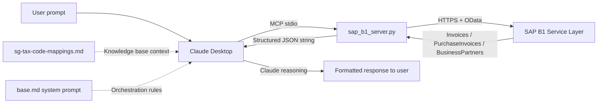

# AgentAssist — Technical State and Methodology Documentation

---

## Document purpose and scope

This document is a technical audit of the AgentAssist repository, produced on 2026-05-26 by
inspection of every source file, configuration file, experimental log, and test artefact in
the repository at that date. It is intended to serve as a self-contained reference for internal
decision-making and as grounding material for subsequent strategy conversations. It does not
presuppose familiarity with any prior conversation about the project.

The audit covers: repository structure and completeness, MCP tool implementation, knowledge base
content and accuracy, system prompt design, experimental methodology and evidence quality,
production readiness gaps, and security and data handling. It surfaces findings honestly,
including inconsistencies and gaps, regardless of how they reflect on the current state of the
work.

The repository is at `C:\Users\terry\Desktop\AgentAssist\sap-b1-ai-agent`. T1.1–T1.6 are on
`master`. T2.7 (Reg 26/27 reasoning pass) and T2.8 (source-document cross-reference) are on
`master` (merged 2026-06-09 from branches `t2.7-reasoning-reg2627` and
`t2.8-document-ingestion` respectively).

---

## Executive summary

**What has been built**

A functional three-layer AI compliance assistant for Singapore GST F5 preparation and
transaction review. The system consists of: (1) a custom Python MCP server providing 14 tools
for SAP B1 Service Layer access, including three purpose-built GST accounting tools; (2) a
curated knowledge base documenting Singapore VatGroup-to-F5-box routing rules with IRAS
citations; and (3) a system prompt enforcing procedural constraints, output format, and
environment awareness. The system runs locally via Claude Desktop on the developer's Windows
machine connected to a cloud-hosted SAP B1 SBODEMOSG demo database.

Two infrastructure layers have since been added. T1.3 (2026-05-31, `master`) delivered a
per-client YAML config system (`config/loader.py`, `config/clients/`) with credential
resolution, GST-rate sanity checking, VatGroup-collision detection, and an SAP connectivity
probe. T1.6 (2026-06-01, branch `t1.6-orchestration-chain`) replaced Claude's conversational
tool selection with a deterministic six-step orchestration chain (`orchestrator/`) gated by
five pure-Python reconciliation checks; the chain runs as
`python run_agent.py --client sbodemosg --period 2024-07-01 2024-09-30` and writes structured
JSON output to `exploration-notes/t1.6-tool-outputs/`.

**What has been validated**

A four-version controlled experiment was run against Q3 2024 data from SBODEMOSG. Two of the
three defined tests have been completed for all four versions. Test 1 (F5 calculation) and
Test 2 (tax code classification) both achieve 10/10 at v3, demonstrating zero arithmetic error
and perfect VatGroup recall. The v0 baseline comparison is well-documented: plain Claude
produced an SGD 3,480 overpayment figure for Box 8 and invented a "critical" compliance
finding (the 7%/9% rate gap) that would have caused material harm if acted upon. Both failures
are traceable to specific architectural gaps that the system prompt and custom tools subsequently
closed.

Test 3 has now been completed for all four versions (V0, V1, V2, V3).
V3 achieves 10/10. The full V0 → V3 trajectory across all three tests
is 12/30 → 13/30 → 25/30 → 30/30. The V1 → V2 Test 3 delta (+6) is the
most informative single result in the experiment: it isolates the
incremental contribution of the system prompt, including elimination
of the V1 F7 filing fabrication and a structural shift from narrative
spot-check methodology to population-level analysis. See
exploration-notes/baseline-test-results.md for full per-test scoring
and the V1/V2 Test 3 Reclassification Note documenting a methodological
contamination discovery.

Two post-experiment implementation tasks have since been completed. T1.2
(2026-05-27) resolved the NR VatGroup inconsistency: NR is now excluded from
Box 5 per IRAS para 5.11(o) across tool code, reference script, and system
prompt, with a known E2 fixture (DocNum 611) seeded for validation. T1.1
(2026-05-28) added credit note support: all three custom tools now fetch
CreditNotes and PurchaseCreditNotes and subtract their line amounts from the
relevant F5 boxes, with two seed credit notes validating the implementation.

**What is genuinely production-ready versus prototype**

Production-ready: the VatGroup → F5 box mapping logic, the FX exclusion and E1 detection
logic, the pagination handling, and the system prompt's orchestration rules. These are
implemented cleanly, tested against reference figures, and produce correct output.

Prototype only: the overall delivery mechanism (Claude Desktop + stdio). Per-client
configuration is resolved (T1.3). The deterministic orchestration chain (T1.6) replaces
Claude's conversational tool selection and produces structured JSON. Report generation is
resolved (T1.4, 2026-06-01): the `report/` package consumes `CompileOutput` and renders a
signed PDF deliverable; `python run_agent.py --client <id> --period <start> <end>` triggers
it end-to-end (no `--report` flag; the PDF is always generated as part of the always-seal
behaviour introduced in T1.5). Audit trail is resolved (T1.5, 2026-06-02): every successful
run produces a sealed, tamper-evident bundle under `audit/<client_id>/`.

Test 3 capability is now validated at 10/10 on SBODEMOSG Q3 2024. T2.7 (on master) added the Reg 26/27 reasoning pass — built and flag-gated, unvalidated pending T2.11. T2.8 (on master) added the source-document cross-reference pre-pass — built and flag-gated, B1 attachment byte-download unverified (upload path working), unvalidated pending T2.11. T2.9 (on master, 2026-06-09) added declared-vs-computed F5 checks (`orchestrator/check_declared_f5.py`): Check A (declared internal consistency) + Check B (declared-vs-computed per independent box, `--declared-f5` flag, off by default); $1.00 per-box tolerance is a **materiality floor** grounded in IRAS ASK Annual Review Guide s10.1(d)(iii) fn33 — NOT a confirmed IRAS F5 filing rounding convention (the convention could not be verified against IRAS source); findings not gates; does not affect F5 boxes. T2.9-V (on master, 2026-06-10) validated the declared-vs-computed mechanism end-to-end on SBODEMOSG Q3 2024: three isolated fixtures (Check A isolation, Check B isolation, control), 22 assertions, box-isolation held, report section renders (Check A/B findings in PDF/text when `--declared-f5` supplied with divergences; Section 6 "Not Examined" retains the placeholder when absent — correct behaviour). **$1.00 tolerance remains a materiality floor, NOT a confirmed IRAS F5 rounding convention — rounding-convention confirmation is a pending cousin task; a surfaced divergence is a candidate, not a confirmed discrepancy.** T2.13 (on master, 2026-06-09) built and blank-labelled the Reg 26/27 validation dataset (`reg2627-representative-v1.json` + `reg2627-adversarial-v1.json`); `expected_candidate` fields are present but empty awaiting independent specialist review; `validation_status` stays `"unvalidated"`; T2.11 remains the binding constraint; `show_ai_candidates` stays `False`. T2.10-V (on master, 2026-06-10) validated the listing-checks detection path end-to-end via crafted-input full-chain: SEQ_GAP (DocNum 8002 truly-absent FLAGGED; 8003 within-range-but-present-company-wide NOT flagged — the period-boundary discriminating case; 8001/8004 not gaps), DUP_CLAIM (dup pair 7001/7002 flagged; near-miss 7003 different NumAtCard not flagged), both Not-Examined lines suppressed independently when findings present, box-isolation held. Live read-only FP check on SBODEMOSG Q3 2024 (1005 sales / 624 purchase headers company-wide): zero SEQ_GAP, zero DUP_CLAIM. **SBODEMOSG is a demo/synthetic DB — NOT real-client validation.** `validation_status` and `show_ai_candidates` unchanged. CI/test-infra self-provisioning (commit 40112ca, 2026-06-10): session-scoped autouse conftest fixture auto-generates gitignored PDF fixtures via `generate_invoices.py` (loaded by file path); `pdfplumber` added to `requirements.txt`; suite verified green on clean checkouts (no API key needed); diagnosis archived at `exploration-notes/infra/ci-fixture-diagnosis-20260610.md`. Report section header renamed to "Invoice Listing Completeness Checks" (commit 958ed3d — internal task ID removed from client-facing PDF; no functional change). Synthetic demo scenario committed at `exploration-notes/demo-scenario/` (commit 8b60d87): crafted SEQ_GAP/DUP_CLAIM/declared-F5 injections over a live SBODEMOSG Q3 2024 run, 10 self-verification assertions, disclosure README. **SYNTHETIC showcase — NOT real-client validation.** Check A float-robustness (commit 40c9024): declared-F5 internal-consistency comparisons (Box 4 == Box 1+Box 2+Box 3; Box 8 == Box 6−Box 7) now use cent-quantized `Decimal` comparison (`ROUND_HALF_UP`) instead of exact float equality — eliminates IEEE-754 sub-cent false positives; off-by-one-cent still flags; Check B and its $1.00 tolerance unchanged; 5 new `[A-FP]` tests. Report styling normalized (commit ae76578, merged via PR #4 as `d9c670c`): shared style palette in `report/render.py` — redundant `_META` removed, AI heading rhythm normalized, duplicated AI `TableStyle` blocks replaced by `_ai_table_style()` helper; content invariant (byte-identical text extraction); client-visible change: minor spacing only. 
T2.19 (committed 2026-06-10 on branch `t2.2-vat-discovery`, commits `47e31a0`/`19a6f86`) added a tax code normalization layer: `normalize_vat_group()` in `sap_b1_server.py` translates source-system tax codes (e.g. Xero `OUTPUT`/`INPUT`) to canonical AgentAssist VatGroup codes (`SO`/`SI`) before F5-box routing or E1–E4 detection; `tax_code_mappings`/`source_system` added to `ClientConfig` (validated at load time) and to the audit-bundle allow-list. 28 new synthetic-fixture tests, zero network calls. SAP B1 clients unaffected — `sbodemosg.yaml` carries no mappings, so `normalize_vat_group()` is a no-op passthrough and all baseline figures are unchanged. **Validated on synthetic fixtures only (`tests/test_tax_code_normalization.py`, `tests/fixtures/chain-run-normalization-sample.json`); not yet tested against a real non-SAP-B1 client.** The same pair of commits also fixed a PDF test-fixture infrastructure gap: a fresh-checkout pytest run found 209 pre-existing `FileNotFoundError` failures because the 8 generated fixture PDFs (`tests/fixtures/documents/INV-3001.pdf`…`INV-3008.pdf`) were excluded by a blanket `*.pdf` rule in `.gitignore` — this appears to contradict the "verified green on clean checkouts" claim above for commit 40112ca. Fixed by adding a `!tests/fixtures/documents/*.pdf` negation to `.gitignore` and committing the 8 PDFs, plus a new `.gitattributes` (`*.pdf binary`) to prevent Git CRLF corruption of the binary fixtures under `core.autocrlf=true`. Current test state: **1184 passed, 0 failed, 1 skipped**.
T2.16 (on master, 2026-06-11) added the annual analytical review TP/TS ratio pass (`orchestrator/check_analytical_review.py`): FY TP/TS ratio (Box 5 ÷ Box 4 > 1.2), opt-in `--analytical-review` flag, Annual Analytical Review report section; demo-validated on SBODEMOSG (live FY ratio, box-isolation, >1.2 flag-fire via crafted input); RC/OVR approximation caveat (Boxes 14–16 not computed); NOT real-client validated; findings not gates. T2.17 (on master, 2026-06-11) added period-over-period fluctuation detection (`orchestrator/check_period_fluctuation.py`): QoQ movements in Boxes 1/2/3/5, ±50% non-regulatory surfacing threshold; wired into the Annual Analytical Review section (T2.17b, PR #7); demo-validated on SBODEMOSG (live FY render, Q4 all-zero excluded, box-isolation); surfaces candidates, never asserts; NOT real-client validated. Test state after T2.16+T2.17: **1211 passed, 1 skipped**.
T5.2a (on master, 2026-06-12, PR #12) built the action-tier enforcement core (`agent/` package): Tier enum + ToolSpec/CheckSpec/LedgerEntry/ProposalArtifact/RunBudget schemas; tool registry (8 tools: 4 Tier-0 read-only, 4 Tier-1 staging, zero Tier-2-executing); justification gate (heuristic backstop + ledger write BEFORE allow); append-only hash-chained justification ledger (reuses `canonical.py` primitives); Tier-2 proposal artifact + StagingStore (CLI-first approval mechanism); deterministic executor framework (`test_noop` hermetic handler + documented NotImplemented stubs for `seal`/`emit`, deferred T5.3); RunBudget with BudgetExceededSignal routing to invariant-7 non-blocking path. CheckSpec schema is v0/PROVISIONAL — 14 entries spanning E1/E2/E3/E4/NO_GST_REG/COMPLETENESS/SEQ_GAP/DUP_CLAIM/declared_A/declared_B/gst_amount_mismatch/correct_period/total_inconsistency/reg11_supplier_gst_absent; NOT wired to any consumer; Collin ratifies schema after T2.18 lands. Zero `anthropic` import in `agent/`; stdlib only. 89 new tests (T-1 through T-10). Test state after T5.2a: **1328 passed, 1 skipped**.
T5.2b (on master, 2026-06-12, PR #13) added the SDK integration surface: `agent/hooks.py` (`make_hooks(ledger)` → PreToolUse/PostToolUse callbacks; Tier-3 → deny tool-not-found; Tier-1 → justification gate with ledger write BEFORE allow; Tier-0 → always allow + ledger entry; PostToolUse → audit_log separate from sealed chain, whether execution outcomes enter the sealed ledger deferred to T5.3); `agent/harness.py` (`build_options(ledger, budget)` → ClaudeAgentOptions with Tier-0/1 tools + hooks wired; SDK import deferred); `agent/approve_cli.py` (list/show/approve/reject library + argparse CLI over StagingStore + Executor); `agent/ledger.py` extended with `Ledger.from_entries(list[dict])` for sealed-JSON reload; `audit_bundle/seal.py` extended with `agent_ledger=None` parameter — writes `steps/agent-ledger.json` covered by the manifest root-hash. First runtime dependency: `claude-agent-sdk==0.2.99` added to `requirements.txt`. **Cross-platform note** (corrected D11, 2026-06-14 — see §T5.2b): on `ubuntu-latest` pip selects the `manylinux` wheel, which BUNDLES the Linux `claude` binary (`_bundled/claude`), so `pip install` auto-provisions it — no npm/`cli_path`/env var; import-only works without the binary; there is no musllinux wheel, so keep CI on glibc. 44 new tests (T-1 through T-8). **Honest status: cage built + hermetically unit-tested; NO live agent loop; `seal`/`emit` executor handlers are NotImplemented stubs deferred to T5.3. NOT demo-validated.** Current test state: **1372 passed, 1 skipped**.
T5.1 (on master, 2026-06-12, merge commit `e30f795`) extracted the full GST review pipeline from `run_agent.py` into `engine/review.py` as one atomic callable: `review(client_config, period, inputs) → ReviewResult`. `ReviewInputs` (4 fields: `line_source`, `provider`, `declared_f5`, `analytical_review`) is the forward-compatible source-adapter seam — SAP B1 wired today via `fetch_si_purchase_lines`; a T2.12 CSV/Excel adapter substitutes a different `line_source` callable without changing `review()`'s signature. `ReviewResult` carries 11 fields including `analytical_review_data`. `GateHalt(message, checked)` is a plain serialisable record replacing the live `GateFailure` exception in the result. `run_agent.py` reduced to a thin CLI; no pipeline logic remains there. `review()` is SILENT — caller prints from the returned result. `engine/__init__.py` re-exports `ReviewResult`, `ReviewInputs`, `GateHalt` but intentionally does NOT re-export `review` itself (re-exporting would shadow the `engine.review` submodule attribute and break `patch("engine.review.run_chain", …)` in tests). Import-scan gate extended to bar `orchestrator/` from importing `engine/` (dependency direction: `engine/ → orchestrator/`, never reverse). **Honest qualifier:** behavior-preserving refactor; built + unit-tested (15 new tests in `tests/test_engine_review.py`); stdout content-equivalent to prior inline wiring (same lines, same exit codes; NOT byte-identical interleaving — mid-run progress lines now print after `review()` returns); NOT demo-validated end-to-end (live SBODEMOSG CLI run pending/Terry-supervised); no agent loop (T5.3); nothing customer-facing changes until T2.11. Current test state: **1387 passed, 1 skipped**.

**The three to five most important gaps before commercial deployment**

1. RESOLVED (T1.1, 2026-05-28): Credit note support added to all three custom tools.
   `CreditNotes` and `PurchaseCreditNotes` are now fetched and their amounts subtracted from
   the corresponding F5 boxes. Two SBODEMOSG seed credit notes (CN A: CreditNotes/SO/1000.00,
   CN B: PurchaseCreditNotes/SI/500.00) validate the implementation against live data.
2. RESOLVED (T1.3, 2026-05-31): Per-client YAML config (`config/clients/<id>.yaml`),
   `load_client_config()` with full validation pipeline, credential env-var resolution,
   VatGroup-collision detection, and optional SAP connectivity probe. Switching clients is
   now a YAML file + env-var change. `config/clients/sbodemosg.yaml` is the first client.
3. RESOLVED (T1.4, 2026-06-01): Report generation delivered. `report/` package: contract →
   enrich/routing → sections → render; `run_agent.py --report`; `CompileOutput` is the input
   (ReportInput is a deprecated stub); classify↔detect join by (doc_num, error_code);
   Document-2 template routing; 124 tests passing.
4. RESOLVED (T1.5, 2026-06-02): Audit trail and input immutability delivered. Each chain
   run produces a sealed, tamper-evident bundle under `audit/<client_id>/`; SHA-256 per
   artefact + root-hash construction; `python -m audit_bundle.verify <bundle-dir>` detects
   any post-seal edit; credentials stripped via explicit allow-list; gate results recorded;
   169 tests passing at T1.5 completion on `master` (current total on branch
   `t2.7-reasoning-reg2627`: 603 collected, 602 passed, 1 skipped — see T2.7 section).
5. RESOLVED (T1.2, 2026-05-27): NR VatGroup corrected to Excluded across tool code, reference
   script, and system prompt. NR is now excluded from Box 5 per IRAS para 5.11(o). DocNum 611
   seeded as a known NR E2 fixture (LineTotal 500.00, TaxTotal 45.00 at 9% — rate anomaly vs
   SBODEMOSG 7% demo norm, documented in test_data_registry.json and
   nr-vatgroup-resolution.md).

**The three to five strongest assets**

1. The v0 failure story is compelling and specific: SGD 3,480 Box 8 overpayment and a false
   "critical" IRAS disclosure recommendation are concrete, quantified, verifiable failures that
   a non-expert buyer can understand.
2. The V0 → V3 Test 3 progression is unusually informative: V0 invented an erroneous
   voluntary disclosure recommendation; V1 reproduced the fabrication as an F7 filing
   recommendation; V2 eliminated the fabrication AND shifted Claude's analytical approach from
   narrative spot-check to population-level analysis (visible in tool-call inventories); V3
   added supplier-level deduplication and reduced tool-call count by ~60%. Each layer's
   contribution is quantifiable and the failure modes are concrete and demo-ready.
3. The knowledge base is well-constructed with accurate IRAS e-Tax Guide citations (11th
   Edition, January 2026), making it credible to a tax-literate buyer.
4. The three-layer architecture is cleanly implemented and the separation of concerns is
   maintained: tools do arithmetic, Claude reasons, the system prompt orchestrates.
5. The experimental methodology is internally consistent and the raw evidence trail is complete
   for all three tests across all four versions.
6. The system prompt's SBODEMOSG rate-artefact handling demonstrates the kind of
   context-aware, non-hallucinating behavior that differentiates the system from plain Claude.

---

## Business framing and value proposition

This section captures the product positioning that the experimental work
has validated. It should be read alongside the technical sections below;
the technical architecture is what it is *because* the business framing
demands it.

### Product

AgentAssist provides line-level GST compliance review for mid-market
Singapore SAP B1 clients. The system combines deterministic
rule-checking (every transaction examined for E1/E2/E3/E4/NO_GST_REG
errors) with applied judgment on edge cases (semantic VatGroup
appropriateness, cross-finding correlation, novel error patterns) and
produces a signed-off PDF report ready for IRAS pre-filing review.

### Conceptual model

AgentAssist functions as a **junior accountant** that a senior financial
officer can orchestrate to accelerate their own workflows. The system
performs the line-level review work that would otherwise require 20-40
hours of senior reviewer time per quarter per client. The senior
reviewer applies judgment on the edge cases the system surfaces,
accepts/rejects/escalates each finding, and signs off on the final
report before submission to IRAS.

The human-in-the-loop boundary is explicit and non-negotiable:
- The system performs detection and surfaces findings with applied
  judgment on edge cases. It never asserts compliance positions
  unilaterally.
- The senior reviewer (typically the client's lead financial officer
  or an external accountant) reviews every finding before sign-off.
- The signed report carries the reviewer's professional name and
  responsibility, not the system's.

This boundary is encoded architecturally: the system prompt's
compliance assertion rule ("never assert a compliance issue without
tool-confirmed evidence") prevents the system from producing the kind
of unaccompanied, confident compliance recommendations that the V0/V1
experiments demonstrated to be dangerous.

### The judgment layer (what distinguishes this from an automated script)

The architecture has three layers, but the commercial differentiation
lives in how they work together rather than in any single layer:

1. **Deterministic rule-checking** (custom MCP tools) catches mechanical
   errors: foreign currency miscoding, blocked input tax with non-zero
   GST, suppliers with blank registration numbers. A Python script could
   do this alone.

2. **Applied judgment on edge cases** (Claude reasoning, guided by
   knowledge base and system prompt) catches issues that require
   semantic interpretation: whether "Financial Advisory Service" is
   genuinely a Reg 33 exempt service, whether a ZR line with a
   Singapore ship-to address is a real export, whether two findings on
   the same DocNum should be cross-correlated for prioritization. A
   pure script cannot do this; an unaccompanied LLM does it
   unreliably (V0/V1 failure mode).

3. **Procedural enforcement** (system prompt) ensures Claude reasons
   conservatively: only surfaces edge cases for reviewer judgment, never
   asserts conclusions, always cites the data underlying each finding.
   This is what prevents the V1 F7 fabrication and makes the surfaced
   edge cases actionable rather than dangerous.

The V0 → V3 experimental progression demonstrates this empirically: V0
(unaccompanied Claude) invents dangerous compliance recommendations; V1
(knowledge base alone) reproduces the fabrications; V2 (system prompt
added) eliminates the fabrications and enables population-level
analysis; V3 (custom tools added) achieves deterministic precision
without sacrificing the judgment layer. See
`exploration-notes/baseline-test-results.md` for full per-version
scoring.

### Pricing model

Per-engagement, per-quarter, per-client. Not per-seat subscription.

This reflects what is actually being sold: a defined deliverable (the
signed PDF review report) produced at a defined cadence (quarterly,
aligned with F5 filing) for a defined client (one SAP B1 instance, one
GST registration). It also aligns with how mid-market Singapore finance
teams already buy tax services from accounting firms — the engagement
model is familiar; the difference is the cost-per-engagement at
AgentAssist scale.

### Operational economics

Without AgentAssist: a senior accountant performing line-level GST
review samples 10-20% of transactions (because comprehensive review is
intractable at hourly cost), spending 20-40 hours per quarter per
client.

With AgentAssist: the system reviews 100% of transactions
deterministically and surfaces edge cases for senior review. Senior
reviewer time drops to approximately 2-4 hours per quarter per client
(reviewing surfaced findings, applying judgment, signing off).

This is approximately a 5-10x reduction in senior reviewer hours per
client, while expanding coverage from sampling to population. The
economic value can be captured either as "same revenue per client, much
lower cost per engagement" (margin expansion for the reviewer/firm) or
"same total reviewer hours, 5-10x more clients served" (capacity
expansion).

### Delivery format

The end deliverable is a structured PDF report containing:
- Methodology disclosure (what was examined, what was not)
- Period and data scope (date range, record counts, FX exclusions)
- F5 box table with VatGroup attribution
- Error findings sorted by severity (E1, E2, NO_GST_REG, etc.) with
  DocNums, line-level detail, and recommendations
- Edge cases surfaced for human judgment (semantic appropriateness,
  ambiguous classifications)
- Cross-finding synthesis (e.g., "DocNum X carries both NO_GST_REG and
  E2 flags — highest priority document")
- Explicit list of items not examined (credit notes if still unhandled,
  manual journals, custom VatGroups)
- Reviewer's signature block
- Disclaimer

This is the IRAS-compliant document that the senior financial officer
signs and either files directly or hands to their accountant for final
submission. The conversational Claude Desktop interface is not the
deliverable; it is the workspace where the system is operated.

### Target customer segment

**Primary**: In-house finance teams at mid-market Singapore SAP B1
clients. These teams currently perform F5 preparation in-house but
have insufficient capacity for line-level pre-filing review. They feel
exposure to IRAS audit risk but cannot justify additional headcount.
AgentAssist gives them the review they wish they had time for.

**Secondary**: Tax/GST advisory practices serving multiple SAP B1
mid-market clients. These firms can deliver line-level review to their
clients as a productized service offering, with AgentAssist providing
the operational machinery and the firm providing the reviewer-of-record.
Distribution model: partner with Singapore SAP B1 resellers as channel,
similar to US Vertex/Kintsugi/CPA.com playbook.

### Forward expansion (post-GST)

The current implementation focuses on Singapore GST F5 because it is
tractable, well-bounded, and tied to a known regulatory deadline. The
architectural pattern (deterministic tools + judgment layer +
orchestration + human sign-off) generalizes to other compliance
workflows: F7 disclosure of errors, more complex partial exemption
calculations, IGDS reporting for approved participants, and eventually
adjacent regimes (Malaysia SST, Vietnam VAT). Each expansion is a new
knowledge base + new tools + same architectural pattern.

Future capability expansion will move toward fully agentic workflows
with orchestration handling multiple parallel tasks within a single
engagement (e.g., F5 preparation + supplier registration verification +
prior-period reconciliation in a single integrated workflow). The
current single-workflow architecture is a starting point, not the end
state.

### What this means for the technical roadmap

The business framing above implies specific technical priorities:

- **Report generation** — RESOLVED (T1.4, 2026-06-01): the `report/` package delivers the
  signed PDF. See § T1.4 for full detail.
- **Per-client configuration** is critical-path: without it, the system
  cannot be deployed beyond SBODEMOSG. See § Per-client configuration.
- **Credit note support** is critical-path: most real clients have
  credit notes; F5 figures without credit note handling are wrong.
- **Audit trail / immutable logging** is required for the reviewer
  sign-off model: the reviewer must be able to demonstrate to IRAS
  (if audited) which data was examined and how findings were derived.

Less critical to the current business model:
- Agent skills (Anthropic skill packaging): the current product is a
  single workflow; skills become relevant when the product expands to
  multiple distinct deliverable types or adjacent jurisdictions.
- Automated evaluation harness: needed for ongoing regression testing
  as the product matures, but not gating first revenue.

---

## Repository structure

The repository has seven substantive directories and three files at root level that warrant
note.

```
sap-b1-ai-agent/
├── README.md                              ← Severely outdated; describes Phase 1 setup state
├── .gitignore                             ← RESOLVED: renamed to .gitignore; functional
├── .env                                   ← gitignored; demo credentials for local development
├── git                                    ← DELETED 2026-05-27
├── claude-code-master-prompt-phase2-tools.md ← Historical Claude Code prompting spec; reference only
├── config/
│   ├── clients/
│   │   ├── example.yaml                   ← Schema template for per-client config
│   │   └── sbodemosg.yaml                 ← SBODEMOSG client config (credentials via env vars)
│   ├── loader.py                          ← T1.3: load_client_config → ClientConfig; 8-step validation
│   └── env.example                        ← Template for SAP B1 connection env vars
├── exploration-notes/
│   ├── baseline-test-results.md           ← Primary experimental log; production-ready document
│   ├── baseline-test-report-v0.json       ← Machine-generated reference run; authoritative
│   ├── v0-raw-chats/                      ← Complete: test1, test2, test3 raw logs; README
│   ├── v1-raw-chats/                      ← Complete: test1, test2, test3 raw logs
│   │   ├── test1-f5-calculation.md        ← v1 Test 1 raw log
│   │   ├── test2-f5-calculation.md        ← Misnamed: is Test 2 (tax classification), not Test 1
│   │   ├── test3-error-detection.md       ← v1 Test 3 raw log; 3/10; clean re-run after contamination discovery
│   │   └── image.png                      ← Unknown; no reference to it in other files
│   ├── v2-raw-chats/                      ← Complete: test1, test2, test3 raw logs
│   │   ├── test1-f5-calculation           ← Missing .md extension; is v2 Test 1 raw log
│   │   ├── test2-tax-classification.md    ← v2 Test 2 raw log; complete and well-formatted
│   │   └── test3-error-detection.md       ← v2 Test 3 raw log; 9/10; reclassified from initial "V1" run
│   ├── v3-raw-chats/                      ← Complete: test1, test2, test3 raw logs
│   │   ├── test1-f5-calculation.md        ← v3 Test 1 raw log; confirms 10/10 result
│   │   ├── test2-tax-classification.md    ← v3 Test 2 raw log; confirms 10/10 result
│   │   └── test3-error-detection.md       ← v3 Test 3 raw log; 10/10; all 19 reference findings
│   ├── security-decisions.md              ← Deferred-decision register for credentials in git history
│   ├── docnum-605-verification.md         ← Live SAP query confirming BL line TaxTotal=56.00
│   ├── nr-vatgroup-resolution.md          ← T1.2 investigation: NR excluded from Box 5; DocNum 611 E2 fixture notes
│   ├── credit-note-exploration.md         ← T1.1 pre-impl exploration + implementation summary + post-seed reference figures
│   └── t1.1-verification.md               ← Read-only verification pass: NR T1.2 completeness, rate check, delta check
│   ├── t1.6-scope.md                      ← T1.6 scope and design doc; gate pseudocode; chain step schemas
│   ├── codebase-state-report.md           ← 2026-05-28 frozen audit snapshot (pre-T1.3/T1.6); historical only
│   ├── t1.6-tool-outputs/                 ← chain-run-<ts>.json outputs (superseded; canonical sink is audit/)
│   ├── t1.4-reports/                      ← Generated PDF reports (generated; gitignored)
│   ├── t2.7-measurement/                  ← T2.7 (on master)
│   │   ├── gate-decision.md               ← Pre-committed gate thresholds (recall > 95%, FP rate < 20%)
│   │   ├── known-limitations.md           ← 8-item limitations register; living document; T2.13 substrate note added 2026-06-09
│   │   ├── fixture-review-worksheet.md    ← 110-row human review checklist; unsigned as of 2026-06-08
│   │   ├── results-20260603.md            ← Provisional measurement output (UNVALIDATED)
│   │   ├── specialist-queue-20260603.md   ← 12-line specialist adjudication queue
│   │   ├── labelling-pass-20260603.md     ← Per-line Opus labelling summary with KB hash
│   │   ├── labelling-pass-20260603.json   ← Full Opus labelling pass output (machine-generated)
│   │   ├── measurement-20260602-*.json    ← Earlier measurement run outputs
│   │   ├── measurement-20260603-*.json    ← 2026-06-03 three-model measurement run outputs
│   │   ├── specialist-queue-20260603.xlsx ← Specialist adjudication worksheet (binary; unsigned)
│   │   └── Reg26-27_GST_Review_Worksheet.xlsx ← Full human review worksheet (binary; at repo root)
│   ├── t2.13/                             ← T2.13 (on master)
│   │   └── labelling-protocol.md          ← Labelling protocol for independent specialist review (300 lines)
│   ├── infra/                             ← Infrastructure notes
│   │   └── ci-fixture-diagnosis-20260610.md ← CI self-provisioning fix diagnosis (2026-06-10)
│   ├── demo-scenario/                     ← SYNTHETIC demo scenario (2026-06-10); NOT real-client validation
│   │   ├── README.md                      ← Disclosure README: real vs crafted; SYNTHETIC showcase
│   │   ├── SESSION-REPORT.md              ← Demo run report
│   │   ├── declared-f5-demo.json          ← Crafted declared-F5 input
│   │   ├── live_boxes_baseline.json       ← Live SBODEMOSG Q3 2024 baseline boxes
│   │   └── run_demo.py                    ← Demo runner (monkey-patches listing data onto live run; 10 self-verification assertions)
│   └── doc-audit/                         ← Documentation staleness audit (2026-06-09)
│       └── DOC-STALENESS-REPORT.md        ← Post T2.9+T2.13 staleness inventory; provenance record for this doc update
├── keys/
│   ├── sap_credentials.json               ← CRITICAL: plaintext credentials; untracked but unprotected
│   └── sap-b1-poc-sg.pem                  ← SSH PEM key for SAP CAL instance; untracked
├── knowledge-base/
│   ├── sg-tax-code-mappings.md            ← VatGroup → F5-box routing; appears production-ready
│   └── slices/                            ← T2.7 (on master)
│       ├── reg2627.md                     ← IRAS §6.1.6 KB slice injected into reg2627 reasoning prompt
│       └── business-context.md            ← Generic-SME assumption statement for reasoning prompt
├── mcp-servers/
│   ├── custom/
│   │   ├── sap_b1_server.py               ← Primary MCP server; 837 lines; credit notes + NR E2 added (T1.1/T1.2)
│   │   ├── requirements.txt               ← Three dependencies (mcp, httpx, python-dotenv)
│   │   ├── README.md                      ← Setup and tool inventory; accurate
│   │   └── __pycache__/                   ← Python bytecode cache
│   └── MCP-SAP/                           ← Third-party HTTP MCP server (Spanish, FastAPI)
│                                          ← Not used; retained as reference; separate git repo
├── audit/                                 ← sealed audit bundles; gitignored
├── audit_bundle/                          ← T1.5: seal/verify/gate-record package
│   ├── canonical.py                       ← canonical_json, sha256_bytes/file
│   ├── config_redaction.py                ← redact_config; allow-list; _DENY_ALWAYS
│   ├── gate_record.py                     ← build_gate_results; gates.json schema
│   ├── manifest.py                        ← build_manifest; root-hash construction
│   ├── provenance.py                      ← gather_provenance; git SHA; file hashes
│   ├── seal.py                            ← seal_bundle; _AUDIT_ROOT; mark_readonly
│   └── verify.py                          ← verify_bundle; __main__ CLI
├── orchestrator/                          ← T1.6: deterministic chain package
│   ├── __init__.py
│   ├── chain.py                           ← run_chain(client_config, period) → (CompileOutput, gate_results); report_input retired (P3)
│   ├── check_declared_f5.py               ← T2.9: declared-vs-computed Check A/B; $1.00 tolerance floor (IRAS ASK Guide s10.1(d)(iii) fn33); findings not gates; pure Python, no anthropic import
│   ├── exceptions.py                      ← GateFailure, ChainError
│   ├── gates.py                           ← gate_1 … gate_5; pure arithmetic / set-membership; no LLM
│   ├── schemas.py                         ← TypedDicts for all inter-step data shapes
│   └── steps.py                           ← fetch, calculate, classify, detect, compile, report_input
├── reasoning/                             ← T2.7 (on master)
│   ├── __init__.py
│   ├── reg2627.py                         ← run_reg2627_pass(); imports anthropic lazily; reads ANTHROPIC_API_KEY
│   ├── sap_lines.py                       ← fetch_si_purchase_lines(); SAP line fetcher for T2.7
│   ├── measurement.py                     ← measure_model(); recall/FP-rate harness against labelled fixture
│   ├── run_measurement.py                 ← CLI harness for multi-model measurement runs
│   ├── label_fixture.py                   ← Opus two-pass labelling pipeline; imports anthropic lazily
│   └── build_specialist_queue.py          ← Builds specialist-review queue from indeterminate/contested lines
├── Reg26-27_GST_Review_Worksheet.xlsx     ← T2.7 human review worksheet (binary; branch only)
├── report/                                ← T1.4: signed PDF report generator
│   ├── __init__.py                        ← generate_report(compile_output, client_config) → Path
│   ├── constants.py                       ← T2.7 (on master): AICandidatesSection, DISCLAIMER_TEXT
│   ├── contract.py                        ← Input type aliases; CompileOutput is the T1.4 input
│   ├── enrich.py                          ← Three-source join keyed by (doc_num, error_code)
│   ├── routing.py                         ← Document-2 IRAS template routing; E2-by-VatGroup; Template 4/5
│   ├── sections.py                        ← Eight report sections; T2.7: build_ai_candidates_section; T2.8: replaced by build_unified_candidates_section → UnifiedCandidatesSection (reasoning + document candidates merged, per-row basis tag mandatory, gated by show_ai_candidates)
│   └── render.py                          ← Section dicts → PDF; _ai_candidates_subsection added (T2.7, on master)
├── documents/                             ← T2.8 (on master)
│   ├── __init__.py
│   ├── ingest.py                          ← ingest(pdf_path) → ExtractedInvoice; born-digital pdfplumber path + multimodal fallback (deferred anthropic import)
│   ├── reconcile.py                       ← reconcile() → list[DocumentCandidate]; 4 checks; J+/D+ ceiling; validation_status="unvalidated"
│   ├── doc_pass.py                        ← run_documents_pass(); iterates SI lines via provider; silently skips no-PDF lines
│   └── provider.py                        ← DocumentProvider protocol; B1AttachmentProvider (metadata verified / byte-download UNVERIFIED); UploadProvider; CompositeProvider; FixtureDocumentProvider
├── run_agent.py                           ← CLI: --client <id> --period <start> <end>
│                                          ← T2.7 (on master): Phase 3 (Reg 26/27 reasoning pass)
│                                          ← T2.8 (on master): --show-ai-candidates flag; --upload-dir flag; Phase 3b (source-document cross-reference)
│                                          ← T2.9 (on master): --declared-f5 <path> flag; Phase 3c (declared-vs-computed checks; off by default)
├── scripts/
│   ├── run_baseline_tests.py              ← Reference implementation; T1.1 updated: credit notes + NR E2; T2.8 header comment updated for post-seed figures
│   ├── seed_test_data.py                  ← Creates synthetic test documents (7 invoices + 2 credit notes)
│   ├── seed_demo.py                       ← T2.8: seeds 13 AGENTASSIST_SEED PurchaseInvoices (G1 reconciliation cases + G2 reasoning bait); vendor V21000
│   ├── seed_manifest.json                 ← T2.8: DocNum → {group, case, pdf_path, doc_entry}; authoritative seed identity record (Remarks not persisted by SBODEMOSG on read-back)
│   ├── seed_uploads/                      ← T2.8: 13 born-digital PDFs (INV-612.pdf … INV-624.pdf) for use with UploadProvider
│   ├── cleanup_test_data.py               ← Cancels seeded test invoices
│   ├── test_data_registry.json            ← DocEntry registry; updated with credit notes and DocNum 611 tax_rate_note
│   ├── smoke_anthropic.py                 ← T2.7 (branch only): one-shot Anthropic API smoke test
│   └── test-service-layer.sh              ← Basic connectivity test; shell script
├── skills/                                ← Directory exists; entirely empty
├── tests/
│   ├── fixtures/
│   │   ├── chain-run-sample.json          ← Static CompileOutput fixture for T1.4 e2e test
│   │   ├── reg2627-labelled-lines.DRAFT.json ← T2.7 (on master): Opus-labelled DRAFT fixture; unvalidated
│   │   ├── reg2627-labelled-lines.json    ← T2.7 (on master): promoted fixture placeholder (currently
│   │   │                                     identical to DRAFT; not yet human-reviewed and signed off)
│   │   ├── reg2627-representative-v1.json ← T2.13 (on master): representative Reg 26/27 validation fixture (blank-labelled; expected_candidate fields empty)
│   │   ├── reg2627-adversarial-v1.json    ← T2.13 (on master): adversarial validation fixture (blank-labelled)
│   │   ├── SCHEMA-reg2627-v1.md           ← T2.13 (on master): fixture schema documentation
│   │   ├── export_specialist_copy.py      ← T2.13 (on master): specialist-export script; strips resolution_hint (strip guard)
│   │   └── documents/                     ← T2.8 (on master): born-digital fixture PDFs for ingest/reconcile tests
│   ├── test_audit_canonical.py            ← T1.5: canonical_json, sha256_bytes/file
│   ├── test_audit_redaction.py            ← T1.5: allow-list credential exclusion
│   ├── test_audit_seal_verify.py          ← T1.5 + T2.9: seal/verify round-trip, tamper detection; declared-f5 seal path
│   ├── test_build_specialist_queue.py     ← T2.7 (on master): specialist queue generation
│   ├── test_chain.py                      ← 11 hermetic acceptance tests (P3: updated for new return type)
│   ├── test_check_declared_f5.py          ← T2.9 (on master): 18 tests — isolation invariant, Check A/B, tolerance boundary, load validation
│   ├── test_enrich.py                     ← T1.4: three-source join, (doc_num, error_code) aggregation
│   ├── test_fixture_draft_structure.py    ← T2.7 (on master): DRAFT fixture schema validation
│   ├── test_gate_record.py                ← T1.5: gate_results shaping; GateFailure.checked
│   ├── test_gates.py                      ← 30 unit tests; all five gates; pure Python
│   ├── test_label_fixture.py              ← T2.7 (on master): Opus labelling pipeline tests
│   ├── test_measurement.py                ← T2.7 (on master): recall/FP harness unit tests
│   ├── test_reasoning_reg2627.py          ← T2.7 (on master): run_reg2627_pass integration tests
│   ├── test_report_e2e.py                 ← T1.4: full end-to-end from CompileOutput fixture to PDF
│   ├── test_report_judgment_section.py    ← T2.7 (on master): build_ai_candidates_section tests
│   ├── test_routing.py                    ← T1.4: Document-2 template routing, Template 4/5 switching
│   ├── test_run_agent_e2e.py              ← T1.5: e2e seal from fixture; T7 determinism
│   ├── test_sap_lines.py                  ← T2.7 (on master): fetch_si_purchase_lines tests
│   ├── test_sections.py                   ← T1.4: eight sections, HitL language invariants
│   ├── test_t2_13_fixture_schema.py       ← T2.13 (on master): 92 tests — fixture schema invariants, specialist-export strip guard, blank-label invariant
│   ├── test_document_fixtures.py          ← T2.8 (on master): fixture PDF generation, field structure
│   ├── test_documents_ingest.py           ← T2.8 (on master): born-digital extraction, field patterns, multimodal mock
│   ├── test_documents_reconcile.py        ← T2.8 (on master): all four reconciliation checks; tolerance boundary; empty candidates
│   └── test_documents_unified_report.py   ← T2.8 (on master): UnifiedCandidatesSection show=True/False; basis tags; isolation invariant
└── system-prompts/
    ├── base.md                            ← Primary orchestration prompt; production-ready
    ├── test1-prefix.md                    ← Task prefix for F5 calculation; working
    └── test2-prefix.md                    ← Task prefix for tax classification; working
```

### Notes on specific files

**`.gitignore` (root level, RESOLVED 2026-05-27)**: Renamed from `gitignore` to `.gitignore`.
Git now recognises it as an ignore specification. The `keys/` directory and `.env` file are
properly excluded from staging. Note: the credential files (`sap_credentials.json`,
`sap-b1-poc-sg.pem`) exist in the initial commit history (aec650f9) and have not been scrubbed
from git history. See `exploration-notes/security-decisions.md` for the deferred-decision
register and the conditions that trigger a mandatory history scrub.

**`git` (root level, 0 bytes, DELETED 2026-05-27)**: Was an empty file named `git`, almost
certainly created by accidentally running `git > git` or a similar shell mishap. Deleted.

**`README.md`**: Describes the project as being in "Phase 1 — Environment Setup" and uses
parenthetical placeholders for content that now exists (e.g., `(sg-gst-tax-codes.md)`,
`(f5-return.md)`). The folder structure described does not match the current repository state.
This file has not been updated since the initial commit and should not be treated as current
documentation.

**`skills/` directory**: Empty. The README references planned skill files
(`gst-validation.md`, `invoice-creation.md`, `f5-return.md`) that have never been created. A
planned v4 skill (full workflow) is referenced in the improvement tracking table but does not
exist.

**`mcp-servers/MCP-SAP/`**: A third-party Spanish-language HTTP-based MCP server cloned from
GitHub (NXr10/MCP-SAP). It exposes only three tools (connect, status, create sales order) and
was built for Microsoft Copilot Studio. It is not used in the project. The custom server's
README explains why it was replaced. The MCP-SAP directory has its own `.git` repo and
functions as an embedded submodule without being formally declared as one.

**`v1-raw-chats/test2-f5-calculation.md`**: The filename says "f5-calculation" but the file
contains the v1 Test 2 (tax code classification) raw response. This is a naming error with no
functional consequence, but it complicates navigation of the evidence trail.

**`v2-raw-chats/test1-f5-calculation`**: Missing the `.md` extension. The file contains the
v2 Test 1 raw response and was processed correctly by the audit.

**`v1-raw-chats/image.png`**: An image file with no reference in any other file. Its content
and purpose are unknown. No other file links to it or describes it.

---

## Architecture as built

### Three-layer separation

The three-layer architecture is cleanly implemented in practice, with one minor anomaly.

**Layer 1 — Deterministic (MCP tools)**: All arithmetic, all data fetching, and all
rule-based classification live in `sap_b1_server.py`. The F5 box calculation, VatGroup routing,
FX filtering, E1-E4 per-line checks, COMPLETENESS threshold check, and NO_GST_REG supplier
lookup are all Python code. Claude is explicitly removed from the arithmetic path by the system
prompt's tool-preference order.

**Layer 2 — Reasoning (Claude + knowledge base)**: Interpretation of tool output, judgment on
edge cases (e.g., "is this E1 candidate actually an export?"), and narrative construction live
in Claude's response generation, guided by `sg-tax-code-mappings.md`.

**Layer 3 — Orchestration (system prompt)**: `base.md` specifies tool selection order,
mandatory pagination rules, period defaulting logic, FX exclusion enforcement, output format,
and environment-awareness constraints (the 7%/9% demo artefact rule).

**The minor anomaly**: The system prompt's `base.md` includes a full VatGroup routing table
and F5 box definition table that duplicates content in `sg-tax-code-mappings.md`. This is
intentional as a fallback (the system prompt is always active, the knowledge base is
project-level context that may not always load), but it creates a maintenance surface where the
two documents could drift. One discrepancy already exists: see the NR VatGroup section below.

### Data flow



The custom MCP tools (Tools 12-14) handle the accounting-specific data path. The generic tools
(Tools 1-11) provide raw OData access for ad-hoc queries, write operations, and exploration.

### Where the deterministic layer ends and the reasoning layer begins

The three custom tools return structured JSON with findings described in plain English strings
(e.g., `"description": "FX invoice (USD) with SO code — should likely be ZR for overseas
sales"`). The tools do not make reclassification decisions; they flag candidates and provide
recommendations. Claude synthesizes these into a formatted response and applies the compliance
assertion rules from the system prompt: no definitive compliance claims without tool-confirmed
evidence.

The E1 detection illustrates this correctly: the tool flags FX+SO combinations as "candidates
for review." The system prompt reinforces: "Acceptable: 'DocNum 958 appears to be an E1
candidate.' Not acceptable: 'DocNum 958 is miscoded and must be reclassified.'" The system
maintains the appropriate epistemic posture at each layer.

### Architectural debt

One resolved and one remaining design question:

1. **Credit notes**: RESOLVED (T1.1, 2026-05-28). All three custom tools now call
   `_fetch_credit_notes_paginated(entity_type, period_start, period_end)`, which fetches
   `CreditNotes` (entity_type="sales") or `PurchaseCreditNotes` (entity_type="purchases"),
   tags each record `is_credit_note=True`, and returns the list. Callers negate LineTotal
   and TaxTotal when subtracting from F5 boxes — negation is explicit at the call site, not
   inside the fetch function. Two SBODEMOSG seed credit notes confirm correct reference figures.

2. **Per-client configuration**: RESOLVED (T1.3, 2026-05-31). `config/loader.py` loads
   per-client YAML from `config/clients/<id>.yaml`, resolves credentials from env vars, validates
   GST rate and VatGroup codes, and optionally probes SAP connectivity. `configure_client()`
   (T1.6) injects the resolved credentials into `sap_b1_server` at chain-run time without
   importing `config/` into `mcp-servers/` — dependency direction preserved.

---

## T1.3 — Per-client configuration (RESOLVED 2026-05-31)

`config/loader.py` provides `load_client_config(client_id, *, check_connectivity=True) → ClientConfig`. Per-client config YAML lives in `config/clients/<id>.yaml`; `sbodemosg.yaml` is the first.

**Validation pipeline** (each step fails with a human-readable message; 8 steps — README's 8-step count is correct):
1. File existence check (`config/clients/<id>.yaml` must exist)
2. YAML parse (`config/clients/<id>.yaml`)
3. Validate required fields (`client_id`, `client_name`, `applicable_gst_rate`, `sap_b1` block)
4. `client_id` must match filename stem
5. Resolve credential env-var names to values (stores values, never stores var names)
6. Sanity-check `applicable_gst_rate` in `[0.05, 0.15]`
7. Detect `custom_vat_groups` collisions with the 18 standard IRAS VatGroup codes (SO, DS, ZR, ES33, ESN33, OS, SI, ZP, IM, IGDS, ME, NR, BL, EP, OP, TX-E33, TX-N33, TX-RE)
8. Optional SAP login probe (logs out immediately on success; skipped by consumers that manage sessions)

**`ClientConfig` fields**: `client_id`, `client_name`, `gst_registration_number`, `applicable_gst_rate`, `service_layer_url`, `company_db`, `username`, `password`, `ssl_verify`, `fiscal_year_start_month`, `custom_vat_groups`, `completeness_threshold`, `reviewer_name`, `firm_name`.

**Independence contract**: `config/loader.py` has zero dependency on `mcp-servers/` or `scripts/`. Both may import it; they must not import each other.

---

## T1.6 — Deterministic orchestration chain (COMPLETE 2026-06-01)

**What it replaced**: Claude's conversational tool selection — the model deciding at runtime which MCP tools to call and in what order. For an auditable GST review, "Claude decided to skip validate_invoice_tax_codes" is not defensible; the chain makes that impossible.

### Package: `orchestrator/`

| File | Responsibility |
|---|---|
| `chain.py` | `run_chain(client_config, period) → (CompileOutput, gate_results)` — top-level entry point; calls configure_client, runs six steps and five gates. `report_input` step retired (P3); JSON persistence moved to `seal_bundle`. |
| `steps.py` | Six step functions: `fetch`, `calculate`, `classify`, `detect`, `compile`, `report_input` |
| `gates.py` | Five gate functions (`gate_1_record_count` … `gate_5_cross_tool_consistency`); each raises `GateFailure` on halt; no LLM calls |
| `schemas.py` | TypedDicts for all inter-step shapes (`Period`, `FetchManifest`, `F5ReturnOutput`, `ClassifyOutput`, `DetectOutput`, `CompileOutput`, `ReportInput`, …) |
| `exceptions.py` | `GateFailure(Exception)`, `ChainError(Exception)` |

**CLI**: `python run_agent.py --client sbodemosg --period 2024-07-01 2024-09-30`

**Chain sequence**:
```
fetch → gate_1 → calculate → gate_2 → classify → gate_3 → detect → gate_4
      → compile → gate_5 → fetch_listing_data + listing checks → return (CompileOutput, gate_results)
```

**Five deterministic gates** (pure arithmetic / set-membership, never an LLM call):

| Gate | After | Check |
|------|-------|-------|
| 1 | Fetch | SAP `$inlinecount` vs fetched count; warn-pass when unavailable |
| 2 | Calculate | `box_4 == box_1+box_2+box_3` and `box_8 == box_6−box_7` (tolerance 0.01) |
| 3 | Classify | `summary.total == len(issues)` and all issue VatGroups present in inventory |
| 4 | Detect | `sum(severity_counts) == len(issues)` and no dangling `doc_num` references |
| 5 | Compile | E1 doc_num sets agree across calculate/detect; unknown VatGroups agree across calculate/classify |

**Output**: sealed bundle written under `audit/<client_id>/` by `run_agent.py` (T1.5). The provisional path `exploration-notes/t1.6-tool-outputs/` was removed in P3 when the chain write moved into `seal_bundle`.

**Connection seam**: `configure_client(service_layer_url, company_db, username, password, ssl_verify, custom_vat_groups)` added to `sap_b1_server.py`. Takes primitives; no `config/` import into `mcp-servers/` — dependency direction preserved. The module-level init (`_load_sap_config()`) is now wrapped in try/except so the module imports cleanly even when `CLIENT_ID` is not set; `configure_client()` overwrites the global `sap` client before any step function runs.

**Design decisions and known limitations**:

- **Gate 1 dormancy**: SBODEMOSG's SAP B1 Service Layer (version 1000250) does not return `odata.count` for `$inlinecount=allpages` queries. Gate 1 always warn-passes on this instance; pagination completeness is verified only structurally (`len(page) < 20` sentinel in the fetch helper), not arithmetically against a SAP-reported total.
- **~4× redundant fetch (tech-debt)**: Steps b/c/d (`calculate`, `classify`, `detect`) each re-fetch from SAP independently. The Fetch step (step a) builds only the `FetchManifest` (doc_nums set for Gate 4, items_examined for the report); it does not pre-fetch on behalf of the tool steps. Each chain run makes ~4× the minimum necessary SAP round-trips. Deferred to T1.6.1.
- **Source-adapter decision deferred**: The three tool-step functions call `sap_b1_server` directly. Substituting an alternative source (CSV extract, test fixture) would require changing step function signatures. Deferred until a second source adapter is needed.
- **`compile` step**: Aggregates four step outputs deterministically. Surfaced warnings are built from data (not scraped from logs): Gate 1 inline-count absence, Gate 2 calc anomalies, Gate 3 unknown-VatGroup entries.
- **`report_input` step**: RETIRED (P3). `run_chain` now returns `(CompileOutput, gate_results)` directly; `build_report` in `run_agent.py` consumes `CompileOutput` unchanged. The `ReportInput` TypedDict stub is retained in `orchestrator/schemas.py` for reference only.

**Test state**: **169 tests passing** at T1.5/T1.6 completion on `master` (1 skipped: T8
read-only advisory check, Windows). T1.5 added 45 new tests across five files;
`tests/test_chain.py` updated in P3 to match the `(CompileOutput, gate_results)` return type.
`tests/test_gates.py` (30 tests) unchanged — the return-value addition does not affect any
pass/fail assertion. Current total on branch `t2.7-reasoning-reg2627`: 603 collected, 602
passed, 1 skipped (T2.7 added 7 new test files — see T2.7 section).

**Live validation** (2026-06-01, SBODEMOSG Q3 2024):
```
Items examined : purchase_credit_note=1, purchase_invoice=21, sales_credit_note=1, sales_invoice=50
box_8 (net GST): 17,045.87   (matches T1.1 reference figures)
Issues (detect): 21
Warnings       : 1 (Gate 1 $inlinecount unavailable)
Exit           : 0
```

---

## T1.4 — Signed PDF report generator (COMPLETE 2026-06-01)

### Package: `report/`

| Module | Role |
|--------|------|
| `contract.py` | Input type aliases; declares `CompileOutput` as the T1.4 input contract |
| `enrich.py` | Three-source join: classify amounts + detect severity + manifest backfill; keyed by `(doc_num, error_code)` |
| `routing.py` | Document-2 IRAS template routing — E2-by-VatGroup branching, Template 5 default, Template 4 via `actively_makes_exempt_supplies` config flag |
| `sections.py` | Builds each of the eight report sections as structured dicts |
| `render.py` | Converts section dicts to PDF |
| `__init__.py` | Public surface: `generate_report(compile_output, client_config) → Path` |

**CLI**: `python run_agent.py --client sbodemosg --period 2024-07-01 2024-09-30`
(no `--report` flag; the PDF is always generated as part of the always-seal behaviour
introduced in T1.5 — `run_agent.py` on `master` has no `--report` argument)

### Input contract decision

T1.4 consumes the full `CompileOutput` JSON produced by the T1.6 chain — not the flat `ReportInput` dict. `ReportInput` (defined in `orchestrator/schemas.py`) is now a deprecated stub retained for backward compatibility; it is no longer the T1.4 input surface.

The switch was made because `CompileOutput` carries the full three-source structure (classify issues, detect issues, manifest) that T1.4 needs for enrichment and routing. `ReportInput` had already discarded per-source detail before T1.4 could access it.

### Three-source join: (doc_num, error_code) aggregation

`enrich.py` aggregates findings from three sources:

1. **`classify` output** — per-line issues from `validate_invoice_tax_codes`; carries VatGroup, LineTotal and TaxTotal amounts.
2. **`detect` output** — per-finding severity assignments from `detect_gst_errors`; carries severity (HIGH/MEDIUM/LOW) and description.
3. **`manifest` backfill** — FetchManifest doc_num set; used to confirm coverage and handle findings (COMPLETENESS, NO_GST_REG) that have no per-line VatGroup counterpart in classify.

The join key is `(doc_num, error_code)`. COMPLETENESS findings (`doc_num=None`) take the backfill path directly without classify enrichment.

### Document-2 IRAS template routing

`routing.py` maps each E2 finding to the correct IRAS GST return amendment template based on VatGroup:

- **E2-by-VatGroup branching**: the applicable template depends on the specific zero-rated or exempt VatGroup — the E2 error code alone is not sufficient for routing.
- **Template 5 default**: findings without a specific Document-2 assignment route to Template 5.
- **Template 4** is used instead of Template 5 when `actively_makes_exempt_supplies` is set in `ClientConfig` — reflecting the IRAS distinction between businesses that make exempt supplies as a principal activity vs. incidentally.
- **`actively_makes_exempt_supplies` unimplemented (known state)**: `actively_makes_exempt_supplies` is read via `getattr(client_config, "actively_makes_exempt_supplies", False)` and is NOT yet a `ClientConfig` field (`report/report.py:169`); all clients route exempt E2 findings to Template 5. Activating Template 4 for an actively-exempt client is a documented one-line `ClientConfig` addition (planned, not built).
- **ZP → Template 1 fall-through (known state)**: ZP E2 findings currently route to the default Template 1. `ZP` is absent from every E2 routing branch in `report/routing.py` — not in `_ZERO_RATED_VGS` (`{"ZR","OS"}`), `_EXEMPT_VGS` (`{"ES33","ESN33"}`), or `_BLOCKED_INPUT_VGS` (`{"BL","NR"}`). Routing ZP E2 to Template 6 alongside BL/NR input-tax findings is a documented refinement candidate, not a defect.

### Eight report sections

1. **Cover / metadata**: client name, GST registration, period, run timestamp, reviewer name and firm.
2. **Methodology disclosure**: what was examined (SGD invoices, purchase invoices, credit notes), what was excluded (FX, manual journals, custom VatGroups), and the data source.
3. **Data scope**: period, record counts by entity type, items examined count, FX exclusions.
4. **F5 box table**: all eight boxes with VatGroup attribution per box.
5. **Error findings**: issues sorted HIGH → MEDIUM → LOW then by doc_num; each includes DocNum, date, counterparty, error code, description, IRAS template routing (where applicable), and recommendation.
6. **Edge cases for reviewer judgment**: findings flagged for human review (semantic VatGroup appropriateness, ambiguous E1 candidates, cross-finding correlation).
7. **Items not examined**: explicit list — FX invoices pending conversion, manual journals, custom VatGroup transactions, COMPLETENESS context.
8. **Reviewer sign-off block**: reviewer name, firm, date, and signature line; disclaimer that the report is a working paper and not an IRAS submission.

### Human-in-the-loop invariant

The report contains no system-generated filing directives. The system surfaces findings and routes them to the applicable IRAS template; the reviewer determines whether to accept, escalate, or dismiss each finding and signs the final document. The signed report carries the reviewer's professional name and responsibility. This invariant is enforced in `sections.py`: findings use language such as "candidate for review" and "recommend verification" rather than "must reclassify" or "submit amendment."

### Appendix 1 wording

Appendix 1 of the report (IRAS amendment framework reference) sources its wording verbatim from the IRAS ASK Guide, 16th edition, pp. 72–73. It does not derive from the coverage-analysis exploration notes. The IRAS ASK Guide wording is used to ensure amendment procedure descriptions match the authoritative official guide.

### Test state

**124 tests passing** across four test files (no live SAP in any test):

| File | Coverage |
|------|----------|
| `tests/test_routing.py` | Document-2 template routing, E2-by-VatGroup branching, Template 4/5 switching |
| `tests/test_enrich.py` | Three-source join, (doc_num, error_code) aggregation, COMPLETENESS backfill path |
| `tests/test_sections.py` | All eight sections; human-in-the-loop language invariants; reviewer sign-off block |
| `tests/test_report_e2e.py` | Full end-to-end: `tests/fixtures/chain-run-sample.json` → `generate_report()` → PDF; section presence; no filing directives |

`tests/fixtures/chain-run-sample.json` is the static `CompileOutput` fixture used by the e2e test.

### Document positioning

The generated report is a **working paper** — a structured, reviewer-signed document for pre-filing review prepared with the assistance of AgentAssist. It is not an IRAS submission. The cover page and disclaimer section make this explicit.

---

## T1.5 — Audit trail + input immutability (COMPLETE 2026-06-02)

### Package: `audit_bundle/`

| Module | Role |
|--------|------|
| `canonical.py` | `canonical_json(obj) → bytes`: keys sorted recursively, no whitespace, UTF-8; sets serialised as sorted lists so runtime `set` fields and JSON-loaded `list` fields hash identically. `sha256_bytes(data)` and `sha256_file(path)` return `"sha256:<hex>"`; file variant streams in 64 KiB chunks. |
| `config_redaction.py` | `redact_config(cfg: ClientConfig) → dict`: explicit allow-list of 11 fields; `username`, `password`, `ssl_verify` unconditionally excluded via `_DENY_ALWAYS` (disjoint from the allow-list). A future `ClientConfig` field is excluded by default — the allow-list is positive, not a deny-list. |
| `provenance.py` | `gather_provenance(expected_rate)`: repo commit (`git rev-parse --short HEAD`; `"unknown"` on failure), `chain_version="t1.6"`, `report_template_version="t1.4"`, `system_prompt_hash`, `kb_slice_hash`, `rederivation_grade="same-SAP-state"`. |
| `manifest.py` | `build_manifest(engagement, provenance, artefact_paths, bundle_dir) → dict`: per-artefact `{path, sha256, bytes}` sorted by POSIX path; root hash = `sha256_bytes(canonical_json(manifest-minus-root_hash))`. |
| `gate_record.py` | `build_gate_results(records) → dict`: shapes `{all_passed, gates:[{gate, name, after_step, status, passed, checked, message?}]}`. WARN_PASS counts as passed; FAIL sets `all_passed: false`. |
| `seal.py` | `seal_bundle(*, client_config, period, compile_output, gate_results, report_pdf_path, run_started_at, run_completed_at) → Path`: writes 8 artefacts, builds and writes `manifest.json`, marks bundle read-only. `_AUDIT_ROOT` is module-level for test redirection via monkeypatch. |
| `verify.py` | `verify_bundle(bundle_dir) → (ok, problems[])`: re-hashes each artefact against the manifest listing; recomputes root over `manifest-minus-root_hash`. Runnable as `python -m audit_bundle.verify <bundle-dir>` (PASS / FAIL, exit 0 / 1). |

### Bundle layout

```
audit/<client_id>/<period-start>_<period-end>/<run-ts>/
    manifest.json                ← written last; covers all other artefacts
    config.json                  ← allow-listed ClientConfig; credentials stripped
    inputs/
    │   └── fetch-manifest.json  ← FetchManifest from Step a
    steps/
    │   ├── calculate.json       ← F5ReturnOutput from Step c
    │   ├── classify.json        ← ClassifyOutput from Step b
    │   └── detect.json          ← DetectOutput from Step d
    gates.json                   ← all five gate results with checked values
    compile-output.json          ← full CompileOutput
    report.pdf                   ← signed PDF from T1.4
```

All JSON written via `canonical_json` for stable, deterministic hashing. `run_ts` is `YYYYMMDD-HHMMSS` in UTC, derived from `run_started_at`.

### Root-hash construction and verification

`manifest.json` is written last and covers all other artefacts. Root hash = SHA-256 over canonical JSON of the manifest with the `root_hash` field removed. Verification: re-hash each artefact against its listed sha256, then recompute root over `manifest-minus-root_hash`. Any post-seal edit — to any artefact file or any manifest field — fails verification. `python -m audit_bundle.verify <bundle-dir>` prints PASS (exit 0) or FAIL with a problem list (exit 1).

### Gate result capture (P3 orchestrator changes)

Gates 1–5 now return a `checked` dict of the values each gate inspected when deciding. On success the dict is returned; on failure it is attached to `GateFailure.checked`. `chain.py` wraps each gate call in try/except, records `{gate, name, after_step, status, passed, checked, message?}`, and threads the list out as the second return value of `run_chain`. A halted chain re-raises `GateFailure` after recording; `exc.checked` carries the failing gate's values for diagnostics without re-parsing the exception message.

### Always-seal in run_agent.py

Every successful `run_agent.py` invocation:

1. Captures `run_started_at` (UTC ISO) before `run_chain`.
2. `compile_output, gate_results = run_chain(cfg, period)`.
3. Renders PDF via the existing T1.4 wiring (`build_report → render_pdf`); `generated_at` sourced from `compile_output["fetch_manifest"]["fetched_at"]`.
4. Captures `run_completed_at`.
5. `seal_bundle(...)` writes the sealed bundle under `audit/<client_id>/`.
6. Prints bundle path and `python -m audit_bundle.verify <bundle-dir>` to stdout.

On `GateFailure`: gate message + `exc.checked` printed to stderr; exit non-zero; no bundle written. A halt means the data did not reconcile — there is no valid review to seal.

### Re-derivability boundary

`rederivation_grade: "same-SAP-state"` in provenance. Re-running the deterministic chain against the same SAP data state reproduces `compile-output.json` byte-for-byte. Full offline replay from frozen line bytes is deferred to the Tier-2 source adapter (see Appendix C #16); until that adapter exists, re-derivability requires a live SAP instance with the same data state.

### Secrets policy

`config.json` is written from `_ALLOW_LIST` (11 fields). `username`, `password`, and `ssl_verify` are absent from the allow-list and additionally guarded by `_DENY_ALWAYS`. Tests assert `"HUNTER2_TEST"` never appears in any bundle file (binary scan covers JSON + PDF alike); tests assert `_ALLOW_LIST ∩ _DENY_ALWAYS = ∅`.

### Read-only caveat

`_mark_readonly` in `seal.py` sets `0o444` / `0o555` after sealing — best-effort and advisory. The tamper evidence is the hash, not the file permission. On Windows, `os.chmod` sets the read-only attribute but cannot prevent an administrator from overriding it. T8 asserts the flag is set on POSIX; skipped on Windows with an explicit reason.

### Test state

**169 tests passing** at T1.5 completion on `master` (1 skipped: T8 read-only advisory check,
Windows). Current master total (post T2.7–T2.8–T2.9–T2.9-V–T2.13–T2.10–T2.10-V–Check-A-FP–style-palette–T2.16–T2.17–T2.19–T5.2a–T5.2b–T5.1 merges): **1387 passed, 1 skipped** — see T2.7, T2.8, T2.9, T2.9-V, T2.13, T2.10, T2.10-V, T2.16, T2.17, T5.1, T5.2 sections and footer for test-count progression.

| File | Coverage |
|------|----------|
| `tests/test_audit_canonical.py` | `canonical_json` order-independence, byte stability, UTF-8 passthrough; `sha256_bytes` and `sha256_file` |
| `tests/test_audit_redaction.py` | Allow-list completeness, credential value/key exclusion, `_ALLOW_LIST` / `_DENY_ALWAYS` disjoint invariant |
| `tests/test_audit_seal_verify.py` | T1–T5 + T8: 8 artefacts present; verify passes on fresh bundle; tamper detected on artefact and manifest; credential scan; read-only flag on POSIX |
| `tests/test_gate_record.py` | `build_gate_results` unit tests; clean-run 5-gate integration via `run_chain`; `GateFailure.checked` carries box values on corrupted box_4 |
| `tests/test_run_agent_e2e.py` | Sealed bundle produced + `verify_bundle` passes; T7 `compile-output.json` bytes deterministic across seals from identical inputs; `GateFailure` exits non-zero with no bundle created |

---

## T2.7 — Reg 26/27 reasoning pass (on master; unvalidated — pending T2.11)

### Status

T2.7 is merged to `master` (2026-06-09, from branch `t2.7-reasoning-reg2627`).
`show_ai_candidates` is wired in code but defaults to `False` in all client YAMLs and must
remain `False` until the measurement gate is met on the promoted fixture.
`validation_status` is `"unvalidated"` in the fixture files. No flag has been enabled by this
document update.

### What T2.7 adds

T2.7 adds a Reg 26/27 disallowed-input-tax reasoning pass that runs alongside the deterministic
chain and surfaces purchase-invoice lines that may be disallowed under GST Regulations 26 and
27 (§6.1.6 of the IRAS General Guide: club subscriptions, staff medical expenses, staff medical
and accident insurance, family benefits, motor car costs, and betting/sweepstakes/games of
chance). The pass runs after `run_chain` completes, reads its own line data directly from SAP,
and never blocks sealing — a reasoning failure (`status="errored"`) is logged but does not
prevent the audit bundle from being written. Its output is sealed into the bundle as
`steps/judgment-candidates.json`.

### Package: `reasoning/` (on master)

| File | Role |
|---|---|
| `reg2627.py` | `run_reg2627_pass(period, line_source) → dict` — top-level entry; imports `anthropic` lazily; reads `ANTHROPIC_API_KEY` from environment; batches SI/purchase lines (batch_size=20) and calls the model; returns `{status, candidate_count, candidates, disclaimer, provenance, …}` |
| `sap_lines.py` | `fetch_si_purchase_lines(period_start, period_end) → list[dict]` — fetches purchase-invoice lines from SAP; used as the `line_source` callback |
| `measurement.py` | `measure_model(fixture_path, model_id, …) → MeasurementResult` — runs the reg2627 pass against a labelled fixture; computes recall, FP rate, per-category breakdowns, and indeterminate surface-rate |
| `run_measurement.py` | CLI harness for multi-model measurement runs; writes JSON results to `exploration-notes/t2.7-measurement/`; prints a human-checkpoint table |
| `label_fixture.py` | Opus two-pass labelling pipeline: generates `expected_candidate`/`determinability` labels for a raw fixture via `claude-opus-4-8`; imports `anthropic` lazily |
| `build_specialist_queue.py` | Builds the specialist-review queue from indeterminate and contested fixture lines; writes the `specialist-queue-<ts>.xlsx` and `.md` artefacts |

**Architectural invariant**: `reasoning/` is the only package that imports `anthropic`.
`orchestrator/`, `report/`, `config/`, `mcp-servers/`, and `run_agent.py` contain no
`anthropic` import (confirmed by import-only grep on master, 2026-06-09; see `docs/merge-gates.md` for the canonical gate definition).

### Integration into `run_agent.py` (on master)

`run_agent.py` on master has Phase 3 (Reg 26/27 reasoning pass) between the chain run and the PDF/seal:

```python
from reasoning.reg2627 import run_reg2627_pass
from reasoning.sap_lines import fetch_si_purchase_lines
…
line_source = functools.partial(fetch_si_purchase_lines, period["start"], period["end"])
reasoning_artefact = run_reg2627_pass(period, line_source=line_source)
```

The `reasoning_artefact` is forwarded to `build_report` (as `judgment_artefact=`) and to `seal_bundle(reasoning_artefact=…)`, which writes it as `steps/judgment-candidates.json`. Phase 3b (source-document cross-reference, `run_documents_pass`) also runs on master; its candidates reach `build_report` as `document_candidates=`.

### `show_ai_candidates` flag

`config/loader.py:118` (on master) declares `show_ai_candidates: bool = False` on `ClientConfig`.
The field is read from the optional `report.show_ai_candidates` key in the client YAML,
defaulting to `False`. `report/report.py:156` gates rendering:

```python
show_ai: bool = getattr(client_config, "show_ai_candidates", False)
```

`report/sections.py:638` (`build_ai_candidates_section`) and `report/render.py:582`
(`_ai_candidates_subsection`) render the AI-candidates subsection inside Section 5 only when
`show=True`. When `show=False` the subsection is built with `status="disabled"` and the
renderer skips it. The flag is not set to `True` in any committed client YAML (`sbodemosg.yaml`
has `report: {reviewer_name: "", firm_name: ""}` only — no `show_ai_candidates` key).

### Knowledge-base slices (on master)

Two KB slices live in `knowledge-base/slices/`:

- **`reg2627.md`** — IRAS §6.1.6 disallowed-category rules, exception carve-outs (WICA/WSH,
  commercial vehicles, COVID-19), and an explicit entertainment-is-NOT-disallowed correction
  (§6.1.3). Injected into the reg2627 reasoning prompt at run time; its SHA-256 is recorded
  in the labelling-pass provenance (`labelling-pass-20260603.json`).
- **`business-context.md`** — Generic-SME assumption statement: the pass assumes the client is
  a general-trading or professional-services SME, not a specialist business. See
  `known-limitations.md §1` for the implication for car dealers and clinics.

### Measurement harness and gate decision

A measurement harness (`reasoning/measurement.py`, `reasoning/run_measurement.py`) was built
and run on 2026-06-03 against a 110-line Opus-labelled DRAFT fixture
(`tests/fixtures/reg2627-labelled-lines.DRAFT.json`, period 2024-07-01 → 2024-09-30). Gate verdict is computed in `reasoning/run_measurement.py` (NOT `measurement.py`, which only scores): predicate is `recall > 0.95 AND fp_rate < 0.05`, both strict (`run_measurement.py:49-50, 322-327`). NOTE — UNRECONCILED DISCREPANCY: `exploration-notes/t2.7-measurement/gate-decision.md` §2 pre-registers the FP ceiling at < 20%, while the implemented harness uses < 5%. The threshold choice flips Haiku's provisional verdict (PASS at 20%, FAIL at 5%). Reconciliation (ratify 5% by dated gate-decision.md amendment, or revert code to 20%) is a pending Terry decision; the git-history origin of `GATE_FP_RATE=0.05` is commit `6c050bc` (2026-06-03), same commit as the measurement results — git history cannot determine whether the threshold was set before or after the run.

**Provisional results — UNVALIDATED (run against Opus-labelled DRAFT, not the promoted fixture):**

| Model | Recall | FP rate | Gate (provisional) | Cost/run |
|---|---|---|---|---|
| claude-haiku-4-5-20251001 | 1.000 | 0.065 | FAIL | $0.09 |
| claude-sonnet-4-6 | 1.000 | 0.000 | PASS | $0.34 |
| claude-opus-4-8 | 1.000 | 0.022 | PASS | $1.66 |

Source: `exploration-notes/t2.7-measurement/measurement-20260603-091632.json` and
`results-20260603.md`. Haiku FAIL = 3 FP on WICA work-injury carve-out lines (DocNums 2073/2077/2078) flagged as `medical_expenses` despite being WICA-mandatory; fp_rate 3/46 = 0.065 > 0.05 gate. Recall 1.000 across all three models.

These results **do not constitute a gate pass**. The fixture's `validation_status` is
`"unvalidated"` (`tests/fixtures/reg2627-labelled-lines.DRAFT.json:_meta`). Labels were
generated by the Opus labelling pass (2026-06-03) and have not been reviewed by a human GST
specialist against IRAS source documents. The Opus measurement row is also the least
independent data point (labels are Opus-derived; the measurement model is also Opus). See
`gate-decision.md §6` and `known-limitations.md` for full caveats.

**Actions required before a real gate result** (from `gate-decision.md §§4–5`):

1. Human GST-specialist adjudication of the 12-line specialist queue
   (`specialist-queue-20260603.xlsx`): 3 contested, 9 indeterminate, covering
   club_subscriptions×1, entertainment×2, medical_expenses×6, n/a×3.
2. Line-by-line review of `fixture-review-worksheet.md` (110 rows; zero rows signed off as of
   2026-06-08; sign-off block empty).
3. Reconciliation of the entertainment inconsistency: `fixture-review-worksheet.md` Section 5
   still lists 11 entertainment lines as proposed positives (pre-§6.1.6 correction), but the
   DRAFT fixture and measurement results treat all entertainment lines as negatives. The
   worksheet must be corrected before the fixture can be promoted.
4. Promote `reg2627-labelled-lines.DRAFT.json` → `reg2627-labelled-lines.json`; update
   `_meta.ground_truth_set_by`.
5. Re-run measurement against the promoted fixture. Only a PASS on the promoted fixture
   constitutes a gate result; only then may `show_ai_candidates: true` be set in a client YAML.

### Test state

**603 collected (602 passed, 1 skipped)** on branch `t2.7-reasoning-reg2627` as of 2026-06-08.
T2.7 adds 7 new test files (~434 additional tests vs. the 169-test T1.5 state on `master`).
All new tests are no-live-SAP, no-live-Anthropic-API (LLM calls mocked).

| New test file | Coverage |
|---|---|
| `test_reasoning_reg2627.py` | `run_reg2627_pass` — batch processing, status/candidate structure, errored-pass handling |
| `test_measurement.py` | `measure_model` — recall/FP computation, gate pass/fail logic, per-category breakdown |
| `test_label_fixture.py` | Opus two-pass labelling pipeline — prompt construction, response parsing, contested/indeterminate detection |
| `test_build_specialist_queue.py` | Specialist queue generation — queue structure, contested lines, indeterminate surface-rate |
| `test_sap_lines.py` | `fetch_si_purchase_lines` — SAP line fetch, pagination, field mapping |
| `test_fixture_draft_structure.py` | DRAFT fixture schema validation — required fields, category floors, `validation_status` |
| `test_report_judgment_section.py` | `build_ai_candidates_section` and `_ai_candidates_subsection` — show=False/True/errored paths |

### Known limitations (summary — see `known-limitations.md` for full register)

1. **Generic-SME assumption (High for specialist clients)**: Car dealers and clinics will
   generate false positives on vehicle/medical lines. Resolution: `business_nature` field in
   `ClientConfig` (roadmap T2.7.x, NOT YET BUILT).
2. **Entertainment labels inconsistency (High)**: `fixture-review-worksheet.md` Section 5 is
   inconsistent with the DRAFT fixture's current labels — see action item 3 above.
3. **Per-batch retry absent (Medium)**: Transient API failure on any of the 6 batches voids
   the entire run. Documented in `known-limitations.md §7a`. Gate B roadmap item.
4. **Fixture test floors adjusted post-hoc (Low)**: `_MIN_POSITIVES_PER_CATEGORY` lowered
   from 10→8 after Opus relabelling; structural tests now describe the Opus-labelled fixture
   rather than an independent spec.
5. **`requirements.txt` now includes `anthropic`** (on master): added to support the
   `reasoning/` package.

---

## T2.8 — Source-document cross-reference pre-pass (on master; unvalidated — B1 attachment byte-download UNVERIFIED; pending T2.11)

### Status

T2.8 is merged to `master` (2026-06-09, from branch `t2.8-document-ingestion`). `show_ai_candidates` defaults to `False` in all client YAMLs and must remain `False` for any signed working paper until T2.11 independent specialist reconciliation is complete. `validation_status` is `"unvalidated"` on all document and reasoning candidates. No flag has been enabled by this document update.

### What T2.8 adds

T2.8 adds a source-document cross-reference pre-pass (`documents/` package) that runs alongside the Reg 26/27 reasoning pass — outside the gated chain, outside the five gates, and outside F5 box computation. For each SI purchase-invoice line the pass:

1. Asks a `DocumentProvider` for the corresponding invoice PDF (by doc_num).
2. If available, ingests the PDF via `documents.ingest.ingest()` — deterministic text extraction for born-digital PDFs (pdfplumber), or multimodal extraction via the Claude API for scanned/image-only PDFs (deferred `import anthropic`, SDK-free on the born-digital path).
3. Reconciles the extracted fields against the SAP listing via `documents.reconcile.reconcile()`.
4. Collects `DocumentCandidate` outputs and forwards them to `build_report()` as a separate stream from the reasoning candidates.

The pass expands recall on checks that require reading the physical document without altering the F5 boxes or the deterministic gate path. **Extracted values never enter Layer 1, boxes, or gates**.

### Package: `documents/` (on master)

| File | Role |
|---|---|
| `ingest.py` | `ingest(pdf_path) → ExtractedInvoice`. Born-digital path: pdfplumber text extraction → regex pattern matching; zero network calls, no anthropic import. Multimodal fallback: deferred `import anthropic`; sends base64-encoded PDF to `claude-opus-4-8`; only reached for image-only PDFs. `fields_present` dict tracks which of the 8 fields were successfully extracted. |
| `reconcile.py` | `reconcile(extracted, line_item, period_start, period_end) → list[DocumentCandidate]`. Four checks: `gst_amount_mismatch` (J+), `correct_period` (D+ conditional on extraction accuracy), `total_inconsistency` (J+), `reg11_supplier_gst_absent` (J+). All outputs carry `validation_status="unvalidated"`. Framing invariant: every candidate uses "Consider reviewing whether…" language — never an assertion. |
| `doc_pass.py` | `run_documents_pass(line_items, provider, period_start, period_end) → list[DocumentCandidate]`. Iterates SI line items, calls provider, calls ingest, calls reconcile. Silently skips doc_nums for which `provider.get_document()` returns None. |
| `provider.py` | `DocumentProvider` Protocol (runtime-checkable); four implementations: `FixtureDocumentProvider`, `B1AttachmentProvider`, `UploadProvider`, `CompositeProvider`. All read-only — no POST/PATCH/DELETE to SAP. |

**Containment invariant**: `documents/` imports nothing from `orchestrator/`, `audit_bundle/`, boxes, gates, or the calculate path. `reasoning/` is the only package that imports `anthropic` at module level; `documents/ingest.py` defers the import to `_extract_multimodal()` so the born-digital path is always SDK-free.

### DocumentProvider implementations

| Class | Lookup | Notes |
|---|---|---|
| `FixtureDocumentProvider` | `{fixture_dir}/INV-{doc_num}.pdf` | Offline/test path |
| `B1AttachmentProvider` | SAP Attachments2 endpoint (3-step GET chain) | Metadata chain verified; `/$value` byte-download UNVERIFIED — see BLOCKER below |
| `UploadProvider` | `{upload_dir}/INV-{doc_num}.pdf` | Working path for current testing and demo |
| `CompositeProvider` | Ordered fallthrough; returns first non-None result | Production wiring: `CompositeProvider([B1AttachmentProvider(cfg), UploadProvider(upload_dir)])` |

### B1 attachment BLOCKER — byte-download unverified

`B1AttachmentProvider` implements the three-step SAP Service Layer lookup:

```
Step 1  GET /PurchaseInvoices?$filter=DocNum eq {n}&$select=DocEntry,AttachmentEntry
            → AttachmentEntry (int, or null/−1 when no attachment)
Step 2  GET /Attachments2({AttachmentEntry})
            → Attachments2_Lines[]: FileName, FileExtension, LineNum
Step 3  GET /Attachments2({att})/Attachments2_Lines({lineNum})/$value
            → binary PDF bytes
```

**Steps 1 and 2 are verified** — `Attachments2` returns HTTP 200 and the metadata structure (FileName, FileExtension, LineNum) is correct on SBODEMOSG. **Step 3 (`/$value` byte-download) is UNVERIFIED** — SBODEMOSG carries no invoice attachments and the SAP server's `AttachmentsFolderPath` is not configured, so any `/$value` call returns an HTTP error. `B1AttachmentProvider` is **correct-by-construction, not live-proven**.

Consequence: for any SBODEMOSG demo or test run, `B1AttachmentProvider.get_document()` always returns None (no attachments → Step 1 exits early). `CompositeProvider` then falls through to `UploadProvider`, which finds the seeded PDFs in `scripts/seed_uploads/`. The working path for current testing is the upload path.

Activation on a real client SAP B1 instance requires: (1) the client's SAP B1 has `AttachmentsFolderPath` configured server-side; (2) purchase invoices have at least one PDF attachment. Once those conditions hold, Steps 1–3 will execute and the byte-download can be verified against a live attachment.

### Integration into `run_agent.py` (on master, Phase 3b)

Two new CLI flags added to `_build_parser()`:

| Flag | Effect |
|---|---|
| `--show-ai-candidates` | Mutates `cfg.show_ai_candidates = True` at runtime (overrides client YAML for this run only). `ClientConfig` is a non-frozen dataclass; mutation works. |
| `--upload-dir DIR` | Constructs `CompositeProvider([B1AttachmentProvider(cfg), UploadProvider(Path(DIR))])` and assigns it to the `provider` kwarg slot in `main()`. Guard: `provider is None` ensures programmatic callers using the kwarg are unaffected. |

Phase 3b (source-document cross-reference) in `main()`:

```python
if provider is not None:
    from documents.doc_pass import run_documents_pass
    si_lines = line_source()
    doc_candidates = run_documents_pass(si_lines, provider, period["start"], period["end"])
```

`doc_candidates` is forwarded to `build_report(…, document_candidates=doc_candidates)`.

### UnifiedCandidatesSection — `report/sections.py`

T2.8 replaces `build_ai_candidates_section` (T2.7) with `build_unified_candidates_section(judgment_artefact, document_candidates, *, show) → UnifiedCandidatesSection`. The section merges both candidate streams into one table:

```python
@dataclass
class ReviewCandidateRow:
    doc_num: int
    basis: Literal["description analysis", "invoice cross-reference"]
    finding: str           # suspected_category (T2.7) or check_id (T2.8)
    determinability: str   # "J+" | "D+ (conditional on extraction)"
    validation_status: str # always "unvalidated"
```

The per-row `basis` tag is mandatory — it distinguishes T2.7 description-analysis candidates from T2.8 invoice-cross-reference candidates, keeping the unified section honest when the two mechanisms have different validation states. `UnifiedCandidatesSection` also carries `reasoning_status` and `documents_status` fields (`"ok"` | `"errored"` | `"not_examined"`) so the report can explain what ran and what did not.

**Isolation invariant** (verified 2026-06-08): F5 boxes, gate results, and all five deterministic checks are byte-identical with and without `show_ai_candidates=True` and with and without a provider attached. AI candidates are an additive output stream that never affects box computations or gates.

### AGENTASSIST_SEED documents (T2.8 seeded test data)

13 PurchaseInvoices were seeded on 2026-06-08 (DocNums 612–624, DocEntries 615–627) against vendor **V21000 (Sea Corp, FederalTaxID=SK98467789)** — a confirmed GST-registered cSupplier in SBODEMOSG. V21000 was selected so the seeds do not trigger the deterministic `NO_GST_REG` check (SAP FederalTaxID is present).

| Group | DocNums | Purpose |
|---|---|---|
| G1 — document reconciliation (8 docs) | 612–619 | Cover all four document checks: clean × 2 (612, 613); gst_amount_mismatch (614, 615); reg11_supplier_gst_absent (616); correct_period (617); total_inconsistency (618); combined (619, two findings) |
| G2 — reasoning bait (5 docs) | 620–624 | Club subscriptions (620), medical_expenses direct (621), medical_expenses insurance (622), family_benefits (623), motor_car_s_plate (624) — for T2.7 Reg 26/27 candidate surfacing |

**Seed identity caveat**: the `AGENTASSIST_SEED: …` marker written to the SAP `Remarks` field **does not persist on read-back** in SBODEMOSG — the demo instance does not return `Remarks` on PurchaseInvoice GET responses. Seed identity is authoritative only in `scripts/seed_manifest.json`. **Cleanup must be performed by DocEntry** (615–627); querying by Remarks marker is unreliable.

**G1-5 exception** (DocNum 616, `reg11_supplier_gst_absent`): uses V21000 (GST-registered in SAP → `NO_GST_REG` is silent), but the generated PDF omits the GST registration number on its face, so only the Reg 11 document check `reg11_supplier_gst_absent` fires. This validates that the document check and the SAP FederalTaxID check are distinct evidence sources with distinct remediation actions.

### Validation status (honest assessment)

Document candidates (G1) and reasoning candidates (G2) are **plumbing-demonstrated on seeded data** as of 2026-06-08:
- Pipeline wired end-to-end and verified to produce the correct output types
- Expected candidates emitted: 7 document candidates (DocNums 614–619), 5 reasoning candidates (DocNums 620–624)
- Isolation invariant confirmed: box_8=12,663.87 with and without `--show-ai-candidates`

This is **not validation against real IRAS-compliant ground truth**. `show_ai_candidates` stays `False` for any signed working paper or client-deliverable report until T2.11 independent specialist reconciliation is complete.

### Test state

**915 collected (914 passed, 1 skipped)** on branch `t2.8-document-ingestion` as of 2026-06-08 (pre-merge baseline). T2.8 adds 4 new test files (~312 additional tests vs. the T2.7 state). All new tests are no-live-SAP, no-live-Anthropic-API (LLM calls mocked). Current master total: 1026 passed, 1 skipped — see T2.9 and T2.13 sections below.

| New test file | Coverage |
|---|---|
| `tests/test_document_fixtures.py` | Fixture PDF generation, field structure, INV-naming convention |
| `tests/test_documents_ingest.py` | Born-digital extraction (all 8 fields), field-absent path, multimodal mock, `fields_present` dict |
| `tests/test_documents_reconcile.py` | All four reconciliation checks; tolerance boundary (0.01); empty-candidates path; `validation_status` invariant |
| `tests/test_documents_unified_report.py` | `UnifiedCandidatesSection` show=True/False; basis tag per row; isolation invariant (box values unchanged with/without provider); reasoning_status/documents_status fields |

---

## T2.9 — Declared-vs-computed F5 divergence detection (on master; unvalidated; flag-gated)

### Status

T2.9 is merged to `master` (2026-06-09, from branch `t2.9-declared-vs-computed`). The `--declared-f5` flag defaults to absent; when not supplied the chain result is completely unchanged. `validation_status` is unaffected. No change to `show_ai_candidates`.

### What T2.9 adds

`orchestrator/check_declared_f5.py` — two deterministic checks run against the client's manually-filed F5 figures when a `declared-f5.json` input file is provided via `--declared-f5 <path>`:

| Check | What it does |
|---|---|
| **Check A — declared internal consistency** | Verifies the filed numbers are self-consistent: Box 4 == Box 1+Box 2+Box 3; Box 8 == Box 6−Box 7. A breach surfaces as a finding; the run always completes and seals normally. |
| **Check B — declared-vs-computed divergence** | Compares declared to computed on the six independent boxes (Box 1, 2, 3, 5, 6, 7). Box 4 and Box 8 are derived consequence notes, not primary flagged items (avoids double-counting accumulated rounding). |

**Tolerance / materiality band:** Default $1.00 per independent box, configurable in the input file. This is a **materiality floor**, not a confirmed IRAS F5-box filing rounding convention — the IRAS guides are silent on F5-box rounding (the GST General Guide §7.5.1 covers invoice-level cents only). The 1.00 default absorbs whole-dollar truncation that can occur when a client reads box values off a filed return; the basis is the analytical-review principle in IRAS ASK Annual Review Guide s10.1(d)(iii) fn33, which explicitly excludes "rounding differences" from the declared-vs-computed indicator.

**Public API:** `load_declared_f5(path, run_period) → dict`; `run_declared_f5_checks(declared_f5, computed) → list[dict]`.

**Invariant:** `run_declared_f5_checks()` is read-only over `computed_boxes` — the dict passed in is never mutated; canonical JSON before and after the call is byte-identical.

**`--declared-f5 <path>` CLI flag** in `run_agent.py` (Phase 3c). When absent (default), no declared-vs-computed check runs.

### Honest qualifier (mandatory)

DONE = built on master, deterministic, unit-tested. **UNVALIDATED end-to-end.** The F5-box filing rounding convention could NOT be verified against IRAS source, so the $1.00 per-box tolerance is a materiality floor, not a confirmed convention. Findings, never verdicts; surfaces, never asserts; does not affect F5 boxes, gates, or `validation_status`. Flag-gated off by default. Validation is tracked as roadmap task T2.9-V (deterministic scenario test on SBODEMOSG + rounding-convention confirmation) — distinct from T2.11, which is the reasoning-layer constraint, not T2.9's.

### Test state

**19 new tests** in `tests/test_check_declared_f5.py` (isolation invariant: no declared-f5 → empty findings; computed_boxes not mutated; Check A/B cases; tolerance boundary; load validation errors). All no-live-SAP. Master total after T2.9 merge: 934 (pre-T2.13).

### Validation (T2.9-V)

**Full-pipeline validation on SBODEMOSG Q3 2024 (2026-06-10, merged commit `0741dab`).**

Three isolated `declared-f5.json` fixtures were run against the live chain:

| Fixture | Design | Expected | Actual |
|---------|--------|----------|--------|
| A — Check A isolation | Box 4 identity violated (+$100); six independent boxes declared within $1.00 of computed | 1 × Check A finding on Box 4 | ✓ — delta=+100.0, rule verified |
| B — Check B isolation | Box 1 over-declared (+$5,000, internally consistent); Box 4 co-shifted to preserve identity | 1 × Check B primary (Box 1, delta=+5000.03); 1 × derived consequence (Box 4) | ✓ — direction=over_declared; root_cause_attribution={'box_1': 5000.03} |
| C — Control | All declared within $1.00 of computed | 0 findings (false-positive check) | ✓ — zero findings confirmed |

**22 assertions verified** (all passed):
- Correct finding types per fixture (check A/B isolation confirmed)
- Box-isolation held: `calculate.boxes` byte-identical to no-`--declared-f5` baseline for all three fixtures
- Gate `all_passed` unchanged across all runs
- `render_declared_f5_section` returns non-empty string when findings present; empty string when absent
- Section 6 "Not Examined": placeholder suppressed when findings present; retained when absent (correct — no filed return to compare against in the default case)

**Report section delivered.** `report/sections.py` — `DeclaredF5Section` dataclass + `build_declared_f5_section`; `report/render.py` — public `render_declared_f5_section` (text) + `_declared_f5` PDF renderer (wired into `render_pdf` between `_f5_boxes` and `_findings`); `report/report.py` — optional `declared_f5` field on `ReportModel`, backward-compatible (`None` when `--declared-f5` absent; existing callers unaffected). Check A findings render to a rule/box/description table; Check B findings render to declared/computed/delta/direction/observation columns with a separate note for derived consequence boxes.

**MANDATORY CAVEAT (unchanged from T2.9):** The $1.00 per-box tolerance is a **materiality floor** grounded in IRAS ASK Annual Review Guide s10.1(d)(iii) fn33 — **NOT a confirmed IRAS F5 filing rounding convention.** Whether F5 boxes are filed whole-dollar or to the cent has not been confirmed against IRAS source. A divergence flagged by Check B is a **candidate for reviewer attention, not a confirmed discrepancy**. Rounding-convention confirmation remains a **pending cousin task** — the one external dependency not resolved by T2.9-V.

**17 new hermetic tests** in `tests/test_declared_f5_section.py` (`TestWithFindings` 10 tests, `TestWithoutFindings` 7 tests); no SAP calls, no live chain, no PDF rendering. Master total after T2.9-V merge: **1104 passed, 1 skipped** (+17 over 1087).

### Check A float-robustness (commit 40c9024, 2026-06-10)

The original Check A equality comparisons (Box 4 == Box 1+Box 2+Box 3; Box 8 == Box 6−Box 7) used exact Python float equality. IEEE-754 artefacts — e.g. `0.1+0.2 == 0.30000000000000004` in float, or large-magnitude sums differing by ~1e-10 — could produce false positives when values were to-the-cent consistent but not bit-identical.

**Fix:** `_quantize_cent()` converts each operand via `str()` then `Decimal.quantize(Decimal('0.01'), ROUND_HALF_UP)` before comparison. Two values are now equal iff they agree at the cent. An off-by-one-cent difference still flags. **Check B and its $1.00 per-box tolerance are completely untouched.**

**5 new `[A-FP]` tests** added to `tests/test_check_declared_f5.py`:
- 3 float-artefact reproduction tests (values that triggered a false positive before the fix)
- 1 exact-match guard (genuinely equal values still pass)
- 1 off-by-one-cent must-flag (cent-rounding does not swallow a real discrepancy)

**Important framing (mandatory):** Cent-quantization corrects our arithmetic when comparing declared values with themselves (the Box 4 / Box 8 internal-consistency identities). It does **NOT** resolve whether IRAS F5 boxes are filed whole-dollar or to the cent — that question governs Check B's tolerance, is the pending cousin task, and remains open. Coverage cells stay ◐.

Suite total after 40c9024: **1161 passed, 1 skipped**.

---

## T2.13 — Reg 26/27 validation dataset construction (on master; dataset BUILT, BLANK-LABELLED; NOT validated)

### Status

T2.13 is merged to `master` (2026-06-09, from branch `t2.13-validation-dataset`). `validation_status` is `"unvalidated"` in both fixture files. `show_ai_candidates` stays `False`. No label has been assigned. T2.11 remains the binding constraint.

### CRITICAL framing (mandatory)

**T2.13 DONE ≠ validated.** T2.13 DONE means the validation DATASET is BUILT and BLANK-LABELLED only. `expected_candidate` fields are present in both fixture files but **empty** — labels will be assigned only after an independent GST specialist reviews each case against IRAS sources. This does NOT mean:

- Any specialist has reviewed or assigned labels
- `validation_status` has changed (stays `"unvalidated"`)
- T2.11 (independent specialist reconciliation) is complete — **it is not; T2.11 is the binding constraint**
- `show_ai_candidates` may be set to `true` in any client YAML

Any doc language that lets "T2.13 done" read as "the reasoning layer is validated" is incorrect.

### What T2.13 adds

| File | Role |
|---|---|
| `tests/fixtures/reg2627-representative-v1.json` | Representative validation fixture: stratified Reg 26/27 cases covering all six §6.1.6 disallowed categories; `expected_candidate` fields blank |
| `tests/fixtures/reg2627-adversarial-v1.json` | Adversarial validation fixture: edge cases, near-misses, ambiguous descriptions; `expected_candidate` fields blank |
| `tests/fixtures/SCHEMA-reg2627-v1.md` | Fixture schema documentation |
| `tests/fixtures/export_specialist_copy.py` | Specialist-export script: strips `resolution_hint` field so the labeller receives only the case, not the model's suggestion (strip guard — ensures independent labelling) |
| `exploration-notes/t2.13/labelling-protocol.md` | Labelling protocol for independent specialist review (300 lines); covers determinability classification, category definitions, WICA carve-outs |

### Test state

**92 new tests** in `tests/test_t2_13_fixture_schema.py` (fixture schema invariants, strip guard, blank-label invariant, representative/adversarial structure). All no-live-SAP. Master total after T2.13 merge: 1026 passed, 1 skipped.

---

## T2.10 — Listing checks: SEQ_GAP + DUP_CLAIM + ZP E2 extension (merged to master, commit 4f52b20, merge commit 9434f00)

### Status

T2.10 is merged to `master` (2026-06-10, commit `4f52b20`, merge commit `9434f00`, from branch `t2.10-listing-checks`). `validation_status` is unaffected. No change to `show_ai_candidates`.

### What T2.10 adds

Three checks, all deterministic, findings-not-gates:

| Check | IRAS basis | Status |
|---|---|---|
| **SEQ_GAP** — DocNum sequence-gap detection over sales invoices | ASK Annual Review Guide §10.1(c)(i) — "Invoices not in running sequences" | Implemented + chain-wired + positive-detection validated on synthetic cases (T2.10-V); report-rendered |
| **DUP_CLAIM** — Duplicate input-tax claim detection over purchases | ASK Annual Review Guide §10.1(d)(i) — "Processing the same invoice more than once" | Implemented + chain-wired + positive-detection validated on synthetic cases (T2.10-V); report-rendered; **INERT on SBODEMOSG** (NumAtCard 0% populated — client-onboarding precondition) |
| **ZP E2 extension** — `"ZP"` added to both `_E2_ZERO_RATE_CODES` sets | ASK Annual Review Guide §10.1(d)(iv) — "tax coded as zero-rated/exempt/out-of-scope but reflects GST" | Implemented; DocNum 610 (ZP, LineTotal=1,200.00, TaxTotal=84.00, DocTotal=1,284.00) confirmed fixture. DocNum 607 is the pre-existing live SBODEMOSG ZP E2 (1,200.00 / 84.00). |

### Files changed

| Component | File | Change |
|---|---|---|
| SEQ_GAP + DUP_CLAIM production | `orchestrator/check_listing.py` | New file |
| SEQ_GAP + DUP_CLAIM reference | `scripts/check_listing_reference.py` | New file — no shared helpers with production (AUDIT-NOT-PARTNER) |
| ZP E2 production | `mcp-servers/custom/sap_b1_server.py` | Added `"ZP"` to `_E2_ZERO_RATE_CODES` |
| ZP E2 reference | `scripts/run_baseline_tests.py` | Added `"ZP"` to `E2_ZERO_RATE_CODES` |
| `listing_findings` schema field | `orchestrator/schemas.py` | Added to `CompileOutput` TypedDict |
| `fetch_listing_data` step | `orchestrator/steps.py` | New step: header-only OData fetches with `$select` (DocNum, Series, Cancelled, CardCode, NumAtCard, DocTotal) |
| `_fetch_headers_paginated` helper | `orchestrator/steps.py` | Private helper; `page_size=20` to match SAP B1 server-side page cap |
| Chain wiring + BOX-ISOLATION | `orchestrator/chain.py` | T2.10 block after gate_5; BOX-ISOLATION runtime assertion |
| Tests | `tests/test_check_listing.py` | New file — 61 tests |
| Test conftest | `tests/conftest.py` | New file — dummy SAP creds for hermetic test import |
| Field verification + session notes | `exploration-notes/t2.10/` | FIELD-VERIFICATION.md, SESSION-REPORT.md, PLAN.md, probe_fields.py, smoke_run.py |

### SEQ_GAP: two-argument API + period-boundary fix

**Algorithm**: `detect_seq_gaps(period_records, all_records)` — two-argument API. Groups by `Series` integer. Within each series, the active range `[min, max]` is defined by non-cancelled period documents. A DocNum is a gap candidate only when absent from `all_records` (company-wide, all periods, all statuses). DocNums present in any period are NOT flagged, regardless of whether they appear in the reviewed period.

**Period-boundary fix (critical)**: The initial autonomous algorithm range-filled within the period's `[min, max]` and would have flagged ~617 DocNums (357–956) as gaps on SBODEMOSG Q3 2024, because those DocNums exist in earlier periods but not in Q3 2024. The corrected two-argument algorithm fetches the company-wide document population and uses it as the existence check. A DocNum is a genuine gap candidate only when absent from ALL company records.

**`page_size=20` workaround**: SAP B1 Service Layer enforces a server-side page cap of ~20 records per OData response page. `_fetch_headers_paginated` uses `page_size=20` to correctly detect the last page (returned < requested). Using `page_size=100` caused premature termination. Follow-on: @odata.nextLink cursor pagination.

### DUP_CLAIM: INERT on SBODEMOSG

**Algorithm**: Key = `(CardCode.strip(), NumAtCard.strip(), round(DocTotal, 2))`. Records with blank/None `NumAtCard` excluded. Different `NumAtCard` values (recurring charges from same vendor at same amount) are not flagged.

**INERT on SBODEMOSG**: All `NumAtCard` fields are null in SBODEMOSG (confirmed in Phase 1 field verification, 2026-06-09). DUP_CLAIM is built, unit-tested, and chain-wired. It returns `[]` on SBODEMOSG and will remain `[]` on any company where AP operators do not populate the vendor invoice reference field. This is a **client-onboarding data-quality precondition** — the check requires AP staff to enter the supplier's own invoice number in SAP when posting purchase invoices.

### Chain wiring and BOX-ISOLATION invariant

T2.10 block runs after gate_5 (non-halting — wrapped in try/except):

```
fetch_listing_data → detect_seq_gaps(period_sales, all_sales) + detect_dup_claims(period_purch) → result["listing_findings"]
```

**BOX-ISOLATION invariant**: `result["calculate"]["boxes"]` is snapshotted before the listing checks and asserted equal after. Any mutation raises `RuntimeError`. Smoke run confirmed no mutation. F5 box values and all gate results are byte-identical with and without the listing checks.

**`listing_findings`** is in `CompileOutput` schema (`orchestrator/schemas.py`). PDF report section added in T2.10-V (`report/sections.py` → `ListingFindingsSection` + `render_listing_findings_section`; `report/render.py` → `_listing_findings` renderer between `_findings` and `_cross_findings`). Section renders only when findings are present; when empty, the corresponding Not-Examined items stay in Section 6.

### Smoke run results (SBODEMOSG, Q3 2024, 2026-06-09)

| Check | Findings | Expected |
|---|---|---|
| SEQ_GAP (sales invoices) | 0 | 0 — DocNums 357–956 exist in earlier periods; period-boundary fix confirmed working |
| DUP_CLAIM (purchase invoices) | 0 | 0 — NumAtCard 0% populated in SBODEMOSG |
| BOX-ISOLATION | PASS | Boxes identical before/after listing checks |
| Gates 1–5 | PASS / WARN_PASS | Gate 1 WARN_PASS: SAP $inlinecount unavailable (normal for this instance) |
| `listing_findings` key present | YES | — |

### Honest qualifier (mandatory)

DONE = merged to master, deterministic, unit-tested. **Positive-detection validated on SYNTHETIC crafted cases (T2.10-V); live zero-FP on SBODEMOSG; report-rendered.**

- **SBODEMOSG is a demo/synthetic database** — this is NOT real-client validation. Positive detection was exercised on crafted-input fixtures, not live SAP gaps or live duplicate invoices.
- **DUP_CLAIM is inert** on any company where AP operators do not populate `NumAtCard`. This is a client-onboarding data-quality precondition that must be confirmed before the check has diagnostic value.
- **SEQ_GAP cannot be seeded live** on SAP B1 — the system assigns DocNums sequentially and will not skip a number. Positive-detection validation used crafted `fetch_listing_data` payloads via monkeypatch.
- **`page_size=20` workaround** confirmed working at scale: all 1005 sales headers and 624 purchase headers pulled correctly. @odata.nextLink cursor pagination remains the robustness follow-on.
- **Section renders only when findings present.** When `listing_findings` is empty, the "sequence gap detection" and "duplicate input-tax claims" items remain in Section 6 (Not Examined). Both suppressions are independent.
- **`page_size=20` is a workaround** for the SAP B1 server-side page cap. The correct long-term solution is @odata.nextLink cursor pagination.
- Findings, never verdicts; does not affect F5 boxes, gates, `validation_status`, or `show_ai_candidates`.

### Test state

**61 new tests** in `tests/test_check_listing.py`: `TestSeqGapProduction` (15), `TestSeqGapReference` (4), `TestSeqGapAgreement` (6), `TestDupClaimProduction` (11), `TestDupClaimReference` (4), `TestDupClaimAgreement` (5), `TestZpE2Production` (8), `TestZpE2Reference` (4), `TestZpE2Agreement` (4). All no-live-SAP. Master total after T2.10 merge: **1087 passed, 1 skipped**.

### Validation (T2.10-V) — merged to master 2026-06-10, commit bf7f2f3, merge commit 037c271

**Positive-detection validated on SYNTHETIC crafted cases via crafted-input full-chain (branch `t2.10-validation`). NOT real-client validated.**

**Crafted-input full-chain test** (`tests/test_t210_crafted_chain.py`, 21 tests): `fetch_listing_data` patched via monkeypatch; all other chain steps (fetch/calculate/classify/detect) also patched; real `detect_seq_gaps` + `detect_dup_claims` + post-gate_5 wiring + BOX-ISOLATION assertion + real report render exercised.

SEQ_GAP crafted population (Series=1 sales):
- `period_sales_headers = [8001, 8004]` → active range `[8001, 8004]`
- `all_sales_headers = [8001, 8003, 8004]` — 8002 absent company-wide → **FLAGGED**; 8003 within range but present in all_records (other-period slot) → **NOT flagged** (the period-boundary discriminating case — exercises the company-wide existence semantics); 8001/8004 in period → not gaps
- Exactly 1 SEQ_GAP finding; finding schema correct (series=1, series_min=8001, series_max=8004, basis §10.1(c)(i), candidate language)

DUP_CLAIM crafted population (Series=6 purchases):
- DocNums 7001 + 7002: same CardCode (`V-DUP-A`) + NumAtCard (`INV-VENDOR-001`) + DocTotal (1500.00) → **FLAGGED** (dup pair)
- DocNum 7003: same CardCode + DocTotal, different NumAtCard (`INV-VENDOR-002`) → **NOT flagged** (near-miss)
- Exactly 1 DUP_CLAIM finding; finding schema correct (card_code, num_at_card, doc_total, basis §10.1(d)(i), candidate language)

Additional assertions verified: PDF renders without error; `listing_findings` key present; both Not-Examined items suppressed independently when findings present; other Not-Examined items intact; F5 boxes match crafted calc values; chain `all_passed=True`; BOX-ISOLATION RuntimeError did NOT fire.

**Hermetic section tests** (`tests/test_listing_findings_section.py`, 31 tests): all four present/absent combinations (neither/SEQ/DUP/both) verified for partitioning, suppression independence, PDF render, box-isolation, backward-compat (no listing_section arg).

**Live read-only FP check** (SBODEMOSG Q3 2024, 2026-06-10): `fetch_listing_data` fetched 50 period sales headers, 34 period purchase headers, 1005 company-wide sales headers, 624 company-wide purchase headers via `page_size=20` pagination. Result: SEQ_GAP=0, DUP_CLAIM=0 — zero false positives. Gates 1–5 all passed (Gate 1 WARN_PASS: SAP `$inlinecount` unavailable — normal).

**Report section (T2.10-V added):** `ListingFindingsSection` dataclass + `render_listing_findings_section` in `report/sections.py`; `_listing_findings` renderer in `report/render.py` (between `_findings` and `_cross_findings`); `listing_findings` field in `ReportModel`. Both T2.9 (`declared_f5`) and T2.10 (`listing_findings`) sections coexist in one PDF — verified post-rebase with crafted compile-output carrying both. Not-Examined suppression extended to carry both `declared_f5_findings` and `listing_section` kwargs independently. **PDF section heading renamed to "Invoice Listing Completeness Checks"** (commit 958ed3d — original heading "Listing-Level Checks - T2.10" exposed an internal task ID in the client-facing PDF; no functional change).

**52 new tests** (31 hermetic + 21 crafted-chain). Master total after T2.10-V merge: **1156 passed, 1 skipped**.

---

## Report styling normalization (commit ae76578, merged to master 2026-06-10, PR #4 `d9c670c`)

Shared style palette in `report/render.py`:

| Change | Detail |
|---|---|
| `_META` removed | Redundant module-level dict; constants inlined at point of use |
| AI heading rhythm normalized | Consistent font/size/spacing for AI-section headings across the report |
| `_ai_table_style()` helper | Single function replaces duplicated `TableStyle(...)` blocks for all AI-candidate tables |

**Content invariant confirmed:** pdfplumber text extraction before and after the change is byte-identical — the styling normalization does not alter any report content, findings, box values, or section text. Client-visible effect is limited to minor spacing adjustments.

No functional change to any check, gate, box, or test semantics. The full 1161-test suite passes with the styled render.

---

## T2.16 — Annual analytical review: TP/TS ratio pass (on master; demo-validated; DONE 2026-06-11)

### Status

T2.16 is merged to `master` (2026-06-11, PR #6 from branch `t2.16-tpts-ratio`).

### What T2.16 adds

Opt-in annual analytical review pass (`orchestrator/check_analytical_review.py`):

| Component | Detail |
|---|---|
| `run_analytical_review_pass()` | Aggregates all quarters within `ClientConfig.fiscal_year_start` into FY-level box totals; computes TP/TS ratio (Box 5 ÷ Box 4); surfaces a candidate when ratio > 1.2 |
| `--analytical-review` CLI flag | `run_agent.py` opt-in; pass does not run when absent, and does not affect any other check |
| `AnalyticalReviewSection` | `report/sections.py` dataclass + renderer; adds "Annual Analytical Review" section to PDF report |
| Box 4 = 0 guard | No finding when denominator is zero |
| Box-isolation | FY aggregation is read-only; `result["calculate"]["boxes"]` is not mutated |

**RC/OVR approximation caveat:** IRAS defines Total Supplies to exclude Boxes 14–16 (RC/OVR/LVG); those boxes are not computed by AgentAssist, so the ratio is approximate for RC/OVR clients. This caveat is encoded in every finding text.

### Files changed

| File | Change |
|---|---|
| `orchestrator/check_analytical_review.py` | New file — `run_analytical_review_pass()`, `filter_populated_quarters()`, `aggregate_fy_boxes()` |
| `report/sections.py` | `AnalyticalReviewSection` dataclass; `build_analytical_review_section()` factory; `fluctuation_findings: list` field (populated by T2.17b) |
| `report/render.py` | `_analytical_review()` renderer; `render_analytical_review_section()` text helper |
| `tests/test_check_analytical_review.py` | 19 hermetic tests |

### Demo validation (SBODEMOSG FY2024, 2026-06-11)

| Assertion | Result |
|---|---|
| Live FY ratio computes and renders | TP/TS = 0.5039 — no finding (ratio < 1.2, correct) |
| >1.2 flag-fire | Crafted input surfaces candidate (not live-seedable — demo ratio ~0.50) |
| Box-isolation | PASS — boxes byte-identical with and without `--analytical-review` |
| Section renders in PDF | PASS |

### Honest qualifier (mandatory)

DONE = merged to master, deterministic, unit-tested, demo-validated.

- **SBODEMOSG is a demo/synthetic database** — NOT real-client validation.
- **>1.2 flag-fire not live-seedable** on SBODEMOSG (demo FY ratio ~0.50); validated via crafted input fixture.
- **RC/OVR approximation**: TP/TS ratio is approximate for clients making reverse-charge or overseas-vendor purchases (Boxes 14–16 not computed). Caveat encoded in every finding text.
- Findings, never verdicts; does not affect F5 boxes, gates, or `validation_status`.

### Test state

**19 hermetic tests** in `tests/test_check_analytical_review.py`. All no-live-SAP. Master total after T2.16+T2.17 merges: **1211 passed, 1 skipped**.

---

## T2.17 — Annual analytical review: period-over-period fluctuations (on master; demo-validated; DONE 2026-06-11)

### Status

T2.17 computation merged to `master` (2026-06-10, PR #5 from branch `t2.17-period-fluctuation`). T2.17b chain/report integration merged to `master` (2026-06-11, PR #7 from branch `t2.17b-fluctuation-integration`, commit `a643ee5`, merge commit `0177abf`).

### What T2.17 adds

Period-over-period fluctuation detection (`orchestrator/check_period_fluctuation.py`), wired into the T2.16 analytical review pass:

| Component | Detail |
|---|---|
| `detect_period_fluctuations()` | QoQ movement in Boxes 1/2/3/5; surfaces movements exceeding `threshold_pct` (default 50%) as `FluctuationFinding` items |
| `filter_populated_quarters()` | Strips all-zero quarters before comparison (prevents −100% artefacts from data-absent periods) |
| Surfacing threshold | **NOT IRAS-defined** — IRAS §Step 1.3a gives no numeric threshold; 50% default is an explicit non-regulatory tuning parameter documented in every finding description |
| Integration (T2.17b) | `run_analytical_review_pass()` calls `detect_period_fluctuations()`; `AnalyticalReviewSection.fluctuation_findings` carries results; `_analytical_review()` renders a QoQ fluctuation subsection |

### Files changed (T2.17b integration, PR #7)

| File | Change |
|---|---|
| `orchestrator/check_analytical_review.py` | `filter_populated_quarters()` new public helper; `run_analytical_review_pass()` now returns `fluctuation_findings` |
| `report/sections.py` | `AnalyticalReviewSection` gains `fluctuation_findings: list` field |
| `report/render.py` | `_analytical_review()` gains QoQ fluctuation subsection; `render_analytical_review_section()` text helper added |
| `tests/test_analytical_review_integration.py` | 13 hermetic integration tests (new) |

### Demo validation (SBODEMOSG FY2024, 2026-06-11)

| Assertion | Result |
|---|---|
| Live FY render, real Q1→Q2→Q3 movements | PASS — exactly 4 candidates surfaced |
| Q1→Q2 box_1 | +66.53% — surfaced |
| Q1→Q2 box_5 | +130.63% — surfaced |
| Q2→Q3 box_2 | from=0 — surfaced |
| Q2→Q3 box_3 | from=0 — surfaced |
| Q4 all-zero excluded (no −100% artefacts) | PASS — `filter_populated_quarters` confirmed working |
| Box-isolation | PASS |

### Honest qualifier (mandatory)

DONE = merged to master, deterministic, unit-tested, demo-validated.

- **SBODEMOSG is a demo/synthetic database** — NOT real-client validation.
- **±50% threshold is non-regulatory** — IRAS §Step 1.3a gives no number; the threshold is a surfacing tuning parameter, not a compliance criterion.
- **Surfaces candidates, never asserts** — the business-cycle vs error assessment is always human.
- Findings, never verdicts; does not affect F5 boxes, gates, or `validation_status`.

### Test state

**18 tests** in `tests/test_check_period_fluctuation.py` (computation). **13 tests** in `tests/test_analytical_review_integration.py` (T2.17b integration). Master total after T2.16+T2.17 merges: **1211 passed, 1 skipped**. Current master total after T2.19 + T5.2a + T5.2b + T5.1: **1387 passed, 1 skipped** — see T5.1 and T5.2 sections below.

---

## T5.1 — Engine seam (engine/review.py) (on master; behavior-preserving refactor; unit-tested; NOT demo-validated)

### Status

T5.1 is merged to `master` (2026-06-12, commit `134d8db`, merge commit `e30f795`, from branch
`t5.1-engine-seam`).

**Honest status:** behavior-preserving refactor; built + unit-tested (15 new tests); stdout
content-equivalent to the prior inline wiring (NOT byte-identical interleaving — mid-run
progress lines now print after `review()` returns rather than mid-pipeline). NOT demo-validated
end-to-end (a live SBODEMOSG CLI run under Terry supervision is pending). No agent loop (T5.3).
Nothing customer-facing changes; `show_ai_candidates` and `validation_status` are unaffected;
T2.11 remains the binding constraint.

### What T5.1 adds

**`engine/` package** — wraps the full GST review pipeline as one atomic callable.

**Public contract:**

```python
from engine.review import review          # must import directly; NOT re-exported from engine
from engine import ReviewResult, ReviewInputs, GateHalt  # dataclasses re-exported for convenience

review(client_config: ClientConfig, period: dict, inputs: ReviewInputs) -> ReviewResult
```

**`ReviewResult` (11 fields):**

| Field | Type | Notes |
|---|---|---|
| `status` | `str` | `"completed"` or `"halted"` |
| `compile_output` | `dict \| None` | CompileOutput from `run_chain`; None on halted |
| `gate_results` | `dict \| None` | Gate results from `run_chain`; None on halted |
| `reasoning_artefact` | `dict \| None` | From `run_reg2627_pass`; may carry `status="errored"` (non-blocking); None on halted |
| `document_candidates` | `list \| None` | From `run_documents_pass`; None when no provider or halted |
| `analytical_review_data` | `dict \| None` | From `run_analytical_review_pass`; None when `inputs.analytical_review=False` or halted |
| `report_pdf_path` | `Path \| None` | Intermediate PDF path; None on halted |
| `bundle_dir` | `Path \| None` | Sealed bundle dir; None on halted |
| `run_started_at` | `str` | ISO-8601 UTC; always set |
| `run_completed_at` | `str \| None` | ISO-8601 UTC; None on halted |
| `gate_failure` | `GateHalt \| None` | Set on halted; None on completed |

**`ReviewInputs` (4 fields — forward-compatible source-adapter seam for T2.12):**

| Field | Type | Notes |
|---|---|---|
| `line_source` | `Callable[[], list[dict]]` | Returns purchase-invoice line dicts for the period. Today wraps `fetch_si_purchase_lines` (SAP B1 path only); a T2.12 CSV/Excel adapter substitutes a different callable without changing `review()`'s signature |
| `provider` | `DocumentProvider \| None` | When not None, `run_documents_pass` runs |
| `declared_f5` | `dict \| None` | From `load_declared_f5()`; wires Check A/B |
| `analytical_review` | `bool` | When True, `run_analytical_review_pass` is called |

**SAP wired only:** `line_source` today wraps `fetch_si_purchase_lines` via `reasoning/sap_lines.py`. Deep source substitution (CSV/Excel adapter) is T2.12; `ReviewInputs` is the seam.

**`GateHalt` (2 fields):** `message: str`, `checked: dict` — plain serialisable dataclass. Extracted from `GateFailure` so `ReviewResult` carries no live exception object.

**Pipeline composition (unchanged from prior `run_agent.py` inline wiring):**
```
run_chain → run_reg2627_pass → (run_documents_pass) → (run_analytical_review_pass)
          → build_report / render_pdf → seal_bundle
```

`review()` is **SILENT** — it never prints to stdout or stderr. The caller (`run_agent.py` thin CLI) reads from the returned `ReviewResult` and is responsible for all terminal output.

**`run_agent.py` reduced to a thin CLI:** Parses arguments, loads config, builds a `ReviewInputs` descriptor, calls `review()`, then prints results from the returned `ReviewResult`. All pipeline logic removed from `run_agent.py`.

**`engine/__init__.py` — no re-export of `review`:** `ReviewResult`, `ReviewInputs`, and `GateHalt` are re-exported as convenience imports. `review` is intentionally absent from the package namespace: re-exporting it would set `engine.review = <function>`, shadowing the `engine.review` submodule attribute and breaking `patch("engine.review.run_chain", …)` in tests.

**Import-scan gate extended (already live in `docs/merge-gates.md`):** Gate a Check 2 bars `orchestrator/` from importing `engine/`. Dependency direction: `engine/ → orchestrator/`, never reverse. CI import-scan enforces this.

### Honest qualifier (mandatory)

- Behavior-preserving refactor — no logic changes to chain/gates/report/seal/reasoning.
- Built + unit-tested (15 new tests in `tests/test_engine_review.py`).
- Stdout content-equivalent to prior inline wiring (same lines, same exit codes). Mid-run progress lines now print after `review()` returns — NOT byte-identical interleaving; existing substring-based e2e tests pass unchanged.
- **NOT demo-validated end-to-end.** A live SBODEMOSG CLI run (`python run_agent.py --client sbodemosg --period …`) under Terry supervision is pending.
- No agent loop — that is T5.3.
- Nothing customer-facing changes. `show_ai_candidates` and `validation_status` are unaffected. T2.11 remains the binding constraint for reasoning-layer candidates. T2.12 remains the home for deep source-adapter substitution.

### Files changed

| File | Change |
|---|---|
| `engine/__init__.py` | New package file — re-exports `ReviewResult`, `ReviewInputs`, `GateHalt`; does NOT re-export `review` (submodule-shadow avoidance) |
| `engine/review.py` | New file — `review()` entry point; `ReviewResult`, `ReviewInputs`, `GateHalt` dataclasses; pipeline composition |
| `run_agent.py` | Refactored to thin CLI — delegates to `engine.review.review()`; all pipeline code removed |
| `docs/merge-gates.md` | Gate a Check 2 extended to include `engine/` in `orchestrator/` forbidden-imports list (already updated in T5.1 build PR; verified correct — no further change required) |

### Test state

**15 new tests** in `tests/test_engine_review.py` (T1–T5):

| Class | Tests | Coverage |
|---|---|---|
| `TestCompositionOrder` | 2 | chain → reasoning → report → seal order; GateFailure stops before reasoning |
| `TestReviewResultShapeCompleted` | 2 | All 11 fields populated on completed run; `analytical_review_data` forwarded when `inputs.analytical_review=True` |
| `TestHaltedPath` | 7 | `status="halted"`; `bundle_dir`/`compile_output`/`gate_results` all None; `gate_failure.message`/`checked`; `GateHalt` is a plain serialisable dataclass; `run_started_at` set / `run_completed_at` None |
| `TestReasoningFailureNonBlocking` | 2 | Errored artefact → completed + bundle sealed; errored artefact forwarded to `seal_bundle` |
| `TestBehaviorEquivalence` | 2 | `seal_bundle` receives correct `compile_output`/`gate_results`/`period`/timestamps; `declared_f5` forwarded when supplied |

`tests/test_run_agent_e2e.py` (3 pre-existing tests): patch targets updated from `run_agent.run_chain`/`render_pdf`/`_REPORTS_DIR` → `engine.review.run_chain`/`render_pdf`/`_REPORTS_DIR`; same 3 tests pass unchanged (behavior-equivalence confirmed).

Master total after T5.1: **1387 passed, 1 skipped**.

---

## T5.2 — Action-tier framework + justification ledger (on master; cage built + hermetically unit-tested; T5.3 deferred)

### Status

T5.2a merged to `master` (2026-06-12, PR #12 from branch `t5.2a-tier-framework-core`).
T5.2b merged to `master` (2026-06-12, PR #13 from branch `t5.2b-sdk-integration`).

**Honest status:** cage built + hermetically unit-tested; **NO live agent loop**; `seal` and
`emit` executor handlers are NotImplemented stubs deferred to T5.3. NOT demo-validated.
No live SAP, no live model calls in any test.

### What T5.2a adds — pure-Python enforcement core

Package: `agent/` — stdlib only, zero `anthropic` import in the package itself.

| File | Role |
|---|---|
| `agent/schemas.py` | Data model: `Tier` enum (0/1/2/3); `ToolSpec`, `CheckSpec`, `LedgerEntry`, `ProposalArtifact`, `RunBudget` dataclasses. No logic, no side-effects on import. |
| `agent/registry.py` | `REGISTRY` (dict[str, ToolSpec]) — 8 tools (4 Tier-0, 4 Tier-1; zero Tier-2-executing). `CHECK_REGISTRY` (dict[str, CheckSpec]) — 14 entries, v0/PROVISIONAL. `get_tier(name)` returns `Tier.THREE` for any absent name. `allowed_tools()` returns Tier-0 + Tier-1 tools only. |
| `agent/justification.py` | `validate_justification(text)` — heuristic gate: rejects absent, trivially short, or obviously generic justifications. Backstop to the system prompt rule; not a semantic checker. |
| `agent/ledger.py` | `Ledger` — append-only hash-chained justification ledger. Reuses `audit_bundle/canonical.py` primitives. Each `LedgerEntry` carries `prev_hash` + `entry_hash`; genesis sentinel `sha256:000…`. `append(entry)` and `verify()`. Extended in T5.2b with `Ledger.from_entries(list[dict])` for sealed-JSON reload. |
| `agent/proposals.py` | `StagingStore` — in-memory dict[str, ProposalArtifact] keyed by `proposal_id`. `add_proposal`, `get_proposal`, `pending_proposals`, `approve`, `reject`. Approval dispatches to the executor; rejection marks the artifact. |
| `agent/executor.py` | `Executor` — deterministic Tier-2 executor framework. `register_handler(action, fn)` + `dispatch(proposal_artifact)`. `test_noop` handler ships hermetically for tests. `seal` and `emit` handlers are **NotImplemented stubs** — deferred to T5.3 (require live chain + real bundle path). |
| `agent/budget.py` | `RunBudget(max_turns, cost_cap_usd)` + `BudgetExceededSignal`. `check_and_accrue(turns, cost)` raises `BudgetExceededSignal` when exceeded. Invariant 7 routing: signal caught above the seal call, not inside it. Cost per run written to the ledger for per-engagement pricing audits. |
| `agent/__init__.py` | Re-exports public surface: `Tier`, `ToolSpec`, `CheckSpec`, `LedgerEntry`, `ProposalArtifact`, `RunBudget`, `Ledger`, `StagingStore`, `Executor`, `get_tier`, `allowed_tools`. |

**Tool registry (8 tools):**

| Tool name | Tier | Description |
|---|---|---|
| `read_sap_invoices` | 0 — Observe | SAP B1 sales invoice listing (read-only) |
| `read_sap_purchase_invoices` | 0 — Observe | SAP B1 purchase invoice listing (read-only) |
| `read_ledger` | 0 — Observe | Justification ledger entries (read-only) |
| `read_kb_slice` | 0 — Observe | Knowledge-base slice by name (read-only) |
| `run_review_chain` | 1 — Staging | Full deterministic audit chain as one atomic tool (fetch→compile, all gates). Justification required. |
| `run_reg2627_pass` | 1 — Staging | Reg 26/27 disallowed input-tax candidate pass. Justification required. |
| `draft_report_section` | 1 — Staging | Draft report section in staging; does not seal or emit. Justification required. |
| `propose_action` | 1 — Staging | Only path to Tier-2 effects: emits a ProposalArtifact for human approval. Justification required. |

No Tier-2-executing tool exists in the registry. `propose_action` is the only path to Tier 2; the deterministic executor fires only after human approval.

**Check registry — v0/PROVISIONAL:**

14 CheckSpec entries: E1, E2, E3, E4, NO_GST_REG, COMPLETENESS, SEQ_GAP, DUP_CLAIM,
declared_A, declared_B, gst_amount_mismatch, correct_period, total_inconsistency,
reg11_supplier_gst_absent. **Not wired to any consumer.** Collin must ratify the schema
after T2.18 (config scheme block) lands — check_id/iras_basis will be reconciled against
the canonical IRAS VatGroup remap and T2.18 config_keys then (additive, non-breaking).
The status constant `CHECKSPEC_STATUS = "v0/PROVISIONAL"` in `agent/registry.py` signals
the non-frozen contract until T5.2c.

**Test state (T5.2a):** 89 new tests (T-1 through T-10) in 7 test files
(`test_agent_registry.py`, `test_agent_justification.py`, `test_agent_ledger.py`,
`test_agent_proposals.py`, `test_agent_executor.py`, `test_agent_budget.py`,
`test_agent_checkspec.py`). All no-live-SAP, no-live-Anthropic-API. Master total
after T5.2a: **1328 passed, 1 skipped**.

### What T5.2b adds — SDK integration surface

| File | Role |
|---|---|
| `agent/hooks.py` | `make_hooks(ledger)` → `(pre_tool_use_cb, post_tool_use_cb, audit_log)`. PreToolUse: Tier-3 → deny "tool-not-found" + ledger entry blocked; Tier-1 → `validate_justification` → ledger write BEFORE allow/deny; Tier-0 → always allow + ledger entry. PostToolUse → `audit_log` (plain list[dict]; SEPARATE from the hash-chained ledger — whether execution outcomes enter the sealed chain is a T5.3 decision). SDK import (`HookContext`, `HookJSONOutput`) deferred via `TYPE_CHECKING` so `agent/` is importable without `claude-agent-sdk` installed. |
| `agent/harness.py` | `build_options(ledger, budget, *, system_prompt="")` → `ClaudeAgentOptions`. Wires `allowed_tools` (Tier-0/1 names from registry), hooks (PreToolUse + PostToolUse), `max_turns` from `RunBudget`. SDK import deferred inside `build_options()` — pure-core test environments do not require the SDK. Does NOT call `query()`; that is T5.3's job. |
| `agent/approve_cli.py` | `list_pending(store)`, `show_proposal(store, id)`, `approve_proposal(store, executor, id)`, `reject_proposal(store, id)` library functions + argparse `main()` CLI. Approval dispatches the deterministic executor; rejection marks the proposal. |
| `agent/ledger.py` (amended) | `Ledger.from_entries(list[dict])` class method — reconstructs a `Ledger` from a list of raw dict entries (e.g. loaded from the sealed `steps/agent-ledger.json`). Enables post-seal `Ledger.verify()` on the reconstructed object. |
| `audit_bundle/seal.py` (amended) | `agent_ledger=None` parameter. When an `agent/ledger.Ledger` is supplied, `seal_bundle` serialises it via `canonical_json` and writes `steps/agent-ledger.json`, covered by the manifest root-hash. Backward-compatible — existing callers unaffected when parameter absent. |

**First runtime dependency:** `claude-agent-sdk==0.2.99` added to `requirements.txt`.

**Cross-platform note (corrected 2026-06-14, D11 — supersedes the earlier "builds from
sdist" claim, which was inaccurate):** `claude-agent-sdk==0.2.99` ships platform-specific
wheels. The `manylinux_2_17_x86_64` wheel BUNDLES the Linux `claude` binary at
`_bundled/claude` (CLI 2.1.175 > the SDK's 2.0.0 floor). On `ubuntu-latest` pip selects the
WHEEL, not the sdist, so `pip install` auto-provisions the binary — **no `npm install`, no
`cli_path`, no env var.** Pin holds at 0.2.99. **Caveat:** there is no musllinux wheel — an
Alpine runner would fall back to the binary-less sdist and fail at `query()` call time; keep CI
on glibc (`ubuntu-latest`) and assert `_bundled/claude` exists post-install. Import-only
(hooks, harness, types) still works without the binary; the CLI binary is only exercised at
`query()` call time (a T5.3 runtime concern). **Test seam:** `query()` / `ClaudeSDKClient`
accept a custom `transport=`, so the hermetic suite injects a FakeTransport (no binary, no
tokens); any live-in-CI loop is opt-in (`workflow_dispatch`) and burns real tokens.

**Test state (T5.2b):** 44 new tests (T-1 through T-8) in 4 test files
(`test_t52b_hooks.py`, `test_t52b_ledger_seal.py`, `test_t52b_registry.py`,
`test_t52b_approve_cli.py`). All hermetic — synthetic SDK events, mocked SDK, no live model.
Notable: T-7 verifies the Ledger seals into the bundle AND that the reconstructed
`Ledger.from_entries()` object passes `Ledger.verify()` with tamper detection on both paths.
Master total after T5.2b (including flake8 fix `bb73de6`): **1372 passed, 1 skipped**.

**Flake8 lesson (bb73de6 fix commit):** A `nonlocal` declaration on a variable that was
only read (not assigned) in the inner scope triggered F824 ("undefined name in `__all__` or
similar"). The test passed pytest locally but blocked CI's Pass 1 (`--select=E9,F63,F7,F82`).
Lesson: local pre-merge gates must run `flake8 --select=E9,F63,F7,F82` in addition to pytest.
Codified in `docs/merge-gates.md` Gate b.

### Deferred to T5.3 (honest status)

| Stub / gap | Where | Why deferred |
|---|---|---|
| `seal` executor handler | `agent/executor.py` | Requires live `seal_bundle` call + real bundle path; T5.3 wires agent loop to chain |
| `emit` executor handler | `agent/executor.py` | Requires PDF path + send mechanism; T5.3 scope |
| `query()` call | (not yet in any file) | T5.3 builds the actual agent loop using `build_options` from T5.2b |
| PostToolUse → sealed chain | `agent/hooks.py` | Whether execution outcomes enter the hash-chained ledger is a T5.3 architectural decision |
| Live model validation | — | No live-model run in any T5.2 test; T5.7 eval harness gates "validated" status |

---

## MCP tools inventory

### Custom GST accounting tools

#### Tool 12: `calculate_f5_return(period_start: str, period_end: str) -> str`

**Purpose**: Compute all eight F5 boxes for a given date range, including credit note
adjustments (T1.1, 2026-05-28).

**Inputs**: ISO date strings `YYYY-MM-DD`. No GST rate parameter (uses recorded `TaxTotal`
values, not recomputed rates).

**Outputs**: JSON string with keys: `period`, `currency` (always "SGD"), `boxes` (dict of 8
box values, rounded to 2 dp), `fx_invoices_requiring_conversion` (list with doc_num,
doc_date, currency, doc_total, card_name, type — now includes FX credit notes),
`e1_candidates` (FX+SO lines), `record_counts` (sgd/fx split for sales and purchases),
`credit_note_counts` (sgd/fx split for sales and purchase credit notes),
`credit_notes_applied` (one entry per SGD credit note line processed, with doc_num,
doc_date, card_name, type, vat_group, line_total_applied, tax_total_applied — all as
negated amounts), `anomalies` (unknown VatGroups).

**Internal logic**:

- Fetches `Invoices` and `PurchaseInvoices` in pages of 20 records, using `$skip` pagination.
- Also fetches `CreditNotes` and `PurchaseCreditNotes` via `_fetch_credit_notes_paginated`.
- Splits all four entity sets by `DocCurrency`: "SGD", "S$", and blank are treated as SGD;
  all others are FX.
- Routes SGD invoice lines through `F5_BOX_MAPPING` (add to boxes). Routes SGD credit note
  lines through the same mapping but **subtracts** from boxes — credit note amounts are
  positive in SAP B1, so `boxes[lt_box] -= lt` and `boxes[tt_box] -= tt`.
- NR VatGroup: `lt_box=None`, `tt_box=None` — excluded from all boxes on both invoice and
  credit note paths (T1.2 fix).
- Box 8 = Box 6 − Box 7. Box 4 = Box 1 + Box 2 + Box 3. All computed in Python.
- FX documents (invoices and credit notes) are listed for user reference but never included
  in box totals.
- Unknown VatGroups are collected in `anomalies` and excluded from all boxes.

**Hardcoded assumptions**:

- Page size of 20 (matches SAP B1 server cap; appropriate).
- `DocCurrency` in `("SGD", "S$", "")` treated as SGD. No handling for "SG$" or other
  alternate SGD representations.
- Fallback credentials in `SAPB1Client.__init__`: base URL
  `https://35.186.145.230:55000/b1s/v2`, company DB `SBODEMOSG`, username `manager`,
  password `manager`. These are applied when environment variables are absent. A production
  deployment that fails to set environment variables will silently attempt to connect to the
  demo instance.

**What is handled well**: Pagination, SGD/FX split, VatGroup routing for all 18 codes in the
mapping, E1 candidate detection, unknown VatGroup flagging, round-last arithmetic.

**What is not yet handled**:

| Gap | Impact | Priority |
|-----|--------|---------|
| Credit notes | RESOLVED T1.1 — CreditNotes and PurchaseCreditNotes now fetched and subtracted | — |
| Manual journal entries | Misses GST-relevant journals | Should-have |
| No `expected_rate` parameter | Tool always trusts `TaxTotal`; correct behaviour, but no rate-validation capability | Low |
| FX conversion | Identifies FX invoices but provides no SGD-converted figures | Should-have |
| IGDS Box 9 treatment | IGDS lines correctly go to Box 5+7 but Box 9 is not computed | Defer |
| ME Box 9 treatment | Same as IGDS | Defer |
| Partial exemption apportionment | TX-RE is mapped as Excluded; no apportionment logic | Should-have |
| Mid-period GST rate transitions | No handling for periods spanning a rate change date | Low |
| Custom UDFs on VatGroup | Some SAP B1 configurations override VatGroup via custom fields | Low |

---

#### Tool 13: `validate_invoice_tax_codes(period_start: str, period_end: str, expected_rate: float = 0.07) -> str`

**Purpose**: Per-line E1–E4 tax code validation across all invoices and credit notes in a
period, plus a VatGroup inventory of every code found (T1.1 update).

**Inputs**: ISO date strings. `expected_rate` defaults to 0.07 (7%, matching SBODEMOSG); pass
0.09 for post-2024 production data.

**Outputs**: JSON with `period`, `expected_rate`, `vatgroup_inventory` (dict keyed by VatGroup
with category, side, box mapping, doc count, and known-to-mapping flag), `issues` (list of
per-line findings with full context fields), `summary` (count by error code).

**Internal logic**:

Calls `_classify_line` for every line of every invoice and purchase invoice. `_classify_line`
implements four checks:

| Code | Condition | Notes |
|------|-----------|-------|
| E1 | `entity_type == "sales"` AND `DocCurrency` not SGD AND `VatGroup` in {SO, DS} | FX sales coded as local standard-rated |
| E2 | `TaxTotal > 0.01` AND `VatGroup` in {ZR, OS, ES33, ESN33, BL, **NR**} | GST charged on non-taxable supply; NR added T1.2 |
| E3 | `entity_type == "sales"` AND `VatGroup` in {SO, DS} AND `LineTotal > 0.01` AND `TaxTotal < 0.01` | Standard-rated line with zero tax |
| E3 | `entity_type == "purchase"` AND `VatGroup == "SI"` AND `LineTotal > 0.01` AND `TaxTotal < 0.01` | Same on purchase side |
| E4 | `VatGroup` in {SO, SI} AND `LineTotal > 0.01` AND `TaxTotal > 0.01` AND `abs(TaxTotal/LineTotal - expected_rate) > 0.001` | Rate deviation |

Credit note lines are now also passed through `_classify_line` with `credit_note=True`, which
prepends "Credit note — " to each description. This catches miscoded credit notes (e.g., a
credit note that inherited an E2 error from the original invoice). Credit note VatGroups are
included in the `vatgroup_inventory` counts.

The `vatgroup_inventory` field was added in a mid-experiment patch (between v3 Test 2 run 1
and run 2). The first v3 Test 2 run scored 8/10 because clean VatGroups were invisible to
Claude. The patch added a side-effect inventory pass over all lines. The patch did not change
any error-detection logic.

**Hardcoded assumptions**:

- E2 checks `_E2_ZERO_RATE_CODES = {"ZR", "OS", "ES33", "ESN33", "BL", "NR"}`. NR was added
  in T1.2 (2026-05-27): a purchase invoice or credit note with NR + TaxTotal > 0 is a genuine
  E2 error — non-taxable supply carrying GST. DocNum 611 (TaxTotal 45.00 at 9%) is the
  known SBODEMOSG fixture for this check.
- E4 checks VatGroups {SO, SI} only. NR is not in the E4 set, preventing double-flagging of
  DocNum 611 (which has a rate of 9% vs SBODEMOSG norm of 7%).

**What is not yet handled**: Same manual journal gap as Tool 12. Credit notes: RESOLVED T1.1.

---

#### Tool 14: `detect_gst_errors(period_start: str, period_end: str, expected_rate: float = 0.07) -> str`

**Purpose**: Full compliance audit combining E1–E4 line checks on invoices and credit notes,
a COMPLETENESS heuristic, and a NO_GST_REG supplier check (now covering purchase credit notes
too). Returns findings sorted by severity HIGH → MEDIUM → LOW. (T1.1 update, 2026-05-28)

**Inputs**: Same as Tool 13.

**Outputs**: JSON with `period`, `severity_counts`, `issues` (list with severity, error_code,
doc_num, doc_date, card_name, description, recommendation).

**Internal logic**:

Calls `_classify_line` for all lines (same as Tool 13). Additionally:

*COMPLETENESS*: If `purchase_count / sales_count < 0.1` (fewer than one purchase invoice per
ten sales invoices), appends a MEDIUM severity COMPLETENESS finding. This is a heuristic
only. The 0.1 threshold is hardcoded.

*NO_GST_REG*: For each purchase invoice **and purchase credit note** with any line having
`TaxTotal > 0.01`, fetches the supplier via `sap.get(f"/BusinessPartners('{card_code}')")` and
checks `FederalTaxID`. If blank, appends a HIGH severity NO_GST_REG finding. One finding per
supplier CardCode per run (deduplicates across both invoices and credit notes within the period).
This is an additional SAP API call per unique supplier with input tax — important for
performance at scale.

**Severity assignments in the tool**:

| Code | Severity in tool |
|------|-----------------|
| E1 | HIGH |
| E3 | HIGH |
| E2 | MEDIUM |
| E4 | MEDIUM |
| COMPLETENESS | MEDIUM |
| NO_GST_REG | HIGH |

**Severity alignment (RESOLVED 2026-05-26):** NO_GST_REG severity is standardized to HIGH
across both the tool and the system prompt's error code table. See
exploration-notes/baseline-test-results.md § Decisions for the rationale.

**Test 3 status (UPDATED 2026-05-26):** Tool validated at V3 in conversational context.
Score: 10/10 against the 19-finding reference set (11 E1 + 1 E2 + 7 NO_GST_REG). See
exploration-notes/v3-raw-chats/test3-error-detection.md for the raw chat log and analysis.

**What is not yet handled**: Same manual journal gap as Tools 12 and 13. Credit notes:
RESOLVED T1.1. The NO_GST_REG check issues one API call per unique supplier per run; at
production scale with many unique suppliers, this could be slow.

---

### Generic SAP B1 tools

The following eleven tools expose raw SAP B1 Service Layer access. They are used for
exploration, ad-hoc queries, and write operations. They do not implement any GST-specific
logic.

| # | Tool | Read/Write | Entity/Purpose | Notes |
|---|------|-----------|----------------|-------|
| 1 | `sap_login` | Write (session) | Authentication | Must be called first in every session |
| 2 | `sap_logout` | Write (session) | Session termination | |
| 3 | `sap_query` | Read | Any OData entity | Full `$select`, `$filter`, `$top`, `$skip`, `$orderby` support; most powerful tool |
| 4 | `sap_get_business_partners` | Read | BusinessPartners | Filtered by CardType and CardName search |
| 5 | `sap_get_business_partner` | Read | BusinessPartners | Single record by CardCode |
| 6 | `sap_create_business_partner` | Write | BusinessPartners | Creates customer/vendor/lead |
| 7 | `sap_get_items` | Read | Items | ItemCode/Name/VatGroup; search by name |
| 8 | `sap_create_document` | Write | Any document entity | JSON string input; high flexibility, low safety |
| 9 | `sap_get_document` | Read | Any document entity | Single record by DocEntry |
| 10 | `sap_create_journal_entry` | Write | JournalEntries | Manual journal creation |
| 11 | `sap_delete` | Write | Any entity | Deletes by key; destructive |

**Notable implementation choices**:

- `sap_query` has no pagination — it passes `$top=20` by default. A caller wanting more than
  20 records must call it repeatedly with `$skip`. The custom accounting tools handle pagination
  internally via `_fetch_invoices_paginated`; the generic `sap_query` does not.
- `sap_create_document` and `sap_delete` are write operations with no confirmation step. The
  system prompt does not restrict Claude from calling these. In a production environment, write
  tools should require explicit user confirmation before execution. For a compliance-review
  consulting use case, these tools may not need to be exposed at all.
- `sap_delete` key routing: if key is numeric, formats as `/(entity)(key)` (integer key); if
  non-numeric, formats as `/(entity)('key')` (string key). Simple heuristic; may fail on
  composite keys.

---

## Knowledge base inventory

### `knowledge-base/sg-tax-code-mappings.md`

**What it covers**: VatGroup-to-F5-box routing for all 18 VatGroup codes configured in
SBODEMOSG. Per-box calculation rules for Boxes 1–8 with IRAS paragraph citations. Foreign
currency rule (IRAS para 4.1). Error materiality threshold for F7 vs F5 correction (IRAS para
4.2.9). Critical validation rules (10 rules with IRAS citations). Out-of-scope boxes (9–21)
with explanations.

**Currency of IRAS references**: The source reference is the IRAS e-Tax Guide "How do I
prepare my GST return?" Eleventh Edition, published 30 January 2026, verified on 2026-05-25.
This is the current edition at audit date. Specific paragraph references are cited for each
rule (para 5.7, 5.8, 5.9, 5.11, 5.13, 6.5.1, 6.8.3, 4.2.9 etc.). The 9% rate note is
current and accurate (effective 1 January 2024).

**What is covered well**:

- The 18 VatGroups present in SBODEMOSG with correct descriptions and box routing
- Box-level calculation rules with authoritative IRAS citations
- Critical validation rules that are common IRAS audit triggers
- Clear scope statements for what is out of scope (Boxes 9–21, partial exemption, etc.)
- The BL/NR/EP/OP exclusion rules correctly stated with their IRAS basis

**NR VatGroup treatment — RESOLVED (T1.2, 2026-05-27)**:

The inconsistency identified in the original audit (code/reference script/system prompt
included NR in Box 5, knowledge base said it should be excluded per IRAS para 5.11(o)) has
been resolved. All four artefacts now agree: NR is excluded from Box 5.

Changes made in T1.2:
- `F5_BOX_MAPPING` in `sap_b1_server.py`: NR `lt_box` set to `None`, `tt_box` set to `None`.
- `PURCHASE_BOX5` in `run_baseline_tests.py`: NR removed.
- `system-prompts/base.md`: NR listed as Excluded with IRAS para 5.11(o) citation.
- `_E2_ZERO_RATE_CODES` in `sap_b1_server.py` and `E2_ZERO_RATE_CODES` in
  `run_baseline_tests.py`: NR added — a purchase with NR + TaxTotal > 0 is a genuine E2
  error (non-taxable supply carrying GST).

A validation fixture was seeded: DocNum 611, PurchaseInvoices, VatGroup NR, LineTotal 500.00,
TaxTotal 45.00. The TaxTotal reflects a 9% rate — an anomaly against the SBODEMOSG 7% demo
norm (SAP applied the statutory rate to the NR-coded line at seed time). This is documented in
`test_data_registry.json` and `exploration-notes/nr-vatgroup-resolution.md`. The 9% rate does
not affect E2 detection; E4 does not apply to NR (E4 checks SO/SI only), so there is no
double-flagging.

**Identified gaps relative to Singapore production data requirements**:

| Topic | Coverage | Status |
|-------|----------|--------|
| Partial exemption (TX-RE, mixed businesses) | Flagged as out of scope; no apportionment rules | Defer for SME focus |
| Reverse charge on imported services (from 1 Jan 2020) | Not mentioned | Gap for businesses buying overseas services |
| OVR regime (Overseas Vendor Registration, digital services) | Not mentioned | Gap for some SME buyers |
| GST F5 Boxes 9–21 | Documented as out of scope with reasons | Acceptable for typical SME |
| Bad debt relief | Not covered | Should-have for completeness |
| Tourist refund scheme (TX-E33, TX-N33, TX-RE) | Codes listed; no application rules | Low relevance for B2B |
| GST grouping (related companies as a single GST entity) | Not mentioned | Edge case; low priority |
| Voluntary disclosure (F7) threshold | Correctly documented | Complete |

---

## System prompt inventory

### `system-prompts/base.md`

**What it covers**: Role definition, F5 box definitions and VatGroup routing table, foreign
currency exclusion rule, demo environment rate-artefact rule, error code definitions (E1–E4,
NO_GST_REG, COMPLETENESS), tool usage rules (pagination, period defaulting, DocumentLines
requirement, tool preference order), compliance assertion rules, output format specification
(F5 return format, error detection format, general format rules).

**What the orchestration layer does well**:

- **Default period rule**: "most recent complete calendar quarter" with explicit fallback logic
  (checked against Q1-Q4 boundaries). This was the fix for the v1/v2 wrong-quarter failures.
- **Pagination enforcement**: Explicit step-by-step pagination procedure and the prohibition
  "never compute totals from a single page" — the fix for the v0/v1 pagination cap.
- **FX exclusion**: Mandatory exclusion of non-SGD invoices from all box totals, with
  requirement to list them separately with DocNums. This was closed in v2.
- **Rate artefact handling**: The SBODEMOSG 7% rate prohibition — "do not flag it as an error
  in any error-detection output" — is one of the most important rules and was the fix for the
  v0 Test 3 false positive.
- **Compliance assertion rule**: "Never assert a compliance issue without tool-confirmed
  evidence." This is the architectural constraint that prevents the Test 3 v0 false positive
  failure mode from recurring.
- **Tool preference order**: Explicit ranking — `calculate_f5_return` first, then
  `validate_invoice_tax_codes`, then `detect_gst_errors`, fall back to manual only if tools
  unavailable.

**Where the prompt is doing work that could be moved to tools**:

- The VatGroup routing table in the prompt is redundant with (and potentially inconsistent
  with) the `F5_BOX_MAPPING` in the tool code. Maintaining both creates drift risk. The
  system prompt version is needed as a fallback for when Claude reasons about tax codes
  without calling a tool, but the duplication is worth acknowledging.
- The NO_GST_REG severity (MEDIUM in the prompt vs. HIGH in the tool) is a direct consequence
  of this split: the prompt's error code table and the tool's severity assignments diverged
  without either being updated.

**Where the prompt constrains behavior that belongs in environment configuration**:

- The `**Current environment:** SBODEMOSG (SAP B1 demo database, FP2502)` statement is hardcoded
  in the prompt. In a production multi-client scenario, this would need to be dynamic — the
  system prompt would need to be generated or parameterized per client, or the environment
  statement would need to be injected at runtime. Currently there is no mechanism for this.

### `system-prompts/test1-prefix.md` and `test2-prefix.md`

These are task-specific prefixes designed to be prepended to the user prompt before F5
calculation (test1) or tax code classification (test2). They provide explicit step-by-step
instructions that reinforce the `base.md` rules. They were generated in response to specific
v1 failure modes (wrong quarter, pagination cap, FX exclusion, FX+SO flagging). Both are
working and correctly target the gaps they were designed to close.

---

## Experimental methodology

### Test design

Three tests were defined to measure performance across the core use cases.

**Test 1 — F5 Calculation**

Prompt: *"Using SAP Business One, calculate the GST F5 return figures for the most recent
quarter available in the system. Give me the values for Boxes 1 through 8."*

Evaluation: Each of the 8 boxes is compared against reference figures from
`scripts/run_baseline_tests.py`. Score 1 point per correct box, capped at 8, plus 1 for FX
detection and 1 for BL/OS exclusion. Maximum 10. An additional cap of 5/10 applies if any
headline figure is materially wrong (Box 8 off by more than SGD 100).

**Test 2 — Tax Code Classification**

Prompt: *"Look at the invoices in SAP B1. Classify each transaction by GST type:
standard-rated, zero-rated, exempt, or out-of-scope."*

Evaluation: 2 points for querying VatGroup at line level, 2 points for finding all 8 VatGroups
present, 2 points for correctly mapping 5+ of 8, 2 points for detecting FX+SO mismatch, 1
point for listing individual transactions, 1 point for flagging ambiguity. Maximum 10.

**Test 3 — Error Detection**

Prompt: *"Using SAP Business One, examine the invoices for Q3 2024 (July to September 2024).
Identify any errors, miscodings, or compliance issues in the GST treatment. Report each issue
you find with the document number, the problem, and your recommendation."*

Evaluation: 3 points for detecting FX+SO pattern and enumerating 6+ of 11 DocNums; 1 point
for detecting FX+SO pattern as general observation; 2 points for finding E2 on DocNum 605;
2 points for finding NO_GST_REG on 2+ of 7 suppliers; 1 point for querying at line level;
1 point for structured output format; 1 point for flagging ambiguity; minus 1 for
confidently-wrong critical finding. Maximum 10.

### Data fixture

**Database**: SBODEMOSG, SAP B1 version 1000250 (FP2502), Singapore localisation.

**Period**: Q3 2024 (2024-07-01 to 2024-09-30).

**Native transactions in period**: 47 sales invoices (39 SGD + 8 FX) and 17 purchase invoices
(15 SGD + 2 FX), as retrieved by `run_baseline_tests.py` on 2026-05-25 00:13:33 UTC.

**Seeded test invoices and credit notes** (current state in SBODEMOSG):

The seed script was run on 2026-05-27 producing the following registered documents (DocNums
are as assigned by SAP, not as planned — earlier runs at different DB states produced
different DocNums). Credit note seeds were added separately on 2026-05-28.

| DocNum | Entity | VatGroup | LineTotal | TaxTotal | Notes |
|--------|--------|----------|----------:|----------:|-------|
| 1003 | Invoices | ZR | 5,000.00 | — | Test zero-rated sales box |
| 1004 | Invoices | ES33 | 3,000.00 | — | Test exempt sales box |
| 1005 | Invoices | OS | 2,000.00 | — | Test out-of-scope exclusion |
| 608 | PurchaseInvoices | BL | 800.00 | 56.00 | Test blocked purchase exclusion; E2 fixture |
| 609 | PurchaseInvoices | IM | 4,500.00 | 315.00 | Test import GST box |
| 610 | PurchaseInvoices | ZP | 1,200.00 | 84.00 | Test zero-rated purchase box |
| 611 | PurchaseInvoices | NR | 500.00 | 45.00 | Box 5 exclusion + NR E2 fixture; TaxTotal at 9% (anomaly vs 7% norm) |
| 10 | CreditNotes | SO | 1,000.00 | 70.00 | T1.1 seed: reduces Box 1 + Box 6 |
| 11 | PurchaseCreditNotes | SI | 500.00 | 35.00 | T1.1 seed: reduces Box 5 + Box 7 |

Sales invoices 1–3 carry `FreeText=BASELINE_TEST_DATA` at header level. Purchase invoices
4–6 same. Invoice 7 (NR) and credit notes A/B carry `FreeText=BASELINE_TEST_DATA` at line
level (consistent with the exploration finding that FreeText is a line-level field in this
SAP B1 instance). `cleanup_test_data.py` can cancel the invoice seeds; credit note cleanup
has not yet been scripted. All nine documents remain active in SBODEMOSG.

**Note on DocNum 605 E2**: DocNum 605 (BL+TaxTotal=56) referenced in the Test 3 rubric is
a **pre-existing SBODEMOSG invoice**, not a seeded one. DocNum 608 is the seeded BL invoice.
Both carry BL+TaxTotal>0 and both appear as E2 findings. The E2 check on DocNum 605 has
always been against live SBODEMOSG data; `docnum-605-verification.md` confirms TaxTotal=56
via a live query.

### Versions tested

| Version | Components active | Hypothesis being tested |
|---------|-------------------|------------------------|
| v0 | Read-only MCP connector only | Establishes baseline; measures raw Claude capability |
| v1 | + Knowledge base (sg-tax-code-mappings.md) | Does tax domain knowledge improve classification? |
| v2 | + System prompt (base.md) | Does orchestration enforcement fix procedural failures? |
| v3 | + 3 custom MCP tools | Does removing Claude from the arithmetic path eliminate numeric errors? |
| v4 | Planned: + full workflow skill | Not yet implemented |

### Results

The following table maps each (test, version) pair to its score and evidence status.

| Test | v0 | v1 | v2 | v3 | Evidence quality |
|------|----|----|----|----|------------------|
| Test 1: F5 Calculation | 4/10 | 5/10 | 7/10 | **10/10** | Strong: raw logs for all 4 versions |
| Test 2: Tax Classification | 6/10 | 5/10 | 9/10 | **10/10** | Strong: raw logs for all 4 versions |
| Test 3: Error Detection | 2/10 | 3/10 | 9/10 | **10/10** | Strong: raw logs for all 4 versions; V1/V2 contamination documented and resolved |

**Test 1 detailed trajectory**:

- v0 (4/10): All 8 box values wrong. Box 8 SGD 3,480 above correct figure. Root causes: FX
  invoices silently included, ES33 misclassified as ZR, manual arithmetic errors.
- v1 (5/10): Correct methodology (LineTotal/TaxTotal distinction, rate artefact handling)
  but wrong quarter (Q2 instead of Q3). Scores +1 for methodology gains, not for accuracy.
- v2 (7/10): Correct methodology + pagination + FX enumeration + correct output format, but
  still wrong quarter. Root cause traced: agent correctly applied default-period rule but
  inferred Q3 2024 was "incomplete" from the last invoice date visible on page 1.
- v3 (10/10): Correct quarter, correct numbers, MAPE 0.00%. The period-completeness fix (added
  to base.md between v2 and v3 testing) combined with the `calculate_f5_return` tool eliminated
  all remaining failures.

**Test 2 detailed trajectory**:

- v0 (6/10): Correct methodology, but only 20 of 64 invoices seen (pagination cap). Found 1
  of 8 VatGroups. Did not examine purchase invoices. No period filter. Partial credit for
  noticing the FX+SO pattern conceptually.
- v1 (5/10): Knowledge base improved enumeration to transaction-level format, but the FX+SO
  mismatch flag regressed — visible FX+SO invoices were listed without any flag. Net −1 vs v0.
- v2 (9/10): Largest single-version gain (+4). Pagination, period filter, FX+SO detection, and
  all 8 VatGroups all correct. One false positive (DocNum 982, an August FX+SO invoice outside
  the seeded error set). Loses 1 point for the false positive.
- v3 (10/10): `vatgroup_inventory` patch enabled all 8 VatGroups to be returned directly from
  the tool. DocNum 982 false positive absent. E2 DocNum 605 detected.

**Test 3 evidence**:

v0 (2/10): Found 7 issues, of which only 2 (ADA and Aquent at customer level) overlap with
the reference 19 real issues. Critically invented a "highest-priority critical" finding
recommending voluntary disclosure to IRAS based on the 7%/9% rate gap — a demo data artefact.

v1 (3/10): Reproduced the V0 fabrication, this time as an F7 filing recommendation. Marginal
improvement over V0 from the ES33 semantic correction (knowledge base earning its keep on
vocabulary). Used spot-check methodology (sap_get_document × 7) rather than population
analysis; missed E2 on DocNum 605 (not in spot-check list) and missed all 7 NO_GST_REG
findings (supplier FederalTaxID never queried).

v2 (9/10): Eliminated the F7 fabrication. Caught all 8 E1 DocNums and DocNum 605 E2.
NO_GST_REG over-flagged at invoice level (17) rather than supplier level (7) — costing 1
point. System prompt's pagination rules drove a methodological shift from V1's spot-check to
V2's population-level analysis via bash_tool. See V1/V2 Reclassification Note in
baseline-test-results.md for the contamination discovery that surfaced this finding.

v3 (10/10): Custom tools (detect_gst_errors, validate_invoice_tax_codes) called directly. All
19 reference findings reproduced exactly with supplier-level deduplication. Used only 6 tool
calls vs V1's 14 and V2's 15 — efficiency payoff of purpose-built tools.

### Reproducibility assessment

**Can an outside party reproduce these results today?**

Partially, with significant barriers:

1. The SAP B1 SBODEMOSG instance runs at IP 35.186.145.230 on a Google Cloud Compute Engine
   instance deployed via SAP Cloud Appliance Library. This IP is hardcoded in the scripts and
   MCP server. A different deployment would have a different IP. The SAP CAL trial license
   lasts approximately 30 days. If the license has expired, the instance would need to be
   redeployed, at a different IP, requiring code changes.

2. The seed data (`seed_test_data.py`) inserts invoices into the live database. If the seeded
   invoices have been cleaned up (cancelled), running the tests would require re-seeding. If
   not cleaned up, re-seeding would create duplicate entries with different DocNums, invalidating
   the reference DocNum lists.

3. The v0 baseline test can be reproduced by running `scripts/run_baseline_tests.py` against
   a SBODEMOSG instance with the same data state. The Python script is deterministic and
   well-documented.

4. The v1–v3 conversational tests required a specific Claude Desktop configuration (model:
   Claude Sonnet 4.6, specific project knowledge and system prompt). Reproducing them would
   require setting up the same Claude Desktop environment and running the same prompts. The
   model is not version-pinned; future Sonnet versions might produce different results.

5. The v3 raw chat logs are saved verbatim and are the primary evidence of the v3 results.
   There is no mechanism to independently verify the claim "Claude produced exactly this
   output" from the chat logs. An external party must trust the logs.

**What's needed to make the experiment fully reproducible**:

- A snapshot or restore mechanism for the SBODEMOSG data state at test time
- Pinned model version in the Claude Desktop configuration documentation
- Automated test harness that runs the agent against stored prompts and compares outputs to
  stored reference results
- The `run_baseline_tests.py` script should be extended to cover E2, NO_GST_REG, and
  COMPLETENESS checks so the full Test 3 reference can be auto-generated
- IP address and credentials should be parameterized, not hardcoded

**Risk to credibility if questioned by a sophisticated buyer or auditor**:

For Test 1 and Test 2, the risk is moderate. The reference figures are independently computable
from the Python script, and the methodology is documented. A buyer who runs the Python script
against a fresh SBODEMOSG instance with the same seed data should get matching numbers.

For Test 3, the risk is now LOW. The reference script (run_baseline_tests.py) was extended on
2026-05-26 to auto-detect E2 (on both sales and purchases) and NO_GST_REG. The full 19-finding
reference is now machine-generated. A sophisticated auditor asking "how is the known-correct
set produced?" has a deterministic Python script as the answer. V3 conversational performance
is documented in v3-raw-chats/test3-error-detection.md with full tool-usage confirmation.

### Honest assessment of what the experiment proves and does not prove

**What it proves**: The architectural pattern — deterministic tools for computation, LLM for
reasoning and narrative, system prompt for orchestration — eliminates arithmetic errors and
significantly reduces false positives on the specific tasks and data it was tested against.
On Q3 2024 SBODEMOSG data, v3 achieves 10/10 on F5 calculation and tax code classification.
The v0 failure modes (arithmetic errors, classification errors, fabricated compliance findings)
are real and verifiable from the raw chat logs.

**What it does not prove**: The system handles production data quality. SBODEMOSG is a
clean, well-structured demo database maintained by SAP. Real client data will have: custom
VatGroup codes not in the mapping, credit notes, manual journals, suppliers without GST
registrations for legitimate reasons (small suppliers below the GST threshold), transactions
spanning GST rate changes, partial exemption scenarios, and edge cases that SAP B1 permits but
GST rules complicate. None of these have been tested.

Test 3 conversational performance at v3 has now been measured (10/10). Tool-in-context
performance — where the system prompt, knowledge base, and tool output interact — is
demonstrated for all three tests. The remaining unknowns are about production data quality,
not about whether the architecture works.

"Validated on SBODEMOSG" establishes that the architectural approach is sound and that the
specific implementation is correct for the tested scenarios. It does not establish commercial
readiness. The next validation phase must run against real client data, under controlled
conditions, covering a broader set of scenarios.

---

## Production readiness gap analysis

### Deployment surface

**Exists now**: Claude Desktop on a developer's Windows machine, with the MCP server launched
via stdio transport. The SAP B1 Service Layer is accessed over the internet via HTTPS. All
output is conversational text in the Claude Desktop window.

**What's needed for a paying engagement**:

A repeatable, client-deliverable run environment. At minimum:
- An extract-based delivery model: the client exports invoice data to a structured format,
  the system runs against the extract, output is a signed-off document the client can file or
  present to auditors. This removes the need for live Service Layer access at the client's
  site during the review.
- A PDF or structured report output that includes methodology disclosure, finding provenance
  (DocNums, dates, amounts), and a clear statement of what was and was not examined. A
  conversational Claude Desktop window is not a deliverable for a GST review engagement.
- A consistent Python environment with pinned dependencies and a launch script that a
  non-developer can run.

**Estimated work**: 4–6 weeks for a sole developer to build a minimal extract-based run
environment with PDF output. Must-have before first paid engagement.

### Per-client configuration

**Status: RESOLVED (T1.3, 2026-05-31)** — see T1.3 section above for full detail.

`config/loader.py` + `config/clients/*.yaml` + `ClientConfig` dataclass. `run_agent.py --client <id>` loads and validates the config before invoking `run_chain`.

**Remaining gap**: The system prompt's `SBODEMOSG` environment statement is still hardcoded — dynamic per-client prompt generation is deferred to T1.4 or a separate prompt-templating task.

### Reporting and audit trail

**Structured output — RESOLVED (T1.4, 2026-06-01)**: The `report/` package delivers a signed PDF report containing methodology disclosure, period and data scope, F5 box table with VatGroup attribution, error findings with DocNums and IRAS template routing, edge cases for reviewer judgment, items not examined, and a reviewer sign-off block. `run_agent.py --report` triggers it end-to-end from the T1.6 chain output. See § T1.4 for full detail.

**Audit trail — RESOLVED (T1.5, 2026-06-02)**: Every successful chain run now produces a sealed, tamper-evident bundle under `audit/<client_id>/`. The bundle contains a per-artefact SHA-256 manifest with a root hash, secrets-stripped config, all step outputs, gate results with checked values, and the signed PDF. `python -m audit_bundle.verify <bundle-dir>` re-hashes the bundle and confirms the root hash — any post-seal edit is detected. Credentials never enter the bundle (explicit allow-list + `_DENY_ALWAYS` guard). The `audit/` directory is gitignored.

### Test fixtures beyond SBODEMOSG

**Exists now**: One fixed dataset (SBODEMOSG Q3 2024) with 6 seeded edge-case invoices.
The dataset is ephemeral (dependent on a live cloud instance).

**What's needed**: Synthetic datasets covering edge cases not present in SBODEMOSG:
- Period spanning GST rate change (Dec 2023 / Jan 2024 boundary, 7% → 9%)
- Partial exemption scenario (TX-RE lines with apportionment required)
- Reverse charge scenario (imported services)
- NULL / blank FederalTaxID on legitimate small suppliers vs. unregistered taxable suppliers
- Related-party transactions (inter-company invoices)
- Large FX invoices requiring multi-rate conversion
- Credit notes and purchase credit notes
- Manual journals with GST implications
- Custom VatGroup codes not in the standard mapping
- COMPLETENESS edge cases (legitimate low-purchase periods vs. missing data)

These fixtures should be static (not dependent on a live SAP instance) to be reproducible.

Note: Q3 2024 SBODEMOSG contains no credit notes, no NR-coded purchases, no rate-transition
periods, and no custom VatGroup codes. Test 3's 10/10 score does not demonstrate handling of
these scenarios.

**Estimated work**: 2–3 weeks to design and implement a static fixture framework. Should-have
before customer-facing demonstrations of error detection capability.

### Reproducibility

**Exists now**: The Python reference script is deterministic. The raw chat logs are saved.
The knowledge base and system prompt are version-controlled (with caveats — see credentials
section). The model version (Claude Sonnet 4.6) is documented in chat headers but not pinned
in any config.

**What's needed**:
- Model version pinning in a configuration file.
- Versioned system prompts and knowledge base (current git history provides basic versioning
  but no semantic version labels).
- Automated evaluation harness that runs the agent against stored prompts and compares outputs
  to stored reference results — eliminating the current dependence on human-logged chat
  transcripts as evidence.
- Note: run_baseline_tests.py was extended on 2026-05-26 to cover E2 (sales+purchases incl.
  BL), NO_GST_REG (supplier-level dedup), and COMPLETENESS. Test 3 reference is now fully
  auto-generated.

**Estimated work**: 2–3 weeks for a basic automated evaluation harness. Should-have before
presenting results to sophisticated buyers.

### Security and PDPA compliance

**Exists now**:
- .gitignore is now functional; keys/ directory is properly excluded from staging. Note:
  credential files exist in initial commit history (aec650f9). See
  exploration-notes/security-decisions.md for the deferred-decision register.
- Hardcoded credentials removed from sap_b1_server.py (2026-05-26). The server now fails
  fast with a clear RuntimeError if required environment variables are missing. Local
  development uses a gitignored .env file.
- SSL verification is now configurable via SAP_SSL_VERIFY env var (defaults to true). Demo
  .env sets it to false for the self-signed SBODEMOSG cert; production deployments must use
  true with a properly signed certificate or implement certificate pinning.
- No data retention or destruction controls.
- No PDPA-compliant data handling (purpose limitation, data minimization, consent records).

**What's needed**:
- Mandatory history scrub before the triggers listed in security-decisions.md are reached
  (making repo public, non-trusted collaborator, first paid engagement, connecting to real
  client SAP B1 instance).
- A data handling policy document specifying: what data is accessed, how it is stored, how
  long it is retained, and under what conditions it is destroyed. Required for Singapore PDPA
  compliance when accessing client financial data.
- Evaluate whether Claude API usage sends any client financial data to Anthropic's servers.
  (It does: all tool output and user messages in a conversation are sent to the Claude API.
  This should be disclosed to clients and may require a data processing agreement with
  Anthropic.)

**Estimated work**: History scrub: 1–2 hours when triggered. PDPA compliance framework: 2–3
weeks with legal input. Must-have before accessing any real client data.

### Reliability and error handling

**Exists now**: The `SAPB1Client` class handles 401 re-authentication (one retry) and basic
HTTP error propagation. Session expiry is tracked and auto-refreshed. `_safe_float` handles
None/non-numeric values. Unknown VatGroups are collected in `anomalies` rather than raising
exceptions.

**What's needed**:
- Retry logic for transient SAP Service Layer errors (503, timeout). The current code raises
  immediately on any non-200/201/204 response after one 401 retry.
- Timeout handling: if the SAP Service Layer is slow or the cloud instance is shutting down,
  the 30-second httpx timeout will raise without a user-friendly message.
- Claude API rate limiting: no handling for Anthropic API rate limit errors in the Claude
  Desktop context. Extended engagements with many tool calls could hit rate limits.
- Partial data detection: if a paginated fetch returns fewer records than expected (e.g., the
  SAP instance is under load and drops connections mid-pagination), the current code would
  silently use incomplete data. A record count check against SAP's `$inlinecount` would detect
  this.

**Estimated work**: 1–2 weeks for hardened error handling. Should-have before first paid
engagement.

---

## Risks and unknowns

**Things that might break under production data conditions**:

1. **Credit notes**: RESOLVED (T1.1, 2026-05-28). All three tools now query CreditNotes and
   PurchaseCreditNotes and subtract their amounts from the relevant boxes. The system prompt
   caveat has been updated to describe credit note handling, not warn of its absence.

2. **Custom VatGroup codes**: Production SAP B1 instances commonly have local-language or
   company-specific VatGroup codes not in the standard mapping. These would fall into the
   `anomalies` bucket and be excluded from all calculations. A client with 20% of their
   transactions coded to a custom VatGroup would silently receive an undercount, with only a
   generic "unknown VatGroup" anomaly warning.

3. **NR VatGroup compliance error**: RESOLVED (T1.2, 2026-05-27). NR is now excluded from
   Box 5 across tool code, reference script, and system prompt. An NR line with TaxTotal > 0
   is correctly flagged as E2. DocNum 611 is the live validation fixture.

4. **SAP B1 DocumentLines structure variations**: Some SAP B1 configurations compute
   `TaxTotal` at header level rather than line level, or use `VatSum` instead of `TaxTotal` in
   DocumentLines. The tools exclusively use `TaxTotal` at line level. If a client's SAP B1
   configuration stores tax differently (e.g., allocated only to certain lines, or at header
   level), all three custom tools would produce incorrect results.

5. **NO_GST_REG false positives/negatives**: The check relies on `FederalTaxID` being empty
   as a signal that the supplier is not GST-registered. In practice: (a) small suppliers below
   the SGD 1 million turnover threshold are legitimately not GST-registered, and input tax
   cannot be claimed from them regardless — this is correct behavior; but (b) some SAP B1
   configurations store GST registration numbers in a UDF (User Defined Field) rather than
   the standard `FederalTaxID` field. For those clients, all suppliers would appear
   unregistered.

6. **COMPLETENESS threshold of 10%**: A business that legitimately has a high sales volume
   relative to its direct purchases (e.g., a services firm that buys little and bills a lot)
   would trigger a false COMPLETENESS flag. This heuristic may generate noise for
   service-heavy businesses.

7. **Session management under load**: The MCP server uses a single synchronous `httpx.Client`
   with session cookies. If Claude makes many rapid tool calls (which it does on complex
   tasks), the session could expire between calls and the re-authentication logic could fail
   under specific timing conditions.

**Things the project has not tested but is assuming work**:

1. `detect_gst_errors` in the conversational context — RESOLVED. V3 Test 3 validated at
   10/10. See v3-raw-chats/test3-error-detection.md.
2. The 7 NO_GST_REG findings have been auto-validated by the extended run_baseline_tests.py
   (extended 2026-05-26 to include NO_GST_REG checks). Confirmed against live SBODEMOSG data.
3. The system's behavior when a user specifies a period with no data (currently falls back to
   prior quarters — tested at v3 for Q1/Q4 2025 — but not tested for edge dates like a period
   before SAP go-live).
4. How Claude behaves when the `calculate_f5_return` tool returns anomalies (unknown
   VatGroups). The system prompt says "exclude it from all box totals" but the reasoning
   behavior when anomalies are present has not been tested.

**External dependencies that could shift**:

1. **SAP B1 Service Layer API**: SAP regularly releases Feature Packs for SAP B1. API behavior,
   field names, and entity structures can change between versions. The tools are built against
   FP2502. A client on a different Feature Pack version might have different field names or
   pagination behavior.

2. **Anthropic API model behavior**: Claude Sonnet 4.6 is the tested model. Newer model
   versions are released regularly. The orchestration rules in the system prompt were tuned
   for Sonnet 4.6 behavior. Model upgrades could change compliance assertion behavior, output
   format adherence, or tool-call patterns.

3. **IRAS guidance changes**: Singapore GST regulations and IRAS e-Tax Guides are updated
   periodically. A VatGroup mapping or box calculation rule that is correct today may become
   incorrect after a guidance revision without the knowledge base being updated.

4. **SAP CAL instance lifecycle**: The development and testing instance at 35.186.145.230 is
   a SAP Cloud Appliance Library trial deployment. Trial instances expire after approximately
   30 days and cannot be extended without additional cost. After expiry, a new deployment at a
   new IP would require updating all hardcoded IP references.

---

## Strategic implications

### What technical artefacts can credibly be shown to prospective customers in their current state

The v0 vs. v3 comparison is the strongest demonstration material available. Specifically:
the v0 Test 1 Box 8 figure (SGD 20,876 payable vs. correct SGD 17,396, a SGD 3,480
overpayment that would be real money if filed) and the v0 Test 3 false "critical" finding
(recommending voluntary disclosure to IRAS for a rate difference that is a demo data artefact)
are compelling, concrete, and verifiable. These can be shown as side-by-side comparisons.

The v3 Test 1 and Test 2 outputs (`v3-raw-chats/`) are clean, well-formatted, and demonstrate
the system working correctly. They can be shown directly as sample deliverables, with the
caveat that they are demo data output.

The knowledge base (`sg-tax-code-mappings.md`) can be shown to tax-literate buyers as evidence
of the depth of Singapore-specific domain encoding. The IRAS citations are accurate and current.

### What technical artefacts cannot yet be shown without further work

Test 3 (error detection) can now be shown — the v3 raw chat log and full analysis are in
`v3-raw-chats/test3-error-detection.md`. The remaining gap is not demonstration readiness but
delivery format: the output is a conversational Claude Desktop transcript, not a structured
deliverable that a client can file or present to auditors.

The system cannot be demonstrated on a prospective customer's own SAP B1 data without
significant configuration work (new credentials, potentially new IP, system prompt update).
Demonstrating on a customer's live system also carries the risk of encountering edge cases
the system does not handle (credit notes, custom VatGroups, etc.) in front of the customer.

### The honest answer to "what does the first paying customer need to see before they say yes"

At minimum: a demonstration on their own data (or a close analog) producing F5 figures they
can verify, plus a sample error detection report with at least some findings their own team
had not caught. The v3 results on demo data establish the methodology; they do not prove the
system works on the customer's specific SAP B1 configuration.

The customer also needs a deliverable — not a Claude Desktop screenshot, but a document they
can keep. And they need confidence that their financial data is handled appropriately (PDPA,
data residency, Anthropic API data usage disclosure).

### The honest answer to "what could break the first paying engagement"

1. The client has credit notes in the period. The F5 calculation will be wrong and the system
   will not warn that credit notes were not examined (the system prompt mentions it as a
   caveat, but many users would miss a caveat buried in the output).

2. The client's SAP B1 uses custom VatGroup codes. All transactions with custom codes will
   be silently excluded from calculations, producing a materially wrong F5 with no obvious
   error signal beyond the anomalies list.

3. The demonstrate-on-client-data attempt surfaces an edge case (partial exemption, reverse
   charge, non-standard TaxTotal structure) that crashes the tool or produces an incorrect
   output. In front of the client.

4. The NO_GST_REG check triggers false positives for legitimate small suppliers, causing
   the client to question the system's accuracy.

5. RESOLVED (T1.5, 2026-06-02): Audit trail and input immutability delivered. Sealed bundle under `audit/<client_id>/`; SHA-256 per artefact + root hash; `verify_bundle` detects tampering; secrets stripped; gate results recorded; 169 tests at T1.5 completion.

### Recommendations on the most leverage-positive next pieces of work

**1. Add credit note fetching to the three custom tools (1–2 days).** This closes the most
significant functional gap before a real-client demonstration. `CreditNotes` and
`PurchaseCreditNotes` are standard SAP B1 entities with the same structure as invoices and
the same OData access pattern. The fix is additive.

**2. Resolve the NR VatGroup inconsistency (2 hours).** Check IRAS para 5.11(o) against the
current e-Tax Guide. If the knowledge base is correct (NR excluded from Box 5), update the
tool code, reference script, and system prompt. If the code is correct (NR included), update
the knowledge base. This discrepancy could produce incorrect output on production data.

**3. RESOLVED (T1.5, 2026-06-02): Audit trail complete.** The `audit_bundle/` package seals every run into a tamper-evident bundle; `verify_bundle` detects any post-seal edit; 169 tests pass. All five Tier-1 items are now resolved.

**4. Trigger the git history scrub when the first of the security-decisions.md conditions is
met.** The credential exposure in aec650f9 is documented and tolerable for the current
internal-only phase. It becomes intolerable at the first trigger listed in security-decisions.md
(public repo, non-trusted collaborator, first engagement, real client data, etc.).

**5. Resolve the ZP+TaxTotal E2 gap (2 hours).** DocNum 607 has ZP+TaxTotal=84, which is
conceptually a real E2 (zero-rated purchases should not carry GST) that neither the script nor
the MCP tool currently catches. Low effort, improves completeness of the error-detection layer.

**All five Tier-1 items complete** (T1.1 credit notes, T1.2 NR fix, T1.3 per-client config,
T1.6 deterministic chain, T1.4 PDF report, T1.5 audit trail). The core architecture is proven
at 30/30 conversational (V0→V3) and 169/169 tests. The three remaining gates to a paid pilot
are production-data trust (Gate B), PDPA compliance (Gate C), and security history scrub
(Gate C) — none are correctness or delivery-format gaps.

---

## Appendices

### Appendix A — Inventory of all experimental run logs

| Evidence | Location | Contents | Status |
|----------|----------|----------|--------|
| Python reference run (v0 baseline) | `exploration-notes/baseline-test-report-v0.json` | All 3 tests, machine-generated, Q3 2024 figures | Complete and authoritative |
| v0 Test 1 raw chat | `exploration-notes/v0-raw-chats/test1-f5-calculation.md` | Verbatim Claude response, 4/10 | Complete |
| v0 Test 2 raw chat | `exploration-notes/v0-raw-chats/test2-tax-classification.md` | Verbatim Claude response, 6/10 | Complete |
| v0 Test 3 raw chat | `exploration-notes/v0-raw-chats/test3-error-detection.md` | Verbatim Claude response, 2/10 | Complete |
| v1 Test 1 raw chat | `exploration-notes/v1-raw-chats/test1-f5-calculation.md` | Verbatim Claude response, 5/10 | Complete |
| v1 Test 2 raw chat | `exploration-notes/v1-raw-chats/test2-f5-calculation.md` | Verbatim Claude response, 5/10 (misnamed file) | Complete (naming error) |
| v1 Test 3 raw chat | `exploration-notes/v1-raw-chats/test3-error-detection.md` | Verbatim Claude response, 3/10 | Complete (re-run with corrected configuration after V1/V2 contamination discovery) |
| v2 Test 1 raw chat | `exploration-notes/v2-raw-chats/test1-f5-calculation` | Verbatim Claude response, 7/10 (no .md extension) | Complete (extension missing) |
| v2 Test 2 raw chat | `exploration-notes/v2-raw-chats/test2-tax-classification.md` | Verbatim Claude response, 9/10 | Complete |
| v2 Test 3 raw chat | `exploration-notes/v2-raw-chats/test3-error-detection.md` | Verbatim Claude response, 9/10 | Complete (reclassified from initial V1 run with base.md inadvertently attached) |
| v3 Test 1 raw chat | `exploration-notes/v3-raw-chats/test1-f5-calculation.md` | Verbatim Claude response, 10/10 | Complete |
| v3 Test 2 raw chat | `exploration-notes/v3-raw-chats/test2-tax-classification.md` | Verbatim Claude response, 10/10 | Complete |
| v3 Test 3 raw chat | `exploration-notes/v3-raw-chats/test3-error-detection.md` | Verbatim Claude response, 10/10 | Complete |
| Improvement tracking table | `exploration-notes/baseline-test-results.md` | Synthesized per-version analysis | Complete for all three tests; includes V1/V2 Test 3 Reclassification Note |
| DocNum 605 E2 verification | `exploration-notes/docnum-605-verification.md` | Live SAP query confirming BL line carries TaxTotal=56.00 | Complete |
| Security decisions log | `exploration-notes/security-decisions.md` | Deferred-decision register for credentials in git history | Complete |

---

### Appendix B — Reference figures

> **Status (updated 2026-06-08)**: Three DB states are documented below; each represents the SBODEMOSG instance after a distinct round of test-data seeding. All figures are DB-state-dependent because seeds are live-seeded into a shared demo instance (open item #21 — no static fixtures). Run `scripts/run_baseline_tests.py` against live SBODEMOSG to regenerate the current state.
>
> **Box 8 reconciliation (17,045.87 vs 17,395.87)**: The roadmap's T1.6 live validation figure (2026-06-01) and the 2026-05-28 table both show Box 8 = **17,045.87** — this is the authoritative pre-T2.8 figure, measured after all T1.x infrastructure seeds (credit notes 10/11, invoices 608–611) were in place. The 2026-05-25 table shows **17,395.87** — the earliest run, before any T1.x seeding. The delta of 350.00 is attributable to: DocNum 609 (IM/315.00 TaxTotal added to Box 7), plus CN A (SO/70.00 reduces Box 6), plus CN B (SI/35.00 reduces Box 7): net Box 8 change = −70.00 − 280.00 = −350.00. Both figures are correct for their respective DB states. The **authoritative pre-T2.8 Box 8 is 17,045.87**. See open item #21 for the structural root cause (live-seeded data, no static fixtures).

**F5 Boxes (2026-05-25 baseline — stale, pre-T1.2, pre-seed invoices 608–611)**

| Box | Description | SGD Value |
|-----|-------------|----------:|
| Box 1 | Standard-rated supplies (LineTotal, VatGroups SO+DS) | 370,589.97 |
| Box 2 | Zero-rated supplies (LineTotal, VatGroup ZR) | 5,000.00 |
| Box 3 | Exempt supplies (LineTotal, VatGroups ES33+ESN33) | 3,000.00 |
| Box 4 | Total supplies (Box 1+2+3) | 378,589.97 |
| Box 5 | Taxable purchases (LineTotal, VatGroups SI+ZP+IM+IGDS+ME — NR now excluded) | 123,277.76 |
| Box 6 | Output tax due (TaxTotal, VatGroups SO+DS) | 25,941.32 |
| Box 7 | Input tax claimed (TaxTotal, VatGroups SI+IM+IGDS) | 8,545.45 |
| Box 8 | Net GST payable (Box 6 − Box 7) | 17,395.87 |

**F5 Boxes (2026-05-28 — post-seed, post-T1.2, post-T1.1, confirmed via live query)**

All 9 seed documents active (invoices 1003–1005, 608–611; credit notes 10, 11).
NR (DocNum 611) excluded from Box 5. Credit note A (SO/1000.00) reduces Box 1 and Box 6.
Credit note B (SI/500.00) reduces Box 5 and Box 7.

| Box | Description | SGD Value |
|-----|-------------|----------:|
| Box 1 | Standard-rated supplies | 369,589.97 |
| Box 2 | Zero-rated supplies | 10,000.00 |
| Box 3 | Exempt supplies | 6,000.00 |
| Box 4 | Total supplies (Box 1+2+3) | 385,589.97 |
| Box 5 | Taxable purchases (NR excluded, CN B deducted) | 128,477.76 |
| Box 6 | Output tax due (CN A deducted) | 25,871.32 |
| Box 7 | Input tax claimed (CN B deducted) | 8,825.45 |
| Box 8 | Net GST payable (Box 6 − Box 7) | 17,045.87 |

Source document counts (2026-05-28): 50 SGD sales invoices, 8 FX, 19 SGD purchase invoices,
2 FX, 1 SGD CreditNote, 1 SGD PurchaseCreditNote.

**F5 Boxes (2026-06-08 — post-T2.8-seeds, current state — DB-state-dependent)**

13 AGENTASSIST_SEED docs (DocNums 612–624) added on 2026-06-08 via `scripts/seed_demo.py`.
All seeds are VatGroup=SI, vendor V21000 (Sea Corp, FederalTaxID=SK98467789).

| Box | Description | SGD Value | Delta from pre-T2.8 |
|-----|-------------|----------:|---------------------|
| Box 1 | Standard-rated supplies | 369,589.97 | — (purchases only; sales unchanged) |
| Box 2 | Zero-rated supplies | 10,000.00 | — |
| Box 3 | Exempt supplies | 6,000.00 | — |
| Box 4 | Total supplies (Box 1+2+3) | 385,589.97 | — |
| Box 5 | Taxable purchases | **191,077.76** | **+62,600.00** (13 × SI LineTotal, IRAS para 5.11) |
| Box 6 | Output tax due | 25,871.32 | — |
| Box 7 | Input tax claimed | **13,207.45** | **+4,382.00** (13 × SI TaxTotal, IRAS para 5.13) |
| Box 8 | Net GST payable (Box 6 − Box 7) | **12,663.87** | **−4,382.00** |

Source document counts (2026-06-08): 63 SGD purchase invoices (32 pre-existing + 13 T1.x seeds + 13 T2.8 seeds +5 other); same FX, sales, and credit note counts as 2026-05-28.

NO_GST_REG count: **7 (unchanged)** — V21000 is GST-registered; seeds added zero new NO_GST_REG findings.

Agent chain output verified byte-identical against `run_baseline_tests.py` figures on 2026-06-08.

**VatGroups in period (Test 2 reference — updated post-seed)**

| Code | Description | F5 Box |
|------|-------------|--------|
| SO | Standard-rated output | Box 1 (LineTotal) + Box 6 (TaxTotal) |
| ZR | Zero-rated supply | Box 2 (LineTotal) |
| ES33 | Exempt — Regulation 33 | Box 3 (LineTotal) |
| OS | Out-of-scope supply | Excluded |
| SI | Standard-rated input | Box 5 (LineTotal) + Box 7 (TaxTotal) |
| IM | Import GST | Box 5 (LineTotal) + Box 7 (TaxTotal) |
| ZP | Zero-rated purchase | Box 5 (LineTotal) only |
| BL | Blocked input (Reg 26/27) | Excluded |
| NR | Non-GST-registered supplier | Excluded (T1.2 fix; previously incorrectly in Box 5) |

**Known-correct issues in Q3 2024 (Test 3 reference — updated post-T1.1)**

The reference script (`run_baseline_tests.py`) now auto-detects E1, E2 (incl. NR), E3, E4,
NO_GST_REG, and COMPLETENESS. All findings are machine-generated.

| Type | Count | Notes |
|------|-------|-------|
| E1 (FX+SO miscoding) | 11 | DocNums: 958, 964, 965, 967 (×2 lines), 971, 974 (×3 lines), 977, 982 |
| E2 (non-taxable with TaxTotal>0) | 3 | DocNums 605 (BL/56.00), 608 (BL/56.00), 611 (NR/45.00). NR E2 enabled by T1.2 |
| NO_GST_REG | 7 | Supplier purchase invoices with input tax claimed but blank FederalTaxID |
| COMPLETENESS | 0 | Purchase/sales ratio above 0.10 threshold |
| E3 | 0 | No standard-rated lines with zero tax in period |
| E4 | 0 | No rate deviations within {SO, SI} scope (DocNum 611 NR at 9% is outside E4 scope) |

**FX invoices excluded from F5 (10 documents)**

| DocNum | DocDate | Counterparty | Currency | Amount | Type |
|--------|---------|-------------|----------|-------:|------|
| 958 | 2024-07-02 | SG Electronics | USD | 1,131.53 | Sales |
| 964 | 2024-07-09 | Aquent Systems | USD | 5,617.50 | Sales |
| 965 | 2024-07-09 | Aquent Systems | USD | 393.23 | Sales |
| 967 | 2024-07-28 | ADA Technologies | EUR | 4,119.50 | Sales |
| 971 | 2024-07-24 | ADA Technologies | EUR | 71.10 | Sales |
| 974 | 2024-07-11 | SG Electronics | USD | 38,612.29 | Sales |
| 977 | 2024-07-29 | Aquent Systems | USD | 829.68 | Sales |
| 982 | 2024-08-03 | ADA Technologies | EUR | 26,589.50 | Sales |
| 601 | 2024-08-27 | Blockies Corporation | EUR | 12,824.65 | Purchase |
| 604 | 2024-08-17 | Lumarx | USD | 9,201.85 | Purchase |

---

### Appendix C — Open questions

Items that arose during the audit and require a decision or investigation before the next
strategic or engineering conversation.

1. **NR VatGroup**: RESOLVED (T1.2, 2026-05-27). NR is now excluded from Box 5 per IRAS
   para 5.11(o) across all four artefacts. NR E2 detection added. DocNum 611 is the live
   validation fixture. See exploration-notes/nr-vatgroup-resolution.md.

2. **NO_GST_REG severity**: RESOLVED 2026-05-26. Standardized to HIGH across both the tool
   and the system prompt's error code table. See baseline-test-results.md § Decisions.

3. **E2 on DocNum 605**: RESOLVED 2026-05-26. TaxTotal=56.00 confirmed live via SAP query.
   See docnum-605-verification.md.

4. **Test 3 v3**: RESOLVED 2026-05-26. Score: 10/10. See
   v3-raw-chats/test3-error-detection.md.

5. **SAP CAL instance**: Has the trial license for the 35.186.145.230 instance expired or is
   it still active? If expired, reproduction of any test requires a new deployment at a new IP.

6. **Credit note prevalence in target customers**: For the pilot customer segment (mid-market
   Singapore SAP B1 users), how common are credit notes in a typical quarter? This determines
   urgency of the credit note gap.

7. **Anthropic API data residency**: Anthropic's API terms and data processing agreement — is
   there a Singapore data residency option, or does all data route through US/EU servers?
   This affects the compliance disclosure required when accessing client financial data.

8. **Seeded test data cleanup**: Nine documents are now active in SBODEMOSG (invoices
   1003–1005, 608–611; credit notes 10, 11). Running `seed_test_data.py` again would create
   further duplicates with new DocNums. `cleanup_test_data.py` cancels the invoice seeds;
   credit note cancellation has not yet been scripted. Decision pending with Collin on whether
   to clean up the 608–611 generation before re-baselining.

9. **`git` file at root**: RESOLVED 2026-05-27. Deleted.

10. **`v1-raw-chats/image.png`**: What is this file? No other file references it. Should it be
    removed or documented?

11. **V0 tool-usage check**: V0 Test 3 ran with bash_tool potentially available; not confirmed.
    This affects whether V0→V1 comparison is apples-to-apples on the analytical-tool axis.
    Single follow-up question in V0 conversation if still accessible.

12. **V2 'extras' as gaps in tool coverage**: V2 Test 3 surfaced three findings outside the
    reference set (ZP+TaxTotal=84 on DocNum 607, ES33 on DocNum 1001, FX purchases SI miscoding
    on 601/604). The ZP+TaxTotal>0 case in particular is conceptually a real E2 that neither the
    script's nor the MCP tool's E2 set catches. Worth evaluating whether to extend the E2 set to
    include ZP.

13. **Credit note prevalence**: For target mid-market Singapore SAP B1 clients, what fraction
    of quarters contain credit notes? The technical gap is resolved (T1.1); this question now
    governs how prominently credit note support should feature in customer-facing positioning.

14. **Re-baseline run**: `scripts/run_baseline_tests.py` contains a placeholder instead of
    concrete reference figures pending the 608–611 fixture decision with Collin. Once that
    decision is made, run the script against live SBODEMOSG and update both the script's
    comment block and Appendix B of this document.

15. **DocNum 611 rate anomaly**: The NR seed carries TaxTotal 45.00 at 9% — an anomaly vs
    SBODEMOSG 7% demo norm. This is documented in `test_data_registry.json` (tax_rate_note
    field) and `nr-vatgroup-resolution.md`. No functional impact; flagged for awareness.

16. **T1.5 audit trail** (RESOLVED, 2026-06-02, Terry): Sealed bundle under `audit/<client_id>/`;
    per-artefact SHA-256 + root hash; `python -m audit_bundle.verify <bundle-dir>`; secrets
    stripped; gate results captured; 169 tests. The provisional path
    `exploration-notes/t1.6-tool-outputs/` was removed in P3 — `audit/` is now the canonical
    sink. **Deferred (tied to Tier-2 source adapter):** full offline replay from frozen line
    bytes; until the source adapter exists, re-derivability requires a live SAP instance with
    the same data state (`rederivation_grade: "same-SAP-state"`).

17. **Source adapter + 4× fetch tech-debt** (OPEN): The three tool-step functions (`calculate`,
    `classify`, `detect`) each re-fetch from SAP independently; the Fetch step builds only the
    manifest. Each chain run makes ~4× the minimum necessary SAP round-trips. Substituting an
    alternative source (CSV extract, test fixture) would require changing step function
    signatures. Deferred to T1.6.1.

18. **Production-data robustness — custom VatGroups silently excluded** (OPEN): SAP B1
    instances commonly have company-specific VatGroup codes not in the standard mapping. These
    fall into `anomalies` and are silently excluded from all calculations. A client with material
    custom-VatGroup volume would receive an undercount with only a generic anomaly warning.

19. **Production-data robustness — header-level TaxTotal** (OPEN): Some SAP B1 configurations
    compute `TaxTotal` at header level or use `VatSum` instead of `TaxTotal` in DocumentLines.
    The tools exclusively use `TaxTotal` at line level. Behavior against non-standard
    configurations is untested and could produce incorrect results silently.

20. **Production-data robustness — NO_GST_REG UDF** (OPEN): Some SAP B1 configurations store
    GST registration numbers in a User Defined Field rather than the standard `FederalTaxID`.
    For those clients, all suppliers would appear unregistered, generating false positives across
    every purchase invoice with input tax.

21. **Static fixtures beyond SBODEMOSG** (PARTIALLY RESOLVED by T2.13 for reasoning layer; deterministic chain still OPEN): Test coverage is limited to SBODEMOSG Q3 2024 data plus seeded edge-case invoices. **T2.13 (2026-06-09) partially resolves this for the Reg 26/27 reasoning layer** — `reg2627-representative-v1.json` and `reg2627-adversarial-v1.json` are now static, repo-resident fixtures. Synthetic static fixtures are still needed for the deterministic chain: GST rate transition period, partial exemption, reverse charge, NULL FederalTaxID (legitimate small suppliers below the GST threshold), custom VatGroup codes, and non-standard TaxTotal structure. Chain fixtures remain live-seeded (DB-state-dependent) and this gap remains OPEN.

22. **ZP+TaxTotal E2 gap** (OPEN): DocNum 610 (ZP+TaxTotal=84) is a real E2 (zero-rated
    purchases should not carry GST) not currently caught by either the reference script or the
    `_E2_ZERO_RATE_CODES` set. Low effort to extend; improves error-detection completeness.

23. **Manual journals** (OPEN): All three custom tools and the T1.6 chain skip
    `JournalEntries`. GST-relevant manual journals (e.g., VAT adjustments, F7 corrections) are
    invisible to the system. Impact depends on client's SAP B1 usage patterns.

24. **Reasoning-layer evaluation harness** (PARTIALLY RESOLVED on master, 2026-06-09): A measurement harness (`reasoning/measurement.py`, `reasoning/run_measurement.py`) was built and run against a 110-line labelled fixture for the Reg 26/27 pass specifically (T2.7, now on master). Provisional results: Sonnet fp=0.000 (PASS), Opus fp=0.022 (PASS), Haiku fp=0.065 (FAIL) — all at recall=1.000. However, the fixture is `validation_status: "unvalidated"` (Opus-labelled, not human-reviewed) so these are NOT gate results. T2.13 (on master, 2026-06-09) provides the representative + adversarial blank-labelled substrate; specialist labelling is pending. The harness for the broader classify/detect steps (E1–E4, NO_GST_REG) against a stored reference is still OPEN — current evidence for those steps remains conversational chat logs.

25. **PDPA / Anthropic DPA** (OPEN — expanded 2026-06-08): AgentAssist functions as a **data intermediary** under the Singapore PDPA when it processes client financial data on behalf of clients (PDPA s.26). Key compliance specifics confirmed:

    - **Transfer Limitation Obligation**: Sending SAP line-item data to the Claude API is an overseas transfer under PDPA s.26. This requires a data processing agreement (DPA) with Anthropic or evidence of comparable protection. Anthropic's commercial API DPA is available; confirm it applies to the engagement before any real client data is processed.
    - **Residency via Bedrock/Vertex**: AWS Bedrock (Asia-Pacific region) and Google Cloud Vertex AI (asia-southeast1 = Singapore region) offer in-region processing and can satisfy the Transfer Limitation Obligation. This is the preferred route for a Singapore-regulated pilot.
    - **Commercial API does not train; ZDR available**: The Anthropic commercial API does not use input/output to train models. Default data retention is 7 days. Zero Data Retention (ZDR) eliminates the 7-day window and is available for eligible plans — confirm ZDR eligibility before the engagement.
    - **Private cloud caveat**: Deploying the orchestrator on a private cloud or on-premises does NOT prevent data leaving that environment — as long as `reasoning/reg2627.py` (Reg 26/27 pass) or `documents/ingest._extract_multimodal()` call the Anthropic API, line-item data is transmitted to Anthropic's servers. Bedrock/Vertex in-region deployment is the only technical residency mitigation; private cloud alone is insufficient.
    - **Purpose limitation and data minimisation**: Transmit only the fields required for the analysis (line descriptions, amount fields); avoid transmitting personal data fields (customer names, addresses) where possible.

    This item is the prerequisite for T3.2 and for any pilot-derived ground truth (T2.13). See also open item #29 (automation-bias guard) for the process-control complement.

26. **Security history scrub** (OPEN): Credential files (`sap_credentials.json`,
    `sap-b1-poc-sg.pem`) exist in the initial commit (aec650f9). A mandatory history scrub is
    required before any of the triggers listed in `exploration-notes/security-decisions.md` are
    reached.

27. **Fallback-credentials inconsistency** (OPEN): `SAPB1Client.__init__` contains hardcoded
    fallback credentials (base URL, company DB, username, password) applied silently when
    environment variables are absent. A production deployment that fails to set env vars would
    silently attempt to connect to the SBODEMOSG demo instance. This should either be removed
    (fail-fast with a clear error) or explicitly documented as a development convenience with a
    warning log.

28. **Document legibility/confidence gate** (OPEN — T2.8): The born-digital extraction path produces an `ExtractedInvoice` with `fields_present` indicators but no confidence score. A partial regex match or an image-only PDF where key fields cannot be read currently results in those fields being `None` — the corresponding reconciliation check is silently skipped, which is safe. However, a partial match that sets a field to an incorrect value (e.g., a malformed date string that passes the regex but is semantically wrong) could surface a false candidate. A legibility gate is required before T2.8 is used on real (non-seeded) invoices: when key fields (`gst_amount`, `invoice_date`) are absent or when the multimodal extraction returns null for more than a configurable number of fields, the document should be routed to **"manual review required"** rather than silently skipped or fed to the reconciliation checks. Required before T2.8 is claimed as production-ready. See T2.14 in the roadmap.

29. **Automation-bias guard — reviewer override tracking** (OPEN — T2.8/T3.2): The unified candidates section surfaces J+ items for reviewer adjudication. A reviewer who accepts 100% of surfaced candidates without editing or overriding any is a signal of automation bias — the system's suggestions are being rubber-stamped rather than genuinely adjudicated. Per the human-in-the-loop invariant, the reviewer's professional name and responsibility are attached to every finding in the signed report; rubber-stamp acceptance transfers that responsibility without genuine oversight. Mitigation: track reviewer override/edit rates per engagement; flag 100% acceptance as an anomaly requiring escalation. This is a process control (not a code control) that belongs in the engagement workflow and compliance framework (T3.2). See T2.15 in the roadmap.

30. **T2.19 — Tax code normalization (non-SAP-B1 source systems)** (OPEN — Stage 3 pending): `normalize_vat_group()`, `tax_code_mappings`/`source_system` in `ClientConfig`, and the audit allow-list update (commits `47e31a0`/`19a6f86`, branch `t2.2-vat-discovery`, 2026-06-10) are validated on synthetic fixtures only — 28 tests in `tests/test_tax_code_normalization.py` plus `tests/fixtures/chain-run-normalization-sample.json`. Stage 3 (a real non-SAP-B1 client engagement — Xero, MYOB, or QuickBooks export run through the chain) is pending the first such engagement. See T2.19 in the roadmap.

31. **T2.20 — Annex E vocabulary migration discovery audit** (DONE 2026-06-12 — audit complete; build task OPEN): a read-only audit for "Option C" (migrating AgentAssist's internal VatGroup vocabulary from the current 18-code SAP B1 set to the 35-code IRAS Annex E GST Category Code set per the e-Tax Guide "Adopting GST InvoiceNow Requirement for GST-Registered Businesses", Second Edition, 9 Mar 2026, Annex E) produced `exploration-notes/t2.20/vocabulary-migration-inventory.md`. Key results: the 18-code vocabulary is carried in ≥7 independently-maintained locations, of which only `F5_BOX_MAPPING` + two module-level sets in `sap_b1_server.py` form the shared core consumed by Tools 12/13/14; 15 of 35 Annex E codes have a current equivalent (13 direct carryovers + 2 renames), 2 are name collisions with conflicting semantics (`TX-N33`, `TX-RE`), 18 have no current equivalent (Customer Accounting / OVR-LVG / reverse-charge families plus `NA`/`NG`/`TXNA`/`TXRC-TS` pending IRAS-text confirmation), and `TX-E33` (current) has no Annex E target. T2.18 (PLANNED) is necessary but not sufficient for the migration — see roadmap T2.18/T2.20 entries for the sequencing recommendation. First-pass build-task estimate: ~9-13.5 days excl. T2.18, ~11-17.5 days incl. T2.18, with a follow-on task (T2.22) recommended for the 13 codes needing genuine transaction-level detection. T2.2 (roadmap) is sequenced behind these findings — do not scope T2.2 against "the 18-code standard set" until the Annex E migration lands or is explicitly deferred. No source files changed; no fixtures regenerated.

---

*End of document. Generated 2026-05-26 by repository audit; updated 2026-05-27 (Test 3,
V1/V2 contamination, security hygiene, reference script extension); updated 2026-05-28 (T1.2
NR VatGroup exclusion, T1.1 credit notes, post-seed reference figures); updated 2026-06-01
(T1.3 per-client config and T1.6 deterministic orchestration chain — T1.6 merged to `master`
on 2026-06-01); updated 2026-06-01 (T1.4 signed PDF report generator); updated 2026-06-02
(T1.5 audit trail + input immutability — `audit_bundle/` package, sealed bundles, verify CLI,
gate-result capture in orchestrator, always-seal in run_agent; Tier 1 fully closed; 169 tests).
All six Tier-1 milestones on `master`. Updated 2026-06-08 (T2.7 Reg 26/27 reasoning pass —
documented from branch `t2.7-reasoning-reg2627`; `reasoning/` package, measurement harness,
`show_ai_candidates` flag, KB slices, 7 new test files; validation_status unvalidated; gate
not yet met; not merged to master; repo structure tree, test counts, exec summary, Appendix C
#24, and --report CLI reference corrected to match current code state). Updated 2026-06-08
(T2.8 source-document cross-reference — documented from branch `t2.8-document-ingestion`;
`documents/` package, `UnifiedCandidatesSection`, `--upload-dir`/`--show-ai-candidates` CLI
flags, B1 attachment BLOCKER (byte-download UNVERIFIED), 13 AGENTASSIST_SEED docs 612–624
on V21000 (Sea Corp), Box 8 reconciliation (authoritative pre-T2.8 = 17,045.87; post-T2.8 =
12,663.87; DB-state-dependent); Appendix B third table added; Appendix C #25 PDPA expanded
with data-intermediary/overseas-transfer/residency/ZDR specifics; #28 legibility gate and
#29 automation-bias guard added; exec summary updated; 915 tests; validation_status
unvalidated; not merged to master). Updated 2026-06-09 (T2.7 + T2.8 + T2.9 + T2.13 merged
to master; T2.9 declared-vs-computed F5 checks — `orchestrator/check_declared_f5.py`, Check
A/B, $1.00 tolerance floor grounded in IRAS ASK Guide s10.1(d)(iii) fn33 (NOT confirmed
IRAS convention), `--declared-f5` flag, 19 new tests, findings not gates, does not affect
boxes/validation_status; T2.13 Reg 26/27 validation dataset built + blank-labelled —
`reg2627-representative-v1.json` + `reg2627-adversarial-v1.json`, `expected_candidate` fields
empty, T2.11 remains binding constraint, validation_status unchanged, show_ai_candidates stays
False, 92 new tests in `test_t2_13_fixture_schema.py`, `export_specialist_copy.py` strip
guard; T2.9 + T2.13 sections added; repo tree updated; Appendix C #21 partial resolution
noted; #24 updated to on-master; T2.7/T2.8 BRANCH ONLY → on master throughout; pre-merge
gate definition corrected to import-only regex (see `docs/merge-gates.md`); 1026 tests). Updated 2026-06-10 (D6 doc-sync for T2.10-V — T2.10 validation subsection, crafted-chain test, live FP check, section renders, test count 1104 → 1156; see D6 roadmap entry). Updated 2026-06-10 (D7: CI self-provisioning — conftest auto-generates gitignored PDF fixtures via `generate_invoices.py`, `pdfplumber` added to `requirements.txt`, suite green on clean checkouts, diagnosis at `exploration-notes/infra/ci-fixture-diagnosis-20260610.md`; report section heading renamed to "Invoice Listing Completeness Checks" (internal task ID removed, commit 958ed3d); synthetic demo scenario at `exploration-notes/demo-scenario/` (SYNTHETIC — NOT real-client validation, commit 8b60d87, 10 self-verification assertions, disclosure README); Check A float-robustness — cent-quantized `Decimal` comparison eliminates IEEE-754 sub-cent false positives, off-by-one-cent still flags, Check B/$1.00 tolerance unchanged, 5 new `[A-FP]` tests (commit 40c9024); report styling normalized — shared `_ai_table_style()` helper, redundant `_META` removed, content invariant (commit ae76578, merged PR #4); test count 1156 → 1161; repo tree updated with `infra/` and `demo-scenario/`; T1.5 master total updated; Check A float-robustness subsection added to T2.9; report styling section added). 
 Updated 2026-06-10 (T2.19 tax code normalization layer — `normalize_vat_group()`, `tax_code_mappings`/`source_system` in `ClientConfig`, audit allow-list update, committed on branch `t2.2-vat-discovery` (commits `47e31a0`/`19a6f86`), 28 new tests, validated on synthetic fixtures only, Stage 3 pending; same commits also fixed a PDF test-fixture infrastructure gap — 209 pre-existing `FileNotFoundError` failures from a `.gitignore` `*.pdf` rule excluding `tests/fixtures/documents/*.pdf`, resolved via a negation rule + committing the 8 PDFs + new `.gitattributes` (`*.pdf binary`); exec summary and test count updated 1161 → 1184; Appendix C #30 added; see T2.19 roadmap entry).*
Updated 2026-06-11 (D8: T2.16 + T2.17 annual analytical review — TP/TS ratio pass (ASK 1.3d, `orchestrator/check_analytical_review.py`, `run_analytical_review_pass()`), period-over-period fluctuation (ASK 1.3a, `orchestrator/check_period_fluctuation.py`, `detect_period_fluctuations()`), opt-in `--analytical-review` flag, Annual Analytical Review report section; T2.16 demo-validated on SBODEMOSG (live FY ratio, box-isolation, >1.2 flag-fire via crafted input, RC/OVR approximation caveat Boxes 14–16 not computed); T2.17b chain/report integration (PR #7) demo-validated on SBODEMOSG (live FY render, exactly 4 candidates Q1→Q2/Q3, Q4 all-zero excluded, box-isolation); ±50% non-regulatory surfacing threshold; surfaces candidates, never asserts; NOT real-client validated; 50 new tests (19 + 18 + 13); test count 1161 → 1211; T2.16 + T2.17 sections added to STATE; exec summary updated; T2.16 + T2.17 roadmap entries DONE).*
Updated 2026-06-12 (T2.20: Annex E vocabulary migration discovery audit — read-only, no source files changed; artefact at `exploration-notes/t2.20/vocabulary-migration-inventory.md`; Appendix C #31 added; T2.2 roadmap entry annotated as sequenced behind T2.20's findings; T2.20 roadmap entry added as DONE).
Updated 2026-06-12 (D9: T5.2 post-cage docs-sync — T5.2a/T5.2b agent/ cage section added (registry/tiers/justification/ledger/proposals/executor/budget; CheckSpec v0/PROVISIONAL 14 entries; hooks/harness/approve_cli; Ledger.from_entries; seal.py agent-ledger.json integration); first runtime dep `claude-agent-sdk==0.2.99` documented with cross-platform note; honest status: cage built + hermetically unit-tested, NO live loop, seal/emit stubs deferred T5.3; exec summary updated; T1.5 master total updated 1211 → 1372; T2.17 test count line updated; T5.2 roadmap entry marked DONE; T5.2c + T5.8 + input-surface note added to roadmap; merge-gates.md Gate a extended to cover `agent/` + explicit agent/-allowed note + Gate b flake8 + Gate e agentic-cage invariants 1/2/3/7 graduated; CI import-scan step added to `.github/workflows/ci.yml`; `knowledge-base/sg-tax-code-mappings.md` checked — no change required, cage does not affect accounting-domain routing).*
Updated 2026-06-12 (D10: T5.1 engine-seam docs-sync — T5.1 section added (`engine/` package; `review(client_config, period, inputs) → ReviewResult` contract; `ReviewResult` 11 fields incl. `analytical_review_data`; `ReviewInputs` 4 fields / forward-compatible source-adapter seam / SAP wired only / deep substitution is T2.12; `GateHalt(message, checked)` plain serialisable record; `run_agent.py` reduced to thin CLI; `review()` is SILENT; `engine/__init__` no-re-export-of-`review` note; import-scan extension barring `orchestrator/` from importing `engine/`; honest qualifier: behavior-preserving refactor, built+unit-tested, content-equivalent stdout, NOT demo-validated, no agent loop, T2.12/T2.11 caveats); exec summary updated; T1.5 master total updated 1372 → 1387; T2.17 test count line updated; `docs/merge-gates.md` checked — already correct (Gate a Check 2 already includes `engine/`), no change required; `knowledge-base/sg-tax-code-mappings.md` checked — no change required, seam is packaging only and does not touch VatGroup→F5-box routing, zero-rating, or accounting-domain content; T5.1 roadmap entry DONE; roadmap build-state snapshot updated; D10 added to roadmap docs tasks).*
Updated 2026-06-14 (D11: T5.3 SDK-runtime docs-sync — corrected the inaccurate "Linux CI builds from sdist" claim for `claude-agent-sdk==0.2.99` in three places (exec summary, §T5.2b Cross-platform note, roadmap T5.2 entry). Verified finding: the `manylinux_2_17_x86_64` wheel BUNDLES the Linux `claude` binary at `_bundled/claude` (CLI 2.1.175 > SDK 2.0.0 floor); on `ubuntu-latest` pip selects the WHEEL not the sdist, so `pip install` auto-provisions the binary — no npm install, no `cli_path`, no env var; pin holds at 0.2.99. Caveat: no musllinux wheel — an Alpine runner falls back to the binary-less sdist and fails at `query()` time; keep CI on glibc (`ubuntu-latest`) and assert `_bundled/claude` post-install. Test seam noted: `query()`/`ClaudeSDKClient` accept custom `transport=` so the hermetic suite injects a FakeTransport (no binary, no tokens); any live-in-CI loop is opt-in (`workflow_dispatch`) and burns real tokens. Full corrected finding stated once in §T5.2b; exec summary + roadmap carry brief accurate pointers. Roadmap T5.3 entry: SDK-runtime blocker marked RESOLVED, T5.3 stays PLANNED pending the build. Docs-only; no source/test change; test count unchanged at 1387/1. `knowledge-base/sg-tax-code-mappings.md` checked — no change required, the wheel/packaging finding is infra and does not touch VatGroup→F5-box routing, zero-rating, or accounting-domain content; D11 added to roadmap docs tasks).*
